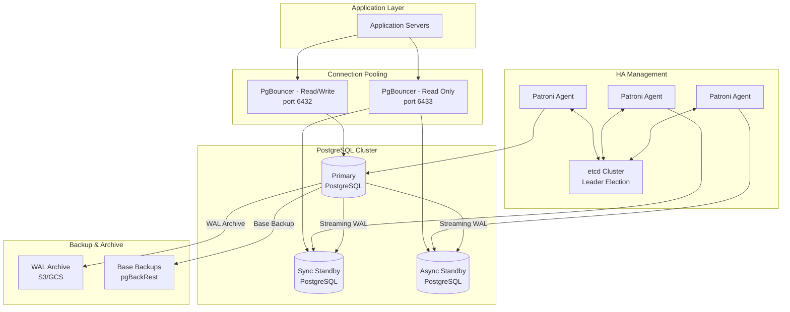
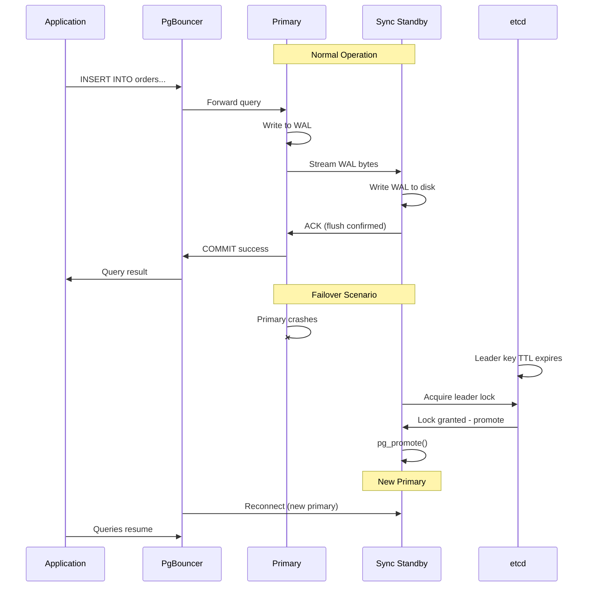

# Replication and High Availability

PostgreSQL provides enterprise-grade replication and high availability capabilities that enable organizations to build fault-tolerant database architectures capable of surviving hardware failures, network partitions, and even entire datacenter outages. Understanding the distinction between physical (streaming) replication and logical replication is fundamental to designing PostgreSQL HA architectures — physical replication provides byte-for-byte copies ideal for failover, while logical replication enables selective table-level data distribution, cross-version replication, and zero-downtime major version upgrades. Production PostgreSQL deployments require careful orchestration of connection pooling (PgBouncer), automated failover management (Patroni), and monitoring to achieve the five-nines availability that modern applications demand. The WAL (Write-Ahead Log) is the foundation of all PostgreSQL replication — every change is first written to WAL segments, which are then shipped to replicas either as raw bytes (streaming replication) or as decoded logical changes (logical replication).

## Quick Reference

- **Streaming replication**: Ships WAL bytes to standby servers; supports synchronous (zero data loss) and asynchronous (minimal lag) modes; standby can serve read queries (hot standby)
- **Logical replication**: Decodes WAL into logical change events; publishes specific tables to subscribers; supports cross-version replication and selective data distribution
- **WAL archiving**: Continuous archiving of WAL segments to object storage (S3, GCS) enables Point-in-Time Recovery (PITR) to any moment within the retention window
- **Patroni**: Industry-standard HA framework using distributed consensus (etcd/ZooKeeper/Consul) for leader election and automated failover with configurable fencing
- **PgBouncer**: Lightweight connection pooler supporting transaction-mode pooling; maps thousands of application connections to a small pool of PostgreSQL backend connections
- **Synchronous commit levels**: `off` (async), `local` (local WAL flush), `remote_write` (standby received), `on` (standby flushed), `remote_apply` (standby applied and queryable)
- **Replication slots**: Guarantee WAL retention until consumed by replica; prevent premature WAL recycling but can cause disk exhaustion if replica falls behind
- **pg_basebackup**: Built-in tool for taking consistent base backups from a running primary; foundation for initializing new replicas
- **Timeline IDs**: Increment on promotion; prevent accidentally connecting to a former primary after failover; WAL filenames include timeline for disambiguation

## When to Use

Streaming replication is the correct choice for high availability failover architectures where you need an identical copy of the entire database ready to take over within seconds. Use synchronous replication when zero data loss (RPO=0) is a hard requirement — financial systems, healthcare records, and audit logs where even a single lost transaction is unacceptable. Asynchronous streaming replication suits read-heavy workloads where you can tolerate milliseconds of replication lag in exchange for no write latency penalty on the primary. Deploy hot standby replicas to offload reporting queries, analytics workloads, and backup operations from the primary.

Logical replication is appropriate when you need selective table replication rather than full database copies — for example, replicating only the `orders` and `customers` tables to a reporting database while excluding large audit logs. Use logical replication for zero-downtime major version upgrades: set up logical replication from PostgreSQL 14 to PostgreSQL 16, let it catch up, then switch application connections. Logical replication also enables multi-master-like patterns where different databases own different tables but replicate subsets to each other for local reads.

PgBouncer is essential for any PostgreSQL deployment serving more than a few hundred concurrent connections. PostgreSQL forks a dedicated backend process per connection (~10MB RSS each), so 1,000 direct connections consume ~10GB of RAM just for connection overhead. PgBouncer in transaction mode allows 10,000+ application connections to share 100-200 actual PostgreSQL connections, dramatically reducing memory usage and context-switching overhead.

Patroni should be deployed whenever automated failover is required. Manual failover processes are error-prone and slow — Patroni detects primary failure within seconds and promotes the most up-to-date replica automatically, updating the distributed consensus store so connection routing (via HAProxy or DNS) redirects traffic to the new primary.

## Code Examples

### Configuring Streaming Replication

```sql
-- On the PRIMARY: Create replication user and configure
CREATE ROLE replicator WITH REPLICATION LOGIN PASSWORD 'secure_password';

-- postgresql.conf on PRIMARY
-- wal_level = replica                    -- minimum for streaming replication
-- max_wal_senders = 10                   -- max concurrent replication connections
-- wal_keep_size = 1GB                    -- retain WAL for slow replicas
-- synchronous_standby_names = 'FIRST 1 (standby1, standby2)'  -- sync replication
-- synchronous_commit = on                -- wait for standby WAL flush

-- pg_hba.conf: Allow replication connections from standby subnet
-- host replication replicator 10.0.1.0/24 scram-sha-256

-- On the STANDBY: Initialize from base backup
-- pg_basebackup -h primary-host -D /var/lib/postgresql/16/main -U replicator -Fp -Xs -P -R

-- The -R flag creates standby.signal and populates postgresql.auto.conf with:
-- primary_conninfo = 'host=primary-host port=5432 user=replicator password=secure_password'
```

### Configuring Logical Replication

```sql
-- On the PUBLISHER (source database):
-- postgresql.conf: wal_level = logical

-- Create a publication for specific tables
CREATE PUBLICATION orders_pub FOR TABLE orders, order_items, customers;

-- Or publish all tables in a schema
CREATE PUBLICATION analytics_pub FOR TABLES IN SCHEMA analytics;

-- On the SUBSCRIBER (target database):
-- Create matching table structures first (schema must exist)
CREATE SUBSCRIPTION orders_sub
    CONNECTION 'host=publisher-host port=5432 dbname=production user=replicator password=secret'
    PUBLICATION orders_pub
    WITH (copy_data = true, create_slot = true, synchronous_commit = 'off');

-- Monitor replication lag
SELECT slot_name, confirmed_flush_lsn, pg_current_wal_lsn(),
       pg_wal_lsn_diff(pg_current_wal_lsn(), confirmed_flush_lsn) AS lag_bytes
FROM pg_replication_slots;

-- Monitor subscription status
SELECT subname, received_lsn, latest_end_lsn,
       latest_end_time, last_msg_send_time
FROM pg_stat_subscription;
```

### PgBouncer Configuration

```ini
;; pgbouncer.ini - Production configuration

[databases]
; Map logical database names to actual PostgreSQL connections
production = host=primary.internal port=5432 dbname=myapp
production_ro = host=replica.internal port=5432 dbname=myapp

[pgbouncer]
; Listening configuration
listen_addr = 0.0.0.0
listen_port = 6432

; Pool mode: transaction mode is recommended for most applications
pool_mode = transaction

; Pool sizing
default_pool_size = 50          ; connections per user/database pair
min_pool_size = 10              ; pre-create connections
reserve_pool_size = 10          ; extra connections for burst traffic
reserve_pool_timeout = 3        ; seconds before using reserve pool

; Connection limits
max_client_conn = 10000         ; max application connections
max_db_connections = 200        ; max connections to PostgreSQL per database

; Timeouts
server_idle_timeout = 300       ; close idle server connections after 5 min
client_idle_timeout = 3600      ; close idle client connections after 1 hour
query_timeout = 30              ; kill queries running longer than 30s
client_login_timeout = 60       ; timeout for client authentication

; Health checks
server_check_query = SELECT 1
server_check_delay = 10

; Authentication
auth_type = scram-sha-256
auth_file = /etc/pgbouncer/userlist.txt

; Logging
log_connections = 1
log_disconnections = 1
log_pooler_errors = 1
stats_period = 60
```

### Patroni Configuration

```yaml
# patroni.yml - HA cluster configuration
scope: production-cluster
name: node1

restapi:
  listen: 0.0.0.0:8008
  connect_address: 10.0.1.10:8008

etcd3:
  hosts:
    - etcd1.internal:2379
    - etcd2.internal:2379
    - etcd3.internal:2379

bootstrap:
  dcs:
    ttl: 30
    loop_wait: 10
    retry_timeout: 10
    maximum_lag_on_failover: 1048576  # 1MB max lag for promotion candidate
    synchronous_mode: true            # enable synchronous replication
    synchronous_mode_strict: false    # allow async if no sync standby available
    postgresql:
      use_pg_rewind: true
      use_slots: true
      parameters:
        max_connections: 200
        max_wal_senders: 10
        wal_level: replica
        hot_standby: 'on'
        wal_log_hints: 'on'
        max_replication_slots: 10
        wal_keep_size: '2GB'

  initdb:
    - encoding: UTF8
    - data-checksums

postgresql:
  listen: 0.0.0.0:5432
  connect_address: 10.0.1.10:5432
  data_dir: /var/lib/postgresql/16/main
  authentication:
    superuser:
      username: postgres
      password: 'super_secret'
    replication:
      username: replicator
      password: 'repl_secret'
  parameters:
    shared_buffers: '8GB'
    effective_cache_size: '24GB'
    work_mem: '256MB'
    maintenance_work_mem: '2GB'

tags:
  nofailover: false
  noloadbalance: false
  clonefrom: false
  nosync: false
```

### Monitoring Replication Health

```sql
-- Check replication status on PRIMARY
SELECT client_addr, state, sent_lsn, write_lsn, flush_lsn, replay_lsn,
       pg_wal_lsn_diff(sent_lsn, replay_lsn) AS replay_lag_bytes,
       write_lag, flush_lag, replay_lag,
       sync_state
FROM pg_stat_replication;

-- Check replication slot status (prevent WAL bloat)
SELECT slot_name, slot_type, active,
       pg_wal_lsn_diff(pg_current_wal_lsn(), restart_lsn) AS retained_bytes,
       pg_size_pretty(pg_wal_lsn_diff(pg_current_wal_lsn(), restart_lsn)) AS retained_size
FROM pg_replication_slots;

-- On STANDBY: Check how far behind we are
SELECT now() - pg_last_xact_replay_timestamp() AS replication_delay,
       pg_is_in_recovery() AS is_standby,
       pg_last_wal_receive_lsn() AS last_received,
       pg_last_wal_replay_lsn() AS last_replayed;

-- Alert query: find slots retaining more than 10GB of WAL
SELECT slot_name, pg_size_pretty(pg_wal_lsn_diff(pg_current_wal_lsn(), restart_lsn)) AS retained
FROM pg_replication_slots
WHERE pg_wal_lsn_diff(pg_current_wal_lsn(), restart_lsn) > 10737418240;
```

## Architecture / Diagrams





## Common Pitfalls

**Replication slot WAL accumulation**: Inactive replication slots prevent WAL recycling indefinitely. A disconnected replica with an active slot can cause the primary to fill its disk with retained WAL segments. Always monitor `pg_replication_slots` and set `max_slot_wal_keep_size` (PostgreSQL 13+) to cap retention. Drop slots for permanently decommissioned replicas immediately.

**Using session-mode PgBouncer with prepared statements**: Transaction-mode pooling (recommended) breaks prepared statements because the backend connection changes between transactions. Applications using prepared statements must either switch to session mode (losing pooling benefits), use `DEALLOCATE ALL` at transaction boundaries, or use PgBouncer 1.21+ which supports protocol-level prepared statement tracking.

**Split-brain after network partition**: Without proper fencing, a partitioned primary may continue accepting writes while a new primary is promoted. Patroni prevents this through the DCS (distributed consensus store) — a primary that cannot reach the DCS demotes itself. Never disable watchdog or fencing mechanisms in production. Configure `watchdog.mode = required` in Patroni for critical workloads.

**Synchronous replication blocking writes on standby failure**: When `synchronous_commit = on` and the synchronous standby goes down, all writes on the primary block until the standby recovers or another standby is promoted to synchronous. Use `synchronous_mode_strict: false` in Patroni to allow temporary async operation, or configure multiple synchronous standbys with `FIRST 1 (standby1, standby2)`.

**Logical replication conflicts**: Logical replication does not replicate DDL changes. If you `ALTER TABLE` on the publisher without applying the same change on the subscriber, replication breaks. Establish a DDL change process that applies schema changes to subscribers first, then publishers. Also, logical replication can conflict with local writes on the subscriber — use `ALTER SUBSCRIPTION ... SET (disable_on_error = true)` and monitor for conflicts.

**Promoting a lagging async replica**: Promoting an asynchronous replica that is significantly behind the primary results in data loss equal to the replication lag at the time of failure. Patroni's `maximum_lag_on_failover` setting prevents promoting replicas that are too far behind, but this means failover may fail entirely if all replicas are lagging. Monitor replay lag continuously and investigate any sustained lag above your RPO threshold.

**Connection storm after failover**: When the primary fails and PgBouncer reconnects to the new primary, all queued client connections attempt to execute simultaneously, potentially overwhelming the new primary. Configure PgBouncer's `server_login_retry` and implement application-level circuit breakers with exponential backoff to smooth the reconnection surge.

## Real-World Use Cases

**E-commerce platform with global read replicas**: A large e-commerce company runs a primary PostgreSQL cluster in us-east-1 with synchronous replication to a standby in the same region (for HA) and asynchronous streaming replication to replicas in eu-west-1 and ap-southeast-1. Product catalog reads are served from local replicas (50ms latency vs 200ms cross-region), while all writes go to the primary. PgBouncer runs on each replica with 5,000 max client connections mapped to 100 PostgreSQL connections. During Black Friday, they temporarily increase `max_db_connections` and add additional read replicas using `pg_basebackup` from existing standbys.

**Financial services zero-downtime upgrades**: A payment processing company uses logical replication to perform major version upgrades (PostgreSQL 14 → 16) with zero downtime. They set up a new PostgreSQL 16 cluster, create logical subscriptions to all critical tables, wait for the initial data copy and catch-up to complete (verified by monitoring `pg_stat_subscription`), then perform a coordinated cutover: stop writes, verify replication is fully caught up (lag = 0 bytes), switch application connection strings, and resume. Total write downtime: under 5 seconds. They rehearse this process quarterly in staging environments.

**SaaS multi-tenant with Patroni**: A B2B SaaS platform runs 50 Patroni-managed PostgreSQL clusters (one per large enterprise tenant, shared clusters for smaller tenants). Each cluster has 3 nodes across 3 availability zones. Patroni uses etcd for consensus, with etcd itself running as a 5-node cluster for maximum resilience. Automated failover completes in under 30 seconds, and PgBouncer's health checks detect the new primary within 10 seconds. They use Patroni's REST API for operational automation: scheduled switchovers during maintenance windows, replica rebuilds after hardware replacement, and configuration changes rolled out node-by-node.

**Analytics pipeline with delayed replicas**: A data analytics company maintains a "delayed replica" that intentionally lags 1 hour behind the primary using `recovery_min_apply_delay = '1h'`. This provides a safety net against accidental data deletion — if someone drops a table or runs a bad UPDATE, they can query the delayed replica to recover the data without needing to restore from backup. They also use this replica for running expensive analytical queries that would otherwise impact production performance.

## Interview Questions

**Q: What is the difference between streaming replication and logical replication in PostgreSQL? When would you choose one over the other?**

A: Streaming replication ships raw WAL bytes to create an exact physical copy of the primary — every database, table, index, and system catalog is replicated. It's used for HA failover because the standby is immediately promotable. Logical replication decodes WAL into logical change events (INSERT, UPDATE, DELETE) and applies them to subscriber tables. Choose streaming for HA/failover (identical copy, fast promotion). Choose logical for selective table replication, cross-version replication, zero-downtime upgrades, or when the subscriber needs to have additional indexes or local tables not present on the publisher. Key limitation: logical replication doesn't replicate DDL, sequences, or large objects automatically.

**Q: How does Patroni handle a split-brain scenario during a network partition?**

A: Patroni prevents split-brain through the distributed consensus store (DCS). The primary must continuously renew its leader key in etcd/ZooKeeper/Consul within the TTL period. During a network partition, if the primary cannot reach the DCS, it cannot renew its key and must demote itself to read-only (or shut down PostgreSQL entirely if `watchdog.mode = required`). The remaining nodes that can reach the DCS will elect a new leader from the available standbys. The key insight is that the DCS acts as a fencing mechanism — a node that cannot prove it's the leader must assume it isn't. This is why the DCS cluster itself must be highly available (minimum 3 nodes, ideally 5) and distributed across failure domains.

**Q: Explain PgBouncer's pool modes and why transaction mode is preferred for most applications.**

A: PgBouncer offers three pool modes: session mode (client owns a server connection for the entire session), transaction mode (client gets a server connection only during a transaction), and statement mode (connection returned after each statement). Transaction mode is preferred because it maximizes connection sharing — a typical web request holds a connection for milliseconds during queries but the session lasts seconds. With transaction mode, 10,000 application connections can share 100 PostgreSQL connections because at any given moment only ~100 are actively in a transaction. The trade-off: session-level features (prepared statements, SET commands, advisory locks, LISTEN/NOTIFY) don't work across transactions because you may get a different backend connection. Applications must either avoid these features or use `server_reset_query` to clean state between transactions.

**Q: How would you design a PostgreSQL HA architecture that achieves RPO=0 and RTO<30 seconds?**

A: For RPO=0 (zero data loss), configure synchronous streaming replication with at least one synchronous standby (`synchronous_commit = on`, `synchronous_standby_names = 'FIRST 1 (standby1, standby2)'`). This ensures every committed transaction is confirmed written to at least one standby's WAL before acknowledging to the client. For RTO<30s, deploy Patroni with aggressive timing: `ttl=20`, `loop_wait=5`, `retry_timeout=10`. Use PgBouncer with health checks every 5 seconds so it detects the new primary quickly. The architecture: 3 PostgreSQL nodes across 3 AZs, Patroni on each node, 5-node etcd cluster (also cross-AZ), PgBouncer on application servers or as a separate tier with HAProxy for load balancing. Test failover monthly in production to verify RTO meets requirements.

**Q: What happens to in-flight transactions during a PostgreSQL failover?**

A: During failover, all in-flight transactions on the old primary are lost — they were never committed, so they don't exist in WAL and aren't replicated. Clients connected to the old primary receive connection errors. With synchronous replication, any transaction that received a COMMIT acknowledgment is guaranteed to exist on the new primary. Transactions that were in the COMMIT phase but hadn't received acknowledgment may or may not be on the new primary depending on exact timing. Applications must handle this by implementing idempotent operations and retry logic. PgBouncer clients will see connection errors and must reconnect — well-designed applications retry failed transactions automatically with exponential backoff.

## Production Tips

**Monitor replication lag with alerting thresholds**: Set up monitoring on `pg_stat_replication.replay_lag` with tiered alerts: warning at 10 seconds, critical at 60 seconds. For synchronous replicas, any sustained lag indicates a performance problem on the standby (slow disk, CPU contention). For async replicas, lag during peak write periods is normal but should recover during off-peak. Use `pg_wal_lsn_diff()` for byte-level precision. Alert on replication slot retained WAL exceeding 50% of available disk space.

**Implement connection pooling health checks**: Configure PgBouncer's `server_check_query` and set `server_check_delay` to 10-30 seconds. On the application side, implement connection validation (test query before use) and circuit breaker patterns. During failover, PgBouncer will return errors for a brief period — applications should retry with backoff rather than failing immediately. Consider running PgBouncer as a sidecar on each application server to eliminate the pooler as a single point of failure.

**Test failover regularly in production**: Schedule monthly failover tests using Patroni's `patronictl switchover` command during low-traffic periods. Measure actual RTO (time from initiation to first successful query on new primary), verify application reconnection behavior, and confirm monitoring alerts fire correctly. Document the runbook and rotate on-call engineers through the process so everyone is familiar with failover procedures.

**Use pgBackRest for backup and PITR**: pgBackRest provides parallel backup/restore, incremental backups, backup verification, and S3/GCS/Azure storage. Configure daily full backups and continuous WAL archiving for point-in-time recovery. Test restore procedures monthly — a backup you haven't tested restoring is not a backup. Set retention to match your compliance requirements (typically 30-90 days for PITR, 1 year for full backups).

**Size your connection pool correctly**: The optimal PostgreSQL `max_connections` is typically 2-4x CPU cores for OLTP workloads. A 16-core server should have `max_connections = 200` with PgBouncer's `default_pool_size = 50` per database. Monitor `pg_stat_activity` to find the actual peak concurrent active queries — if it's consistently below your pool size, you're over-provisioned (wasting memory). If queries frequently wait for connections, increase the pool or optimize slow queries.

## Related Topics

- [PostgreSQL Deep Dive](./postgresql.md) — Core PostgreSQL concepts, MVCC, indexing, and JSONB operations
- [Performance Tuning](./performance-tuning.md) — Query optimization, EXPLAIN ANALYZE, and vacuum tuning
- [Advanced Features](./advanced-features.md) — Partitioning, full-text search, window functions, and extensions
- [SQL Performance Tuning](../sql-foundations/sql-performance-tuning.md) — General SQL optimization techniques applicable to PostgreSQL
- [Distributed Systems](../../system-design/system-design/distributed-systems.md) — CAP theorem and consistency models relevant to replication design
