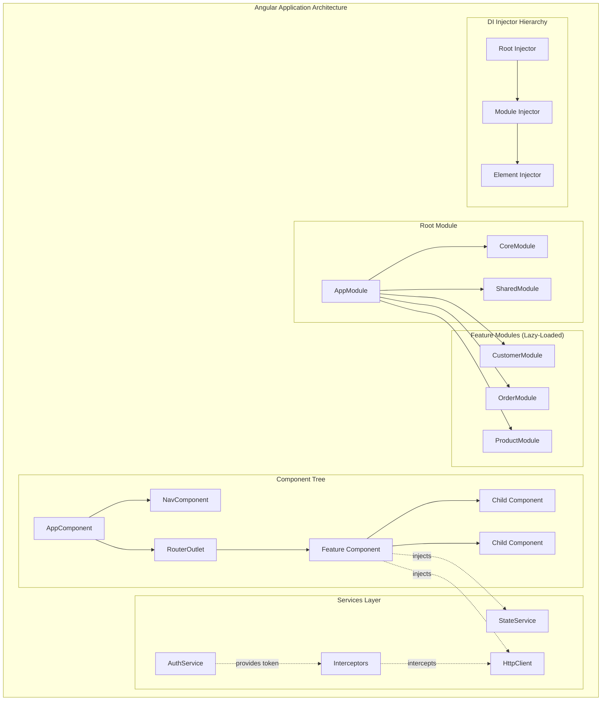
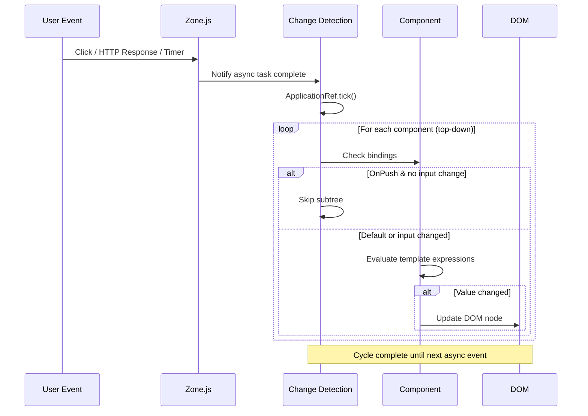

# Angular

## Quick Reference

- Angular is a TypeScript-based component framework maintained by Google for building single-page applications with a batteries-included architecture
- Core building blocks: Modules (NgModule), Components, Services, Directives, Pipes, Guards, Interceptors, and Resolvers
- Dependency injection is hierarchical: providers registered at module level create singletons, while component-level providers create per-component instances
- Change detection uses Zone.js to monkey-patch async APIs and trigger digest cycles; OnPush strategy skips subtrees unless inputs change or events fire
- RxJS is deeply integrated: HttpClient returns Observables, Router exposes Observable params, and reactive forms use valueChanges streams
- Angular CLI (`ng`) scaffolds projects, generates components/services, runs builds, and executes tests with Karma/Jasmine or Jest
- Standalone components (Angular 14+) allow building applications without NgModules, simplifying the mental model and enabling tree-shaking at the component level

## When to Use

Angular is the right choice when building large-scale enterprise applications that benefit from a strongly opinionated framework with built-in solutions for routing, forms, HTTP communication, internationalization, and testing. The framework enforces consistent project structure through its CLI and module system, making it ideal for teams of five or more developers who need to maintain code consistency without extensive custom linting rules. Choose Angular when your application requires complex form handling with both template-driven and reactive approaches, when you need a mature dependency injection system for managing service lifetimes and testability, or when your team already has TypeScript expertise and wants first-class type safety throughout the entire stack. Angular excels in enterprise dashboards, internal tools, and line-of-business applications where long-term maintainability outweighs initial development speed. It is particularly well-suited for applications that need server-side rendering via Angular Universal, lazy-loaded feature modules for performance, and strict separation of concerns between presentation and business logic. Prefer Angular over React when you want a complete framework rather than assembling libraries, and over Vue when you need stronger typing and a more structured architecture for large teams.

## Modules

NgModules are the organizational unit in Angular that group related components, directives, pipes, and services into cohesive blocks of functionality. Every Angular application has at least one module, the root `AppModule`, which bootstraps the application. Feature modules encapsulate domain-specific functionality and can be eagerly loaded, lazy-loaded, or preloaded based on routing configuration.

The `@NgModule` decorator accepts a metadata object with four key arrays: `declarations` (components, directives, and pipes owned by this module), `imports` (other modules whose exported declarations this module needs), `exports` (declarations made available to importing modules), and `providers` (services available to the module's injector). Understanding the boundary between declarations and imports is critical for avoiding circular dependencies and maintaining clean module architecture.

**Feature modules** encapsulate a vertical slice of application functionality. A `CustomerModule` might declare `CustomerListComponent`, `CustomerDetailComponent`, and `CustomerFormComponent`, import `SharedModule` for common UI elements, and provide `CustomerService` for data access. Feature modules enable lazy loading: the router loads the module bundle only when the user navigates to that feature, reducing initial bundle size significantly.

**Shared modules** export commonly used components, directives, and pipes that multiple feature modules need. A typical `SharedModule` exports `CommonModule`, form modules, and reusable UI components like buttons, modals, and data tables. Shared modules should never provide services (which would create multiple instances when imported by lazy-loaded modules) unless using `forRoot()` / `forChild()` patterns.

**Core modules** contain singleton services and application-wide components (header, footer, navigation) that should only be instantiated once. The `CoreModule` is imported exclusively by `AppModule` and includes a guard constructor that throws an error if any other module attempts to import it, preventing accidental multiple instantiation.

```typescript
// Feature module with lazy loading support
@NgModule({
  declarations: [
    CustomerListComponent,
    CustomerDetailComponent,
    CustomerFormComponent,
    CustomerSearchPipe
  ],
  imports: [
    CommonModule,
    SharedModule,
    CustomerRoutingModule,
    ReactiveFormsModule
  ],
  providers: [
    CustomerService,
    CustomerResolver
  ]
})
export class CustomerModule {}

// Lazy-loaded route configuration in AppRoutingModule
const routes: Routes = [
  {
    path: 'customers',
    loadChildren: () => import('./customer/customer.module')
      .then(m => m.CustomerModule)
  },
  {
    path: 'orders',
    loadChildren: () => import('./order/order.module')
      .then(m => m.OrderModule)
  }
];

// Core module with re-import guard
@NgModule({
  declarations: [HeaderComponent, FooterComponent, SidenavComponent],
  imports: [CommonModule, RouterModule],
  exports: [HeaderComponent, FooterComponent, SidenavComponent]
})
export class CoreModule {
  constructor(@Optional() @SkipSelf() parentModule: CoreModule) {
    if (parentModule) {
      throw new Error('CoreModule is already loaded. Import it only in AppModule.');
    }
  }
}
```

## Components

Components are the fundamental building blocks of Angular's UI layer. Each component consists of a TypeScript class decorated with `@Component`, an HTML template, and optional styles. Components manage a view through data binding, respond to user interactions through event binding, and communicate with parent and child components through inputs, outputs, and content projection.

The component lifecycle is governed by a series of hooks that Angular calls at specific moments: `ngOnInit` (after first input binding), `ngOnChanges` (when input properties change), `ngDoCheck` (custom change detection), `ngAfterViewInit` (after view children are initialized), `ngAfterContentInit` (after projected content is initialized), and `ngOnDestroy` (before the component is removed from the DOM). Proper use of lifecycle hooks prevents memory leaks and ensures efficient resource management.

**Input and output bindings** form the component communication contract. `@Input()` properties receive data from parent components via property binding (`[property]="value"`), while `@Output()` properties emit events to parents via event binding (`(event)="handler($event)"`). This unidirectional data flow makes component interactions predictable and testable.

**Content projection** (`ng-content`) allows parent components to inject arbitrary template content into designated slots within a child component. Multi-slot projection uses `select` attributes to route different content fragments to different slots, enabling flexible component composition patterns like card layouts with header, body, and footer slots.

**View encapsulation** controls how component styles interact with the rest of the application. The default `Emulated` mode scopes styles to the component using attribute selectors. `ShadowDom` uses native Shadow DOM for true isolation. `None` makes styles global, which is useful for theme overrides but risks unintended style leakage.

```typescript
// Component with lifecycle hooks and communication patterns
@Component({
  selector: 'app-product-card',
  template: `
    <div class="product-card" [class.featured]="product.featured">
      <ng-content select="[card-header]"></ng-content>
      <div class="product-body">
        <h3>{{ product.name }}</h3>
        <p class="price">{{ product.price | currency }}</p>
        <p class="stock" [ngClass]="stockClass">
          {{ product.stock > 0 ? 'In Stock' : 'Out of Stock' }}
        </p>
      </div>
      <div class="product-actions">
        <button (click)="onAddToCart()" [disabled]="product.stock === 0">
          Add to Cart
        </button>
      </div>
      <ng-content select="[card-footer]"></ng-content>
    </div>
  `,
  styleUrls: ['./product-card.component.scss'],
  changeDetection: ChangeDetectionStrategy.OnPush
})
export class ProductCardComponent implements OnInit, OnDestroy {
  @Input() product!: Product;
  @Output() addToCart = new EventEmitter<Product>();

  stockClass = '';
  private destroy$ = new Subject<void>();

  ngOnInit(): void {
    this.stockClass = this.product.stock > 10 ? 'high' : 
                      this.product.stock > 0 ? 'low' : 'none';
  }

  onAddToCart(): void {
    this.addToCart.emit(this.product);
  }

  ngOnDestroy(): void {
    this.destroy$.next();
    this.destroy$.complete();
  }
}
```

## Services

Services in Angular are classes decorated with `@Injectable` that encapsulate business logic, data access, and shared state outside of components. The separation of concerns between components (presentation) and services (logic) is a core architectural principle that improves testability, reusability, and maintainability. Services are the primary mechanism for sharing data and behavior across multiple components.

The `@Injectable({ providedIn: 'root' })` decorator registers the service as a singleton at the application root injector, making it available everywhere without explicitly adding it to a module's `providers` array. This tree-shakable provider syntax means the service is only included in the bundle if it is actually injected somewhere, reducing dead code in production builds.

Services commonly follow the **repository pattern** for data access, abstracting HTTP calls behind a clean interface. A `ProductService` exposes methods like `getAll()`, `getById(id)`, `create(product)`, and `delete(id)`, each returning an Observable. Components subscribe to these Observables and the service handles caching, error transformation, and retry logic internally.

**State management services** use BehaviorSubjects to maintain and broadcast application state. A `CartService` might hold a `BehaviorSubject<CartItem[]>` and expose it as a read-only Observable via `asObservable()`. Components subscribe to the cart state and the service provides mutation methods (`addItem`, `removeItem`, `clearCart`) that update the subject and notify all subscribers.

**HTTP interceptors** are specialized services that intercept outgoing requests and incoming responses globally. Common interceptor use cases include attaching authentication tokens to every request, logging request/response pairs, handling global error responses (401 redirects to login, 500 retry logic), and adding correlation IDs for distributed tracing.

```typescript
// Data access service with caching and error handling
@Injectable({ providedIn: 'root' })
export class ProductService {
  private apiUrl = '/api/products';
  private cache$ = new BehaviorSubject<Product[] | null>(null);

  constructor(private http: HttpClient) {}

  getAll(forceRefresh = false): Observable<Product[]> {
    if (!forceRefresh && this.cache$.value) {
      return of(this.cache$.value);
    }

    return this.http.get<Product[]>(this.apiUrl).pipe(
      tap(products => this.cache$.next(products)),
      retry({ count: 2, delay: 1000 }),
      catchError(this.handleError<Product[]>('getAll', []))
    );
  }

  getById(id: string): Observable<Product> {
    return this.http.get<Product>(`${this.apiUrl}/${id}`).pipe(
      catchError(this.handleError<Product>('getById'))
    );
  }

  create(product: CreateProductDto): Observable<Product> {
    return this.http.post<Product>(this.apiUrl, product).pipe(
      tap(newProduct => {
        const current = this.cache$.value || [];
        this.cache$.next([...current, newProduct]);
      }),
      catchError(this.handleError<Product>('create'))
    );
  }

  private handleError<T>(operation: string, fallback?: T) {
    return (error: HttpErrorResponse): Observable<T> => {
      console.error(`${operation} failed:`, error.message);
      if (fallback !== undefined) return of(fallback);
      return throwError(() => new Error(`${operation} failed: ${error.message}`));
    };
  }
}

// HTTP Interceptor for authentication
@Injectable()
export class AuthInterceptor implements HttpInterceptor {
  constructor(private authService: AuthService) {}

  intercept(req: HttpRequest<unknown>, next: HttpHandler): Observable<HttpEvent<unknown>> {
    const token = this.authService.getToken();

    const authReq = token
      ? req.clone({ setHeaders: { Authorization: `Bearer ${token}` } })
      : req;

    return next.handle(authReq).pipe(
      catchError((error: HttpErrorResponse) => {
        if (error.status === 401) {
          this.authService.logout();
        }
        return throwError(() => error);
      })
    );
  }
}
```

## Dependency Injection

Angular's dependency injection (DI) system is a hierarchical injector tree that manages the creation and lifetime of service instances. DI is the mechanism by which components and services declare their dependencies without creating them directly, enabling loose coupling, testability, and flexible configuration. Understanding the injector hierarchy is essential for controlling service scope and avoiding common pitfalls like unintended multiple instances.

The **injector hierarchy** mirrors the component tree. At the top is the root injector (platform and application level), followed by module injectors for eagerly loaded modules, and then element injectors for each component and directive. When a component requests a dependency, Angular walks up the injector tree from the component's element injector to the root until it finds a provider. This hierarchical resolution enables powerful patterns like scoped services and provider overrides.

**Provider types** determine how the injector creates instances. `useClass` creates a new instance of the specified class. `useExisting` creates an alias to an existing provider. `useFactory` calls a factory function with optional dependencies. `useValue` provides a static value. These provider types enable advanced patterns like conditional service selection, configuration injection, and abstract class implementations.

**Injection tokens** (`InjectionToken<T>`) provide type-safe keys for non-class dependencies. When you need to inject a configuration object, a string constant, or a function, you create an `InjectionToken` and register a provider for it. This avoids the ambiguity of using string keys and provides compile-time type checking.

**Multi-providers** allow multiple values to be registered under the same token. When you use `multi: true` in a provider definition, the injector collects all registered values into an array. This pattern is used extensively by Angular itself for HTTP interceptors, validators, and route guards, allowing multiple implementations to be composed together.

```typescript
// Hierarchical DI with various provider types
// Abstract service interface
export abstract class NotificationService {
  abstract send(message: string): Observable<void>;
}

// Concrete implementations
@Injectable()
export class EmailNotificationService extends NotificationService {
  send(message: string): Observable<void> {
    return this.http.post<void>('/api/notifications/email', { message });
  }
  constructor(private http: HttpClient) { super(); }
}

@Injectable()
export class SmsNotificationService extends NotificationService {
  send(message: string): Observable<void> {
    return this.http.post<void>('/api/notifications/sms', { message });
  }
  constructor(private http: HttpClient) { super(); }
}

// Factory provider with conditional logic
const notificationFactory = (config: AppConfig, http: HttpClient) => {
  return config.notificationChannel === 'sms'
    ? new SmsNotificationService(http)
    : new EmailNotificationService(http);
};

// Module configuration with various provider types
@NgModule({
  providers: [
    // Factory provider
    {
      provide: NotificationService,
      useFactory: notificationFactory,
      deps: [APP_CONFIG, HttpClient]
    },
    // InjectionToken with value
    {
      provide: APP_CONFIG,
      useValue: { apiUrl: '/api', notificationChannel: 'email' }
    },
    // Multi-provider for HTTP interceptors
    {
      provide: HTTP_INTERCEPTORS,
      useClass: AuthInterceptor,
      multi: true
    },
    {
      provide: HTTP_INTERCEPTORS,
      useClass: LoggingInterceptor,
      multi: true
    }
  ]
})
export class AppModule {}

// Component-level provider (creates new instance per component)
@Component({
  selector: 'app-editor',
  providers: [EditorStateService],  // Scoped to this component subtree
  template: `<app-toolbar></app-toolbar><app-canvas></app-canvas>`
})
export class EditorComponent {
  constructor(private editorState: EditorStateService) {}
}
```

## RxJS Operators

RxJS (Reactive Extensions for JavaScript) is Angular's foundation for handling asynchronous operations and event streams. Angular uses Observables throughout its APIs: HttpClient returns Observables for HTTP responses, Router exposes route parameters as Observables, reactive forms emit value changes as Observable streams, and event emitters are built on Subjects. Mastering RxJS operators is essential for writing idiomatic Angular code.

**Transformation operators** modify emitted values. `map` transforms each value through a projection function. `switchMap` maps each value to an inner Observable and cancels the previous inner subscription when a new value arrives, making it ideal for search-as-you-type and route parameter changes. `mergeMap` (flatMap) subscribes to all inner Observables concurrently without cancellation, suitable for fire-and-forget operations. `concatMap` queues inner Observables and processes them sequentially, preserving order for operations that must not overlap.

**Filtering operators** control which values pass through the stream. `filter` emits only values satisfying a predicate. `distinctUntilChanged` suppresses consecutive duplicate values, useful for preventing redundant API calls when form values change. `debounceTime` waits for a pause in emissions before forwarding the latest value, essential for search inputs to avoid firing a request on every keystroke. `take` and `takeUntil` limit the stream lifetime, with `takeUntil` being the standard pattern for unsubscribing in `ngOnDestroy`.

**Combination operators** merge multiple streams. `combineLatest` emits whenever any source emits, providing the latest value from each source. `forkJoin` waits for all sources to complete and emits their final values as an array, similar to `Promise.all`. `merge` interleaves emissions from multiple sources into a single stream. `withLatestFrom` combines the source emission with the latest value from another Observable without triggering on the other Observable's emissions.

**Error handling operators** manage failures in streams. `catchError` intercepts errors and returns a fallback Observable, preventing the stream from terminating. `retry` resubscribes to the source a specified number of times on error. `retryWhen` provides fine-grained control over retry timing with exponential backoff patterns.

```typescript
// Common RxJS patterns in Angular
@Component({
  selector: 'app-product-search',
  template: `
    <input [formControl]="searchControl" placeholder="Search products...">
    <div *ngFor="let product of results$ | async">
      {{ product.name }} - {{ product.price | currency }}
    </div>
  `
})
export class ProductSearchComponent implements OnInit, OnDestroy {
  searchControl = new FormControl('');
  results$!: Observable<Product[]>;
  private destroy$ = new Subject<void>();

  constructor(
    private productService: ProductService,
    private route: ActivatedRoute
  ) {}

  ngOnInit(): void {
    // Search with debounce, distinct, and switchMap
    this.results$ = this.searchControl.valueChanges.pipe(
      debounceTime(300),
      distinctUntilChanged(),
      filter(term => term.length >= 2),
      switchMap(term => this.productService.search(term).pipe(
        catchError(() => of([]))  // Return empty on error
      )),
      takeUntil(this.destroy$)
    );

    // Combine route params with query params
    combineLatest([
      this.route.params,
      this.route.queryParams
    ]).pipe(
      takeUntil(this.destroy$)
    ).subscribe(([params, queryParams]) => {
      this.loadCategory(params['id'], queryParams['sort']);
    });
  }

  ngOnDestroy(): void {
    this.destroy$.next();
    this.destroy$.complete();
  }
}

// Service with retry and exponential backoff
@Injectable({ providedIn: 'root' })
export class ResilientHttpService {
  fetchWithRetry<T>(url: string): Observable<T> {
    return this.http.get<T>(url).pipe(
      retry({
        count: 3,
        delay: (error, retryCount) => {
          const delayMs = Math.pow(2, retryCount) * 1000;
          console.warn(`Retry ${retryCount} after ${delayMs}ms`);
          return timer(delayMs);
        }
      }),
      catchError(error => {
        console.error('All retries exhausted:', error);
        return throwError(() => error);
      })
    );
  }

  constructor(private http: HttpClient) {}
}
```

## Change Detection

Change detection is the mechanism by which Angular keeps the DOM in sync with component state. Whenever an asynchronous event occurs (user interaction, HTTP response, timer callback), Angular runs change detection starting from the root component and traversing the entire component tree, checking each component's template bindings for changes. Understanding change detection is critical for building performant applications, especially those with large component trees or frequent updates.

**Zone.js** is the library that makes automatic change detection possible. It monkey-patches all asynchronous browser APIs (setTimeout, Promise, addEventListener, XMLHttpRequest, etc.) so that Angular is notified whenever an async operation completes. When Zone.js detects an async task completion, it triggers `ApplicationRef.tick()`, which runs change detection on the entire component tree. This "magic" means developers rarely need to manually trigger change detection, but it comes at a performance cost for applications with many components.

**Default change detection** checks every component in the tree on every cycle. Angular compares the current value of each template expression with its previous value. If any value has changed, Angular updates the corresponding DOM node. For small applications this is fast enough, but for applications with hundreds of components or high-frequency updates (animations, real-time data), default change detection becomes a bottleneck.

**OnPush change detection** (`ChangeDetectionStrategy.OnPush`) is the primary optimization strategy. A component with OnPush is only checked when one of its `@Input()` references changes (shallow comparison), when an event handler within the component fires, when an Observable bound via the `async` pipe emits, or when change detection is manually triggered via `ChangeDetectorRef.markForCheck()`. OnPush effectively prunes entire subtrees from the change detection cycle, dramatically reducing the number of checks per cycle.

**Signals** (Angular 16+) represent the future of Angular's reactivity model. Signals are synchronous reactive primitives that track their dependencies and notify consumers when their value changes. Unlike Zone.js-based change detection that checks everything, signal-based change detection only updates components that read a changed signal. This fine-grained reactivity eliminates the need for Zone.js entirely in signal-based applications, reducing bundle size and improving performance.

```typescript
// OnPush component with manual change detection control
@Component({
  selector: 'app-live-dashboard',
  changeDetection: ChangeDetectionStrategy.OnPush,
  template: `
    <div class="metrics-grid">
      <app-metric-card
        *ngFor="let metric of metrics; trackBy: trackByMetricId"
        [metric]="metric"
        (click)="selectMetric(metric)">
      </app-metric-card>
    </div>
    <div class="selected" *ngIf="selectedMetric">
      {{ selectedMetric.name }}: {{ selectedMetric.value }}
    </div>
  `
})
export class LiveDashboardComponent implements OnInit, OnDestroy {
  metrics: Metric[] = [];
  selectedMetric: Metric | null = null;
  private destroy$ = new Subject<void>();

  constructor(
    private metricsService: MetricsService,
    private cdr: ChangeDetectorRef
  ) {}

  ngOnInit(): void {
    // WebSocket stream updates metrics every second
    this.metricsService.getLiveMetrics().pipe(
      takeUntil(this.destroy$)
    ).subscribe(metrics => {
      this.metrics = metrics;  // New array reference triggers OnPush
      this.cdr.markForCheck(); // Explicitly mark for check
    });
  }

  selectMetric(metric: Metric): void {
    this.selectedMetric = metric;
    // Event handler automatically triggers change detection
  }

  trackByMetricId(index: number, metric: Metric): string {
    return metric.id;
  }

  ngOnDestroy(): void {
    this.destroy$.next();
    this.destroy$.complete();
  }
}

// Signal-based component (Angular 16+)
@Component({
  selector: 'app-counter',
  standalone: true,
  template: `
    <p>Count: {{ count() }}</p>
    <p>Double: {{ doubleCount() }}</p>
    <button (click)="increment()">+1</button>
  `
})
export class CounterComponent {
  count = signal(0);
  doubleCount = computed(() => this.count() * 2);

  increment(): void {
    this.count.update(c => c + 1);
  }
}
```

## Architecture and Diagrams





## Common Pitfalls

1. **Memory leaks from unsubscribed Observables**: Subscribing to long-lived Observables (route params, WebSocket streams, interval timers) without unsubscribing causes memory leaks. Always use `takeUntil(destroy$)` pattern, the `async` pipe (which auto-unsubscribes), or the `DestroyRef` inject pattern (Angular 16+). Finite Observables like single HTTP requests complete automatically and do not need explicit unsubscription.

2. **Circular dependency between services**: When ServiceA injects ServiceB and ServiceB injects ServiceA, Angular throws a circular dependency error at runtime. Resolve this by extracting shared logic into a third service, using `forwardRef()` for class reference ordering issues, or restructuring the dependency graph to be acyclic.

3. **Providing services in SharedModule without forRoot**: If a service is provided in a SharedModule that is imported by multiple lazy-loaded modules, each lazy module gets its own instance instead of a singleton. Use `providedIn: 'root'` for application-wide singletons, or implement the `forRoot()` static method pattern that returns providers only when called from the root module.

4. **Excessive change detection with Default strategy**: Using the Default change detection strategy in components that render large lists or receive frequent updates causes Angular to re-evaluate all template bindings on every async event, even if nothing relevant changed. Switch to OnPush for any component that receives data via inputs or Observables, and use `trackBy` functions with `*ngFor` to prevent unnecessary DOM recreation.

5. **Mutating input objects instead of creating new references**: With OnPush change detection, Angular only detects input changes via reference comparison. Mutating an object property (e.g., `this.user.name = 'new'`) does not trigger change detection because the object reference is the same. Always create new object references with spread syntax (`{ ...this.user, name: 'new' }`) or use immutable data patterns.

6. **Subscribing in templates without async pipe**: Calling `.subscribe()` in component code and assigning results to properties works but loses the benefits of OnPush optimization and automatic cleanup. The `async` pipe subscribes, triggers `markForCheck()` on emission, and unsubscribes on component destruction, making it the preferred approach for template-bound Observables.

## Real-World Use Cases

- **Enterprise admin dashboards**: Large organizations use Angular for internal tools with complex data grids, role-based access control, and multi-step workflows. Angular's module system enables teams to own feature modules independently, lazy loading keeps initial load fast despite hundreds of components, and the DI system makes it straightforward to swap service implementations between environments.

- **Banking and financial applications**: Angular's strict typing, built-in form validation (both template-driven and reactive), and comprehensive testing utilities make it well-suited for applications where data integrity is critical. Reactive forms with custom validators ensure complex financial inputs are validated consistently, and interceptors handle token refresh flows transparently.

- **Real-time monitoring systems**: Applications displaying live metrics, alerts, and streaming data leverage Angular's RxJS integration. WebSocket connections wrapped in Observables feed data through transformation pipelines (throttle, buffer, scan for running averages) directly into OnPush components via the async pipe, achieving smooth 60fps updates without manual DOM manipulation.

- **Multi-tenant SaaS platforms**: Angular's hierarchical DI enables tenant-specific configuration injection at the module level. A tenant resolver loads configuration on app initialization, and services throughout the application receive tenant-specific API URLs, feature flags, and branding without conditional logic scattered across components.

## Interview Questions

**Q: What is the difference between a BehaviorSubject and a Subject in Angular services?**
A: A Subject emits values only to subscribers who are listening at the time of emission; late subscribers miss previous values. A BehaviorSubject requires an initial value and immediately emits the current value to new subscribers, making it ideal for state management where components need the latest state upon subscription regardless of when they subscribe.

**Q: Explain the difference between OnPush and Default change detection strategies.**
A: Default strategy checks a component on every change detection cycle regardless of whether its inputs changed. OnPush only checks a component when an input reference changes, an event fires within the component, an Observable bound via async pipe emits, or `markForCheck()` is called manually. OnPush dramatically reduces unnecessary checks in large component trees.

**Q: How does lazy loading work in Angular and why is it important?**
A: Lazy loading defers the download of feature module bundles until the user navigates to a route associated with that module. The router uses dynamic `import()` syntax to load the module chunk on demand. This reduces the initial bundle size, improving first contentful paint and time-to-interactive. Preloading strategies can load lazy modules in the background after the initial load completes.

**Q: What is the purpose of trackBy in ngFor?**
A: By default, `*ngFor` identifies list items by object reference. When the array is replaced (common with OnPush and immutable patterns), Angular destroys and recreates all DOM elements even if the data is the same. `trackBy` provides a stable identity function (typically returning an ID), allowing Angular to reuse existing DOM elements for items that have not changed, significantly improving rendering performance for large lists.

**Q: How do you prevent memory leaks in Angular components?**
A: Use the `takeUntil` pattern with a destroy Subject that emits in `ngOnDestroy`, prefer the `async` pipe which auto-unsubscribes, use `DestroyRef` with `takeUntilDestroyed()` in Angular 16+, and avoid storing subscription references manually. For event listeners added via `Renderer2` or native APIs, remove them explicitly in `ngOnDestroy`.

## Production Tips

- **Enable OnPush everywhere**: Default to `ChangeDetectionStrategy.OnPush` for all components and only use Default when you have a specific reason. This single change can reduce change detection cycles by 80% or more in large applications. Combine with immutable data patterns and the async pipe for maximum benefit.

- **Bundle analysis and lazy loading**: Use `ng build --stats-json` with webpack-bundle-analyzer to identify oversized chunks. Split feature modules along route boundaries and lazy-load everything except the landing page. Consider preloading strategies (`PreloadAllModules` or custom strategies based on user behavior) to balance initial load with navigation speed.

- **AOT compilation and tree-shaking**: Always build with Ahead-of-Time compilation (`--aot`, default since Angular 9) which catches template errors at build time, reduces bundle size by eliminating the template compiler, and improves runtime performance. Ensure services use `providedIn: 'root'` for tree-shaking rather than module-level providers arrays.

- **Error tracking and monitoring**: Implement a global `ErrorHandler` that captures unhandled exceptions and sends them to an error tracking service (Sentry, Datadog). Add HTTP interceptors that log response times and error rates. Use Angular's built-in performance profiling (`ng.profiler.timeChangeDetection()`) in development to identify slow components.

- **State management at scale**: For applications with complex shared state, consider NgRx (Redux pattern) or Akita for predictable state mutations with time-travel debugging. For simpler cases, BehaviorSubject-based services with the facade pattern provide sufficient state management without the boilerplate of a full Redux implementation.

## Related Topics

- [TypeScript](./typescript.md) - Angular is built entirely on TypeScript and leverages advanced type features like decorators, generics, and mapped types throughout its API
- [React](./react.md) - React offers a component-based alternative with a more flexible ecosystem, useful for comparing architectural trade-offs between opinionated frameworks and library-based approaches
- [JavaScript](./javascript.md) - Understanding JavaScript fundamentals like closures, prototypes, and the event loop is essential for effective Angular development and debugging Zone.js behavior
