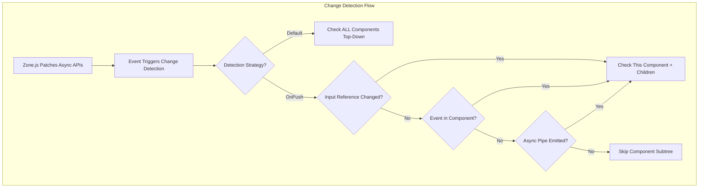
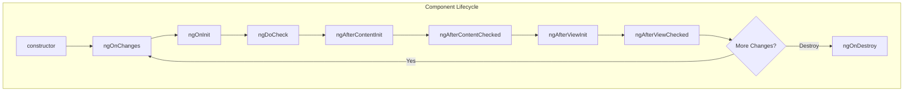
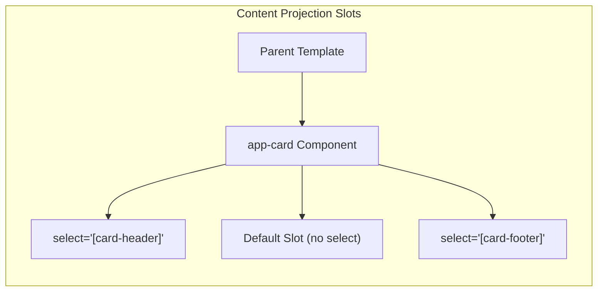

# Angular Components & Templates

## Quick Reference

- Components are the fundamental building blocks of Angular applications — each combines a TypeScript class, an HTML template, and optional CSS styles into a reusable UI unit decorated with `@Component()`
- Angular provides eight lifecycle hooks executed in order: `ngOnChanges` → `ngOnInit` → `ngDoCheck` → `ngAfterContentInit` → `ngAfterContentChecked` → `ngAfterViewInit` → `ngAfterViewChecked` → `ngOnDestroy`
- The `OnPush` change detection strategy skips component subtree checks unless inputs change by reference, an event fires within the component, or an Observable bound via `async` pipe emits
- Standalone components (Angular 14+) eliminate the need for `NgModule` declarations by setting `standalone: true` and importing dependencies directly in the component decorator
- Structural directives (`*ngIf`, `*ngFor`, `*ngSwitch`) manipulate the DOM by adding or removing elements, while attribute directives modify appearance or behavior of existing elements
- Pipes transform displayed values in templates — pure pipes recalculate only when input reference changes, impure pipes run on every change detection cycle

## When to Use

Angular components and templates form the view layer of every Angular application. You should deeply understand this topic when:

- Building enterprise applications where component architecture decisions affect long-term maintainability and team velocity across dozens of feature modules
- Optimizing rendering performance in data-heavy dashboards where hundreds of components update simultaneously and default change detection becomes a bottleneck
- Designing reusable component libraries shared across multiple applications, requiring careful API design with `@Input()`, `@Output()`, and content projection patterns
- Migrating legacy AngularJS applications to modern Angular, where understanding standalone components and the module-free architecture simplifies the transition path
- Working on applications with complex parent-child communication patterns where `ViewChild`, `ContentChild`, and service-based communication each have distinct trade-offs

## Code Examples

### Component with Lifecycle Hooks and Input/Output

```typescript
import { Component, Input, Output, EventEmitter, OnInit, OnChanges, OnDestroy, SimpleChanges, ChangeDetectionStrategy } from '@angular/core';

interface Product {
  id: string;
  name: string;
  price: number;
  category: string;
}

@Component({
  selector: 'app-product-card',
  standalone: true,
  changeDetection: ChangeDetectionStrategy.OnPush,
  template: `
    <div class="product-card" [class.featured]="featured">
      <h3>{{ product.name }}</h3>
      <p class="price">{{ product.price | currency:'USD':'symbol':'1.2-2' }}</p>
      <p class="category">{{ product.category | titlecase }}</p>
      <button (click)="onAddToCart()" [disabled]="!inStock">
        {{ inStock ? 'Add to Cart' : 'Out of Stock' }}
      </button>
    </div>
  `,
  styles: [`
    .product-card { border: 1px solid #e0e0e0; padding: 16px; border-radius: 8px; }
    .featured { border-color: #1976d2; box-shadow: 0 2px 8px rgba(25, 118, 210, 0.2); }
    .price { font-size: 1.25rem; font-weight: 600; color: #2e7d32; }
  `]
})
export class ProductCardComponent implements OnInit, OnChanges, OnDestroy {
  @Input({ required: true }) product!: Product;
  @Input() featured = false;
  @Input() inStock = true;

  @Output() addToCart = new EventEmitter<Product>();
  @Output() viewed = new EventEmitter<string>();

  private viewTimer: ReturnType<typeof setTimeout> | null = null;

  ngOnChanges(changes: SimpleChanges): void {
    if (changes['product'] && !changes['product'].firstChange) {
      console.log('Product changed from', changes['product'].previousValue?.name,
                  'to', changes['product'].currentValue?.name);
    }
  }

  ngOnInit(): void {
    // Track that user viewed this product after 2 seconds
    this.viewTimer = setTimeout(() => {
      this.viewed.emit(this.product.id);
    }, 2000);
  }

  ngOnDestroy(): void {
    if (this.viewTimer) {
      clearTimeout(this.viewTimer);
    }
  }

  onAddToCart(): void {
    this.addToCart.emit(this.product);
  }
}
```

### Content Projection with ng-content

```typescript
import { Component, ContentChild, AfterContentInit, TemplateRef } from '@angular/core';

@Component({
  selector: 'app-card',
  standalone: true,
  template: `
    <div class="card">
      <div class="card-header">
        <ng-content select="[card-header]"></ng-content>
      </div>
      <div class="card-body">
        <ng-content></ng-content>
      </div>
      <div class="card-footer" *ngIf="hasFooter">
        <ng-content select="[card-footer]"></ng-content>
      </div>
    </div>
  `
})
export class CardComponent implements AfterContentInit {
  @ContentChild('footerTemplate') footerTemplate?: TemplateRef<unknown>;
  hasFooter = false;

  ngAfterContentInit(): void {
    this.hasFooter = !!this.footerTemplate;
  }
}

// Usage in parent template:
// <app-card>
//   <h2 card-header>User Profile</h2>
//   <p>Main content goes here as default slot</p>
//   <ng-template #footerTemplate>
//     <button card-footer>Save Changes</button>
//   </ng-template>
// </app-card>
```

### ViewChild and Template References

```typescript
import { Component, ViewChild, AfterViewInit, ElementRef } from '@angular/core';
import { MatPaginator } from '@angular/material/paginator';
import { MatSort } from '@angular/material/sort';
import { MatTableDataSource } from '@angular/material/table';

@Component({
  selector: 'app-data-table',
  standalone: true,
  template: `
    <input #searchInput
           (keyup)="applyFilter($event)"
           placeholder="Search...">

    <table mat-table [dataSource]="dataSource" matSort>
      <ng-container matColumnDef="name">
        <th mat-header-cell *matHeaderCellDef mat-sort-header>Name</th>
        <td mat-cell *matCellDef="let element">{{ element.name }}</td>
      </ng-container>

      <tr mat-header-row *matHeaderRowDef="displayedColumns"></tr>
      <tr mat-row *matRowDef="let row; columns: displayedColumns;"></tr>
    </table>

    <mat-paginator [pageSizeOptions]="[5, 10, 25]" showFirstLastButtons>
    </mat-paginator>
  `
})
export class DataTableComponent implements AfterViewInit {
  @ViewChild(MatPaginator) paginator!: MatPaginator;
  @ViewChild(MatSort) sort!: MatSort;
  @ViewChild('searchInput') searchInput!: ElementRef<HTMLInputElement>;

  displayedColumns = ['name', 'email', 'role', 'status'];
  dataSource = new MatTableDataSource<User>([]);

  ngAfterViewInit(): void {
    // ViewChild references are only available after view initialization
    this.dataSource.paginator = this.paginator;
    this.dataSource.sort = this.sort;

    // Focus search input on load
    this.searchInput.nativeElement.focus();
  }

  applyFilter(event: Event): void {
    const filterValue = (event.target as HTMLInputElement).value;
    this.dataSource.filter = filterValue.trim().toLowerCase();

    if (this.dataSource.paginator) {
      this.dataSource.paginator.firstPage();
    }
  }
}
```

### Structural Directives and Template Syntax

```typescript
@Component({
  selector: 'app-order-dashboard',
  standalone: true,
  imports: [CommonModule],
  template: `
    <!-- *ngIf with else template -->
    <div *ngIf="orders.length > 0; else emptyState">
      <h2>Orders ({{ orders.length }})</h2>

      <!-- *ngFor with trackBy for performance -->
      <div *ngFor="let order of orders; trackBy: trackByOrderId; let i = index; let isOdd = odd"
           [class.odd-row]="isOdd">
        <span>{{ i + 1 }}. Order #{{ order.id }}</span>

        <!-- *ngSwitch for status display -->
        <span [ngSwitch]="order.status">
          <span *ngSwitchCase="'pending'" class="badge warning">Pending</span>
          <span *ngSwitchCase="'shipped'" class="badge info">Shipped</span>
          <span *ngSwitchCase="'delivered'" class="badge success">Delivered</span>
          <span *ngSwitchDefault class="badge">Unknown</span>
        </span>

        <!-- Conditional attribute binding -->
        <button [attr.aria-label]="'View order ' + order.id"
                [disabled]="order.status === 'cancelled'"
                (click)="viewOrder(order)">
          View Details
        </button>
      </div>
    </div>

    <ng-template #emptyState>
      <div class="empty">
        <p>No orders found. Start shopping!</p>
      </div>
    </ng-template>
  `
})
export class OrderDashboardComponent {
  orders: Order[] = [];

  trackByOrderId(index: number, order: Order): string {
    return order.id;
  }

  viewOrder(order: Order): void {
    // navigation logic
  }
}
```

### Custom Pipe (Pure vs Impure)

```typescript
import { Pipe, PipeTransform } from '@angular/core';

// Pure pipe — only recalculates when input reference changes
@Pipe({
  name: 'fileSize',
  standalone: true,
  pure: true  // default
})
export class FileSizePipe implements PipeTransform {
  transform(bytes: number, decimals = 2): string {
    if (bytes === 0) return '0 Bytes';
    const k = 1024;
    const sizes = ['Bytes', 'KB', 'MB', 'GB', 'TB'];
    const i = Math.floor(Math.log(bytes) / Math.log(k));
    return parseFloat((bytes / Math.pow(k, i)).toFixed(decimals)) + ' ' + sizes[i];
  }
}

// Impure pipe — recalculates on every change detection cycle
// Use sparingly as it impacts performance
@Pipe({
  name: 'filterBy',
  standalone: true,
  pure: false
})
export class FilterByPipe implements PipeTransform {
  transform<T>(items: T[], field: keyof T, value: unknown): T[] {
    if (!items || !field) return items;
    return items.filter(item => item[field] === value);
  }
}

// Usage in template:
// {{ file.size | fileSize:1 }}  → "2.4 MB"
// <div *ngFor="let user of users | filterBy:'role':'admin'">
```

### Standalone Component with Lazy-Loaded Dependencies

```typescript
import { Component } from '@angular/core';
import { CommonModule } from '@angular/common';
import { ReactiveFormsModule, FormBuilder, FormGroup, Validators } from '@angular/forms';
import { MatInputModule } from '@angular/material/input';
import { MatButtonModule } from '@angular/material/button';
import { MatSnackBarModule, MatSnackBar } from '@angular/material/snack-bar';

@Component({
  selector: 'app-contact-form',
  standalone: true,
  imports: [
    CommonModule,
    ReactiveFormsModule,
    MatInputModule,
    MatButtonModule,
    MatSnackBarModule
  ],
  template: `
    <form [formGroup]="contactForm" (ngSubmit)="onSubmit()">
      <mat-form-field appearance="outline">
        <mat-label>Email</mat-label>
        <input matInput formControlName="email" type="email">
        <mat-error *ngIf="contactForm.get('email')?.hasError('required')">
          Email is required
        </mat-error>
        <mat-error *ngIf="contactForm.get('email')?.hasError('email')">
          Invalid email format
        </mat-error>
      </mat-form-field>

      <mat-form-field appearance="outline">
        <mat-label>Message</mat-label>
        <textarea matInput formControlName="message" rows="5"></textarea>
        <mat-error *ngIf="contactForm.get('message')?.hasError('minlength')">
          Message must be at least 20 characters
        </mat-error>
      </mat-form-field>

      <button mat-raised-button color="primary"
              type="submit"
              [disabled]="contactForm.invalid || submitting">
        {{ submitting ? 'Sending...' : 'Send Message' }}
      </button>
    </form>
  `
})
export class ContactFormComponent {
  contactForm: FormGroup;
  submitting = false;

  constructor(private fb: FormBuilder, private snackBar: MatSnackBar) {
    this.contactForm = this.fb.group({
      email: ['', [Validators.required, Validators.email]],
      message: ['', [Validators.required, Validators.minLength(20)]]
    });
  }

  onSubmit(): void {
    if (this.contactForm.valid) {
      this.submitting = true;
      // API call would go here
    }
  }
}
```

## Architecture / Diagrams







## Common Pitfalls

**Forgetting to unsubscribe from Observables in ngOnDestroy.** Every subscription created in a component must be cleaned up when the component is destroyed. Leaked subscriptions cause memory leaks and unexpected behavior. Use the `takeUntilDestroyed()` operator (Angular 16+), the `async` pipe, or maintain a `Subscription` object and call `unsubscribe()` in `ngOnDestroy`. The `async` pipe is preferred because it handles subscription lifecycle automatically.

**Mutating @Input objects instead of creating new references with OnPush.** When using `ChangeDetectionStrategy.OnPush`, Angular only checks the component when input references change. If you mutate an array or object property, the reference stays the same and the view won't update. Always create new arrays/objects: use spread operators (`[...items, newItem]`), `Object.assign({}, obj, changes)`, or immutable update patterns. This is the most common source of "my view isn't updating" bugs in OnPush components.

**Using impure pipes for filtering or sorting lists.** Impure pipes execute on every change detection cycle, which can run hundreds of times per second during user interaction. Filtering a list of 1000 items in an impure pipe creates severe performance degradation. Instead, compute filtered/sorted results in the component class (triggered by input changes or explicit method calls) and bind to the pre-computed result.

**Accessing ViewChild references before ngAfterViewInit.** `@ViewChild` and `@ViewChildren` queries are not resolved until after the view is initialized. Attempting to access them in `ngOnInit` or the constructor results in `undefined`. Always use `ngAfterViewInit` for initial ViewChild access, and be aware that `@ContentChild` is available in `ngAfterContentInit` instead.

**Not using trackBy with *ngFor on large lists.** Without `trackBy`, Angular destroys and recreates DOM elements for the entire list whenever the array reference changes, even if most items are identical. This causes poor performance and loss of DOM state (scroll position, focus, animations). Always provide a `trackBy` function that returns a unique identifier for each item.

**Circular dependency between parent and child components.** When a parent component injects a child component's service, or when two components reference each other, Angular's DI system throws circular dependency errors. Break cycles by using `forwardRef()`, restructuring the dependency graph, or introducing a shared service that both components inject independently.

## Real-World Use Cases

**Enterprise Dashboard with Dynamic Widget Grid.** A financial services company built a configurable dashboard where users arrange widgets (charts, tables, alerts) in a grid layout. Each widget is a standalone component with `OnPush` change detection, receiving data through `@Input()` from a central data service. Content projection allows each widget to define its own header actions and footer controls while sharing a common card shell. The `trackBy` function on the widget list prevents unnecessary re-renders when users rearrange widgets via drag-and-drop.

**Design System Component Library.** A large organization maintains a shared Angular component library used across 15 applications. Components like `<ds-button>`, `<ds-modal>`, and `<ds-data-table>` use multi-slot content projection to remain flexible while enforcing consistent styling. The library uses `@Input()` with TypeScript literal types for variant props (`type: 'primary' | 'secondary' | 'danger'`) and `@Output()` events for parent communication. All components are standalone with explicit imports, enabling tree-shaking in consuming applications.

**Real-Time Trading Platform.** A trading application displays live price feeds for thousands of instruments. Components use `OnPush` change detection with Observables piped through the `async` pipe to minimize unnecessary DOM updates. Custom pure pipes format currency values and calculate percentage changes. `ViewChild` references to chart components allow imperative updates when WebSocket messages arrive faster than Angular's change detection cycle.

## Interview Questions

**Q: Explain the difference between OnPush and Default change detection strategies. When would you choose OnPush?**

A: Default change detection checks every component in the tree from root to leaves on every async event (click, HTTP response, timer). OnPush only checks a component when one of three conditions is met: an `@Input()` reference changes, an event originates within the component's template, or an Observable bound via `async` pipe emits a new value. Choose OnPush for performance-critical components, especially in lists or dashboards with many components. The trade-off is that you must follow immutable data patterns — mutating objects won't trigger updates. In practice, most production Angular applications should default to OnPush for all components and only use Default when debugging update issues.

**Q: What is content projection and how does multi-slot projection work?**

A: Content projection (transclusion) allows a parent component to pass template content into a child component's designated slots. Single-slot projection uses `<ng-content></ng-content>` to accept any content. Multi-slot projection uses CSS selectors on `ng-content`: `<ng-content select="[header]"></ng-content>` only captures elements with the `header` attribute. This pattern is essential for building reusable wrapper components (cards, modals, layouts) that enforce structure while remaining flexible about content. The projected content's change detection is owned by the parent component, not the child — this is important for understanding when projected content updates.

**Q: What are the differences between ViewChild and ContentChild?**

A: `@ViewChild` queries elements defined in the component's own template (its view). `@ContentChild` queries elements projected into the component via `<ng-content>` (its content). ViewChild is available in `ngAfterViewInit`, while ContentChild is available in `ngAfterContentInit` (which runs earlier). Use ViewChild to access child components, DOM elements, or template references you control. Use ContentChild to interact with content that consumers of your component provide. Both support static resolution (`{ static: true }`) for access in `ngOnInit` when the queried element isn't behind a structural directive.

**Q: How do standalone components change Angular's architecture? What are the migration benefits?**

A: Standalone components (Angular 14+) remove the requirement to declare components in an NgModule. By setting `standalone: true`, a component directly imports its dependencies (other components, directives, pipes, modules) in its own decorator. Benefits include: reduced boilerplate (no module files for simple features), clearer dependency graphs (each component declares exactly what it needs), better tree-shaking (unused components aren't bundled), and simpler lazy loading (route directly to a component without a module). Migration is incremental — standalone and module-based components coexist. The Angular team recommends standalone as the default for new projects starting with Angular 15+.

**Q: Explain pure vs impure pipes and their performance implications.**

A: Pure pipes (default) only re-execute their `transform` method when the input value's reference changes. Angular caches the result and skips execution if the reference is the same. Impure pipes (`pure: false`) execute on every change detection cycle regardless of whether inputs changed. Pure pipes are safe for most transformations (formatting dates, currencies, strings). Impure pipes are needed when the pipe depends on external state or must detect mutations within objects/arrays. However, impure pipes are a performance anti-pattern for expensive operations — prefer computing values in the component class and binding to the result. A common mistake is making a filter pipe impure; instead, recompute the filtered list when the source data or filter criteria change.

## Production Tips

**Enable OnPush globally and use the Angular DevTools profiler to identify components that re-render unnecessarily.** In production applications with 50+ components on screen, default change detection can consume 30-50ms per cycle on mid-range devices. Profile with Angular DevTools' change detection flame chart to find components that check frequently but rarely update. Convert these to OnPush first for maximum impact. Combine with `ChangeDetectorRef.markForCheck()` for cases where you need to trigger updates from outside the normal detection flow (e.g., WebSocket callbacks outside NgZone).

**Use `trackBy` functions consistently and audit them during code review.** Missing `trackBy` on lists with more than 20 items causes measurable jank during updates. Establish a team convention that every `*ngFor` must include `trackBy` pointing to a unique identifier. Create a custom ESLint rule or use `@angular-eslint/template-use-track-by-function` to enforce this automatically in CI pipelines.

**Lazy-load heavy standalone components with dynamic imports.** For components that include large dependencies (chart libraries, rich text editors, map widgets), use dynamic `import()` with `@defer` blocks (Angular 17+) or `ngComponentOutlet` with lazy resolution. This keeps the initial bundle small and loads heavy components only when they enter the viewport or when the user navigates to them. Measure the impact with Lighthouse and bundle analyzer.

**Implement `ngOnDestroy` cleanup patterns consistently using takeUntilDestroyed.** In Angular 16+, use `takeUntilDestroyed(this.destroyRef)` in the injection context to automatically complete Observables when the component is destroyed. For earlier versions, use a `Subject` with `takeUntil` pattern. Audit for leaked subscriptions by checking if component count in memory grows during navigation — use Chrome DevTools memory snapshots to detect retained component instances.

## Related Topics

- [Angular Services & Dependency Injection](./services-and-di.md) — How components receive data and communicate through the DI system
- [Angular Routing & Modules](./routing-and-modules.md) — Lazy loading components and organizing them into feature modules
- [React Hooks & Components](../react/hooks.md) — Compare Angular's component model with React's functional approach
- [TypeScript Advanced Types](../typescript/advanced-types.md) — Leveraging TypeScript's type system for strongly-typed Angular components
