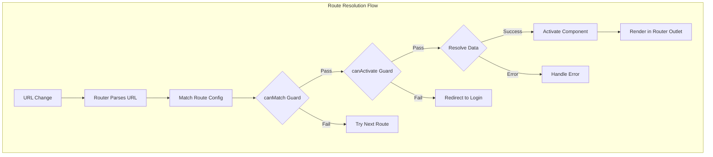
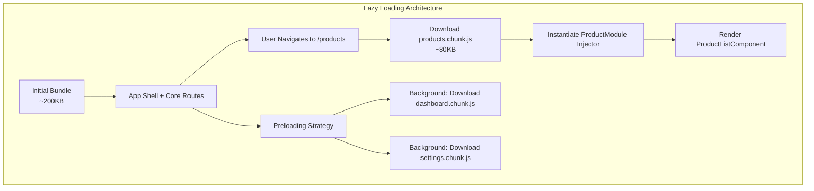
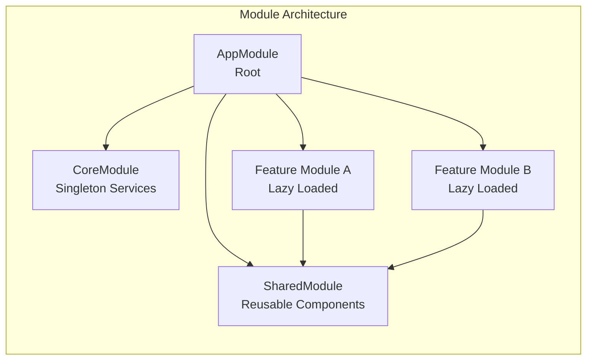

# Angular Routing & Modules

## Quick Reference

- `RouterModule.forRoot(routes)` configures the root router with application-wide routes; `forChild(routes)` registers routes for feature modules without re-initializing the router service
- Lazy loading uses `loadChildren` (for modules) or `loadComponent` (Angular 15+ standalone) with dynamic `import()` to split code into separate bundles loaded on demand
- Route guards control navigation: `canActivate` (enter), `canDeactivate` (leave), `canMatch` (route matching), `resolve` (pre-fetch data), `canLoad` (prevent lazy bundle download)
- Angular 15+ functional guards replace class-based guards: `canActivate: [() => inject(AuthService).isLoggedIn()]`
- Preloading strategies (`PreloadAllModules`, custom strategies) load lazy bundles in the background after initial render completes
- Auxiliary routes (named outlets) enable multiple independent routable areas in a single view — useful for side panels, modals, and chat widgets
- Standalone components can be routed directly without NgModules using `loadComponent: () => import('./path').then(m => m.Component)`

## When to Use

Routing and module architecture decisions shape the entire application structure. This knowledge is critical when:

- Architecting large-scale applications where route-based code splitting reduces initial bundle size from megabytes to hundreds of kilobytes, directly impacting Core Web Vitals
- Implementing authentication and authorization flows where route guards prevent unauthorized access to protected pages and pre-fetch user permissions before rendering
- Designing feature module boundaries that enable independent team development, where each team owns a lazy-loaded module with its own routes, services, and components
- Migrating from NgModule-based architecture to standalone components, understanding which patterns translate directly and which require architectural rethinking
- Building applications with complex navigation patterns like nested dashboards, wizard flows with step validation, or multi-panel layouts with independent routing

## Code Examples

### Route Configuration with Guards and Resolvers

```typescript
import { Routes } from '@angular/router';
import { inject } from '@angular/core';
import { AuthService } from './services/auth.service';
import { PermissionService } from './services/permission.service';

// Functional guard (Angular 15+)
const authGuard = () => {
  const auth = inject(AuthService);
  const router = inject(Router);

  if (auth.isAuthenticated()) {
    return true;
  }

  // Store attempted URL for redirect after login
  return router.createUrlTree(['/login'], {
    queryParams: { returnUrl: router.routerState.snapshot.url }
  });
};

// Role-based guard with parameter
const roleGuard = (allowedRoles: string[]) => {
  return () => {
    const permissions = inject(PermissionService);
    return permissions.hasAnyRole(allowedRoles);
  };
};

// Functional resolver
const productResolver = (route: ActivatedRouteSnapshot) => {
  const productService = inject(ProductService);
  return productService.getProduct(route.params['id']).pipe(
    catchError(() => {
      inject(Router).navigate(['/products']);
      return EMPTY;
    })
  );
};

// Unsaved changes guard
const unsavedChangesGuard = (component: { hasUnsavedChanges(): boolean }) => {
  if (component.hasUnsavedChanges()) {
    return confirm('You have unsaved changes. Leave anyway?');
  }
  return true;
};

export const routes: Routes = [
  { path: '', redirectTo: '/dashboard', pathMatch: 'full' },
  { path: 'login', loadComponent: () => import('./pages/login.component').then(m => m.LoginComponent) },

  // Protected routes
  {
    path: '',
    canActivate: [authGuard],
    children: [
      {
        path: 'dashboard',
        loadComponent: () => import('./pages/dashboard.component').then(m => m.DashboardComponent),
        title: 'Dashboard'
      },
      {
        path: 'products',
        loadChildren: () => import('./features/products/product.routes').then(m => m.PRODUCT_ROUTES)
      },
      {
        path: 'admin',
        canActivate: [roleGuard(['admin', 'super-admin'])],
        loadChildren: () => import('./features/admin/admin.routes').then(m => m.ADMIN_ROUTES)
      },
      {
        path: 'orders/:id',
        loadComponent: () => import('./pages/order-detail.component').then(m => m.OrderDetailComponent),
        resolve: { order: orderResolver },
        canDeactivate: [unsavedChangesGuard]
      }
    ]
  },

  // Wildcard — must be last
  { path: '**', loadComponent: () => import('./pages/not-found.component').then(m => m.NotFoundComponent) }
];
```

### Lazy-Loaded Feature Routes (Standalone)

```typescript
// features/products/product.routes.ts
import { Routes } from '@angular/router';

export const PRODUCT_ROUTES: Routes = [
  {
    path: '',
    loadComponent: () => import('./product-list.component').then(m => m.ProductListComponent),
    title: 'Products'
  },
  {
    path: 'create',
    loadComponent: () => import('./product-form.component').then(m => m.ProductFormComponent),
    canActivate: [roleGuard(['admin', 'product-manager'])],
    title: 'Create Product'
  },
  {
    path: ':id',
    loadComponent: () => import('./product-detail.component').then(m => m.ProductDetailComponent),
    resolve: { product: productResolver },
    children: [
      { path: '', redirectTo: 'overview', pathMatch: 'full' },
      {
        path: 'overview',
        loadComponent: () => import('./tabs/product-overview.component').then(m => m.ProductOverviewComponent)
      },
      {
        path: 'reviews',
        loadComponent: () => import('./tabs/product-reviews.component').then(m => m.ProductReviewsComponent)
      },
      {
        path: 'analytics',
        loadComponent: () => import('./tabs/product-analytics.component').then(m => m.ProductAnalyticsComponent),
        canActivate: [roleGuard(['admin'])]
      }
    ]
  }
];
```

### Custom Preloading Strategy

```typescript
import { PreloadingStrategy, Route } from '@angular/router';
import { Observable, of, timer } from 'rxjs';
import { mergeMap } from 'rxjs/operators';

// Preload routes based on custom data property
export class SelectivePreloadStrategy implements PreloadingStrategy {
  preload(route: Route, load: () => Observable<unknown>): Observable<unknown> {
    if (route.data?.['preload']) {
      // Delay preloading to not compete with initial render
      const delay = route.data?.['preloadDelay'] || 2000;
      return timer(delay).pipe(mergeMap(() => load()));
    }
    return of(null);
  }
}

// Network-aware preloading — only preload on fast connections
export class NetworkAwarePreloadStrategy implements PreloadingStrategy {
  preload(route: Route, load: () => Observable<unknown>): Observable<unknown> {
    const connection = (navigator as any).connection;

    // Don't preload on slow connections or data-saver mode
    if (connection) {
      if (connection.saveData) return of(null);
      if (connection.effectiveType === '2g' || connection.effectiveType === 'slow-2g') {
        return of(null);
      }
    }

    // Preload after initial content is interactive
    return timer(3000).pipe(mergeMap(() => load()));
  }
}

// Route configuration with preload hints
const routes: Routes = [
  {
    path: 'dashboard',
    loadChildren: () => import('./dashboard/routes').then(m => m.DASHBOARD_ROUTES),
    data: { preload: true, preloadDelay: 1000 }  // High priority — preload quickly
  },
  {
    path: 'settings',
    loadChildren: () => import('./settings/routes').then(m => m.SETTINGS_ROUTES),
    data: { preload: true, preloadDelay: 5000 }  // Low priority — preload later
  },
  {
    path: 'admin',
    loadChildren: () => import('./admin/routes').then(m => m.ADMIN_ROUTES),
    data: { preload: false }  // Never preload — admin-only
  }
];

// Bootstrap configuration
bootstrapApplication(AppComponent, {
  providers: [
    provideRouter(routes, withPreloading(NetworkAwarePreloadStrategy))
  ]
});
```

### NgModules vs Standalone — Feature Module Pattern

```typescript
// Traditional NgModule approach (pre-Angular 14)
@NgModule({
  declarations: [
    ProductListComponent,
    ProductDetailComponent,
    ProductFormComponent,
    ProductCardComponent,
    PricePipe
  ],
  imports: [
    CommonModule,
    ReactiveFormsModule,
    ProductRoutingModule,
    SharedModule
  ],
  providers: [
    ProductService,
    { provide: PRODUCT_CONFIG, useValue: defaultProductConfig }
  ]
})
export class ProductModule {}

// Equivalent standalone approach (Angular 15+)
// No module file needed — each component imports its own dependencies
// Routes file replaces the routing module:
export const PRODUCT_ROUTES: Routes = [
  {
    path: '',
    providers: [
      ProductService,
      { provide: PRODUCT_CONFIG, useValue: defaultProductConfig }
    ],
    children: [
      { path: '', component: ProductListComponent },
      { path: ':id', component: ProductDetailComponent }
    ]
  }
];

// Shared functionality via utility functions instead of SharedModule
export function provideProductFeature(config?: Partial<ProductConfig>) {
  return [
    ProductService,
    { provide: PRODUCT_CONFIG, useValue: { ...defaultProductConfig, ...config } }
  ];
}
```

### Auxiliary Routes and Named Outlets

```typescript
// App template with multiple outlets
@Component({
  selector: 'app-root',
  template: `
    <div class="layout">
      <nav>
        <a routerLink="/dashboard">Dashboard</a>
        <a [routerLink]="[{ outlets: { sidebar: ['notifications'] } }]">
          Show Notifications
        </a>
        <a [routerLink]="[{ outlets: { sidebar: null } }]">
          Hide Sidebar
        </a>
      </nav>

      <main>
        <router-outlet></router-outlet>
      </main>

      <aside>
        <router-outlet name="sidebar"></router-outlet>
      </aside>

      <router-outlet name="modal"></router-outlet>
    </div>
  `
})
export class AppComponent {}

// Route configuration with auxiliary routes
const routes: Routes = [
  { path: 'dashboard', component: DashboardComponent },
  { path: 'products', component: ProductListComponent },

  // Auxiliary routes — render in named outlets
  { path: 'notifications', component: NotificationPanelComponent, outlet: 'sidebar' },
  { path: 'chat', component: ChatWidgetComponent, outlet: 'sidebar' },
  { path: 'quick-view/:id', component: ProductQuickViewComponent, outlet: 'modal' }
];

// Programmatic navigation with auxiliary routes
@Injectable({ providedIn: 'root' })
export class NavigationService {
  constructor(private router: Router) {}

  openNotifications(): void {
    this.router.navigate([{ outlets: { sidebar: ['notifications'] } }]);
  }

  openProductQuickView(productId: string): void {
    this.router.navigate([{ outlets: { modal: ['quick-view', productId] } }]);
  }

  closeModal(): void {
    this.router.navigate([{ outlets: { modal: null } }]);
  }
}
```

### Router Events and Navigation Tracking

```typescript
import { Component, inject } from '@angular/core';
import { Router, NavigationStart, NavigationEnd, NavigationCancel, NavigationError, Event as RouterEvent } from '@angular/router';
import { filter, map } from 'rxjs/operators';

@Component({
  selector: 'app-root',
  template: `
    <div class="loading-bar" *ngIf="loading$ | async"></div>
    <router-outlet></router-outlet>
  `
})
export class AppComponent {
  private router = inject(Router);

  loading$ = this.router.events.pipe(
    filter((event): event is NavigationStart | NavigationEnd | NavigationCancel | NavigationError =>
      event instanceof NavigationStart ||
      event instanceof NavigationEnd ||
      event instanceof NavigationCancel ||
      event instanceof NavigationError
    ),
    map(event => event instanceof NavigationStart)
  );

  constructor() {
    // Analytics tracking
    this.router.events.pipe(
      filter((event): event is NavigationEnd => event instanceof NavigationEnd)
    ).subscribe(event => {
      analytics.trackPageView(event.urlAfterRedirects);
    });
  }
}
```

## Architecture / Diagrams







## Common Pitfalls

**Importing a lazy-loaded module in the main bundle accidentally.** If any eagerly-loaded component or service imports from a lazy module's barrel file, the bundler includes the entire lazy module in the main bundle, defeating code splitting. Use strict import boundaries — configure ESLint rules (`@nx/enforce-module-boundaries` or custom rules) to prevent cross-boundary imports. Verify with `webpack-bundle-analyzer` or `source-map-explorer` that lazy chunks are actually separate.

**Route order matters — wildcard and parameterized routes catch everything.** Angular matches routes in definition order. A route `{ path: ':id' }` before `{ path: 'create' }` means navigating to `/products/create` matches the `:id` route with `id = 'create'`. Always place specific static routes before parameterized routes, and the wildcard `**` route last. This is a frequent source of "wrong component renders" bugs that are hard to diagnose.

**Guards returning Observables that never complete.** If a `canActivate` guard returns an Observable that doesn't complete (like a `BehaviorSubject` without `first()` or `take(1)`), navigation hangs indefinitely. The router waits for the Observable to complete before proceeding. Always ensure guard Observables emit at least one value and complete — use `first()`, `take(1)`, or `map()` (which completes when the source completes).

**Resolver blocking navigation for slow API calls.** Resolvers delay component rendering until data is fetched. If the API takes 3 seconds, the user sees nothing for 3 seconds — worse UX than showing a loading skeleton. Use resolvers only for critical data that the component cannot render without. For non-critical data, load it in the component's `ngOnInit` with a loading state. Alternatively, use resolver with a timeout that falls back to cached data.

**Shared module growing unbounded.** Teams often dump every reusable component into a single `SharedModule`, which becomes a massive import that pulls in hundreds of components. Even with tree-shaking, this creates compilation overhead and unclear dependency graphs. Split into focused modules (`SharedFormsModule`, `SharedUIModule`) or migrate to standalone components where each consumer imports only what it needs.

**Not handling the canDeactivate guard for forms with unsaved data.** Users accidentally navigate away from forms, losing their work. The `canDeactivate` guard should check for unsaved changes and prompt confirmation. But many implementations forget to handle browser back button, tab close, and programmatic navigation. Use both `canDeactivate` and the `beforeunload` window event for complete coverage.

## Real-World Use Cases

**E-Commerce Platform with Role-Based Route Access.** A marketplace application serves three user types: buyers, sellers, and administrators. Route guards check user roles at multiple levels: top-level guards prevent buyers from accessing seller dashboards, nested guards within the admin section restrict specific pages to super-admins. Resolvers pre-fetch product data and user permissions before rendering, ensuring components always have the data they need. Lazy loading separates the seller portal (~400KB) and admin panel (~600KB) from the buyer experience (~200KB initial bundle).

**Multi-Step Wizard with Step Validation Guards.** An insurance application implements a 7-step quote wizard where each step must be completed before proceeding. `canActivate` guards on each step route verify that all previous steps have valid data. `canDeactivate` guards warn users about losing progress. The wizard state is managed by a service provided at the wizard route level (scoped injector), so navigating away from the wizard entirely resets state. Deep linking to step 4 redirects to step 1 if prerequisites aren't met.

**Dashboard with Independent Routable Panels.** A monitoring application uses auxiliary routes to manage a main content area, a side panel for alerts, and a modal overlay for detailed views. Users can have `/dashboard(sidebar:alerts//modal:server-detail/srv-42)` in their URL, bookmarking the exact view state. Each panel navigates independently — closing the modal doesn't affect the sidebar or main content. This pattern enables complex layouts without deeply nested component communication.

## Interview Questions

**Q: How does lazy loading work in Angular and what are its performance benefits?**

A: Lazy loading splits the application into separate JavaScript bundles (chunks) that are downloaded only when the user navigates to the corresponding route. Technically, `loadChildren` or `loadComponent` uses dynamic `import()` statements that Webpack/esbuild recognizes as split points. When the router matches a lazy route for the first time, it triggers the chunk download, instantiates the module/component, and renders it. Performance benefits: smaller initial bundle (faster Time to Interactive), reduced memory usage (code isn't parsed until needed), and parallel development (teams work on independent chunks). The trade-off is a brief loading delay on first navigation to a lazy route — mitigate with preloading strategies that download chunks in the background after initial render.

**Q: Explain the difference between canActivate, canMatch, and canLoad guards.**

A: `canActivate` runs after the route is matched and prevents the component from activating — the route still appears in the URL momentarily. `canMatch` (Angular 14.1+) runs during route matching itself — if it returns false, the router skips this route entirely and tries the next matching route. This enables pattern-based routing where the same path renders different components based on user role. `canLoad` (deprecated in favor of `canMatch`) prevented the lazy bundle from being downloaded at all — useful for preventing unauthorized users from even seeing the code. In practice, use `canMatch` for conditional route selection and `canActivate` for access control with redirects.

**Q: How would you implement a preloading strategy that prioritizes routes based on user behavior?**

A: Create a custom `PreloadingStrategy` that implements the `preload(route, load)` method. Track user navigation patterns (most visited routes) in a service backed by localStorage. In the strategy, check if the route is in the user's top-5 most visited routes — if yes, preload immediately after initial render. For other routes, check network conditions via the Network Information API: preload on WiFi/4G, skip on 2G or data-saver mode. Add a `data: { preloadPriority: 'high' | 'low' | 'none' }` property to route configs for explicit control. The strategy returns `load()` to preload or `of(null)` to skip. Monitor preloading effectiveness by tracking cache hit rates (how often a preloaded chunk is actually navigated to).

**Q: What are the trade-offs between NgModules and standalone components for application architecture?**

A: NgModules provide explicit boundaries (what's declared, imported, exported), a single place to configure providers for a feature, and familiar patterns for teams. Downsides: boilerplate (every component needs a module), implicit dependencies (importing SharedModule gives you everything), and compilation overhead. Standalone components eliminate module boilerplate, make dependencies explicit per-component (better tree-shaking), enable direct route-to-component lazy loading, and simplify mental model. Downsides: no built-in boundary enforcement (need lint rules), provider scoping requires route-level `providers` arrays, and large teams may miss the organizational structure modules provided. The Angular team recommends standalone for new projects. Migration is incremental — both patterns coexist.

**Q: How do you handle route-level data fetching and error states?**

A: Three approaches with different trade-offs. (1) Resolvers: fetch data before component renders. Pro: component always has data. Con: blocks navigation, poor UX for slow APIs. (2) Component-level fetching in `ngOnInit`: component renders immediately with loading state, fetches data, shows content or error. Pro: instant navigation feedback. Con: every component handles loading/error states. (3) Hybrid: resolver with timeout — attempt to fetch data, but if it takes longer than 500ms, resolve with null and let the component show a skeleton while continuing to load. For errors, resolvers can redirect to error pages or resolve with an error state that the component handles gracefully. In production, approach (2) or (3) provides the best user experience.

## Production Tips

**Monitor route-level bundle sizes and set budgets.** Configure Angular's build budgets in `angular.json` to warn when lazy chunks exceed size thresholds (e.g., 100KB warning, 200KB error for individual chunks). Track bundle sizes in CI — a PR that adds a 500KB dependency to a lazy chunk should be flagged. Use `source-map-explorer` or `webpack-bundle-analyzer` to identify what's in each chunk. Common bloat sources: importing entire icon libraries, including unused locale data, or accidentally importing from barrel files that re-export everything.

**Implement route-level error boundaries and fallback UI.** When a lazy chunk fails to download (network error, CDN issue, deployment during user session), the router throws a `NavigationError`. Handle this globally by subscribing to router events and showing a "please refresh" message or automatically retrying the chunk download. For resolver errors, redirect to a generic error page with context about what failed. Never let a failed navigation leave the user on a blank screen.

**Use route-level providers for feature-scoped services.** Instead of providing all services at root level, scope services to route subtrees using the `providers` array on route configurations. This ensures services are instantiated only when the route is active and garbage collected when the user navigates away. Particularly valuable for services that hold significant state or open connections (WebSocket services, polling services). This pattern replaces the module-level provider scoping that NgModules provided.

**Implement navigation performance monitoring.** Track time from `NavigationStart` to `NavigationEnd` for every route transition. Set performance budgets (e.g., lazy route first load < 2s, subsequent navigation < 500ms). Log slow navigations to your monitoring system with route path, guard execution time, resolver duration, and chunk download time. This data reveals which routes need optimization — perhaps a resolver is making 5 sequential API calls that could be parallelized, or a guard is performing expensive permission checks that could be cached.

## Related Topics

- [Angular Components & Templates](./components-and-templates.md) — Components rendered by the router and how they interact with route data
- [Angular Services & Dependency Injection](./services-and-di.md) — Guards, resolvers, and interceptors as injectable services
- [React Hooks & Components](../react/hooks.md) — Compare Angular routing with React Router's approach
- [Web Performance](../web-performance/web-performance.md) — How lazy loading and code splitting impact Core Web Vitals
