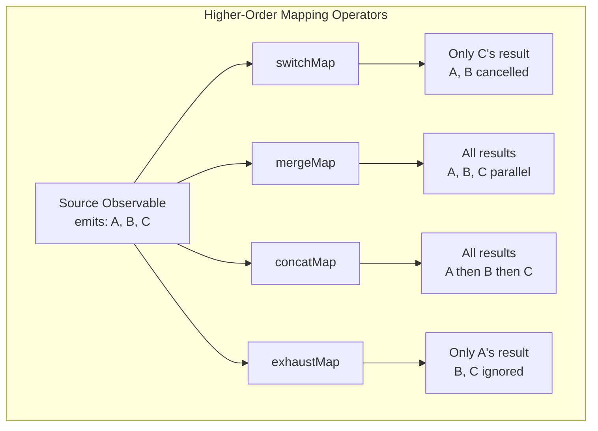
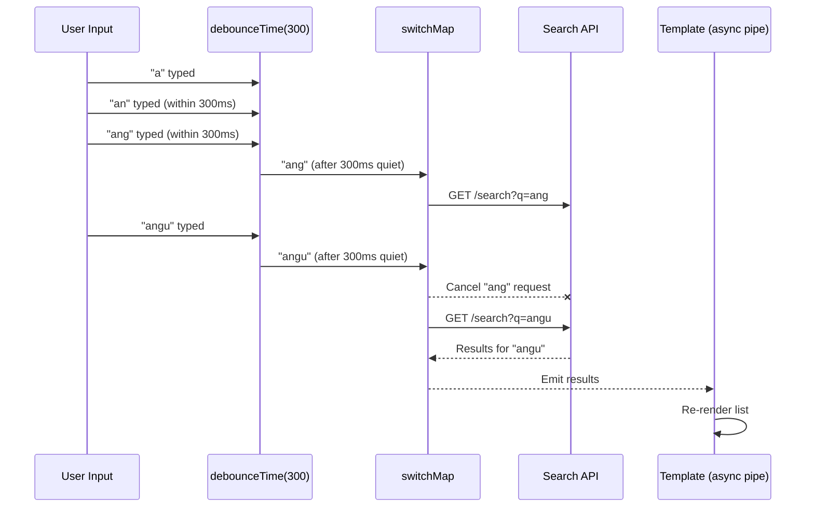
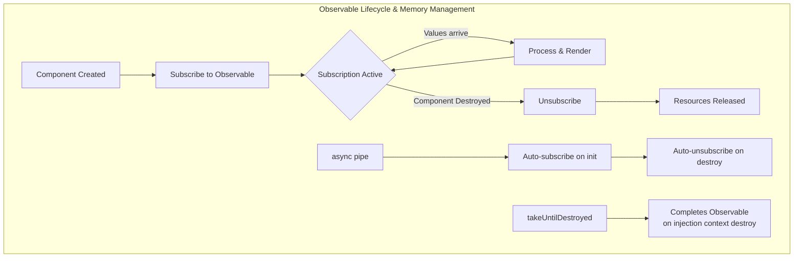
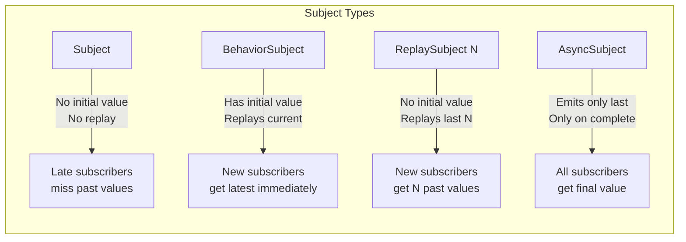

# RxJS & Reactive Patterns in Angular

## Quick Reference

- RxJS Observables are the foundation of Angular's async architecture — HttpClient, Router events, Reactive Forms, and component communication all return Observables
- The `async` pipe subscribes to Observables in templates, automatically unsubscribes on component destruction, and triggers change detection on new values
- `switchMap` cancels the previous inner Observable when a new outer value arrives — essential for typeahead search, route parameter changes, and form autocomplete
- `mergeMap` (flatMap) processes all inner Observables concurrently without cancellation — use for fire-and-forget operations like analytics events or parallel API calls
- `concatMap` queues inner Observables sequentially, waiting for each to complete before starting the next — use for ordered operations like sequential file uploads
- `combineLatest` emits when any source Observable emits, combining the latest values from all sources — use for derived state that depends on multiple async inputs
- `BehaviorSubject` holds a current value and emits it immediately to new subscribers — the backbone of service-based state management in Angular
- `shareReplay(1)` multicasts an Observable and replays the last emission to late subscribers — prevents duplicate HTTP requests when multiple components subscribe
- `takeUntilDestroyed()` (Angular 16+) automatically completes Observables when the injection context is destroyed, replacing manual `takeUntil` + `destroy$` patterns
- The `distinctUntilChanged` operator prevents downstream processing when values haven't actually changed — critical for performance in reactive chains

## When to Use

RxJS mastery separates competent Angular developers from expert ones. Deep reactive knowledge is essential when:

- Building real-time applications (chat, dashboards, collaborative editing) where WebSocket streams, server-sent events, and polling intervals must be composed, throttled, and error-handled without memory leaks
- Implementing complex search interfaces with typeahead, debouncing, cancellation of stale requests, and caching of recent results — all achievable in a single Observable pipeline
- Managing component state that derives from multiple async sources (route parameters + user preferences + API data) where `combineLatest` or `withLatestFrom` elegantly express the dependency relationships
- Optimizing performance by controlling when and how often expensive operations execute using `debounceTime`, `throttleTime`, `distinctUntilChanged`, and `auditTime`
- Handling error recovery gracefully — retrying failed HTTP requests with exponential backoff, falling back to cached data, or showing degraded UI without crashing the entire Observable chain
- Coordinating complex async workflows like multi-step wizards, optimistic updates with rollback, or parallel data loading with progress tracking

## Code Examples

### Typeahead Search with switchMap and Debouncing

```typescript
import { Component, inject, DestroyRef } from '@angular/core';
import { FormControl, ReactiveFormsModule } from '@angular/forms';
import { takeUntilDestroyed } from '@angular/core/rxjs-interop';
import { Observable, of } from 'rxjs';
import {
  debounceTime, distinctUntilChanged, switchMap,
  catchError, filter, tap, startWith
} from 'rxjs/operators';

interface SearchResult {
  id: string;
  title: string;
  category: string;
  relevanceScore: number;
}

interface SearchState {
  results: SearchResult[];
  loading: boolean;
  error: string | null;
  query: string;
}

@Component({
  selector: 'app-search',
  standalone: true,
  imports: [ReactiveFormsModule, AsyncPipe, NgFor, NgIf],
  template: `
    <input [formControl]="searchControl" placeholder="Search...">
    <div *ngIf="state$ | async as state">
      <div *ngIf="state.loading" class="spinner">Searching...</div>
      <div *ngIf="state.error" class="error">{{ state.error }}</div>
      <ul *ngIf="state.results.length > 0">
        <li *ngFor="let result of state.results">
          {{ result.title }} ({{ result.category }})
        </li>
      </ul>
      <p *ngIf="!state.loading && !state.error && state.results.length === 0 && state.query">
        No results for "{{ state.query }}"
      </p>
    </div>
  `
})
export class SearchComponent {
  private searchService = inject(SearchService);
  private destroyRef = inject(DestroyRef);

  searchControl = new FormControl('');

  state$: Observable<SearchState> = this.searchControl.valueChanges.pipe(
    startWith(''),
    debounceTime(300),
    distinctUntilChanged(),
    switchMap(query => {
      if (!query || query.trim().length < 2) {
        return of({ results: [], loading: false, error: null, query: query || '' });
      }
      return this.searchService.search(query).pipe(
        map(results => ({ results, loading: false, error: null, query })),
        startWith({ results: [], loading: true, error: null, query }),
        catchError(err => of({
          results: [],
          loading: false,
          error: 'Search failed. Please try again.',
          query
        }))
      );
    }),
    takeUntilDestroyed(this.destroyRef)
  );
}
```

### combineLatest for Derived State

```typescript
import { Injectable, inject } from '@angular/core';
import { ActivatedRoute } from '@angular/router';
import { BehaviorSubject, Observable, combineLatest } from 'rxjs';
import { map, switchMap, distinctUntilChanged, shareReplay, filter } from 'rxjs/operators';

interface ProductFilter {
  category: string | null;
  priceRange: [number, number];
  inStock: boolean;
  sortBy: 'price' | 'name' | 'rating';
  sortOrder: 'asc' | 'desc';
}

interface ProductListState {
  products: Product[];
  filteredProducts: Product[];
  totalCount: number;
  appliedFilters: ProductFilter;
  loading: boolean;
}

@Injectable({ providedIn: 'root' })
export class ProductListService {
  private http = inject(HttpClient);

  private filters$ = new BehaviorSubject<ProductFilter>({
    category: null,
    priceRange: [0, 10000],
    inStock: false,
    sortBy: 'name',
    sortOrder: 'asc'
  });

  private products$ = new BehaviorSubject<Product[]>([]);
  private loading$ = new BehaviorSubject<boolean>(false);

  // Derived state: filtered and sorted products
  readonly filteredProducts$: Observable<Product[]> = combineLatest([
    this.products$,
    this.filters$
  ]).pipe(
    map(([products, filters]) => this.applyFilters(products, filters)),
    distinctUntilChanged((prev, curr) =>
      JSON.stringify(prev) === JSON.stringify(curr)
    ),
    shareReplay(1)
  );

  // Complete view model combining all state
  readonly viewModel$: Observable<ProductListState> = combineLatest([
    this.products$,
    this.filteredProducts$,
    this.filters$,
    this.loading$
  ]).pipe(
    map(([products, filtered, filters, loading]) => ({
      products,
      filteredProducts: filtered,
      totalCount: products.length,
      appliedFilters: filters,
      loading
    })),
    shareReplay(1)
  );

  loadProducts(categorySlug?: string): void {
    this.loading$.next(true);
    const url = categorySlug
      ? `/api/products?category=${categorySlug}`
      : '/api/products';

    this.http.get<Product[]>(url).pipe(
      catchError(err => {
        console.error('Failed to load products', err);
        return of([]);
      }),
      finalize(() => this.loading$.next(false))
    ).subscribe(products => this.products$.next(products));
  }

  updateFilter(partial: Partial<ProductFilter>): void {
    this.filters$.next({ ...this.filters$.value, ...partial });
  }

  private applyFilters(products: Product[], filters: ProductFilter): Product[] {
    let result = [...products];

    if (filters.category) {
      result = result.filter(p => p.category === filters.category);
    }
    if (filters.inStock) {
      result = result.filter(p => p.stockCount > 0);
    }
    result = result.filter(p =>
      p.price >= filters.priceRange[0] && p.price <= filters.priceRange[1]
    );

    result.sort((a, b) => {
      const modifier = filters.sortOrder === 'asc' ? 1 : -1;
      if (filters.sortBy === 'price') return (a.price - b.price) * modifier;
      if (filters.sortBy === 'rating') return (a.rating - b.rating) * modifier;
      return a.name.localeCompare(b.name) * modifier;
    });

    return result;
  }
}
```

### Error Handling and Retry Strategies

```typescript
import { Injectable, inject } from '@angular/core';
import { HttpClient, HttpErrorResponse } from '@angular/common/http';
import { Observable, throwError, timer, of, EMPTY } from 'rxjs';
import {
  retry, retryWhen, catchError, switchMap, tap,
  delay, take, concatMap, shareReplay, timeout
} from 'rxjs/operators';

@Injectable({ providedIn: 'root' })
export class ResilientApiService {
  private http = inject(HttpClient);
  private notificationService = inject(NotificationService);

  // Exponential backoff retry with jitter
  getWithRetry<T>(url: string, maxRetries = 3): Observable<T> {
    return this.http.get<T>(url).pipe(
      timeout(10000), // 10 second timeout per attempt
      retry({
        count: maxRetries,
        delay: (error: HttpErrorResponse, retryCount: number) => {
          // Don't retry client errors (4xx) except 429 (rate limited)
          if (error.status >= 400 && error.status < 500 && error.status !== 429) {
            return throwError(() => error);
          }

          // Exponential backoff with jitter
          const baseDelay = Math.pow(2, retryCount) * 1000;
          const jitter = Math.random() * 1000;
          const totalDelay = baseDelay + jitter;

          console.warn(
            `Retry ${retryCount}/${maxRetries} for ${url} in ${totalDelay}ms`
          );
          return timer(totalDelay);
        }
      }),
      catchError((error: HttpErrorResponse) => {
        return this.handleError(error, url);
      })
    );
  }

  // Polling with backoff on errors
  poll<T>(url: string, intervalMs: number): Observable<T> {
    return timer(0, intervalMs).pipe(
      switchMap(() => this.http.get<T>(url).pipe(
        catchError(err => {
          console.warn(`Poll failed for ${url}:`, err.message);
          return EMPTY; // Skip this interval, try again next time
        })
      )),
      distinctUntilChanged((prev, curr) =>
        JSON.stringify(prev) === JSON.stringify(curr)
      ),
      shareReplay(1)
    );
  }

  // Optimistic update with rollback
  optimisticUpdate<T>(
    currentValue: T,
    optimisticValue: T,
    apiCall$: Observable<T>,
    onRollback: (original: T) => void
  ): Observable<T> {
    return apiCall$.pipe(
      catchError(error => {
        this.notificationService.error('Update failed, reverting changes');
        onRollback(currentValue);
        return throwError(() => error);
      })
    );
  }

  private handleError(error: HttpErrorResponse, url: string): Observable<never> {
    let message: string;

    if (error.status === 0) {
      message = 'Network error — please check your connection';
    } else if (error.status === 401) {
      message = 'Session expired — please log in again';
    } else if (error.status === 403) {
      message = 'You do not have permission to access this resource';
    } else if (error.status === 404) {
      message = 'The requested resource was not found';
    } else if (error.status === 429) {
      message = 'Too many requests — please wait and try again';
    } else if (error.status >= 500) {
      message = 'Server error — our team has been notified';
    } else {
      message = `Unexpected error: ${error.message}`;
    }

    this.notificationService.error(message);
    return throwError(() => new Error(message));
  }
}
```

### Subjects — When and How to Use Each Type

```typescript
import { Injectable } from '@angular/core';
import {
  Subject, BehaviorSubject, ReplaySubject, AsyncSubject
} from 'rxjs';
import { scan, distinctUntilChanged, map } from 'rxjs/operators';

// Subject — no initial value, only emits to current subscribers
// Use for: event buses, action dispatchers, one-time notifications
@Injectable({ providedIn: 'root' })
export class EventBusService {
  private events$ = new Subject<AppEvent>();

  emit(event: AppEvent): void {
    this.events$.next(event);
  }

  on<T extends AppEvent>(eventType: string): Observable<T> {
    return this.events$.pipe(
      filter((event): event is T => event.type === eventType)
    );
  }
}

// BehaviorSubject — requires initial value, emits current value to new subscribers
// Use for: state containers, current user, active theme, connection status
@Injectable({ providedIn: 'root' })
export class ConnectionStatusService {
  private status$ = new BehaviorSubject<'online' | 'offline' | 'reconnecting'>('online');

  readonly isOnline$ = this.status$.pipe(
    map(s => s === 'online'),
    distinctUntilChanged()
  );

  constructor() {
    window.addEventListener('online', () => this.status$.next('online'));
    window.addEventListener('offline', () => this.status$.next('offline'));
  }

  getCurrentStatus(): 'online' | 'offline' | 'reconnecting' {
    return this.status$.value;
  }
}

// ReplaySubject — replays N previous emissions to new subscribers
// Use for: message history, audit logs, recent notifications
@Injectable({ providedIn: 'root' })
export class NotificationHistoryService {
  // Replay last 50 notifications to new subscribers
  private notifications$ = new ReplaySubject<Notification>(50);

  private unreadCount$ = this.notifications$.pipe(
    scan((count, notification) => notification.read ? count - 1 : count + 1, 0)
  );

  push(notification: Notification): void {
    this.notifications$.next(notification);
  }

  getHistory(): Observable<Notification> {
    return this.notifications$.asObservable();
  }
}

// AsyncSubject — emits only the LAST value, only on completion
// Use for: one-time async initialization, configuration loading
@Injectable({ providedIn: 'root' })
export class AppInitService {
  private config$ = new AsyncSubject<RemoteConfig>();

  initialize(): void {
    this.http.get<RemoteConfig>('/api/config').subscribe({
      next: config => {
        this.config$.next(config);
        this.config$.complete(); // Triggers emission to all subscribers
      },
      error: err => this.config$.error(err)
    });
  }

  getConfig(): Observable<RemoteConfig> {
    return this.config$.asObservable(); // Late subscribers get the config too
  }
}
```

### Real-Time WebSocket with Reconnection

```typescript
import { Injectable, inject } from '@angular/core';
import { webSocket, WebSocketSubject } from 'rxjs/webSocket';
import { Observable, timer, EMPTY, Subject } from 'rxjs';
import {
  retryWhen, delay, tap, switchMap, catchError,
  takeUntil, share, map, filter, distinctUntilChanged
} from 'rxjs/operators';

interface WebSocketMessage<T = unknown> {
  type: string;
  payload: T;
  timestamp: number;
  correlationId?: string;
}

@Injectable({ providedIn: 'root' })
export class WebSocketService {
  private socket$: WebSocketSubject<WebSocketMessage> | null = null;
  private reconnectAttempts = 0;
  private maxReconnectAttempts = 10;
  private destroy$ = new Subject<void>();

  private messages$: Observable<WebSocketMessage> | null = null;

  connect(url: string): Observable<WebSocketMessage> {
    if (!this.messages$) {
      this.socket$ = webSocket<WebSocketMessage>({
        url,
        openObserver: {
          next: () => {
            console.log('WebSocket connected');
            this.reconnectAttempts = 0;
          }
        },
        closeObserver: {
          next: (event) => {
            console.log('WebSocket closed', event.code, event.reason);
            this.socket$ = null;
            this.messages$ = null;
          }
        }
      });

      this.messages$ = this.socket$.pipe(
        retryWhen(errors => errors.pipe(
          tap(err => {
            this.reconnectAttempts++;
            console.warn(
              `WebSocket error, reconnect attempt ${this.reconnectAttempts}`,
              err
            );
          }),
          switchMap(() => {
            if (this.reconnectAttempts > this.maxReconnectAttempts) {
              return throwError(() => new Error('Max reconnection attempts exceeded'));
            }
            // Exponential backoff: 1s, 2s, 4s, 8s... capped at 30s
            const delayMs = Math.min(
              Math.pow(2, this.reconnectAttempts - 1) * 1000,
              30000
            );
            return timer(delayMs);
          })
        )),
        takeUntil(this.destroy$),
        share() // Multicast to all subscribers
      );
    }

    return this.messages$;
  }

  // Type-safe message filtering
  on<T>(messageType: string): Observable<T> {
    if (!this.messages$) {
      throw new Error('WebSocket not connected. Call connect() first.');
    }
    return this.messages$.pipe(
      filter(msg => msg.type === messageType),
      map(msg => msg.payload as T),
      distinctUntilChanged((a, b) => JSON.stringify(a) === JSON.stringify(b))
    );
  }

  send<T>(type: string, payload: T): void {
    if (this.socket$) {
      this.socket$.next({
        type,
        payload,
        timestamp: Date.now(),
        correlationId: crypto.randomUUID()
      });
    }
  }

  disconnect(): void {
    this.destroy$.next();
    this.destroy$.complete();
    this.socket$?.complete();
    this.socket$ = null;
    this.messages$ = null;
  }
}
```


### Higher-Order Mapping Operators Comparison

```typescript
import { Component, inject } from '@angular/core';
import { FormControl } from '@angular/forms';
import { Observable, from, of, interval, Subject } from 'rxjs';
import {
  switchMap, mergeMap, concatMap, exhaustMap,
  take, delay, tap, map
} from 'rxjs/operators';

@Component({ selector: 'app-operator-demo', template: '' })
export class OperatorDemoComponent {
  private http = inject(HttpClient);

  // switchMap — CANCELS previous, only latest matters
  // Use case: search autocomplete, route parameter changes
  searchResults$ = this.searchInput.valueChanges.pipe(
    debounceTime(300),
    switchMap(query => this.http.get<Result[]>(`/api/search?q=${query}`))
    // If user types "ang" then "angular", the request for "ang" is cancelled
  );

  // mergeMap — CONCURRENT, all execute in parallel
  // Use case: analytics events, notifications, independent operations
  saveAllItems(items: Item[]): Observable<SaveResult[]> {
    return from(items).pipe(
      mergeMap(
        item => this.http.post<SaveResult>('/api/items', item),
        5 // concurrency limit: max 5 parallel requests
      ),
      toArray()
    );
  }

  // concatMap — SEQUENTIAL, waits for each to complete
  // Use case: ordered operations, sequential file uploads, queue processing
  uploadFiles(files: File[]): Observable<UploadResult> {
    return from(files).pipe(
      concatMap((file, index) => {
        const formData = new FormData();
        formData.append('file', file);
        return this.http.post<UploadResult>('/api/upload', formData).pipe(
          tap(result => console.log(`Uploaded ${index + 1}/${files.length}`))
        );
      })
    );
  }

  // exhaustMap — IGNORES new emissions while current is active
  // Use case: form submission (prevent double-submit), login buttons
  private submitAction$ = new Subject<FormData>();
  submitResult$ = this.submitAction$.pipe(
    exhaustMap(formData =>
      this.http.post<SubmitResult>('/api/submit', formData).pipe(
        catchError(err => of({ success: false, error: err.message }))
      )
    )
    // Rapid clicks only trigger ONE request, subsequent clicks ignored
  );
}
```

## Architecture / Diagrams









## Common Pitfalls

**Subscribing in components without unsubscribing — the #1 source of memory leaks in Angular.** Every `subscribe()` call creates a subscription that lives until explicitly unsubscribed or the Observable completes. Components that subscribe in `ngOnInit` without cleaning up in `ngOnDestroy` leak memory, continue processing events after navigation, and can cause "expression changed after checked" errors. Solutions: use the `async` pipe (auto-unsubscribes), `takeUntilDestroyed()` (Angular 16+), or maintain a `destroy$` Subject with `takeUntil`. The async pipe is preferred because it also handles change detection correctly.

**Using `subscribe()` inside `subscribe()` — nested subscriptions.** This anti-pattern creates unmanageable code, loses error propagation, and makes cleanup nearly impossible. Instead of subscribing to get a value and then subscribing to another Observable with that value, use higher-order mapping operators (`switchMap`, `mergeMap`, `concatMap`). These operators flatten nested Observables into a single stream, maintain proper error handling, and allow the entire chain to be managed with a single subscription.

**Choosing the wrong flattening operator.** Using `mergeMap` for search autocomplete means stale results can arrive after newer results (race condition). Using `switchMap` for save operations means rapid saves cancel previous ones, potentially losing data. Using `concatMap` for real-time updates means a slow response blocks all subsequent updates. Match the operator to the semantics: `switchMap` for "only latest matters," `mergeMap` for "all are independent," `concatMap` for "order matters," `exhaustMap` for "ignore while busy."

**Not sharing expensive Observables — duplicate HTTP requests.** When multiple components subscribe to the same HttpClient Observable, each subscription triggers a separate HTTP request. Use `shareReplay(1)` to multicast the result and replay it to late subscribers. But beware: `shareReplay` without `refCount: true` keeps the subscription alive even after all subscribers unsubscribe. Use `shareReplay({ bufferSize: 1, refCount: true })` for Observables that should clean up when no longer needed.

**Ignoring error handling in Observable chains.** An unhandled error in an Observable chain terminates the entire stream permanently. For long-lived Observables (WebSocket connections, polling intervals, form value changes), an error kills the stream and no further values are processed. Always include `catchError` that returns a recovery Observable (like `EMPTY` or a default value) to keep the stream alive. Place `catchError` inside the `switchMap`/`mergeMap` inner Observable, not on the outer stream, to prevent the outer stream from dying.

**Overusing BehaviorSubject when a simple Observable would suffice.** Not every piece of reactive state needs a BehaviorSubject. If consumers don't need the "current value" synchronously (via `.value`) and don't need late subscribers to receive the last emission, a regular Subject or even a derived Observable is simpler. BehaviorSubjects require an initial value, which sometimes leads to awkward `null` initial states that every consumer must handle. Consider whether `ReplaySubject(1)` (no required initial value but still replays) better fits your use case.

**Creating hot Observables unintentionally with shareReplay in services.** A service method that returns `this.http.get(...).pipe(shareReplay(1))` creates a cached Observable that never re-fetches. This is intentional for configuration but problematic for data that changes. Consumers calling the method expect fresh data but get stale cached results. Either expose the shared Observable as a class property (making the caching explicit) or don't share at all and let consumers manage their own caching needs.

## Real-World Use Cases

**Real-Time Trading Dashboard with Multiple Data Streams.** A financial trading platform combines WebSocket price feeds, order book updates, portfolio positions, and market news into a unified dashboard. Each data stream is an Observable managed by a dedicated service. The dashboard component uses `combineLatest` to merge the latest price with the user's position to calculate real-time P&L. `throttleTime(100)` prevents UI thrashing from high-frequency price updates (ticking 10+ times per second). `distinctUntilChanged` with a custom comparator skips re-renders when price changes are below the display precision. Error handling per stream ensures that a WebSocket disconnection on one feed doesn't crash the entire dashboard — degraded data shows with a staleness indicator.

**Collaborative Document Editor with Conflict Resolution.** A collaborative editing application uses Observables to manage local changes, remote changes from other users, and conflict resolution. Local keystrokes are captured as a Subject, debounced, and sent to the server via WebSocket. Incoming remote changes are merged with local state using `combineLatest` and a CRDT (Conflict-free Replicated Data Type) resolver. `concatMap` ensures that operations are applied in order. `bufferTime(50)` batches rapid local edits into single operations to reduce network traffic. The undo/redo stack is implemented as a `scan` operator that accumulates operations and can replay them in reverse.

**E-Commerce Checkout with Parallel Validation.** A checkout flow validates the shopping cart, shipping address, payment method, and inventory availability in parallel using `forkJoin`. If any validation fails, the UI shows specific errors without blocking other validations. `timeout(5000)` ensures no single validation hangs the checkout indefinitely. After successful validation, `concatMap` processes the order sequentially: reserve inventory → charge payment → create order → send confirmation. If payment fails after inventory reservation, a compensating transaction (release inventory) executes via `catchError` with a side effect. The entire flow is a single Observable chain that the component subscribes to once, with loading states derived from intermediate emissions.

## Interview Questions

**Q: Explain the difference between switchMap, mergeMap, concatMap, and exhaustMap. When would you use each?**

A: These are higher-order mapping operators that handle inner Observable subscriptions differently. `switchMap` unsubscribes from the previous inner Observable when a new outer value arrives — use for search autocomplete, route changes, or any scenario where only the latest result matters. `mergeMap` subscribes to all inner Observables concurrently — use for independent parallel operations like saving multiple items or sending analytics events. `concatMap` queues inner Observables and processes them one at a time in order — use for sequential operations like file uploads or ordered API calls. `exhaustMap` ignores new outer values while an inner Observable is active — use for preventing double-submission on button clicks or login forms. The key decision factor is: do you want to cancel (switch), run in parallel (merge), queue (concat), or ignore (exhaust)?

**Q: How do you prevent memory leaks from Observable subscriptions in Angular components?**

A: Multiple strategies exist, ordered by preference. First, use the `async` pipe in templates — it automatically subscribes on component init and unsubscribes on destroy, plus it works correctly with OnPush change detection. Second, use `takeUntilDestroyed()` from `@angular/core/rxjs-interop` (Angular 16+) which completes the Observable when the injection context is destroyed. Third, for older Angular versions, create a `private destroy$ = new Subject<void>()`, call `this.destroy$.next()` in `ngOnDestroy`, and add `.pipe(takeUntil(this.destroy$))` to all subscriptions. Fourth, collect subscriptions in a `Subscription` object and call `unsubscribe()` in `ngOnDestroy`. The async pipe is preferred because it eliminates an entire class of bugs — you can't forget to unsubscribe if you never manually subscribe.

**Q: What is shareReplay and when should you use it? What are the gotchas?**

A: `shareReplay` multicasts an Observable (shares a single subscription among multiple subscribers) and replays the specified number of past emissions to late subscribers. Common use: preventing duplicate HTTP requests when multiple components need the same data. Without sharing, each `| async` pipe on the same Observable triggers a separate HTTP call. Gotchas: (1) Without `refCount: true`, the source subscription stays active forever even after all subscribers unsubscribe — this leaks for Observables that never complete. Use `shareReplay({ bufferSize: 1, refCount: true })` for cleanup. (2) Shared Observables cache errors too — if the source errors, all future subscribers receive the cached error. Add `catchError` before `shareReplay` to handle this. (3) `shareReplay` makes Observables "hot" — the source executes regardless of subscribers after the first subscription, which can be surprising for side-effectful operations.

**Q: How would you implement optimistic updates with rollback using RxJS?**

A: Optimistic updates show the result immediately in the UI before the server confirms, then rollback if the server rejects. Implementation: (1) Store the current state before the update. (2) Apply the optimistic change to the UI state immediately (update BehaviorSubject). (3) Send the API request. (4) On success, optionally reconcile with the server response (server may add timestamps, IDs). (5) On error, revert the BehaviorSubject to the stored previous state and show an error notification. In RxJS, this looks like: `tap(() => applyOptimistic())` → `switchMap(() => apiCall$)` → `tap(() => reconcile())` with `catchError(() => { rollback(); return EMPTY; })`. For lists, use immutable updates so rollback is simply reassigning the previous array reference. Consider debouncing rapid optimistic updates and only sending the final state to avoid race conditions.

**Q: Explain cold vs hot Observables. How does this affect Angular applications?**

A: Cold Observables create a new producer (data source) for each subscriber — like a function that runs fresh each time. HttpClient returns cold Observables: each subscription makes a new HTTP request. Hot Observables share a single producer among all subscribers — like a live event stream. Subjects are hot: all subscribers receive the same emissions simultaneously. This distinction matters in Angular because: (1) Multiple `| async` pipes on the same cold Observable (like an HTTP call) trigger multiple requests — use `shareReplay` to make it hot. (2) Hot Observables (WebSockets, Subjects) emit regardless of subscribers, so late subscribers miss past values unless you use BehaviorSubject or ReplaySubject. (3) Unsubscribing from a cold Observable stops the producer (cancels the HTTP request), but unsubscribing from a hot Observable just removes the listener — the producer continues. Understanding this prevents duplicate requests, missed events, and resource leaks.

## Production Tips

**Use the async pipe as your default subscription strategy and reserve manual subscriptions for side effects only.** The async pipe handles subscription lifecycle, works correctly with OnPush change detection (marks the component for check on new values), and eliminates memory leak bugs. When you need to perform side effects (logging, analytics, triggering other actions), subscribe in the component with `takeUntilDestroyed()` and keep the subscription logic minimal. If you find yourself subscribing to set a component property, refactor to use the async pipe with an Observable property instead. This pattern also makes components easier to test — you can verify the Observable output without rendering the template.

**Implement global error handling for Observable streams using a centralized error service.** Create an `ErrorHandlerService` that categorizes errors (network, auth, validation, server) and routes them to appropriate handlers (retry, redirect to login, show toast, log to monitoring). Inject this service into HTTP interceptors and service-level `catchError` operators. In production, integrate with error monitoring (Sentry, Datadog) by reporting unhandled Observable errors. Override Angular's `ErrorHandler` to catch errors that escape Observable chains. Monitor error rates per endpoint and set up alerts for sudden spikes that indicate service degradation.

**Profile Observable chains in production using custom operators for timing and logging.** Create a `tapDebug` operator that logs emissions, errors, and completions with timestamps in development but becomes a no-op in production builds (tree-shaken via environment flags). For production performance monitoring, create a `measureTime` operator that records the duration between subscription and first emission, reporting to your APM tool. This helps identify slow Observable chains (complex `combineLatest` with many sources, expensive `map` transformations) that degrade user experience. Set performance budgets: search results within 200ms, page data within 500ms, and alert when p95 exceeds thresholds.

**Design Observable APIs for composability — return Observables, don't subscribe internally.** Services should return Observables that consumers subscribe to, rather than subscribing internally and exposing results via callbacks or Subjects. This gives consumers control over timing (when to subscribe), lifecycle (when to unsubscribe), and composition (combining with other Observables). The exception is fire-and-forget operations (analytics, logging) where the service owns the subscription lifecycle. For data-fetching services, expose both a method that returns a fresh Observable and a shared property for cached/live data, letting consumers choose based on their freshness requirements.

## Related Topics

- [Angular Services & Dependency Injection](./services-and-di.md) — Services are the primary home for RxJS logic in Angular applications
- [Angular Routing & Modules](./routing-and-modules.md) — Router events, route parameter Observables, and resolver patterns
- [Angular Components & Templates](./components-and-templates.md) — async pipe usage, OnPush change detection with Observables
- [TypeScript Advanced Types](../typescript/advanced-types.md) — Generic type constraints for typed Observable utilities
- [State Management with Redux](../state-management/redux-patterns.md) — NgRx uses RxJS Effects for side-effect management
