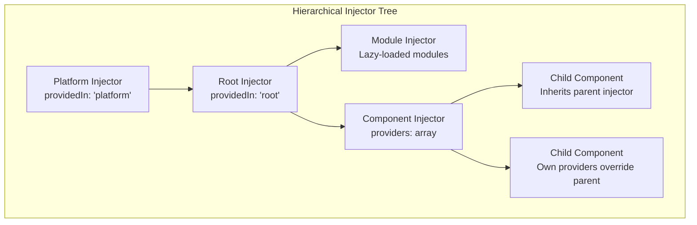
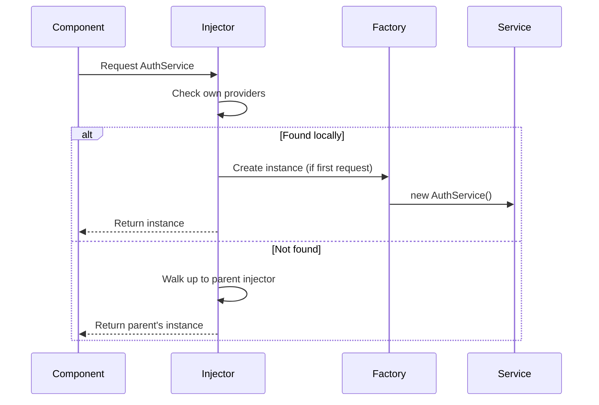
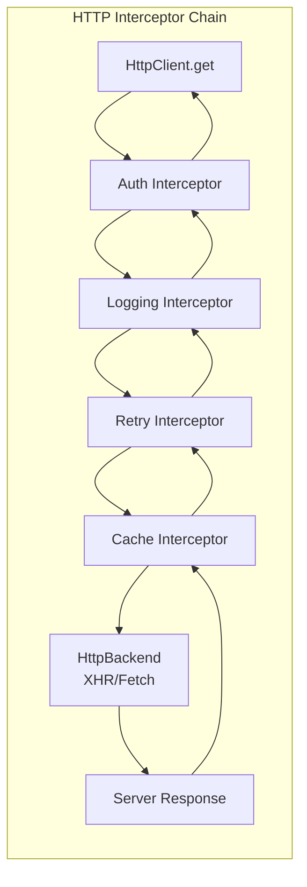

# Angular Services & Dependency Injection

## Quick Reference

- Services are classes decorated with `@Injectable()` that encapsulate business logic, data access, and shared state outside of components
- Angular's hierarchical injector creates a tree of injectors mirroring the component tree — child injectors inherit from parents but can override providers
- `providedIn: 'root'` creates a singleton service tree-shakable at build time — if no component injects it, the service is excluded from the bundle
- Injection tokens (`InjectionToken<T>`) provide type-safe DI for non-class dependencies like configuration objects, API URLs, or feature flags
- `HttpClient` returns Observables by default and supports typed responses, interceptors for cross-cutting concerns, and automatic JSON parsing
- Multi providers (`multi: true`) allow multiple values to be injected for the same token, enabling plugin architectures and extensible middleware chains
- Factory providers (`useFactory`) enable dynamic service creation based on runtime conditions, environment variables, or other injected dependencies

## When to Use

Angular's dependency injection system is the backbone of application architecture. Deep understanding is essential when:

- Designing service layers for enterprise applications where proper scoping (singleton vs per-component vs per-route) determines memory usage and data consistency
- Building HTTP interceptor chains for authentication, logging, caching, retry logic, and error handling that apply uniformly across all API calls
- Implementing state management patterns using services with BehaviorSubjects as a lightweight alternative to NgRx for medium-complexity applications
- Creating configurable libraries where consumers provide configuration through injection tokens and factory providers without modifying library source code
- Optimizing bundle size through tree-shakable providers that ensure unused services don't increase the production bundle
- Testing components in isolation by providing mock services through the DI system without modifying production code

## Code Examples

### Hierarchical Service with providedIn Options

```typescript
import { Injectable } from '@angular/core';
import { BehaviorSubject, Observable } from 'rxjs';

// Singleton — one instance for entire application
@Injectable({ providedIn: 'root' })
export class AuthService {
  private currentUser$ = new BehaviorSubject<User | null>(null);

  get user$(): Observable<User | null> {
    return this.currentUser$.asObservable();
  }

  get isAuthenticated(): boolean {
    return this.currentUser$.value !== null;
  }

  login(credentials: LoginCredentials): Observable<User> {
    return this.http.post<User>('/api/auth/login', credentials).pipe(
      tap(user => this.currentUser$.next(user))
    );
  }

  logout(): void {
    this.currentUser$.next(null);
    this.router.navigate(['/login']);
  }
}

// Scoped to a specific component subtree — new instance per component
@Injectable()
export class FormStateService {
  private dirty = false;
  private formData: Record<string, unknown> = {};

  markDirty(): void { this.dirty = true; }
  isDirty(): boolean { return this.dirty; }

  setField(key: string, value: unknown): void {
    this.formData[key] = value;
    this.dirty = true;
  }

  reset(): void {
    this.formData = {};
    this.dirty = false;
  }
}

// Component provides its own instance
@Component({
  selector: 'app-edit-profile',
  providers: [FormStateService],  // New instance for this component subtree
  template: `...`
})
export class EditProfileComponent {
  constructor(private formState: FormStateService) {}
}
```

### Injection Tokens and Factory Providers

```typescript
import { InjectionToken, inject, Injectable } from '@angular/core';

// Define typed injection tokens for configuration
export interface AppConfig {
  apiBaseUrl: string;
  featureFlags: Record<string, boolean>;
  maxRetries: number;
  cacheTimeout: number;
}

export const APP_CONFIG = new InjectionToken<AppConfig>('app.config');
export const API_BASE_URL = new InjectionToken<string>('api.base.url');
export const IS_PRODUCTION = new InjectionToken<boolean>('is.production');

// Factory provider — creates service based on runtime conditions
export const appConfigProvider = {
  provide: APP_CONFIG,
  useFactory: (): AppConfig => {
    const isProd = window.location.hostname !== 'localhost';
    return {
      apiBaseUrl: isProd ? 'https://api.production.com' : 'http://localhost:3000',
      featureFlags: {
        darkMode: true,
        betaFeatures: !isProd,
        analytics: isProd
      },
      maxRetries: isProd ? 3 : 0,
      cacheTimeout: isProd ? 300000 : 0
    };
  }
};

// Service using injection token
@Injectable({ providedIn: 'root' })
export class ApiService {
  private config = inject(APP_CONFIG);
  private http = inject(HttpClient);

  get<T>(endpoint: string): Observable<T> {
    return this.http.get<T>(`${this.config.apiBaseUrl}${endpoint}`);
  }
}

// Multi providers for plugin architecture
export const HTTP_INTERCEPTORS_CUSTOM = new InjectionToken<HttpInterceptorFn[]>('http.interceptors');

export const interceptorProviders = [
  { provide: HTTP_INTERCEPTORS_CUSTOM, useClass: AuthInterceptor, multi: true },
  { provide: HTTP_INTERCEPTORS_CUSTOM, useClass: LoggingInterceptor, multi: true },
  { provide: HTTP_INTERCEPTORS_CUSTOM, useClass: RetryInterceptor, multi: true },
  { provide: HTTP_INTERCEPTORS_CUSTOM, useClass: CacheInterceptor, multi: true }
];
```

### HttpClient with Interceptors

```typescript
import { Injectable, inject } from '@angular/core';
import { HttpClient, HttpInterceptorFn, HttpRequest, HttpHandlerFn, HttpEvent, HttpErrorResponse } from '@angular/common/http';
import { Observable, throwError, timer } from 'rxjs';
import { catchError, retry, switchMap, tap } from 'rxjs/operators';

// Functional interceptor (Angular 15+)
export const authInterceptor: HttpInterceptorFn = (req: HttpRequest<unknown>, next: HttpHandlerFn): Observable<HttpEvent<unknown>> => {
  const authService = inject(AuthService);
  const token = authService.getToken();

  if (token && !req.url.includes('/auth/')) {
    const cloned = req.clone({
      setHeaders: {
        Authorization: `Bearer ${token}`,
        'X-Request-ID': crypto.randomUUID()
      }
    });
    return next(cloned);
  }

  return next(req);
};

// Retry interceptor with exponential backoff
export const retryInterceptor: HttpInterceptorFn = (req, next) => {
  const config = inject(APP_CONFIG);

  return next(req).pipe(
    retry({
      count: config.maxRetries,
      delay: (error: HttpErrorResponse, retryCount: number) => {
        if (error.status === 401 || error.status === 403 || error.status === 404) {
          return throwError(() => error);  // Don't retry auth or not-found errors
        }
        const delayMs = Math.pow(2, retryCount) * 1000;
        console.warn(`Retry ${retryCount} for ${req.url} after ${delayMs}ms`);
        return timer(delayMs);
      }
    }),
    catchError((error: HttpErrorResponse) => {
      if (error.status === 0) {
        return throwError(() => new Error('Network error — check your connection'));
      }
      return throwError(() => error);
    })
  );
};

// Data service using HttpClient
@Injectable({ providedIn: 'root' })
export class ProductService {
  private http = inject(HttpClient);
  private config = inject(APP_CONFIG);

  private productsCache$ = new BehaviorSubject<Product[]>([]);

  getProducts(params?: ProductQueryParams): Observable<PaginatedResponse<Product>> {
    return this.http.get<PaginatedResponse<Product>>('/api/products', {
      params: this.buildHttpParams(params)
    }).pipe(
      tap(response => this.productsCache$.next(response.data))
    );
  }

  getProduct(id: string): Observable<Product> {
    return this.http.get<Product>(`/api/products/${id}`);
  }

  createProduct(product: CreateProductDto): Observable<Product> {
    return this.http.post<Product>('/api/products', product);
  }

  updateProduct(id: string, updates: Partial<Product>): Observable<Product> {
    return this.http.patch<Product>(`/api/products/${id}`, updates);
  }

  private buildHttpParams(params?: ProductQueryParams): Record<string, string> {
    if (!params) return {};
    return Object.entries(params)
      .filter(([_, value]) => value !== undefined && value !== null)
      .reduce((acc, [key, value]) => ({ ...acc, [key]: String(value) }), {});
  }
}
```

### RxJS Integration — State Management with Services

```typescript
import { Injectable, inject } from '@angular/core';
import { BehaviorSubject, Observable, combineLatest, Subject } from 'rxjs';
import { map, distinctUntilChanged, debounceTime, switchMap, shareReplay, scan } from 'rxjs/operators';

interface CartState {
  items: CartItem[];
  loading: boolean;
  error: string | null;
  lastUpdated: Date | null;
}

interface CartItem {
  productId: string;
  name: string;
  price: number;
  quantity: number;
}

@Injectable({ providedIn: 'root' })
export class CartService {
  private state$ = new BehaviorSubject<CartState>({
    items: [],
    loading: false,
    error: null,
    lastUpdated: null
  });

  // Public selectors — expose only what consumers need
  readonly items$ = this.state$.pipe(
    map(state => state.items),
    distinctUntilChanged()
  );

  readonly totalPrice$ = this.items$.pipe(
    map(items => items.reduce((sum, item) => sum + item.price * item.quantity, 0))
  );

  readonly itemCount$ = this.items$.pipe(
    map(items => items.reduce((sum, item) => sum + item.quantity, 0))
  );

  readonly loading$ = this.state$.pipe(map(s => s.loading), distinctUntilChanged());
  readonly error$ = this.state$.pipe(map(s => s.error), distinctUntilChanged());

  // Derived state combining multiple selectors
  readonly cartSummary$ = combineLatest([
    this.items$,
    this.totalPrice$,
    this.itemCount$
  ]).pipe(
    map(([items, total, count]) => ({
      items,
      total,
      count,
      isEmpty: count === 0,
      qualifiesForFreeShipping: total >= 50
    })),
    shareReplay(1)
  );

  addItem(product: Product, quantity = 1): void {
    const current = this.state$.value;
    const existingIndex = current.items.findIndex(i => i.productId === product.id);

    let updatedItems: CartItem[];
    if (existingIndex >= 0) {
      updatedItems = current.items.map((item, index) =>
        index === existingIndex
          ? { ...item, quantity: item.quantity + quantity }
          : item
      );
    } else {
      updatedItems = [...current.items, {
        productId: product.id,
        name: product.name,
        price: product.price,
        quantity
      }];
    }

    this.updateState({ items: updatedItems, lastUpdated: new Date() });
  }

  removeItem(productId: string): void {
    const updatedItems = this.state$.value.items.filter(i => i.productId !== productId);
    this.updateState({ items: updatedItems, lastUpdated: new Date() });
  }

  private updateState(partial: Partial<CartState>): void {
    this.state$.next({ ...this.state$.value, ...partial });
  }
}
```

### Advanced DI — Abstract Classes and Token Patterns

```typescript
import { Injectable, InjectionToken, inject } from '@angular/core';

// Abstract service pattern for testability
export abstract class LoggerService {
  abstract log(message: string, context?: Record<string, unknown>): void;
  abstract warn(message: string, context?: Record<string, unknown>): void;
  abstract error(message: string, error?: Error, context?: Record<string, unknown>): void;
}

@Injectable()
export class ConsoleLoggerService extends LoggerService {
  log(message: string, context?: Record<string, unknown>): void {
    console.log(`[INFO] ${message}`, context || '');
  }
  warn(message: string, context?: Record<string, unknown>): void {
    console.warn(`[WARN] ${message}`, context || '');
  }
  error(message: string, error?: Error, context?: Record<string, unknown>): void {
    console.error(`[ERROR] ${message}`, error, context || '');
  }
}

@Injectable()
export class CloudLoggerService extends LoggerService {
  private http = inject(HttpClient);
  private config = inject(APP_CONFIG);

  log(message: string, context?: Record<string, unknown>): void {
    this.sendToCloud('info', message, context);
  }
  warn(message: string, context?: Record<string, unknown>): void {
    this.sendToCloud('warn', message, context);
  }
  error(message: string, error?: Error, context?: Record<string, unknown>): void {
    this.sendToCloud('error', message, { ...context, stack: error?.stack });
  }

  private sendToCloud(level: string, message: string, context?: Record<string, unknown>): void {
    this.http.post(`${this.config.apiBaseUrl}/logs`, {
      level, message, context, timestamp: new Date().toISOString()
    }).subscribe();
  }
}

// Environment-based provider selection
export function provideLogger() {
  return {
    provide: LoggerService,
    useFactory: () => {
      const config = inject(APP_CONFIG);
      return config.featureFlags['cloudLogging']
        ? new CloudLoggerService()
        : new ConsoleLoggerService();
    }
  };
}
```

## Architecture / Diagrams







## Common Pitfalls

**Creating multiple instances of a service intended to be a singleton.** If you provide a service both in `providedIn: 'root'` and in a component's `providers` array, the component gets its own instance separate from the root singleton. This causes state inconsistencies where one part of the app sees different data than another. Only add services to component `providers` when you intentionally want a scoped instance (e.g., form state that resets per component).

**Not understanding the difference between providedIn: 'root' and module providers in lazy-loaded modules.** Services provided in a lazy-loaded module's `providers` array get their own injector instance, separate from the root. If both the root module and a lazy module provide the same service, you get two instances. Use `providedIn: 'root'` for services that must be singletons regardless of how modules are loaded.

**Subscribing to HttpClient Observables without handling errors.** HttpClient returns cold Observables that execute the HTTP request on each subscription. If you subscribe without error handling, failed requests silently swallow errors. Always include error handling via `catchError` in the pipe or an error callback in `subscribe`. Better yet, use interceptors for global error handling and let components handle only domain-specific errors.

**Circular dependencies between services.** When ServiceA injects ServiceB and ServiceB injects ServiceA, Angular throws a circular dependency error at runtime. Break cycles by introducing a mediator service, using `inject()` inside methods rather than constructors (lazy resolution), or restructuring the dependency graph. The Angular compiler sometimes catches these at build time, but not always.

**Memory leaks from unmanaged Observable subscriptions in services.** Unlike component subscriptions (cleaned up in `ngOnDestroy`), service subscriptions persist for the service's lifetime. A root-scoped service that subscribes to a WebSocket or interval without cleanup leaks memory for the entire application session. Use `takeUntil` with a destroy signal, or design services to expose Observables that consumers subscribe to (pushing cleanup responsibility to the component layer).

**Over-injecting services into components.** Components with 8+ constructor parameters indicate poor separation of concerns. The component is likely doing too much. Extract logic into focused services, use facade services that aggregate multiple data sources, or split the component into smaller pieces. Large injection lists also make testing painful because each dependency needs a mock.

## Real-World Use Cases

**Multi-Tenant SaaS Application with Dynamic Configuration.** A B2B platform serves multiple tenants from the same Angular application. An `APP_CONFIG` injection token is populated at bootstrap by fetching tenant-specific configuration from the server (based on subdomain). All services inject this token to determine API endpoints, feature flags, branding colors, and permission sets. Factory providers create tenant-specific service implementations (e.g., different payment processors) without conditional logic scattered throughout the codebase.

**Offline-First Application with HTTP Interceptor Caching.** A field service application used by technicians in areas with poor connectivity implements a caching interceptor that stores successful GET responses in IndexedDB. When the network is unavailable, the interceptor serves cached responses transparently. A sync service (singleton, `providedIn: 'root'`) queues POST/PUT/PATCH requests and replays them when connectivity returns. The interceptor chain: Auth → Cache → Retry → Queue, each handling its concern independently.

**Micro-Frontend Architecture with Shared Services.** A large organization runs multiple Angular micro-frontends in a shell application. Platform-level services (authentication, analytics, feature flags) are provided at the platform injector level so all micro-frontends share the same instances. Each micro-frontend has its own root injector for domain-specific services. Injection tokens define the contract between shell and micro-frontends, allowing independent deployment without tight coupling.

## Interview Questions

**Q: Explain Angular's hierarchical dependency injection system. How does injector resolution work?**

A: Angular maintains a tree of injectors that mirrors the component tree, plus module-level and platform-level injectors. When a component requests a dependency, Angular first checks the component's own injector (its `providers` array). If not found, it walks up the component tree checking each ancestor's injector. If still not found, it checks the module injector (for the module that declares the component), then the root injector, and finally the platform injector. This hierarchy enables powerful patterns: a service provided at a component level creates a new instance for that subtree, while `providedIn: 'root'` ensures a single instance application-wide. Lazy-loaded modules get their own child injector of root, which is why services provided in lazy modules aren't visible to eagerly-loaded components.

**Q: What are tree-shakable providers and why do they matter?**

A: Tree-shakable providers use `@Injectable({ providedIn: 'root' })` instead of listing the service in a module's `providers` array. The difference is in how the bundler resolves dependencies: with module providers, the service is always included in the bundle because the module references it. With `providedIn`, the service references the injector — if no component imports and injects the service, the bundler removes it entirely. This matters for large applications and shared libraries where many services exist but individual apps only use a subset. A library with 50 services but an app using only 5 will only bundle those 5 with tree-shakable providers.

**Q: How would you implement a caching strategy using HTTP interceptors?**

A: Create a functional interceptor that maintains a cache (Map or IndexedDB for persistence). For GET requests, check the cache first — if a valid (non-expired) entry exists, return it as an Observable without hitting the network. For cache misses, forward the request and store the response on success. Include cache invalidation logic: POST/PUT/DELETE to a resource should clear related cache entries. Use configurable TTL per endpoint (some data is stale after 30 seconds, other data is valid for hours). The interceptor should be positioned after auth (so cached responses don't need re-authentication) but before retry (so retries don't serve stale cache). Expose a cache-busting mechanism (custom header or service method) for force-refresh scenarios.

**Q: When would you use a BehaviorSubject-based service vs NgRx for state management?**

A: BehaviorSubject services work well for medium-complexity state: 5-15 state properties, 2-3 services managing related domains, straightforward async operations. They're simpler to understand, require no additional dependencies, and are easier to debug. Choose NgRx when: state is highly complex with many interdependent slices, you need time-travel debugging, multiple developers work on the same state domain, you want enforced unidirectional data flow, or you need sophisticated side-effect management (NgRx Effects). The break-even point is typically around 20+ actions and 5+ state slices — below that, NgRx adds ceremony without proportional benefit. Many successful production Angular apps use BehaviorSubject services exclusively.

**Q: Explain the difference between useClass, useValue, useFactory, and useExisting providers.**

A: These are the four provider recipes in Angular DI. `useClass` creates a new instance of the specified class (can be different from the token class — useful for swapping implementations). `useValue` provides a static value (configuration objects, constants, feature flags). `useFactory` calls a function to create the value, with access to other injected dependencies via `deps` array — use for conditional logic or complex initialization. `useExisting` creates an alias, making one token resolve to another token's instance — useful when you want a service accessible under multiple tokens (e.g., an abstract class token and a concrete class token pointing to the same instance). Factory providers are the most flexible but hardest to test; prefer `useClass` with abstract base classes for swappable implementations.

## Production Tips

**Use functional interceptors (Angular 15+) and order them deliberately.** The interceptor chain executes in the order they're provided. A typical production order: Auth (adds tokens) → Logging (records request/response) → Cache (short-circuits for cached GETs) → Retry (handles transient failures) → Error (transforms HTTP errors to domain errors). Test each interceptor in isolation with `HttpClientTestingModule` and test the full chain with integration tests. Monitor interceptor execution time in production — a slow cache lookup or logging interceptor adds latency to every request.

**Implement circuit breaker patterns in HTTP services for resilience.** When a downstream service is failing, continuing to send requests wastes resources and increases latency. Implement a circuit breaker service that tracks failure rates per endpoint. After N consecutive failures (or failure rate exceeds threshold), the circuit "opens" and immediately returns cached data or a fallback response without making network calls. After a cooldown period, allow a single "probe" request through — if it succeeds, close the circuit. This prevents cascade failures in microservice architectures and improves user experience during partial outages.

**Profile service instantiation time during application bootstrap.** Services with heavy initialization (loading configuration, establishing WebSocket connections, pre-fetching data) delay application startup. Use `APP_INITIALIZER` tokens judiciously — each one blocks rendering until its Promise/Observable completes. For non-critical initialization, use lazy patterns: initialize on first use rather than at bootstrap. Measure Time to Interactive (TTI) and identify which services contribute most to startup delay using Angular DevTools and browser performance profiling.

**Design services for testability by depending on abstractions.** Inject abstract classes or injection tokens rather than concrete implementations. This allows tests to provide lightweight mocks without complex setup. For HttpClient-dependent services, use `HttpClientTestingModule` with `HttpTestingController` to verify exact request URLs, methods, headers, and bodies without network calls. For services with complex Observable chains, test the Observable output directly using `subscribe` with `done` callbacks or marble testing with `TestScheduler`.

## Related Topics

- [Angular Components & Templates](./components-and-templates.md) — How components consume services through constructor injection and the inject() function
- [Angular Routing & Modules](./routing-and-modules.md) — Route guards and resolvers as injectable services, lazy-loaded module injectors
- [Spring Core Container](../../backend/spring-framework/core-container.md) — Compare Angular DI with Spring's IoC container and bean scoping
- [RxJS and Async Patterns](../javascript/asynchronous-javascript.md) — Deep dive into Observable patterns used throughout Angular services
