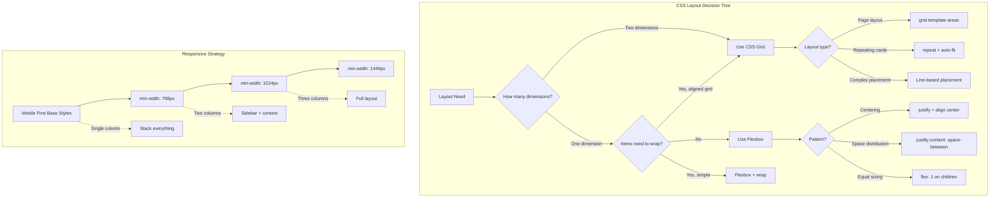
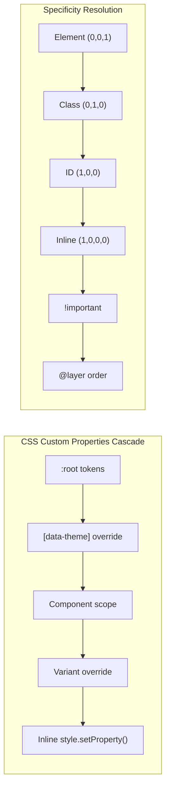

# HTML & CSS

## Quick Reference

- HTML5 semantic elements: `<header>`, `<nav>`, `<main>`, `<article>`, `<section>`, `<aside>`, `<footer>` provide meaning to document structure
- ARIA roles and attributes supplement native semantics: `role`, `aria-label`, `aria-describedby`, `aria-live`, `aria-hidden`
- Flexbox: one-dimensional layout (row or column) with `display: flex`, controlled by `justify-content`, `align-items`, `flex-grow/shrink/basis`
- Grid: two-dimensional layout with `display: grid`, controlled by `grid-template-columns/rows`, `grid-area`, `gap`
- Responsive design breakpoints: mobile-first with `min-width` media queries at 480px, 768px, 1024px, 1440px
- CSS custom properties (variables): declared with `--name: value` on `:root` or any selector, consumed with `var(--name, fallback)`
- Box model: `box-sizing: border-box` ensures padding and border are included in element dimensions
- Specificity hierarchy: inline styles (1000) > ID selectors (100) > class/attribute/pseudo-class (10) > element/pseudo-element (1)
- CSS cascade layers (`@layer`) provide explicit control over specificity ordering across stylesheets

## When to Use

Semantic HTML and modern CSS are the foundation of every web application regardless of framework choice. Use semantic HTML when you need to communicate document structure to assistive technologies, search engines, and other machines that parse your markup. Semantic elements replace generic `<div>` and `<span>` wrappers with meaningful containers that describe their content's role in the page hierarchy. This is not optional for production applications — accessibility compliance (WCAG 2.1 AA) requires proper semantic structure, and search engine optimization depends on machines understanding your content hierarchy.

Use Flexbox for one-dimensional layouts where items flow in a single direction: navigation bars, card rows, centering content, distributing space between items, and aligning elements along a cross axis. Flexbox excels when the number of items is dynamic or when you need items to grow and shrink proportionally to fill available space. Choose Grid over Flexbox when you need simultaneous control over both rows and columns, such as page-level layouts, dashboard widgets, image galleries with consistent sizing, or any design where items must align to a two-dimensional coordinate system.

Responsive design with mobile-first media queries ensures your application works on every viewport from 320px phones to 2560px ultrawide monitors. Start with the mobile layout as the default (no media query), then progressively enhance with `min-width` breakpoints. This approach results in simpler CSS because mobile layouts are typically single-column and linear, requiring fewer overrides as viewport width increases.

CSS custom properties enable theming, design token systems, and runtime style manipulation that preprocessor variables cannot achieve. Unlike Sass or Less variables which compile to static values, custom properties cascade through the DOM, can be overridden per-component, respond to media queries, and can be manipulated with JavaScript at runtime. Use them for color schemes, spacing scales, typography scales, and any value that changes based on context (dark mode, component variants, responsive adjustments).

## Semantic HTML

Semantic HTML means choosing elements based on their meaning rather than their default visual appearance. A `<nav>` element tells screen readers "this is navigation," enabling users to jump directly to it. A `<main>` element identifies the primary content area, allowing assistive technology to skip repetitive headers and sidebars. These distinctions are invisible to sighted users but transformative for people using screen readers, keyboard navigation, or voice control.

The document outline is built from sectioning elements (`<article>`, `<section>`, `<nav>`, `<aside>`) and heading levels (`<h1>` through `<h6>`). Each sectioning element creates a new outline node, and headings within it define the section's hierarchy. A well-structured outline enables screen reader users to navigate by heading level, jumping between sections efficiently. The rule is simple: use exactly one `<h1>` per page for the primary title, then nest `<h2>` through `<h6>` without skipping levels within each section.

The `<article>` element represents self-contained content that could be independently distributed or syndicated — blog posts, news articles, forum posts, product cards. The `<section>` element groups thematically related content within a page, typically with its own heading. The distinction matters: an `<article>` makes sense in isolation (you could put it in an RSS feed), while a `<section>` is a thematic grouping that depends on its surrounding context.

Forms are where semantic HTML has the most direct impact on usability. Every `<input>` needs an associated `<label>` element (via `for` attribute matching the input's `id`, or by wrapping the input inside the label). Fieldsets group related inputs with a `<legend>` describing the group. The `<button>` element is inherently focusable and activatable with Enter or Space, while a `<div>` styled as a button requires manual ARIA roles, tabindex, and keyboard event handlers to achieve the same functionality — and still misses edge cases.

```html
<!-- Semantic document structure -->
<body>
  <header>
    <nav aria-label="Main navigation">
      <ul role="list">
        <li><a href="/" aria-current="page">Home</a></li>
        <li><a href="/docs">Documentation</a></li>
        <li><a href="/blog">Blog</a></li>
      </ul>
    </nav>
  </header>

  <main id="main-content">
    <article>
      <header>
        <h1>Understanding CSS Grid Layout</h1>
        <time datetime="2024-03-15">March 15, 2024</time>
      </header>

      <section aria-labelledby="basics-heading">
        <h2 id="basics-heading">Grid Basics</h2>
        <p>CSS Grid provides a two-dimensional layout system...</p>
      </section>

      <section aria-labelledby="examples-heading">
        <h2 id="examples-heading">Practical Examples</h2>
        <figure>
          <pre><code class="language-css">/* Grid code example */</code></pre>
          <figcaption>A responsive grid layout using auto-fill</figcaption>
        </figure>
      </section>

      <footer>
        <p>Published in <a href="/category/css">CSS</a></p>
      </footer>
    </article>
  </main>

  <aside aria-label="Related articles">
    <h2>Related Reading</h2>
    <ul>
      <li><a href="/flexbox-guide">Flexbox Complete Guide</a></li>
    </ul>
  </aside>

  <footer>
    <p>&copy; 2024 CS Reference Guide</p>
  </footer>
</body>
```

## Accessibility

Web accessibility (a11y) ensures that people with disabilities can perceive, understand, navigate, and interact with web content. WCAG 2.1 defines three conformance levels: A (minimum), AA (standard for most legal requirements), and AAA (enhanced). Most organizations target AA compliance, which covers color contrast ratios (4.5:1 for normal text, 3:1 for large text), keyboard operability, screen reader compatibility, and content adaptability.

The accessibility tree is a parallel structure to the DOM that browsers construct for assistive technologies. Every DOM element maps to an accessibility tree node with a computed role, name, value, and state. Native HTML elements have implicit roles (`<button>` has role "button", `<a href>` has role "link"), while ARIA attributes override or supplement these implicit semantics. The first rule of ARIA is: do not use ARIA if a native HTML element provides the semantics you need. Native elements come with built-in keyboard handling, focus management, and state communication that ARIA attributes alone cannot replicate.

Keyboard navigation is the foundation of accessible interaction. Every interactive element must be reachable via Tab key (or Shift+Tab for reverse), activatable with Enter or Space, and dismissible with Escape where appropriate (modals, dropdowns, tooltips). Focus order must follow a logical reading sequence — typically left-to-right, top-to-bottom in LTR languages. Custom components like dropdown menus, tabs, and carousels require explicit focus management using `tabindex`, `aria-activedescendant`, or programmatic `element.focus()` calls.

Live regions (`aria-live`) announce dynamic content changes to screen readers without requiring the user to navigate to the changed element. Use `aria-live="polite"` for non-urgent updates (new chat messages, form validation results) that wait for the screen reader to finish its current announcement. Use `aria-live="assertive"` only for critical alerts (session expiration, error states) that interrupt the current announcement immediately. Overusing assertive announcements creates a disruptive experience equivalent to constant popup alerts for sighted users.

Color must never be the sole means of conveying information. Error states need both red color and an icon or text label. Links within body text need underlines (not just color differentiation). Chart data needs patterns or labels in addition to color coding. This principle extends to focus indicators: the default browser focus outline must remain visible (never `outline: none` without a replacement) and meet the 3:1 contrast ratio against adjacent colors.

```html
<!-- Accessible form with validation -->
<form aria-labelledby="signup-heading" novalidate>
  <h2 id="signup-heading">Create Account</h2>

  <div role="alert" aria-live="polite" id="form-errors">
    <!-- Populated dynamically when validation fails -->
  </div>

  <fieldset>
    <legend>Personal Information</legend>

    <div class="field">
      <label for="email">Email address <span aria-hidden="true">*</span></label>
      <input
        type="email"
        id="email"
        name="email"
        required
        aria-required="true"
        aria-describedby="email-hint email-error"
        autocomplete="email"
      />
      <span id="email-hint" class="hint">We'll never share your email</span>
      <span id="email-error" class="error" role="alert" hidden>
        Please enter a valid email address
      </span>
    </div>

    <div class="field">
      <label for="password">Password <span aria-hidden="true">*</span></label>
      <input
        type="password"
        id="password"
        name="password"
        required
        aria-required="true"
        aria-describedby="password-requirements"
        minlength="8"
      />
      <ul id="password-requirements" class="hint">
        <li>At least 8 characters</li>
        <li>One uppercase letter</li>
        <li>One number or symbol</li>
      </ul>
    </div>
  </fieldset>

  <button type="submit">Create Account</button>
</form>
```

## Flexbox

Flexbox (Flexible Box Layout) is a one-dimensional layout model that distributes space among items in a container along a single axis (main axis) while providing alignment control along the perpendicular axis (cross axis). The main axis direction is set by `flex-direction`: `row` (default, horizontal) or `column` (vertical). Every direct child of a flex container becomes a flex item with properties controlling how it grows, shrinks, and aligns within the available space.

The `justify-content` property controls distribution along the main axis: `flex-start` (pack items to the start), `flex-end` (pack to end), `center` (center items), `space-between` (equal space between items, no space at edges), `space-around` (equal space around each item), and `space-evenly` (equal space between items and at edges). The `align-items` property controls alignment along the cross axis: `stretch` (default, fill the container height), `flex-start`, `flex-end`, `center`, and `baseline` (align text baselines).

The `flex` shorthand property (`flex-grow flex-shrink flex-basis`) is the most important flex item property. `flex-grow` determines how much an item grows relative to siblings when extra space is available (0 means don't grow). `flex-shrink` determines how much an item shrinks relative to siblings when space is insufficient (0 means don't shrink). `flex-basis` sets the initial size before growing or shrinking is applied (`auto` uses the item's content size or explicit width/height). The shorthand `flex: 1` is equivalent to `flex: 1 1 0%`, meaning the item grows and shrinks equally with a zero base size — useful for equal-width columns.

The `flex-wrap` property controls whether items wrap to new lines when they exceed the container width. By default (`nowrap`), items shrink to fit on one line. Setting `flex-wrap: wrap` allows items to flow to the next line, creating a multi-line flex layout. Combined with `flex-basis` as a percentage or fixed width, wrapping creates responsive grid-like layouts without media queries. The `align-content` property (only effective with wrapping) controls how wrapped lines are distributed along the cross axis.

```css
/* Common Flexbox patterns */

/* 1. Centered content (both axes) */
.center-content {
  display: flex;
  justify-content: center;
  align-items: center;
  min-height: 100vh;
}

/* 2. Navigation bar with logo left, links right */
.navbar {
  display: flex;
  justify-content: space-between;
  align-items: center;
  padding: 1rem 2rem;
}

.navbar__links {
  display: flex;
  gap: 1.5rem;
  list-style: none;
}

/* 3. Card row that wraps responsively */
.card-grid {
  display: flex;
  flex-wrap: wrap;
  gap: 1.5rem;
}

.card {
  flex: 1 1 300px; /* Grow, shrink, min 300px before wrapping */
  max-width: 400px;
}

/* 4. Sticky footer layout */
.page-layout {
  display: flex;
  flex-direction: column;
  min-height: 100vh;
}

.page-layout__content {
  flex: 1; /* Grows to push footer down */
}

/* 5. Equal-height columns */
.columns {
  display: flex;
  gap: 2rem;
}

.columns__item {
  flex: 1;
  display: flex;
  flex-direction: column;
}

.columns__item-footer {
  margin-top: auto; /* Push to bottom of column */
}
```

## Grid

CSS Grid is a two-dimensional layout system that allows you to define both rows and columns simultaneously, placing items into cells, spanning them across tracks, and creating complex layouts that were previously impossible without nested containers or JavaScript. Grid operates on the container level (defining the track structure) and the item level (placing items within that structure).

The `grid-template-columns` and `grid-template-rows` properties define the track sizing. Tracks can use fixed units (`px`, `rem`), flexible units (`fr` — fraction of available space), percentages, or intrinsic sizing functions (`min-content`, `max-content`, `auto`). The `repeat()` function avoids repetition: `repeat(3, 1fr)` creates three equal columns. The `minmax()` function sets a size range: `minmax(200px, 1fr)` creates tracks that are at least 200px but grow to fill available space.

The `auto-fill` and `auto-fit` keywords within `repeat()` create responsive grids without media queries. `repeat(auto-fill, minmax(250px, 1fr))` creates as many 250px-minimum columns as fit in the container, with remaining space distributed equally. The difference between `auto-fill` and `auto-fit`: `auto-fill` creates empty tracks when there are fewer items than columns, while `auto-fit` collapses empty tracks so items stretch to fill the container. For most responsive layouts, `auto-fit` produces the desired behavior.

Grid placement uses line numbers, named lines, or named areas. Items are placed with `grid-column` and `grid-row` shorthand properties (e.g., `grid-column: 1 / 3` spans from line 1 to line 3, covering two columns). The `grid-template-areas` property provides a visual ASCII-art syntax for defining layouts, where each string represents a row and each word represents a named area. Items are then placed with `grid-area: name`. This approach makes complex layouts readable and maintainable.

The `gap` property (shorthand for `row-gap` and `column-gap`) adds consistent spacing between tracks without affecting the outer edges of the grid. This eliminates the need for margin-based spacing with negative margins on the container — a common hack in pre-Grid layouts. Subgrid (`grid-template-columns: subgrid`) allows nested grids to inherit track sizing from their parent, ensuring alignment across nested components.

```css
/* CSS Grid layout patterns */

/* 1. Classic holy grail layout with named areas */
.page-layout {
  display: grid;
  grid-template-areas:
    "header  header  header"
    "sidebar content aside"
    "footer  footer  footer";
  grid-template-columns: 250px 1fr 200px;
  grid-template-rows: auto 1fr auto;
  min-height: 100vh;
  gap: 1rem;
}

.page-header  { grid-area: header; }
.page-sidebar { grid-area: sidebar; }
.page-content { grid-area: content; }
.page-aside   { grid-area: aside; }
.page-footer  { grid-area: footer; }

/* 2. Responsive auto-fit card grid */
.dashboard-widgets {
  display: grid;
  grid-template-columns: repeat(auto-fit, minmax(300px, 1fr));
  gap: 1.5rem;
  padding: 1.5rem;
}

/* 3. Spanning items for featured content */
.featured-card {
  grid-column: span 2;
  grid-row: span 2;
}

/* 4. Dense packing for masonry-like layouts */
.image-gallery {
  display: grid;
  grid-template-columns: repeat(auto-fill, minmax(200px, 1fr));
  grid-auto-rows: 200px;
  grid-auto-flow: dense;
  gap: 0.5rem;
}

.image-gallery__item--tall {
  grid-row: span 2;
}

.image-gallery__item--wide {
  grid-column: span 2;
}

/* 5. Responsive layout without media queries */
.responsive-layout {
  display: grid;
  grid-template-columns: repeat(auto-fit, minmax(min(100%, 400px), 1fr));
  gap: 2rem;
}
```

## Responsive Design

Responsive design is the practice of building interfaces that adapt fluidly to any viewport size, input method, and device capability. The mobile-first approach starts with the smallest viewport as the default style and progressively enhances with `min-width` media queries. This produces leaner CSS because mobile layouts are simpler (single column, stacked elements) and larger viewports add complexity rather than overriding it.

The viewport meta tag (`<meta name="viewport" content="width=device-width, initial-scale=1">`) is required for responsive design to function on mobile devices. Without it, mobile browsers render the page at a desktop width (typically 980px) and scale it down, making text unreadable and touch targets too small. The `width=device-width` instruction tells the browser to use the actual device width as the viewport width, and `initial-scale=1` prevents automatic zooming.

Media queries are the primary mechanism for applying styles conditionally based on viewport characteristics. The most common queries use `min-width` (mobile-first) or `max-width` (desktop-first) to target viewport width ranges. Modern CSS also supports `prefers-color-scheme` (dark/light mode), `prefers-reduced-motion` (accessibility), `hover` (touch vs. pointer devices), and `prefers-contrast` (high contrast mode). Container queries (`@container`) are a newer addition that allow components to respond to their parent container's size rather than the viewport, enabling truly reusable responsive components.

Fluid typography uses `clamp()` to create text that scales smoothly between minimum and maximum sizes without breakpoints. The formula `clamp(min, preferred, max)` sets a floor, a fluid middle value (typically using viewport units), and a ceiling. For example, `font-size: clamp(1rem, 2.5vw, 2rem)` creates text that is never smaller than 1rem, never larger than 2rem, and scales fluidly between those bounds based on viewport width. This eliminates the need for font-size media queries in most cases.

Touch targets on mobile must be at least 44×44 CSS pixels (per WCAG 2.5.5) with at least 8px spacing between adjacent targets. This applies to buttons, links, form inputs, and any interactive element. Padding is the preferred method for increasing touch target size without affecting visual design — a small icon button can have generous padding to meet the 44px minimum while the visible icon remains compact.

```css
/* Mobile-first responsive design system */

/* Base: Mobile (< 480px) — no media query needed */
.container {
  width: 100%;
  padding-inline: 1rem;
  margin-inline: auto;
}

.grid {
  display: grid;
  grid-template-columns: 1fr;
  gap: 1rem;
}

/* Fluid typography */
:root {
  --font-size-base: clamp(1rem, 0.9rem + 0.5vw, 1.125rem);
  --font-size-h1: clamp(1.75rem, 1.5rem + 1.5vw, 3rem);
  --font-size-h2: clamp(1.375rem, 1.2rem + 1vw, 2.25rem);
  --spacing-unit: clamp(0.75rem, 0.5rem + 1vw, 1.5rem);
}

body {
  font-size: var(--font-size-base);
  line-height: 1.6;
}

/* Tablet breakpoint */
@media (min-width: 768px) {
  .container {
    padding-inline: 2rem;
    max-width: 720px;
  }

  .grid {
    grid-template-columns: repeat(2, 1fr);
    gap: 1.5rem;
  }

  .sidebar {
    display: block; /* Hidden on mobile */
    width: 250px;
  }
}

/* Desktop breakpoint */
@media (min-width: 1024px) {
  .container {
    max-width: 960px;
    padding-inline: 2rem;
  }

  .grid {
    grid-template-columns: repeat(3, 1fr);
    gap: 2rem;
  }
}

/* Large desktop */
@media (min-width: 1440px) {
  .container {
    max-width: 1200px;
  }
}

/* Accessibility: reduced motion */
@media (prefers-reduced-motion: reduce) {
  *,
  *::before,
  *::after {
    animation-duration: 0.01ms !important;
    animation-iteration-count: 1 !important;
    transition-duration: 0.01ms !important;
    scroll-behavior: auto !important;
  }
}

/* Dark mode support */
@media (prefers-color-scheme: dark) {
  :root {
    --color-bg: #1a1a2e;
    --color-text: #e0e0e0;
    --color-primary: #6366f1;
  }
}

/* Touch target sizing */
.btn,
.nav-link,
.form-input {
  min-height: 44px;
  min-width: 44px;
  padding: 0.75rem 1rem;
}
```

## CSS Custom Properties

CSS custom properties (also called CSS variables) are entities defined by authors that contain specific values to be reused throughout a document. Unlike preprocessor variables (Sass `$variable`, Less `@variable`), custom properties are live in the browser: they cascade through the DOM, can be scoped to any selector, respond to media queries, and can be read and written by JavaScript at runtime. This makes them the foundation of modern theming systems, design token implementations, and dynamic style manipulation.

Custom properties are declared with a double-hyphen prefix (`--property-name`) and consumed with the `var()` function. The `var()` function accepts an optional fallback value: `var(--color-primary, #6366f1)` uses the fallback if `--color-primary` is not defined in the cascade. Fallbacks can be nested: `var(--color-primary, var(--color-default, blue))`. Custom properties participate in the cascade like any other CSS property — a more specific selector's value overrides a less specific one, and child elements inherit from parents.

Scoping custom properties to components creates self-contained, themeable modules. A card component can define `--card-padding`, `--card-radius`, and `--card-bg` on its root element, with internal elements consuming these variables. Parent contexts can override these variables without modifying the component's stylesheet, enabling variant creation through composition rather than duplication. This pattern aligns with design token systems where tokens are defined globally and consumed locally.

The combination of custom properties with `calc()` enables mathematical relationships between values. A spacing scale can be derived from a single base value: `--space-1: calc(var(--space-base) * 0.25)`, `--space-2: calc(var(--space-base) * 0.5)`, etc. Typography scales, color lightness variations, and responsive sizing can all be expressed as calculations on base custom properties, creating systems where changing one value propagates consistently through the entire design.

JavaScript interaction with custom properties uses `element.style.setProperty('--name', value)` to set and `getComputedStyle(element).getPropertyValue('--name')` to read. This enables dynamic theming (user-selected colors), animation (updating properties in `requestAnimationFrame`), and responsive behavior (setting properties based on scroll position or intersection observer data) without class toggling or inline style manipulation.

```css
/* Design token system with CSS custom properties */

/* Global tokens — design system level */
:root {
  /* Color palette */
  --color-primary-50: #eef2ff;
  --color-primary-100: #e0e7ff;
  --color-primary-500: #6366f1;
  --color-primary-600: #4f46e5;
  --color-primary-700: #4338ca;
  --color-primary-900: #312e81;

  /* Semantic tokens */
  --color-bg: #ffffff;
  --color-text: #1f2937;
  --color-text-muted: #6b7280;
  --color-border: #e5e7eb;
  --color-surface: #f9fafb;
  --color-accent: var(--color-primary-500);
  --color-error: #ef4444;
  --color-success: #10b981;

  /* Spacing scale (4px base) */
  --space-base: 0.25rem;
  --space-1: calc(var(--space-base) * 1);   /* 4px */
  --space-2: calc(var(--space-base) * 2);   /* 8px */
  --space-3: calc(var(--space-base) * 3);   /* 12px */
  --space-4: calc(var(--space-base) * 4);   /* 16px */
  --space-6: calc(var(--space-base) * 6);   /* 24px */
  --space-8: calc(var(--space-base) * 8);   /* 32px */

  /* Typography */
  --font-sans: 'Inter', system-ui, -apple-system, sans-serif;
  --font-mono: 'JetBrains Mono', 'Fira Code', monospace;
  --radius-sm: 0.25rem;
  --radius-md: 0.5rem;
  --radius-lg: 1rem;
  --shadow-sm: 0 1px 2px rgba(0, 0, 0, 0.05);
  --shadow-md: 0 4px 6px rgba(0, 0, 0, 0.1);
  --transition-fast: 150ms ease;
  --transition-normal: 300ms ease;
}

/* Dark theme override */
[data-theme="dark"] {
  --color-bg: #1a1a2e;
  --color-text: #e5e7eb;
  --color-text-muted: #9ca3af;
  --color-border: #374151;
  --color-surface: #1f2937;
  --color-accent: #818cf8;
}

/* Component-scoped tokens */
.card {
  --card-padding: var(--space-6);
  --card-radius: var(--radius-md);
  --card-bg: var(--color-surface);
  --card-border: var(--color-border);

  padding: var(--card-padding);
  border-radius: var(--card-radius);
  background: var(--card-bg);
  border: 1px solid var(--card-border);
  box-shadow: var(--shadow-sm);
  transition: box-shadow var(--transition-fast);
}

.card:hover {
  box-shadow: var(--shadow-md);
}

/* Variant through property override */
.card--featured {
  --card-bg: var(--color-primary-50);
  --card-border: var(--color-primary-200);
}
```

## Architecture and Diagrams





## Common Pitfalls

1. **Div soup instead of semantic elements**: Using `<div>` for everything creates an inaccessible, unsearchable document. Screen readers cannot distinguish navigation from content from sidebars. Replace `<div class="nav">` with `<nav>`, `<div class="main">` with `<main>`, and `<div class="footer">` with `<footer>`. The semantic version is shorter, more accessible, and better for SEO.

2. **Removing focus outlines without replacement**: Setting `outline: none` or `outline: 0` on interactive elements makes the page unusable for keyboard users who cannot see which element is focused. Always provide a visible focus indicator — either keep the browser default or replace it with a custom style using `:focus-visible` (which only shows for keyboard navigation, not mouse clicks).

3. **Using px for font sizes**: Pixel-based font sizes override user browser settings for text size. Users who set their browser to 20px base font size (for vision impairment) will not benefit from your design. Use `rem` for font sizes so they scale with the user's preference. Use `em` for spacing that should scale with the local font size.

4. **Fixed-width layouts that break on mobile**: Setting `width: 960px` on a container creates horizontal scrolling on any device narrower than 960px. Use `max-width` instead of `width`, and combine with percentage-based or `fr`-based sizing. The container should never be wider than the viewport.

5. **Overusing `!important`**: Each `!important` declaration creates a specificity escalation that can only be overridden by another `!important` with higher specificity. This leads to specificity wars where every override needs `!important`. Instead, fix the root cause: reduce selector specificity, use CSS layers (`@layer`), or restructure the cascade.

6. **Ignoring the `prefers-reduced-motion` media query**: Animations and transitions can cause nausea, dizziness, and seizures for users with vestibular disorders. Always wrap non-essential animations in a `prefers-reduced-motion: no-preference` check, or disable them when `prefers-reduced-motion: reduce` is active.

7. **Missing alt text on images**: Every `` element must have an `alt` attribute. Decorative images use `alt=""` (empty string) to be skipped by screen readers. Informative images need descriptive alt text that conveys the same information the image provides visually. Never use "image of" or "picture of" as prefixes — screen readers already announce it as an image.

## Real-World Use Cases

- **Design system implementation**: Large organizations build design systems using CSS custom properties as design tokens. A single source of truth defines colors, spacing, typography, and component dimensions. Teams consume these tokens in their components, ensuring visual consistency across dozens of applications. Theme switching (light/dark/high-contrast) is achieved by overriding token values on a parent element, with all components updating automatically through the cascade.

- **E-commerce product grid**: An online store uses CSS Grid with `auto-fit` and `minmax()` to display product cards that automatically reflow from 4 columns on desktop to 2 on tablet to 1 on mobile, without a single media query. Featured products span multiple grid cells using `grid-column: span 2`. The layout adapts to any screen size while maintaining consistent spacing and alignment.

- **Accessible government forms**: Government websites must meet WCAG 2.1 AA compliance by law. Forms use semantic HTML (`<fieldset>`, `<legend>`, `<label>`) with ARIA attributes for complex validation states. Error messages are announced via `aria-live` regions, focus is programmatically moved to the first error field on submission, and all interactive elements meet the 44px touch target minimum.

- **Dashboard layout with resizable panels**: A data analytics dashboard uses CSS Grid for the overall layout with named areas, Flexbox for widget internal layouts, and CSS custom properties for panel sizing. Users can resize panels by dragging dividers, which updates custom properties via JavaScript (`setProperty`), and the entire layout reflows smoothly without layout thrashing.

## Interview Questions

**Q: What is the difference between Flexbox and Grid, and when would you choose one over the other?**
A: Flexbox is one-dimensional (row or column), ideal for distributing space among items along a single axis — navigation bars, centering, card rows. Grid is two-dimensional (rows and columns simultaneously), ideal for page layouts, dashboards, and any design requiring items to align on both axes. Use Flexbox for component-level layout and Grid for page-level layout, though they compose well together.

**Q: Explain CSS specificity and how conflicts are resolved.**
A: Specificity is a weight system: inline styles (1,0,0,0), ID selectors (0,1,0,0), classes/attributes/pseudo-classes (0,0,1,0), elements/pseudo-elements (0,0,0,1). When multiple rules target the same element and property, the highest specificity wins. Equal specificity is resolved by source order (last declaration wins). `!important` overrides normal specificity but creates maintenance problems. CSS layers (`@layer`) provide explicit ordering independent of specificity.

**Q: How do CSS custom properties differ from Sass/Less variables?**
A: CSS custom properties are runtime values that cascade through the DOM, can be scoped to any selector, respond to media queries, and are readable/writable by JavaScript. Preprocessor variables compile to static values at build time — they cannot change based on context, DOM position, or user interaction. Custom properties enable dynamic theming, component variants, and responsive values that preprocessor variables cannot achieve.

**Q: What is the accessibility tree and how does HTML affect it?**
A: The accessibility tree is a simplified representation of the DOM that browsers expose to assistive technologies. Each node has a computed role, name, value, and state derived from the HTML element, its attributes, and ARIA overrides. Semantic HTML elements have implicit roles (`<button>` = "button", `<nav>` = "navigation") that populate the tree correctly without ARIA. Using generic elements like `<div>` creates nodes with no role, making content invisible or meaningless to screen reader users.

**Q: Explain the mobile-first approach to responsive design.**
A: Mobile-first means writing base styles for the smallest viewport (no media query) and adding complexity with `min-width` media queries for larger screens. This produces leaner CSS because mobile layouts are simpler (single column, stacked elements), and larger viewports add features rather than overriding them. It also ensures mobile users download only the CSS they need, improving performance on constrained devices.

## Production Tips

- **Use logical properties for internationalization**: Replace `margin-left`/`padding-right` with `margin-inline-start`/`padding-inline-end`. Logical properties automatically flip for RTL (right-to-left) languages without separate stylesheets. This is essential for applications supporting Arabic, Hebrew, or other RTL scripts, and is increasingly the default in modern CSS frameworks.

- **Implement a CSS reset or normalize**: Browsers have inconsistent default styles. Use a modern CSS reset (like Josh Comeau's custom reset or Andy Bell's modern reset) that removes default margins, sets `box-sizing: border-box` globally, and establishes sensible defaults for images and form elements. This eliminates cross-browser inconsistencies before you write any component styles.

- **Audit with Lighthouse and axe-core**: Run Lighthouse accessibility audits in CI/CD pipelines to catch regressions. Use axe-core (via browser extension or automated testing) for detailed WCAG violation reports. These tools catch missing alt text, insufficient color contrast, missing form labels, and focus order issues before they reach production.

- **Prefer `gap` over margin for spacing between items**: In Flex and Grid containers, `gap` creates consistent spacing between items without affecting the container edges. This eliminates the common pattern of `margin-right` on all items plus a negative margin on the container to compensate for the last item's margin. Gap is cleaner, more predictable, and works identically in both Flexbox and Grid.

- **Use `content-visibility: auto` for long pages**: For pages with many off-screen sections (documentation, long articles), `content-visibility: auto` tells the browser to skip rendering off-screen content until the user scrolls near it. This can dramatically reduce initial render time for content-heavy pages. Pair with `contain-intrinsic-size` to prevent layout shifts as content renders.

## Related Topics

- [React](./react.md) - React components consume HTML semantics and CSS patterns through JSX, with CSS Modules or styled-components for scoping
- [TypeScript](./typescript.md) - TypeScript provides type safety for CSS-in-JS solutions and design token systems
- [JavaScript](./javascript.md) - JavaScript manipulates CSS custom properties, manages focus, and implements responsive behavior beyond CSS capabilities
