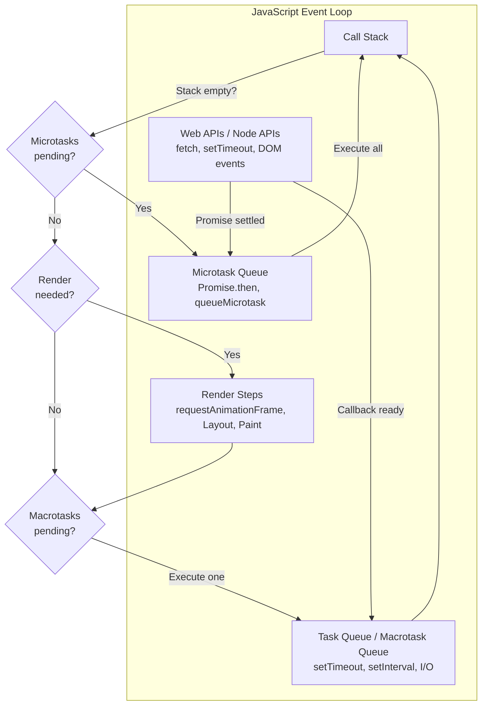
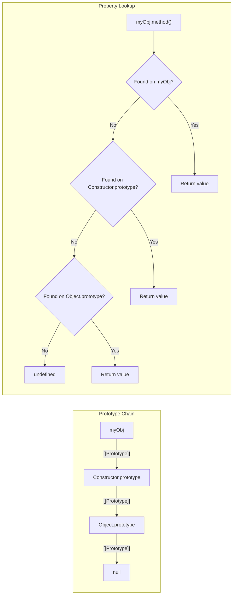
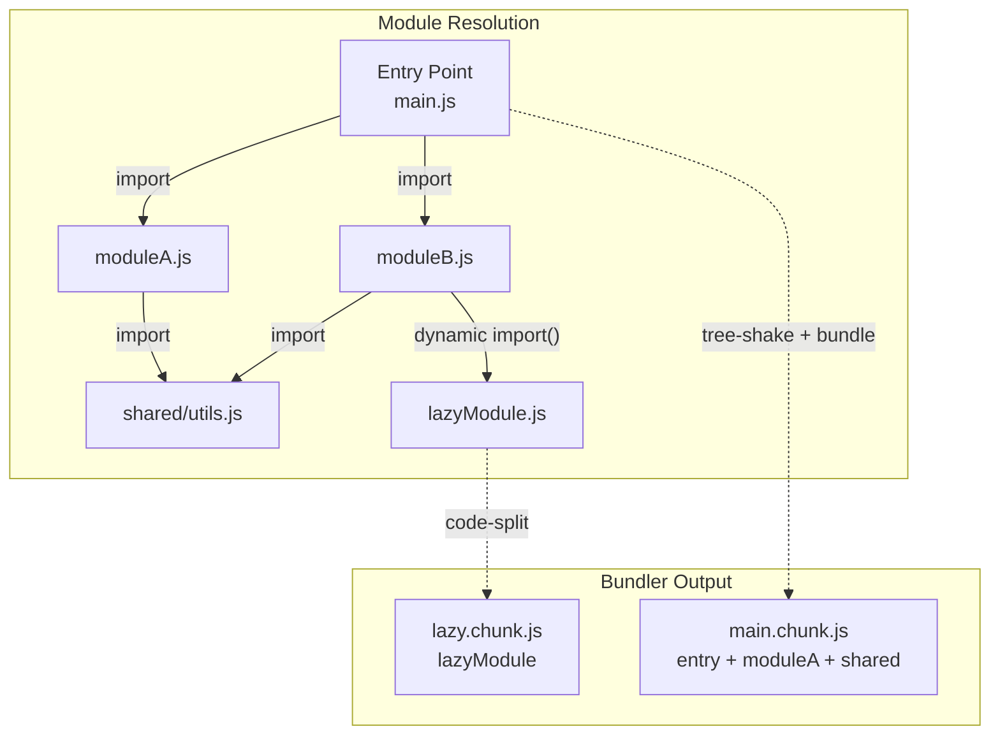

# JavaScript

## Quick Reference

- JavaScript is a dynamic, single-threaded, multi-paradigm language that runs in browsers and Node.js via the V8, SpiderMonkey, or JavaScriptCore engines
- ES6+ introduced `let`/`const`, arrow functions, template literals, destructuring, spread/rest operators, classes, modules, Promises, generators, iterators, `Symbol`, `Map`/`Set`, and `Proxy`/`Reflect`
- Closures capture variables from their lexical scope, enabling data privacy, partial application, and factory patterns
- Prototypal inheritance: every object has an internal `[[Prototype]]` link; property lookup walks the prototype chain until `null`
- The event loop processes the call stack, then microtasks (Promise callbacks, `queueMicrotask`), then macrotasks (`setTimeout`, `setInterval`, I/O)
- Promises represent eventual completion or failure; `async`/`await` is syntactic sugar over Promise chaining
- Module systems: ES Modules (`import`/`export`) are static and tree-shakeable; CommonJS (`require`/`module.exports`) is dynamic and synchronous
- Generators (`function*`) produce iterators that yield values lazily, enabling cooperative multitasking and infinite sequences

## When to Use

JavaScript is the foundational language of the web platform and the only language that runs natively in all browsers without compilation or plugins. Use JavaScript when building interactive user interfaces, single-page applications, server-side applications with Node.js, serverless functions, CLI tools, or any system that benefits from the massive npm ecosystem. JavaScript excels in event-driven architectures where non-blocking I/O and asynchronous patterns handle high concurrency without threading complexity. Choose JavaScript for rapid prototyping due to its dynamic typing and flexible object model, for full-stack development where sharing code between client and server reduces duplication, and for real-time applications leveraging WebSockets and event streams. In enterprise contexts, pair JavaScript with TypeScript for type safety while retaining runtime flexibility. JavaScript is particularly well-suited for microservice APIs with Express or Fastify, React or Angular frontends, build tooling with Vite or Webpack, and infrastructure automation with AWS CDK or Pulumi.

## ES6+ Features

ES6 (ECMAScript 2015) and subsequent yearly releases transformed JavaScript from a scripting language with well-known quirks into a modern, expressive language suitable for large-scale application development. Understanding these features is essential for reading and writing contemporary JavaScript codebases.

**Block scoping with `let` and `const`** replaced `var` as the default variable declaration. Unlike `var`, which is function-scoped and hoisted with an `undefined` value, `let` and `const` are block-scoped and exist in a temporal dead zone from the start of the block until the declaration is reached. Use `const` by default for values that should not be reassigned, and `let` when reassignment is necessary. Note that `const` prevents reassignment of the binding, not mutation of the value — a `const` object can still have its properties modified.

**Arrow functions** provide concise syntax and lexically bind `this`, eliminating the need for `var self = this` or `.bind(this)` patterns. Arrow functions do not have their own `this`, `arguments`, `super`, or `new.target`. This makes them ideal for callbacks and functional programming patterns but unsuitable as constructors or methods that need their own `this` context.

**Destructuring assignment** extracts values from arrays and properties from objects into distinct variables in a single statement. Combined with default values and rest elements, destructuring dramatically reduces boilerplate when working with function parameters, API responses, and configuration objects. Nested destructuring handles deeply nested structures but should be used judiciously to maintain readability.

**The spread operator (`...`)** expands iterables into individual elements (in array literals and function calls) or copies enumerable own properties (in object literals). The rest parameter syntax collects remaining arguments into an array, replacing the `arguments` object with a true array that supports array methods. Spread creates shallow copies, which is important to remember when working with nested objects.

**Template literals** use backticks and `${expression}` interpolation for string construction, supporting multi-line strings without concatenation and tagged templates for custom string processing (used in libraries like `styled-components` and GraphQL query builders).


```javascript
// ES6+ features demonstration
const createUser = ({ name, email, role = 'viewer' }) => ({
  id: crypto.randomUUID(),
  name,
  email,
  role,
  createdAt: new Date().toISOString(),
});

// Destructuring with rest, spread, and default values
const processConfig = ({ host, port = 3000, ...options }) => {
  const defaults = { timeout: 5000, retries: 3 };
  return { host, port, ...defaults, ...options };
};

// Template literals with tagged templates
const sql = (strings, ...values) =>
  strings.reduce((query, str, i) => {
    const value = i < values.length ? `$${i + 1}` : '';
    return query + str + value;
  }, '');

const table = 'users';
const query = sql`SELECT * FROM ${table} WHERE active = ${true}`;

// Optional chaining and nullish coalescing (ES2020)
const getUserCity = (user) =>
  user?.address?.city ?? 'Unknown';

// Array methods: flat, flatMap, at, findLast (ES2019-2023)
const nested = [[1, 2], [3, [4, 5]]];
const flat = nested.flat(Infinity); // [1, 2, 3, 4, 5]
const last = flat.at(-1);           // 5
```

## Closures

A closure is formed when a function retains access to variables from its lexical scope even after the outer function has returned. Every function in JavaScript creates a closure over its surrounding scope at the time of creation. Closures are not a special syntax or API — they are a fundamental consequence of lexical scoping combined with first-class functions.

The practical power of closures lies in data encapsulation. Before ES6 classes and modules, closures were the primary mechanism for creating private state in JavaScript. A function that returns another function (or an object with methods) can keep variables hidden from external access while exposing controlled interfaces. This pattern remains relevant in functional programming, React hooks, and middleware design.

Closures capture variables by reference, not by value. This means if the closed-over variable changes after the closure is created, the closure sees the updated value. This behavior is the source of the classic loop-with-`var` bug where all closures in a loop share the same variable. Using `let` (which creates a new binding per iteration) or an IIFE solves this by creating a fresh scope for each iteration.

Memory implications of closures are important in long-running applications. A closure keeps its entire scope chain alive as long as the closure itself is reachable. If a closure captures a large object that is no longer needed, it prevents garbage collection. In event handlers and timers, failing to remove listeners can create memory leaks through closures holding references to DOM elements or large data structures.

```javascript
// Closure for data privacy and encapsulation
function createCounter(initialValue = 0) {
  let count = initialValue;

  return {
    increment() { return ++count; },
    decrement() { return --count; },
    getCount() { return count; },
    reset() { count = initialValue; return count; },
  };
}

const counter = createCounter(10);
counter.increment(); // 11
counter.increment(); // 12
// count is not accessible directly — true privacy

// Closure for partial application / currying
const multiply = (a) => (b) => a * b;
const double = multiply(2);
const triple = multiply(3);
double(5); // 10
triple(5); // 15

// Closure in memoization
function memoize(fn) {
  const cache = new Map();
  return function (...args) {
    const key = JSON.stringify(args);
    if (cache.has(key)) return cache.get(key);
    const result = fn.apply(this, args);
    cache.set(key, result);
    return result;
  };
}

const expensiveCalc = memoize((n) => {
  console.log('Computing...');
  return n * n;
});
expensiveCalc(4); // Computing... 16
expensiveCalc(4); // 16 (cached, no log)
```

## Prototypes

JavaScript uses prototypal inheritance rather than classical inheritance. Every object has an internal `[[Prototype]]` link (accessible via `Object.getPrototypeOf()` or the deprecated `__proto__`) that points to another object. When a property is accessed on an object and not found, the engine walks up the prototype chain until it finds the property or reaches `null` (the end of the chain). This delegation mechanism is the foundation of JavaScript's object system.

Constructor functions and the `new` keyword create objects with their `prototype` property set as the new object's `[[Prototype]]`. When you write `new Array()`, the resulting array's prototype chain is: `instance → Array.prototype → Object.prototype → null`. This is why arrays have access to methods like `.map()` and `.toString()` — they are defined on `Array.prototype` and `Object.prototype` respectively.

ES6 classes are syntactic sugar over prototypal inheritance. A `class` declaration creates a constructor function whose `prototype` property holds the instance methods. The `extends` keyword sets up the prototype chain between child and parent prototypes and ensures the child constructor calls `super()`. Under the hood, `class Animal {}` and `function Animal() {}` with manual prototype assignment produce equivalent prototype chains.

The distinction between own properties and inherited properties matters for serialization and iteration. `Object.keys()` and `JSON.stringify()` only include own enumerable properties. `for...in` iterates over all enumerable properties including inherited ones (which is why `hasOwnProperty` checks were historically necessary). `Object.create(null)` creates an object with no prototype, useful for dictionary-like structures without inherited methods polluting key lookups.


```javascript
// Prototypal inheritance with constructor functions
function Shape(x, y) {
  this.x = x;
  this.y = y;
}
Shape.prototype.move = function (dx, dy) {
  this.x += dx;
  this.y += dy;
  return this;
};

function Circle(x, y, radius) {
  Shape.call(this, x, y); // Call parent constructor
  this.radius = radius;
}
// Set up prototype chain: Circle.prototype → Shape.prototype
Circle.prototype = Object.create(Shape.prototype);
Circle.prototype.constructor = Circle;
Circle.prototype.area = function () {
  return Math.PI * this.radius ** 2;
};

// ES6 class equivalent (syntactic sugar)
class Rectangle extends Shape {
  #width;  // Private field (ES2022)
  #height;

  constructor(x, y, width, height) {
    super(x, y);
    this.#width = width;
    this.#height = height;
  }

  get area() { return this.#width * this.#height; }

  static fromDimensions(width, height) {
    return new Rectangle(0, 0, width, height);
  }
}

// Prototype chain inspection
const rect = new Rectangle(0, 0, 10, 5);
Object.getPrototypeOf(rect) === Rectangle.prototype;       // true
Object.getPrototypeOf(Rectangle.prototype) === Shape.prototype; // true
rect instanceof Shape;     // true
rect instanceof Rectangle; // true
```

## Event Loop

The event loop is the execution model that enables JavaScript to perform non-blocking I/O despite being single-threaded. Understanding the event loop is critical for predicting execution order, avoiding UI freezes in browsers, and designing performant Node.js servers. The event loop continuously cycles through phases, processing tasks in a specific priority order.

The **call stack** is where synchronous code executes. Each function call pushes a frame onto the stack; when the function returns, its frame is popped. The engine processes the call stack to completion before checking for pending asynchronous work. A long-running synchronous operation blocks the entire thread — in browsers this freezes the UI, in Node.js it prevents handling other requests.

**Microtasks** (also called jobs) have the highest priority after the current synchronous execution completes. Promise `.then`/`.catch`/`.finally` callbacks, `queueMicrotask()`, and `MutationObserver` callbacks are microtasks. The engine drains the entire microtask queue before moving to the next macrotask. This means a microtask that enqueues another microtask will be processed in the same cycle, which can starve macrotasks if microtasks keep generating more microtasks.

**Macrotasks** (also called tasks) include `setTimeout`, `setInterval`, `setImmediate` (Node.js), I/O callbacks, and UI rendering events. After the microtask queue is empty, the event loop picks one macrotask from the queue, executes it (which may generate new microtasks), then drains the microtask queue again before picking the next macrotask. In browsers, rendering (layout, paint) happens between macrotasks, which is why `requestAnimationFrame` is preferred for visual updates.

In **Node.js**, the event loop has additional phases: timers (setTimeout/setInterval callbacks), pending callbacks (deferred I/O callbacks), idle/prepare (internal), poll (retrieve new I/O events), check (setImmediate callbacks), and close callbacks. The `process.nextTick` queue is drained after each phase transition, with even higher priority than Promise microtasks. This nuance means `process.nextTick` callbacks execute before any pending Promises in the same cycle.

```javascript
// Event loop execution order demonstration
console.log('1: Synchronous start');

setTimeout(() => console.log('2: setTimeout (macrotask)'), 0);

Promise.resolve()
  .then(() => console.log('3: Promise.then (microtask)'))
  .then(() => console.log('4: Chained Promise (microtask)'));

queueMicrotask(() => console.log('5: queueMicrotask'));

console.log('6: Synchronous end');

// Output order: 1, 6, 3, 5, 4, 2
// Synchronous code first, then all microtasks, then macrotasks

// Demonstrating microtask starvation
function starveMacrotasks() {
  let count = 0;
  function recursiveMicrotask() {
    if (count++ < 1000) {
      queueMicrotask(recursiveMicrotask);
    }
  }
  queueMicrotask(recursiveMicrotask);
  setTimeout(() => console.log('This waits for 1000 microtasks'), 0);
}
```

## Promises

Promises represent the eventual result of an asynchronous operation. A Promise is in one of three states: pending (initial state), fulfilled (operation completed successfully), or rejected (operation failed). Once settled (fulfilled or rejected), a Promise's state and value are immutable. Promises solve the callback hell problem by enabling flat, chainable asynchronous code and providing a standardized error propagation mechanism.

**Promise chaining** works because `.then()` and `.catch()` return new Promises. The value returned from a `.then` callback becomes the fulfillment value of the returned Promise. If a `.then` callback returns another Promise, the chain waits for it to settle before proceeding. This enables sequential asynchronous operations without nesting. Errors propagate down the chain until caught by a `.catch()` handler, similar to synchronous try/catch.

**`async`/`await`** (ES2017) provides synchronous-looking syntax for Promise-based code. An `async` function always returns a Promise. The `await` keyword pauses execution of the async function until the awaited Promise settles, then resumes with the fulfilled value or throws the rejection reason. Under the hood, `await` is equivalent to `.then()` — the code after `await` runs as a microtask. Error handling uses standard `try`/`catch` blocks, making async error flows intuitive.

**Promise combinators** handle multiple concurrent Promises. `Promise.all()` waits for all Promises to fulfill (or rejects on the first rejection). `Promise.allSettled()` waits for all to settle regardless of outcome. `Promise.race()` resolves or rejects with the first settled Promise. `Promise.any()` resolves with the first fulfilled Promise (rejects only if all reject with an `AggregateError`). Choosing the right combinator depends on whether you need all results, the fastest result, or can tolerate partial failures.


```javascript
// Promise patterns and combinators
async function fetchUserWithPosts(userId) {
  try {
    const user = await fetch(`/api/users/${userId}`).then(r => r.json());

    // Parallel fetching with Promise.all
    const [posts, followers] = await Promise.all([
      fetch(`/api/users/${userId}/posts`).then(r => r.json()),
      fetch(`/api/users/${userId}/followers`).then(r => r.json()),
    ]);

    return { ...user, posts, followers };
  } catch (error) {
    if (error instanceof TypeError) {
      throw new NetworkError('Failed to reach API server');
    }
    throw error;
  }
}

// Promise.allSettled for graceful partial failure
async function fetchDashboardData() {
  const results = await Promise.allSettled([
    fetchMetrics(),
    fetchAlerts(),
    fetchRecentActivity(),
  ]);

  return results.map((result, i) => ({
    section: ['metrics', 'alerts', 'activity'][i],
    data: result.status === 'fulfilled' ? result.value : null,
    error: result.status === 'rejected' ? result.reason.message : null,
  }));
}

// Custom retry with exponential backoff
function withRetry(fn, { maxRetries = 3, baseDelay = 1000 } = {}) {
  return async function (...args) {
    for (let attempt = 0; attempt <= maxRetries; attempt++) {
      try {
        return await fn(...args);
      } catch (error) {
        if (attempt === maxRetries) throw error;
        const delay = baseDelay * 2 ** attempt + Math.random() * 100;
        await new Promise(resolve => setTimeout(resolve, delay));
      }
    }
  };
}

const resilientFetch = withRetry(fetch, { maxRetries: 3, baseDelay: 500 });
```

## Generators

Generators are functions that can be paused and resumed, producing a sequence of values on demand via the iterator protocol. Declared with `function*` syntax, a generator function returns a generator object that conforms to both the iterable and iterator interfaces. Each `yield` expression pauses execution and produces a value; calling `.next()` resumes execution until the next `yield` or `return`.

The key insight about generators is that they enable **lazy evaluation**. Unlike arrays that compute and store all values upfront, generators produce values one at a time as requested. This makes them ideal for representing infinite sequences, processing large datasets without loading everything into memory, and implementing custom iteration protocols over complex data structures like trees and graphs.

**Two-way communication** distinguishes generators from simple iterators. The `.next(value)` method can pass a value back into the generator, which becomes the result of the `yield` expression. Similarly, `.throw(error)` injects an error into the generator at the point of the last `yield`, and `.return(value)` forces the generator to complete. This bidirectional channel enables generators to act as coroutines — cooperative concurrent tasks that yield control to each other.

**`yield*`** delegates to another iterable or generator, flattening nested iteration. When a generator encounters `yield*`, it iterates over the delegated iterable, yielding each value as if the outer generator produced it directly. This enables composition of generators and recursive generator patterns (e.g., tree traversal where each node yields itself then delegates to its children).

Generators combined with Promises formed the basis of async/await before it was standardized. Libraries like `co` used generators to write asynchronous code that looked synchronous by yielding Promises and resuming the generator with the resolved value. While async/await has largely replaced this pattern, understanding it illuminates how async/await works internally.

```javascript
// Infinite sequence generator
function* fibonacci() {
  let [a, b] = [0, 1];
  while (true) {
    yield a;
    [a, b] = [b, a + b];
  }
}

// Take utility for lazy sequences
function* take(n, iterable) {
  let count = 0;
  for (const value of iterable) {
    if (count++ >= n) return;
    yield value;
  }
}

const first10Fib = [...take(10, fibonacci())];
// [0, 1, 1, 2, 3, 5, 8, 13, 21, 34]

// Tree traversal with yield*
function* inorder(node) {
  if (!node) return;
  yield* inorder(node.left);
  yield node.value;
  yield* inorder(node.right);
}

// Bidirectional communication: stateful parser
function* tokenizer() {
  let input = yield; // First .next(value) provides input
  const tokens = [];

  while (input !== null) {
    const matches = input.matchAll(/\w+|[^\s]/g);
    for (const match of matches) {
      tokens.push(match[0]);
    }
    input = yield tokens.splice(0); // Yield tokens, receive next input
  }
  return tokens;
}

const parser = tokenizer();
parser.next();                          // Initialize
parser.next('const x = 42;');           // { value: ['const', 'x', '=', '42', ';'], done: false }
parser.next('let y = x + 1;');          // { value: ['let', 'y', '=', 'x', '+', '1', ';'], done: false }
parser.next(null);                      // { value: [], done: true }

// Async generator for streaming data
async function* streamEvents(url) {
  const response = await fetch(url);
  const reader = response.body.getReader();
  const decoder = new TextDecoder();

  while (true) {
    const { done, value } = await reader.read();
    if (done) break;
    yield decoder.decode(value, { stream: true });
  }
}
```

## Module Systems

Module systems solve the problems of global namespace pollution, dependency management, and code organization. JavaScript has evolved through several module patterns, from IIFEs and the revealing module pattern to standardized systems. Understanding both CommonJS and ES Modules is essential because Node.js codebases use both, and bundlers must reconcile them.

**CommonJS (CJS)** is the module system built into Node.js. Modules are loaded synchronously with `require()`, and exports are assigned to `module.exports` or the `exports` shorthand. CommonJS modules are evaluated at runtime — `require()` can appear inside conditionals, loops, or functions, and the module path can be a dynamic expression. This flexibility comes at the cost of static analyzability: bundlers cannot determine which exports are used without executing the code, making tree-shaking impossible with pure CommonJS.

**ES Modules (ESM)** are the standardized module system (ES2015+). Imports and exports are static declarations that must appear at the top level of a module. This static structure enables bundlers to perform tree-shaking (dead code elimination) by analyzing the import/export graph at build time. ES Modules are loaded asynchronously in browsers (via `<script type="module">`) and support both named exports and a single default export per module. Live bindings mean that if an exporting module changes a value, importing modules see the updated value.

**Interoperability** between CJS and ESM is a common pain point. In Node.js, ESM can import CJS modules (the `module.exports` object becomes the default import), but CJS cannot `require()` ESM modules synchronously (it must use dynamic `import()`). Bundlers like Webpack and Vite handle interop transparently, but understanding the underlying semantics prevents subtle bugs around default exports and named exports when mixing module systems.

**Dynamic `import()`** (ES2020) enables code splitting by loading modules on demand. It returns a Promise that resolves to the module namespace object. This is the mechanism behind lazy-loaded routes in React (`React.lazy`), conditional polyfill loading, and plugin architectures where modules are loaded based on runtime configuration.

```javascript
// ES Module patterns
// Named exports (preferred for libraries)
export const API_BASE = '/api/v1';
export function fetchJSON(url) {
  return fetch(`${API_BASE}${url}`).then(r => r.json());
}

// Default export (one per module, for primary functionality)
export default class EventBus {
  #listeners = new Map();

  on(event, handler) {
    if (!this.#listeners.has(event)) this.#listeners.set(event, []);
    this.#listeners.get(event).push(handler);
    return () => this.off(event, handler);
  }

  off(event, handler) {
    const handlers = this.#listeners.get(event);
    if (handlers) {
      this.#listeners.set(event, handlers.filter(h => h !== handler));
    }
  }

  emit(event, ...args) {
    const handlers = this.#listeners.get(event) ?? [];
    handlers.forEach(h => h(...args));
  }
}

// Dynamic import for code splitting
async function loadEditor() {
  const { EditorView } = await import('@codemirror/view');
  const { javascript } = await import('@codemirror/lang-javascript');
  return new EditorView({ extensions: [javascript()] });
}

// Re-export patterns for barrel files
export { default as Button } from './Button.js';
export { default as Input } from './Input.js';
export * from './validators.js';
```


## Architecture and Diagrams







## Common Pitfalls

1. **Implicit type coercion**: JavaScript's `==` operator performs type coercion, leading to surprising results like `[] == false` being `true` and `"" == 0` being `true`. Always use `===` for comparisons. Be aware that `+` with a string operand triggers string concatenation, so `"5" + 3` produces `"53"` while `"5" - 3` produces `2`.

2. **`this` binding confusion**: The value of `this` depends on how a function is called, not where it is defined (except for arrow functions). A method extracted from an object loses its `this` binding: `const fn = obj.method; fn()` sets `this` to `undefined` in strict mode. Use arrow functions, `.bind()`, or store the reference to avoid this issue in callbacks.

3. **Closure over loop variables with `var`**: Using `var` in a `for` loop creates a single binding shared across all iterations. Closures created inside the loop all reference the same variable, which holds the final value after the loop completes. Use `let` (which creates a new binding per iteration) or an IIFE to capture the current value.

4. **Unhandled Promise rejections**: A rejected Promise without a `.catch()` handler or `try`/`catch` in an `async` function results in an unhandled rejection, which crashes Node.js processes (since Node 15) and logs warnings in browsers. Always handle errors at the end of Promise chains and use global `unhandledrejection` event listeners as a safety net.

5. **Blocking the event loop**: CPU-intensive synchronous operations (large array sorts, complex regex, JSON parsing of huge payloads) block the single thread, freezing the UI or preventing other requests from being handled. Offload heavy computation to Web Workers (browser) or Worker Threads (Node.js), or break work into chunks with `setTimeout` or `requestIdleCallback`.

6. **Shallow copy surprises**: Spread syntax (`{...obj}`) and `Object.assign()` create shallow copies. Nested objects are still shared by reference. Mutating a nested property on the copy mutates the original. Use `structuredClone()` (modern) or libraries like Immer for deep immutable updates.

## Real-World Use Cases

- **Single-page application frameworks**: React, Angular, and Vue are built on JavaScript's event-driven model, closures for state management (React hooks are closures), prototypal patterns for component inheritance, and the module system for code organization. Understanding these fundamentals makes framework-specific patterns intuitive rather than magical.

- **Node.js API servers**: Express and Fastify leverage the event loop's non-blocking I/O to handle thousands of concurrent connections on a single thread. Middleware chains use closures to capture configuration, Promises for async request handling, and ES Modules for route organization. The event loop model means a single blocked operation degrades the entire server.

- **Build tools and bundlers**: Vite, Webpack, and Rollup use ES Module static analysis for tree-shaking, dynamic `import()` for code splitting, and generators for streaming file processing. Understanding module semantics is essential for configuring these tools and debugging bundle size issues.

- **Serverless functions**: AWS Lambda and Cloudflare Workers execute JavaScript in isolated environments where cold start time matters. ES Module top-level await, efficient closure patterns for connection reuse across invocations, and understanding the event loop help optimize function performance and avoid common pitfalls like connection pool exhaustion.

- **Real-time applications**: WebSocket servers and Server-Sent Events use the event loop's async model to maintain thousands of persistent connections. Generators and async iterators provide elegant APIs for consuming event streams, while closures maintain per-connection state without global variables.

## Interview Questions

**Q: Explain the difference between `var`, `let`, and `const`.**
A: `var` is function-scoped and hoisted with value `undefined`; `let` and `const` are block-scoped and exist in a temporal dead zone until declaration. `const` prevents reassignment of the binding but does not make the value immutable — object properties can still be modified.

**Q: What is the output of a `setTimeout(fn, 0)` placed between two `Promise.then()` calls?**
A: The Promise callbacks (microtasks) execute before the setTimeout callback (macrotask). Microtasks are drained completely after each synchronous execution and before any macrotask, so both Promise callbacks run first regardless of registration order relative to setTimeout.

**Q: How do closures enable the module pattern?**
A: A closure captures variables from its enclosing scope, keeping them alive but inaccessible from outside. The module pattern uses an IIFE that returns an object exposing only public methods, while private state remains in the closure scope. This provides encapsulation without classes or language-level access modifiers.

**Q: What happens when you `await` a non-Promise value?**
A: The value is implicitly wrapped in `Promise.resolve(value)`, so `await 42` is equivalent to `await Promise.resolve(42)`. Execution still yields to the microtask queue before resuming, meaning code after `await` always runs asynchronously even if the awaited value is already available.

**Q: Explain prototypal inheritance vs classical inheritance.**
A: In classical inheritance (Java, C++), classes define blueprints and instances are created from them with a fixed hierarchy. In prototypal inheritance, objects delegate to other objects directly via the prototype chain. There are no classes at the engine level — ES6 `class` is syntactic sugar. Objects can be created from other objects (`Object.create`), and the prototype chain can be modified at runtime, providing more flexibility but less structure.

## Production Tips

- **Bundle size management**: Use ES Modules exclusively to enable tree-shaking. Audit bundle size with `source-map-explorer` or `bundlephobia`. Prefer native APIs (`fetch`, `structuredClone`, `AbortController`) over polyfill-heavy libraries. Dynamic `import()` for routes and heavy components keeps initial load under budget.

- **Memory leak prevention**: Remove event listeners when components unmount. Use `WeakRef` and `FinalizationRegistry` for caches that should not prevent garbage collection. In Node.js, monitor heap size with `process.memoryUsage()` and use `--max-old-space-size` to set explicit limits. Closures in long-lived callbacks (intervals, event emitters) are the most common leak source.

- **Error monitoring**: Instrument global error handlers (`window.onerror`, `unhandledrejection`, `process.on('uncaughtException')`) to capture and report errors. Include stack traces, user context, and breadcrumbs. Use source maps in production error reporting to map minified stacks back to original source locations.

- **Performance profiling**: Use `performance.mark()` and `performance.measure()` for custom timing. In Node.js, the `--prof` flag generates V8 profiler output. Chrome DevTools Performance tab identifies long tasks blocking the main thread. Target under 50ms per task to maintain 60fps rendering.

- **Security hardening**: Sanitize all user input before DOM insertion to prevent XSS. Use `Content-Security-Policy` headers to restrict script sources. Avoid `eval()`, `new Function()`, and `innerHTML` with untrusted data. In Node.js, validate and sanitize request bodies, use parameterized queries, and keep dependencies updated to patch known vulnerabilities.

## Related Topics

- [TypeScript](./typescript.md) - TypeScript adds static typing to JavaScript, catching errors at compile time while compiling down to standard JavaScript
- [React](./react.md) - React leverages JavaScript closures (hooks), the event loop (concurrent rendering), and ES Modules (component architecture) extensively
- [HTML & CSS](./html-css.md) - JavaScript interacts with the DOM and CSSOM, manipulating the document structure and styles that HTML and CSS define
