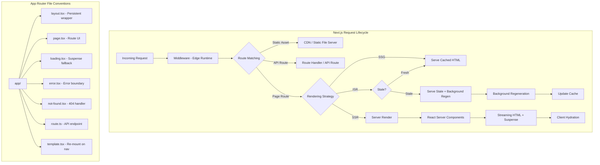
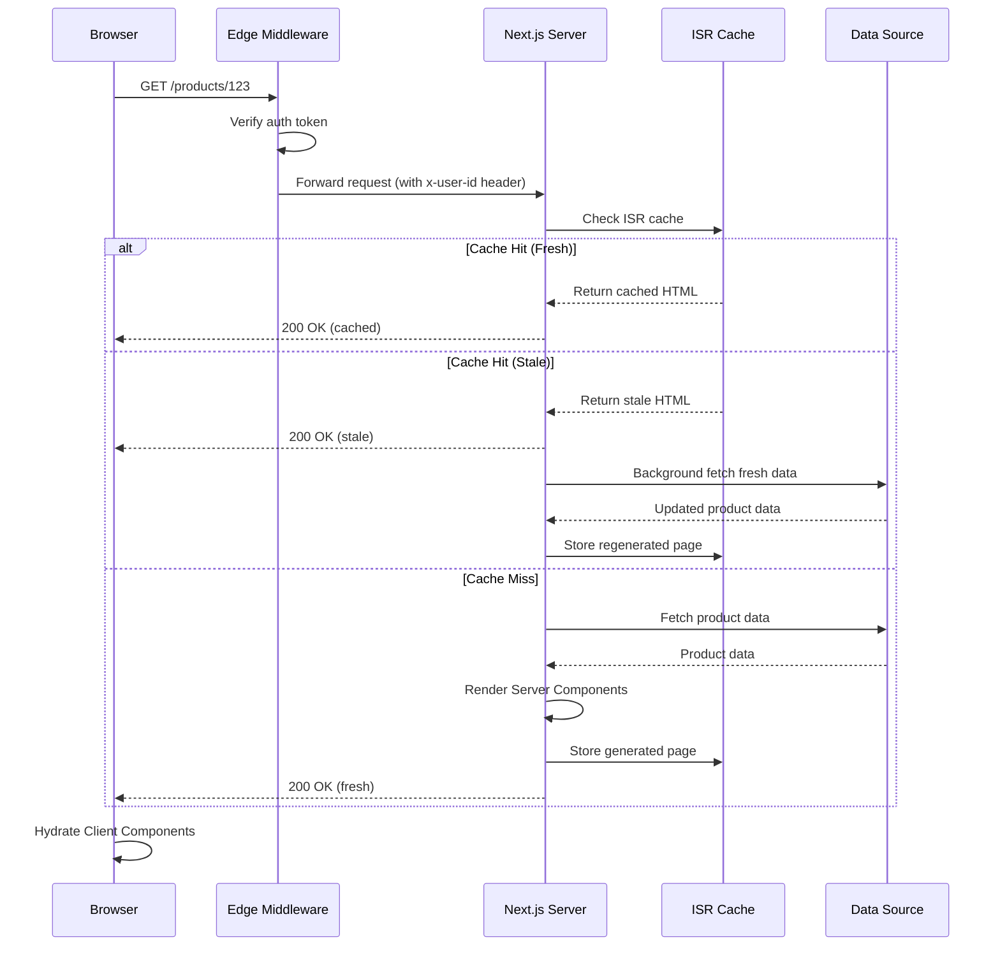

# Next.js

## Quick Reference

- Next.js is a React meta-framework by Vercel providing server-side rendering (SSR), static site generation (SSG), incremental static regeneration (ISR), and API routes out of the box
- App Router (Next.js 13+) uses file-system routing with `app/` directory, React Server Components by default, nested layouts, and streaming
- Pages Router (legacy) uses `pages/` directory with `getServerSideProps`, `getStaticProps`, and `getStaticPaths` for data fetching
- Rendering modes: SSR (per-request server render), SSG (build-time static HTML), ISR (static with background revalidation), CSR (client-side only)
- Middleware runs at the edge before requests reach route handlers, enabling authentication, redirects, rewrites, and header manipulation
- API routes provide serverless backend endpoints co-located with frontend code, supporting REST and edge runtime
- Built-in optimizations: automatic code splitting, image optimization (`next/image`), font optimization (`next/font`), script loading (`next/script`), and link prefetching (`next/link`)

## When to Use

Next.js is the right choice when you need a production-grade React application with server-side rendering for SEO, fast initial page loads, and a seamless developer experience. Choose Next.js when your application requires a mix of rendering strategies across different pages: marketing pages that benefit from static generation, dashboard pages that need server-side rendering with fresh data, and interactive components that require client-side hydration. Next.js excels in content-heavy applications like blogs, documentation sites, and e-commerce storefronts where SEO and performance are critical business requirements. It is particularly well-suited for teams that want a unified full-stack framework where API endpoints, server logic, and frontend components live in the same repository with shared TypeScript types. Prefer Next.js over plain React SPAs when you need first-contentful-paint under 1.5 seconds, when search engine crawlers must index your content, or when you want incremental static regeneration to serve stale content while revalidating in the background. Consider alternatives like Remix when you need nested route-level data loading with progressive enhancement, or Astro when your site is primarily static content with minimal interactivity.

## SSR

Server-Side Rendering generates HTML on the server for every incoming request, ensuring users and search engine crawlers receive fully rendered content without waiting for JavaScript to execute on the client. In Next.js, SSR is the default behavior in the App Router for any Server Component that performs data fetching, and is explicitly opted into in the Pages Router via `getServerSideProps`. The server executes the component tree, resolves all data dependencies, and streams the resulting HTML to the client along with a minimal JavaScript payload for hydration.

SSR is essential for pages that display user-specific or frequently changing data that cannot be pre-rendered at build time. Examples include personalized dashboards, search results pages, and authenticated content where the response depends on cookies or headers. The trade-off is increased server load and higher Time to First Byte (TTFB) compared to static pages, since every request triggers a full render cycle on the server.

In the App Router, Server Components are SSR by default. Any component in the `app/` directory that does not include the `"use client"` directive runs exclusively on the server. You can fetch data directly in the component body using `async/await` without additional API layers. Next.js automatically deduplicates identical fetch requests within a single render pass, and you can control caching behavior with the `cache` and `next.revalidate` options on individual fetch calls.

In the Pages Router, `getServerSideProps` runs on every request and passes its return value as props to the page component. The function has access to the request object, cookies, headers, and query parameters. It must return an object with a `props` key, a `redirect` key, or a `notFound: true` flag. The function never runs in the browser, so you can safely use server-only code like database queries or secret API keys.

```typescript
// App Router - Server Component with SSR (default behavior)
// app/dashboard/page.tsx
import { cookies } from 'next/headers';

interface DashboardData {
  user: { name: string; email: string };
  stats: { totalOrders: number; revenue: number };
}

export default async function DashboardPage() {
  const cookieStore = cookies();
  const token = cookieStore.get('session')?.value;

  const data: DashboardData = await fetch('https://api.example.com/dashboard', {
    headers: { Authorization: `Bearer ${token}` },
    cache: 'no-store', // Opt out of caching for fresh data every request
  }).then(res => res.json());

  return (
    <main>
      <h1>Welcome, {data.user.name}</h1>
      <div className="stats-grid">
        <StatCard label="Total Orders" value={data.stats.totalOrders} />
        <StatCard label="Revenue" value={`$${data.stats.revenue}`} />
      </div>
    </main>
  );
}
```

```typescript
// Pages Router - getServerSideProps
// pages/profile/[id].tsx
import { GetServerSideProps } from 'next';

interface ProfileProps {
  user: { id: string; name: string; bio: string };
}

export const getServerSideProps: GetServerSideProps<ProfileProps> = async (context) => {
  const { id } = context.params!;
  const res = await fetch(`https://api.example.com/users/${id}`);

  if (!res.ok) {
    return { notFound: true };
  }

  const user = await res.json();
  return { props: { user } };
};

export default function ProfilePage({ user }: ProfileProps) {
  return (
    <article>
      <h1>{user.name}</h1>
      <p>{user.bio}</p>
    </article>
  );
}
```

## SSG

Static Site Generation pre-renders pages at build time, producing plain HTML files that can be served directly from a CDN without any server computation at request time. SSG delivers the fastest possible page loads because the HTML is already generated and cached at the edge. In Next.js, SSG is achieved in the Pages Router via `getStaticProps` (optionally combined with `getStaticPaths` for dynamic routes) and in the App Router by using fetch with default caching behavior or by exporting `generateStaticParams` for dynamic segments.

SSG is ideal for content that does not change between deployments or changes infrequently enough that rebuilding is acceptable. Marketing pages, blog posts, documentation, product catalogs, and landing pages are classic SSG candidates. The key constraint is that the content must be knowable at build time: you need access to the data source during the build process, and the number of pages must be finite and enumerable.

For dynamic routes with SSG, you must tell Next.js which paths to pre-render. In the Pages Router, `getStaticPaths` returns an array of path parameters. The `fallback` option controls behavior for paths not generated at build time: `false` returns 404, `true` serves a loading state while generating the page on first request, and `'blocking'` waits for generation to complete before responding (behaving like SSR for the first visitor). In the App Router, `generateStaticParams` serves the same purpose, returning an array of parameter objects for each path to pre-render.

The build output for SSG pages is a set of `.html` files and corresponding `.json` files containing the page props. These are deployed to a CDN and served with appropriate cache headers. Subsequent deployments generate new static files, and the CDN invalidates its cache. This model scales infinitely because serving static files requires no compute resources beyond the CDN edge nodes.

```typescript
// App Router - Static Generation with generateStaticParams
// app/blog/[slug]/page.tsx
import { notFound } from 'next/navigation';

interface Post {
  slug: string;
  title: string;
  content: string;
  publishedAt: string;
}

// Generate static paths at build time
export async function generateStaticParams() {
  const posts: Post[] = await fetch('https://cms.example.com/posts').then(r => r.json());
  return posts.map((post) => ({ slug: post.slug }));
}

// Generate metadata for SEO
export async function generateMetadata({ params }: { params: { slug: string } }) {
  const post = await getPost(params.slug);
  if (!post) return { title: 'Not Found' };
  return { title: post.title, description: post.content.slice(0, 160) };
}

async function getPost(slug: string): Promise<Post | null> {
  const res = await fetch(`https://cms.example.com/posts/${slug}`, {
    next: { revalidate: false }, // Fully static, no revalidation
  });
  if (!res.ok) return null;
  return res.json();
}

export default async function BlogPostPage({ params }: { params: { slug: string } }) {
  const post = await getPost(params.slug);
  if (!post) notFound();

  return (
    <article>
      <h1>{post.title}</h1>
      <time dateTime={post.publishedAt}>{new Date(post.publishedAt).toLocaleDateString()}</time>
      <div dangerouslySetInnerHTML={{ __html: post.content }} />
    </article>
  );
}
```

## ISR

Incremental Static Regeneration combines the performance benefits of static generation with the freshness of server-side rendering. ISR serves pre-rendered static pages from the cache but revalidates them in the background after a configurable time interval. When a request arrives for a page whose revalidation period has elapsed, Next.js serves the stale cached version immediately (ensuring fast response times) while triggering a background regeneration. The next request after regeneration completes receives the updated page. This pattern is sometimes called stale-while-revalidate at the page level.

ISR solves the fundamental limitation of pure SSG: content staleness. With SSG, updating a single blog post requires rebuilding and redeploying the entire site. With ISR, you set a `revalidate` interval (in seconds), and Next.js automatically regenerates individual pages in the background without a full rebuild. This makes ISR suitable for content that updates periodically but does not need real-time freshness: product prices that change hourly, news articles that update throughout the day, or user-generated content that grows over time.

On-demand revalidation extends ISR by allowing you to trigger regeneration programmatically rather than waiting for the time-based interval. When your CMS publishes a new article or updates a product price, it can call a Next.js API route that invokes `revalidatePath()` or `revalidateTag()`, immediately invalidating the cached page. This gives you the performance of static pages with near-real-time content updates, limited only by the time it takes to regenerate the page.

In the App Router, ISR is configured by passing `next: { revalidate: seconds }` to fetch calls or by exporting a `revalidate` segment config. In the Pages Router, you add a `revalidate` property to the object returned by `getStaticProps`. Both approaches produce the same behavior: serve static HTML, revalidate in the background after the specified interval.

```typescript
// App Router - ISR with time-based revalidation
// app/products/[id]/page.tsx
interface Product {
  id: string;
  name: string;
  price: number;
  description: string;
  lastUpdated: string;
}

// Revalidate every 60 seconds
export const revalidate = 60;

export async function generateStaticParams() {
  const products = await fetch('https://api.example.com/products').then(r => r.json());
  return products.map((p: Product) => ({ id: p.id }));
}

export default async function ProductPage({ params }: { params: { id: string } }) {
  const product: Product = await fetch(`https://api.example.com/products/${params.id}`, {
    next: { revalidate: 60 }, // ISR: revalidate every 60 seconds
  }).then(r => r.json());

  return (
    <div>
      <h1>{product.name}</h1>
      <p className="price">${product.price.toFixed(2)}</p>
      <p>{product.description}</p>
      <small>Last updated: {product.lastUpdated}</small>
    </div>
  );
}
```

```typescript
// On-demand revalidation via API route
// app/api/revalidate/route.ts
import { revalidatePath, revalidateTag } from 'next/cache';
import { NextRequest, NextResponse } from 'next/server';

export async function POST(request: NextRequest) {
  const { secret, path, tag } = await request.json();

  if (secret !== process.env.REVALIDATION_SECRET) {
    return NextResponse.json({ message: 'Invalid secret' }, { status: 401 });
  }

  if (path) {
    revalidatePath(path);
    return NextResponse.json({ revalidated: true, path });
  }

  if (tag) {
    revalidateTag(tag);
    return NextResponse.json({ revalidated: true, tag });
  }

  return NextResponse.json({ message: 'Missing path or tag' }, { status: 400 });
}
```

## API Routes

API routes in Next.js provide serverless backend endpoints that deploy alongside your frontend application. They handle HTTP requests without requiring a separate backend server, making them ideal for form submissions, webhook handlers, authentication callbacks, and lightweight CRUD operations. API routes run in a Node.js environment (or Edge runtime) and have access to the full request/response cycle including headers, cookies, and request bodies.

In the App Router, API routes are called Route Handlers and are defined in `route.ts` files within the `app/` directory. Each file exports named functions corresponding to HTTP methods (`GET`, `POST`, `PUT`, `DELETE`, `PATCH`). Route Handlers receive a `NextRequest` object and return a `NextResponse`. They support both the Node.js runtime (default) and the Edge runtime for lower latency at the cost of a restricted API surface.

In the Pages Router, API routes live in the `pages/api/` directory. Each file exports a default handler function that receives `req` (NextApiRequest) and `res` (NextApiResponse) objects similar to Express.js. Dynamic API routes use the same bracket syntax as page routes (`[id].ts`), and catch-all routes use spread syntax (`[...params].ts`).

API routes are serverless functions under the hood when deployed to Vercel or similar platforms. This means they have cold start latency, a maximum execution duration (typically 10-60 seconds depending on the plan), and no persistent state between invocations. For long-running operations, use background jobs or queue-based architectures. For real-time communication, consider WebSocket alternatives or server-sent events with streaming responses.

```typescript
// App Router - Route Handler with multiple HTTP methods
// app/api/posts/route.ts
import { NextRequest, NextResponse } from 'next/server';
import { z } from 'zod';

const PostSchema = z.object({
  title: z.string().min(1).max(200),
  content: z.string().min(10),
  published: z.boolean().default(false),
});

export async function GET(request: NextRequest) {
  const { searchParams } = new URL(request.url);
  const page = parseInt(searchParams.get('page') || '1');
  const limit = parseInt(searchParams.get('limit') || '10');

  const posts = await db.post.findMany({
    skip: (page - 1) * limit,
    take: limit,
    orderBy: { createdAt: 'desc' },
  });

  return NextResponse.json({ posts, page, limit });
}

export async function POST(request: NextRequest) {
  const body = await request.json();
  const parsed = PostSchema.safeParse(body);

  if (!parsed.success) {
    return NextResponse.json(
      { error: 'Validation failed', details: parsed.error.flatten() },
      { status: 400 }
    );
  }

  const post = await db.post.create({ data: parsed.data });
  return NextResponse.json(post, { status: 201 });
}
```

```typescript
// App Router - Dynamic route handler
// app/api/posts/[id]/route.ts
import { NextRequest, NextResponse } from 'next/server';

export async function GET(
  request: NextRequest,
  { params }: { params: { id: string } }
) {
  const post = await db.post.findUnique({ where: { id: params.id } });

  if (!post) {
    return NextResponse.json({ error: 'Not found' }, { status: 404 });
  }

  return NextResponse.json(post);
}

export async function DELETE(
  request: NextRequest,
  { params }: { params: { id: string } }
) {
  await db.post.delete({ where: { id: params.id } });
  return new NextResponse(null, { status: 204 });
}
```

## Middleware

Middleware in Next.js runs before a request is completed, executing at the edge (close to the user) before the request reaches your route handlers or page components. Middleware intercepts every request matching its configured path pattern and can rewrite URLs, redirect users, modify request and response headers, set cookies, or return early responses. It is the ideal location for cross-cutting concerns like authentication checks, A/B testing, geolocation-based routing, bot detection, and rate limiting.

Middleware is defined in a single `middleware.ts` file at the root of your project (next to `app/` or `pages/`). It exports a default function that receives a `NextRequest` and must return a `NextResponse`. The `config` export with a `matcher` array controls which paths trigger the middleware. Without a matcher, middleware runs on every request including static assets, so always define explicit path patterns to avoid unnecessary execution.

The Edge runtime used by middleware provides a subset of Node.js APIs optimized for low-latency execution. You cannot use Node.js-specific modules like `fs`, `path`, or native database drivers. Instead, use fetch-based APIs, edge-compatible libraries, and lightweight operations. Middleware has a strict execution time limit (typically 1.5 seconds on Vercel) and a maximum response body size, making it unsuitable for heavy computation or large data transformations.

Middleware executes in a specific order within the Next.js request lifecycle: it runs after the `next.config.js` rewrites and redirects but before route matching, rendering, and API route execution. This positioning means middleware can modify the request before any page or API logic sees it, enabling patterns like injecting user identity headers that downstream components can read without repeating authentication logic.

```typescript
// middleware.ts - Authentication and routing middleware
import { NextRequest, NextResponse } from 'next/server';
import { verifyToken } from './lib/auth';

const publicPaths = ['/login', '/register', '/api/auth', '/public'];
const adminPaths = ['/admin', '/api/admin'];

export async function middleware(request: NextRequest) {
  const { pathname } = request.nextUrl;

  // Allow public paths without authentication
  if (publicPaths.some(path => pathname.startsWith(path))) {
    return NextResponse.next();
  }

  // Check authentication token
  const token = request.cookies.get('auth-token')?.value;
  if (!token) {
    const loginUrl = new URL('/login', request.url);
    loginUrl.searchParams.set('redirect', pathname);
    return NextResponse.redirect(loginUrl);
  }

  // Verify token and extract user claims
  const user = await verifyToken(token);
  if (!user) {
    return NextResponse.redirect(new URL('/login', request.url));
  }

  // Admin route authorization
  if (adminPaths.some(path => pathname.startsWith(path)) && user.role !== 'admin') {
    return NextResponse.json({ error: 'Forbidden' }, { status: 403 });
  }

  // Inject user identity into request headers for downstream use
  const response = NextResponse.next();
  response.headers.set('x-user-id', user.id);
  response.headers.set('x-user-role', user.role);
  return response;
}

export const config = {
  matcher: [
    // Match all paths except static files and Next.js internals
    '/((?!_next/static|_next/image|favicon.ico|public/).*)',
  ],
};
```

## App Router Patterns

The App Router, introduced in Next.js 13 and stable in Next.js 14, represents a fundamental shift in how Next.js applications are structured. It uses React Server Components by default, file-system-based routing with the `app/` directory, nested layouts that persist across navigations, streaming with Suspense boundaries, and parallel routes for complex UI compositions. Understanding App Router patterns is essential for building modern Next.js applications.

**Layouts and Templates**: Layouts are components that wrap child routes and persist their state across navigations. A `layout.tsx` file in any directory becomes the layout for all routes within that directory and its subdirectories. Unlike the Pages Router's `_app.tsx` which re-renders on every navigation, layouts only re-render when their own data changes. Templates (`template.tsx`) are similar but create a new instance on every navigation, useful for enter/exit animations or per-page state reset.

**Server Components vs Client Components**: In the App Router, all components are Server Components by default. They run only on the server, can directly access databases and file systems, and send zero JavaScript to the client. Add the `"use client"` directive at the top of a file to make it a Client Component that hydrates in the browser with interactivity. The boundary between server and client components is the key architectural decision: keep data fetching and heavy logic in Server Components, and push only interactive UI (event handlers, state, effects) to Client Components.

**Loading and Error States**: The App Router uses special file conventions for loading and error handling. A `loading.tsx` file in any route segment automatically wraps the page in a Suspense boundary, showing the loading component while the page's async data resolves. An `error.tsx` file creates an error boundary that catches runtime errors in the segment and its children, displaying a fallback UI with a retry mechanism. A `not-found.tsx` file handles 404 responses triggered by the `notFound()` function.

**Parallel Routes and Intercepting Routes**: Parallel routes (defined with `@slot` folder naming) allow rendering multiple pages simultaneously in the same layout, useful for dashboards with independent panels or modal patterns. Intercepting routes (using `(.)`, `(..)`, `(...)` conventions) let you intercept a navigation and show a route in a different context, such as opening a photo in a modal while keeping the gallery visible behind it.

**Data Fetching Patterns**: The App Router encourages fetching data at the component level rather than at the page level. Each Server Component can independently fetch its own data using `async/await`. Next.js automatically deduplicates identical fetch requests within a render pass. For shared data across components, use React's `cache()` function to memoize expensive computations. For mutations, use Server Actions (functions marked with `"use server"`) that can be called directly from Client Components without creating API endpoints.

```typescript
// App Router - Nested layout with parallel routes
// app/dashboard/layout.tsx
export default function DashboardLayout({
  children,
  analytics,
  notifications,
}: {
  children: React.ReactNode;
  analytics: React.ReactNode;   // @analytics parallel route
  notifications: React.ReactNode; // @notifications parallel route
}) {
  return (
    <div className="dashboard-grid">
      <main>{children}</main>
      <aside className="analytics-panel">{analytics}</aside>
      <aside className="notifications-panel">{notifications}</aside>
    </div>
  );
}

// app/dashboard/@analytics/page.tsx
export default async function AnalyticsPanel() {
  const stats = await fetch('https://api.example.com/analytics', {
    next: { revalidate: 300 }, // Revalidate every 5 minutes
  }).then(r => r.json());

  return <AnalyticsChart data={stats} />;
}
```

```typescript
// Server Actions for mutations
// app/posts/actions.ts
'use server';

import { revalidatePath } from 'next/cache';
import { redirect } from 'next/navigation';
import { z } from 'zod';

const CreatePostSchema = z.object({
  title: z.string().min(1),
  content: z.string().min(10),
});

export async function createPost(formData: FormData) {
  const parsed = CreatePostSchema.safeParse({
    title: formData.get('title'),
    content: formData.get('content'),
  });

  if (!parsed.success) {
    return { error: parsed.error.flatten().fieldErrors };
  }

  await db.post.create({ data: parsed.data });
  revalidatePath('/posts');
  redirect('/posts');
}

// app/posts/new/page.tsx (Client Component using Server Action)
'use client';

import { createPost } from '../actions';
import { useFormState } from 'react-dom';

export default function NewPostPage() {
  const [state, formAction] = useFormState(createPost, null);

  return (
    <form action={formAction}>
      <input name="title" placeholder="Post title" required />
      {state?.error?.title && <p className="error">{state.error.title}</p>}
      <textarea name="content" placeholder="Write your post..." required />
      {state?.error?.content && <p className="error">{state.error.content}</p>}
      <button type="submit">Publish</button>
    </form>
  );
}
```

## Architecture and Diagrams





## Common Pitfalls

1. **Accidentally making everything a Client Component**: Adding `"use client"` to a parent component forces all its children to be Client Components too, even if they do not need interactivity. This sends unnecessary JavaScript to the browser and prevents children from using server-only features like direct database access. Instead, keep the client boundary as low in the tree as possible, wrapping only the interactive leaf components.

2. **Fetching data in Client Components when Server Components suffice**: A common anti-pattern is using `useEffect` + `fetch` in a Client Component for data that could be fetched in a Server Component. This adds a client-server waterfall (page loads, JavaScript executes, then fetch fires), increasing time to content. Move data fetching to Server Components wherever the data does not depend on client-side state or user interaction.

3. **Misunderstanding ISR revalidation timing**: The `revalidate` interval does not mean the page updates every N seconds. It means the page is eligible for regeneration after N seconds. The actual regeneration only happens when a request arrives after the interval has elapsed. If no traffic hits the page, it remains stale indefinitely. For critical updates, use on-demand revalidation via `revalidatePath()` or `revalidateTag()`.

4. **Middleware doing too much work**: Middleware runs on every matched request at the edge with strict time limits. Performing database queries, complex JWT verification with remote JWKS fetching, or heavy computation in middleware causes timeouts and increased latency for all requests. Keep middleware lightweight: verify cached tokens, check simple conditions, and delegate heavy logic to route handlers.

5. **Not handling loading and error states**: Without `loading.tsx` and `error.tsx` files, users see a blank screen during data fetching and an unhandled error crashes the entire page. Always add loading states for routes with async data and error boundaries for routes that might fail, providing graceful degradation rather than broken experiences.

6. **Ignoring the Server Component serialization boundary**: Props passed from Server Components to Client Components must be serializable (no functions, classes, or Dates). Attempting to pass non-serializable values causes runtime errors. Use plain objects, strings, numbers, and arrays at the server-client boundary, and reconstruct complex types on the client side.

## Real-World Use Cases

- **E-commerce storefront**: Product listing pages use SSG with `generateStaticParams` for the catalog, ISR with 60-second revalidation for pricing and inventory, and SSR for the shopping cart and checkout flow. Middleware handles geolocation-based currency selection and A/B testing for promotional banners. API routes process Stripe webhooks for order fulfillment.

- **SaaS dashboard application**: The marketing site uses SSG for maximum performance and SEO. The authenticated dashboard uses SSR with Server Components fetching user-specific data directly from the database. Parallel routes render independent dashboard panels (analytics, notifications, activity feed) that load and stream independently. Server Actions handle form submissions for settings and data mutations without separate API endpoints.

- **Content management platform**: Blog posts and documentation pages use ISR with on-demand revalidation triggered by CMS webhooks. The editorial interface uses Client Components with rich text editors and real-time collaboration. Middleware enforces role-based access control, redirecting unauthorized users to appropriate pages. The search page uses SSR to render results based on query parameters for SEO-friendly search result pages.

- **Multi-tenant platform**: Middleware reads the subdomain from the request hostname and rewrites the URL to include the tenant identifier, enabling a single deployment to serve multiple tenants with tenant-specific content and theming. Each tenant's pages are statically generated with ISR, and on-demand revalidation updates individual tenant pages when their configuration changes.

## Interview Questions

**Q: What is the difference between SSR, SSG, and ISR in Next.js?**
A: SSG generates HTML at build time and serves static files from a CDN, offering the fastest loads but requiring a rebuild for content updates. SSR generates HTML on every request, providing fresh data at the cost of higher TTFB and server load. ISR combines both: it serves static pages but revalidates them in the background after a configurable interval, giving you static performance with near-real-time freshness.

**Q: How do React Server Components differ from traditional SSR in Next.js?**
A: Traditional SSR renders the full component tree on the server and sends HTML plus all the JavaScript needed for hydration. React Server Components render on the server and send only the rendered output with zero client-side JavaScript for those components. Only components marked with `"use client"` ship JavaScript to the browser. This reduces bundle size and eliminates hydration cost for server-only components.

**Q: When would you use middleware versus an API route for authentication?**
A: Use middleware for lightweight authentication checks that should run before any route logic executes, such as verifying a JWT signature or checking for the presence of a session cookie. Use API routes for the actual authentication flow (login, logout, token refresh) that involves database queries, password hashing, or external OAuth provider communication. Middleware runs at the edge with limited APIs and strict time constraints, while API routes have full Node.js capabilities.

**Q: Explain the purpose of `generateStaticParams` in the App Router.**
A: `generateStaticParams` tells Next.js which dynamic route segments to pre-render at build time. It returns an array of parameter objects, each representing one path to statically generate. For a route like `app/blog/[slug]/page.tsx`, it returns `[{ slug: 'post-1' }, { slug: 'post-2' }]`. This is the App Router equivalent of `getStaticPaths` in the Pages Router, enabling SSG for dynamic routes.

**Q: What are Server Actions and how do they replace API routes for mutations?**
A: Server Actions are async functions marked with `"use server"` that execute on the server when called from Client Components. They can be passed directly to form `action` attributes or called imperatively. They replace the pattern of creating API routes solely for form submissions and data mutations, reducing boilerplate by eliminating the need for separate endpoint files, fetch calls, and request/response serialization.

**Q: How does Next.js handle code splitting and when does it load JavaScript?**
A: Next.js automatically code-splits at the route level, generating separate JavaScript bundles for each page. Only the JavaScript needed for the current route is loaded initially. When using `next/link`, Next.js prefetches the JavaScript for linked routes in the viewport during idle time. Dynamic imports via `next/dynamic` enable component-level code splitting for heavy libraries or below-the-fold content that should not block initial page load.

## Production Tips

- **Cache strategy alignment**: Match your rendering strategy to your data freshness requirements. Use SSG for content that changes less than once per deploy, ISR with appropriate revalidation intervals for content that changes hourly or daily, and SSR only for truly per-request personalized content. Over-using SSR when ISR would suffice wastes server resources and increases response times.

- **Image optimization configuration**: Configure `next/image` with appropriate `deviceSizes` and `imageSizes` in `next.config.js` to match your design breakpoints. Set `formats: ['image/avif', 'image/webp']` for modern format support. Use `priority` prop on above-the-fold images to disable lazy loading and trigger preload hints. For external image domains, add them to `remotePatterns` with specific hostname and pathname patterns rather than broad wildcards.

- **Monitoring Server Component performance**: Server Components do not appear in browser DevTools since they execute on the server. Use OpenTelemetry integration (`@vercel/otel` or custom instrumentation) to trace Server Component render times, data fetch durations, and streaming chunk delivery. Monitor cache hit rates for ISR pages and set alerts when regeneration failures cause stale content to persist beyond acceptable thresholds.

- **Edge vs Node.js runtime selection**: Use the Edge runtime (`export const runtime = 'edge'`) for middleware and simple API routes that benefit from low latency and global distribution. Use the Node.js runtime (default) for route handlers that need database connections, file system access, or Node.js-specific libraries. Mixing runtimes within an application is fully supported and encouraged for optimal performance per route.

- **Bundle analysis and optimization**: Run `ANALYZE=true next build` with `@next/bundle-analyzer` to identify large dependencies in your client bundles. Move heavy libraries (charting, rich text editors, PDF generators) behind `next/dynamic` with `ssr: false` to prevent them from blocking initial page load. Use tree-shaking-friendly imports (e.g., `import { format } from 'date-fns'` instead of `import * as dateFns from 'date-fns'`).

## Related Topics

- [React](./react.md) - Next.js builds on React's component model, hooks, and rendering primitives including Server Components and Suspense
- [TypeScript](./typescript.md) - Next.js provides first-class TypeScript support with automatic type generation for routes, params, and configuration
- [JavaScript](./javascript.md) - Understanding async/await, modules, and the event loop is foundational for Next.js data fetching and server-side logic
