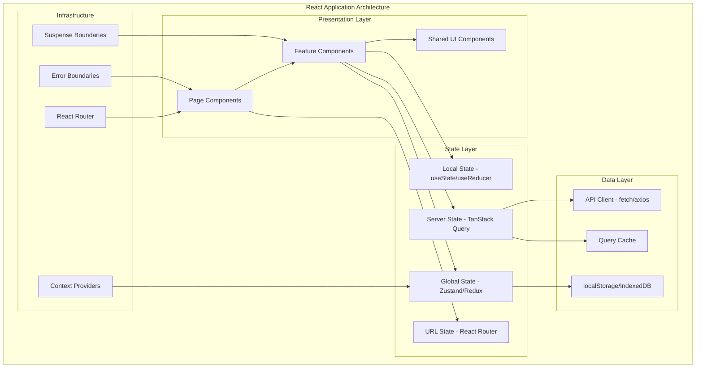

# React

## Quick Reference

- React is a declarative, component-based JavaScript library for building user interfaces, maintained by Meta
- Components are the fundamental building blocks: function components with hooks are the modern standard, class components are legacy
- Virtual DOM diffing algorithm (reconciliation) minimizes actual DOM mutations by comparing previous and next render trees
- One-way data flow: props flow down from parent to child, state is local, and events bubble up via callback props
- Hooks API (useState, useEffect, useContext, useReducer, useMemo, useCallback, useRef) enables stateful logic in function components
- JSX is syntactic sugar for `React.createElement()` calls, compiled by Babel or SWC at build time
- React 18 introduced concurrent rendering, automatic batching, Suspense for data fetching, and the `useTransition` hook
- Key prop is required for list rendering to help the reconciler identify which items changed, were added, or removed

## When to Use

React is the right choice when building interactive single-page applications, complex dashboards, or any UI that requires frequent state-driven re-renders with predictable data flow. Its component model excels at composing reusable UI elements across large codebases where multiple teams contribute independently. Choose React when you need a mature ecosystem with extensive third-party library support, when your team values flexibility in architectural decisions (React is unopinionated about routing, state management, and styling), or when you need server-side rendering capabilities through frameworks like Next.js. React is particularly strong for applications with complex form handling, real-time data updates, and rich interactive visualizations. It pairs well with TypeScript for type-safe component APIs and scales from small widgets embedded in existing pages to full enterprise applications. Prefer React over Angular when you want a lighter core library with freedom to choose your own tooling, and over Vue when you need the largest talent pool and ecosystem breadth for enterprise hiring.

## Hooks

Hooks are functions that let you use React state and lifecycle features in function components. They follow two rules: only call hooks at the top level (never inside loops, conditions, or nested functions) and only call hooks from React function components or custom hooks. Understanding hooks deeply is essential for writing performant, maintainable React applications.

**useState** manages local component state. It returns a tuple of the current value and a setter function. The setter can accept either a new value or an updater function that receives the previous state, which is critical when multiple updates depend on the current state within the same render cycle. State updates are batched in React 18, meaning multiple setState calls in the same event handler result in a single re-render.

**useEffect** synchronizes a component with external systems (APIs, subscriptions, DOM manipulation). It runs after the component renders and can optionally clean up before the next effect runs or when the component unmounts. The dependency array controls when the effect re-runs: an empty array means run once on mount, specific dependencies mean run when those values change, and no array means run after every render. Stale closures are the most common bug with useEffect, occurring when the dependency array is incomplete.

**useContext** consumes values from a React context without prop drilling. Combined with useReducer, it provides a lightweight state management solution for medium-complexity applications. However, any component consuming a context re-renders whenever the context value changes, so splitting contexts by update frequency is important for performance.

**useReducer** manages complex state logic with a reducer function, similar to Redux patterns. It is preferable to useState when state transitions depend on previous state, when state has multiple sub-values, or when the next state depends on the action type. The dispatch function is stable across renders, making it safe to pass to child components without causing unnecessary re-renders.

**useMemo and useCallback** are memoization hooks that cache computed values and function references between renders. useMemo recomputes only when dependencies change, useful for expensive calculations. useCallback returns a memoized function reference, preventing child components wrapped in React.memo from re-rendering when the parent renders. Overusing these hooks adds complexity without benefit; profile before optimizing.

**useRef** holds a mutable value that persists across renders without triggering re-renders when changed. Common uses include storing DOM element references, keeping track of previous values, storing interval or timeout IDs, and holding any mutable value that should not cause a re-render when updated.

```typescript
// Custom hook combining multiple hooks for data fetching with caching
import { useState, useEffect, useRef, useCallback } from 'react';

interface FetchState<T> {
  data: T | null;
  loading: boolean;
  error: Error | null;
}

function useFetch<T>(url: string, options?: RequestInit): FetchState<T> & { refetch: () => void } {
  const [state, setState] = useState<FetchState<T>>({
    data: null,
    loading: true,
    error: null,
  });
  const abortControllerRef = useRef<AbortController | null>(null);
  const cacheRef = useRef<Map<string, T>>(new Map());

  const fetchData = useCallback(async () => {
    // Check cache first
    if (cacheRef.current.has(url)) {
      setState({ data: cacheRef.current.get(url)!, loading: false, error: null });
      return;
    }

    // Abort previous request
    abortControllerRef.current?.abort();
    abortControllerRef.current = new AbortController();

    setState(prev => ({ ...prev, loading: true, error: null }));

    try {
      const response = await fetch(url, {
        ...options,
        signal: abortControllerRef.current.signal,
      });
      if (!response.ok) throw new Error(`HTTP ${response.status}`);
      const data: T = await response.json();
      cacheRef.current.set(url, data);
      setState({ data, loading: false, error: null });
    } catch (error) {
      if (error instanceof Error && error.name !== 'AbortError') {
        setState({ data: null, loading: false, error });
      }
    }
  }, [url, options]);

  useEffect(() => {
    fetchData();
    return () => abortControllerRef.current?.abort();
  }, [fetchData]);

  return { ...state, refetch: fetchData };
}
```

## State Management Patterns

State management in React ranges from local component state to global application state, with the right choice depending on the scope and complexity of the data being managed. The React ecosystem offers multiple patterns, each with distinct trade-offs around boilerplate, performance, developer experience, and debugging capabilities.

**Local state with useState/useReducer** is sufficient for most component-level concerns: form inputs, toggle states, UI visibility flags, and component-specific data. Lifting state up to the nearest common ancestor handles cases where siblings need to share state. This pattern requires no additional libraries and keeps state close to where it is used, making components easier to understand and test in isolation.

**Context API with useReducer** provides a built-in solution for medium-complexity global state. The pattern mirrors Redux with a reducer function, dispatch actions, and a provider component. It works well for authentication state, theme preferences, locale settings, and other infrequently-changing global values. The primary limitation is performance: every consumer re-renders when any part of the context value changes, requiring careful context splitting or memoization.

**External state libraries** (Redux Toolkit, Zustand, Jotai, Recoil) solve the performance and scalability limitations of Context. Redux Toolkit provides opinionated, batteries-included state management with middleware support, DevTools integration, and predictable state updates through immutable reducers. Zustand offers a minimal API with no boilerplate, using a hook-based store that only re-renders components when their selected state slice changes. Jotai and Recoil provide atomic state management where each piece of state is an independent atom, enabling fine-grained subscriptions and avoiding the single-store bottleneck.

**Server state management** (TanStack Query, SWR) treats server data as a separate concern from client state. These libraries handle caching, background refetching, stale-while-revalidate patterns, optimistic updates, and pagination automatically. They eliminate the need to store server responses in Redux or Context, reducing boilerplate and providing better UX through automatic cache invalidation and retry logic.

```typescript
// Zustand store with slices pattern for scalable state management
import { create } from 'zustand';
import { devtools, persist } from 'zustand/middleware';
import { immer } from 'zustand/middleware/immer';

interface AuthSlice {
  user: User | null;
  token: string | null;
  login: (credentials: Credentials) => Promise<void>;
  logout: () => void;
}

interface UISlice {
  sidebarOpen: boolean;
  theme: 'light' | 'dark';
  toggleSidebar: () => void;
  setTheme: (theme: 'light' | 'dark') => void;
}

type AppStore = AuthSlice & UISlice;

const useAppStore = create<AppStore>()(
  devtools(
    persist(
      immer((set) => ({
        // Auth slice
        user: null,
        token: null,
        login: async (credentials) => {
          const response = await authApi.login(credentials);
          set((state) => {
            state.user = response.user;
            state.token = response.token;
          });
        },
        logout: () => {
          set((state) => {
            state.user = null;
            state.token = null;
          });
        },
        // UI slice
        sidebarOpen: true,
        theme: 'dark',
        toggleSidebar: () => set((state) => { state.sidebarOpen = !state.sidebarOpen; }),
        setTheme: (theme) => set((state) => { state.theme = theme; }),
      })),
      { name: 'app-store', partialize: (state) => ({ theme: state.theme }) }
    )
  )
);

// Selector pattern for fine-grained subscriptions
const useUser = () => useAppStore((state) => state.user);
const useTheme = () => useAppStore((state) => state.theme);
```

## Performance Optimization

React performance optimization focuses on reducing unnecessary re-renders, minimizing the work done during renders, and efficiently managing large datasets. The React DevTools Profiler is the primary tool for identifying performance bottlenecks, showing which components re-rendered and why.

**React.memo** wraps a component to skip re-rendering when its props have not changed (shallow comparison by default). It is most effective for components that receive the same props frequently while their parent re-renders due to unrelated state changes. Avoid wrapping every component in memo; the comparison itself has a cost, and components that always receive new props (inline objects, new function references) gain nothing from memoization.

**Code splitting with React.lazy and Suspense** reduces initial bundle size by loading components on demand. Route-level splitting is the most impactful: each page loads its own chunk only when navigated to. Component-level splitting works for heavy libraries (chart libraries, rich text editors) that are not needed on initial render. Dynamic imports with webpack magic comments or Vite's built-in splitting provide fine-grained control over chunk boundaries.

**Virtualization** (react-window, react-virtuoso, TanStack Virtual) renders only the visible portion of large lists or tables, keeping DOM node count constant regardless of data size. A list of 10,000 items renders only the 20-30 visible rows plus a small overscan buffer, dramatically reducing memory usage and initial render time. Virtualization is essential for any list exceeding a few hundred items.

**State colocation** means keeping state as close as possible to where it is used. When state lives too high in the component tree, every update re-renders the entire subtree. Moving state down to the component that actually needs it, or extracting frequently-updating state into a separate component, prevents cascading re-renders. This is often more effective than memoization because it eliminates the problem rather than caching around it.

**Concurrent features** in React 18 (useTransition, useDeferredValue) allow marking state updates as non-urgent, letting React interrupt rendering to handle higher-priority updates like user input. useTransition wraps a state update to indicate it can be interrupted, while useDeferredValue defers re-rendering a value until the browser is idle. These features prevent UI jank during expensive renders without manual debouncing.

## Component Patterns

Component patterns establish conventions for structuring, composing, and reusing React components across a codebase. Well-chosen patterns reduce duplication, improve testability, and make component APIs intuitive for other developers.

**Compound components** expose a set of related components that work together implicitly through shared context. The parent component manages state and provides it via context, while child components consume that context to render their portion of the UI. This pattern gives consumers full control over rendering order and composition while keeping the internal logic encapsulated. Examples include Tab/TabPanel, Accordion/AccordionItem, and Select/Option patterns.

**Render props and children as functions** pass rendering control to the consumer by accepting a function that receives data and returns JSX. While hooks have largely replaced this pattern for logic reuse, render props remain useful for components that need to share layout or animation logic while letting consumers control what is rendered inside. Libraries like Downshift and React Spring still use this pattern effectively.

**Higher-order components (HOCs)** wrap a component to inject additional props or behavior. They are a legacy pattern largely replaced by hooks, but understanding them is important for working with older codebases and libraries like Redux's `connect()`. HOCs compose well but create wrapper hell in DevTools and can cause prop name collisions. Prefer hooks for new code.

**Custom hooks** extract reusable stateful logic into functions prefixed with `use`. They are the primary mechanism for logic reuse in modern React, replacing HOCs and render props for most use cases. Custom hooks can compose other hooks, manage subscriptions, encapsulate API calls, and share complex state logic across components without affecting the component tree structure.

**Container/Presentational split** separates data-fetching and state management (container) from pure rendering (presentational). While less emphasized since hooks, the principle remains valuable: presentational components are easier to test, reuse, and reason about because they are pure functions of their props. Containers handle the messy integration with APIs, stores, and side effects.

```typescript
// Compound component pattern with context
import { createContext, useContext, useState, ReactNode } from 'react';

interface AccordionContextType {
  openItems: Set<string>;
  toggle: (id: string) => void;
}

const AccordionContext = createContext<AccordionContextType | null>(null);

function Accordion({ children, allowMultiple = false }: { children: ReactNode; allowMultiple?: boolean }) {
  const [openItems, setOpenItems] = useState<Set<string>>(new Set());

  const toggle = (id: string) => {
    setOpenItems(prev => {
      const next = new Set(allowMultiple ? prev : []);
      if (prev.has(id)) next.delete(id);
      else next.add(id);
      return next;
    });
  };

  return (
    <AccordionContext.Provider value={{ openItems, toggle }}>
      <div role="region" aria-label="Accordion">{children}</div>
    </AccordionContext.Provider>
  );
}

function AccordionItem({ id, title, children }: { id: string; title: string; children: ReactNode }) {
  const context = useContext(AccordionContext);
  if (!context) throw new Error('AccordionItem must be used within Accordion');
  const isOpen = context.openItems.has(id);

  return (
    <div>
      <button
        aria-expanded={isOpen}
        aria-controls={`panel-${id}`}
        onClick={() => context.toggle(id)}
      >
        {title}
      </button>
      {isOpen && (
        <div id={`panel-${id}`} role="region" aria-labelledby={`header-${id}`}>
          {children}
        </div>
      )}
    </div>
  );
}

Accordion.Item = AccordionItem;
export { Accordion };
```

## Testing Strategies

Testing React applications involves multiple layers: unit tests for individual components and hooks, integration tests for component interactions, and end-to-end tests for critical user flows. The testing trophy model emphasizes integration tests as the highest-value layer, testing components as users interact with them rather than testing implementation details.

**React Testing Library** is the standard for component testing. Its philosophy is to test components the way users interact with them: querying by accessible roles, labels, and text rather than by component internals, class names, or test IDs. This approach produces tests that are resilient to refactoring because they only break when user-visible behavior changes, not when implementation details are restructured.

**Testing hooks** uses `renderHook` from React Testing Library to test custom hooks in isolation. This is useful for hooks with complex logic (data fetching, state machines, debouncing) that would be cumbersome to test through a component. The hook runs inside a test component, and you can trigger updates via `act()` and assert on the returned values.

**Mocking strategies** should be minimal and targeted. Mock network requests with MSW (Mock Service Worker) rather than mocking fetch or axios directly, because MSW intercepts at the network level and works identically in tests and development. Mock timers with `jest.useFakeTimers()` or `vi.useFakeTimers()` for testing debounce, throttle, and animation logic. Avoid mocking React components or hooks unless absolutely necessary, as it couples tests to implementation.

**Snapshot testing** captures the rendered output of a component and compares it against a stored reference. While useful for detecting unintended changes in large component trees, snapshots are brittle and often updated without review. Use them sparingly for stable, presentational components and prefer explicit assertions for dynamic behavior.

**End-to-end testing** with Playwright or Cypress validates complete user flows across the full application stack. E2E tests are the most expensive to write and maintain but provide the highest confidence that the application works correctly from the user's perspective. Focus E2E tests on critical paths: authentication, checkout, data submission, and navigation flows.

```typescript
// Integration test with React Testing Library and MSW
import { render, screen, waitFor } from '@testing-library/react';
import userEvent from '@testing-library/user-event';
import { http, HttpResponse } from 'msw';
import { setupServer } from 'msw/node';
import { UserProfile } from './UserProfile';

const server = setupServer(
  http.get('/api/user/:id', ({ params }) => {
    return HttpResponse.json({
      id: params.id,
      name: 'Jane Doe',
      email: 'jane@example.com',
      role: 'admin',
    });
  }),
  http.put('/api/user/:id', async ({ request }) => {
    const body = await request.json();
    return HttpResponse.json({ ...body, updatedAt: new Date().toISOString() });
  })
);

beforeAll(() => server.listen());
afterEach(() => server.resetHandlers());
afterAll(() => server.close());

describe('UserProfile', () => {
  it('loads and displays user data', async () => {
    render(<UserProfile userId="123" />);

    expect(screen.getByRole('progressbar')).toBeInTheDocument();

    await waitFor(() => {
      expect(screen.getByRole('heading', { name: /jane doe/i })).toBeInTheDocument();
    });
    expect(screen.getByText('jane@example.com')).toBeInTheDocument();
    expect(screen.getByText('admin')).toBeInTheDocument();
  });

  it('allows editing and saving user name', async () => {
    const user = userEvent.setup();
    render(<UserProfile userId="123" />);

    await waitFor(() => {
      expect(screen.getByRole('heading', { name: /jane doe/i })).toBeInTheDocument();
    });

    await user.click(screen.getByRole('button', { name: /edit/i }));
    const nameInput = screen.getByLabelText(/name/i);
    await user.clear(nameInput);
    await user.type(nameInput, 'Jane Smith');
    await user.click(screen.getByRole('button', { name: /save/i }));

    await waitFor(() => {
      expect(screen.getByRole('heading', { name: /jane smith/i })).toBeInTheDocument();
    });
  });

  it('displays error state when API fails', async () => {
    server.use(
      http.get('/api/user/:id', () => HttpResponse.error())
    );
    render(<UserProfile userId="123" />);

    await waitFor(() => {
      expect(screen.getByRole('alert')).toHaveTextContent(/failed to load/i);
    });
  });
});
```

## Architecture and Diagrams

```mermaid
sequenceDiagram
    participant User
    participant Component
    participant Hook as Custom Hook
    participant Store as State Store
    participant API as API Layer
    participant Server

    User->>Component: Interaction (click, type)
    Component->>Hook: Call action
    Hook->>Store: Dispatch update
    Store->>Component: Re-render with new state
    
    alt Async Operation
        Hook->>API: Request data
        API->>Server: HTTP Request
        Server-->>API: Response
        API-->>Hook: Parsed data
        Hook->>Store: Update with server data
        Store->>Component: Re-render with data
        Component->>User: Updated UI
    else Optimistic Update
        Hook->>Store: Optimistic state update
        Store->>Component: Immediate re-render
        Hook->>API: Request in background
        API->>Server: HTTP Request
        Server-->>API: Response
        alt Success
            API-->>Hook: Confirm
        else Failure
            API-->>Hook: Error
            Hook->>Store: Rollback state
            Store->>Component: Re-render with rollback
        end
    end
```





## Common Pitfalls

1. **Stale closures in useEffect**: When the dependency array is incomplete, the effect captures stale values from a previous render. The ESLint `exhaustive-deps` rule catches most cases, but developers often suppress it instead of restructuring the effect. Always include all referenced variables in the dependency array or use useRef for values that should not trigger re-runs.

2. **Creating objects and functions inline in JSX**: Passing `style={{ color: 'red' }}` or `onClick={() => handleClick(id)}` creates new references every render, defeating React.memo on child components. Extract stable references with useMemo/useCallback or move constant objects outside the component. Only optimize this when profiling shows it matters.

3. **Overusing useEffect for derived state**: Computing values that can be calculated directly from props or state during render does not need useEffect. Using useEffect to sync derived state causes an extra render cycle and introduces bugs. Calculate derived values inline or with useMemo instead.

4. **Missing keys or using index as key**: Without stable keys, React cannot efficiently reconcile list items, leading to incorrect state preservation when items are reordered, inserted, or deleted. Using array index as key has the same problem when the list order changes. Always use a unique, stable identifier from the data.

5. **Prop drilling through many layers**: Passing props through 5+ intermediate components that do not use them creates coupling and maintenance burden. Use Context for truly global values, component composition (passing children), or state management libraries for shared state that multiple distant components need.

6. **Not handling race conditions in async effects**: When a component fetches data based on a prop that changes rapidly (search input, route params), earlier requests may resolve after later ones, displaying stale data. Use AbortController to cancel previous requests or check a cleanup flag before setting state.

## Real-World Use Cases

- **Enterprise dashboards**: React powers complex analytics dashboards at companies like Meta, Netflix, and Airbnb, where dozens of interactive widgets, real-time data streams, and complex filtering logic require efficient re-rendering and state management across hundreds of components.

- **E-commerce platforms**: Shopify, Walmart, and many retailers use React (often via Next.js) for product catalogs, shopping carts, and checkout flows where server-side rendering provides SEO benefits and fast initial loads, while client-side interactivity handles cart management and dynamic filtering.

- **Design tools and editors**: Figma's interface, Notion's block editor, and many collaborative tools use React for their complex, highly interactive UIs where component composition, virtualization, and optimistic updates are essential for responsive user experiences.

- **Mobile applications**: React Native extends React's component model to iOS and Android, allowing teams to share business logic and state management patterns between web and mobile platforms while rendering native UI components.

## Interview Questions

**Q: Explain the React reconciliation algorithm and how keys help.**
A: React compares the previous and next virtual DOM trees element by element. When elements have the same type, React updates props and recurses into children. Keys help React identify which children in a list have changed, been added, or removed, allowing it to reuse existing DOM nodes and maintain component state correctly during reordering.

**Q: What is the difference between useEffect and useLayoutEffect?**
A: useEffect runs asynchronously after the browser paints, making it suitable for most side effects (data fetching, subscriptions). useLayoutEffect runs synchronously after DOM mutations but before the browser paints, making it necessary for DOM measurements and synchronous visual updates that must happen before the user sees the rendered output.

**Q: How does React.memo differ from useMemo?**
A: React.memo is a higher-order component that memoizes an entire component, skipping re-render when props are shallowly equal. useMemo is a hook that memoizes a computed value within a component, recomputing only when dependencies change. React.memo prevents re-rendering; useMemo prevents re-computing expensive values during a render that will happen anyway.

**Q: Explain the concept of lifting state up and when to use it.**
A: Lifting state up means moving shared state to the closest common ancestor of the components that need it. Use it when sibling components need to reflect the same changing data. The parent owns the state and passes it down as props, with callback props for children to request changes. This maintains single source of truth without external state management.

**Q: What are React Server Components and how do they differ from SSR?**
A: Server Components render exclusively on the server and send serialized UI (not HTML) to the client, with zero JavaScript bundle cost. They can directly access databases and file systems. SSR renders the full component tree to HTML on the server for fast initial paint, then hydrates on the client with the full JavaScript bundle. Server Components complement SSR by reducing client bundle size for non-interactive parts of the UI.

## Production Tips

- **Error boundaries are non-negotiable**: Wrap major UI sections (sidebar, main content, widgets) in error boundaries to prevent a single component crash from taking down the entire application. Log errors to your monitoring service (Sentry, DataDog) from the error boundary's componentDidCatch method and display a user-friendly fallback UI.

- **Bundle analysis and splitting**: Run `npx vite-bundle-visualizer` or `webpack-bundle-analyzer` regularly to identify unexpectedly large dependencies. Lazy-load routes and heavy components (chart libraries, rich text editors, PDF viewers) to keep the initial bundle under 200KB gzipped. Tree-shaking only works with ES module imports, so avoid importing entire utility libraries.

- **Strict Mode in development**: Always wrap your app in `<React.StrictMode>` during development. It double-invokes render functions, effects, and reducers to surface impure logic and missing cleanup functions. It also warns about deprecated APIs. The double-invocation does not happen in production builds.

- **Monitoring render performance**: Use React DevTools Profiler to identify components that re-render too frequently or take too long. Set up performance budgets: no component should take more than 16ms to render (one frame at 60fps). Track Web Vitals (LCP, FID, CLS) in production using the `web-vitals` library and report to your analytics pipeline.

- **Hydration mismatch prevention**: When using SSR, ensure server and client render identical initial output. Common causes of mismatches include using `Date.now()`, `Math.random()`, or browser-only APIs during render. Use `useEffect` for client-only logic and `suppressHydrationWarning` only as a last resort for intentional differences like timestamps.

## Related Topics

- [TypeScript](./typescript.md) - TypeScript provides type safety for React component props, state, and hooks, catching errors at compile time
- [Next.js](./nextjs.md) - Next.js builds on React with server-side rendering, static generation, and full-stack capabilities
- [JavaScript](./javascript.md) - Understanding JavaScript fundamentals (closures, event loop, prototypes) is essential for effective React development
