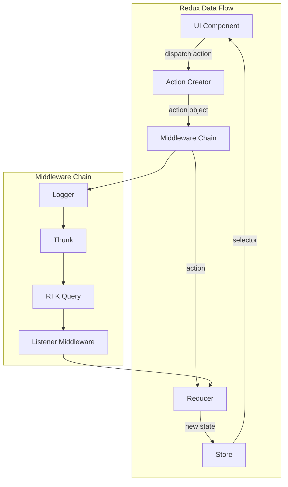
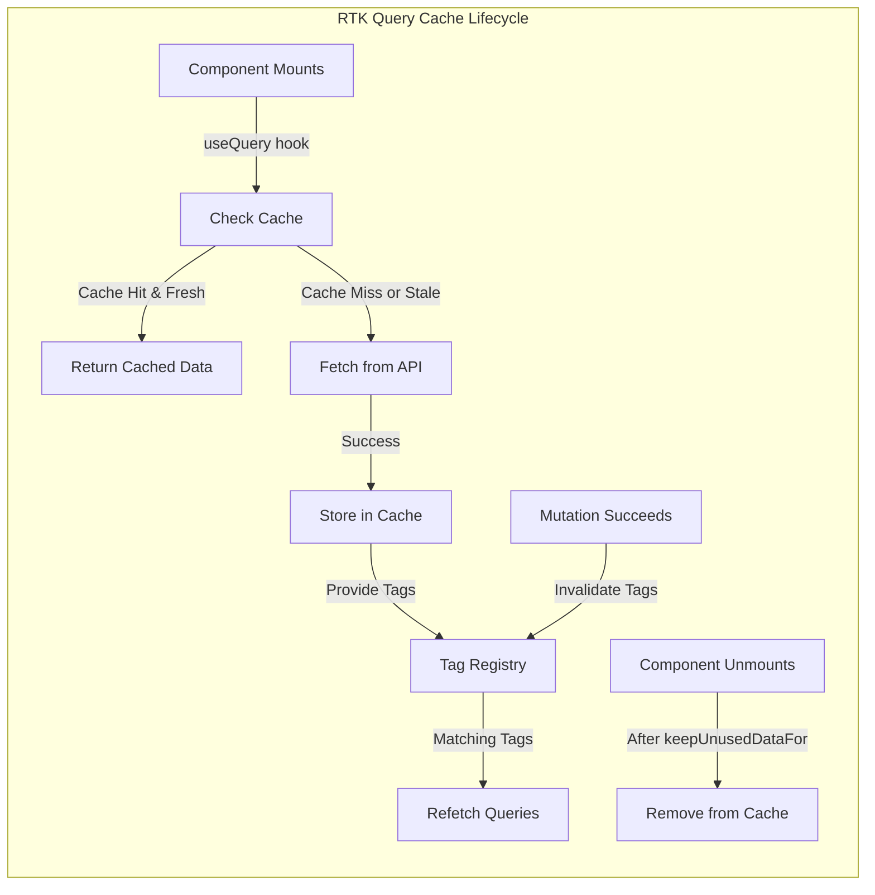
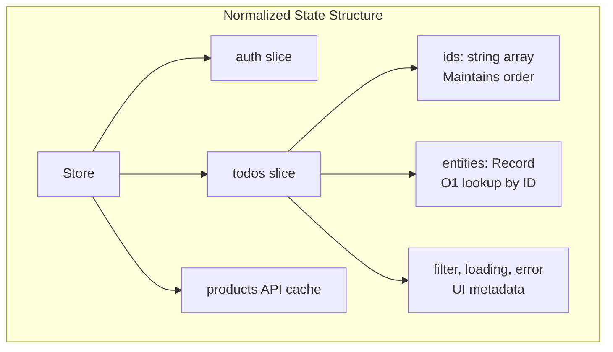

# Redux Patterns & Redux Toolkit

## Quick Reference

- Redux follows three core principles: single source of truth (one store object), state is read-only (only actions can trigger changes), and reducers are pure functions (given same state + action, always produce same result)
- Redux Toolkit (RTK) is the official, opinionated toolset — `createSlice` combines reducers + actions, `configureStore` sets up middleware and DevTools, and Immer enables "mutating" syntax that produces immutable updates
- `createAsyncThunk` handles async lifecycle automatically: dispatches `pending`, `fulfilled`, or `rejected` actions based on the Promise result, with built-in cancellation support
- RTK Query generates React hooks for data fetching with automatic caching, deduplication, polling, optimistic updates, and cache invalidation via tags
- Normalized state (via `createEntityAdapter`) stores entities in `{ ids: [], entities: {} }` format, enabling O(1) lookups and preventing data duplication across slices
- Selectors (Reselect's `createSelector`) compute derived state with memoization — they only recompute when their input selectors return new references
- Middleware intercepts dispatched actions before they reach reducers — use for logging, crash reporting, async operations, analytics, and WebSocket management
- Redux DevTools provide time-travel debugging, action replay, state diff inspection, and the ability to export/import state snapshots for bug reproduction
- The Redux store is framework-agnostic — the same store logic works with React, Angular, Vue, or vanilla JavaScript
- `createListenerMiddleware` (RTK 1.8+) replaces redux-saga for most use cases with a simpler, TypeScript-friendly API for reactive side effects

## When to Use

Redux and Redux Toolkit are the right choice for specific application profiles. Choose Redux when:

- Building large applications (50+ components, 10+ routes) with complex state interactions where multiple unrelated components need synchronized access to the same data and predictable update patterns prevent subtle bugs
- Working on teams of 5+ developers where enforced unidirectional data flow, explicit action types, and standardized patterns make code reviews predictable and onboarding faster regardless of who wrote the feature
- Implementing complex async workflows — multi-step forms with draft saving, optimistic updates with server reconciliation, real-time synchronization with conflict resolution, or offline-first with queue replay
- Requiring time-travel debugging for complex state transitions — reproducing bugs by replaying action sequences, inspecting state at any point in time, or exporting state snapshots from production for local debugging
- Building applications where state must survive page refreshes, be shared across browser tabs, or be serialized for server-side rendering hydration
- Needing sophisticated caching with automatic invalidation — RTK Query handles cache lifetimes, background refetching, polling, and optimistic updates with minimal boilerplate

## Code Examples

### createSlice with Immer — Modern Redux Pattern

```typescript
import { createSlice, PayloadAction, createEntityAdapter, EntityState } from '@reduxjs/toolkit';

// Entity adapter for normalized state
interface Todo {
  id: string;
  title: string;
  completed: boolean;
  priority: 'low' | 'medium' | 'high';
  createdAt: string;
  assigneeId: string | null;
}

const todosAdapter = createEntityAdapter<Todo>({
  selectId: (todo) => todo.id,
  sortComparer: (a, b) => {
    const priorityOrder = { high: 0, medium: 1, low: 2 };
    return priorityOrder[a.priority] - priorityOrder[b.priority];
  }
});

interface TodosState extends EntityState<Todo> {
  filter: 'all' | 'active' | 'completed';
  searchQuery: string;
  loading: boolean;
  error: string | null;
  lastFetched: string | null;
}

const initialState: TodosState = todosAdapter.getInitialState({
  filter: 'all',
  searchQuery: '',
  loading: false,
  error: null,
  lastFetched: null
});

const todosSlice = createSlice({
  name: 'todos',
  initialState,
  reducers: {
    // Immer allows "mutating" syntax — produces immutable updates under the hood
    todoAdded: {
      reducer(state, action: PayloadAction<Todo>) {
        todosAdapter.addOne(state, action.payload);
      },
      // Prepare callback centralizes ID generation and timestamps
      prepare(title: string, priority: Todo['priority'] = 'medium') {
        return {
          payload: {
            id: crypto.randomUUID(),
            title,
            priority,
            completed: false,
            createdAt: new Date().toISOString(),
            assigneeId: null
          }
        };
      }
    },
    todoToggled(state, action: PayloadAction<string>) {
      const todo = state.entities[action.payload];
      if (todo) {
        todo.completed = !todo.completed;
      }
    },
    todoPriorityChanged(state, action: PayloadAction<{ id: string; priority: Todo['priority'] }>) {
      todosAdapter.updateOne(state, {
        id: action.payload.id,
        changes: { priority: action.payload.priority }
      });
    },
    todosBatchCompleted(state, action: PayloadAction<string[]>) {
      const updates = action.payload.map(id => ({
        id,
        changes: { completed: true }
      }));
      todosAdapter.updateMany(state, updates);
    },
    todoRemoved: todosAdapter.removeOne,
    todosCleared: todosAdapter.removeAll,
    filterChanged(state, action: PayloadAction<TodosState['filter']>) {
      state.filter = action.payload;
    },
    searchQueryChanged(state, action: PayloadAction<string>) {
      state.searchQuery = action.payload;
    }
  },
  extraReducers: (builder) => {
    builder
      .addCase(fetchTodos.pending, (state) => {
        state.loading = true;
        state.error = null;
      })
      .addCase(fetchTodos.fulfilled, (state, action) => {
        state.loading = false;
        state.lastFetched = new Date().toISOString();
        todosAdapter.setAll(state, action.payload);
      })
      .addCase(fetchTodos.rejected, (state, action) => {
        state.loading = false;
        state.error = action.error.message ?? 'Failed to fetch todos';
      });
  }
});

export const {
  todoAdded, todoToggled, todoPriorityChanged,
  todosBatchCompleted, todoRemoved, todosCleared,
  filterChanged, searchQueryChanged
} = todosSlice.actions;

export default todosSlice.reducer;
```

### createAsyncThunk with Error Handling and Cancellation

```typescript
import { createAsyncThunk, SerializedError } from '@reduxjs/toolkit';
import type { RootState, AppDispatch } from '../store';

interface FetchTodosParams {
  userId?: string;
  status?: 'active' | 'completed';
  page?: number;
}

interface FetchTodosResponse {
  todos: Todo[];
  totalCount: number;
  hasMore: boolean;
}

// Typed createAsyncThunk with condition and cancellation
export const fetchTodos = createAsyncThunk<
  FetchTodosResponse,           // Return type
  FetchTodosParams | void,      // Argument type
  {
    state: RootState;
    dispatch: AppDispatch;
    rejectValue: { message: string; statusCode: number };
  }
>(
  'todos/fetchTodos',
  async (params, { getState, rejectWithValue, signal }) => {
    try {
      const queryParams = new URLSearchParams();
      if (params?.userId) queryParams.set('userId', params.userId);
      if (params?.status) queryParams.set('status', params.status);
      if (params?.page) queryParams.set('page', String(params.page));

      const response = await fetch(`/api/todos?${queryParams}`, {
        signal, // AbortController signal for cancellation
        headers: {
          'Authorization': `Bearer ${getState().auth.token}`,
          'Content-Type': 'application/json'
        }
      });

      if (!response.ok) {
        const errorBody = await response.json().catch(() => ({}));
        return rejectWithValue({
          message: errorBody.message || `HTTP ${response.status}`,
          statusCode: response.status
        });
      }

      return await response.json();
    } catch (error) {
      if (error instanceof DOMException && error.name === 'AbortError') {
        // Request was cancelled — don't treat as error
        return rejectWithValue({ message: 'Request cancelled', statusCode: 0 });
      }
      return rejectWithValue({
        message: error instanceof Error ? error.message : 'Unknown error',
        statusCode: 0
      });
    }
  },
  {
    // Condition: prevent duplicate fetches
    condition: (_, { getState }) => {
      const { todos } = getState();
      if (todos.loading) return false; // Already fetching
      // Don't refetch if data is fresh (< 30 seconds old)
      if (todos.lastFetched) {
        const elapsed = Date.now() - new Date(todos.lastFetched).getTime();
        if (elapsed < 30000) return false;
      }
      return true;
    }
  }
);

// Thunk for optimistic update with rollback
export const toggleTodoOnServer = createAsyncThunk<
  Todo,
  string,
  { state: RootState; rejectValue: string }
>(
  'todos/toggleOnServer',
  async (todoId, { getState, dispatch, rejectWithValue }) => {
    const todo = getState().todos.entities[todoId];
    if (!todo) return rejectWithValue('Todo not found');

    // Optimistic update
    dispatch(todoToggled(todoId));

    try {
      const response = await fetch(`/api/todos/${todoId}`, {
        method: 'PATCH',
        headers: { 'Content-Type': 'application/json' },
        body: JSON.stringify({ completed: !todo.completed })
      });

      if (!response.ok) throw new Error(`HTTP ${response.status}`);
      return await response.json();
    } catch (error) {
      // Rollback optimistic update
      dispatch(todoToggled(todoId));
      return rejectWithValue(
        error instanceof Error ? error.message : 'Toggle failed'
      );
    }
  }
);
```

### Memoized Selectors with Reselect

```typescript
import { createSelector } from '@reduxjs/toolkit';
import type { RootState } from '../store';

// Base selectors — simple state access
const selectTodosState = (state: RootState) => state.todos;
const selectFilter = (state: RootState) => state.todos.filter;
const selectSearchQuery = (state: RootState) => state.todos.searchQuery;

// Entity adapter selectors
const todosSelectors = todosAdapter.getSelectors(selectTodosState);
export const selectAllTodos = todosSelectors.selectAll;
export const selectTodoById = todosSelectors.selectById;
export const selectTodoIds = todosSelectors.selectIds;
export const selectTotalTodos = todosSelectors.selectTotal;

// Derived selectors — memoized, only recompute when inputs change
export const selectFilteredTodos = createSelector(
  [selectAllTodos, selectFilter, selectSearchQuery],
  (todos, filter, searchQuery) => {
    let filtered = todos;

    // Apply status filter
    if (filter === 'active') {
      filtered = filtered.filter(t => !t.completed);
    } else if (filter === 'completed') {
      filtered = filtered.filter(t => t.completed);
    }

    // Apply search
    if (searchQuery.trim()) {
      const query = searchQuery.toLowerCase();
      filtered = filtered.filter(t =>
        t.title.toLowerCase().includes(query)
      );
    }

    return filtered;
  }
);

export const selectTodoStats = createSelector(
  [selectAllTodos],
  (todos) => ({
    total: todos.length,
    completed: todos.filter(t => t.completed).length,
    active: todos.filter(t => !t.completed).length,
    highPriority: todos.filter(t => t.priority === 'high' && !t.completed).length,
    completionRate: todos.length > 0
      ? Math.round((todos.filter(t => t.completed).length / todos.length) * 100)
      : 0
  })
);

// Parameterized selector factory — creates a new memoized selector per parameter
export const makeSelectTodosByAssignee = (assigneeId: string) =>
  createSelector(
    [selectAllTodos],
    (todos) => todos.filter(t => t.assigneeId === assigneeId)
  );

// Selector composition — building complex selectors from simpler ones
export const selectOverdueTodos = createSelector(
  [selectAllTodos],
  (todos) => todos.filter(t =>
    !t.completed &&
    t.priority === 'high' &&
    Date.now() - new Date(t.createdAt).getTime() > 7 * 24 * 60 * 60 * 1000
  )
);
```

### RTK Query — API Definition with Cache Management

```typescript
import { createApi, fetchBaseQuery, retry } from '@reduxjs/toolkit/query/react';

interface Product {
  id: string;
  name: string;
  price: number;
  category: string;
  inStock: boolean;
  imageUrl: string;
}

interface PaginatedResponse<T> {
  data: T[];
  total: number;
  page: number;
  pageSize: number;
  hasMore: boolean;
}

// RTK Query API definition
export const productsApi = createApi({
  reducerPath: 'productsApi',
  baseQuery: retry(
    fetchBaseQuery({
      baseUrl: '/api',
      prepareHeaders: (headers, { getState }) => {
        const token = (getState() as RootState).auth.token;
        if (token) headers.set('Authorization', `Bearer ${token}`);
        return headers;
      }
    }),
    { maxRetries: 3 }
  ),
  tagTypes: ['Product', 'Category'],
  endpoints: (builder) => ({
    // Query — GET request with caching
    getProducts: builder.query<PaginatedResponse<Product>, { page?: number; category?: string }>({
      query: ({ page = 1, category }) => ({
        url: 'products',
        params: { page, pageSize: 20, ...(category && { category }) }
      }),
      providesTags: (result) =>
        result
          ? [
              ...result.data.map(({ id }) => ({ type: 'Product' as const, id })),
              { type: 'Product', id: 'PARTIAL-LIST' }
            ]
          : [{ type: 'Product', id: 'PARTIAL-LIST' }],
      // Keep data in cache for 5 minutes
      keepUnusedDataFor: 300
    }),

    getProduct: builder.query<Product, string>({
      query: (id) => `products/${id}`,
      providesTags: (result, error, id) => [{ type: 'Product', id }]
    }),

    // Mutation — POST/PUT/DELETE with cache invalidation
    createProduct: builder.mutation<Product, Omit<Product, 'id'>>({
      query: (newProduct) => ({
        url: 'products',
        method: 'POST',
        body: newProduct
      }),
      // Invalidate the list so it refetches
      invalidatesTags: [{ type: 'Product', id: 'PARTIAL-LIST' }]
    }),

    updateProduct: builder.mutation<Product, { id: string; updates: Partial<Product> }>({
      query: ({ id, updates }) => ({
        url: `products/${id}`,
        method: 'PATCH',
        body: updates
      }),
      // Optimistic update — update cache before server responds
      async onQueryStarted({ id, updates }, { dispatch, queryFulfilled }) {
        const patchResult = dispatch(
          productsApi.util.updateQueryData('getProduct', id, (draft) => {
            Object.assign(draft, updates);
          })
        );
        try {
          await queryFulfilled;
        } catch {
          patchResult.undo(); // Rollback on failure
        }
      },
      invalidatesTags: (result, error, { id }) => [
        { type: 'Product', id },
        { type: 'Product', id: 'PARTIAL-LIST' }
      ]
    }),

    deleteProduct: builder.mutation<void, string>({
      query: (id) => ({
        url: `products/${id}`,
        method: 'DELETE'
      }),
      invalidatesTags: (result, error, id) => [
        { type: 'Product', id },
        { type: 'Product', id: 'PARTIAL-LIST' }
      ]
    })
  })
});

// Auto-generated hooks
export const {
  useGetProductsQuery,
  useGetProductQuery,
  useCreateProductMutation,
  useUpdateProductMutation,
  useDeleteProductMutation
} = productsApi;
```

### Middleware — Custom Logging and WebSocket

```typescript
import { Middleware, isRejectedWithValue, createListenerMiddleware } from '@reduxjs/toolkit';
import type { RootState, AppDispatch } from './store';

// Logging middleware
export const loggingMiddleware: Middleware = (storeAPI) => (next) => (action) => {
  if (process.env.NODE_ENV === 'development') {
    console.group(`Action: ${action.type}`);
    console.log('Payload:', action.payload);
    console.log('State before:', storeAPI.getState());
  }

  const result = next(action);

  if (process.env.NODE_ENV === 'development') {
    console.log('State after:', storeAPI.getState());
    console.groupEnd();
  }

  return result;
};

// Error reporting middleware
export const errorReportingMiddleware: Middleware = () => (next) => (action) => {
  if (isRejectedWithValue(action)) {
    // Report to error monitoring service
    console.error('Async thunk rejected:', {
      type: action.type,
      payload: action.payload,
      error: action.error
    });
    // Sentry.captureException(new Error(`Redux rejection: ${action.type}`));
  }
  return next(action);
};

// Listener middleware — reactive side effects (replaces redux-saga for most cases)
export const listenerMiddleware = createListenerMiddleware();

// React to auth state changes
listenerMiddleware.startListening({
  predicate: (action, currentState, previousState) => {
    const curr = (currentState as RootState).auth.token;
    const prev = (previousState as RootState).auth.token;
    return curr !== prev;
  },
  effect: async (action, listenerApi) => {
    const state = listenerApi.getState() as RootState;
    if (state.auth.token) {
      // User logged in — fetch initial data
      listenerApi.dispatch(fetchTodos());
      listenerApi.dispatch(fetchUserProfile());
    } else {
      // User logged out — clear sensitive data
      listenerApi.dispatch(todosCleared());
      listenerApi.dispatch(productsApi.util.resetApiState());
    }
  }
});

// Debounced search — cancel previous if new search arrives within 300ms
listenerMiddleware.startListening({
  actionCreator: searchQueryChanged,
  effect: async (action, listenerApi) => {
    // Cancel any in-progress instances of this listener
    listenerApi.cancelActiveListeners();

    // Debounce 300ms
    await listenerApi.delay(300);

    const query = action.payload;
    if (query.length >= 2) {
      listenerApi.dispatch(searchProducts(query));
    }
  }
});

// WebSocket connection management
listenerMiddleware.startListening({
  actionCreator: wsConnect,
  effect: async (action, listenerApi) => {
    const ws = new WebSocket(action.payload.url);

    ws.onmessage = (event) => {
      const message = JSON.parse(event.data);
      listenerApi.dispatch(wsMessageReceived(message));
    };

    ws.onerror = () => {
      listenerApi.dispatch(wsError('Connection error'));
    };

    // Clean up when disconnect action is dispatched
    await listenerApi.condition(wsDisconnect.match);
    ws.close();
  }
});
```


### Store Configuration and Code Splitting

```typescript
import { configureStore, combineReducers } from '@reduxjs/toolkit';
import { setupListeners } from '@reduxjs/toolkit/query';

// Root reducer with code-split reducers injected lazily
const staticReducers = {
  auth: authReducer,
  ui: uiReducer,
  [productsApi.reducerPath]: productsApi.reducer
};

function createReducerManager(initialReducers: Record<string, any>) {
  const reducers = { ...initialReducers };
  let combinedReducer = combineReducers(reducers);
  let keysToRemove: string[] = [];

  return {
    getReducerMap: () => reducers,
    reduce: (state: any, action: any) => {
      if (keysToRemove.length > 0) {
        state = { ...state };
        keysToRemove.forEach(key => delete state[key]);
        keysToRemove = [];
      }
      return combinedReducer(state, action);
    },
    // Inject reducer for lazy-loaded features
    add: (key: string, reducer: any) => {
      if (!key || reducers[key]) return;
      reducers[key] = reducer;
      combinedReducer = combineReducers(reducers);
    },
    remove: (key: string) => {
      if (!key || !reducers[key]) return;
      delete reducers[key];
      keysToRemove.push(key);
      combinedReducer = combineReducers(reducers);
    }
  };
}

const reducerManager = createReducerManager(staticReducers);

export const store = configureStore({
  reducer: reducerManager.reduce,
  middleware: (getDefaultMiddleware) =>
    getDefaultMiddleware({
      serializableCheck: {
        // Ignore non-serializable values in specific paths
        ignoredActions: ['persist/PERSIST', 'persist/REHYDRATE'],
        ignoredPaths: ['ui.modalRef']
      },
      immutableCheck: { warnAfter: 128 }
    })
      .prepend(listenerMiddleware.middleware)
      .concat(productsApi.middleware)
      .concat(loggingMiddleware)
      .concat(errorReportingMiddleware),
  devTools: process.env.NODE_ENV !== 'production'
});

// Enable refetchOnFocus/refetchOnReconnect for RTK Query
setupListeners(store.dispatch);

// Inject reducer for lazy-loaded route
export function injectReducer(key: string, reducer: any) {
  reducerManager.add(key, reducer);
  store.replaceReducer(reducerManager.reduce);
}

export type RootState = ReturnType<typeof store.getState>;
export type AppDispatch = typeof store.dispatch;
```

## Architecture / Diagrams







## Common Pitfalls

**Storing derived state in Redux instead of computing it with selectors.** Developers often store `filteredTodos`, `totalPrice`, or `isCartEmpty` in the store alongside the source data. This creates synchronization bugs — when the source data changes, you must remember to update all derived values. Instead, use `createSelector` to compute derived state on-the-fly with memoization. Selectors only recompute when their inputs change, so performance is equivalent to storing the derived value, without the synchronization risk.

**Mutating state directly in reducers without Immer.** Even with Redux Toolkit's Immer integration, developers sometimes accidentally mutate state outside of `createSlice` reducers (in thunks, components, or utility functions). Immer only wraps the reducer function — mutations elsewhere cause bugs that are extremely difficult to track because Redux DevTools shows the state as already changed. Always treat state as immutable outside reducers. Use the `immutableCheck` middleware in development to catch accidental mutations.

**Over-normalizing state or normalizing too early.** Not every piece of state needs `createEntityAdapter`. Simple lists that are always fetched and displayed together (dropdown options, navigation items, static configuration) are simpler as plain arrays. Normalize when: entities are referenced from multiple places, you need O(1) lookups by ID, or you're implementing optimistic updates that target specific items. Premature normalization adds complexity without benefit for read-heavy, write-rare data.

**Putting everything in global Redux state.** Form input values, modal open/close state, animation progress, scroll position, and hover states belong in local component state or URL parameters — not Redux. The rule of thumb: put state in Redux only if multiple unrelated components need it, it must survive navigation, or you need time-travel debugging for it. Overusing global state causes unnecessary re-renders, makes components harder to test, and bloats the store with transient UI state.

**Not using RTK Query's cache invalidation correctly.** Developers manually refetch data after mutations instead of using the tag-based invalidation system. This leads to stale data when they forget to refetch, or unnecessary refetches when they're too aggressive. Define `providesTags` on queries and `invalidatesTags` on mutations. Use specific tag IDs (`{ type: 'Post', id: postId }`) for targeted invalidation rather than invalidating entire collections. The `PARTIAL-LIST` pattern invalidates list queries without refetching individual item queries.

**Creating too many small slices or too few large slices.** One slice per entity (users, posts, comments, likes, shares) creates import complexity and makes it hard to handle cross-cutting actions. One massive slice for the entire app defeats the purpose of modularity. Group by feature domain: a "social feed" slice manages posts, comments, and likes together because they change together. A "user profile" slice manages user data, preferences, and settings. Slices should map to feature boundaries, not database tables.

## Real-World Use Cases

**E-Commerce Platform with Complex Cart and Checkout.** A large e-commerce application uses Redux for cart state (items, quantities, applied coupons, shipping options), user authentication, and recently viewed products. RTK Query manages product catalog fetching with pagination, category filtering, and search. The cart slice uses `createEntityAdapter` for O(1) item lookups and updates. Optimistic updates via RTK Query's `onQueryStarted` immediately reflect quantity changes in the UI while the server processes the update. A listener middleware watches for cart changes and persists to localStorage for cart recovery across sessions. The checkout flow uses `createAsyncThunk` with sequential steps (validate inventory → calculate shipping → process payment → create order), with each step's status tracked in state for progress indication.

**Real-Time Collaborative Project Management Tool.** A project management application (similar to Jira/Linear) uses Redux to manage boards, tasks, sprints, and team assignments. WebSocket messages arrive via listener middleware and dispatch actions to update task positions, assignees, and statuses in real-time. Normalized state with `createEntityAdapter` enables efficient updates when a single task changes among thousands. Selectors compute board views (kanban columns, sprint backlogs, filtered lists) from the normalized data. RTK Query handles initial data loading with tag-based invalidation when WebSocket events indicate server-side changes. Undo/redo is implemented by storing action history and dispatching inverse actions, enabled by Redux's predictable state transitions.

**Multi-Tenant SaaS Dashboard with Role-Based Access.** A B2B analytics dashboard serves multiple organizations with different feature sets and permissions. Redux stores the current tenant context, user permissions, and dashboard configuration. A listener middleware reacts to tenant switches by clearing tenant-specific cached data (via `productsApi.util.resetApiState()`) and refetching with the new tenant context. RTK Query's `prepareHeaders` injects tenant-specific headers on every request. Selectors compute which dashboard widgets are visible based on the user's role and the tenant's feature flags. The store is configured with code-split reducers — each dashboard module injects its reducer when the route loads, keeping the initial bundle small.

## Interview Questions

**Q: Explain Redux's three principles and why they matter for large applications.**

A: Single source of truth means the entire application state lives in one store object, making it inspectable, serializable, and debuggable — you can export the entire state for bug reproduction or hydrate it for SSR. State is read-only means components cannot directly mutate state; they must dispatch actions describing what happened. This creates an audit trail of every state change, enables time-travel debugging, and makes state transitions predictable. Pure reducer functions mean given the same state and action, you always get the same result — no side effects, no API calls, no randomness inside reducers. This makes state transitions testable (just call the reducer with inputs and assert outputs) and enables features like action replay. Together, these principles trade some verbosity for predictability, debuggability, and testability — qualities that compound in value as applications and teams grow.

**Q: How does RTK Query differ from React Query/TanStack Query? When would you choose one over the other?**

A: RTK Query is built into Redux Toolkit and integrates with the Redux store — cached data lives in Redux state, is visible in DevTools, and can be accessed by selectors alongside other Redux state. React Query is standalone and stores cache in its own context. Choose RTK Query when: you already use Redux for other state, you need cached server data to interact with client state in selectors, or you want a single DevTools view of all state. Choose React Query when: you don't use Redux otherwise (adding Redux just for data fetching is overkill), you need more advanced caching features (infinite queries, structural sharing, garbage collection), or you're using a framework other than React. RTK Query has fewer features but tighter Redux integration; React Query has more features but exists outside Redux's ecosystem. Both handle caching, deduplication, background refetching, and optimistic updates.

**Q: How would you implement undo/redo functionality with Redux?**

A: The classic approach uses a "higher-order reducer" that wraps your state in `{ past: [], present: currentState, future: [] }`. On each action, push the current state to `past` and set the new state as `present`. On undo, pop from `past` into `present` and push old `present` to `future`. On redo, reverse the process. With Redux Toolkit, implement this as middleware or a slice wrapper. Considerations: (1) Not all actions should be undoable — filter by action type. (2) Consecutive similar actions (typing characters) should be grouped into single undo steps using debouncing. (3) Store state diffs (patches) instead of full snapshots to reduce memory usage — Immer's `produceWithPatches` generates minimal patches. (4) Set a maximum history length (50-100 steps) to bound memory. (5) Some actions have side effects (API calls) that can't be undone by state reversal alone — these need compensating actions (e.g., re-creating a deleted resource).

**Q: What is the difference between createAsyncThunk and createListenerMiddleware? When would you use each?**

A: `createAsyncThunk` is for request-response async operations: fetch data, submit a form, upload a file. It dispatches lifecycle actions (pending/fulfilled/rejected) that reducers handle to update loading states. It's action-initiated — you dispatch the thunk and it runs once. `createListenerMiddleware` is for reactive side effects: "when X happens, do Y." It listens for actions or state changes and runs effects in response. Use it for: cross-slice coordination (when auth changes, clear user data), debounced reactions (when search query changes, fetch results after 300ms), WebSocket management (when connected, listen for messages until disconnected), or complex workflows that span multiple actions. Think of thunks as "imperative async" (do this now) and listeners as "reactive async" (whenever this happens, do that). Listeners replaced redux-saga for most use cases with simpler, more TypeScript-friendly APIs.

**Q: How do you handle code splitting with Redux in a large application?**

A: Redux's single store doesn't mean all reducers must be loaded upfront. Use dynamic reducer injection: (1) Configure the store with only the reducers needed for the initial route. (2) When a lazy-loaded route mounts, inject its reducer into the store using `store.replaceReducer()` with the new combined reducer. (3) RTK Query APIs can also be code-split — define endpoints in the feature module and inject them into the base API using `api.injectEndpoints()`. (4) For the reducer manager pattern, create a utility that tracks active reducers and handles injection/removal. (5) Consider whether removed reducers should clear their state or preserve it for when the user returns. This approach keeps the initial bundle small while maintaining a single store. The tradeoff is slightly more complex store setup and the need to handle the case where selectors access state from not-yet-loaded slices.

## Production Tips

**Configure Redux DevTools with action sanitizers and state sanitizers for production debugging.** In production, enable DevTools only for admin users or behind a feature flag. Use `actionSanitizer` to redact sensitive payload data (passwords, tokens, PII) before it appears in DevTools. Use `stateSanitizer` to redact sensitive state paths. Set `maxAge` to limit the number of stored actions (default 50 is usually sufficient). This enables production debugging without exposing sensitive data. For bug reports, users can export the action log and state snapshot, which developers replay locally to reproduce the exact bug.

**Implement state persistence with selective rehydration and migration.** Use `redux-persist` or a custom solution to persist specific slices to localStorage/IndexedDB. Not all state should persist — loading states, error messages, and transient UI state should reset on page load. Implement state migrations for when your state shape changes between deployments: version your persisted state and transform old shapes to new ones during rehydration. Set a maximum persistence age (24-48 hours) to prevent stale data from causing issues. For sensitive data (auth tokens), use sessionStorage instead of localStorage and encrypt if possible.

**Monitor Redux performance with selector profiling and action frequency analysis.** In development, add timing to selectors to identify expensive computations. In production, track action dispatch frequency — if an action fires 100+ times per second (scroll events, mouse moves), it's likely causing performance issues and should be debounced or handled outside Redux. Use React DevTools Profiler to identify components that re-render due to selector changes. Ensure selectors return stable references (arrays and objects) by using `createSelector` memoization. For lists, use `shallowEqual` as the equality function in `useSelector` when selecting multiple values.

**Design your state shape for query patterns, not data relationships.** Unlike a database where you normalize for write efficiency, Redux state should be shaped for read efficiency. If your UI always displays a user's name alongside their posts, consider denormalizing that data rather than forcing a join in every selector. Use `createEntityAdapter` for collections that need CRUD operations, but keep related metadata (loading states, pagination cursors, filter settings) in the same slice rather than a separate "ui" slice. This reduces selector complexity and makes it obvious which state belongs to which feature.

## Related Topics

- [Modern State Management Alternatives](./modern-alternatives.md) — Zustand, Jotai, Valtio, and signals as lighter alternatives to Redux
- [React Hooks & State](../react/hooks-and-state.md) — React's built-in state management with useState, useReducer, and Context
- [TypeScript Advanced Types](../typescript/advanced-types.md) — Type-safe Redux with discriminated unions and generic utilities
- [RxJS & Reactive Patterns](../angular/rxjs-and-reactive.md) — NgRx (Angular's Redux) uses RxJS for effects and selectors
- [System Design Patterns](../../system-design/system-design/design-patterns.md) — CQRS and event sourcing patterns that inspired Redux
