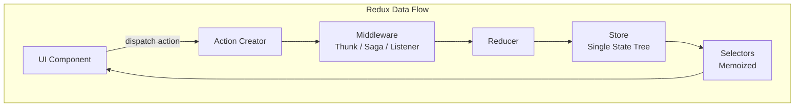
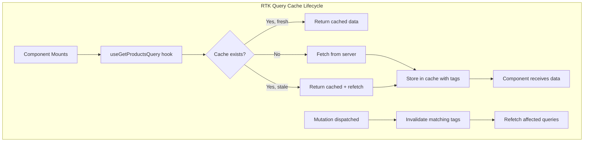
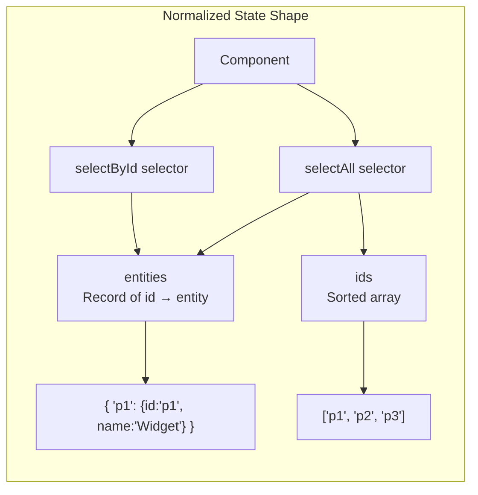

# Redux & Redux Toolkit

## Quick Reference

- Redux follows three principles: single source of truth (one store), state is read-only (only changed via dispatched actions), and changes are made with pure reducer functions
- Redux Toolkit (RTK) is the official recommended way to write Redux — it includes `createSlice`, `configureStore`, `createAsyncThunk`, and RTK Query out of the box
- `createSlice` combines action creators and reducers in one declaration, using Immer internally so you can write "mutating" logic that produces immutable updates
- `createAsyncThunk` handles async operations with automatic pending/fulfilled/rejected action dispatching and lifecycle management
- RTK Query eliminates manual data fetching boilerplate — it generates hooks, handles caching, deduplication, polling, and cache invalidation automatically
- Selectors (via `createSelector` from Reselect) compute derived state with memoization, preventing unnecessary re-renders when unrelated state changes
- `createEntityAdapter` provides normalized state management with CRUD operations, sorted IDs, and pre-built selectors for entity collections
- Redux DevTools enable time-travel debugging, action replay, state diff inspection, and export/import of state snapshots

## When to Use

Redux and Redux Toolkit are appropriate for specific application profiles. Choose Redux when:

- Building large applications with complex state interactions where multiple components across different routes need access to the same data and must stay synchronized
- Working on teams of 5+ developers where enforced patterns (actions, reducers, selectors) provide consistency and make code reviews predictable regardless of who wrote the feature
- Implementing complex async workflows (multi-step forms, optimistic updates with rollback, real-time synchronization) where middleware provides structured side-effect management
- Requiring time-travel debugging and state inspection capabilities for complex business logic where reproducing bugs requires replaying exact action sequences
- Building applications where server state caching, deduplication, and background refetching are critical (RTK Query replaces React Query/SWR for Redux-based apps)

Avoid Redux for simple applications with 2-3 pages and minimal shared state — React's built-in `useState`, `useReducer`, and Context handle these cases with less complexity.

## Code Examples

### Store Configuration with Redux Toolkit

```typescript
import { configureStore, combineReducers } from '@reduxjs/toolkit';
import { setupListeners } from '@reduxjs/toolkit/query';
import { productsSlice } from './features/products/productsSlice';
import { cartSlice } from './features/cart/cartSlice';
import { authSlice } from './features/auth/authSlice';
import { apiSlice } from './features/api/apiSlice';
import { listenerMiddleware } from './middleware/listenerMiddleware';

const rootReducer = combineReducers({
  products: productsSlice.reducer,
  cart: cartSlice.reducer,
  auth: authSlice.reducer,
  [apiSlice.reducerPath]: apiSlice.reducer,
});

export const store = configureStore({
  reducer: rootReducer,
  middleware: (getDefaultMiddleware) =>
    getDefaultMiddleware({
      serializableCheck: {
        // Ignore non-serializable values in specific paths
        ignoredActions: ['auth/setCredentials'],
        ignoredPaths: ['auth.tokenExpiry'],
      },
    })
      .prepend(listenerMiddleware.middleware)
      .concat(apiSlice.middleware),
  devTools: process.env.NODE_ENV !== 'production',
});

// Enable refetchOnFocus and refetchOnReconnect for RTK Query
setupListeners(store.dispatch);

// Infer types from the store
export type RootState = ReturnType<typeof store.getState>;
export type AppDispatch = typeof store.dispatch;

// Typed hooks
import { useDispatch, useSelector, TypedUseSelectorHook } from 'react-redux';
export const useAppDispatch = () => useDispatch<AppDispatch>();
export const useAppSelector: TypedUseSelectorHook<RootState> = useSelector;
```

### createSlice with Immer and Prepared Actions

```typescript
import { createSlice, PayloadAction, nanoid } from '@reduxjs/toolkit';

interface CartItem {
  id: string;
  productId: string;
  name: string;
  price: number;
  quantity: number;
  addedAt: string;
}

interface CartState {
  items: CartItem[];
  couponCode: string | null;
  discountPercent: number;
}

const initialState: CartState = {
  items: [],
  couponCode: null,
  discountPercent: 0,
};

export const cartSlice = createSlice({
  name: 'cart',
  initialState,
  reducers: {
    // Simple reducer — Immer allows "mutating" syntax
    addItem: {
      reducer(state, action: PayloadAction<CartItem>) {
        const existing = state.items.find(i => i.productId === action.payload.productId);
        if (existing) {
          existing.quantity += action.payload.quantity;
        } else {
          state.items.push(action.payload);
        }
      },
      // Prepare callback — add generated fields before reaching reducer
      prepare(product: { id: string; name: string; price: number }, quantity = 1) {
        return {
          payload: {
            id: nanoid(),
            productId: product.id,
            name: product.name,
            price: product.price,
            quantity,
            addedAt: new Date().toISOString(),
          },
        };
      },
    },

    removeItem(state, action: PayloadAction<string>) {
      state.items = state.items.filter(item => item.id !== action.payload);
    },

    updateQuantity(state, action: PayloadAction<{ id: string; quantity: number }>) {
      const item = state.items.find(i => i.id === action.payload.id);
      if (item) {
        item.quantity = Math.max(0, action.payload.quantity);
        if (item.quantity === 0) {
          state.items = state.items.filter(i => i.id !== action.payload.id);
        }
      }
    },

    applyCoupon(state, action: PayloadAction<{ code: string; discount: number }>) {
      state.couponCode = action.payload.code;
      state.discountPercent = action.payload.discount;
    },

    clearCart() {
      return initialState;
    },
  },
});

export const { addItem, removeItem, updateQuantity, applyCoupon, clearCart } = cartSlice.actions;
```

### createAsyncThunk with Error Handling

```typescript
import { createSlice, createAsyncThunk, PayloadAction } from '@reduxjs/toolkit';
import type { RootState } from '../../store';

interface Product {
  id: string;
  name: string;
  price: number;
  category: string;
  stock: number;
}

interface ProductsState {
  items: Product[];
  selectedProduct: Product | null;
  status: 'idle' | 'loading' | 'succeeded' | 'failed';
  error: string | null;
  currentPage: number;
  totalPages: number;
}

// Async thunk with typed error handling
export const fetchProducts = createAsyncThunk<
  { products: Product[]; totalPages: number },  // Return type
  { page: number; category?: string },           // Argument type
  { state: RootState; rejectValue: string }      // ThunkAPI config
>(
  'products/fetchProducts',
  async ({ page, category }, { rejectWithValue, signal }) => {
    try {
      const params = new URLSearchParams({ page: String(page) });
      if (category) params.set('category', category);

      const response = await fetch(`/api/products?${params}`, { signal });

      if (!response.ok) {
        const error = await response.json();
        return rejectWithValue(error.message || 'Failed to fetch products');
      }

      return await response.json();
    } catch (err) {
      if (err instanceof Error && err.name === 'AbortError') {
        return rejectWithValue('Request cancelled');
      }
      return rejectWithValue('Network error');
    }
  },
  {
    // Condition — prevent duplicate requests
    condition: (_, { getState }) => {
      const { products } = getState();
      if (products.status === 'loading') return false;  // Already loading
    },
  }
);

export const productsSlice = createSlice({
  name: 'products',
  initialState: {
    items: [],
    selectedProduct: null,
    status: 'idle',
    error: null,
    currentPage: 1,
    totalPages: 0,
  } as ProductsState,
  reducers: {
    selectProduct(state, action: PayloadAction<string>) {
      state.selectedProduct = state.items.find(p => p.id === action.payload) || null;
    },
    clearError(state) {
      state.error = null;
    },
  },
  extraReducers: (builder) => {
    builder
      .addCase(fetchProducts.pending, (state) => {
        state.status = 'loading';
        state.error = null;
      })
      .addCase(fetchProducts.fulfilled, (state, action) => {
        state.status = 'succeeded';
        state.items = action.payload.products;
        state.totalPages = action.payload.totalPages;
      })
      .addCase(fetchProducts.rejected, (state, action) => {
        state.status = 'failed';
        state.error = action.payload ?? 'Unknown error';
      });
  },
});
```

### Selectors with Memoization (Reselect)

```typescript
import { createSelector } from '@reduxjs/toolkit';
import type { RootState } from '../../store';

// Base selectors — simple state access
const selectCartItems = (state: RootState) => state.cart.items;
const selectDiscountPercent = (state: RootState) => state.cart.discountPercent;
const selectCouponCode = (state: RootState) => state.cart.couponCode;

// Memoized derived selectors
export const selectCartTotal = createSelector(
  [selectCartItems],
  (items) => items.reduce((total, item) => total + item.price * item.quantity, 0)
);

export const selectCartTotalWithDiscount = createSelector(
  [selectCartTotal, selectDiscountPercent],
  (total, discount) => {
    const discountAmount = total * (discount / 100);
    return {
      subtotal: total,
      discount: discountAmount,
      total: total - discountAmount,
    };
  }
);

export const selectCartItemCount = createSelector(
  [selectCartItems],
  (items) => items.reduce((count, item) => count + item.quantity, 0)
);

// Parameterized selector using factory pattern
export const makeSelectCartItemsByCategory = () =>
  createSelector(
    [selectCartItems, (_state: RootState, category: string) => category],
    (items, category) => items.filter(item => item.productId.startsWith(category))
  );

// Selector composition
export const selectCartSummary = createSelector(
  [selectCartItems, selectCartTotalWithDiscount, selectCartItemCount, selectCouponCode],
  (items, totals, itemCount, coupon) => ({
    items,
    ...totals,
    itemCount,
    coupon,
    isEmpty: itemCount === 0,
    qualifiesForFreeShipping: totals.total >= 50,
  })
);
```

### RTK Query — API Definition and Auto-Generated Hooks

```typescript
import { createApi, fetchBaseQuery } from '@reduxjs/toolkit/query/react';
import type { RootState } from '../../store';

interface Product {
  id: string;
  name: string;
  price: number;
  category: string;
  description: string;
}

interface PaginatedResponse<T> {
  data: T[];
  page: number;
  totalPages: number;
  total: number;
}

export const apiSlice = createApi({
  reducerPath: 'api',
  baseQuery: fetchBaseQuery({
    baseUrl: '/api',
    prepareHeaders: (headers, { getState }) => {
      const token = (getState() as RootState).auth.token;
      if (token) {
        headers.set('Authorization', `Bearer ${token}`);
      }
      return headers;
    },
  }),
  tagTypes: ['Product', 'Order', 'User'],
  endpoints: (builder) => ({
    // Query — GET request with caching
    getProducts: builder.query<PaginatedResponse<Product>, { page?: number; category?: string }>({
      query: ({ page = 1, category }) => ({
        url: 'products',
        params: { page, ...(category && { category }) },
      }),
      providesTags: (result) =>
        result
          ? [
              ...result.data.map(({ id }) => ({ type: 'Product' as const, id })),
              { type: 'Product', id: 'LIST' },
            ]
          : [{ type: 'Product', id: 'LIST' }],
    }),

    getProduct: builder.query<Product, string>({
      query: (id) => `products/${id}`,
      providesTags: (result, error, id) => [{ type: 'Product', id }],
    }),

    // Mutation — POST/PUT/DELETE with cache invalidation
    createProduct: builder.mutation<Product, Omit<Product, 'id'>>({
      query: (newProduct) => ({
        url: 'products',
        method: 'POST',
        body: newProduct,
      }),
      invalidatesTags: [{ type: 'Product', id: 'LIST' }],
    }),

    updateProduct: builder.mutation<Product, { id: string; updates: Partial<Product> }>({
      query: ({ id, updates }) => ({
        url: `products/${id}`,
        method: 'PATCH',
        body: updates,
      }),
      // Optimistic update
      async onQueryStarted({ id, updates }, { dispatch, queryFulfilled }) {
        const patchResult = dispatch(
          apiSlice.util.updateQueryData('getProduct', id, (draft) => {
            Object.assign(draft, updates);
          })
        );
        try {
          await queryFulfilled;
        } catch {
          patchResult.undo();  // Rollback on failure
        }
      },
      invalidatesTags: (result, error, { id }) => [{ type: 'Product', id }],
    }),

    deleteProduct: builder.mutation<void, string>({
      query: (id) => ({
        url: `products/${id}`,
        method: 'DELETE',
      }),
      invalidatesTags: (result, error, id) => [
        { type: 'Product', id },
        { type: 'Product', id: 'LIST' },
      ],
    }),
  }),
});

// Auto-generated hooks
export const {
  useGetProductsQuery,
  useGetProductQuery,
  useCreateProductMutation,
  useUpdateProductMutation,
  useDeleteProductMutation,
} = apiSlice;
```

### createEntityAdapter for Normalized State

```typescript
import { createSlice, createEntityAdapter, createAsyncThunk } from '@reduxjs/toolkit';
import type { RootState } from '../../store';

interface Notification {
  id: string;
  title: string;
  message: string;
  type: 'info' | 'warning' | 'error' | 'success';
  read: boolean;
  createdAt: string;
}

// Entity adapter with custom sorting
const notificationsAdapter = createEntityAdapter<Notification>({
  selectId: (notification) => notification.id,
  sortComparer: (a, b) => b.createdAt.localeCompare(a.createdAt),  // Newest first
});

export const fetchNotifications = createAsyncThunk(
  'notifications/fetchAll',
  async () => {
    const response = await fetch('/api/notifications');
    return (await response.json()) as Notification[];
  }
);

const notificationsSlice = createSlice({
  name: 'notifications',
  initialState: notificationsAdapter.getInitialState({
    status: 'idle' as 'idle' | 'loading' | 'succeeded' | 'failed',
  }),
  reducers: {
    markAsRead: notificationsAdapter.updateOne,
    markAllAsRead(state) {
      const updates = state.ids.map(id => ({
        id: id as string,
        changes: { read: true },
      }));
      notificationsAdapter.updateMany(state, updates);
    },
    removeNotification: notificationsAdapter.removeOne,
    addNotification: notificationsAdapter.addOne,
  },
  extraReducers: (builder) => {
    builder
      .addCase(fetchNotifications.pending, (state) => { state.status = 'loading'; })
      .addCase(fetchNotifications.fulfilled, (state, action) => {
        state.status = 'succeeded';
        notificationsAdapter.setAll(state, action.payload);
      });
  },
});

// Pre-built selectors from adapter
export const {
  selectAll: selectAllNotifications,
  selectById: selectNotificationById,
  selectIds: selectNotificationIds,
  selectTotal: selectNotificationCount,
} = notificationsAdapter.getSelectors((state: RootState) => state.notifications);

// Custom derived selectors
export const selectUnreadNotifications = createSelector(
  selectAllNotifications,
  (notifications) => notifications.filter(n => !n.read)
);

export const selectUnreadCount = createSelector(
  selectUnreadNotifications,
  (unread) => unread.length
);
```

## Architecture / Diagrams







## Common Pitfalls

**Storing derived state in the store instead of computing it with selectors.** Developers often store `totalPrice`, `filteredItems`, or `isCartEmpty` in the store alongside the source data. This creates synchronization bugs — if you update items but forget to recalculate the total, state becomes inconsistent. Store only the minimal source data and compute everything else with memoized selectors. Selectors recompute only when their inputs change, so performance is equivalent to storing derived values.

**Not using RTK Query for server state and manually managing loading/error/data.** Before RTK Query, every feature needed loading states, error handling, cache management, and refetch logic — hundreds of lines of boilerplate per endpoint. RTK Query handles all of this declaratively. Teams that continue writing manual `createAsyncThunk` + loading state for CRUD operations are doing unnecessary work. Reserve manual thunks for complex multi-step workflows that don't fit the query/mutation model.

**Putting everything in global Redux state.** Not all state belongs in Redux. Form input values, UI toggle states (is this dropdown open?), animation states, and component-local data should use `useState` or `useReducer`. Redux is for state that multiple unrelated components need, state that persists across route changes, or state that requires complex update logic. Over-globalizing state causes unnecessary re-renders and makes components harder to test in isolation.

**Mutating state outside of Immer's proxy in createSlice.** While `createSlice` uses Immer to allow "mutating" syntax, this only works inside the reducer function. Mutating state in selectors, components, or middleware causes bugs. Also, returning a new value AND mutating in the same reducer confuses Immer — either mutate the draft OR return a new value, never both.

**Not using `createSelector` for expensive computations.** Without memoization, a selector that filters or sorts a large array runs on every state change, even if the relevant slice didn't change. This causes unnecessary re-renders in every connected component. Always wrap derived computations in `createSelector` — it only recomputes when its input selectors return new values.

**Dispatching actions in a loop instead of batching.** Dispatching 100 actions in a `forEach` loop triggers 100 state updates and 100 re-renders. Use `createEntityAdapter.setAll()` for bulk entity operations, or batch multiple updates into a single action with a payload containing all changes. React 18's automatic batching helps, but reducing dispatch count is still better for DevTools readability and middleware performance.

## Real-World Use Cases

**E-Commerce Platform with Complex Cart and Checkout.** A large retail application uses Redux for cart state (items, quantities, applied coupons, shipping options), user authentication, and product catalog caching. RTK Query manages product listings with pagination, search, and category filtering — cache tags ensure that adding a review invalidates the product detail cache. The checkout flow uses a multi-step thunk that coordinates inventory reservation, payment processing, and order creation with rollback on failure. Redux DevTools enables customer support to replay user actions when investigating order issues.

**Real-Time Collaborative Dashboard.** A project management tool uses Redux to synchronize state across WebSocket updates from multiple users. When a teammate moves a task card, the WebSocket middleware dispatches an action that updates the board state. Optimistic updates move the card immediately in the current user's view, with rollback if the server rejects the change. Selectors compute board statistics (tasks per column, overdue items, team workload) without re-rendering the entire board when a single card changes.

**Financial Trading Application.** A trading platform processes hundreds of price updates per second via WebSocket. Redux middleware batches incoming price updates (collecting updates for 100ms before dispatching a single batch action) to prevent render thrashing. Normalized state with `createEntityAdapter` stores instrument data, and memoized selectors compute portfolio value, P&L, and risk metrics. The DevTools action log provides an audit trail of every price update and user trade for compliance purposes.

## Interview Questions

**Q: Explain Redux's three principles and why they matter for large applications.**

A: (1) Single source of truth: the entire application state lives in one store object. This makes state predictable, debuggable (one place to inspect), and enables features like undo/redo and state persistence. (2) State is read-only: components cannot directly mutate state; they must dispatch actions describing what happened. This creates an audit trail of every state change and prevents race conditions from concurrent mutations. (3) Changes via pure functions: reducers are pure functions `(state, action) => newState` with no side effects. This makes state transitions testable (given this state and this action, expect this result), predictable, and replayable. Together, these principles trade flexibility for predictability — in a 50-developer team, everyone follows the same pattern, making code reviews and debugging consistent regardless of who wrote the feature.

**Q: How does RTK Query differ from React Query/TanStack Query? When would you choose one over the other?**

A: RTK Query is built into Redux Toolkit and stores server cache in the Redux store, making it accessible to Redux middleware, DevTools, and existing Redux selectors. React Query is standalone and stores cache in its own context. Choose RTK Query when: you already use Redux for client state and want unified DevTools, you need middleware to react to cache events, or you want selectors that combine server and client state. Choose React Query when: you don't use Redux (no need to add it just for data fetching), you want framework-agnostic caching (works with Vue, Svelte), or you need features RTK Query lacks (infinite queries, optimistic mutations are simpler in React Query). Both handle caching, deduplication, background refetching, and stale-while-revalidate. The choice is primarily about whether Redux is already in your architecture.

**Q: How would you test Redux slices, thunks, and selectors?**

A: Test each layer independently. Reducers: call the reducer function directly with a state and action, assert the returned state — no store needed, pure function testing. Selectors: call the selector with a mock state object, assert the derived value. For `createSelector`, verify memoization by calling twice with the same input and checking reference equality. Thunks: use a mock store (`configureStore` with the real reducer) or test the thunk function directly by providing mock `dispatch` and `getState`. For RTK Query: use `setupServer` from MSW to mock API responses, render components with the real store, and assert that hooks return expected data/loading/error states. Integration tests that render a component connected to a real store with mocked APIs provide the highest confidence.

**Q: What is normalized state and why does createEntityAdapter use it?**

A: Normalized state stores entities in a lookup table (`{ [id]: entity }`) with a separate array of IDs for ordering. Without normalization, the same entity might exist in multiple places (a product in the product list, in the cart, in recently viewed) — updating it requires finding and updating every copy. With normalization, each entity exists once; references use IDs. `createEntityAdapter` provides this pattern with pre-built CRUD operations (`addOne`, `updateOne`, `removeOne`, `setAll`) and selectors (`selectById`, `selectAll`). It also handles sorting via `sortComparer`. The trade-off is slightly more complex component code (must look up entities by ID) but dramatically simpler update logic and guaranteed consistency.

**Q: Explain middleware in Redux. How do thunks, sagas, and the listener middleware differ?**

A: Middleware intercepts dispatched actions before they reach reducers, enabling side effects. Thunks (default in RTK): dispatch a function instead of an action object; the function receives `dispatch` and `getState`. Simple, good for basic async (API calls, conditional dispatch). Sagas (redux-saga): use generator functions to describe complex async flows declaratively — support cancellation, racing, debouncing, and complex orchestration. Higher learning curve but powerful for complex workflows. Listener middleware (RTK): a modern alternative to sagas — register listeners that react to specific actions or state changes. Supports `take` patterns, `fork` for background tasks, and `condition` for waiting. Lighter than sagas, built into RTK. Choose thunks for simple async, listener middleware for reactive patterns and moderate complexity, sagas only for very complex orchestration (rare in modern apps).

## Production Tips

**Enable Redux DevTools in development but strip them from production builds.** DevTools add memory overhead by recording every action and state snapshot. Configure `devTools: process.env.NODE_ENV !== 'production'` in `configureStore`. For production debugging, implement a "debug mode" that users can activate (URL parameter or hidden setting) which enables a lightweight action logger that captures the last 50 actions without full state snapshots.

**Implement RTK Query cache invalidation strategies deliberately.** Over-invalidation (invalidating the entire product list when one product updates) causes unnecessary refetches. Under-invalidation (not invalidating after a mutation) shows stale data. Use granular tags: `{ type: 'Product', id: specificId }` for individual items and `{ type: 'Product', id: 'LIST' }` for list queries. Mutations should invalidate only the specific tags they affect. Monitor cache hit rates and refetch frequency in production to identify over-invalidation.

**Use the listener middleware for cross-slice coordination instead of dispatching from reducers.** When an action in one slice should trigger effects in another (e.g., successful login should fetch user preferences), don't import and dispatch from within the reducer. Use the listener middleware to react to the login action and dispatch the preferences fetch. This keeps slices decoupled and makes the coordination logic explicit and testable.

**Profile selector performance with the Redux DevTools Profiler.** Selectors that recompute on every action (because their input selectors return new references) cause cascading re-renders. Use the DevTools profiler to identify components that re-render when they shouldn't. Common fix: ensure input selectors return stable references (don't create new arrays/objects in the selector chain unless the underlying data actually changed).

## Related Topics

- [Zustand & Lightweight Alternatives](./zustand.md) — When Redux is too heavy and simpler solutions suffice
- [React Hooks & Components](../react/hooks-and-lifecycle.md) — React's built-in state management with useState and useReducer
- [TypeScript Advanced Types](../typescript/advanced-types.md) — Typing Redux stores, actions, and selectors effectively
- [Angular Services & DI](../angular/services-and-di.md) — Compare Redux patterns with Angular's service-based state management
