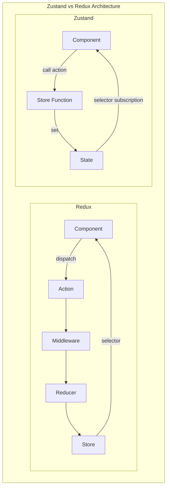
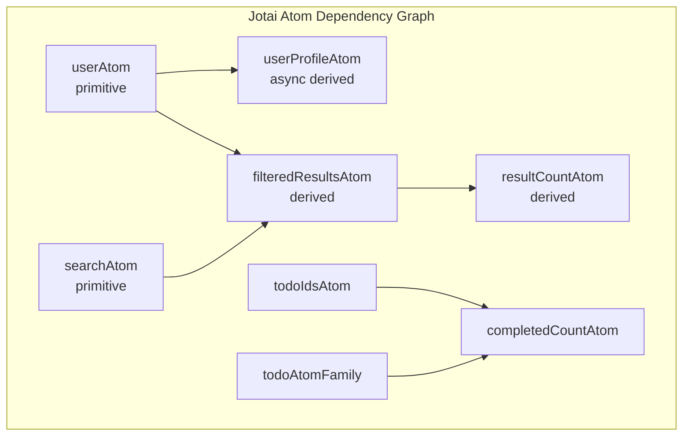
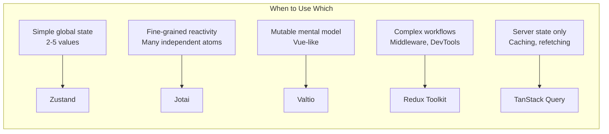

# Zustand & Lightweight Alternatives

## Quick Reference

- Zustand creates stores as hooks with zero boilerplate — no providers, no context wrappers, no action types, just a function that returns state and actions
- Zustand selectors prevent unnecessary re-renders by subscribing components only to the specific state slices they use: `useStore(state => state.count)`
- Built-in middleware includes `persist` (localStorage/sessionStorage), `devtools` (Redux DevTools integration), `immer` (immutable updates), and `subscribeWithSelector`
- Jotai provides atomic state management — each atom is an independent piece of state that components subscribe to individually, eliminating the need for selectors
- Valtio uses JavaScript Proxies for transparent reactivity — mutate state directly and components re-render automatically, similar to Vue's reactivity system
- Zustand stores are framework-agnostic at their core — the same store logic works in React, vanilla JS, and Node.js without modification
- All three libraries (Zustand, Jotai, Valtio) are maintained by the same team (pmndrs) and share design philosophies: minimal API surface, TypeScript-first, and no unnecessary abstractions

## When to Use

Lightweight state management libraries shine in specific contexts. Choose them when:

- Building small to medium applications (5-20 routes) where Redux's ceremony (actions, reducers, selectors, middleware) adds complexity without proportional benefit
- Managing a few pieces of global state (auth, theme, user preferences, shopping cart) that don't require complex async orchestration or time-travel debugging
- Working on teams that value simplicity and fast onboarding — Zustand's API can be learned in 10 minutes versus Redux's multi-hour learning curve
- Building component libraries or micro-frontends that need self-contained state without imposing a specific state management architecture on consumers
- Prototyping rapidly where iteration speed matters more than architectural rigor — refactoring from Zustand to Redux later is straightforward if complexity grows
- Needing fine-grained reactivity (Jotai/Valtio) in performance-critical UIs where even Redux's selector-based approach causes too many re-renders

## Code Examples

### Zustand Store Creation and Usage

```typescript
import { create } from 'zustand';
import { devtools, persist, subscribeWithSelector } from 'zustand/middleware';
import { immer } from 'zustand/middleware/immer';

interface CartItem {
  id: string;
  name: string;
  price: number;
  quantity: number;
}

interface CartStore {
  items: CartItem[];
  coupon: string | null;
  // Actions colocated with state
  addItem: (product: Omit<CartItem, 'quantity'>) => void;
  removeItem: (id: string) => void;
  updateQuantity: (id: string, quantity: number) => void;
  applyCoupon: (code: string) => void;
  clearCart: () => void;
  // Computed (getter-style)
  getTotal: () => number;
  getItemCount: () => number;
}

export const useCartStore = create<CartStore>()(
  devtools(
    persist(
      immer((set, get) => ({
        items: [],
        coupon: null,

        addItem: (product) =>
          set((state) => {
            const existing = state.items.find((i) => i.id === product.id);
            if (existing) {
              existing.quantity += 1;
            } else {
              state.items.push({ ...product, quantity: 1 });
            }
          }),

        removeItem: (id) =>
          set((state) => {
            state.items = state.items.filter((i) => i.id !== id);
          }),

        updateQuantity: (id, quantity) =>
          set((state) => {
            const item = state.items.find((i) => i.id === id);
            if (item) {
              if (quantity <= 0) {
                state.items = state.items.filter((i) => i.id !== id);
              } else {
                item.quantity = quantity;
              }
            }
          }),

        applyCoupon: (code) => set({ coupon: code }),

        clearCart: () => set({ items: [], coupon: null }),

        getTotal: () => {
          const { items } = get();
          return items.reduce((sum, item) => sum + item.price * item.quantity, 0);
        },

        getItemCount: () => {
          const { items } = get();
          return items.reduce((sum, item) => sum + item.quantity, 0);
        },
      })),
      {
        name: 'cart-storage',
        partialize: (state) => ({ items: state.items, coupon: state.coupon }),
      }
    ),
    { name: 'CartStore' }
  )
);

// Usage in components — subscribe to specific slices
function CartBadge() {
  const itemCount = useCartStore((state) => state.getItemCount());
  return <span className="badge">{itemCount}</span>;
}

function CartTotal() {
  const total = useCartStore((state) => state.getTotal());
  const coupon = useCartStore((state) => state.coupon);
  return (
    <div>
      <span>${total.toFixed(2)}</span>
      {coupon && <span className="coupon">Coupon: {coupon}</span>}
    </div>
  );
}

function AddToCartButton({ product }: { product: Product }) {
  // Only subscribes to addItem — won't re-render when items change
  const addItem = useCartStore((state) => state.addItem);
  return <button onClick={() => addItem(product)}>Add to Cart</button>;
}
```

### Zustand with Async Actions and Slices Pattern

```typescript
import { create } from 'zustand';
import { StateCreator } from 'zustand';

// Slice pattern for large stores
interface AuthSlice {
  user: User | null;
  token: string | null;
  isLoading: boolean;
  login: (credentials: Credentials) => Promise<void>;
  logout: () => void;
  refreshToken: () => Promise<void>;
}

interface NotificationSlice {
  notifications: Notification[];
  unreadCount: number;
  addNotification: (notification: Notification) => void;
  markAsRead: (id: string) => void;
  clearAll: () => void;
}

// Each slice is defined independently
const createAuthSlice: StateCreator<
  AuthSlice & NotificationSlice,
  [['zustand/immer', never]],
  [],
  AuthSlice
> = (set, get) => ({
  user: null,
  token: null,
  isLoading: false,

  login: async (credentials) => {
    set({ isLoading: true });
    try {
      const response = await fetch('/api/auth/login', {
        method: 'POST',
        headers: { 'Content-Type': 'application/json' },
        body: JSON.stringify(credentials),
      });

      if (!response.ok) throw new Error('Login failed');

      const { user, token } = await response.json();
      set({ user, token, isLoading: false });

      // Cross-slice communication
      get().addNotification({
        id: crypto.randomUUID(),
        message: `Welcome back, ${user.name}!`,
        type: 'success',
        read: false,
        createdAt: new Date().toISOString(),
      });
    } catch (error) {
      set({ isLoading: false });
      throw error;
    }
  },

  logout: () => {
    set({ user: null, token: null });
  },

  refreshToken: async () => {
    const { token } = get();
    if (!token) return;

    const response = await fetch('/api/auth/refresh', {
      headers: { Authorization: `Bearer ${token}` },
    });

    if (response.ok) {
      const { token: newToken } = await response.json();
      set({ token: newToken });
    } else {
      get().logout();
    }
  },
});

const createNotificationSlice: StateCreator<
  AuthSlice & NotificationSlice,
  [['zustand/immer', never]],
  [],
  NotificationSlice
> = (set) => ({
  notifications: [],
  unreadCount: 0,

  addNotification: (notification) =>
    set((state) => {
      state.notifications.unshift(notification);
      state.unreadCount += 1;
    }),

  markAsRead: (id) =>
    set((state) => {
      const notification = state.notifications.find((n) => n.id === id);
      if (notification && !notification.read) {
        notification.read = true;
        state.unreadCount -= 1;
      }
    }),

  clearAll: () => set({ notifications: [], unreadCount: 0 }),
});

// Combine slices
export const useAppStore = create<AuthSlice & NotificationSlice>()(
  immer((...args) => ({
    ...createAuthSlice(...args),
    ...createNotificationSlice(...args),
  }))
);
```

### Jotai — Atomic State Management

```typescript
import { atom, useAtom, useAtomValue, useSetAtom } from 'jotai';
import { atomWithStorage, atomWithQuery } from 'jotai/utils';
import { focusAtom } from 'jotai-optics';

// Primitive atoms — independent pieces of state
const countAtom = atom(0);
const darkModeAtom = atomWithStorage('darkMode', false);
const searchQueryAtom = atom('');

// Derived atom — computed from other atoms (read-only)
const doubleCountAtom = atom((get) => get(countAtom) * 2);

// Writable derived atom — custom setter logic
const countWithMaxAtom = atom(
  (get) => get(countAtom),
  (get, set, newValue: number) => {
    set(countAtom, Math.min(newValue, 100));  // Cap at 100
  }
);

// Async atom — fetches data based on other atoms
const userAtom = atom<User | null>(null);

const userProfileAtom = atom(async (get) => {
  const user = get(userAtom);
  if (!user) return null;

  const response = await fetch(`/api/users/${user.id}/profile`);
  return response.json();
});

// Atom family — parameterized atoms for collections
import { atomFamily } from 'jotai/utils';

const todoAtomFamily = atomFamily((id: string) =>
  atom<Todo>({ id, text: '', completed: false })
);

const todoIdsAtom = atom<string[]>([]);

// Derived atom combining family members
const completedTodosAtom = atom((get) => {
  const ids = get(todoIdsAtom);
  return ids
    .map((id) => get(todoAtomFamily(id)))
    .filter((todo) => todo.completed);
});

// Usage in components
function TodoItem({ id }: { id: string }) {
  const [todo, setTodo] = useAtom(todoAtomFamily(id));

  const toggle = () => {
    setTodo((prev) => ({ ...prev, completed: !prev.completed }));
  };

  return (
    <li>
      <input type="checkbox" checked={todo.completed} onChange={toggle} />
      <span>{todo.text}</span>
    </li>
  );
}

function TodoStats() {
  // Only re-renders when completed todos change
  const completedTodos = useAtomValue(completedTodosAtom);
  return <p>{completedTodos.length} completed</p>;
}

function DarkModeToggle() {
  const [darkMode, setDarkMode] = useAtom(darkModeAtom);
  return (
    <button onClick={() => setDarkMode(!darkMode)}>
      {darkMode ? '☀️' : '🌙'}
    </button>
  );
}
```

### Valtio — Proxy-Based Reactive State

```typescript
import { proxy, useSnapshot, subscribe, ref } from 'valtio';
import { derive } from 'valtio/utils';
import { devtools } from 'valtio/utils';

// State is a plain mutable object wrapped in a proxy
interface AppState {
  user: User | null;
  cart: {
    items: CartItem[];
    isOpen: boolean;
  };
  theme: 'light' | 'dark';
}

export const state = proxy<AppState>({
  user: null,
  cart: {
    items: [],
    isOpen: false,
  },
  theme: 'light',
});

// Enable Redux DevTools
devtools(state, { name: 'AppState' });

// Actions — just mutate the proxy directly
export const actions = {
  login: async (credentials: Credentials) => {
    const response = await fetch('/api/auth/login', {
      method: 'POST',
      body: JSON.stringify(credentials),
    });
    const user = await response.json();
    state.user = user;  // Direct mutation triggers re-renders
  },

  logout: () => {
    state.user = null;
    state.cart.items = [];
  },

  addToCart: (product: Product) => {
    const existing = state.cart.items.find((i) => i.productId === product.id);
    if (existing) {
      existing.quantity += 1;  // Nested mutation works
    } else {
      state.cart.items.push({
        id: crypto.randomUUID(),
        productId: product.id,
        name: product.name,
        price: product.price,
        quantity: 1,
      });
    }
  },

  removeFromCart: (id: string) => {
    const index = state.cart.items.findIndex((i) => i.id === id);
    if (index !== -1) {
      state.cart.items.splice(index, 1);
    }
  },

  toggleTheme: () => {
    state.theme = state.theme === 'light' ? 'dark' : 'light';
  },

  toggleCart: () => {
    state.cart.isOpen = !state.cart.isOpen;
  },
};

// Derived state — automatically recomputes when dependencies change
const derived = derive({
  cartTotal: (get) =>
    get(state.cart).items.reduce((sum, item) => sum + item.price * item.quantity, 0),
  cartItemCount: (get) =>
    get(state.cart).items.reduce((sum, item) => sum + item.quantity, 0),
  isAuthenticated: (get) => get(state).user !== null,
});

// Subscribe to changes outside React
subscribe(state.cart, () => {
  // Persist cart to localStorage on every change
  localStorage.setItem('cart', JSON.stringify(state.cart.items));
});

// Usage in components — useSnapshot creates a reactive read-only view
function CartIcon() {
  const snap = useSnapshot(state);
  const derivedSnap = useSnapshot(derived);

  return (
    <button onClick={actions.toggleCart}>
      🛒 {derivedSnap.cartItemCount}
    </button>
  );
}

function CartPanel() {
  const snap = useSnapshot(state);

  if (!snap.cart.isOpen) return null;

  return (
    <div className="cart-panel">
      {snap.cart.items.map((item) => (
        <div key={item.id}>
          <span>{item.name} × {item.quantity}</span>
          <button onClick={() => actions.removeFromCart(item.id)}>Remove</button>
        </div>
      ))}
    </div>
  );
}
```

### Testing Patterns for Zustand Stores

```typescript
import { act, renderHook } from '@testing-library/react';
import { useCartStore } from '../stores/cartStore';

// Reset store between tests
beforeEach(() => {
  useCartStore.setState({
    items: [],
    coupon: null,
  });
});

describe('CartStore', () => {
  it('adds item to empty cart', () => {
    const { result } = renderHook(() => useCartStore());

    act(() => {
      result.current.addItem({ id: 'p1', name: 'Widget', price: 29.99 });
    });

    expect(result.current.items).toHaveLength(1);
    expect(result.current.items[0]).toMatchObject({
      id: 'p1',
      name: 'Widget',
      price: 29.99,
      quantity: 1,
    });
  });

  it('increments quantity for existing item', () => {
    const { result } = renderHook(() => useCartStore());

    act(() => {
      result.current.addItem({ id: 'p1', name: 'Widget', price: 29.99 });
      result.current.addItem({ id: 'p1', name: 'Widget', price: 29.99 });
    });

    expect(result.current.items).toHaveLength(1);
    expect(result.current.items[0].quantity).toBe(2);
  });

  it('computes total correctly', () => {
    const { result } = renderHook(() => useCartStore());

    act(() => {
      result.current.addItem({ id: 'p1', name: 'Widget', price: 10 });
      result.current.addItem({ id: 'p2', name: 'Gadget', price: 20 });
      result.current.updateQuantity('p1', 3);
    });

    expect(result.current.getTotal()).toBe(50);  // (10 * 3) + (20 * 1)
  });

  // Testing outside React (vanilla)
  it('works without React hooks', () => {
    const { getState, setState } = useCartStore;

    setState({ items: [{ id: 'p1', name: 'Test', price: 5, quantity: 2 }] });

    expect(getState().items).toHaveLength(1);
    expect(getState().getTotal()).toBe(10);
  });
});
```

## Architecture / Diagrams







## Common Pitfalls

**Not using selectors in Zustand and subscribing to the entire store.** Writing `const state = useStore()` without a selector subscribes the component to every state change in the store. If the store has 20 properties and only one changes, the component still re-renders. Always use selectors: `useStore(s => s.specificField)`. For multiple fields, use `useShallow` from `zustand/react/shallow` to compare by shallow equality: `useStore(useShallow(s => ({ a: s.a, b: s.b })))`.

**Mixing Valtio's proxy state with React's immutable mental model.** Valtio encourages direct mutation (`state.count += 1`), but developers accustomed to React's immutability rules sometimes spread state unnecessarily or create new objects when mutation would work. Conversely, passing Valtio proxy objects to libraries that expect plain objects (form libraries, serialization) causes issues. Use `snapshot()` to get a plain immutable copy when needed for external libraries.

**Creating too many Jotai atoms without cleanup.** Atom families (`atomFamily`) create new atoms for each unique parameter. If parameters are dynamic (like list item IDs that change), old atoms accumulate in memory. Use `atomFamily` with a cleanup strategy or `atomWithReset` to clear stale atoms. For large lists, consider whether a single atom holding the array is simpler than individual atoms per item.

**Persisting entire store state including derived values and functions.** The `persist` middleware should only save source data, not computed values or action functions. Use `partialize` to select which state to persist: `persist(store, { partialize: (state) => ({ items: state.items }) })`. Persisting derived state causes stale data on rehydration when the computation logic changes.

**Not handling SSR correctly with Zustand/Jotai.** In Next.js or other SSR frameworks, stores created at module level are shared across all requests on the server, causing state leakage between users. For SSR, create stores per-request using a provider pattern or use Jotai's `Provider` component to scope atoms to a specific React tree. Zustand's `createStore` (not `create`) returns a vanilla store that can be instantiated per-request.

**Overcomplicating state that should be local.** Not every piece of state needs a global store. Form input values, dropdown open/closed state, animation progress, and component-specific UI state should remain in `useState`. Global stores are for state shared across routes or between unrelated components. Putting everything in Zustand/Jotai makes components harder to test and reason about.

## Real-World Use Cases

**Design Tool with Collaborative Editing.** A Figma-like design tool uses Valtio for canvas state (element positions, selections, zoom level) because direct mutation maps naturally to drag-and-drop operations. When a user drags an element, the handler simply writes `state.elements[id].x = newX` — Valtio's proxy detects the change and re-renders only the affected element. A separate Zustand store manages application-level state (user session, project metadata, undo history) where the action-based model provides better structure for complex operations.

**Dashboard with Independent Widget State.** A monitoring dashboard uses Jotai atoms for each widget's configuration (time range, refresh interval, data source). Each widget subscribes only to its own atoms, so updating one widget's time range doesn't re-render the other 20 widgets on screen. Derived atoms compute aggregated metrics across widgets when needed. The atomic model eliminates the selector complexity that Redux would require for this level of granularity.

**E-Commerce Storefront with Zustand.** A mid-size e-commerce site uses Zustand for cart state (persisted to localStorage), user preferences (theme, currency, language), and recently viewed products. The store has ~15 state properties and ~20 actions — well within Zustand's sweet spot. The team chose Zustand over Redux because: no boilerplate files (actions, reducers, selectors are colocated), new developers are productive in hours not days, and the bundle size is 1KB vs Redux's 10KB+.

## Interview Questions

**Q: Compare Zustand, Jotai, and Valtio. When would you choose each?**

A: All three are lightweight alternatives to Redux from the same team, but with different mental models. Zustand: single store with selectors, closest to Redux's model but with 90% less boilerplate. Choose for applications that need a central store with clear actions but don't need Redux's middleware ecosystem. Jotai: atomic model where each piece of state is independent. Choose when you have many independent state values that different components subscribe to — avoids the "selector optimization" problem entirely because atoms are already granular. Valtio: proxy-based mutation model. Choose when your team prefers mutable state (coming from Vue/MobX) or when the domain involves frequent small mutations (canvas editors, real-time data). Performance characteristics are similar; the choice is primarily about developer ergonomics and mental model fit.

**Q: How does Zustand achieve re-render optimization without React Context?**

A: Zustand stores state outside React's component tree using a vanilla JavaScript subscription model. When you call `useStore(selector)`, the hook subscribes to the store and only triggers a re-render when the selector's return value changes (compared by `Object.is` by default, or shallow equality with `useShallow`). This avoids Context's fundamental limitation where any context value change re-renders all consumers. Zustand's approach means: no Provider wrapper needed, no re-render cascading, and selectors are just functions (not memoized components). The store itself is a closure holding state and a Set of listener functions — when `set()` is called, it notifies all listeners, each of which runs its selector and only triggers React's setState if the selected value changed.

**Q: How would you handle server-side rendering with Zustand in Next.js?**

A: The challenge is that module-level stores (`create(...)`) are singletons shared across all server requests. Solution: (1) For client-only state (cart, UI preferences), use the store normally but skip hydration — initialize from localStorage on the client. (2) For state that needs server data, create stores per-request using `createStore()` (vanilla, not a hook) and pass them via React context or Next.js page props. (3) Use Zustand's `persist` middleware with `skipHydration: true` and manually call `useStore.persist.rehydrate()` in a client-side effect. (4) For Next.js App Router, create the store in a client component boundary and pass initial data as props from server components. The key principle: never let server-rendered state leak between requests.

**Q: What are the performance implications of Valtio's proxy-based approach compared to immutable updates?**

A: Valtio's proxies track which properties each component accesses during render (via `useSnapshot`). On state mutation, Valtio knows exactly which components read the changed property and only notifies those components. This is more granular than selector-based approaches where the selector function must run to determine if the output changed. The trade-off: proxy creation has overhead for deeply nested objects (each nested object gets its own proxy), and `snapshot()` creates a frozen copy on every access (though it's cached between mutations). For most applications, the performance difference is negligible. Valtio can be faster for fine-grained updates (changing one property in a large object) but slower for bulk updates (replacing an entire array) compared to immutable approaches that can short-circuit with reference equality.

**Q: How do you test components that use Zustand stores?**

A: Three approaches depending on test goals. (1) Reset store state in `beforeEach`: call `useStore.setState(initialState)` to ensure clean state per test. This tests the real store logic. (2) Mock the store entirely: use `jest.mock()` or Vitest's `vi.mock()` to replace the store module with controlled values. Useful for testing component rendering without store logic. (3) Test store logic independently: import the store, call actions via `useStore.getState().actionName()`, and assert state via `useStore.getState()` — no React rendering needed. For integration tests, prefer approach (1) because it tests the real interaction between component and store. For unit tests of complex components, approach (2) isolates the component from store implementation details.

## Production Tips

**Use Zustand's `subscribeWithSelector` middleware for side effects outside React.** When you need to react to state changes for analytics, persistence, or synchronization (WebSocket updates), subscribe to specific state slices rather than the entire store. Without `subscribeWithSelector`, the subscribe callback fires on every state change. With it, you can subscribe to a selector and only fire when that specific value changes — similar to Redux's middleware but simpler.

**Implement optimistic updates with rollback in Zustand.** For mutations that should feel instant (adding to cart, toggling favorites), update the store immediately and revert if the API call fails. Pattern: save current state, apply optimistic update, make API call, revert to saved state on error. Zustand's `set` function makes this clean: `const prev = get(); set(optimistic); try { await api(); } catch { set(prev); }`. This provides a snappy UX without the complexity of Redux's optimistic update patterns.

**Profile re-render counts with React DevTools Profiler when using any state library.** Even with selectors, subtle issues cause unnecessary re-renders: returning new object/array references from selectors, subscribing to parent objects when you only need a child property, or using `useShallow` when deep equality is needed. The React Profiler's "why did this render" feature identifies components re-rendering due to state changes they don't actually use. Fix by narrowing selectors or splitting stores.

**Consider TanStack Query alongside Zustand for server state.** Zustand excels at client state (UI state, user preferences, local data) but doesn't provide caching, background refetching, or stale-while-revalidate for server data. Use TanStack Query (React Query) for server state and Zustand for client state — they complement each other without overlap. This separation keeps Zustand stores small and focused while getting production-grade data fetching behavior from TanStack Query.

## Related Topics

- [Redux & Redux Toolkit](./redux.md) — When application complexity outgrows lightweight solutions
- [React Hooks & Components](../react/hooks.md) — Built-in state management with useState, useReducer, and Context
- [Web Performance](../web-performance/web-performance.md) — How state management choices impact rendering performance
- [TypeScript Advanced Types](../typescript/advanced-types.md) — Typing stores, atoms, and proxy state effectively
