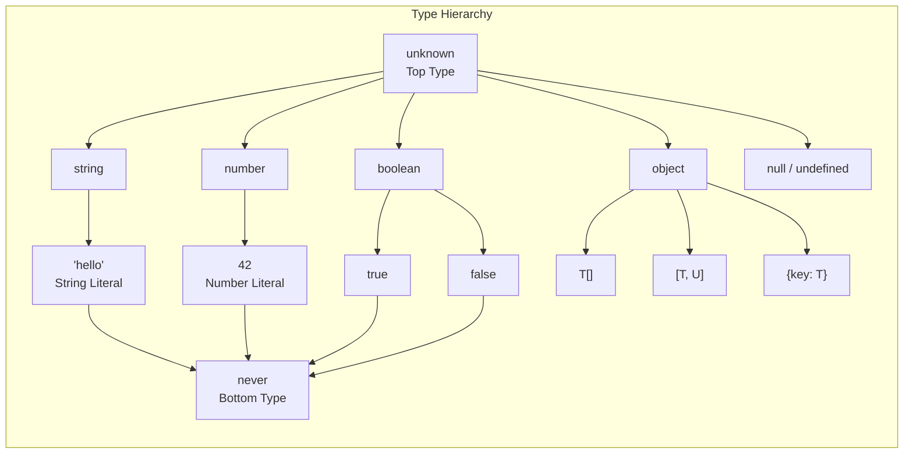

# TypeScript

## Quick Reference

- TypeScript is a statically typed superset of JavaScript that compiles to plain JavaScript
- All valid JavaScript is valid TypeScript; types are erased at compile time with zero runtime overhead
- Core primitives: `string`, `number`, `boolean`, `null`, `undefined`, `symbol`, `bigint`, `void`, `never`, `unknown`, `any`
- Use `interface` for object shapes that can be extended; use `type` for unions, intersections, and computed types
- Generics enable reusable type-safe abstractions: `function identity<T>(arg: T): T`
- Utility types transform existing types: `Partial<T>`, `Required<T>`, `Pick<T, K>`, `Omit<T, K>`, `Record<K, V>`
- Strict mode (`"strict": true` in tsconfig.json) enables all strict type-checking options simultaneously
- Declaration files (`.d.ts`) provide type information for JavaScript libraries without modifying source code
- TypeScript supports structural typing (duck typing) rather than nominal typing by default
- The `as const` assertion creates deeply readonly literal types from object and array expressions

## When to Use

TypeScript is the right choice for any JavaScript project that will grow beyond a few hundred lines or involve more than one developer. The type system catches entire categories of bugs at compile time that would otherwise surface as runtime errors in production: accessing properties on null values, passing arguments in the wrong order, misspelling object keys, and using values before they are initialized. For enterprise applications, TypeScript provides self-documenting code through type annotations that serve as living documentation, making onboarding faster and refactoring safer. Use TypeScript when building React, Angular, or Node.js applications where you need confidence that component props are correct, API responses match expected shapes, and state management flows are type-safe. TypeScript is particularly valuable in large codebases where the cost of a runtime bug is high, such as payment processing, healthcare systems, or financial applications. The investment in type annotations pays dividends through IDE autocompletion, automated refactoring support, and the ability to catch breaking changes when updating dependencies. Choose TypeScript over plain JavaScript when you want to enforce contracts between modules, when your team needs to maintain code they did not originally write, or when you are building a library that other developers will consume.

## Type System

TypeScript's type system is structural, meaning that type compatibility is determined by the shape of the data rather than explicit declarations or inheritance hierarchies. Two types are compatible if they have the same structure, regardless of their names or where they were defined. This is fundamentally different from nominal type systems in Java or C# where a class must explicitly implement an interface to be considered compatible.

The type system operates at compile time only. After compilation, all type annotations, interfaces, and type aliases are erased, producing plain JavaScript with no runtime type checks. This means TypeScript adds zero bytes to your production bundle and zero milliseconds to your runtime performance. The tradeoff is that type safety is only guaranteed for code that passes through the TypeScript compiler; data from external sources (API responses, user input, localStorage) must be validated at runtime using type guards or validation libraries like Zod.

TypeScript distinguishes between `unknown` and `any` as top types. The `any` type disables all type checking and should be avoided in production code. The `unknown` type is the type-safe counterpart: you can assign anything to `unknown`, but you cannot use it without first narrowing it through type guards, typeof checks, or assertion functions. The `never` type represents values that never occur, appearing as the return type of functions that always throw or have infinite loops, and as the result of exhaustive type narrowing.

Type narrowing is the process by which TypeScript refines a broad type to a more specific one within a code block. Control flow analysis tracks assignments, typeof checks, instanceof checks, equality comparisons, and discriminated union checks to automatically narrow types without explicit casts. Custom type guard functions (returning `value is Type`) extend this narrowing to domain-specific logic.

```typescript
// Structural typing demonstration
interface Printable {
  print(): void;
}

class Document {
  print() { console.log("Printing document"); }
}

class Receipt {
  print() { console.log("Printing receipt"); }
  email() { console.log("Emailing receipt"); }
}

// Both work because they have the required shape
function printItem(item: Printable): void {
  item.print();
}

printItem(new Document()); // OK - has print()
printItem(new Receipt());  // OK - has print() (extra methods are fine)

// Type narrowing with discriminated unions
type Shape =
  | { kind: "circle"; radius: number }
  | { kind: "rectangle"; width: number; height: number }
  | { kind: "triangle"; base: number; height: number };

function area(shape: Shape): number {
  switch (shape.kind) {
    case "circle":
      return Math.PI * shape.radius ** 2;
    case "rectangle":
      return shape.width * shape.height;
    case "triangle":
      return (shape.base * shape.height) / 2;
    default:
      // Exhaustiveness check: never type ensures all cases handled
      const _exhaustive: never = shape;
      return _exhaustive;
  }
}

// Custom type guard function
function isError(value: unknown): value is Error {
  return value instanceof Error;
}

function handleResult(result: unknown): string {
  if (isError(result)) {
    return result.message; // TypeScript knows result is Error here
  }
  if (typeof result === "string") {
    return result; // TypeScript knows result is string here
  }
  return String(result);
}
```

## Generics

Generics allow you to write functions, classes, and interfaces that work with any type while preserving type safety. Rather than using `any` which discards type information, generics capture the actual type used at each call site and propagate it through the function signature. This enables you to write a single implementation that is reusable across many types without sacrificing the compiler's ability to catch errors.

Generic constraints restrict the types that can be used with a generic parameter using the `extends` keyword. This allows you to access properties or methods on the generic type while still keeping it flexible. For example, `<T extends { length: number }>` ensures that T has a length property, allowing you to safely access `arg.length` within the function body. Constraints can reference other generic parameters, enabling patterns like `<K extends keyof T>` to ensure a key actually exists on an object type.

Generic inference is one of TypeScript's most powerful features. In most cases, you do not need to explicitly specify generic type arguments because the compiler infers them from the values you pass. When inference fails or produces a type that is too broad, you can provide explicit type arguments at the call site. Understanding when inference works and when it needs help is key to writing ergonomic generic APIs.

Default generic parameters provide fallback types when no argument is specified or inferred, similar to default function parameters. This is commonly used in library APIs where most users want a standard configuration but advanced users need customization. Generic defaults must follow the same ordering rules as function defaults: required parameters first, optional parameters last.

```typescript
// Generic function with constraints
function getProperty<T, K extends keyof T>(obj: T, key: K): T[K] {
  return obj[key];
}

const user = { name: "Alice", age: 30, email: "alice@example.com" };
const name = getProperty(user, "name");   // type: string
const age = getProperty(user, "age");     // type: number
// getProperty(user, "phone");            // Error: "phone" not in keyof user

// Generic class with default type parameter
class ApiResponse<T = unknown, E = Error> {
  constructor(
    public data: T | null,
    public error: E | null,
    public status: number
  ) {}

  isSuccess(): this is ApiResponse<T, never> & { data: T } {
    return this.status >= 200 && this.status < 300 && this.data !== null;
  }
}

// Generic utility function for type-safe event emitter
type EventMap = Record<string, unknown>;

class TypedEventEmitter<Events extends EventMap> {
  private listeners = new Map<keyof Events, Set<Function>>();

  on<K extends keyof Events>(event: K, handler: (payload: Events[K]) => void): void {
    if (!this.listeners.has(event)) {
      this.listeners.set(event, new Set());
    }
    this.listeners.get(event)!.add(handler);
  }

  emit<K extends keyof Events>(event: K, payload: Events[K]): void {
    this.listeners.get(event)?.forEach(handler => handler(payload));
  }
}

// Usage with full type safety
interface AppEvents {
  userLogin: { userId: string; timestamp: number };
  pageView: { path: string; referrer: string | null };
  error: { message: string; stack?: string };
}

const emitter = new TypedEventEmitter<AppEvents>();
emitter.on("userLogin", (payload) => {
  console.log(payload.userId);    // type-safe: string
  console.log(payload.timestamp); // type-safe: number
});
// emitter.emit("userLogin", { userId: 123 }); // Error: number not assignable to string
```

## Utility Types

TypeScript ships with a collection of built-in utility types that transform existing types into new ones without requiring you to redefine them from scratch. These utilities handle the most common type transformations: making properties optional, required, readonly, or picking subsets of properties. Understanding utility types is essential for writing DRY type definitions and building type-safe APIs that derive related types from a single source of truth.

`Partial<T>` makes all properties of T optional, which is useful for update operations where you only want to change some fields. `Required<T>` does the opposite, making all properties mandatory. `Readonly<T>` prevents reassignment of properties after construction. `Pick<T, K>` creates a type with only the specified keys from T, while `Omit<T, K>` creates a type with all keys except the specified ones. `Record<K, V>` constructs an object type with keys of type K and values of type V, useful for dictionaries and lookup tables.

`Extract<T, U>` and `Exclude<T, U>` operate on union types. Extract pulls out union members that are assignable to U, while Exclude removes them. `NonNullable<T>` removes null and undefined from a union. `ReturnType<T>` extracts the return type of a function type, and `Parameters<T>` extracts the parameter types as a tuple. `InstanceType<T>` extracts the instance type of a constructor function. These utilities compose together to build sophisticated type transformations from simple building blocks.

```typescript
// Practical utility type usage
interface User {
  id: string;
  name: string;
  email: string;
  role: "admin" | "user" | "moderator";
  createdAt: Date;
  updatedAt: Date;
}

// Update payload: all fields optional except id
type UserUpdate = Partial<Omit<User, "id" | "createdAt">> & { id: string };

// Creation payload: omit auto-generated fields
type CreateUser = Omit<User, "id" | "createdAt" | "updatedAt">;

// Public profile: only safe-to-expose fields
type PublicProfile = Pick<User, "id" | "name" | "role">;

// Role-based permissions lookup
type Permissions = Record<User["role"], string[]>;
const permissions: Permissions = {
  admin: ["read", "write", "delete", "manage-users"],
  user: ["read", "write"],
  moderator: ["read", "write", "delete"],
};

// Extract function return types for testing
async function fetchUsers(): Promise<User[]> {
  const response = await fetch("/api/users");
  return response.json();
}

type FetchUsersReturn = Awaited<ReturnType<typeof fetchUsers>>; // User[]

// NonNullable for strict null handling
type MaybeUser = User | null | undefined;
type DefiniteUser = NonNullable<MaybeUser>; // User
```

## Conditional Types

Conditional types enable type-level programming by selecting one of two types based on a condition, using syntax analogous to the ternary operator: `T extends U ? X : Y`. If T is assignable to U, the type resolves to X; otherwise it resolves to Y. This mechanism powers many of TypeScript's built-in utility types and enables library authors to create APIs that adapt their return types based on input types.

The `infer` keyword within conditional types introduces a type variable that TypeScript infers from the structure being matched. This is how you can extract types from complex structures: extracting the element type from an array, the return type from a function, the resolved type from a Promise, or the props type from a React component. The infer keyword only works within the extends clause of a conditional type and can appear multiple times to extract multiple type variables simultaneously.

Distributive conditional types are a special behavior that occurs when a conditional type is applied to a naked type parameter with a union type. The conditional type distributes over each member of the union individually, producing a union of the results. This is why `Exclude<"a" | "b" | "c", "a">` correctly produces `"b" | "c"` rather than checking the entire union at once. You can prevent distribution by wrapping the type parameter in a tuple: `[T] extends [U] ? X : Y`.

```typescript
// Conditional type with infer for type extraction
type UnwrapPromise<T> = T extends Promise<infer U> ? U : T;
type A = UnwrapPromise<Promise<string>>;  // string
type B = UnwrapPromise<number>;           // number

// Deep unwrap for nested promises
type DeepUnwrap<T> = T extends Promise<infer U> ? DeepUnwrap<U> : T;
type C = DeepUnwrap<Promise<Promise<boolean>>>; // boolean

// Extract array element type
type ElementOf<T> = T extends (infer E)[] ? E : never;
type D = ElementOf<string[]>;  // string
type E = ElementOf<number>;    // never

// Conditional types for API response handling
type ApiEndpoints = {
  "/users": { method: "GET"; response: User[] };
  "/users/:id": { method: "GET"; response: User };
  "/posts": { method: "POST"; response: Post; body: CreatePost };
};

type ResponseFor<Path extends keyof ApiEndpoints> = ApiEndpoints[Path]["response"];
type BodyFor<Path extends keyof ApiEndpoints> =
  ApiEndpoints[Path] extends { body: infer B } ? B : never;

// Distributive conditional type example
type ToArray<T> = T extends unknown ? T[] : never;
type F = ToArray<string | number>; // string[] | number[]

// Non-distributive version (wrapping in tuple)
type ToArrayNonDist<T> = [T] extends [unknown] ? T[] : never;
type G = ToArrayNonDist<string | number>; // (string | number)[]

// Practical: type-safe event handler registry
type EventHandler<T> = T extends { payload: infer P }
  ? (payload: P) => void
  : () => void;

interface Events {
  click: { payload: { x: number; y: number } };
  resize: { payload: { width: number; height: number } };
  close: {};
}

type ClickHandler = EventHandler<Events["click"]>;   // (payload: {x: number, y: number}) => void
type CloseHandler = EventHandler<Events["close"]>;   // () => void
```

## Mapped Types

Mapped types create new types by transforming each property of an existing type through a systematic rule. The syntax `{ [K in keyof T]: NewType }` iterates over every key in T and produces a new property for each one. This is how TypeScript implements `Partial`, `Required`, `Readonly`, and other built-in utilities internally. Mapped types can add or remove modifiers (`readonly`, `?`) using `+` and `-` prefixes, and can remap keys using the `as` clause introduced in TypeScript 4.1.

Key remapping with `as` allows you to filter, rename, or transform property keys during mapping. Combined with template literal types, you can generate getter/setter method names, prefix or suffix keys, or filter properties by their value type. This enables patterns like automatically generating event handler types from a state interface, or creating a type-safe ORM query builder that mirrors your database schema.

Template literal types (`${string}Suffix` or `${Prefix}${string}`) enable string manipulation at the type level. Combined with mapped types, they can generate method names, route patterns, or CSS class names that are checked at compile time. The built-in `Uppercase`, `Lowercase`, `Capitalize`, and `Uncapitalize` intrinsic types transform string literal types for common naming convention conversions.

```typescript
// Mapped type that makes all properties nullable
type Nullable<T> = { [K in keyof T]: T[K] | null };

// Mapped type with key remapping and template literals
type Getters<T> = {
  [K in keyof T as `get${Capitalize<string & K>}`]: () => T[K];
};

type Setters<T> = {
  [K in keyof T as `set${Capitalize<string & K>}`]: (value: T[K]) => void;
};

interface Config {
  host: string;
  port: number;
  debug: boolean;
}

type ConfigGetters = Getters<Config>;
// { getHost: () => string; getPort: () => number; getDebug: () => boolean }

type ConfigSetters = Setters<Config>;
// { setHost: (value: string) => void; setPort: (value: number) => void; ... }

// Filter properties by value type using key remapping
type OnlyStrings<T> = {
  [K in keyof T as T[K] extends string ? K : never]: T[K];
};

type StringProps = OnlyStrings<{ name: string; age: number; email: string }>;
// { name: string; email: string }

// Deep readonly mapped type (recursive)
type DeepReadonly<T> = {
  readonly [K in keyof T]: T[K] extends object
    ? T[K] extends Function
      ? T[K]
      : DeepReadonly<T[K]>
    : T[K];
};

// Practical: form validation schema derived from form data type
type ValidationRules<T> = {
  [K in keyof T]?: {
    required?: boolean;
    validate?: (value: T[K]) => string | null;
    transform?: (value: T[K]) => T[K];
  };
};

interface LoginForm {
  email: string;
  password: string;
  rememberMe: boolean;
}

const loginValidation: ValidationRules<LoginForm> = {
  email: {
    required: true,
    validate: (v) => v.includes("@") ? null : "Invalid email",
  },
  password: {
    required: true,
    validate: (v) => v.length >= 8 ? null : "Min 8 characters",
  },
};
```

## Declaration Files

Declaration files (`.d.ts`) provide type information for JavaScript code without modifying the source. They describe the shape of existing JavaScript libraries, global variables, and module exports so that TypeScript can type-check code that uses them. When you install `@types/react` or `@types/node`, you are installing declaration files that describe the React and Node.js APIs. Declaration files contain only type information and produce no JavaScript output when compiled.

The `declare` keyword introduces ambient declarations that tell TypeScript about values that exist at runtime but are not defined in TypeScript source. Use `declare module` to type third-party libraries that lack type definitions, `declare global` to extend the global scope with custom properties (like adding fields to `Window`), and `declare namespace` to describe legacy module patterns. Ambient declarations are assertions to the compiler; they are not verified against runtime behavior, so incorrect declarations can cause runtime errors that TypeScript cannot catch.

Module augmentation allows you to extend existing type declarations without modifying the original package. This is essential for plugins, middleware, and framework extensions that add properties to existing types. For example, Express middleware often adds properties to the `Request` object, and module augmentation lets you declare those additions in a type-safe way. The augmentation must be in a module (a file with import/export) and uses `declare module "package-name"` syntax.

TypeScript resolves declaration files through several strategies: looking for `.d.ts` files alongside `.js` files, checking the `types` or `typings` field in package.json, searching `@types/` packages in node_modules, and following `typeRoots` and `paths` configuration in tsconfig.json. Understanding this resolution order is important when troubleshooting "cannot find module" errors or when multiple type definitions conflict.

```typescript
// Custom declaration file for an untyped JavaScript library
// types/analytics.d.ts
declare module "legacy-analytics" {
  interface AnalyticsConfig {
    apiKey: string;
    endpoint: string;
    batchSize?: number;
    flushInterval?: number;
  }

  interface TrackEvent {
    name: string;
    properties?: Record<string, string | number | boolean>;
    timestamp?: Date;
  }

  export function initialize(config: AnalyticsConfig): void;
  export function track(event: TrackEvent): Promise<void>;
  export function identify(userId: string, traits?: Record<string, unknown>): void;
  export function flush(): Promise<void>;
}

// Global augmentation: adding custom properties to Window
declare global {
  interface Window {
    __APP_CONFIG__: {
      apiUrl: string;
      environment: "development" | "staging" | "production";
      featureFlags: Record<string, boolean>;
    };
  }
}

// Module augmentation: extending Express Request
import "express";

declare module "express" {
  interface Request {
    userId?: string;
    permissions?: string[];
    requestId: string;
  }
}

// Triple-slash directive for global type references
/// <reference types="vite/client" />

// Ambient namespace for legacy global libraries
declare namespace google.maps {
  class Map {
    constructor(element: HTMLElement, options: MapOptions);
    setCenter(latLng: LatLng): void;
    setZoom(zoom: number): void;
  }

  interface MapOptions {
    center: LatLng;
    zoom: number;
    mapTypeId?: string;
  }

  interface LatLng {
    lat: number;
    lng: number;
  }
}
```

## Architecture and Diagrams

```mermaid
graph TB
    subgraph "TypeScript Compilation Pipeline"
        TS[.ts / .tsx Source Files] --> PARSE[Parser: Source → AST]
        PARSE --> BIND[Binder: Symbols & Scopes]
        BIND --> CHECK[Type Checker: Inference & Validation]
        CHECK --> EMIT[Emitter: AST → JavaScript]
        EMIT --> JS[.js Output Files]
        EMIT --> DTS[.d.ts Declaration Files]
        EMIT --> MAP[.js.map Source Maps]
    end

    subgraph "Type Resolution"
        CHECK --> STRUCT[Structural Compatibility]
        CHECK --> NARROW[Control Flow Narrowing]
        CHECK --> INFER[Generic Inference]
        CHECK --> COND[Conditional Type Evaluation]
    end

    subgraph "Declaration Resolution"
        DTS --> TYPES[@types/ packages]
        DTS --> LOCAL[Local .d.ts files]
        DTS --> PKG[package.json types field]
        TYPES --> MERGE[Declaration Merging]
        LOCAL --> MERGE
        PKG --> MERGE
    end

    subgraph "Build Integration"
        JS --> BUNDLE[Bundler: Vite / Webpack / esbuild]
        MAP --> DEBUG[Source Map Debugging]
        BUNDLE --> PROD[Production Bundle]
    end
```



## Common Pitfalls

1. **Overusing `any` to silence errors**: When TypeScript reports a type error, casting to `any` makes the error disappear but removes all type safety for that value and everything derived from it. Use `unknown` with type guards instead, or fix the underlying type mismatch. The `any` type is contagious: once introduced, it silently disables checking for all downstream operations.

2. **Confusing interfaces and types for object shapes**: While both can describe object shapes, interfaces support declaration merging (multiple declarations combine) and extend syntax, while type aliases support unions, intersections, and mapped types. Use interfaces for public API contracts that consumers might extend, and type aliases for internal types, unions, and computed types.

3. **Ignoring strict null checks**: With `strictNullChecks` disabled, `null` and `undefined` are assignable to every type, hiding potential null reference errors. Always enable strict mode and handle nullable values explicitly with optional chaining (`?.`), nullish coalescing (`??`), or type guards.

4. **Type assertions instead of type guards**: Using `value as Type` tells the compiler to trust you without verification. If you are wrong, you get runtime errors that TypeScript cannot catch. Prefer type guards (`if (isType(value))`) that narrow types safely through runtime checks, reserving assertions for cases where you genuinely know more than the compiler.

5. **Not understanding structural vs nominal typing**: TypeScript uses structural typing, so two unrelated types with the same shape are interchangeable. This can cause bugs when you accidentally pass a `UserId` where a `PostId` is expected if both are just `string`. Use branded types (`type UserId = string & { __brand: "UserId" }`) when you need nominal-like behavior.

6. **Forgetting that generics distribute over unions**: When a conditional type `T extends U ? X : Y` receives a union for T, it distributes over each member. This is usually desired but can produce unexpected results. Wrap in a tuple `[T] extends [U]` to prevent distribution when you want to check the union as a whole.

## Real-World Use Cases

- **Type-safe API client generation**: Tools like OpenAPI TypeScript Codegen read API specifications and generate TypeScript interfaces for request bodies, response types, and path parameters. This ensures that frontend code stays synchronized with backend contracts, catching breaking changes at compile time rather than in production.

- **React component prop validation**: TypeScript replaces PropTypes with compile-time checking that is more thorough and has zero runtime cost. Generic components like `Table<T>` can enforce that column definitions reference actual properties of the data type, preventing typos and ensuring type-safe rendering.

- **State management with discriminated unions**: Redux actions modeled as discriminated unions (`{ type: "ADD_TODO"; payload: Todo } | { type: "REMOVE_TODO"; payload: string }`) enable exhaustive switch statements in reducers where the compiler verifies every action type is handled and payload types are correct for each case.

- **Database query builders**: Libraries like Prisma and Drizzle ORM use TypeScript's type system to generate query builders that mirror your database schema. Column names, join conditions, and where clauses are all type-checked, preventing SQL errors from typos or schema mismatches.

- **Configuration validation**: Using `as const` assertions with conditional types, you can build configuration objects where the compiler verifies that all required fields are present, values are within allowed ranges, and dependent fields are consistent with each other.

## Interview Questions

**Q: What is the difference between `unknown` and `any` in TypeScript?**
A: Both are top types that accept any value, but `any` disables all type checking on the value (you can access any property, call it as a function, assign it anywhere), while `unknown` requires you to narrow the type before using it. Use `unknown` for values from external sources where you need to validate the shape before proceeding safely.

**Q: Explain how conditional types work and give a practical example.**
A: Conditional types use the syntax `T extends U ? X : Y` to select a type based on whether T is assignable to U. Combined with `infer`, they can extract types from complex structures. A practical example is `Awaited<T>` which unwraps Promise types: `type Awaited<T> = T extends Promise<infer U> ? Awaited<U> : T`, recursively extracting the resolved value type from nested promises.

**Q: What is declaration merging and when would you use it?**
A: Declaration merging is TypeScript's behavior of combining multiple declarations with the same name into a single definition. Interfaces merge their members, namespaces merge with classes or functions, and modules can be augmented. Use it to extend third-party library types (adding properties to Express Request), to build up complex interfaces across multiple files, or to add methods to built-in types like Array.

**Q: How does TypeScript's structural typing differ from nominal typing, and what are the implications?**
A: Structural typing determines compatibility by shape rather than explicit declarations. If type A has all the properties required by type B, A is assignable to B regardless of their names or inheritance. This means two independently defined types with the same shape are interchangeable, which can be a source of bugs when you want distinct identity types (like UserId vs OrderId). Branded types or unique symbols provide nominal-like behavior when needed.

**Q: What are mapped types and how do they relate to utility types like Partial and Readonly?**
A: Mapped types iterate over the keys of a type using `{ [K in keyof T]: ... }` syntax to produce a new type with transformed properties. TypeScript's built-in `Partial<T>` is implemented as `{ [K in keyof T]?: T[K] }` (adding optional modifier), and `Readonly<T>` as `{ readonly [K in keyof T]: T[K] }`. You can create custom mapped types that filter keys, rename properties, or transform value types.

## Production Tips

- **Enable strict mode from day one**: Retrofitting strict mode onto an existing codebase is painful because it surfaces hundreds of errors at once. Start every project with `"strict": true` in tsconfig.json. This enables `strictNullChecks`, `noImplicitAny`, `strictFunctionTypes`, and other checks that catch real bugs.

- **Use project references for monorepos**: TypeScript project references (`"references"` in tsconfig.json) enable incremental compilation across packages in a monorepo. Each package compiles independently and caches its output, so changes to one package only recompile its dependents rather than the entire repository.

- **Prefer type inference over explicit annotations**: TypeScript's inference is powerful enough that most local variables, return types of simple functions, and generic type arguments do not need explicit annotations. Annotate function parameters, public API return types, and complex generic instantiations. Over-annotating creates maintenance burden and can mask inference issues.

- **Use `satisfies` for validated inference**: The `satisfies` operator (TypeScript 4.9+) validates that an expression matches a type without widening it. Unlike type annotations which widen literal types, `satisfies` preserves the narrow inferred type while still checking conformance: `const config = { port: 3000 } satisfies Config` keeps the literal type `3000` rather than widening to `number`.

- **Avoid enums in library code**: TypeScript enums generate runtime JavaScript objects and have quirks around reverse mappings and const enums. Prefer union types of string literals (`type Direction = "north" | "south" | "east" | "west"`) which are fully erased at compile time, tree-shakeable, and work better with discriminated unions.

## Related Topics

- [JavaScript](./javascript.md) - TypeScript is a superset of JavaScript; understanding ES6+ features, closures, and the event loop is prerequisite knowledge
- [React](./react.md) - TypeScript provides type-safe component props, hooks, and state management in React applications
- [Angular](./angular.md) - Angular is built with TypeScript and leverages decorators, generics, and strict typing throughout its framework

