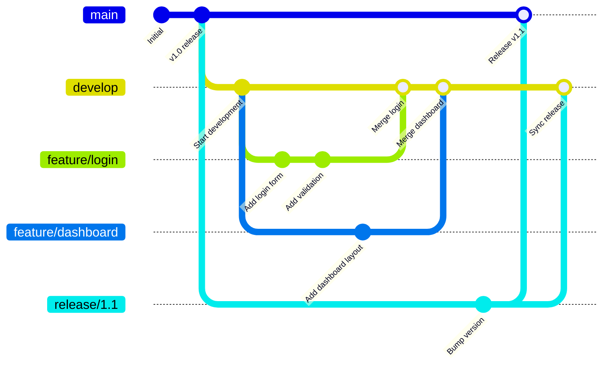
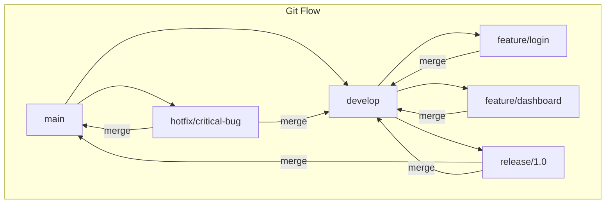
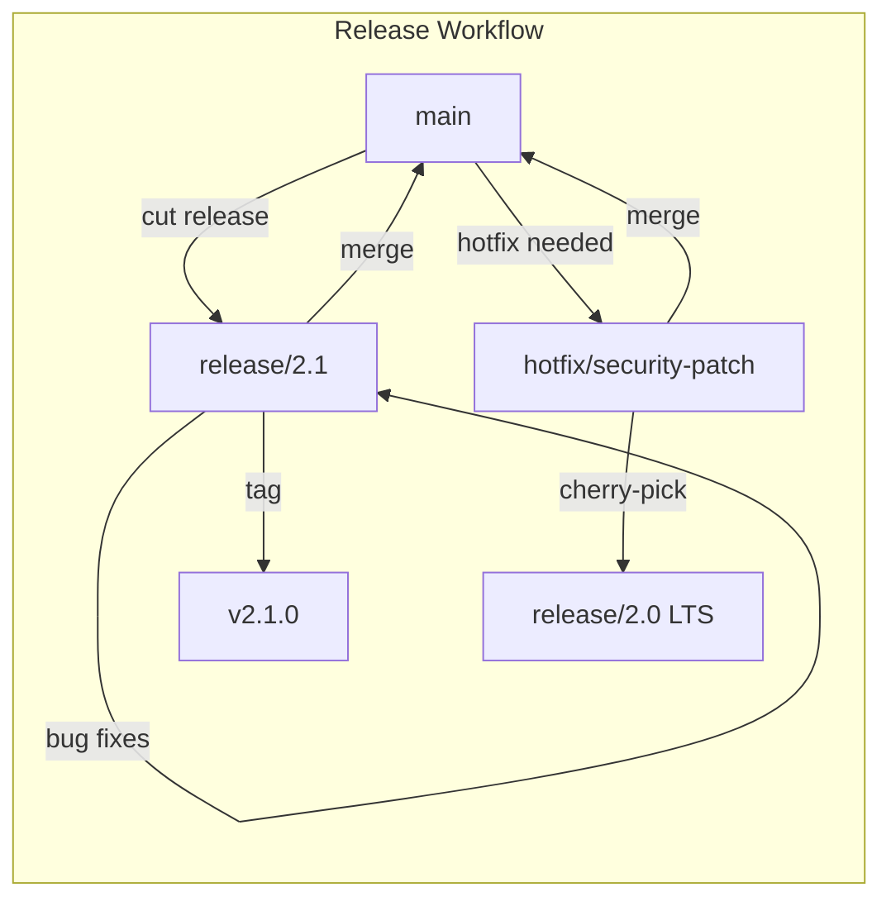
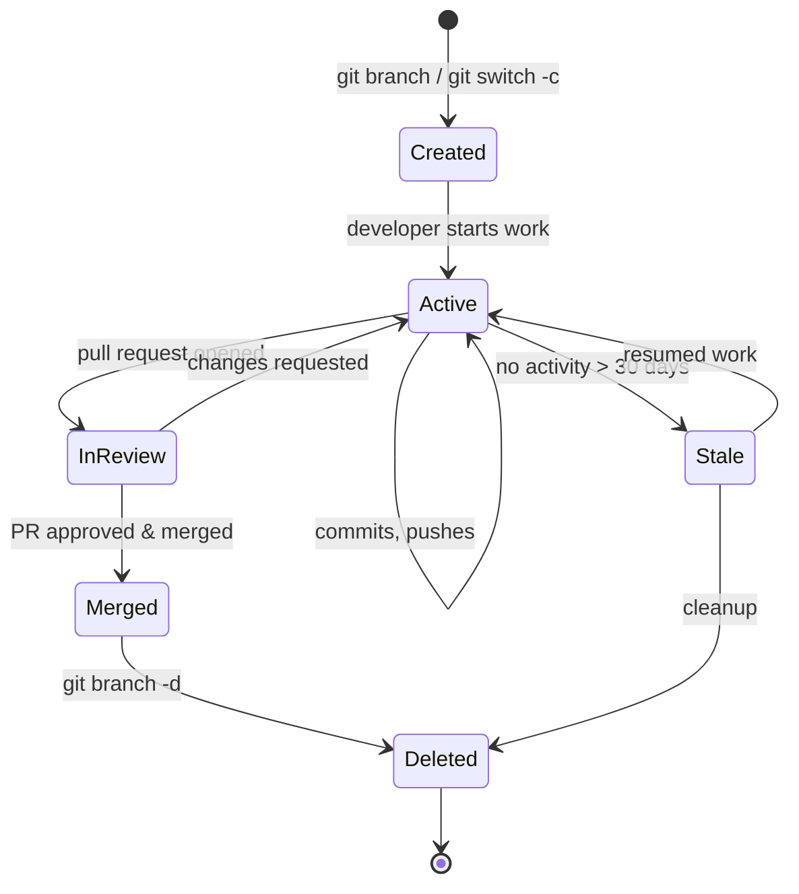

# Git Branching

## Quick Reference

- `git branch` — list all local branches
- `git branch <name>` — create a new branch at current commit
- `git switch <branch>` — switch to an existing branch
- `git switch -c <branch>` — create and switch to a new branch
- `git branch -d <branch>` — delete a merged branch
- `git branch -D <branch>` — force delete an unmerged branch
- `git merge <branch>` — merge branch into current branch
- `git rebase <branch>` — replay commits on top of another branch
- Branches are lightweight pointers to commits (just 41 bytes each)
- HEAD points to the current branch, which points to the latest commit
- Common naming conventions: `feature/`, `bugfix/`, `hotfix/`, `release/`

---

## When to Use

Branching is fundamental to every Git workflow and should be used whenever you start working on something new. Create a feature branch when implementing a new feature, a bugfix branch when addressing a reported issue, and a hotfix branch when patching a critical production problem. Branches isolate your work from the main codebase, allowing you to experiment freely without risking the stability of shared code. Use branches when collaborating with a team so that multiple developers can work in parallel without stepping on each other's changes. Branching is also essential for release management, where you maintain separate branches for different release versions. Even for solo projects, branching provides a clean way to context-switch between tasks. The only time you might skip branching is for trivial one-line fixes in a solo project, though even then a branch provides a safety net.

Additional branching scenarios in production environments:

- **Environment-specific branches**: Some teams maintain branches that map to deployment environments (e.g., `staging`, `production`). Merging to these branches triggers automated deployments, providing a Git-native deployment mechanism.
- **Experimentation and A/B testing**: Create branches for experimental features that may or may not ship. Feature flags combined with branches allow you to deploy experimental code to a subset of users without affecting the main release.
- **Vendor customization**: When maintaining a product with customer-specific customizations, branches can represent each customer's variant. Cherry-pick core improvements across all customer branches while keeping customizations isolated.
- **Long-term support (LTS)**: Open-source projects and enterprise software maintain LTS branches (e.g., `v2.x`, `v3.x`) that receive security patches and critical fixes long after the main development has moved forward.

---

## Code Examples

### Creating and Managing Branches

```bash
# List all local branches (current branch marked with *)
git branch

# List all branches including remote-tracking branches
git branch -a

# Create a new branch from current HEAD
git branch feature/user-authentication

# Switch to the new branch
git switch feature/user-authentication

# Create and switch in one command
git switch -c feature/payment-gateway

# Rename the current branch
git branch -m new-branch-name

# Delete a branch that has been merged
git branch -d feature/completed-work

# Force delete an unmerged branch (use with caution)
git branch -D feature/abandoned-experiment
```

### Merging Branches

```bash
# Switch to the target branch first
git switch main

# Merge feature branch into main (fast-forward if possible)
git merge feature/user-authentication

# Merge with explicit merge commit (preserves branch topology)
git merge --no-ff feature/user-authentication

# Abort a merge that has conflicts
git merge --abort

# Squash all commits from a branch into one (does not auto-commit)
git merge --squash feature/messy-history
git commit -m "Add user authentication feature"
```

### Rebasing

```bash
# Rebase current branch onto main (linear history)
git switch feature/my-work
git rebase main

# Interactive rebase to clean up last 5 commits
git rebase -i HEAD~5
# In the editor: pick, squash, reword, edit, drop

# Continue after resolving rebase conflicts
git rebase --continue

# Abort a rebase in progress
git rebase --abort
```

### Advanced Branch Operations

```bash
# Find the common ancestor of two branches
git merge-base main feature/login

# Show branches that contain a specific commit
git branch --contains abc1234

# Show branches that have been merged into main
git branch --merged main

# Show branches NOT yet merged into main
git branch --no-merged main

# Compare two branches (commits in feature not in main)
git log main..feature/login --oneline

# Compare two branches (commits in either but not both)
git log main...feature/login --oneline

# Create a branch from a specific commit or tag
git branch release/1.0 v1.0.0

# Track a remote branch locally
git switch --track origin/feature/remote-work
```

### Cherry-Picking Across Branches

```bash
# Apply a specific commit to current branch
git cherry-pick abc1234

# Cherry-pick without auto-committing
git cherry-pick --no-commit abc1234

# Cherry-pick a range of commits
git cherry-pick A..B

# Cherry-pick and record the original commit hash
git cherry-pick -x abc1234

# Abort a cherry-pick with conflicts
git cherry-pick --abort
```

---

## Branching Strategies



### Git Flow

Git Flow is a structured branching model designed for projects with scheduled releases. It uses long-lived branches (`main` and `develop`) alongside short-lived support branches. The `main` branch always reflects production-ready code, while `develop` is the integration branch for features. Feature branches are created from `develop` and merged back when complete. Release branches are cut from `develop` when preparing a release, allowing final bug fixes without blocking new feature development. Hotfix branches are created from `main` for critical production patches and merged back into both `main` and `develop`.



### GitHub Flow

GitHub Flow is a simpler model suited for continuous deployment. There is only one long-lived branch (`main`) which is always deployable. Developers create feature branches from `main`, open pull requests for review, and merge back to `main` after approval. Deployments happen directly from `main` after each merge. This model works well for web applications and SaaS products where you deploy frequently and do not maintain multiple release versions.

### Trunk-Based Development

Trunk-Based Development minimizes branch lifetime. Developers commit directly to `main` (the trunk) or use extremely short-lived branches (less than a day). Feature flags control the visibility of incomplete work in production. This approach reduces merge conflicts, encourages small incremental changes, and pairs well with continuous integration. It requires strong CI/CD pipelines and comprehensive automated testing to maintain stability.

### Comparing Branching Strategies

| Strategy | Branch Lifetime | Best For | CI/CD Requirement | Team Size |
| --- | --- | --- | --- | --- |
| Git Flow | Days to weeks | Scheduled releases, multiple versions | Moderate | Medium-Large |
| GitHub Flow | Hours to days | Continuous deployment, SaaS | High | Any |
| Trunk-Based | Minutes to hours | High-velocity teams, microservices | Very High | Any (with discipline) |
| Release Branching | Weeks (release only) | Mobile apps, packaged software | Moderate | Medium-Large |

The choice of branching strategy should be driven by your deployment frequency, team size, and product type. Teams deploying multiple times per day benefit from trunk-based development, while teams shipping quarterly releases may prefer Git Flow's structure.

### Rebase vs Merge: A Deep Dive

The rebase vs merge decision is one of the most debated topics in Git workflows. Understanding the mechanics and trade-offs is essential for making the right choice.

**Merge** creates a new commit (the merge commit) that has two parents, preserving the complete history of both branches. The branch topology is visible in `git log --graph`, making it clear when features were developed in parallel. Merge commits serve as documentation of when integration happened.

**Rebase** takes the commits from your feature branch and replays them one by one on top of the target branch, creating new commits with new hashes. The original commits are abandoned (though recoverable via reflog). The result is a perfectly linear history with no merge commits.

```bash
# Merge approach: preserves branch topology
git switch main
git merge --no-ff feature/login
# Result: A---B---C---M (merge commit)
#              \     /
#               D---E (feature commits preserved)

# Rebase approach: linear history
git switch feature/login
git rebase main
git switch main
git merge --ff-only feature/login
# Result: A---B---C---D'---E' (linear, no merge commit)
```

**When to use merge:**
- On shared/public branches (never rebase what others have pulled)
- When you want to preserve the exact history of parallel development
- For release branches where traceability is critical
- When the feature branch has been reviewed and you want to keep the review context

**When to use rebase:**
- On local feature branches before merging (cleaning up history)
- When you want a linear, readable history on main
- During `git pull --rebase` to avoid unnecessary merge commits
- When squashing work-in-progress commits before review

**The golden rule**: Never rebase commits that have been pushed to a shared branch. Rebase rewrites history (creates new commit hashes), which causes divergence for anyone who has pulled the original commits.

### Branch Protection Rules

Branch protection rules are server-side configurations that enforce quality gates before code can be merged. They are critical for production stability.

```yaml
# Example GitHub branch protection configuration (conceptual)
branch_protection:
  branch: main
  rules:
    require_pull_request:
      required_approving_reviews: 2
      dismiss_stale_reviews: true
      require_code_owner_reviews: true
      require_last_push_approval: true
    require_status_checks:
      strict: true  # branch must be up-to-date
      contexts:
        - "ci/build"
        - "ci/test"
        - "ci/lint"
        - "security/snyk"
    require_linear_history: true
    require_signed_commits: true
    restrict_pushes:
      allow_force_pushes: false
      allow_deletions: false
    require_conversation_resolution: true
```

Key protection rules and their purposes:
- **Required reviews**: Ensures human oversight before merging. Two reviewers catch more issues than one.
- **Dismiss stale reviews**: When new commits are pushed after approval, previous approvals are invalidated, requiring re-review.
- **Require up-to-date branches**: Prevents merging a branch that has not incorporated the latest main changes, avoiding integration issues.
- **Required status checks**: CI must pass before merging. Include build, test, lint, and security scans.
- **Linear history**: Forces squash or rebase merges, preventing merge commits for a cleaner history.
- **Signed commits**: Requires GPG-signed commits to verify author identity.
- **No force pushes**: Prevents history rewriting on protected branches.

### Release Branching and Hotfix Workflows



**Release branch workflow:**
1. Cut a release branch from `develop` or `main`: `git switch -c release/2.1 develop`
2. Only bug fixes and release preparation (version bumps, changelog) go on the release branch
3. New features continue on `develop` — they will ship in the next release
4. When ready, merge release branch to `main` and tag: `git tag -a v2.1.0`
5. Merge release branch back to `develop` to incorporate bug fixes

**Hotfix workflow:**
1. Create hotfix branch from `main` (production): `git switch -c hotfix/critical-fix main`
2. Fix the issue with minimal changes
3. Merge to `main` and tag a patch release: `git tag -a v2.0.1`
4. Merge to `develop` (and any active release branches) to propagate the fix
5. If maintaining LTS branches, cherry-pick the fix to each supported version

---

## Branch Lifecycle



---

## Common Pitfalls

- **Long-lived feature branches**: Branches that live for weeks or months diverge significantly from main, leading to painful merge conflicts. Keep branches short-lived (ideally 1-3 days) and merge frequently.
- **Rebasing shared branches**: Running `git rebase` on a branch that others have pulled rewrites commit history, causing duplicate commits and confusion. Only rebase local, unpushed commits.
- **Not updating feature branches**: Working on a feature branch without periodically merging or rebasing from main means you are building on stale code. Regularly sync with `git pull --rebase origin main`.
- **Deleting branches before merging**: Force-deleting a branch with `git branch -D` before its changes are merged elsewhere means those commits become unreachable (though recoverable via reflog temporarily).
- **Inconsistent naming conventions**: Without agreed-upon branch naming (e.g., `feature/`, `bugfix/`, `hotfix/`), repositories become cluttered and it is difficult to understand what each branch represents.
- **Merge commit pollution**: Using `git merge` without `--no-ff` on trivial branches creates unnecessary merge commits. Conversely, always fast-forwarding loses the context of feature branch boundaries. Choose a strategy and be consistent.

## Real-World Use Cases

### Enterprise Release Management

Large enterprises with compliance requirements often use a modified Git Flow where release branches undergo extensive QA cycles. A typical workflow: developers work on feature branches, merge to `develop` for integration testing, cut a `release/x.y.z` branch for UAT and compliance review, then merge to `main` for production deployment. Hotfix branches are created from `main` for critical patches and merged back into both `main` and `develop`. Branch protection rules enforce that only release managers can merge to `main`, and every merge requires sign-off from QA and security teams.

### Microservices with Independent Deployment

In microservice architectures, each service repository typically uses GitHub Flow or trunk-based development because services deploy independently. A team might have 20 microservices, each with its own repository and CI/CD pipeline. Feature branches are short-lived (hours, not days), PRs are small and focused, and merging to `main` triggers automatic deployment to staging. Production deployment happens via a separate promotion mechanism (tagging or environment branch merge). This approach maximizes deployment velocity while maintaining service independence.

### Open-Source Contribution Workflow

Open-source projects use a fork-based branching model. Contributors fork the repository, create feature branches on their fork, and submit PRs to the upstream repository. Maintainers review, request changes, and eventually merge. The contributor's workflow involves maintaining an `upstream` remote, regularly rebasing their branches onto `upstream/main`, and squashing commits before final review. This model scales to thousands of contributors without granting write access to the main repository.

---

## Interview Questions

**Q1: What is the difference between `git merge` and `git rebase`?**
`git merge` creates a new merge commit that combines two branch histories, preserving the complete topology of parallel development. `git rebase` replays your branch's commits on top of the target branch, creating a linear history without merge commits. Merge is safer for shared branches; rebase is preferred for cleaning up local feature branch history before merging.

**Q2: Explain fast-forward merge vs three-way merge.**
A fast-forward merge occurs when the target branch has no new commits since the feature branch was created — Git simply moves the branch pointer forward. A three-way merge is needed when both branches have diverged with new commits, requiring Git to create a merge commit that reconciles changes from both branches using their common ancestor as a base.

**Q3: What branching strategy would you recommend for a team practicing continuous deployment?**
GitHub Flow or Trunk-Based Development. Both keep the main branch always deployable. GitHub Flow uses short-lived feature branches with pull requests for review. Trunk-Based Development goes further by committing directly to main with feature flags. Both require strong CI/CD and automated testing. Git Flow is better suited for projects with scheduled releases.

**Q4: How do you resolve a situation where a feature branch is far behind main?**
First, fetch the latest main: `git fetch origin main`. Then either rebase your feature branch onto main (`git rebase origin/main`) for a clean linear history, or merge main into your feature branch (`git merge origin/main`) to preserve history. Resolve any conflicts, run tests, and force-push if you rebased (`git push --force-with-lease`).

**Q5: What is `git cherry-pick` and when would you use it?**
`git cherry-pick <commit-hash>` applies a specific commit from one branch onto your current branch without merging the entire branch. Use it when you need a specific bug fix from another branch, when you accidentally committed to the wrong branch, or when backporting a fix to a release branch.

**Q6: How do feature flags relate to branching strategies?**
Feature flags decouple deployment from release. With feature flags, incomplete code can be merged to main and deployed to production behind a flag (disabled for users). This enables trunk-based development where branches live for hours instead of weeks, dramatically reducing merge conflicts. The flag is enabled gradually (canary, percentage rollout, full) once the feature is complete. If issues arise, the flag is disabled instantly without a code rollback. This shifts the branching problem from Git to application configuration.

**Q7: What is `git merge --no-ff` and why would you enforce it?**
`--no-ff` (no fast-forward) forces Git to create a merge commit even when a fast-forward is possible. This preserves the fact that a set of commits was developed on a feature branch, making it easy to revert an entire feature by reverting the single merge commit. Many teams enforce `--no-ff` via branch protection rules because it maintains clear feature boundaries in the history graph. Without it, feature branch commits become indistinguishable from direct main commits after a fast-forward.

---

## Production Tips

- **Enforce branch protection rules**: Configure your Git platform to require pull request reviews, passing CI checks, and up-to-date branches before merging to main. This prevents accidental direct pushes and ensures code quality.
- **Automate stale branch cleanup**: Set up automation (GitHub Actions, GitLab schedules) to identify and notify owners of branches with no activity for 30+ days. Stale branches clutter the repository and indicate abandoned work.
- **Use merge queues for high-traffic repositories**: Platforms like GitHub offer merge queues that automatically rebase and test PRs in sequence, preventing broken builds from concurrent merges that individually pass CI but conflict together.
- **Tag releases from main after merge**: After merging a release branch, immediately tag the merge commit (`git tag -a v1.2.0 -m "Release 1.2.0"`). This creates an immutable reference point for deployments and rollbacks.
- **Monitor branch count as a health metric**: A repository with dozens of active branches may indicate process issues — work not being completed, PRs not being reviewed, or scope creep. Track branch count over time as a team health indicator.

---

## Related Topics

- [Git Commands](./commands.md) — complete reference for branching and merging commands
- [Pull Requests](./pull-requests.md) — code review workflows that depend on branching
- [Merge Conflicts](./merge-conflicts.md) — resolving conflicts that arise when merging branches
- [Local vs Remote](./local-vs-remote.md) — how branches sync between local and remote repositories
