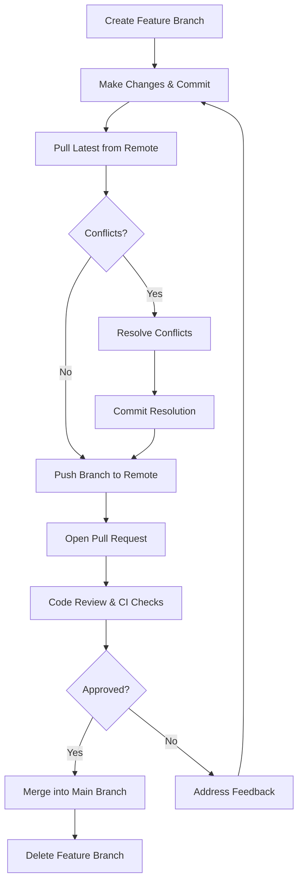

# Git Commands

## Quick Reference

- `git init` — initialize a new repository in the current directory
- `git clone <url>` — copy a remote repository to your local machine
- `git status` — show working directory and staging area state
- `git add <file>` — stage changes for the next commit
- `git commit -m "msg"` — create a snapshot of staged changes
- `git push origin <branch>` — upload local commits to remote
- `git pull origin <branch>` — download and merge remote changes
- `git branch` — list, create, or delete branches
- `git switch <branch>` — switch to an existing branch
- `git merge <branch>` — integrate changes from another branch
- `git stash` — temporarily save uncommitted changes
- `git log --oneline --graph` — visualize commit history
- `git revert <commit>` — safely undo a commit with a new commit
- `git reset --soft HEAD~1` — undo last commit, keep changes staged

---

## When to Use

Git commands form the foundation of every developer's daily workflow. You use setup commands (`git init`, `git clone`, `git config`) when starting a new project or joining an existing one. Staging and committing commands (`git add`, `git commit`) are used dozens of times per day as you make incremental progress. Collaboration commands (`git push`, `git pull`, `git fetch`) synchronize your work with teammates. Branching commands (`git branch`, `git switch`, `git merge`) enable parallel development of features. Inspection commands (`git log`, `git diff`, `git blame`) help you understand code history and debug issues. Recovery commands (`git stash`, `git reset`, `git revert`, `git restore`) save you when things go wrong. Understanding which command to use in each situation is critical for maintaining a clean, collaborative workflow without losing work or creating unnecessary conflicts.

Additional scenarios where command mastery is critical:

- **Incident response**: During production incidents, you need to quickly identify which commit introduced a regression using `git bisect`, revert the problematic change with `git revert`, and deploy the fix — all under time pressure.
- **Release management**: Cutting releases requires tagging (`git tag`), cherry-picking hotfixes across branches (`git cherry-pick`), and managing release branches with precise merge strategies.
- **Repository maintenance**: Large repositories need periodic cleanup with `git gc`, history rewriting with `git filter-branch` or `git filter-repo` for removing accidentally committed secrets, and `git prune` for cleaning up unreachable objects.
- **Code archaeology**: Understanding why code exists in its current form requires `git log -p --follow`, `git blame`, and `git log -S "search term"` (pickaxe) to trace the evolution of specific code patterns across renames and refactors.

---

## Code Examples

### Setup and Configuration

```bash
# Initialize a new Git repo
git init

# Clone a remote repo locally
git clone <url>

# Set your Git username (global)
git config --global user.name "Your Name"

# Set your Git email (global)
git config --global user.email "you@example.com"

# Set default branch name for new repos
git config --global init.defaultBranch main

# Enable colored output
git config --global color.ui auto

# Set VS Code as default editor
git config --global core.editor "code --wait"
```

> [!TIP]
> Always configure username and email before your first commit. These are baked into every commit object.

### Checking Status and Viewing Changes

```bash
# See untracked, staged, and modified files
git status

# Short-format status (more compact)
git status -s

# View unstaged changes (working dir vs staging)
git diff

# View staged changes (staging vs last commit)
git diff --staged

# View changes between two branches
git diff main..feature/login

# View changes in a specific file
git diff -- src/auth.js
```

> [!NOTE]
> Run `git status` frequently. It tells you exactly what state your working directory is in and what actions are available.

### Staging and Committing

```bash
# Stage a specific file
git add <file>

# Stage all changes in current directory
git add .

# Stage only parts of a file interactively
git add -p <file>

# Commit staged changes with a message
git commit -m "Add user login validation"

# Stage tracked files and commit in one step
git commit -am "Fix null pointer in order service"

# Amend the last commit (message or content)
git commit --amend -m "Updated commit message"

# Create an empty commit (useful for triggering CI)
git commit --allow-empty -m "Trigger pipeline rebuild"
```

> [!TIP]
> Write commit messages in imperative mood: "Add feature" not "Added feature". Follow the pattern: short summary (50 chars), blank line, detailed body if needed.

### Branching and Switching

```bash
# List all local branches
git branch

# List all branches including remote
git branch -a

# Create a new branch
git branch <branch-name>

# Switch to an existing branch
git switch <branch>

# Create and switch to a new branch
git switch -c <branch-name>

# Delete a fully merged branch
git branch -d <branch>

# Force delete an unmerged branch
git branch -D <branch>

# Rename current branch
git branch -m <new-name>
```

> [!NOTE]
> Use descriptive branch names: `feature/user-auth`, `bugfix/cart-total`, `hotfix/security-patch`.

### Collaborating with Remote

```bash
# List remote repositories
git remote -v

# Add a remote
git remote add origin <url>

# Pull latest changes from remote branch
git pull origin <branch>

# Pull with rebase instead of merge
git pull --rebase origin main

# Push local branch to remote
git push origin <branch>

# First-time push to set upstream tracking
git push -u origin <branch>

# Fetch all remote changes without merging
git fetch --all

# Delete a remote branch
git push origin --delete <branch>
```

> [!WARNING]
> Always pull before pushing to avoid rejected pushes and unnecessary merge conflicts.

### Merging and Rebasing

```bash
# Merge a branch into current branch
git merge <branch>

# Merge with no-fast-forward (preserves branch history)
git merge --no-ff <branch>

# Abort a merge in progress
git merge --abort

# Rebase current branch onto another
git rebase <branch>

# Interactive rebase to edit last n commits
git rebase -i HEAD~<n>

# Continue rebase after resolving conflicts
git rebase --continue

# Abort a rebase in progress
git rebase --abort
```

> [!WARNING]
> Never rebase commits that have been pushed to a shared branch. Rebase rewrites history and will cause conflicts for other developers.

### Undoing Mistakes

```bash
# Discard changes in a file (restore from staging)
git restore <file>

# Unstage a file (keep changes in working dir)
git restore --staged <file>

# Undo last commit, keep changes staged
git reset --soft HEAD~1

# Undo last commit, keep changes unstaged
git reset --mixed HEAD~1

# Undo last commit and discard all changes (DANGEROUS)
git reset --hard HEAD~1

# Create a new commit that undoes a previous commit (safe)
git revert <commit-hash>

# Revert a merge commit (specify parent)
git revert -m 1 <merge-commit-hash>
```

> [!TIP]
> Prefer `git revert` over `git reset` on shared branches. Revert creates a new commit and preserves history for collaborators.

### Stashing (Temporary Storage)

```bash
# Save uncommitted changes to stash
git stash

# Stash with a descriptive message
git stash push -m "WIP: refactoring auth module"

# List all stashes
git stash list

# Apply most recent stash and remove it
git stash pop

# Apply a specific stash without removing
git stash apply stash@{2}

# Drop a specific stash
git stash drop stash@{0}

# Clear all stashes
git stash clear
```

> [!NOTE]
> Stash is perfect for switching branches quickly without committing half-finished work. Remember to pop your stash when you return.

### Inspecting and Debugging

```bash
# View commit history
git log

# Compact one-line history with graph
git log --oneline --graph --decorate --all

# Show commits that modified a specific file
git log --follow -- src/utils.js

# Show details of a specific commit
git show <commit-hash>

# Find who changed each line in a file
git blame <file>

# Binary search for a bug-introducing commit
git bisect start
git bisect bad          # current commit is broken
git bisect good v1.0.0  # this tag was working
# Git checks out middle commit; test and mark good/bad
git bisect reset        # when done
```

### Advanced Operations

```bash
# Cherry-pick a specific commit onto current branch
git cherry-pick <commit-hash>

# Cherry-pick without committing (stage changes only)
git cherry-pick --no-commit <commit-hash>

# View the reflog (local history of HEAD changes)
git reflog

# Recover a deleted branch using reflog
git reflog | grep "feature/lost-branch"
git switch -c feature/recovered <commit-hash>

# Clean untracked files (dry run first)
git clean -n    # show what would be deleted
git clean -fd   # actually delete untracked files and directories

# Create a patch file from commits
git format-patch -3    # last 3 commits as patch files

# Apply a patch
git apply fix.patch

# Archive the repository at a specific point
git archive --format=tar.gz --prefix=project-v1.0/ v1.0 > release.tar.gz
```

### Tagging and Releases

```bash
# Create a lightweight tag
git tag v1.0.0

# Create an annotated tag (recommended for releases)
git tag -a v1.0.0 -m "Release version 1.0.0"

# Tag a specific commit (not HEAD)
git tag -a v0.9.0 <commit-hash> -m "Retroactive tag for beta"

# List all tags
git tag -l

# List tags matching a pattern
git tag -l "v1.*"

# Push a specific tag to remote
git push origin v1.0.0

# Push all tags to remote
git push --tags

# Delete a local tag
git tag -d v1.0.0

# Delete a remote tag
git push origin --delete v1.0.0
```

### Worktrees for Parallel Development

```bash
# Add a new worktree for a different branch
git worktree add ../hotfix-dir hotfix/critical-bug

# List all worktrees
git worktree list

# Remove a worktree after you're done
git worktree remove ../hotfix-dir

# Prune stale worktree references
git worktree prune
```

### Interactive Staging (Partial Commits)

```bash
# Stage specific hunks within a file interactively
git add -p src/auth.js
# Git shows each change hunk and asks:
# Stage this hunk [y,n,q,a,d,s,e,?]?
# y = stage this hunk
# n = skip this hunk
# s = split into smaller hunks
# e = manually edit the hunk
# q = quit (don't stage remaining hunks)

# Interactive staging with full menu
git add -i
# Shows: staged/unstaged status, then menu:
# 1: status  2: update  3: revert  4: add untracked
# 5: patch   6: diff    7: quit    8: help

# Stage only deleted files
git add -u  # stages modifications and deletions, not new files

# Interactively unstage hunks
git reset -p
```

### Command Composition and Aliases

```bash
# Set up useful Git aliases
git config --global alias.st "status -sb"
git config --global alias.co "checkout"
git config --global alias.br "branch"
git config --global alias.ci "commit"
git config --global alias.unstage "reset HEAD --"
git config --global alias.last "log -1 HEAD"
git config --global alias.visual "log --oneline --graph --decorate --all"

# Complex aliases with shell commands
git config --global alias.find '!git log --all --oneline | grep'
git config --global alias.aliases "config --get-regexp ^alias\\."
git config --global alias.contributors "shortlog -sn --no-merges"

# Show files changed in last commit
git config --global alias.changed "diff --name-only HEAD~1"

# Undo last commit (keep changes)
git config --global alias.undo "reset --soft HEAD~1"

# Show branch age and last commit
git config --global alias.recent "for-each-ref --sort=-committerdate refs/heads/ --format='%(committerdate:short) %(refname:short)'"

# Delete all merged branches except main/develop
git config --global alias.cleanup '!git branch --merged | grep -v "\\*\\|main\\|develop" | xargs -n 1 git branch -d'
```

### Git Grep and Log Search

```bash
# Search for a pattern in tracked files (faster than system grep)
git grep "TODO" -- '*.ts'

# Search with line numbers and context
git grep -n -C 3 "deprecated"

# Search across all branches
git grep "security_fix" $(git branch -r --format='%(refname:short)')

# Search commit messages
git log --grep="JIRA-1234" --oneline

# Search for when a string was added/removed (pickaxe)
git log -S "calculateTotal" --oneline

# Search for regex pattern changes
git log -G "function\s+auth" --oneline

# Find commits that changed a specific function
git log -L :functionName:src/utils.js
```

### Submodules and Subtrees

```bash
# Add a submodule
git submodule add https://github.com/lib/dependency.git vendor/dependency

# Initialize submodules after cloning
git submodule update --init --recursive

# Update all submodules to latest
git submodule update --remote

# Remove a submodule
git submodule deinit vendor/dependency
git rm vendor/dependency
rm -rf .git/modules/vendor/dependency

# Subtree alternative (no .gitmodules file needed)
git subtree add --prefix=vendor/lib https://github.com/lib/repo.git main --squash

# Update a subtree
git subtree pull --prefix=vendor/lib https://github.com/lib/repo.git main --squash
```

---

## Workflow Diagram



---

## Common Pitfalls

- **Using `git add .` without checking status first**: This stages everything including temporary files, debug logs, or sensitive data. Always run `git status` before staging, or use `git add -p` for selective staging.
- **Force pushing to shared branches**: Running `git push --force` on a branch others are working on rewrites remote history and causes data loss for collaborators. Use `--force-with-lease` if you must force push, as it fails if someone else has pushed.
- **Committing to the wrong branch**: Making commits on `main` when you meant to work on a feature branch. Fix with `git reset --soft HEAD~1` then `git switch -c feature-branch` and commit there.
- **Losing work with `git reset --hard`**: This permanently discards uncommitted changes. If you accidentally run it, `git reflog` may help recover lost commits, but unstaged changes are gone forever.
- **Not setting upstream tracking**: Forgetting `-u` on first push means `git push` and `git pull` without arguments won't work. Use `git push -u origin branch-name` on first push.
- **Ignoring merge conflicts**: Accepting all "ours" or "theirs" without understanding the changes leads to bugs. Always review conflicting code carefully and test after resolution.

## Real-World Use Cases

Git commands are used differently depending on the team's workflow and the stage of development. During feature development, a developer typically uses `git switch -c`, `git add -p`, `git commit`, and `git push` in a tight loop. During code review, reviewers use `git fetch`, `gh pr checkout`, `git diff`, and `git log` to understand proposed changes. During incident response, on-call engineers use `git log --since`, `git bisect`, `git revert`, and `git push` to quickly identify and roll back problematic changes. Release engineers use `git tag`, `git cherry-pick`, and `git merge --no-ff` to manage release branches and backport fixes.

### CI/CD Pipeline Integration

In continuous integration pipelines, Git commands are used programmatically. A typical pipeline starts with `git clone --depth 1` for fast checkout, uses `git diff --name-only HEAD~1` to determine which files changed (for selective testing), runs `git describe --tags` to generate version numbers, and ends with `git tag` and `git push --tags` for release automation. Advanced pipelines use `git log --format` to generate changelogs and `git shortlog -sn` to attribute changes for release notes.

### Monorepo Workflows

In monorepo environments, teams rely heavily on `git sparse-checkout` to work with subsets of the repository, `git log -- path/to/service` to view service-specific history, and `git diff --name-only` combined with build system integration to determine which services need rebuilding. Commands like `git subtree` or `git submodule` manage dependencies between components within the monorepo.

---

## Interview Questions

**Q1: What is the difference between `git merge` and `git rebase`?**
Both integrate changes from one branch into another. `git merge` creates a merge commit preserving both branch histories as parallel lines. `git rebase` replays commits from your branch on top of the target branch, creating a linear history. Merge is safer for shared branches; rebase produces cleaner history for local feature branches.

**Q2: Explain the difference between `git fetch` and `git pull`.**
`git fetch` downloads new commits and references from the remote without modifying your working directory or current branch. `git pull` is `git fetch` followed by `git merge` (or `git rebase` with `--rebase`), automatically integrating remote changes into your current branch.

**Q3: How would you undo the last commit without losing changes?**
Use `git reset --soft HEAD~1` to move the branch pointer back one commit while keeping all changes staged. Use `git reset --mixed HEAD~1` to unstage the changes but keep them in the working directory. For shared branches, use `git revert HEAD` to create a new commit that undoes the changes.

**Q4: What is `git bisect` and when would you use it?**
`git bisect` performs a binary search through commit history to find the exact commit that introduced a bug. You mark a known good commit and a known bad commit, then Git checks out the midpoint for you to test. This reduces the search space logarithmically, making it efficient even across thousands of commits.

**Q5: What is the Git reflog and how can it save you?**
The reflog records every change to HEAD and branch tips locally, including resets, rebases, and branch deletions. If you accidentally lose commits through `git reset --hard` or delete a branch, you can find the lost commit hash in `git reflog` and recover it with `git checkout` or `git cherry-pick`.

**Q6: What is the difference between `git reset`, `git restore`, and `git revert`?**
`git reset` moves the branch pointer backward, potentially discarding commits (dangerous on shared branches). `git restore` discards changes in the working directory or unstages files without affecting commits. `git revert` creates a new commit that undoes a previous commit's changes, preserving history. In production, prefer `revert` for shared branches, `restore` for local file changes, and `reset` only for local unpushed commits.

**Q7: How would you use `git cherry-pick` in a release workflow?**
`git cherry-pick` applies a specific commit from one branch to another. In release workflows, you cherry-pick critical bug fixes from the development branch onto a release branch without merging all development work. Use `git cherry-pick -x <hash>` to include the original commit reference in the message for traceability. For multiple commits, use `git cherry-pick A..B` to pick a range.

**Q8: Explain `git stash` internals and advanced usage.**
`git stash` creates a special commit that stores your working directory and staging area state, then resets your working directory to HEAD. Stashes are stored as a stack in `.git/refs/stash`. Advanced usage includes `git stash push -p` for partial stashing (selecting specific hunks), `git stash branch <name>` to create a branch from a stash (useful when the stash conflicts with current state), and `git stash push --include-untracked` to also stash new files.

---

## Production Tips

- **Use `git pull --rebase` as default**: Configure `git config --global pull.rebase true` to avoid unnecessary merge commits when pulling. This keeps history linear and easier to read in production repositories.
- **Leverage `git bisect` for production bug hunting**: When a regression appears in production, use bisect with an automated test script (`git bisect run ./test.sh`) to pinpoint the exact commit that introduced the issue in minutes rather than hours.
- **Set up Git hooks for quality gates**: Use pre-commit hooks to run linters and formatters, pre-push hooks to run tests, and commit-msg hooks to enforce conventional commit format. This catches issues before they reach the remote.
- **Use `git log --since` for incident investigation**: When debugging production issues, `git log --since="2 hours ago" --oneline` quickly shows what changed recently, helping correlate deployments with incidents.
- **Configure credential caching for CI/CD**: Use `git config credential.helper cache` or platform-specific credential managers to avoid storing plaintext credentials in CI pipelines while maintaining automated push access.
- **Use `git diff --stat` in deployment scripts**: Before deploying, run `git diff --stat HEAD~1` to generate a human-readable summary of what changed. Include this in deployment notifications (Slack, PagerDuty) so the team knows what went out with each release.
- **Automate changelog generation from commits**: With conventional commit messages (`feat:`, `fix:`, `chore:`), tools like `git log --format` combined with scripts can auto-generate changelogs. Use `git log --format="%s" v1.0.0..v1.1.0 | grep "^feat:"` to extract features for release notes.

---

## Related Topics

- [What is Git](./what-is-git.md) — foundational concepts and Git's object model
- [Git Branching](./branching.md) — branching strategies and workflows
- [Merge Conflicts](./merge-conflicts.md) — resolving conflicts that arise from concurrent changes
- [Pull Requests](./pull-requests.md) — code review workflows using Git branches
