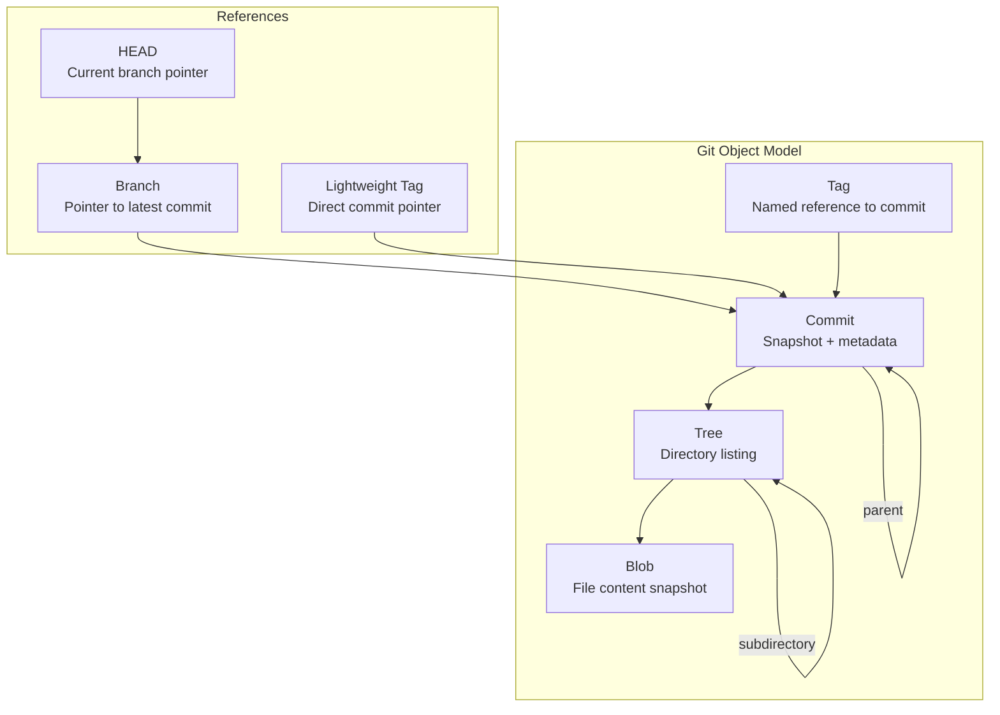
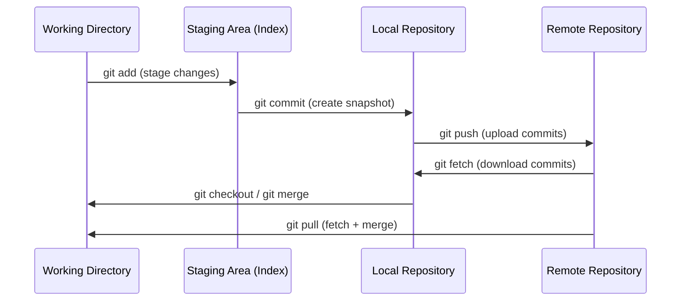

# What is Git

## Quick Reference

- Git is a distributed version control system where every developer has a full copy of the repository history
- Three main areas: Working Directory, Staging Area (Index), and Local Repository
- Core operations: `git init`, `git clone`, `git add`, `git commit`, `git push`, `git pull`
- Git tracks content by SHA-1 hashes, making every commit uniquely identifiable
- Branching is lightweight — creating a branch is just creating a pointer to a commit (41 bytes)
- Git stores snapshots of files, not diffs (unlike older VCS tools like SVN)
- The `.git/` directory contains the entire repository database, hooks, and configuration
- Git uses a directed acyclic graph (DAG) to model commit history — each commit points to its parent(s)
- Packfiles compress objects for efficient storage and network transfer using delta compression
- The reflog records every change to HEAD locally, providing a safety net for recovering lost commits

---

## When to Use

Git is the standard version control system for virtually all modern software development. Use Git when you need to track changes to any text-based files, collaborate with other developers, or maintain a history of your project's evolution. Git excels in scenarios where multiple developers work on the same codebase simultaneously, where you need to experiment with features in isolation, or where you need to maintain multiple release versions of software. Even for solo projects, Git provides invaluable safety nets through its commit history, allowing you to revert mistakes and understand why changes were made. Git is appropriate for any project larger than a throwaway script, including documentation repositories, infrastructure-as-code, configuration management, and data science notebooks. The only scenarios where Git may not be ideal are for large binary files (though Git LFS addresses this) or for extremely large monorepos where specialized tools like Perforce may be preferred.

Additional scenarios where Git is essential:

- **Regulatory compliance and auditing**: In industries like finance and healthcare, Git provides an immutable audit trail of every change, who made it, and when. Combined with signed commits, this satisfies SOX, HIPAA, and SOC 2 requirements for change management.
- **Infrastructure as Code (IaC)**: Terraform, CloudFormation, and Kubernetes manifests stored in Git enable GitOps workflows where the repository is the single source of truth for infrastructure state. Changes are proposed via PRs, reviewed, and applied automatically.
- **Disaster recovery**: Because every clone is a full backup, Git provides natural disaster recovery. If your hosting platform goes down, any developer's local clone can restore the entire project history.
- **Experimentation and prototyping**: Git branches let you explore multiple approaches to a problem simultaneously without risk. If an experiment fails, you simply delete the branch with zero impact on the main codebase.

---

## Code Examples

### Initializing a Repository

```bash
# Create a new Git repository in the current directory
git init

# This creates a .git/ directory with the following structure:
# .git/
#   HEAD          - Points to current branch
#   config        - Repository-specific configuration
#   objects/      - Object database (commits, trees, blobs)
#   refs/         - Branch and tag pointers
```

### Cloning and Basic Workflow

```bash
# Clone a remote repository to your local machine
git clone https://github.com/user/repository.git

# Check the status of your working directory
git status

# Stage specific files for commit
git add src/feature.js tests/feature.test.js

# Stage all changes (new, modified, deleted)
git add .

# Commit staged changes with a descriptive message
git commit -m "Add user authentication feature with JWT tokens"

# Push commits to the remote repository
git push origin main

# Pull latest changes from remote and merge into current branch
git pull origin main
```

### Viewing History

```bash
# View commit log with graph visualization
git log --oneline --graph --decorate --all

# Show details of a specific commit
git show abc1234

# See who last modified each line of a file
git blame src/app.js

# Search commit messages for a keyword
git log --grep="bugfix"
```

### Inspecting Git Internals

```bash
# View the type of a Git object
git cat-file -t abc1234

# View the content of a Git object
git cat-file -p abc1234

# List all objects in the repository
git count-objects -v

# Show the tree (directory snapshot) for a commit
git ls-tree HEAD

# Show the tree recursively (all files in the commit)
git ls-tree -r HEAD --name-only

# Verify repository integrity
git fsck --full
```

### Plumbing Commands (Git Internals)

```bash
# Hash a file and store it as a blob object
echo "Hello, Git" | git hash-object -w --stdin
# Returns: 8d0e412...

# Read back the blob content
git cat-file -p 8d0e412

# Create a tree object from the current index
git write-tree

# Create a commit object manually
echo "Initial commit" | git commit-tree <tree-hash>

# Update a branch reference manually
git update-ref refs/heads/main <commit-hash>

# Show the symbolic ref that HEAD points to
git symbolic-ref HEAD
# Returns: refs/heads/main

# List all refs in the repository
git for-each-ref --format='%(refname) %(objectname:short)' refs/

# Verify connectivity and validity of objects
git fsck --full --no-dangling

# Show object type and size without content
git cat-file -t abc1234   # type: commit, tree, blob, or tag
git cat-file -s abc1234   # size in bytes

# Pack loose objects into a packfile
git repack -a -d

# Show packfile statistics
git verify-pack -v .git/objects/pack/*.idx | tail -5

# Dump the index (staging area) contents
git ls-files --stage
```

### Configuring Git for a Team

```bash
# Set up commit message template
git config --global commit.template ~/.gitmessage

# Enable GPG signing for all commits
git config --global commit.gpgsign true

# Set default merge strategy
git config --global pull.rebase true

# Configure diff algorithm for better diffs
git config --global diff.algorithm histogram

# Set up credential caching (15 min default)
git config --global credential.helper cache

# View all configuration with source
git config --list --show-origin
```

### Understanding Object Relationships

```bash
# Trace the full object chain from a commit
COMMIT=$(git rev-parse HEAD)
echo "Commit: $COMMIT"

# Get the tree from the commit
TREE=$(git cat-file -p $COMMIT | grep ^tree | cut -d' ' -f2)
echo "Tree: $TREE"

# List the tree contents (blobs and subtrees)
git ls-tree $TREE

# Get a specific blob from the tree
git ls-tree $TREE -- src/app.js
# 100644 blob a1b2c3d4... src/app.js

# Read the blob content
git cat-file -p a1b2c3d4

# Count objects by type
git count-objects -v
# count: 42 (loose objects)
# packs: 1
# size-pack: 1234 (KB)

# Show which packfile contains an object
git verify-pack -v .git/objects/pack/*.idx | grep abc1234
```

---

## Architecture and Data Model



Git uses a content-addressable filesystem built on four object types. A **blob** stores the contents of a single file. A **tree** represents a directory, mapping filenames to blobs or other trees. A **commit** points to a tree (the project snapshot) and contains metadata like author, timestamp, message, and parent commit references. A **tag** is a named pointer to a specific commit, typically used for release versions. Every object is identified by its SHA-1 hash, which means identical content always produces the same hash, enabling efficient deduplication and integrity verification.

### The Directed Acyclic Graph (DAG) Model

Git's commit history forms a **Directed Acyclic Graph** (DAG). Each commit is a node that points to one or more parent commits (directed edges), and cycles are impossible because a commit cannot be its own ancestor (acyclic). This structure enables Git to efficiently determine common ancestors for merging, compute reachability for garbage collection, and traverse history in topological order. A regular commit has one parent, a merge commit has two (or more for octopus merges), and the initial commit has zero parents. The DAG model is what makes operations like `git log --graph`, `git merge-base`, and `git rebase` possible — they all traverse this graph structure.

Understanding the DAG is critical for advanced Git operations. When you run `git log main..feature`, Git finds all commits reachable from `feature` that are not reachable from `main` — this is a graph traversal operation. When Git performs garbage collection, it starts from all refs (branches, tags, HEAD) and marks all reachable objects; unreachable objects are candidates for deletion. The reflog temporarily prevents objects from being garbage collected by maintaining additional reachability roots.

### Git Internals: Objects, Refs, and Packfiles

Under the hood, Git's `.git/` directory contains several critical components:

**Objects** (`.git/objects/`): Every piece of content Git stores is an object identified by its SHA-1 hash. Objects are initially stored as individual files (loose objects) in a directory structure based on the first two characters of their hash. For example, a commit with hash `abc123...` is stored at `.git/objects/ab/c123...`. Objects are zlib-compressed.

**Refs** (`.git/refs/`): References are human-readable names that point to commit hashes. Branches live in `.git/refs/heads/`, tags in `.git/refs/tags/`, and remote-tracking branches in `.git/refs/remotes/`. HEAD (`.git/HEAD`) is a special ref that usually contains a symbolic reference to the current branch (e.g., `ref: refs/heads/main`).

**Packfiles** (`.git/objects/pack/`): When Git runs garbage collection (`git gc`), it compresses loose objects into packfiles using delta compression. A packfile (`.pack`) stores multiple objects efficiently by computing deltas between similar objects. The accompanying index file (`.idx`) provides O(1) lookup by hash. Packfiles typically achieve 10-50x compression ratios, making Git remarkably storage-efficient even for large repositories.

**The Index** (`.git/index`): The staging area is implemented as a binary file that records the tree structure of the next commit. It contains file paths, modes, and blob hashes for all tracked files. The index enables fast `git status` operations by caching file metadata (timestamps, sizes) to avoid re-hashing unchanged files.

### Comparison with Other Version Control Systems

| Feature | Git | SVN (Subversion) | Mercurial | Perforce |
| --- | --- | --- | --- | --- |
| **Architecture** | Distributed | Centralized | Distributed | Centralized |
| **Branching** | Lightweight pointers (41 bytes) | Full directory copies | Named branches or bookmarks | Streams (heavyweight) |
| **Storage model** | Snapshots (full tree per commit) | Diffs (delta storage) | Revlogs (delta chains) | Versioned files |
| **Offline work** | Full capability | Very limited | Full capability | Limited |
| **Speed** | Very fast (local operations) | Slow (network-dependent) | Fast (local operations) | Fast (proxy caching) |
| **Large files** | Requires Git LFS | Native support | Largefiles extension | Native support |
| **Learning curve** | Steep | Moderate | Moderate | Moderate |
| **Monorepo support** | Challenging at extreme scale | Good | Limited | Excellent |

**Git vs SVN**: SVN uses a centralized model where a single server holds the canonical repository. Developers check out working copies without full history. Branching in SVN creates a full directory copy (expensive), while Git branches are just pointer files. SVN stores diffs between versions, while Git stores full snapshots (but achieves similar storage efficiency through packfile delta compression). Git enables offline work, local branching, and peer-to-peer sharing that SVN cannot support.

**Git vs Mercurial**: Mercurial is also distributed but takes a more opinionated approach with fewer commands and a simpler mental model. Mercurial uses revlogs (append-only delta chains per file) instead of Git's content-addressable object store. Git's staging area (index) has no equivalent in Mercurial. Git is more flexible but more complex; Mercurial is more approachable but less powerful for advanced workflows. Git won the adoption war primarily due to GitHub's network effects.

**Git vs Perforce**: Perforce excels at handling massive repositories with millions of files and large binary assets (games, hardware design). It uses a centralized model with fine-grained file-level locking. Git struggles at extreme scale without tools like VFS for Git or sparse checkout. However, Perforce lacks Git's branching flexibility and offline capabilities. Many game studios use Perforce for assets and Git for code.



---

## Common Pitfalls

- **Committing sensitive data**: Accidentally committing API keys, passwords, or `.env` files to the repository. Once pushed, secrets remain in Git history even after deletion. Use `.gitignore` proactively and tools like `git-secrets` or `trufflehog` to scan for leaked credentials.
- **Working directly on main**: Making changes directly on the main branch instead of feature branches leads to messy history and makes collaboration difficult. Always branch for new work.
- **Large commits with vague messages**: Committing many unrelated changes with messages like "updates" or "fix stuff" makes it impossible to understand history or revert specific changes. Commit small, logical units with descriptive messages.
- **Forgetting to pull before push**: Pushing without first pulling remote changes causes rejected pushes or unnecessary merge commits. Always `git pull --rebase` before pushing.
- **Confusing `git reset --hard` with safe operations**: Running `git reset --hard` permanently discards uncommitted changes. Use `git stash` or `git reset --soft` when you want to preserve work.
- **Not understanding detached HEAD state**: Checking out a specific commit instead of a branch puts you in detached HEAD state. Any commits made here can be lost if you switch branches without creating a new branch first.

---

## Interview Questions

**Q1: What is the difference between Git and GitHub?**
Git is a distributed version control system that runs locally on your machine and manages source code history. GitHub is a cloud-hosted platform that provides remote repository hosting, pull request workflows, issue tracking, and CI/CD integration built on top of Git.

**Q2: Explain the three-tree architecture in Git.**
Git maintains three main data structures: the Working Directory (your actual files on disk), the Staging Area or Index (a snapshot of what will go into the next commit), and the Repository (the committed history stored in `.git/`). Changes flow from working directory to staging via `git add`, and from staging to repository via `git commit`.

**Q3: What is a SHA-1 hash in Git and why is it important?**
Every Git object (blob, tree, commit, tag) is identified by a 40-character SHA-1 hash computed from its content. This provides content integrity verification, efficient deduplication, and unique identification of every snapshot in the repository's history.

**Q4: How does Git differ from centralized version control systems like SVN?**
Git is distributed, meaning every developer has a complete copy of the repository including full history, enabling offline work and faster operations. SVN is centralized with a single server holding the canonical repository. Git branches are lightweight pointers while SVN branches are full directory copies. Git stores snapshots while SVN stores diffs.

**Q5: What happens internally when you run `git commit`?**
Git creates a tree object representing the current staging area contents, then creates a commit object pointing to that tree with metadata (author, timestamp, message, parent commit hash). The current branch pointer advances to the new commit, and HEAD continues pointing to the branch.

**Q6: What is the Git reflog and how does it differ from `git log`?**
`git log` shows the commit history reachable from the current branch — it follows parent pointers in the DAG. `git reflog` records every change to HEAD and branch tips locally, including resets, rebases, amended commits, and branch switches. The reflog is local-only (not shared with remotes) and entries expire after 90 days by default. It is your safety net for recovering from destructive operations like `git reset --hard` or accidental branch deletion.

**Q7: Explain how Git's packfile mechanism works for storage efficiency.**
Initially, Git stores each object (blob, tree, commit) as a separate file in `.git/objects/`. During `git gc` or when pushing, Git compresses objects into packfiles using delta compression — storing only the differences between similar objects. This dramatically reduces storage (often 10-50x) and network transfer size. The `.idx` file provides O(1) lookup into the packfile. Git automatically runs garbage collection when loose object count exceeds a threshold (default 6700).

**Q8: What is a Git hook and how would you use one in a production workflow?**
Git hooks are scripts that run automatically at specific points in the Git workflow. They live in `.git/hooks/` (local) or can be shared via tools like Husky or pre-commit. Common production uses include: `pre-commit` hooks to run linters and formatters, `commit-msg` hooks to enforce conventional commit format, `pre-push` hooks to run tests before pushing, and server-side `pre-receive` hooks to enforce branch protection policies. Hooks enable shift-left quality enforcement without relying on CI alone.

---

## Real-World Use Cases

Git is used across virtually every domain of software development. In enterprise environments, teams use Git with branching strategies like Git Flow to manage complex release cycles with multiple environments (development, staging, production). Open-source projects rely on Git's fork-and-pull-request model to accept contributions from thousands of developers worldwide without granting direct write access. DevOps teams use Git as the single source of truth for infrastructure-as-code, storing Terraform configurations, Kubernetes manifests, and CI/CD pipeline definitions alongside application code. Data science teams version Jupyter notebooks and model configurations in Git, enabling reproducibility and collaboration on experiments. Documentation teams use Git to manage technical writing with the same review workflows as code, ensuring accuracy through peer review. Game development studios use Git with LFS (Large File Storage) to version both code and binary assets like textures and models. Even non-technical teams adopt Git-based workflows through platforms like GitHub for managing legal documents, research papers, and policy documents where change tracking and approval workflows are valuable.

### GitOps in Production

In modern cloud-native environments, Git serves as the operational backbone through GitOps. Tools like ArgoCD and Flux watch Git repositories for changes to Kubernetes manifests and automatically reconcile cluster state with the desired state in Git. This means every production deployment is traceable to a specific commit, rollbacks are as simple as reverting a commit, and the entire infrastructure state is auditable through Git history. Teams configure separate repositories or branches for different environments (dev, staging, prod), with promotion happening through PRs that move manifests between environment directories.

### Monorepo Management at Scale

Large organizations like Google, Meta, and Microsoft use Git (or Git-compatible tools) to manage monorepos containing millions of files. Tools like `git sparse-checkout` allow developers to work with only the subset of the repository relevant to their team. Virtual filesystem layers (like Microsoft's VFS for Git) enable Git to handle repositories that would otherwise be too large to clone. Build systems like Bazel integrate with Git to determine which targets are affected by a change, enabling efficient CI that only tests what changed.

## Production Tips

- **Use signed commits in production workflows**: Configure GPG signing (`git config commit.gpgsign true`) to verify commit authorship in regulated environments. This prevents impersonation and satisfies audit requirements.
- **Implement branch protection rules**: On your remote platform, require pull request reviews, passing CI checks, and linear history before merging to main. This prevents accidental force pushes and ensures code quality.
- **Use shallow clones in CI/CD**: For large repositories, `git clone --depth 1` significantly reduces clone time in CI pipelines where full history is unnecessary. Use `--filter=blob:none` for even more efficient partial clones.
- **Configure `.gitattributes` for consistent line endings**: Set `* text=auto` to normalize line endings across Windows and Unix systems, preventing spurious diffs and merge conflicts caused by CRLF vs LF differences.
- **Tag releases with semantic versioning**: Use annotated tags (`git tag -a v1.2.3 -m "Release 1.2.3"`) for production releases. This creates a permanent, signed reference point for deployments and rollbacks.
- **Run `git gc` periodically on large repositories**: Garbage collection compresses loose objects into packfiles, removes unreachable objects, and optimizes the repository. In CI environments, schedule periodic maintenance to keep clone and fetch times fast. For repositories with heavy rebase workflows, consider `git gc --aggressive` quarterly.
- **Use `git worktree` for parallel development**: Instead of stashing or committing half-finished work to switch contexts, `git worktree add ../hotfix hotfix/critical-bug` creates a separate working directory for another branch. This lets you work on a hotfix without disrupting your feature branch state, which is invaluable during on-call rotations.

---

## Related Topics

- [Git Commands](./commands.md) — comprehensive reference for all common Git operations
- [Git Branching](./branching.md) — branching strategies and workflows for team collaboration
- [Local vs Remote](./local-vs-remote.md) — understanding the distributed nature of Git repositories
- [Pull Requests](./pull-requests.md) — code review workflows built on Git's branching model
