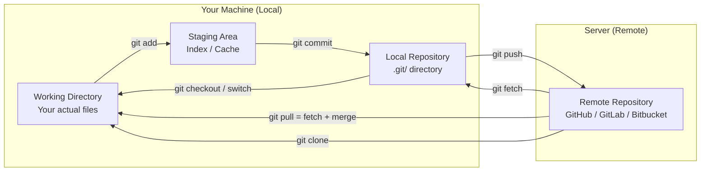
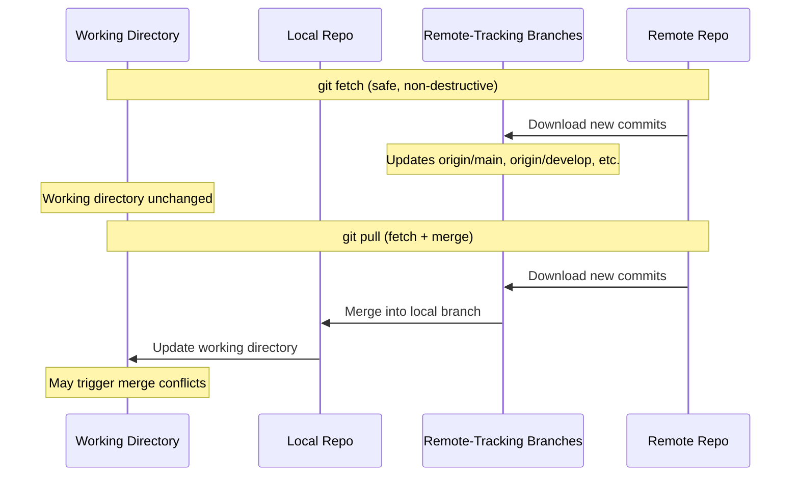

# Local vs Remote Repository

## Quick Reference

- Local repository: the `.git/` directory on your machine containing full project history
- Remote repository: a hosted copy on GitHub, GitLab, Bitbucket, or a private server
- `git clone` — create a local copy of a remote repository
- `git remote -v` — list configured remote repositories
- `git push` — upload local commits to the remote
- `git pull` — download and merge remote changes locally
- `git fetch` — download remote changes without merging (safe inspection)
- `origin` — the default name for the remote you cloned from
- `upstream` — conventional name for the original repo when working on a fork
- Remote-tracking branches (e.g., `origin/main`) are read-only local references to remote state
- `git remote prune origin` — clean up stale remote-tracking branches that no longer exist on the remote
- Every local clone is a full backup — if the remote goes down, any clone can restore the entire history

---

## When to Use

Understanding the local vs remote distinction is essential for every Git workflow. You work with your local repository constantly — every `git add`, `git commit`, `git branch`, and `git log` operates entirely on your local machine without network access. Remote repositories come into play when you need to collaborate with others, back up your work, deploy code, or synchronize across multiple machines. Use `git push` when you want to share completed work with your team. Use `git pull` or `git fetch` when you need to incorporate others' changes. Use `git clone` when joining an existing project. The distributed nature of Git means you can work productively offline, committing and branching locally, then synchronize everything when connectivity is available. This architecture also provides natural redundancy — every clone is a full backup of the repository.

Additional scenarios where the local/remote distinction matters:

- **Multi-machine development**: When you work across a laptop, desktop, and cloud IDE, the remote repository serves as the synchronization point. Push from one machine, pull from another, and your work follows you seamlessly.
- **Fork-based contribution**: In open-source workflows, you maintain two remotes — `origin` (your fork) and `upstream` (the original project). You fetch from upstream to stay current, develop locally, push to origin, and create PRs from origin to upstream.
- **Deployment remotes**: Some teams configure deployment-specific remotes (e.g., `heroku`, `production`) where pushing to a specific remote triggers deployment. This makes deployment as simple as `git push production main`.
- **Air-gapped environments**: In secure environments without internet access, Git bundles (`git bundle create`) allow you to transfer repository data between machines via physical media, maintaining the full distributed workflow without network connectivity.

---

## Code Examples

### Setting Up Remotes

```bash
# Clone a remote repository (automatically sets up 'origin')
git clone https://github.com/team/project.git

# View configured remotes
git remote -v
# origin  https://github.com/team/project.git (fetch)
# origin  https://github.com/team/project.git (push)

# Add a second remote (e.g., for a fork workflow)
git remote add upstream https://github.com/original/project.git

# Rename a remote
git remote rename origin github

# Remove a remote
git remote remove old-remote

# Change a remote's URL (e.g., switching from HTTPS to SSH)
git remote set-url origin git@github.com:team/project.git
```

### Synchronizing Local and Remote

```bash
# Push current branch to remote (first time, set upstream)
git push -u origin feature/new-api

# Push to remote (after upstream is set)
git push

# Fetch all remote changes without merging
git fetch --all

# See what changed on remote since last fetch
git log HEAD..origin/main --oneline

# Pull remote changes (fetch + merge)
git pull origin main

# Pull with rebase (cleaner history)
git pull --rebase origin main

# Push all local branches to remote
git push --all origin

# Push tags to remote
git push --tags
```

### Working with Remote Branches

```bash
# List remote-tracking branches
git branch -r

# List all branches (local + remote)
git branch -a

# Create a local branch tracking a remote branch
git switch --track origin/feature/payment

# Delete a remote branch
git push origin --delete feature/old-branch

# Prune stale remote-tracking branches (deleted on remote)
git fetch --prune

# See tracking relationship for all branches
git branch -vv
```

### Fork Workflow (Multiple Remotes)

```bash
# Clone your fork
git clone https://github.com/your-user/project.git
cd project

# Add the original repository as upstream
git remote add upstream https://github.com/original-org/project.git

# Verify both remotes
git remote -v
# origin    https://github.com/your-user/project.git (fetch)
# origin    https://github.com/your-user/project.git (push)
# upstream  https://github.com/original-org/project.git (fetch)
# upstream  https://github.com/original-org/project.git (push)

# Sync your fork with upstream
git fetch upstream
git switch main
git merge upstream/main
git push origin main

# Create a feature branch for your contribution
git switch -c feature/my-contribution
# ... make changes, commit ...
git push -u origin feature/my-contribution
# Then create PR from origin/feature/my-contribution to upstream/main
```

### Git Bundles for Offline Transfer

```bash
# Create a bundle containing the entire repository
git bundle create repo.bundle --all

# Create a bundle with only recent commits
git bundle create update.bundle main ^origin/main

# Clone from a bundle file
git clone repo.bundle project-dir

# Verify a bundle is valid
git bundle verify repo.bundle

# Fetch from a bundle (incremental update)
git fetch update.bundle main:refs/remotes/offline/main
```

### Mirroring and Backup

```bash
# Create a bare mirror clone (for backup/mirroring)
git clone --mirror https://github.com/team/project.git project.git

# Update the mirror
cd project.git
git remote update

# Push mirror to a different hosting platform
git push --mirror https://gitlab.com/team/project.git

# Set up a push mirror (automatic sync)
git remote set-url --push origin https://backup-server.com/project.git
```

### Shallow Clones and Partial Clones

```bash
# Shallow clone — only the latest commit (fastest for CI)
git clone --depth 1 https://github.com/team/project.git

# Shallow clone with limited history
git clone --depth 10 https://github.com/team/project.git

# Convert a shallow clone to full history
git fetch --unshallow

# Partial clone — download commits/trees but defer blob downloads
git clone --filter=blob:none https://github.com/team/project.git

# Treeless clone — only download blobs on checkout
git clone --filter=tree:0 https://github.com/team/project.git

# Clone only a single branch
git clone --single-branch --branch main https://github.com/team/project.git

# Fetch a specific branch into a shallow clone
git fetch --depth 1 origin feature/specific-branch

# Shallow clone with tags
git clone --depth 1 --no-single-branch https://github.com/team/project.git
```

Shallow and partial clones are essential for CI/CD performance. A full clone of a large repository (e.g., Linux kernel at 4GB+) takes minutes, while `--depth 1` completes in seconds. Partial clones (`--filter=blob:none`) are a middle ground — they download the full commit graph (enabling `git log` and `git blame`) but defer file content downloads until you actually check out a file. This is ideal for developers who rarely need to browse old file versions.

### Sparse Checkout (Working with Repository Subsets)

```bash
# Enable sparse checkout
git sparse-checkout init --cone

# Check out only specific directories
git sparse-checkout set src/frontend src/shared docs/

# Add more directories to the sparse set
git sparse-checkout add src/backend/auth

# List current sparse checkout patterns
git sparse-checkout list

# Disable sparse checkout (restore full working tree)
git sparse-checkout disable

# Combine with partial clone for maximum efficiency
git clone --filter=blob:none --sparse https://github.com/team/monorepo.git
cd monorepo
git sparse-checkout set services/my-service libs/shared
```

Sparse checkout is critical for monorepo workflows. When a repository contains hundreds of services, a developer working on one service does not need the entire working tree. Sparse checkout limits which directories are materialized on disk while maintaining access to the full Git history. Combined with partial clones, this enables working with multi-gigabyte monorepos as if they were small focused repositories.

### Push Strategies and Configuration

```bash
# Configure push behavior (what happens with bare 'git push')
git config --global push.default current    # push current branch to same-named remote
git config --global push.default simple     # like current, but requires upstream tracking (default since Git 2.0)
git config --global push.default matching   # push all branches with matching remote names (dangerous)

# Push with lease (safe force push after rebase)
git push --force-with-lease origin feature/my-branch

# Push and set upstream in one command
git push -u origin feature/new-branch

# Push to a different remote branch name
git push origin local-branch:remote-branch

# Delete a remote branch via push
git push origin --delete old-feature-branch
git push origin :old-feature-branch  # shorthand

# Push all branches
git push --all origin

# Push all tags
git push --tags origin

# Atomic push (all refs succeed or none do)
git push --atomic origin main v1.0.0

# Dry run (see what would be pushed without actually pushing)
git push --dry-run origin main
```

### Upstream Tracking Configuration

```bash
# Set upstream for current branch
git branch --set-upstream-to=origin/main

# View tracking configuration for all branches
git branch -vv
# * main       abc1234 [origin/main] Latest commit message
#   feature    def5678 [origin/feature: ahead 2, behind 1] WIP

# Remove upstream tracking
git branch --unset-upstream

# Push and automatically set upstream
git push -u origin $(git branch --show-current)

# Configure Git to auto-setup tracking on checkout
git config --global branch.autoSetupMerge always

# Show the upstream for current branch
git rev-parse --abbrev-ref @{upstream}
```

---

## Architecture Diagram



### Git Fetch vs Git Pull



The key difference is safety. `git fetch` downloads all new data from the remote but does not modify your working directory or local branches. It updates remote-tracking branches (like `origin/main`) which you can inspect before deciding to merge. `git pull` combines `git fetch` with `git merge` (or `git rebase` with `--rebase`), automatically integrating remote changes into your current branch. This can trigger merge conflicts if you have local changes that conflict with remote updates.

---

## Key Differences

| Feature | Local Repository | Remote Repository |
| --- | --- | --- |
| **Location** | `.git/` on your machine | Server (GitHub, GitLab, etc.) |
| **Network required** | No — all operations are local | Yes — push, pull, fetch need network |
| **Access** | Only you (unless shared filesystem) | Team members with permissions |
| **Speed** | Instant (disk operations only) | Depends on network latency and repo size |
| **Operations** | commit, branch, merge, log, diff, stash | push, pull, fetch, clone, fork |
| **Backup** | Only on your disk (risk of loss) | Hosted with redundancy and backups |
| **Collaboration** | Single developer | Multiple developers simultaneously |
| **Branch visibility** | Only your local branches | All pushed branches visible to team |

---

## Common Pitfalls

- **Pushing without pulling first**: If the remote has commits you do not have locally, `git push` will be rejected. Always `git pull` (or `git fetch` + `git merge`) before pushing to avoid this.
- **Confusing `origin/main` with `main`**: `origin/main` is a remote-tracking branch (a local snapshot of the remote's state at last fetch). `main` is your local branch. They can diverge if you do not fetch regularly.
- **Forgetting to set upstream tracking**: Without `-u` on first push, Git does not know which remote branch to push to by default. Use `git push -u origin branch-name` to establish the tracking relationship.
- **Working offline without fetching first**: If you go offline without a recent fetch, your remote-tracking branches are stale. Fetch frequently when online so you have an accurate picture of remote state.
- **Force pushing to shared remotes**: `git push --force` overwrites remote history, potentially destroying teammates' work. Use `--force-with-lease` which fails if someone else has pushed since your last fetch.
- **Not pruning deleted remote branches**: After branches are deleted on the remote (post-merge), your local remote-tracking references remain. Run `git fetch --prune` periodically to clean up stale references.

## Real-World Use Cases

### Multi-Region Deployment with Git Remotes

Organizations deploying to multiple cloud regions sometimes configure separate remotes for each region's deployment pipeline. A push to `git push us-east main` triggers deployment to the US East region, while `git push eu-west main` deploys to Europe. This pattern, while less common than CI/CD-driven deployments, provides a simple mental model for teams transitioning to infrastructure-as-code. More commonly, teams push to a single remote and let the CI/CD pipeline handle multi-region deployment based on tags or branch names.

### Disaster Recovery and Repository Redundancy

Enterprise teams often mirror repositories across multiple hosting platforms (GitHub + GitLab, or GitHub + self-hosted Gitea) for disaster recovery. If the primary platform experiences an outage, development can continue against the mirror. Tools like `git push --mirror` and scheduled CI jobs keep mirrors synchronized. Some organizations maintain a bare repository on internal infrastructure that receives pushes from all developers, providing an additional backup layer independent of any SaaS platform.

### Submodules for Multi-Repository Dependencies

Large projects use `git submodule` to embed one repository inside another while maintaining separate remote histories. A monolithic application might include shared libraries as submodules, each with their own remote repository and release cycle. The parent repository tracks a specific commit of each submodule, ensuring reproducible builds. Teams use `git submodule update --init --recursive` after cloning, and `git submodule update --remote` to pull the latest version of dependencies.

---

## Interview Questions

**Q1: What is the difference between `git fetch` and `git pull`?**
`git fetch` downloads commits, branches, and tags from the remote without modifying your working directory or local branches. It updates remote-tracking branches only. `git pull` is `git fetch` followed by `git merge` (or `git rebase` with `--rebase` flag), automatically integrating remote changes into your current branch. Fetch is safer for inspection; pull is convenient for quick synchronization.

**Q2: Explain what happens when you run `git clone`.**
`git clone` creates a new directory, initializes a `.git/` repository inside it, adds the source URL as a remote named `origin`, fetches all branches and commits from that remote, creates remote-tracking branches for each remote branch, checks out the default branch (usually `main`), and sets up the local `main` to track `origin/main`. You get a complete copy of the repository with full history.

**Q3: How does Git's distributed model differ from centralized VCS like SVN?**
In Git, every clone is a full repository with complete history, enabling offline work, fast local operations, and natural redundancy. In SVN, there is one central server; developers check out working copies without full history and need network access for most operations. Git's model enables workflows like forking, local branching, and peer-to-peer sharing that are impossible in centralized systems.

**Q4: What are remote-tracking branches and how do they work?**
Remote-tracking branches (e.g., `origin/main`, `origin/develop`) are read-only local references that represent the state of branches on the remote at the time of your last `git fetch`. They cannot be checked out directly (doing so puts you in detached HEAD state). They serve as bookmarks showing where the remote branches were, allowing you to compare your local work against the remote state.

**Q5: How would you set up a repository with multiple remotes and why?**
Use `git remote add <name> <url>` to add additional remotes. Common scenarios include fork workflows (origin = your fork, upstream = original repo), deploying to multiple environments (production, staging remotes), or mirroring to multiple hosting platforms. You fetch from upstream to stay current, push to origin for your work, and can push to deployment remotes for releases.

**Q6: What is `git push --force-with-lease` and why is it safer than `--force`?**
`git push --force` unconditionally overwrites the remote branch with your local version, potentially destroying commits that others have pushed since your last fetch. `--force-with-lease` adds a safety check: it only succeeds if the remote branch is at the commit you expect (based on your last fetch). If someone else has pushed in the meantime, the push fails, alerting you to fetch and reconcile first. Always prefer `--force-with-lease` over `--force` when you must force-push (e.g., after a rebase).

**Q7: How do shallow clones and partial clones work, and when would you use each?**
A shallow clone (`git clone --depth N`) downloads only the last N commits of history, reducing clone time and disk usage. A partial clone (`git clone --filter=blob:none`) downloads all commits and trees but defers blob (file content) downloads until needed. Shallow clones are ideal for CI/CD where you only need the latest code. Partial clones are better for developers who occasionally need history but want fast initial setup. Both can be "unshallowed" later with `git fetch --unshallow`.

---

## Production Tips

- **Use SSH keys instead of HTTPS for remote access**: SSH keys provide passwordless authentication and are more secure than storing HTTPS credentials. Configure your SSH agent to avoid repeated passphrase entry. This is especially important for CI/CD systems that need automated push access.
- **Set up fetch pruning by default**: Configure `git config --global fetch.prune true` so that every fetch automatically removes stale remote-tracking branches. This keeps your branch list clean and prevents confusion about which branches still exist on the remote.
- **Use shallow clones in CI/CD pipelines**: For large repositories, `git clone --depth 1` or `git clone --filter=blob:none` dramatically reduces clone time in CI environments where full history is unnecessary. This can cut pipeline setup time from minutes to seconds.
- **Monitor remote repository size**: Large repositories slow down clones, fetches, and CI pipelines. Track repository size over time and use Git LFS for large binary files, `.gitignore` for build artifacts, and periodic history cleanup for accidentally committed large files.
- **Configure push.default for safety**: Set `git config --global push.default current` to push only the current branch by default, preventing accidental pushes of other local branches. For even more safety, use `simple` (the default since Git 2.0) which also requires upstream tracking.
- **Set up repository mirroring for disaster recovery**: Configure automated mirroring to a secondary hosting platform using `git push --mirror` in a scheduled CI job. This ensures business continuity if your primary Git hosting platform experiences an outage. Test the mirror periodically by cloning from it and verifying integrity.
- **Use deploy keys with minimal permissions**: For CI/CD systems that need to push to specific repositories, use deploy keys (SSH keys scoped to a single repository) rather than personal access tokens or user SSH keys. This follows the principle of least privilege and limits blast radius if a key is compromised.

---

## Related Topics

- [What is Git](./what-is-git.md) — foundational concepts of Git's distributed architecture
- [Git Commands](./commands.md) — complete reference for push, pull, fetch, and remote commands
- [Git Branching](./branching.md) — how branches work across local and remote repositories
- [Pull Requests](./pull-requests.md) — collaboration workflows that bridge local and remote work
