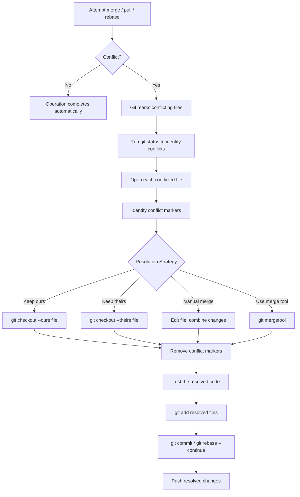
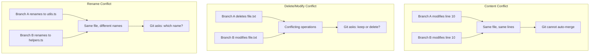

# Merge Conflicts

## Quick Reference

- A merge conflict occurs when Git cannot automatically reconcile changes to the same lines in different branches
- Conflict markers: `<<<<<<< HEAD`, `=======`, `>>>>>>> branch-name`
- Resolution workflow: identify conflicts → edit files → remove markers → `git add` → `git commit`
- `git merge --abort` — cancel a merge and return to pre-merge state
- `git diff --check` — check for conflict markers before committing
- `git mergetool` — launch configured visual merge tool
- Conflicts can occur during: `git merge`, `git rebase`, `git pull`, `git cherry-pick`, `git stash pop`
- Prevention: frequent pulls, small branches, clear code ownership, communication
- `git rerere` — reuse recorded resolution for recurring conflicts
- Three conflict types: content (same lines changed), delete/modify (file deleted vs edited), rename (different new names)

---

## When to Use

Merge conflict resolution is not something you choose to do — it is something you must handle when Git cannot automatically combine changes. Conflicts arise when two branches modify the same lines of the same file, when one branch deletes a file that another branch modifies, or when both branches add different content at the same location. You will encounter conflicts most frequently when pulling remote changes that overlap with your local work, when merging long-lived feature branches back into main, during interactive rebases that replay commits onto a changed base, and when cherry-picking commits that touch code that has since been modified. Understanding conflict resolution is a critical skill because avoiding conflicts entirely is impossible in collaborative development. The goal is to minimize their frequency through good practices and resolve them quickly and correctly when they occur.

Specific scenarios where conflict resolution expertise is critical:

- **Release branch maintenance**: When cherry-picking hotfixes from main to a release branch, the surrounding code may have diverged, causing conflicts that require understanding both the fix intent and the release branch context.
- **Dependency upgrades**: Upgrading a major dependency often conflicts with other branches that import from the old API. Coordinating these upgrades requires resolving conflicts across multiple files simultaneously.
- **Rebase-heavy workflows**: Teams that rebase feature branches onto main before merging encounter conflicts more frequently during the rebase process, where each replayed commit may conflict independently.
- **Monorepo shared utilities**: When multiple teams modify shared utility files in a monorepo, conflicts are frequent. Clear module boundaries and CODEOWNERS help, but resolution skills remain essential.

---

## Code Examples

### Triggering and Resolving a Conflict

```bash
# Attempt to merge a branch (conflict occurs)
git merge feature/update-header
# Auto-merging src/components/Header.tsx
# CONFLICT (content): Merge conflict in src/components/Header.tsx
# Automatic merge failed; fix conflicts and then commit the result.

# Check which files have conflicts
git status
# Both modified: src/components/Header.tsx

# Open the conflicted file and resolve manually
# (edit the file, choose correct code, remove markers)

# After resolving, stage the file
git add src/components/Header.tsx

# Complete the merge with a commit
git commit -m "Merge feature/update-header, resolve header conflict"
```

### Understanding Conflict Markers

```text
<<<<<<< HEAD
// Your current branch's version
const title = "Dashboard - Admin Panel";
const subtitle = "Welcome back, administrator";
=======
// Incoming branch's version
const title = "Dashboard - User Portal";
const subtitle = "Welcome back";
>>>>>>> feature/update-header
```

```text
// After resolution (choosing to combine both):
const title = "Dashboard - User Portal";
const subtitle = "Welcome back, administrator";
```

### Using Merge Strategies

```bash
# Accept all changes from current branch (ours)
git checkout --ours path/to/file.txt
git add path/to/file.txt

# Accept all changes from incoming branch (theirs)
git checkout --theirs path/to/file.txt
git add path/to/file.txt

# Abort the merge entirely (return to pre-merge state)
git merge --abort

# During a rebase, skip a conflicting commit
git rebase --skip

# During a rebase, continue after resolving
git rebase --continue

# Abort a rebase in progress
git rebase --abort
```

### Preventing Conflicts with Rerere

```bash
# Enable rerere (reuse recorded resolution)
git config --global rerere.enabled true

# Git will remember how you resolved a conflict
# and automatically apply the same resolution next time
# the same conflict appears (common during rebases)

# View recorded resolutions
git rerere status

# Forget a recorded resolution
git rerere forget path/to/file.txt
```

### Configuring Merge Tools

```bash
# Set VS Code as the default merge tool
git config --global merge.tool vscode
git config --global mergetool.vscode.cmd 'code --wait --merge $REMOTE $LOCAL $BASE $MERGED'

# Set IntelliJ as the merge tool
git config --global merge.tool intellij
git config --global mergetool.intellij.cmd 'idea merge $LOCAL $REMOTE $BASE $MERGED'

# Set vimdiff as the merge tool (terminal-based)
git config --global merge.tool vimdiff

# Launch the merge tool for all conflicted files
git mergetool

# Don't keep .orig backup files after merge tool resolution
git config --global mergetool.keepBackup false
```

### Advanced Conflict Resolution

```bash
# Show the merge base (common ancestor) version of a conflicted file
git show :1:path/to/file.txt   # base version
git show :2:path/to/file.txt   # ours (current branch)
git show :3:path/to/file.txt   # theirs (incoming branch)

# Use diff3 conflict style (shows base version in markers)
git config --global merge.conflictstyle diff3
# This adds a ||||||| section showing the original text before either change

# Find the merge base commit
git merge-base main feature/branch

# Three-way diff to understand what each side changed
git diff $(git merge-base main feature/branch) main -- file.txt
git diff $(git merge-base main feature/branch) feature/branch -- file.txt

# Check for whitespace-only conflicts (auto-resolve)
git merge -Xignore-space-change feature/branch

# Prefer our version for specific files during merge
echo "generated-file.lock merge=ours" >> .gitattributes
git config merge.ours.driver true
```

### The Three-Way Merge Algorithm Explained

Git's three-way merge algorithm is the foundation of all automatic conflict resolution. Understanding it explains why conflicts occur and how Git resolves non-conflicting changes.

The three inputs to the algorithm are:
1. **Base** (common ancestor): The last commit where both branches shared the same content
2. **Ours** (current branch): The version on the branch you are merging into
3. **Theirs** (incoming branch): The version on the branch being merged

For each section of a file, Git compares both branches against the base:
- If only **ours** changed a section → take ours (the other side did not touch it)
- If only **theirs** changed a section → take theirs (we did not touch it)
- If **neither** changed a section → keep the base version
- If **both** changed the same section **identically** → take either (they agree)
- If **both** changed the same section **differently** → CONFLICT (human must decide)

```text
# Example: Three-way merge in action
# Base version (common ancestor):
function getUser(id) {
  return db.query("SELECT * FROM users WHERE id = ?", [id]);
}

# Ours (we added caching):
function getUser(id) {
  const cached = cache.get(`user:${id}`);
  if (cached) return cached;
  return db.query("SELECT * FROM users WHERE id = ?", [id]);
}

# Theirs (they added logging):
function getUser(id) {
  logger.info(`Fetching user ${id}`);
  return db.query("SELECT * FROM users WHERE id = ?", [id]);
}

# Git's resolution: CONFLICT because both modified the function body
# A human must decide how to combine caching AND logging
```

Without the base, a two-way diff cannot determine intent. It would see two different versions and always conflict. The three-way approach lets Git determine that each side independently added something new, which is why `diff3` conflict style (showing the base) is so valuable for resolution.

### Merge Strategies and Drivers

```bash
# Use the recursive strategy (default for two-branch merges)
git merge -s recursive feature/branch

# Use the ort strategy (newer, faster replacement for recursive)
git merge -s ort feature/branch

# Octopus merge (merge multiple branches simultaneously)
git merge feature/a feature/b feature/c
# Creates a single merge commit with multiple parents
# Only works if there are no conflicts

# Resolve strategy (simpler, for two branches only)
git merge -s resolve feature/branch

# Subtree strategy (merge a project into a subdirectory)
git merge -s subtree --allow-unrelated-histories library/main

# Strategy options for automatic resolution preferences
git merge -X ours feature/branch      # prefer our version on conflicts
git merge -X theirs feature/branch    # prefer their version on conflicts
git merge -X patience feature/branch  # use patience diff algorithm

# Custom merge driver for specific file types
# In .gitattributes:
# *.lock merge=ours
# database.json merge=union

# Configure the union merge driver (concatenates both versions)
git config merge.union.driver "union %O %A %B"
```

### Conflict Prevention Strategies

Preventing conflicts is more efficient than resolving them. These strategies reduce conflict frequency:

1. **Keep branches short-lived**: Branches that live for 1-3 days have far fewer conflicts than branches that live for weeks. The longer a branch lives, the more the base diverges.

2. **Merge main into feature branches daily**: Run `git pull --rebase origin main` every morning. This keeps your branch close to main and surfaces conflicts early when they are small.

3. **Establish clear code ownership**: When different developers own different modules, they rarely modify the same files. Use CODEOWNERS to formalize this.

4. **Use feature flags instead of long-lived branches**: Deploy incomplete features behind flags rather than keeping them on branches for weeks. This eliminates the branch divergence problem entirely.

5. **Coordinate large refactorings**: Before a large rename or restructuring, announce it to the team. Ask everyone to merge their in-flight work first, then perform the refactoring atomically.

6. **Split files that conflict frequently**: If a file is a constant source of conflicts (e.g., a routes file, a constants file), consider splitting it into smaller, more focused files that different developers can modify independently.

7. **Use `git rerere` for recurring conflicts**: Enable rerere to automatically resolve conflicts you have already handled. This is especially valuable during repeated rebases.

### Using Visual Merge Tools

```bash
# Configure and use various merge tools

# VS Code (most popular for web developers)
git config --global merge.tool vscode
git config --global mergetool.vscode.cmd 'code --wait --merge $REMOTE $LOCAL $BASE $MERGED'

# IntelliJ IDEA (popular for Java developers)
git config --global merge.tool intellij
git config --global mergetool.intellij.cmd 'idea merge $LOCAL $REMOTE $BASE $MERGED'

# Meld (cross-platform, free)
git config --global merge.tool meld

# Beyond Compare (commercial, powerful)
git config --global merge.tool bc
git config --global mergetool.bc.path '/usr/local/bin/bcomp'

# vimdiff (terminal-based, no GUI needed)
git config --global merge.tool vimdiff
git config --global mergetool.vimdiff.layout "LOCAL,MERGED,REMOTE"

# kdiff3 (three-way merge with auto-resolution)
git config --global merge.tool kdiff3

# Launch the configured merge tool
git mergetool

# Launch for a specific file
git mergetool -- src/conflicted-file.ts

# Don't create .orig backup files
git config --global mergetool.keepBackup false

# Prompt before launching tool for each file
git config --global mergetool.prompt false
```

### Resolving Conflicts During Rebase

```bash
# Start a rebase (conflicts may occur at each replayed commit)
git rebase main

# When a conflict occurs during rebase:
# 1. Resolve the conflict in the file
# 2. Stage the resolution
git add resolved-file.txt

# 3. Continue to the next commit
git rebase --continue

# If a commit becomes empty after resolution, skip it
git rebase --skip

# If the rebase is too complex, abort and try a different approach
git rebase --abort

# Use interactive rebase to squash before rebasing (fewer conflicts)
git rebase -i HEAD~5  # squash related commits first
git rebase main       # then rebase the squashed result
```

---

## Conflict Resolution Flow



### Types of Conflicts



---

## Common Pitfalls

- **Blindly accepting "ours" or "theirs" without understanding**: Using `--ours` or `--theirs` for every conflict without reading the code leads to lost functionality or introduced bugs. Always understand what both sides intended before choosing.
- **Leaving conflict markers in committed code**: Accidentally committing files with `<<<<<<<`, `=======`, or `>>>>>>>` markers breaks the application. Use `git diff --check` before committing to catch leftover markers, or configure a pre-commit hook.
- **Not testing after resolution**: Resolving conflicts syntactically (removing markers) does not guarantee the code works correctly. Always run tests and verify the application builds after resolving conflicts before committing.
- **Resolving conflicts in large batches**: When multiple files conflict, resolving them all at once increases the chance of mistakes. Resolve one file at a time, test incrementally, and stage each resolved file individually.
- **Ignoring the merge base**: Conflicts show "ours" vs "theirs" but understanding the common ancestor (merge base) provides crucial context. Use `git merge-base main feature` and three-way diff tools to see what each side actually changed.
- **Not communicating with the other developer**: When conflicts involve another developer's code, do not guess their intent. Reach out to understand what they were trying to accomplish before deciding how to combine the changes.

## Real-World Use Cases

### Large-Scale Refactoring Conflicts

When a team performs a large-scale refactoring (renaming a module, restructuring directories, changing an API signature used across many files), every in-flight feature branch will conflict when it tries to merge. The best approach is to coordinate: announce the refactoring, ask developers to merge or rebase their branches before the refactoring lands, then perform the refactoring in a single atomic PR. After it merges, remaining branches rebase onto the new structure. Tools like `git rerere` help when multiple branches encounter the same conflict pattern.

### Lock File Conflicts in Package Managers

Files like `package-lock.json`, `yarn.lock`, and `Gemfile.lock` are frequent sources of merge conflicts because any dependency change modifies them. The resolution strategy is typically to accept one version entirely (usually "theirs" or the main branch version) and then regenerate the lock file by running the package manager (`npm install`, `yarn install`). Some teams configure custom merge drivers in `.gitattributes` to handle lock files automatically.

### Database Migration Conflicts

When two developers create database migrations simultaneously, they may conflict on migration ordering or sequence numbers. The resolution is not just textual — you must ensure migrations run in a valid order and do not create conflicting schema changes. Teams mitigate this by using timestamp-based migration naming (e.g., `20240115_120000_add_users_table.sql`) and requiring developers to rebase and renumber migrations before merging.

### Conflict Resolution in CI/CD (Merge Queues)

Modern CI platforms implement merge queues that automatically rebase PRs onto the latest main before testing. If a conflict occurs during this automated rebase, the PR is ejected from the queue and the author is notified to resolve conflicts manually. This prevents the "works on my branch but breaks after merge" problem where two PRs individually pass CI but conflict when combined.

---

## Interview Questions

**Q1: What causes a merge conflict and how do you resolve one?**
A merge conflict occurs when two branches modify the same lines of the same file, or when one branch deletes a file that another modifies. To resolve: open the conflicted file, understand both versions by reading the conflict markers, decide which changes to keep or how to combine them, remove the markers, test the result, then `git add` and `git commit` to complete the merge.

**Q2: What is the difference between `git merge --abort` and `git reset --hard`?**
`git merge --abort` cleanly cancels an in-progress merge, restoring the repository to its pre-merge state. It only works during an active merge. `git reset --hard` discards all uncommitted changes and moves the branch pointer, which is more destructive and can be used outside of merge contexts. Prefer `--abort` during merges as it is purpose-built and safer.

**Q3: How would you minimize merge conflicts in a team environment?**
Keep branches short-lived (1-3 days), pull from main frequently to stay current, break work into small focused commits, establish clear code ownership so developers rarely modify the same files, use feature flags instead of long-lived branches, communicate about overlapping work, and configure CI to require branches be up-to-date before merging.

**Q4: Explain `git rerere` and when it is useful.**
`git rerere` (reuse recorded resolution) records how you resolve conflicts and automatically applies the same resolution when the identical conflict appears again. It is particularly useful during repeated rebases where the same conflicts recur, or when maintaining long-lived branches that are regularly synced with main. Enable with `git config rerere.enabled true`.

**Q5: What is a three-way merge and why does Git use it?**
A three-way merge uses three reference points: the two branch tips being merged and their common ancestor (merge base). By comparing each branch against the ancestor, Git can determine what each side changed independently. If only one side changed a section, Git takes that change. If both sides changed the same section differently, Git declares a conflict. This is more accurate than a two-way diff which cannot distinguish additions from deletions.

**Q6: What is the `diff3` conflict style and why should you use it?**
The default conflict style shows only "ours" and "theirs" versions. The `diff3` style (`git config merge.conflictstyle diff3`) adds a third section showing the merge base (original) version between `|||||||` markers. This is invaluable because it shows what the code looked like before either branch changed it, making it much easier to understand what each side intended to accomplish. Without the base, you are guessing at intent from two endpoints.

**Q7: How do you handle conflicts in auto-generated files like lock files or compiled assets?**
For lock files (`package-lock.json`, `yarn.lock`), accept one version entirely (typically theirs/main) and regenerate by running the package manager. Configure `.gitattributes` with custom merge drivers for these files. For compiled assets, regenerate from source after resolving source conflicts. Never manually edit auto-generated files during conflict resolution — always regenerate them from their source of truth.

**Q8: Describe a strategy for resolving conflicts in a large rebase with many commits.**
First, consider squashing related commits before rebasing to reduce the number of potential conflict points. If conflicts are extensive, try `git rebase --strategy-option=theirs` to auto-resolve in favor of the target branch where safe, then manually fix semantic issues. For very divergent branches, it may be more efficient to create a new branch from main and manually re-apply your changes rather than fighting through dozens of conflict resolutions.

---

## Production Tips

- **Configure a visual merge tool**: Set up a tool like VS Code, IntelliJ, or `meld` as your default mergetool (`git config --global merge.tool vscode`). Visual three-way merge views make complex conflicts much easier to resolve correctly than editing markers in a text editor.
- **Enable rerere for repeated rebases**: If your workflow involves frequently rebasing feature branches onto an updated main, `git config rerere.enabled true` saves significant time by automatically resolving conflicts you have already handled.
- **Use CI checks to prevent conflict-prone merges**: Configure your CI pipeline to require branches be up-to-date with main before merging. This catches conflicts at PR time rather than after merge, when they are harder to attribute and fix.
- **Establish code ownership boundaries**: When possible, organize code so that different features or modules are owned by different developers or teams. Clear boundaries reduce the frequency of conflicts because developers rarely modify the same files simultaneously.
- **Document conflict resolution decisions**: When resolving non-trivial conflicts, add a comment in the commit message explaining why you chose a particular resolution. This helps future developers understand the decision if the merged code behaves unexpectedly.
- **Use `merge.conflictstyle diff3` globally**: The diff3 style shows the common ancestor alongside both branch versions, providing crucial context for understanding what each side changed. This single configuration change dramatically improves resolution accuracy: `git config --global merge.conflictstyle diff3`.
- **Set up pre-commit hooks to catch conflict markers**: Add a pre-commit hook that greps for `<<<<<<<`, `=======`, and `>>>>>>>` in staged files. This prevents accidentally committing unresolved conflicts, which is surprisingly common during complex multi-file resolutions.

---

## Related Topics

- [Git Branching](./branching.md) — branching strategies that minimize conflict frequency
- [Git Commands](./commands.md) — commands for merging, rebasing, and conflict resolution
- [Pull Requests](./pull-requests.md) — how conflicts surface during the PR review process
- [Local vs Remote](./local-vs-remote.md) — how pulling remote changes can trigger conflicts
