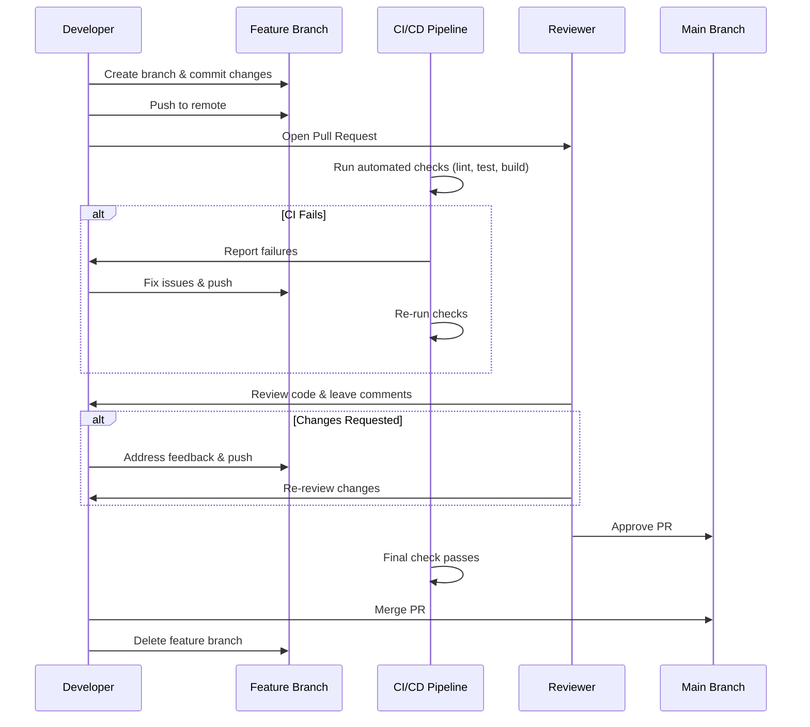
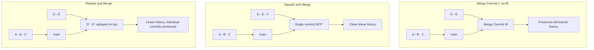

# Pull Requests

## Quick Reference

- A Pull Request (PR) proposes merging changes from one branch into another
- Also called Merge Request (MR) in GitLab
- Workflow: create branch → commit changes → push → open PR → review → merge
- PRs enable code review, discussion, CI/CD validation, and documentation of changes
- Common merge strategies: merge commit, squash and merge, rebase and merge
- Branch protection rules can require reviews, passing checks, and up-to-date branches
- Draft PRs signal work-in-progress that is not ready for review
- PR templates standardize the information provided with each change
- CODEOWNERS files automatically assign reviewers based on file paths modified
- Merge queues serialize PR merges to prevent integration failures from concurrent merges

---

## When to Use

Pull requests should be used for virtually every change that will be merged into a shared branch in a team environment. They serve as the primary mechanism for code review, knowledge sharing, and quality assurance. Use PRs when implementing new features, fixing bugs, refactoring code, updating documentation, or making configuration changes. Even in solo projects, PRs provide a useful checkpoint for reviewing your own work before merging and create a documented history of why changes were made. The only scenarios where you might skip PRs are for trivial automated changes (like dependency bot updates with passing CI) or in trunk-based development workflows where pair programming replaces asynchronous review. In regulated industries, PRs often serve as audit trails demonstrating that changes were reviewed and approved before reaching production.

Additional scenarios where PR workflows are critical:

- **Compliance and audit requirements**: In SOX, HIPAA, or PCI-DSS regulated environments, PRs provide documented evidence that changes were reviewed by authorized personnel before deployment. The PR history serves as an audit trail during compliance reviews.
- **Knowledge transfer and onboarding**: PRs are one of the best onboarding tools for new team members. Reviewing PRs exposes newcomers to coding standards, architecture decisions, and domain knowledge. Conversely, having senior engineers review a newcomer's PRs provides targeted mentoring.
- **Cross-team coordination**: When changes affect shared libraries or APIs used by multiple teams, PRs with required reviewers from affected teams ensure coordination. CODEOWNERS files automate this by requiring approval from the owning team.
- **Rollback documentation**: When a production issue requires reverting a change, the original PR provides context about what was changed and why, making it easier to understand the impact of the revert and plan a proper fix.

---

## Code Examples

### Creating a Pull Request (CLI)

```bash
# Create a feature branch and make changes
git switch -c feature/add-user-search
# ... make changes ...
git add .
git commit -m "Add user search with fuzzy matching"

# Push the branch to remote
git push -u origin feature/add-user-search

# Create PR using GitHub CLI
gh pr create \
  --title "Add user search with fuzzy matching" \
  --body "Implements fuzzy search using Fuse.js library.
  
## Changes
- Added SearchBar component with debounced input
- Integrated Fuse.js for fuzzy matching
- Added search results dropdown with keyboard navigation

## Testing
- Unit tests for search logic
- Manual testing on Chrome, Firefox, Safari

Closes #142" \
  --base main \
  --reviewer teammate1,teammate2 \
  --label "feature,frontend"

# Create PR using GitLab CLI
glab mr create \
  --title "Add user search with fuzzy matching" \
  --description "Implements fuzzy search" \
  --target-branch main
```

### Managing Pull Requests

```bash
# List open PRs
gh pr list

# View PR details
gh pr view 42

# Check out a PR locally for testing
gh pr checkout 42

# Approve a PR
gh pr review 42 --approve

# Request changes on a PR
gh pr review 42 --request-changes --body "Please add error handling"

# Merge a PR (merge commit strategy)
gh pr merge 42 --merge

# Merge with squash (single commit)
gh pr merge 42 --squash

# Merge with rebase (linear history)
gh pr merge 42 --rebase

# Close a PR without merging
gh pr close 42
```

### PR Template Example

```markdown
<!-- .github/pull_request_template.md -->
## Summary
<!-- Brief description of what this PR does -->

## Type of Change
- [ ] Bug fix (non-breaking change that fixes an issue)
- [ ] New feature (non-breaking change that adds functionality)
- [ ] Breaking change (fix or feature that would cause existing functionality to change)
- [ ] Refactoring (no functional changes)
- [ ] Documentation update

## Changes Made
<!-- List the specific changes -->

## Testing
<!-- Describe how you tested these changes -->
- [ ] Unit tests pass
- [ ] Integration tests pass
- [ ] Manual testing completed

## Screenshots (if applicable)

## Checklist
- [ ] Code follows project style guidelines
- [ ] Self-review completed
- [ ] Comments added for complex logic
- [ ] Documentation updated
- [ ] No new warnings introduced
```

### CODEOWNERS Configuration

```text
# .github/CODEOWNERS

# Global owners (fallback for any file not matched below)
* @team-leads

# Frontend team owns all React components
src/components/ @frontend-team
src/pages/ @frontend-team
src/hooks/ @frontend-team

# Backend team owns API and data layer
src/api/ @backend-team
src/services/ @backend-team
src/models/ @backend-team

# DevOps owns infrastructure and CI/CD
.github/workflows/ @devops-team
terraform/ @devops-team
Dockerfile @devops-team
docker-compose.yml @devops-team

# Security team must review auth changes
src/auth/ @security-team @backend-team
src/middleware/auth* @security-team

# Database migrations require DBA review
migrations/ @dba-team @backend-team
```

### Automated PR Workflows (GitHub Actions)

```yaml
# .github/workflows/pr-checks.yml
name: PR Checks
on:
  pull_request:
    branches: [main]

jobs:
  lint-and-test:
    runs-on: ubuntu-latest
    steps:
      - uses: actions/checkout@v4
      - uses: actions/setup-node@v4
        with:
          node-version: '20'
          cache: 'npm'
      - run: npm ci
      - run: npm run lint
      - run: npm run test -- --coverage
      - run: npm run build

  pr-size-check:
    runs-on: ubuntu-latest
    steps:
      - uses: actions/checkout@v4
        with:
          fetch-depth: 0
      - name: Check PR size
        run: |
          ADDITIONS=$(git diff --numstat origin/main...HEAD | awk '{s+=$1} END {print s}')
          if [ "$ADDITIONS" -gt 500 ]; then
            echo "::warning::This PR has $ADDITIONS additions. Consider breaking it into smaller PRs."
          fi
```

### Draft PRs and Work-in-Progress

```bash
# Create a draft PR (GitHub CLI)
gh pr create --draft \
  --title "WIP: Implement payment gateway" \
  --body "Early draft for feedback on approach. Not ready for full review."

# Convert a draft PR to ready for review
gh pr ready 42

# Mark a ready PR back to draft
gh pr ready 42 --undo

# Create a PR with auto-merge enabled (merges when checks pass)
gh pr create --title "Fix: resolve timeout issue" --auto-merge --squash
```

Draft PRs serve several purposes in production workflows:
- **Early feedback on approach**: Open a draft PR after the first commit to get architectural feedback before investing more time
- **CI validation**: Draft PRs still trigger CI, letting you validate your approach passes tests
- **Visibility**: Team members can see what you are working on without being asked to review
- **Stacked PR management**: When building stacked PRs, earlier PRs in the chain start as drafts until their dependencies merge

### Code Review Best Practices

A thorough code review checks multiple dimensions:

**Correctness**: Does the code do what the PR description claims? Are edge cases handled? Are error paths covered?

**Design**: Is the approach appropriate for the problem? Does it follow existing patterns in the codebase? Is it over-engineered or under-engineered?

**Readability**: Can a new team member understand this code in 6 months? Are variable names descriptive? Is complex logic commented?

**Testing**: Are there tests for the new behavior? Do tests cover edge cases? Are tests testing behavior (not implementation details)?

**Security**: Are there injection vulnerabilities? Is input validated? Are secrets handled properly? Are permissions checked?

**Performance**: Are there N+1 queries? Unnecessary allocations? Missing indexes? Unbounded loops?

```markdown
<!-- Example of a constructive review comment -->
## Suggestion: Consider extracting this into a utility function

The retry logic on lines 45-62 is duplicated in `OrderService.ts` (line 120).
Consider extracting it into a shared `withRetry()` utility:

```typescript
// src/utils/retry.ts
export async function withRetry<T>(
  fn: () => Promise<T>,
  maxAttempts = 3,
  backoffMs = 1000
): Promise<T> {
  for (let attempt = 1; attempt <= maxAttempts; attempt++) {
    try {
      return await fn();
    } catch (error) {
      if (attempt === maxAttempts) throw error;
      await sleep(backoffMs * attempt);
    }
  }
  throw new Error('Unreachable');
}
```

This reduces duplication and makes the retry behavior testable in isolation.
```

### Squash vs Merge Commit vs Rebase: Choosing a Strategy

| Aspect | Squash & Merge | Merge Commit | Rebase & Merge |
| --- | --- | --- | --- |
| **History** | One commit per PR | Merge commit + all branch commits | All branch commits, linear |
| **Revert** | Easy (revert one commit) | Easy (revert merge commit) | Hard (revert multiple commits) |
| **Bisect** | Less granular | Full granularity | Full granularity |
| **Blame** | Points to PR merge | Points to original commit | Points to original commit |
| **Best for** | Most teams, messy branches | Complex features, audit trails | Teams with clean commit discipline |

**Squash and merge** is the most popular choice because it keeps the main branch history clean regardless of how messy the feature branch commits are. Each PR becomes a single commit with the PR title as the message. The trade-off is losing individual commit granularity for bisect and blame.

**Merge commits** preserve the complete development history, including all individual commits and the branch topology. This is valuable for complex features where understanding the development sequence matters, and for audit trails in regulated environments.

**Rebase and merge** provides linear history with individual commits preserved. This requires developers to maintain clean, atomic commits on their feature branches (no "WIP" or "fix typo" commits). It produces the most readable `git log` but requires more discipline.

### Auto-Merge and Merge Queues

```yaml
# GitHub Actions: Auto-merge Dependabot PRs that pass CI
name: Auto-merge Dependabot
on: pull_request

permissions:
  contents: write
  pull-requests: write

jobs:
  auto-merge:
    if: github.actor == 'dependabot[bot]'
    runs-on: ubuntu-latest
    steps:
      - uses: actions/checkout@v4
      - name: Enable auto-merge for minor/patch updates
        run: gh pr merge --auto --squash "$PR_URL"
        env:
          PR_URL: ${{ github.event.pull_request.html_url }}
          GH_TOKEN: ${{ secrets.GITHUB_TOKEN }}
```

Merge queues solve the "semantic conflict" problem: two PRs individually pass CI but break when combined. Without a merge queue, this manifests as a broken main branch after both PRs merge. With a merge queue:

1. PR is approved and added to the queue
2. The queue rebases the PR onto the latest main (including other queued PRs ahead of it)
3. CI runs against this rebased version
4. If CI passes, the PR merges; if it fails, the PR is ejected from the queue
5. The next PR in the queue is tested against the new main state

This serialization guarantees that main never breaks from integration issues, at the cost of slightly longer merge times for individual PRs.

---

## Pull Request Workflow



### Merge Strategies Comparison



| Strategy | History | Best For |
| --- | --- | --- |
| Merge commit | Preserves branch topology | Complex features needing full context |
| Squash and merge | Single clean commit | Small features, messy commit history |
| Rebase and merge | Linear, individual commits | Clean commits that tell a story |

---

## Common Pitfalls

- **Massive PRs with hundreds of changed lines**: Large PRs are difficult to review thoroughly, leading to rubber-stamp approvals and missed bugs. Keep PRs focused on a single concern and aim for under 400 lines of changes. Break large features into incremental PRs.
- **Vague PR descriptions**: Opening a PR with no description or just "fixes stuff" forces reviewers to reverse-engineer your intent from the code. Always explain what changed, why it changed, and how to test it.
- **Not responding to review feedback promptly**: Letting review comments sit for days slows the entire team. Respond within one business day, even if just to acknowledge and plan when you will address the feedback.
- **Approving without actually reviewing**: Clicking "approve" without reading the code undermines the entire review process. If you cannot review thoroughly, say so and let someone else review instead.
- **Not running CI before requesting review**: Pushing code that fails linting or tests wastes reviewers' time. Run checks locally before pushing, or at minimum wait for CI to pass before requesting review.
- **Merging with unresolved conversations**: Some platforms allow merging even with open review threads. Ensure all conversations are resolved or explicitly acknowledged before merging to avoid losing important feedback.

## Real-World Use Cases

### Enterprise PR Workflow with Compliance Gates

In regulated environments, PRs serve as formal change control records. A typical enterprise workflow requires: at least two approving reviews (one from the team, one from a designated approver), all CI checks passing (unit tests, integration tests, security scans, license compliance), a linked Jira ticket in the PR description, and no unresolved review threads. Some organizations add additional gates like architecture review for PRs exceeding a certain size, security team approval for changes to authentication or authorization code, and DBA approval for database migration PRs. The PR merge timestamp becomes the official "change approved" timestamp for audit purposes.

### Stacked PRs for Large Features

When implementing a large feature that would result in an unreviewable 2000-line PR, experienced developers use stacked PRs. They break the work into a chain of dependent PRs: PR1 (data model changes) → PR2 (API layer) → PR3 (UI components) → PR4 (integration and tests). Each PR targets the previous PR's branch rather than main. Reviewers can review each layer independently. Tools like `gh pr create --base feature/pr1` and Graphite or ghstack automate the management of stacked PRs, automatically rebasing the chain when earlier PRs are updated.

### Inner Source and Cross-Team Contributions

Large organizations use an "inner source" model where teams can contribute to each other's repositories via PRs, similar to open-source contribution. A frontend team might submit a PR to the backend team's API repository to add an endpoint they need. CODEOWNERS ensures the owning team reviews the change, while the contributing team provides context about their use case. This model reduces bottlenecks and encourages shared ownership while maintaining quality through review.

---

## Interview Questions

**Q1: What is the purpose of a pull request in a development workflow?**
A pull request serves multiple purposes: it enables code review by making changes visible to the team before merging, triggers automated CI/CD checks to validate quality, documents the rationale for changes through descriptions and discussions, provides an audit trail of who approved what, and creates a natural checkpoint for knowledge sharing across the team.

**Q2: What merge strategy would you choose for a team and why?**
For most teams, squash and merge provides the best balance: it keeps the main branch history clean with one commit per feature while allowing developers to make messy work-in-progress commits on their branches. For complex features where individual commit history matters (like a multi-step refactoring), merge commits preserve full context. Rebase and merge works well for teams that enforce clean, atomic commits on feature branches.

**Q3: How do you handle a PR that has been open for too long and has many conflicts?**
First, assess whether the PR is still relevant. If yes, rebase it onto the latest main (`git rebase origin/main`), resolve conflicts carefully, and force-push with `--force-with-lease`. Consider breaking the PR into smaller pieces if it has grown too large. If the PR is stale and the feature is no longer needed, close it. Establish team norms around maximum PR age to prevent this situation.

**Q4: What should a good PR review process look like?**
A good review checks for correctness (does the code do what it claims), design (is the approach appropriate), readability (can future developers understand it), testing (are edge cases covered), and security (are there vulnerabilities). Reviewers should provide constructive feedback with suggestions, not just criticism. The author should respond to all comments. Aim for review turnaround within 24 hours to maintain development velocity.

**Q5: How do branch protection rules improve code quality?**
Branch protection rules enforce quality gates before code reaches main: requiring at least one (or more) approving reviews ensures human oversight, requiring passing CI checks prevents broken code from merging, requiring branches be up-to-date prevents integration issues, and preventing force pushes preserves history integrity. Together, these rules create a systematic quality assurance process that does not rely on individual discipline.

**Q6: What is a merge queue and when would you use one?**
A merge queue serializes PR merges by automatically rebasing each PR onto the latest main, running CI, and only merging if tests pass. Without a merge queue, two PRs can individually pass CI but break when combined (semantic conflicts). Merge queues prevent this by testing PRs in sequence against the true target state. Use them on high-traffic repositories where multiple PRs merge daily and integration failures are costly. GitHub, GitLab, and Mergify all offer merge queue implementations.

**Q7: How would you structure a PR for maximum reviewability?**
Keep PRs focused on a single concern (one feature, one bug fix, one refactoring — never mixed). Aim for under 400 lines of changes. Write a clear description explaining what changed, why, and how to test it. Add inline comments on your own PR to explain non-obvious decisions. If the PR touches multiple areas, organize commits logically (e.g., separate commit for test additions). Include before/after screenshots for UI changes. Link to the relevant issue or design document for context.

**Q8: How do you handle disagreements during code review?**
Start by assuming good intent — the reviewer may see something you missed. If you disagree, explain your reasoning with technical justification rather than opinion. If the disagreement persists, involve a third party (tech lead or architect) for a tiebreaker. For style disagreements, defer to established team conventions or linter rules. Never let review disagreements block a PR for days — escalate quickly. Document the decision in the PR for future reference.

---

## Production Tips

- **Require at least two reviewers for critical paths**: For code that handles authentication, payment processing, data migrations, or infrastructure changes, require additional reviewers with domain expertise. This catches subtle issues that a single reviewer might miss.
- **Use CODEOWNERS files for automatic reviewer assignment**: Configure `.github/CODEOWNERS` (or equivalent) to automatically assign reviewers based on which files are modified. This ensures the right experts review changes to their areas without manual assignment.
- **Enforce PR size limits through tooling**: Configure bots or CI checks to flag PRs exceeding a line count threshold (e.g., 500 lines). This encourages developers to break work into reviewable chunks and prevents the "too big to review properly" problem.
- **Set up auto-merge for dependency updates**: For automated dependency update PRs (Dependabot, Renovate) that pass all CI checks, configure auto-merge to reduce manual toil. Reserve human review for major version bumps or security-sensitive dependencies.
- **Use PR metrics to improve team velocity**: Track metrics like time-to-first-review, time-to-merge, review rounds, and PR size. These metrics reveal bottlenecks in your development process and help identify where the team can improve throughput without sacrificing quality.
- **Implement PR preview environments**: Configure your CI/CD to deploy each PR to a temporary preview environment (e.g., Vercel preview deployments, Heroku review apps). This allows reviewers and QA to test changes in a real environment without checking out the branch locally, dramatically improving review quality for UI changes.
- **Use conventional PR titles for automated changelogs**: Enforce PR title conventions (e.g., `feat: add user search`, `fix: resolve cart calculation bug`) that match conventional commit format. When using squash merge, the PR title becomes the commit message, enabling automated changelog generation from the main branch history.

---

## Related Topics

- [Git Branching](./branching.md) — branching strategies that feed into the PR workflow
- [Merge Conflicts](./merge-conflicts.md) — resolving conflicts that arise during PR merges
- [Git Commands](./commands.md) — commands for pushing branches and managing remotes
- [Local vs Remote](./local-vs-remote.md) — how local branches become remote PRs
