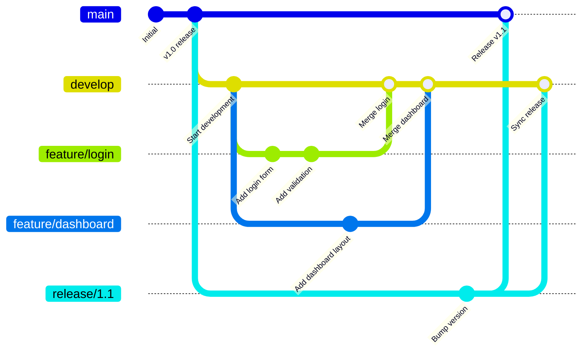
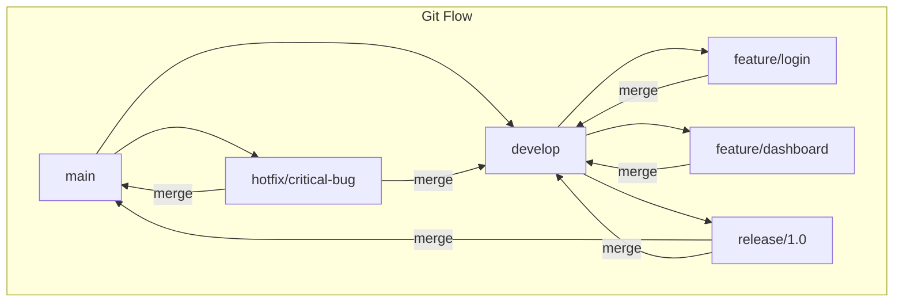
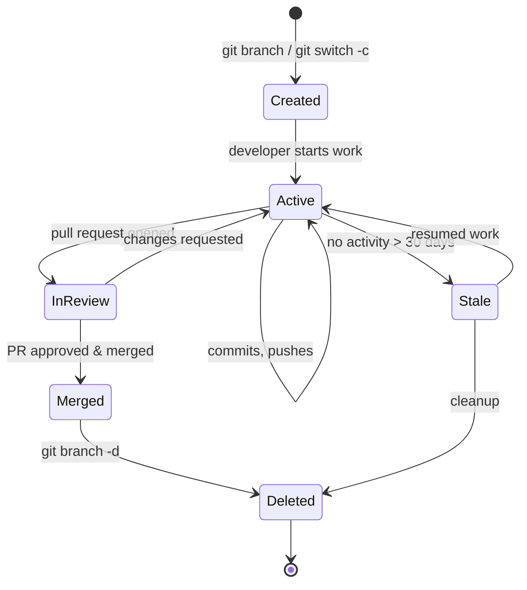

# Git Branching

## Quick Reference

- `git branch` — list all local branches
- `git branch <name>` — create a new branch at current commit
- `git switch <branch>` — switch to an existing branch
- `git switch -c <branch>` — create and switch to a new branch
- `git branch -d <branch>` — delete a merged branch
- `git branch -D <branch>` — force delete an unmerged branch
- `git merge <branch>` — merge branch into current branch
- `git rebase <branch>` — replay commits on top of another branch
- Branches are lightweight pointers to commits (just 41 bytes each)
- HEAD points to the current branch, which points to the latest commit
- Common naming conventions: `feature/`, `bugfix/`, `hotfix/`, `release/`

---

## When to Use

Branching is fundamental to every Git workflow and should be used whenever you start working on something new. Create a feature branch when implementing a new feature, a bugfix branch when addressing a reported issue, and a hotfix branch when patching a critical production problem. Branches isolate your work from the main codebase, allowing you to experiment freely without risking the stability of shared code. Use branches when collaborating with a team so that multiple developers can work in parallel without stepping on each other's changes. Branching is also essential for release management, where you maintain separate branches for different release versions. Even for solo projects, branching provides a clean way to context-switch between tasks. The only time you might skip branching is for trivial one-line fixes in a solo project, though even then a branch provides a safety net.

---

## Code Examples

### Creating and Managing Branches

```bash
# List all local branches (current branch marked with *)
git branch

# List all branches including remote-tracking branches
git branch -a

# Create a new branch from current HEAD
git branch feature/user-authentication

# Switch to the new branch
git switch feature/user-authentication

# Create and switch in one command
git switch -c feature/payment-gateway

# Rename the current branch
git branch -m new-branch-name

# Delete a branch that has been merged
git branch -d feature/completed-work

# Force delete an unmerged branch (use with caution)
git branch -D feature/abandoned-experiment
```

### Merging Branches

```bash
# Switch to the target branch first
git switch main

# Merge feature branch into main (fast-forward if possible)
git merge feature/user-authentication

# Merge with explicit merge commit (preserves branch topology)
git merge --no-ff feature/user-authentication

# Abort a merge that has conflicts
git merge --abort

# Squash all commits from a branch into one (does not auto-commit)
git merge --squash feature/messy-history
git commit -m "Add user authentication feature"
```

### Rebasing

```bash
# Rebase current branch onto main (linear history)
git switch feature/my-work
git rebase main

# Interactive rebase to clean up last 5 commits
git rebase -i HEAD~5
# In the editor: pick, squash, reword, edit, drop

# Continue after resolving rebase conflicts
git rebase --continue

# Abort a rebase in progress
git rebase --abort
```

---

## Branching Strategies



### Git Flow

Git Flow is a structured branching model designed for projects with scheduled releases. It uses long-lived branches (`main` and `develop`) alongside short-lived support branches. The `main` branch always reflects production-ready code, while `develop` is the integration branch for features. Feature branches are created from `develop` and merged back when complete. Release branches are cut from `develop` when preparing a release, allowing final bug fixes without blocking new feature development. Hotfix branches are created from `main` for critical production patches and merged back into both `main` and `develop`.



### GitHub Flow

GitHub Flow is a simpler model suited for continuous deployment. There is only one long-lived branch (`main`) which is always deployable. Developers create feature branches from `main`, open pull requests for review, and merge back to `main` after approval. Deployments happen directly from `main` after each merge. This model works well for web applications and SaaS products where you deploy frequently and do not maintain multiple release versions.

### Trunk-Based Development

Trunk-Based Development minimizes branch lifetime. Developers commit directly to `main` (the trunk) or use extremely short-lived branches (less than a day). Feature flags control the visibility of incomplete work in production. This approach reduces merge conflicts, encourages small incremental changes, and pairs well with continuous integration. It requires strong CI/CD pipelines and comprehensive automated testing to maintain stability.

---

## Branch Lifecycle



---

## Common Pitfalls

- **Long-lived feature branches**: Branches that live for weeks or months diverge significantly from main, leading to painful merge conflicts. Keep branches short-lived (ideally 1-3 days) and merge frequently.
- **Rebasing shared branches**: Running `git rebase` on a branch that others have pulled rewrites commit history, causing duplicate commits and confusion. Only rebase local, unpushed commits.
- **Not updating feature branches**: Working on a feature branch without periodically merging or rebasing from main means you are building on stale code. Regularly sync with `git pull --rebase origin main`.
- **Deleting branches before merging**: Force-deleting a branch with `git branch -D` before its changes are merged elsewhere means those commits become unreachable (though recoverable via reflog temporarily).
- **Inconsistent naming conventions**: Without agreed-upon branch naming (e.g., `feature/`, `bugfix/`, `hotfix/`), repositories become cluttered and it is difficult to understand what each branch represents.
- **Merge commit pollution**: Using `git merge` without `--no-ff` on trivial branches creates unnecessary merge commits. Conversely, always fast-forwarding loses the context of feature branch boundaries. Choose a strategy and be consistent.

---

## Interview Questions

**Q1: What is the difference between `git merge` and `git rebase`?**
`git merge` creates a new merge commit that combines two branch histories, preserving the complete topology of parallel development. `git rebase` replays your branch's commits on top of the target branch, creating a linear history without merge commits. Merge is safer for shared branches; rebase is preferred for cleaning up local feature branch history before merging.

**Q2: Explain fast-forward merge vs three-way merge.**
A fast-forward merge occurs when the target branch has no new commits since the feature branch was created — Git simply moves the branch pointer forward. A three-way merge is needed when both branches have diverged with new commits, requiring Git to create a merge commit that reconciles changes from both branches using their common ancestor as a base.

**Q3: What branching strategy would you recommend for a team practicing continuous deployment?**
GitHub Flow or Trunk-Based Development. Both keep the main branch always deployable. GitHub Flow uses short-lived feature branches with pull requests for review. Trunk-Based Development goes further by committing directly to main with feature flags. Both require strong CI/CD and automated testing. Git Flow is better suited for projects with scheduled releases.

**Q4: How do you resolve a situation where a feature branch is far behind main?**
First, fetch the latest main: `git fetch origin main`. Then either rebase your feature branch onto main (`git rebase origin/main`) for a clean linear history, or merge main into your feature branch (`git merge origin/main`) to preserve history. Resolve any conflicts, run tests, and force-push if you rebased (`git push --force-with-lease`).

**Q5: What is `git cherry-pick` and when would you use it?**
`git cherry-pick <commit-hash>` applies a specific commit from one branch onto your current branch without merging the entire branch. Use it when you need a specific bug fix from another branch, when you accidentally committed to the wrong branch, or when backporting a fix to a release branch.

---

## Production Tips

- **Enforce branch protection rules**: Configure your Git platform to require pull request reviews, passing CI checks, and up-to-date branches before merging to main. This prevents accidental direct pushes and ensures code quality.
- **Automate stale branch cleanup**: Set up automation (GitHub Actions, GitLab schedules) to identify and notify owners of branches with no activity for 30+ days. Stale branches clutter the repository and indicate abandoned work.
- **Use merge queues for high-traffic repositories**: Platforms like GitHub offer merge queues that automatically rebase and test PRs in sequence, preventing broken builds from concurrent merges that individually pass CI but conflict together.
- **Tag releases from main after merge**: After merging a release branch, immediately tag the merge commit (`git tag -a v1.2.0 -m "Release 1.2.0"`). This creates an immutable reference point for deployments and rollbacks.
- **Monitor branch count as a health metric**: A repository with dozens of active branches may indicate process issues — work not being completed, PRs not being reviewed, or scope creep. Track branch count over time as a team health indicator.

---

## Related Topics

- [Git Commands](./git-commands.md) — complete reference for branching and merging commands
- [Pull Requests](./pull-requests.md) — code review workflows that depend on branching
- [Merge Conflicts](./merge-conflicts.md) — resolving conflicts that arise when merging branches
- [Local vs Remote](./local-vs-remote.md) — how branches sync between local and remote repositories
