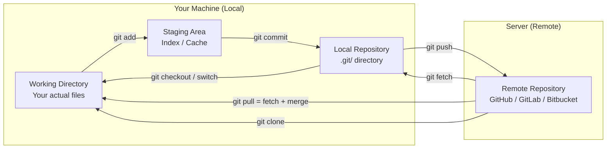
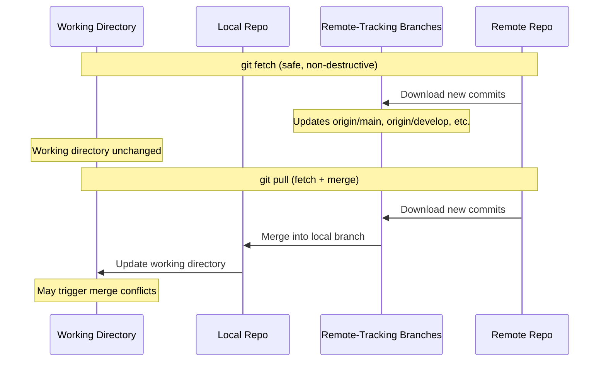

# Local vs Remote Repository

## Quick Reference

- Local repository: the `.git/` directory on your machine containing full project history
- Remote repository: a hosted copy on GitHub, GitLab, Bitbucket, or a private server
- `git clone` — create a local copy of a remote repository
- `git remote -v` — list configured remote repositories
- `git push` — upload local commits to the remote
- `git pull` — download and merge remote changes locally
- `git fetch` — download remote changes without merging (safe inspection)
- `origin` — the default name for the remote you cloned from
- `upstream` — conventional name for the original repo when working on a fork
- Remote-tracking branches (e.g., `origin/main`) are read-only local references to remote state

---

## When to Use

Understanding the local vs remote distinction is essential for every Git workflow. You work with your local repository constantly — every `git add`, `git commit`, `git branch`, and `git log` operates entirely on your local machine without network access. Remote repositories come into play when you need to collaborate with others, back up your work, deploy code, or synchronize across multiple machines. Use `git push` when you want to share completed work with your team. Use `git pull` or `git fetch` when you need to incorporate others' changes. Use `git clone` when joining an existing project. The distributed nature of Git means you can work productively offline, committing and branching locally, then synchronize everything when connectivity is available. This architecture also provides natural redundancy — every clone is a full backup of the repository.

---

## Code Examples

### Setting Up Remotes

```bash
# Clone a remote repository (automatically sets up 'origin')
git clone https://github.com/team/project.git

# View configured remotes
git remote -v
# origin  https://github.com/team/project.git (fetch)
# origin  https://github.com/team/project.git (push)

# Add a second remote (e.g., for a fork workflow)
git remote add upstream https://github.com/original/project.git

# Rename a remote
git remote rename origin github

# Remove a remote
git remote remove old-remote

# Change a remote's URL (e.g., switching from HTTPS to SSH)
git remote set-url origin git@github.com:team/project.git
```

### Synchronizing Local and Remote

```bash
# Push current branch to remote (first time, set upstream)
git push -u origin feature/new-api

# Push to remote (after upstream is set)
git push

# Fetch all remote changes without merging
git fetch --all

# See what changed on remote since last fetch
git log HEAD..origin/main --oneline

# Pull remote changes (fetch + merge)
git pull origin main

# Pull with rebase (cleaner history)
git pull --rebase origin main

# Push all local branches to remote
git push --all origin

# Push tags to remote
git push --tags
```

### Working with Remote Branches

```bash
# List remote-tracking branches
git branch -r

# List all branches (local + remote)
git branch -a

# Create a local branch tracking a remote branch
git switch --track origin/feature/payment

# Delete a remote branch
git push origin --delete feature/old-branch

# Prune stale remote-tracking branches (deleted on remote)
git fetch --prune

# See tracking relationship for all branches
git branch -vv
```

---

## Architecture Diagram



### Git Fetch vs Git Pull



The key difference is safety. `git fetch` downloads all new data from the remote but does not modify your working directory or local branches. It updates remote-tracking branches (like `origin/main`) which you can inspect before deciding to merge. `git pull` combines `git fetch` with `git merge` (or `git rebase` with `--rebase`), automatically integrating remote changes into your current branch. This can trigger merge conflicts if you have local changes that conflict with remote updates.

---

## Key Differences

| Feature | Local Repository | Remote Repository |
| --- | --- | --- |
| **Location** | `.git/` on your machine | Server (GitHub, GitLab, etc.) |
| **Network required** | No — all operations are local | Yes — push, pull, fetch need network |
| **Access** | Only you (unless shared filesystem) | Team members with permissions |
| **Speed** | Instant (disk operations only) | Depends on network latency and repo size |
| **Operations** | commit, branch, merge, log, diff, stash | push, pull, fetch, clone, fork |
| **Backup** | Only on your disk (risk of loss) | Hosted with redundancy and backups |
| **Collaboration** | Single developer | Multiple developers simultaneously |
| **Branch visibility** | Only your local branches | All pushed branches visible to team |

---

## Common Pitfalls

- **Pushing without pulling first**: If the remote has commits you do not have locally, `git push` will be rejected. Always `git pull` (or `git fetch` + `git merge`) before pushing to avoid this.
- **Confusing `origin/main` with `main`**: `origin/main` is a remote-tracking branch (a local snapshot of the remote's state at last fetch). `main` is your local branch. They can diverge if you do not fetch regularly.
- **Forgetting to set upstream tracking**: Without `-u` on first push, Git does not know which remote branch to push to by default. Use `git push -u origin branch-name` to establish the tracking relationship.
- **Working offline without fetching first**: If you go offline without a recent fetch, your remote-tracking branches are stale. Fetch frequently when online so you have an accurate picture of remote state.
- **Force pushing to shared remotes**: `git push --force` overwrites remote history, potentially destroying teammates' work. Use `--force-with-lease` which fails if someone else has pushed since your last fetch.
- **Not pruning deleted remote branches**: After branches are deleted on the remote (post-merge), your local remote-tracking references remain. Run `git fetch --prune` periodically to clean up stale references.

---

## Interview Questions

**Q1: What is the difference between `git fetch` and `git pull`?**
`git fetch` downloads commits, branches, and tags from the remote without modifying your working directory or local branches. It updates remote-tracking branches only. `git pull` is `git fetch` followed by `git merge` (or `git rebase` with `--rebase` flag), automatically integrating remote changes into your current branch. Fetch is safer for inspection; pull is convenient for quick synchronization.

**Q2: Explain what happens when you run `git clone`.**
`git clone` creates a new directory, initializes a `.git/` repository inside it, adds the source URL as a remote named `origin`, fetches all branches and commits from that remote, creates remote-tracking branches for each remote branch, checks out the default branch (usually `main`), and sets up the local `main` to track `origin/main`. You get a complete copy of the repository with full history.

**Q3: How does Git's distributed model differ from centralized VCS like SVN?**
In Git, every clone is a full repository with complete history, enabling offline work, fast local operations, and natural redundancy. In SVN, there is one central server; developers check out working copies without full history and need network access for most operations. Git's model enables workflows like forking, local branching, and peer-to-peer sharing that are impossible in centralized systems.

**Q4: What are remote-tracking branches and how do they work?**
Remote-tracking branches (e.g., `origin/main`, `origin/develop`) are read-only local references that represent the state of branches on the remote at the time of your last `git fetch`. They cannot be checked out directly (doing so puts you in detached HEAD state). They serve as bookmarks showing where the remote branches were, allowing you to compare your local work against the remote state.

**Q5: How would you set up a repository with multiple remotes and why?**
Use `git remote add <name> <url>` to add additional remotes. Common scenarios include fork workflows (origin = your fork, upstream = original repo), deploying to multiple environments (production, staging remotes), or mirroring to multiple hosting platforms. You fetch from upstream to stay current, push to origin for your work, and can push to deployment remotes for releases.

---

## Production Tips

- **Use SSH keys instead of HTTPS for remote access**: SSH keys provide passwordless authentication and are more secure than storing HTTPS credentials. Configure your SSH agent to avoid repeated passphrase entry. This is especially important for CI/CD systems that need automated push access.
- **Set up fetch pruning by default**: Configure `git config --global fetch.prune true` so that every fetch automatically removes stale remote-tracking branches. This keeps your branch list clean and prevents confusion about which branches still exist on the remote.
- **Use shallow clones in CI/CD pipelines**: For large repositories, `git clone --depth 1` or `git clone --filter=blob:none` dramatically reduces clone time in CI environments where full history is unnecessary. This can cut pipeline setup time from minutes to seconds.
- **Monitor remote repository size**: Large repositories slow down clones, fetches, and CI pipelines. Track repository size over time and use Git LFS for large binary files, `.gitignore` for build artifacts, and periodic history cleanup for accidentally committed large files.
- **Configure push.default for safety**: Set `git config --global push.default current` to push only the current branch by default, preventing accidental pushes of other local branches. For even more safety, use `simple` (the default since Git 2.0) which also requires upstream tracking.

---

## Related Topics

- [What is Git](./what-is-git.md) — foundational concepts of Git's distributed architecture
- [Git Commands](./git-commands.md) — complete reference for push, pull, fetch, and remote commands
- [Git Branching](./git-branching.md) — how branches work across local and remote repositories
- [Pull Requests](./pull-requests.md) — collaboration workflows that bridge local and remote work
