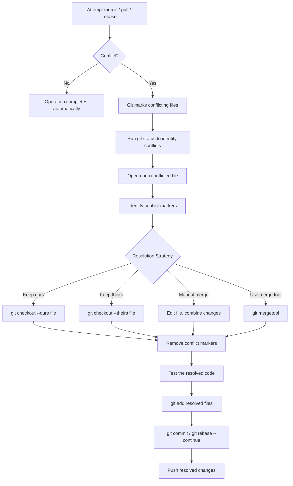
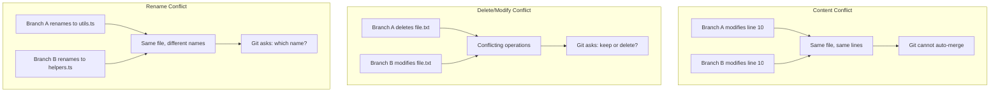

# Merge Conflicts

## Quick Reference

- A merge conflict occurs when Git cannot automatically reconcile changes to the same lines in different branches
- Conflict markers: `<<<<<<< HEAD`, `=======`, `>>>>>>> branch-name`
- Resolution workflow: identify conflicts → edit files → remove markers → `git add` → `git commit`
- `git merge --abort` — cancel a merge and return to pre-merge state
- `git diff --check` — check for conflict markers before committing
- `git mergetool` — launch configured visual merge tool
- Conflicts can occur during: `git merge`, `git rebase`, `git pull`, `git cherry-pick`, `git stash pop`
- Prevention: frequent pulls, small branches, clear code ownership, communication

---

## When to Use

Merge conflict resolution is not something you choose to do — it is something you must handle when Git cannot automatically combine changes. Conflicts arise when two branches modify the same lines of the same file, when one branch deletes a file that another branch modifies, or when both branches add different content at the same location. You will encounter conflicts most frequently when pulling remote changes that overlap with your local work, when merging long-lived feature branches back into main, during interactive rebases that replay commits onto a changed base, and when cherry-picking commits that touch code that has since been modified. Understanding conflict resolution is a critical skill because avoiding conflicts entirely is impossible in collaborative development. The goal is to minimize their frequency through good practices and resolve them quickly and correctly when they occur.

---

## Code Examples

### Triggering and Resolving a Conflict

```bash
# Attempt to merge a branch (conflict occurs)
git merge feature/update-header
# Auto-merging src/components/Header.tsx
# CONFLICT (content): Merge conflict in src/components/Header.tsx
# Automatic merge failed; fix conflicts and then commit the result.

# Check which files have conflicts
git status
# Both modified: src/components/Header.tsx

# Open the conflicted file and resolve manually
# (edit the file, choose correct code, remove markers)

# After resolving, stage the file
git add src/components/Header.tsx

# Complete the merge with a commit
git commit -m "Merge feature/update-header, resolve header conflict"
```

### Understanding Conflict Markers

```text
<<<<<<< HEAD
// Your current branch's version
const title = "Dashboard - Admin Panel";
const subtitle = "Welcome back, administrator";
=======
// Incoming branch's version
const title = "Dashboard - User Portal";
const subtitle = "Welcome back";
>>>>>>> feature/update-header
```

```text
// After resolution (choosing to combine both):
const title = "Dashboard - User Portal";
const subtitle = "Welcome back, administrator";
```

### Using Merge Strategies

```bash
# Accept all changes from current branch (ours)
git checkout --ours path/to/file.txt
git add path/to/file.txt

# Accept all changes from incoming branch (theirs)
git checkout --theirs path/to/file.txt
git add path/to/file.txt

# Abort the merge entirely (return to pre-merge state)
git merge --abort

# During a rebase, skip a conflicting commit
git rebase --skip

# During a rebase, continue after resolving
git rebase --continue

# Abort a rebase in progress
git rebase --abort
```

### Preventing Conflicts with Rerere

```bash
# Enable rerere (reuse recorded resolution)
git config --global rerere.enabled true

# Git will remember how you resolved a conflict
# and automatically apply the same resolution next time
# the same conflict appears (common during rebases)

# View recorded resolutions
git rerere status

# Forget a recorded resolution
git rerere forget path/to/file.txt
```

---

## Conflict Resolution Flow



### Types of Conflicts



---

## Common Pitfalls

- **Blindly accepting "ours" or "theirs" without understanding**: Using `--ours` or `--theirs` for every conflict without reading the code leads to lost functionality or introduced bugs. Always understand what both sides intended before choosing.
- **Leaving conflict markers in committed code**: Accidentally committing files with `<<<<<<<`, `=======`, or `>>>>>>>` markers breaks the application. Use `git diff --check` before committing to catch leftover markers, or configure a pre-commit hook.
- **Not testing after resolution**: Resolving conflicts syntactically (removing markers) does not guarantee the code works correctly. Always run tests and verify the application builds after resolving conflicts before committing.
- **Resolving conflicts in large batches**: When multiple files conflict, resolving them all at once increases the chance of mistakes. Resolve one file at a time, test incrementally, and stage each resolved file individually.
- **Ignoring the merge base**: Conflicts show "ours" vs "theirs" but understanding the common ancestor (merge base) provides crucial context. Use `git merge-base main feature` and three-way diff tools to see what each side actually changed.
- **Not communicating with the other developer**: When conflicts involve another developer's code, do not guess their intent. Reach out to understand what they were trying to accomplish before deciding how to combine the changes.

---

## Interview Questions

**Q1: What causes a merge conflict and how do you resolve one?**
A merge conflict occurs when two branches modify the same lines of the same file, or when one branch deletes a file that another modifies. To resolve: open the conflicted file, understand both versions by reading the conflict markers, decide which changes to keep or how to combine them, remove the markers, test the result, then `git add` and `git commit` to complete the merge.

**Q2: What is the difference between `git merge --abort` and `git reset --hard`?**
`git merge --abort` cleanly cancels an in-progress merge, restoring the repository to its pre-merge state. It only works during an active merge. `git reset --hard` discards all uncommitted changes and moves the branch pointer, which is more destructive and can be used outside of merge contexts. Prefer `--abort` during merges as it is purpose-built and safer.

**Q3: How would you minimize merge conflicts in a team environment?**
Keep branches short-lived (1-3 days), pull from main frequently to stay current, break work into small focused commits, establish clear code ownership so developers rarely modify the same files, use feature flags instead of long-lived branches, communicate about overlapping work, and configure CI to require branches be up-to-date before merging.

**Q4: Explain `git rerere` and when it is useful.**
`git rerere` (reuse recorded resolution) records how you resolve conflicts and automatically applies the same resolution when the identical conflict appears again. It is particularly useful during repeated rebases where the same conflicts recur, or when maintaining long-lived branches that are regularly synced with main. Enable with `git config rerere.enabled true`.

**Q5: What is a three-way merge and why does Git use it?**
A three-way merge uses three reference points: the two branch tips being merged and their common ancestor (merge base). By comparing each branch against the ancestor, Git can determine what each side changed independently. If only one side changed a section, Git takes that change. If both sides changed the same section differently, Git declares a conflict. This is more accurate than a two-way diff which cannot distinguish additions from deletions.

---

## Production Tips

- **Configure a visual merge tool**: Set up a tool like VS Code, IntelliJ, or `meld` as your default mergetool (`git config --global merge.tool vscode`). Visual three-way merge views make complex conflicts much easier to resolve correctly than editing markers in a text editor.
- **Enable rerere for repeated rebases**: If your workflow involves frequently rebasing feature branches onto an updated main, `git config rerere.enabled true` saves significant time by automatically resolving conflicts you have already handled.
- **Use CI checks to prevent conflict-prone merges**: Configure your CI pipeline to require branches be up-to-date with main before merging. This catches conflicts at PR time rather than after merge, when they are harder to attribute and fix.
- **Establish code ownership boundaries**: When possible, organize code so that different features or modules are owned by different developers or teams. Clear boundaries reduce the frequency of conflicts because developers rarely modify the same files simultaneously.
- **Document conflict resolution decisions**: When resolving non-trivial conflicts, add a comment in the commit message explaining why you chose a particular resolution. This helps future developers understand the decision if the merged code behaves unexpectedly.

---

## Related Topics

- [Git Branching](./git-branching.md) — branching strategies that minimize conflict frequency
- [Git Commands](./git-commands.md) — commands for merging, rebasing, and conflict resolution
- [Pull Requests](./pull-requests.md) — how conflicts surface during the PR review process
- [Local vs Remote](./local-vs-remote.md) — how pulling remote changes can trigger conflicts
