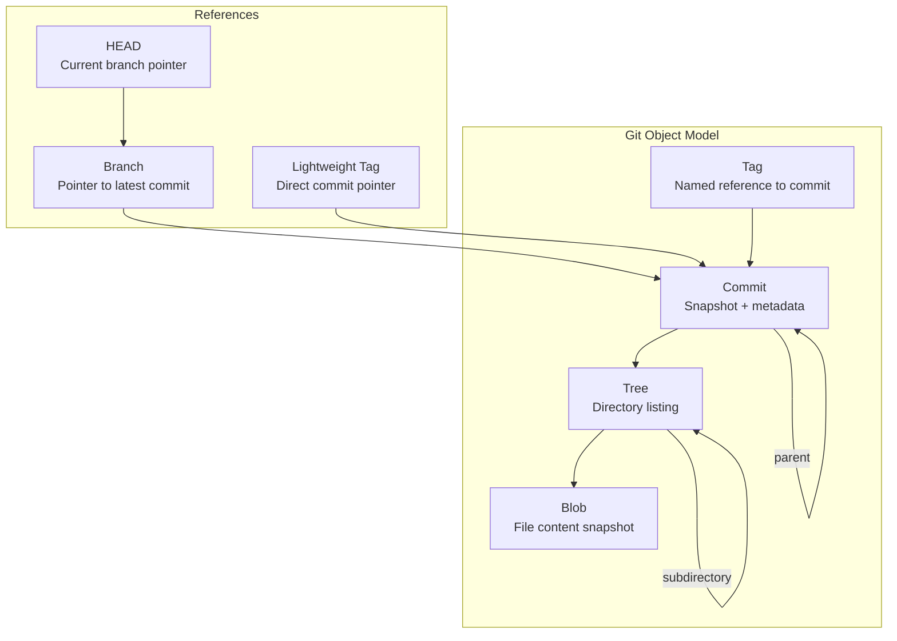
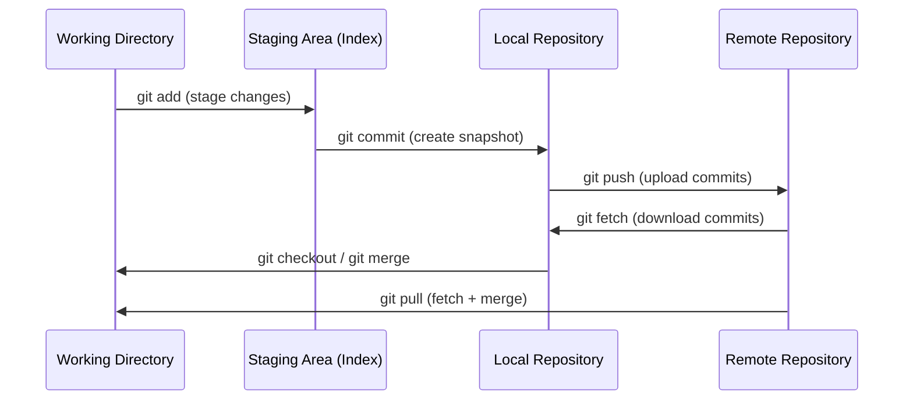

# What is Git

## Quick Reference

- Git is a distributed version control system where every developer has a full copy of the repository history
- Three main areas: Working Directory, Staging Area (Index), and Local Repository
- Core operations: `git init`, `git clone`, `git add`, `git commit`, `git push`, `git pull`
- Git tracks content by SHA-1 hashes, making every commit uniquely identifiable
- Branching is lightweight — creating a branch is just creating a pointer to a commit
- Git stores snapshots of files, not diffs (unlike older VCS tools like SVN)
- The `.git/` directory contains the entire repository database, hooks, and configuration

---

## When to Use

Git is the standard version control system for virtually all modern software development. Use Git when you need to track changes to any text-based files, collaborate with other developers, or maintain a history of your project's evolution. Git excels in scenarios where multiple developers work on the same codebase simultaneously, where you need to experiment with features in isolation, or where you need to maintain multiple release versions of software. Even for solo projects, Git provides invaluable safety nets through its commit history, allowing you to revert mistakes and understand why changes were made. Git is appropriate for any project larger than a throwaway script, including documentation repositories, infrastructure-as-code, configuration management, and data science notebooks. The only scenarios where Git may not be ideal are for large binary files (though Git LFS addresses this) or for extremely large monorepos where specialized tools like Perforce may be preferred.

---

## Code Examples

### Initializing a Repository

```bash
# Create a new Git repository in the current directory
git init

# This creates a .git/ directory with the following structure:
# .git/
#   HEAD          - Points to current branch
#   config        - Repository-specific configuration
#   objects/      - Object database (commits, trees, blobs)
#   refs/         - Branch and tag pointers
```

### Cloning and Basic Workflow

```bash
# Clone a remote repository to your local machine
git clone https://github.com/user/repository.git

# Check the status of your working directory
git status

# Stage specific files for commit
git add src/feature.js tests/feature.test.js

# Stage all changes (new, modified, deleted)
git add .

# Commit staged changes with a descriptive message
git commit -m "Add user authentication feature with JWT tokens"

# Push commits to the remote repository
git push origin main

# Pull latest changes from remote and merge into current branch
git pull origin main
```

### Viewing History

```bash
# View commit log with graph visualization
git log --oneline --graph --decorate --all

# Show details of a specific commit
git show abc1234

# See who last modified each line of a file
git blame src/app.js

# Search commit messages for a keyword
git log --grep="bugfix"
```

---

## Architecture and Data Model



Git uses a content-addressable filesystem built on four object types. A **blob** stores the contents of a single file. A **tree** represents a directory, mapping filenames to blobs or other trees. A **commit** points to a tree (the project snapshot) and contains metadata like author, timestamp, message, and parent commit references. A **tag** is a named pointer to a specific commit, typically used for release versions. Every object is identified by its SHA-1 hash, which means identical content always produces the same hash, enabling efficient deduplication and integrity verification.



---

## Common Pitfalls

- **Committing sensitive data**: Accidentally committing API keys, passwords, or `.env` files to the repository. Once pushed, secrets remain in Git history even after deletion. Use `.gitignore` proactively and tools like `git-secrets` or `trufflehog` to scan for leaked credentials.
- **Working directly on main**: Making changes directly on the main branch instead of feature branches leads to messy history and makes collaboration difficult. Always branch for new work.
- **Large commits with vague messages**: Committing many unrelated changes with messages like "updates" or "fix stuff" makes it impossible to understand history or revert specific changes. Commit small, logical units with descriptive messages.
- **Forgetting to pull before push**: Pushing without first pulling remote changes causes rejected pushes or unnecessary merge commits. Always `git pull --rebase` before pushing.
- **Confusing `git reset --hard` with safe operations**: Running `git reset --hard` permanently discards uncommitted changes. Use `git stash` or `git reset --soft` when you want to preserve work.
- **Not understanding detached HEAD state**: Checking out a specific commit instead of a branch puts you in detached HEAD state. Any commits made here can be lost if you switch branches without creating a new branch first.

---

## Interview Questions

**Q1: What is the difference between Git and GitHub?**
Git is a distributed version control system that runs locally on your machine and manages source code history. GitHub is a cloud-hosted platform that provides remote repository hosting, pull request workflows, issue tracking, and CI/CD integration built on top of Git.

**Q2: Explain the three-tree architecture in Git.**
Git maintains three main data structures: the Working Directory (your actual files on disk), the Staging Area or Index (a snapshot of what will go into the next commit), and the Repository (the committed history stored in `.git/`). Changes flow from working directory to staging via `git add`, and from staging to repository via `git commit`.

**Q3: What is a SHA-1 hash in Git and why is it important?**
Every Git object (blob, tree, commit, tag) is identified by a 40-character SHA-1 hash computed from its content. This provides content integrity verification, efficient deduplication, and unique identification of every snapshot in the repository's history.

**Q4: How does Git differ from centralized version control systems like SVN?**
Git is distributed, meaning every developer has a complete copy of the repository including full history, enabling offline work and faster operations. SVN is centralized with a single server holding the canonical repository. Git branches are lightweight pointers while SVN branches are full directory copies. Git stores snapshots while SVN stores diffs.

**Q5: What happens internally when you run `git commit`?**
Git creates a tree object representing the current staging area contents, then creates a commit object pointing to that tree with metadata (author, timestamp, message, parent commit hash). The current branch pointer advances to the new commit, and HEAD continues pointing to the branch.

---

## Real-World Use Cases

Git is used across virtually every domain of software development. In enterprise environments, teams use Git with branching strategies like Git Flow to manage complex release cycles with multiple environments (development, staging, production). Open-source projects rely on Git's fork-and-pull-request model to accept contributions from thousands of developers worldwide without granting direct write access. DevOps teams use Git as the single source of truth for infrastructure-as-code, storing Terraform configurations, Kubernetes manifests, and CI/CD pipeline definitions alongside application code. Data science teams version Jupyter notebooks and model configurations in Git, enabling reproducibility and collaboration on experiments. Documentation teams use Git to manage technical writing with the same review workflows as code, ensuring accuracy through peer review. Game development studios use Git with LFS (Large File Storage) to version both code and binary assets like textures and models. Even non-technical teams adopt Git-based workflows through platforms like GitHub for managing legal documents, research papers, and policy documents where change tracking and approval workflows are valuable.

## Production Tips

- **Use signed commits in production workflows**: Configure GPG signing (`git config commit.gpgsign true`) to verify commit authorship in regulated environments. This prevents impersonation and satisfies audit requirements.
- **Implement branch protection rules**: On your remote platform, require pull request reviews, passing CI checks, and linear history before merging to main. This prevents accidental force pushes and ensures code quality.
- **Use shallow clones in CI/CD**: For large repositories, `git clone --depth 1` significantly reduces clone time in CI pipelines where full history is unnecessary. Use `--filter=blob:none` for even more efficient partial clones.
- **Configure `.gitattributes` for consistent line endings**: Set `* text=auto` to normalize line endings across Windows and Unix systems, preventing spurious diffs and merge conflicts caused by CRLF vs LF differences.
- **Tag releases with semantic versioning**: Use annotated tags (`git tag -a v1.2.3 -m "Release 1.2.3"`) for production releases. This creates a permanent, signed reference point for deployments and rollbacks.

---

## Related Topics

- [Git Commands](./git-commands.md) — comprehensive reference for all common Git operations
- [Git Branching](./git-branching.md) — branching strategies and workflows for team collaboration
- [Local vs Remote](./local-vs-remote.md) — understanding the distributed nature of Git repositories
- [Pull Requests](./pull-requests.md) — code review workflows built on Git's branching model
