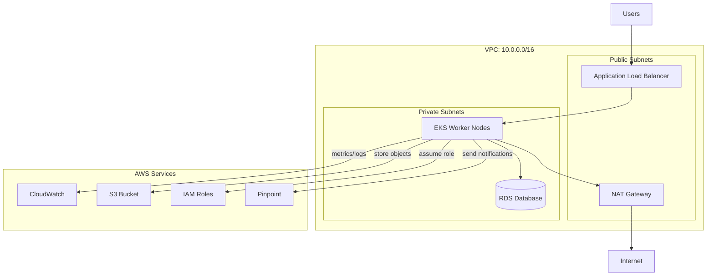
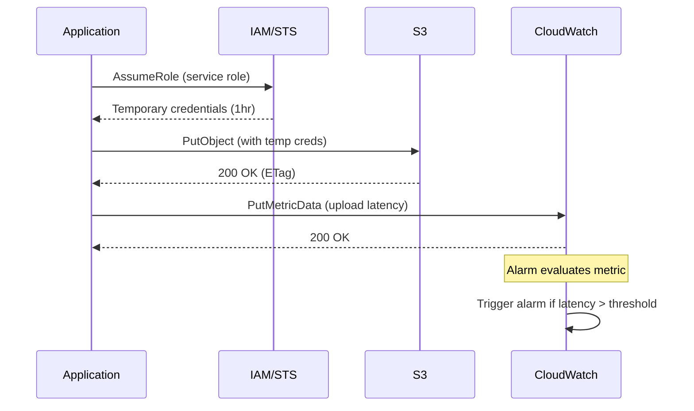

# AWS Services

## Quick Reference

- AWS (Amazon Web Services) provides 200+ cloud services spanning compute, storage, networking, monitoring, and security
- CloudWatch: centralized monitoring and observability for metrics, logs, alarms, and dashboards
- S3 (Simple Storage Service): object storage with 99.999999999% (11 nines) durability and tiered storage classes
- Pinpoint: multi-channel customer engagement platform for push notifications, email, SMS, and in-app messaging
- EKS (Elastic Kubernetes Service): managed Kubernetes control plane with AWS integrations for networking, IAM, and scaling
- IAM (Identity and Access Management): fine-grained access control using policies, roles, users, and groups with least-privilege principle
- VPC (Virtual Private Cloud): isolated network environment with subnets, route tables, security groups, and NACLs

## When to Use

AWS services form the backbone of modern cloud-native applications. Use CloudWatch when you need centralized observability across your infrastructure, including custom metrics from application code, log aggregation from distributed services, and automated alerting on threshold breaches. Choose S3 for any object storage need from static asset hosting to data lake foundations, backup archives, and cross-region replication for disaster recovery. Pinpoint is the right choice when you need to engage users through targeted campaigns across multiple channels with analytics on delivery and engagement. EKS is appropriate when your team already uses Kubernetes and wants AWS to manage the control plane while retaining full Kubernetes API compatibility. IAM is not optional but rather the foundation of every AWS deployment, governing who can access what resources under which conditions. VPC provides the network isolation layer that every production workload requires, enabling you to define private subnets for databases, public subnets for load balancers, and transit gateways for cross-account connectivity.

## Code Examples

### CloudWatch Custom Metrics and Alarms

```java
// Publishing custom metrics from a Spring Boot application
@Component
public class OrderMetricsPublisher {
    private final CloudWatchClient cloudWatch;

    public OrderMetricsPublisher() {
        this.cloudWatch = CloudWatchClient.builder()
            .region(Region.US_EAST_1)
            .build();
    }

    public void publishOrderLatency(double latencyMs, String endpoint) {
        PutMetricDataRequest request = PutMetricDataRequest.builder()
            .namespace("MyApp/Orders")
            .metricData(MetricDatum.builder()
                .metricName("OrderProcessingLatency")
                .value(latencyMs)
                .unit(StandardUnit.MILLISECONDS)
                .dimensions(
                    Dimension.builder()
                        .name("Endpoint")
                        .value(endpoint)
                        .build(),
                    Dimension.builder()
                        .name("Environment")
                        .value("production")
                        .build()
                )
                .timestamp(Instant.now())
                .build())
            .build();

        cloudWatch.putMetricData(request);
    }
}
```

### S3 Operations with Lifecycle Policies

```java
// S3 client with multipart upload for large files
@Service
public class DocumentStorageService {
    private final S3Client s3;
    private static final String BUCKET = "my-app-documents";

    public String uploadDocument(InputStream content, String key, long size) {
        PutObjectRequest request = PutObjectRequest.builder()
            .bucket(BUCKET)
            .key(key)
            .contentType("application/pdf")
            .serverSideEncryption(ServerSideEncryption.AES256)
            .metadata(Map.of(
                "uploaded-by", SecurityContextHolder.getContext()
                    .getAuthentication().getName(),
                "upload-timestamp", Instant.now().toString()
            ))
            .build();

        s3.putObject(request, RequestBody.fromInputStream(content, size));
        return String.format("s3://%s/%s", BUCKET, key);
    }

    public URL generatePresignedUrl(String key, Duration expiration) {
        S3Presigner presigner = S3Presigner.builder()
            .region(Region.US_EAST_1)
            .build();

        GetObjectRequest getRequest = GetObjectRequest.builder()
            .bucket(BUCKET)
            .key(key)
            .build();

        GetObjectPresignRequest presignRequest = GetObjectPresignRequest.builder()
            .signatureDuration(expiration)
            .getObjectRequest(getRequest)
            .build();

        return presigner.presignGetObject(presignRequest).url();
    }
}
```

### IAM Policy Document

```json
{
  "Version": "2012-10-17",
  "Statement": [
    {
      "Sid": "AllowS3ReadOnly",
      "Effect": "Allow",
      "Action": [
        "s3:GetObject",
        "s3:ListBucket"
      ],
      "Resource": [
        "arn:aws:s3:::my-app-documents",
        "arn:aws:s3:::my-app-documents/*"
      ],
      "Condition": {
        "StringEquals": {
          "aws:RequestedRegion": "us-east-1"
        },
        "Bool": {
          "aws:SecureTransport": "true"
        }
      }
    },
    {
      "Sid": "DenyDeleteOperations",
      "Effect": "Deny",
      "Action": [
        "s3:DeleteObject",
        "s3:DeleteBucket"
      ],
      "Resource": "*"
    }
  ]
}
```

### VPC with Terraform

```hcl
# VPC with public and private subnets across two AZs
resource "aws_vpc" "main" {
  cidr_block           = "10.0.0.0/16"
  enable_dns_hostnames = true
  enable_dns_support   = true

  tags = { Name = "production-vpc" }
}

resource "aws_subnet" "public" {
  count             = 2
  vpc_id            = aws_vpc.main.id
  cidr_block        = cidrsubnet(aws_vpc.main.cidr_block, 8, count.index)
  availability_zone = data.aws_availability_zones.available.names[count.index]

  map_public_ip_on_launch = true
  tags = { Name = "public-subnet-${count.index}" }
}

resource "aws_subnet" "private" {
  count             = 2
  vpc_id            = aws_vpc.main.id
  cidr_block        = cidrsubnet(aws_vpc.main.cidr_block, 8, count.index + 10)
  availability_zone = data.aws_availability_zones.available.names[count.index]

  tags = { Name = "private-subnet-${count.index}" }
}

resource "aws_nat_gateway" "main" {
  allocation_id = aws_eip.nat.id
  subnet_id     = aws_subnet.public[0].id
}

resource "aws_security_group" "app" {
  vpc_id = aws_vpc.main.id

  ingress {
    from_port   = 443
    to_port     = 443
    protocol    = "tcp"
    cidr_blocks = ["0.0.0.0/0"]
  }

  egress {
    from_port   = 0
    to_port     = 0
    protocol    = "-1"
    cidr_blocks = ["0.0.0.0/0"]
  }
}
```

## Architecture and Diagrams





## CloudWatch

CloudWatch is the centralized observability service for all AWS resources and custom application metrics. It collects metrics at one-minute granularity by default (configurable to one-second with high-resolution metrics), aggregates logs from multiple sources through CloudWatch Logs, and triggers automated actions through CloudWatch Alarms.

**Operational Use Case: Automated Scaling Based on Custom Metrics**

In a production order processing system, CloudWatch custom metrics track queue depth and processing latency. When the `OrderQueueDepth` metric exceeds 1000 messages for three consecutive evaluation periods (each five minutes), a CloudWatch Alarm triggers an Auto Scaling policy that adds EKS pods via KEDA (Kubernetes Event-Driven Autoscaling). The alarm also publishes to an SNS topic that notifies the on-call engineer. CloudWatch Logs Insights queries help the team analyze processing bottlenecks by correlating latency spikes with specific order types or downstream service degradation. Dashboards aggregate these metrics into a single pane of glass showing real-time system health across all microservices.

Key operational patterns include setting up composite alarms that combine multiple metric conditions (high latency AND high error rate) to reduce alert noise, using metric math expressions to calculate derived metrics like error percentages, and configuring log metric filters to extract business KPIs from structured log events.

## S3

S3 provides virtually unlimited object storage with built-in redundancy across multiple Availability Zones. Objects are organized into buckets with flat namespaces (prefixes simulate folders), and each object can be up to 5 TB in size. S3 supports versioning, lifecycle policies, cross-region replication, and multiple storage classes optimized for different access patterns.

**Operational Use Case: Data Lake with Tiered Storage and Access Controls**

A financial services application uses S3 as the foundation of its data lake architecture. Raw transaction data lands in S3 Standard storage class, where it is immediately available for real-time analytics via Athena queries. After 30 days, lifecycle policies automatically transition objects to S3 Intelligent-Tiering, which monitors access patterns and moves infrequently accessed data to cheaper storage tiers without retrieval delays. After 90 days, data moves to S3 Glacier Instant Retrieval for compliance archival. Bucket policies enforce encryption at rest (SSE-S3 or SSE-KMS), require HTTPS for all transfers, and restrict access to specific VPC endpoints. S3 Event Notifications trigger Lambda functions on object creation to kick off ETL pipelines, validate file formats, and update metadata catalogs. Cross-region replication ensures disaster recovery with RPO under 15 minutes.

Storage class selection, lifecycle transitions, and access logging are critical operational concerns. Enable S3 Access Logs and CloudTrail data events to audit who accessed which objects and when, supporting both security investigations and compliance requirements.

## Pinpoint

Amazon Pinpoint is a multi-channel customer engagement service that enables targeted messaging through push notifications, email, SMS, voice, and in-app messages. It provides audience segmentation, campaign management, journey orchestration, and delivery analytics in a single platform.

**Operational Use Case: Transactional Notifications with Delivery Tracking**

An e-commerce platform uses Pinpoint to send order confirmation emails, shipping notifications via SMS, and promotional push notifications to mobile app users. The system creates dynamic segments based on user behavior (cart abandonment, purchase history, app engagement) and triggers automated journeys. When a user abandons their cart, Pinpoint initiates a journey that sends a reminder email after one hour, followed by a push notification with a discount code after 24 hours if the cart remains abandoned. Delivery metrics (bounce rate, open rate, click-through rate) feed back into CloudWatch for operational monitoring. The team sets alarms on bounce rates exceeding 5% to detect email deliverability issues early. Pinpoint's event stream publishes engagement events to Kinesis Data Firehose for long-term analytics in the data lake.

Operational considerations include managing sender reputation through proper email authentication (SPF, DKIM, DMARC), implementing suppression lists to honor unsubscribe requests, and monitoring SMS spend limits to prevent unexpected charges from high-volume campaigns.

## EKS

Amazon Elastic Kubernetes Service (EKS) provides a managed Kubernetes control plane that runs across multiple Availability Zones for high availability. EKS handles control plane upgrades, etcd management, and API server scaling while you manage worker nodes (EC2 instances or Fargate pods). It integrates natively with AWS services through IAM Roles for Service Accounts (IRSA), VPC CNI networking, and Application Load Balancer ingress.

**Operational Use Case: Zero-Downtime Deployments with Cluster Autoscaling**

A microservices platform runs 50+ services on EKS with managed node groups spanning three Availability Zones. The Cluster Autoscaler monitors pending pods and scales node groups between 3 and 50 nodes based on resource requests. Deployments use rolling update strategy with `maxSurge: 25%` and `maxUnavailable: 0` to ensure zero downtime during releases. Pod Disruption Budgets prevent voluntary evictions from reducing service replicas below minimum thresholds during node scaling or maintenance. IRSA assigns fine-grained IAM permissions to individual pods rather than entire nodes, following least-privilege principles. The AWS Load Balancer Controller provisions ALBs from Kubernetes Ingress resources, routing traffic based on path rules and supporting weighted target groups for canary deployments. Fluent Bit DaemonSets ship container logs to CloudWatch Logs, while Prometheus with the CloudWatch agent exports custom metrics for application-level monitoring.

Key operational patterns include configuring PodTopologySpreadConstraints for even distribution across AZs, using Karpenter for faster and more cost-efficient node provisioning, and implementing GitOps with ArgoCD for declarative cluster state management.

## IAM

IAM controls authentication and authorization for every AWS API call. It uses a policy evaluation engine that processes identity-based policies (attached to users, groups, roles), resource-based policies (attached to resources like S3 buckets), permission boundaries, service control policies (SCPs), and session policies. The evaluation follows an explicit deny > explicit allow > implicit deny hierarchy.

**Operational Use Case: Cross-Account Access with Least-Privilege Roles**

A multi-account AWS organization uses IAM roles for cross-account access between development, staging, and production accounts. Developers assume a read-only role in production for debugging, while the CI/CD pipeline assumes a deployment role with permissions scoped to specific EKS clusters and ECR repositories. Service accounts in EKS pods use IRSA to assume IAM roles that grant access only to the specific S3 buckets and DynamoDB tables each service needs. Permission boundaries prevent any role from escalating privileges beyond what the security team has approved, even if an administrator accidentally attaches overly broad policies. AWS Organizations SCPs enforce guardrails across all accounts, preventing actions like disabling CloudTrail, deleting VPC flow logs, or launching resources in unapproved regions. IAM Access Analyzer continuously monitors resource policies and flags any unintended external access, generating findings that feed into the security team's remediation workflow.

Operational best practices include rotating access keys every 90 days, enforcing MFA for all human users, using IAM Roles Anywhere for on-premises workloads, and regularly reviewing unused permissions with IAM Access Advisor to tighten policies over time.

## VPC

VPC provides a logically isolated network within AWS where you control IP addressing, subnets, route tables, and network gateways. Each VPC spans a single region but can include subnets in multiple Availability Zones. Security groups (stateful, instance-level) and Network ACLs (stateless, subnet-level) provide layered network security.

**Operational Use Case: Multi-Tier Network Architecture with Transit Gateway**

A production environment uses a hub-and-spoke VPC architecture connected through AWS Transit Gateway. The shared services VPC hosts centralized logging, DNS resolution (Route 53 Resolver), and security tooling. Application VPCs contain public subnets (ALBs, NAT Gateways), private subnets (application tier, EKS nodes), and isolated subnets (databases, ElastiCache) with no internet route. VPC Flow Logs capture all network traffic metadata and ship to S3 for security analysis and anomaly detection. PrivateLink endpoints provide private connectivity to AWS services (S3, DynamoDB, ECR) without traversing the public internet, reducing data transfer costs and improving security posture. Security groups follow a zero-trust model where each tier only allows inbound traffic from the tier above on specific ports. Network ACLs provide an additional defense layer blocking known malicious IP ranges at the subnet boundary.

Operational considerations include CIDR planning to avoid overlaps across VPCs (critical for peering and Transit Gateway), monitoring NAT Gateway throughput and connection limits, using VPC Reachability Analyzer to troubleshoot connectivity issues, and implementing DNS firewall rules to prevent data exfiltration through DNS tunneling.

## Common Pitfalls

1. **Overly permissive IAM policies**: Teams often start with `"Action": "*"` or `"Resource": "*"` during development and never tighten permissions for production. This violates least-privilege and creates massive blast radius if credentials are compromised. Use IAM Access Analyzer to identify unused permissions and progressively narrow policies based on actual API calls recorded in CloudTrail.

2. **Ignoring S3 bucket public access settings**: S3 buckets are private by default, but misconfigured bucket policies or ACLs can expose sensitive data publicly. Always enable S3 Block Public Access at the account level and use AWS Config rules to detect and auto-remediate any bucket that becomes publicly accessible.

3. **CloudWatch alarm fatigue**: Setting alarms on every metric with aggressive thresholds leads to alert fatigue where engineers ignore notifications. Design alarms around actionable conditions using composite alarms that combine multiple signals, and ensure every alarm has a documented runbook explaining what to investigate and how to remediate.

4. **VPC CIDR exhaustion**: Choosing a small CIDR block (like /24) for a VPC limits future growth. Once assigned, VPC CIDRs cannot be changed without recreating the VPC. Plan for growth by using /16 blocks and documenting CIDR allocations across all accounts to prevent overlaps that block VPC peering and Transit Gateway attachments.

5. **Not using VPC endpoints for AWS service access**: Routing traffic to S3, DynamoDB, or other AWS services through NAT Gateways incurs data processing charges ($0.045/GB) and creates a single point of failure. Gateway endpoints for S3 and DynamoDB are free and provide private connectivity without traversing the public internet.

6. **EKS node group instance type mismatch**: Choosing instance types without considering pod resource requests leads to either wasted capacity (large instances with low utilization) or scheduling failures (too many pods for available resources). Right-size node groups by analyzing actual pod resource consumption and use Karpenter for just-in-time provisioning of optimal instance types.

## Real-World Use Cases

- **Multi-region disaster recovery**: A financial services company uses S3 cross-region replication to maintain copies of critical data in a secondary region. CloudWatch alarms monitor replication lag, and IAM roles with cross-account access enable automated failover scripts to redirect traffic through Route 53 health checks when the primary region experiences an outage.

- **Compliance-driven access control**: A healthcare platform uses IAM permission boundaries and SCPs to enforce HIPAA compliance across 20+ AWS accounts. Service control policies prevent any account from disabling CloudTrail, VPC Flow Logs, or GuardDuty. IAM roles for EKS pods use IRSA with condition keys that restrict access to specific DynamoDB tables containing PHI data only from pods running in designated namespaces.

- **Cost-optimized data pipeline**: An analytics team processes 10TB of daily event data using a pipeline that lands raw data in S3 Standard, processes it with EMR clusters running in private subnets, and transitions processed results to S3 Intelligent-Tiering. CloudWatch metrics track pipeline throughput and trigger alarms when processing falls behind. VPC endpoints eliminate data transfer costs between EMR and S3, saving over $15,000 monthly compared to NAT Gateway routing.

- **Customer engagement platform**: An e-commerce company uses Pinpoint to orchestrate customer journeys across email, SMS, and push notifications. User segments are built from purchase history stored in DynamoDB, campaign delivery metrics flow to CloudWatch for operational monitoring, and Pinpoint event streams feed into Kinesis Firehose for long-term analytics in the S3-based data lake.

## Common Interview Questions

**Q: How would you design a VPC for a three-tier web application?**
A: Use public subnets for the ALB (internet-facing), private subnets for application servers and EKS nodes (outbound via NAT Gateway), and isolated subnets for RDS databases (no internet route). Span at least two AZs for high availability. Security groups restrict traffic flow between tiers: ALB accepts 443 from anywhere, app tier accepts traffic only from ALB security group, database tier accepts connections only from app tier security group on port 3306/5432.

**Q: Explain the difference between IAM roles and IAM users.**
A: IAM users have long-lived credentials (password, access keys) tied to a specific person or service. IAM roles provide temporary credentials via STS AssumeRole, are not tied to a specific identity, and can be assumed by users, services, or cross-account principals. Best practice is to use roles for all machine-to-machine access and federated human access, reserving IAM users only for break-glass scenarios.

**Q: How does S3 achieve 11 nines of durability?**
A: S3 automatically replicates objects across a minimum of three Availability Zones within a region. Each AZ is a physically separate data center with independent power, cooling, and networking. S3 uses checksums to detect and automatically repair any bit-level corruption. The 99.999999999% durability means statistically losing less than one object per 10 million objects stored over 10,000 years.

**Q: What metrics would you monitor for an EKS cluster in production?**
A: Control plane: API server latency, etcd database size, authentication errors. Node level: CPU/memory utilization, disk pressure, network throughput. Pod level: restart counts, OOMKilled events, pending pod duration. Application level: request latency (p50/p95/p99), error rates, queue depths. Cluster Autoscaler: scaling decisions, unschedulable pods, node provisioning time.

## Production Tips

- **Cost optimization with S3 storage classes**: Analyze access patterns with S3 Storage Lens and implement lifecycle policies aggressively. Most organizations find that 60-80% of their S3 data is accessed fewer than once per month, making Intelligent-Tiering or Infrequent Access significantly cheaper than Standard storage.

- **CloudWatch alarm design**: Use composite alarms combining multiple signals to reduce false positives. A single high-latency alarm fires too often; combining it with elevated error rate and increased queue depth gives high-confidence alerts that warrant paging an engineer at 3 AM.

- **VPC endpoint cost savings**: Interface VPC endpoints cost $0.01/GB processed, but Gateway endpoints (S3, DynamoDB) are free. For high-throughput S3 access from within a VPC, Gateway endpoints eliminate both NAT Gateway processing charges ($0.045/GB) and data transfer costs.

- **IAM policy debugging**: Use IAM Policy Simulator and CloudTrail to debug access denied errors. Enable `sts:SourceIdentity` in role trust policies to trace which human or CI system assumed a role when investigating security incidents.

- **EKS upgrade strategy**: EKS supports three Kubernetes versions simultaneously. Plan upgrades every 3-4 months to stay within support. Test upgrades in a staging cluster first, paying attention to deprecated API versions (use `kubectl convert` and `pluto` to detect deprecated resources before upgrading).

## Related Topics

- [Docker & Containerization](./docker-containerization.md) - Container images are stored in ECR and run on EKS worker nodes
- [Kubernetes & EKS](./kubernetes-eks.md) - Deep dive into Kubernetes concepts that EKS manages
- [CI/CD Pipelines](./ci-cd-pipelines.md) - Pipelines deploy to EKS clusters and use IAM roles for AWS access
- [Observability](./observability.md) - CloudWatch integrates with Splunk and other observability tools
