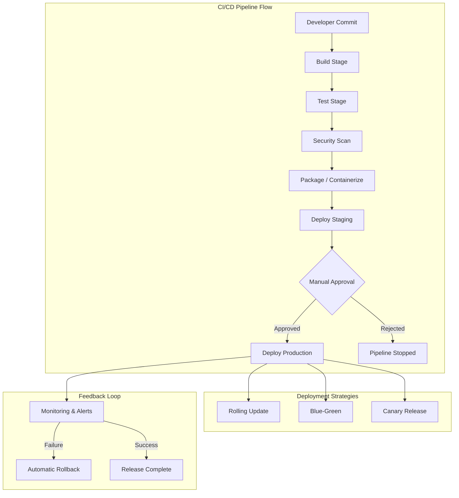
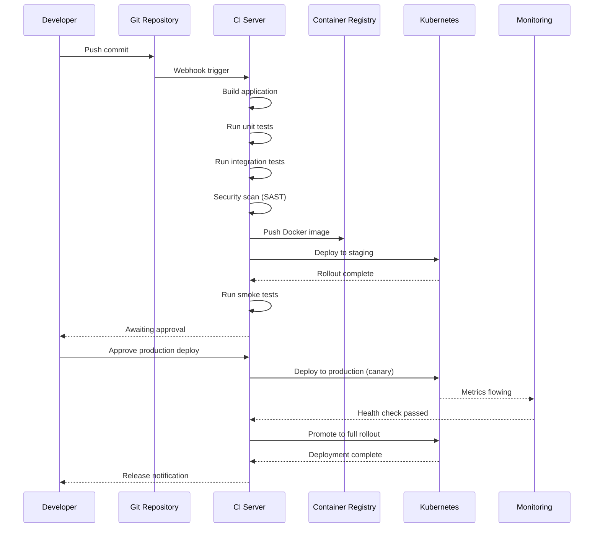

# CI/CD Pipelines

## Quick Reference

- CI/CD stands for Continuous Integration / Continuous Delivery (or Deployment), automating build, test, and release workflows
- GitLab CI/CD uses `.gitlab-ci.yml` at the repository root; Jenkins uses `Jenkinsfile` (Declarative or Scripted syntax)
- Pipeline stages execute sequentially; jobs within a stage run in parallel by default
- Artifacts are files produced by one job and consumed by downstream jobs or stored for download
- Common deployment strategies: rolling update, blue-green, canary, feature flags, and recreate
- Runners (GitLab) or agents/nodes (Jenkins) execute pipeline jobs in isolated environments
- Pipeline triggers: push events, merge requests, schedules (cron), API calls, and upstream pipeline completion

## When to Use

CI/CD pipelines are essential for any team shipping software to production with confidence and speed. Use CI/CD when you need automated testing on every commit to catch regressions early, when you want repeatable and auditable deployments that eliminate manual error, or when multiple developers contribute to the same codebase and need fast feedback on integration issues. GitLab CI/CD is ideal when your source code already lives in GitLab and you want a tightly integrated experience with built-in container registry, environments, and review apps. Jenkins is the right choice when you need maximum flexibility, have complex multi-branch pipelines spanning multiple repositories, or operate in an environment with strict plugin requirements and legacy integrations. Adopt CI/CD pipelines when manual deployments cause downtime, when release cycles are too slow, or when you lack visibility into what code is running in production.

## GitLab CI/CD

GitLab CI/CD is a built-in continuous integration and delivery platform that runs pipelines defined in a `.gitlab-ci.yml` file at the root of your repository. Every push or merge request triggers the pipeline, which consists of stages containing one or more jobs. GitLab provides shared runners on its SaaS platform or allows you to register self-managed runners on your own infrastructure. The tight integration with GitLab's merge request workflow enables features like review apps, environment tracking, and deployment approvals directly within the merge request interface.

GitLab pipelines support parent-child pipelines for monorepo architectures, multi-project pipelines for cross-repository dependencies, and directed acyclic graph (DAG) execution using the `needs` keyword to optimize job scheduling beyond simple stage ordering. Variables can be defined at the project, group, or pipeline level, with masking and protection for sensitive values. GitLab also provides a container registry, package registry, and built-in security scanning (SAST, DAST, dependency scanning) that integrate directly into the pipeline without external tooling.

The environment and deployment tracking features allow teams to see exactly which commit is deployed to each environment, roll back to previous deployments with a single click, and configure manual approval gates for production releases. Auto DevOps provides a pre-built pipeline template that automatically detects your application framework and applies appropriate build, test, and deploy stages.

## Jenkins Pipeline Syntax

Jenkins pipelines are defined using either Declarative or Scripted syntax in a `Jenkinsfile` stored in the repository root. Declarative pipelines provide a structured, opinionated syntax with predefined sections (`pipeline`, `agent`, `stages`, `steps`, `post`), making them easier to read and maintain. Scripted pipelines use full Groovy scripting for maximum flexibility but sacrifice readability and are harder to validate statically.

Declarative pipelines enforce a strict hierarchy: the `pipeline` block contains `agent` (where to run), `stages` (what to run), and optional `environment`, `options`, `parameters`, `triggers`, and `post` blocks. Each stage contains `steps` that execute shell commands, invoke plugins, or call shared library functions. The `when` directive provides conditional execution based on branch name, environment variables, changelog patterns, or custom expressions.

Jenkins shared libraries allow teams to extract common pipeline logic into reusable Groovy classes and functions stored in a separate repository. This promotes DRY principles across dozens or hundreds of pipelines. Libraries are loaded with `@Library('my-shared-lib') _` and provide custom steps that encapsulate complex workflows like building Docker images, running security scans, or deploying to Kubernetes clusters.

The Jenkins plugin ecosystem provides integrations with virtually every tool in the DevOps landscape. Key plugins include Pipeline (core), Blue Ocean (modern UI), Docker Pipeline (container builds), Kubernetes (dynamic agents), Credentials Binding (secrets management), and Git (SCM integration). However, plugin dependency management and version compatibility remain operational challenges that require careful governance.

## Stages

Pipeline stages define the logical phases of your delivery workflow and execute in sequential order. A typical pipeline includes stages for build, test, security scan, package, deploy to staging, integration test, and deploy to production. Within a stage, multiple jobs can run in parallel to reduce overall pipeline duration. Stage gates (manual approvals or automated quality checks) control promotion between environments.

In GitLab CI/CD, stages are declared in the `stages` array at the top of `.gitlab-ci.yml`, and each job specifies which stage it belongs to. Jobs in the same stage run in parallel if sufficient runners are available. The `needs` keyword allows jobs to start as soon as their dependencies complete, regardless of stage ordering, creating a DAG execution model that can significantly reduce pipeline duration for complex workflows.

In Jenkins, stages are defined within the `stages` block of a Declarative pipeline. The `parallel` directive allows multiple branches of execution within a single stage. Stage-level `when` conditions enable conditional execution, and the `input` directive pauses execution for manual approval. Jenkins Blue Ocean provides a visual representation of stage progression with real-time log streaming for each stage.

Effective stage design balances feedback speed with thoroughness. Fast-failing stages (lint, compile, unit tests) should run first to provide immediate feedback. Expensive stages (integration tests, performance tests, security scans) run later to avoid wasting resources on code that fails basic checks. Production deployment stages should always include manual approval gates and automated rollback triggers.

## Artifacts

Artifacts are files or directories produced during pipeline execution that persist beyond the job's lifetime. They serve two primary purposes: passing build outputs between pipeline stages (inter-job dependencies) and preserving deliverables for download, deployment, or audit. Common artifacts include compiled binaries, Docker images, test reports, coverage reports, dependency manifests, and deployment packages.

In GitLab CI/CD, artifacts are declared per-job using the `artifacts` keyword with `paths` (files to preserve), `expire_in` (retention duration), `reports` (structured test/coverage/security reports), and `when` (on success, failure, or always). GitLab automatically passes artifacts from earlier stages to later stages. The `dependencies` keyword limits which upstream artifacts a job receives, reducing download time for jobs that only need specific outputs.

In Jenkins, artifacts are archived using the `archiveArtifacts` step with an Ant-style file pattern. The `stash` and `unstash` steps pass files between stages within the same pipeline run, while `archiveArtifacts` persists files permanently on the Jenkins controller. The `copyArtifacts` plugin enables cross-pipeline artifact sharing. Jenkins also integrates with external artifact repositories like Nexus, Artifactory, or S3 for production-grade artifact management.

Artifact management best practices include setting appropriate retention policies to control storage costs, using fingerprinting or checksums to verify artifact integrity, storing build metadata (commit SHA, build number, timestamp) alongside artifacts for traceability, and separating ephemeral build artifacts from release artifacts that require long-term retention for compliance or rollback purposes.

## Deployment Strategies

Deployment strategies determine how new application versions are released to production, balancing speed, safety, and resource utilization. The choice of strategy depends on your application architecture, traffic patterns, rollback requirements, and tolerance for downtime or degraded service during releases.

**Rolling Update** replaces instances gradually, taking down a subset of old instances and bringing up new ones until all instances run the new version. This is the default strategy in Kubernetes and provides zero-downtime deployments with minimal resource overhead. The trade-off is that during the rollout, both old and new versions serve traffic simultaneously, requiring backward-compatible changes (especially for database schemas and API contracts).

**Blue-Green Deployment** maintains two identical production environments (blue and green). Traffic routes entirely to one environment while the other receives the new deployment. After validation, traffic switches to the new environment instantly via load balancer or DNS change. This provides instant rollback (switch back to the old environment) but requires double the infrastructure resources and careful handling of database migrations that must be compatible with both versions.

**Canary Deployment** routes a small percentage of traffic (typically 1-5%) to the new version while the majority continues hitting the stable version. Metrics are compared between canary and baseline to detect regressions before full rollout. If the canary shows degraded performance or elevated error rates, it is automatically rolled back. This strategy provides the safest production validation but requires sophisticated traffic splitting and metric comparison infrastructure.

**Feature Flags** decouple deployment from release by deploying new code to all instances but hiding it behind runtime toggles. Features are gradually enabled for specific user segments, percentages, or environments. This enables trunk-based development, instant kill switches for problematic features, and A/B testing. The trade-off is increased code complexity and the operational burden of managing flag lifecycle and cleanup.

## Code Examples

### GitLab CI/CD Pipeline

```yaml
# .gitlab-ci.yml - Full pipeline example
stages:
  - build
  - test
  - security
  - package
  - deploy

variables:
  DOCKER_IMAGE: $CI_REGISTRY_IMAGE:$CI_COMMIT_SHORT_SHA
  GRADLE_OPTS: "-Dorg.gradle.daemon=false"

# Build stage
build:
  stage: build
  image: gradle:8.4-jdk17
  script:
    - gradle assemble --no-daemon
  artifacts:
    paths:
      - build/libs/*.jar
    expire_in: 1 hour

# Parallel test jobs
unit-tests:
  stage: test
  image: gradle:8.4-jdk17
  script:
    - gradle test --no-daemon
  artifacts:
    reports:
      junit: build/test-results/test/*.xml
    when: always

integration-tests:
  stage: test
  image: gradle:8.4-jdk17
  services:
    - postgres:15
    - redis:7
  variables:
    POSTGRES_DB: testdb
    POSTGRES_USER: test
    POSTGRES_PASSWORD: test
    SPRING_DATASOURCE_URL: "jdbc:postgresql://postgres:5432/testdb"
  script:
    - gradle integrationTest --no-daemon
  artifacts:
    reports:
      junit: build/test-results/integrationTest/*.xml

# Security scanning
sast:
  stage: security
  image: semgrep/semgrep:latest
  script:
    - semgrep scan --config auto --json > sast-report.json
  artifacts:
    reports:
      sast: sast-report.json
  allow_failure: true

# Docker image build and push
package:
  stage: package
  image: docker:24
  services:
    - docker:24-dind
  script:
    - docker login -u $CI_REGISTRY_USER -p $CI_REGISTRY_PASSWORD $CI_REGISTRY
    - docker build -t $DOCKER_IMAGE .
    - docker push $DOCKER_IMAGE

# Deployment with environment tracking
deploy-staging:
  stage: deploy
  image: bitnami/kubectl:latest
  environment:
    name: staging
    url: https://staging.example.com
  script:
    - kubectl set image deployment/app app=$DOCKER_IMAGE -n staging
    - kubectl rollout status deployment/app -n staging --timeout=300s
  only:
    - main

deploy-production:
  stage: deploy
  image: bitnami/kubectl:latest
  environment:
    name: production
    url: https://app.example.com
  script:
    - kubectl set image deployment/app app=$DOCKER_IMAGE -n production
    - kubectl rollout status deployment/app -n production --timeout=300s
  when: manual
  only:
    - main
```

### Jenkins Declarative Pipeline

```groovy
// Jenkinsfile - Declarative pipeline
pipeline {
    agent {
        kubernetes {
            yaml '''
                apiVersion: v1
                kind: Pod
                spec:
                  containers:
                  - name: gradle
                    image: gradle:8.4-jdk17
                    command: ['sleep', '99d']
                  - name: docker
                    image: docker:24
                    command: ['sleep', '99d']
                    volumeMounts:
                    - name: docker-sock
                      mountPath: /var/run/docker.sock
                  volumes:
                  - name: docker-sock
                    hostPath:
                      path: /var/run/docker.sock
            '''
        }
    }

    environment {
        DOCKER_REGISTRY = 'registry.example.com'
        IMAGE_NAME = "${DOCKER_REGISTRY}/app:${env.BUILD_NUMBER}"
        GRADLE_OPTS = '-Dorg.gradle.daemon=false'
    }

    options {
        timeout(time: 30, unit: 'MINUTES')
        disableConcurrentBuilds()
        buildDiscarder(logRotator(numToKeepStr: '10'))
    }

    stages {
        stage('Build') {
            steps {
                container('gradle') {
                    sh 'gradle assemble --no-daemon'
                }
            }
        }

        stage('Test') {
            parallel {
                stage('Unit Tests') {
                    steps {
                        container('gradle') {
                            sh 'gradle test --no-daemon'
                        }
                    }
                    post {
                        always {
                            junit 'build/test-results/test/*.xml'
                        }
                    }
                }
                stage('Integration Tests') {
                    steps {
                        container('gradle') {
                            sh 'gradle integrationTest --no-daemon'
                        }
                    }
                }
            }
        }

        stage('Package') {
            steps {
                container('docker') {
                    sh "docker build -t ${IMAGE_NAME} ."
                    sh "docker push ${IMAGE_NAME}"
                }
            }
        }

        stage('Deploy Staging') {
            when {
                branch 'main'
            }
            steps {
                sh "kubectl set image deployment/app app=${IMAGE_NAME} -n staging"
                sh "kubectl rollout status deployment/app -n staging --timeout=300s"
            }
        }

        stage('Deploy Production') {
            when {
                branch 'main'
            }
            input {
                message 'Deploy to production?'
                ok 'Deploy'
                submitter 'admin,release-team'
            }
            steps {
                sh "kubectl set image deployment/app app=${IMAGE_NAME} -n production"
                sh "kubectl rollout status deployment/app -n production --timeout=300s"
            }
        }
    }

    post {
        success {
            slackSend(channel: '#deployments', message: "Build ${env.BUILD_NUMBER} succeeded")
        }
        failure {
            slackSend(channel: '#deployments', color: 'danger',
                      message: "Build ${env.BUILD_NUMBER} failed: ${env.BUILD_URL}")
        }
        always {
            cleanWs()
        }
    }
}
```

### Canary Deployment with GitLab

```yaml
# Canary deployment using GitLab environments
deploy-canary:
  stage: deploy
  environment:
    name: production/canary
    url: https://app.example.com
  script:
    - kubectl apply -f k8s/canary-deployment.yaml
    - kubectl set image deployment/app-canary app=$DOCKER_IMAGE -n production
    - kubectl scale deployment/app-canary --replicas=1 -n production
    # Route 5% traffic to canary via Istio
    - kubectl apply -f k8s/virtual-service-canary.yaml
  only:
    - main

verify-canary:
  stage: deploy
  needs: [deploy-canary]
  script:
    - sleep 300  # Wait 5 minutes for metrics
    - |
      ERROR_RATE=$(curl -s "http://prometheus:9090/api/v1/query?query=rate(http_errors_total{deployment='canary'}[5m])" | jq '.data.result[0].value[1]')
      if (( $(echo "$ERROR_RATE > 0.01" | bc -l) )); then
        echo "Canary error rate too high: $ERROR_RATE"
        kubectl delete -f k8s/virtual-service-canary.yaml
        kubectl scale deployment/app-canary --replicas=0 -n production
        exit 1
      fi
  only:
    - main

promote-canary:
  stage: deploy
  needs: [verify-canary]
  script:
    - kubectl set image deployment/app app=$DOCKER_IMAGE -n production
    - kubectl rollout status deployment/app -n production --timeout=300s
    - kubectl scale deployment/app-canary --replicas=0 -n production
    - kubectl delete -f k8s/virtual-service-canary.yaml
  when: manual
  only:
    - main
```

## Architecture and Diagrams





## Common Pitfalls

1. **Flaky tests blocking pipelines**: Intermittent test failures erode trust in the pipeline and lead teams to ignore failures or disable tests. Quarantine flaky tests into a separate non-blocking stage, track flakiness rates, and prioritize fixing them. Never allow flaky tests to block production deployments indefinitely.

2. **Secrets in pipeline configuration**: Hardcoding credentials, API keys, or tokens in `.gitlab-ci.yml` or `Jenkinsfile` exposes them in version control. Always use CI/CD variable management (GitLab CI variables, Jenkins Credentials Binding) with masking enabled. Rotate secrets regularly and audit access.

3. **Monolithic pipelines without caching**: Rebuilding everything from scratch on every commit wastes time and resources. Use dependency caching (Gradle cache, npm cache, Docker layer caching) to reduce build times. In GitLab, use the `cache` keyword; in Jenkins, use the `cache` step or persistent volumes.

4. **Missing rollback procedures**: Teams that only plan for forward deployment are unprepared when a release causes production issues. Every deployment stage should have a documented and tested rollback mechanism, whether that is reverting a Kubernetes deployment, switching blue-green environments, or disabling feature flags.

5. **Insufficient environment parity**: Differences between staging and production (different instance sizes, missing services, stale data) mean staging validation does not predict production behavior. Use infrastructure-as-code to ensure environments are as identical as possible, and run production-like load tests in staging.

## Real-World Use Cases

- **Microservices monorepo pipeline**: A team managing 15 microservices in a monorepo uses GitLab parent-child pipelines with `changes` rules to trigger only the pipelines for services affected by a commit. Each child pipeline builds, tests, and deploys its service independently, reducing average pipeline time from 45 minutes to 8 minutes.

- **Regulated financial services deployment**: A banking application uses Jenkins with mandatory stages for SAST, DAST, license compliance, and change advisory board (CAB) approval. Artifacts include signed build manifests and audit logs. Production deployments require two-person approval and automatically generate compliance reports.

- **Multi-region canary rollout**: An e-commerce platform deploys to a single region first (canary region), monitors error rates and latency for 30 minutes, then progressively rolls out to remaining regions. If any region shows degradation, the pipeline automatically halts and rolls back all regions to the previous version.

- **GitOps with GitLab and ArgoCD**: Infrastructure and application manifests live in a GitLab repository. The CI pipeline builds and pushes images, then updates the Kubernetes manifest with the new image tag. ArgoCD detects the manifest change and synchronizes the cluster state, providing a complete audit trail of every deployment through Git history.

## Interview Questions

**Q: What is the difference between Continuous Delivery and Continuous Deployment?**
A: Continuous Delivery ensures every commit that passes the pipeline is deployable to production but requires a manual approval step before release. Continuous Deployment removes the manual gate entirely, automatically deploying every successful build to production. The choice depends on regulatory requirements, risk tolerance, and team maturity.

**Q: How would you implement a zero-downtime deployment?**
A: Use rolling updates or blue-green deployments with health checks. Ensure database migrations are backward-compatible (expand-contract pattern), configure readiness probes so traffic only routes to healthy instances, and implement connection draining so in-flight requests complete before old instances terminate. Test the deployment process regularly with production-like traffic.

**Q: How do you handle database migrations in a CI/CD pipeline?**
A: Use the expand-contract pattern: first deploy a migration that adds new columns or tables without removing old ones (expand), deploy the application code that uses the new schema, then deploy a cleanup migration that removes deprecated columns (contract). Tools like Flyway or Liquibase version migrations and ensure they run exactly once. Never run destructive migrations in the same deployment as the code change.

**Q: What metrics would you monitor after a production deployment?**
A: Monitor error rate (HTTP 5xx), latency (p50, p95, p99), throughput (requests per second), saturation (CPU, memory, connection pools), and business metrics (conversion rate, checkout completions). Compare these against pre-deployment baselines. Set automated rollback triggers if error rate exceeds threshold or latency degrades beyond acceptable bounds.

## Production Tips

- **Pipeline duration budgets**: Set a target maximum pipeline duration (e.g., 15 minutes for CI, 30 minutes including deployment) and treat exceeding it as a bug. Slow pipelines reduce developer productivity and encourage batching changes, which increases deployment risk. Profile stage durations and optimize the slowest stages first.

- **Immutable artifacts with provenance**: Tag every artifact with the Git commit SHA, build timestamp, and pipeline ID. Store artifacts in an immutable registry (container registry with immutable tags, or Nexus with release repositories). This enables exact reproduction of any deployment and simplifies incident investigation.

- **Pipeline observability**: Instrument your CI/CD system itself with metrics (pipeline duration, failure rate, queue time, runner utilization) and alerts. Track mean time to recovery (MTTR) for failed pipelines. Dashboard these metrics alongside application metrics to correlate deployment events with production behavior.

- **Deployment windows and freezes**: Implement configurable deployment windows that prevent production releases during high-traffic periods, weekends, or company events. Use pipeline schedules for off-peak deployments and enforce code freezes before major releases through branch protection rules and pipeline `when` conditions.

## Related Topics

- [Docker & Containerization](../docker/index.md) - CI/CD pipelines build and push container images as deployment artifacts
- [Kubernetes & EKS](../kubernetes/index.md) - Kubernetes is the primary deployment target for containerized CI/CD pipelines
- [Linux Administration](../linux/linux-administration.md) - Pipeline runners execute on Linux hosts requiring shell scripting and system administration knowledge
