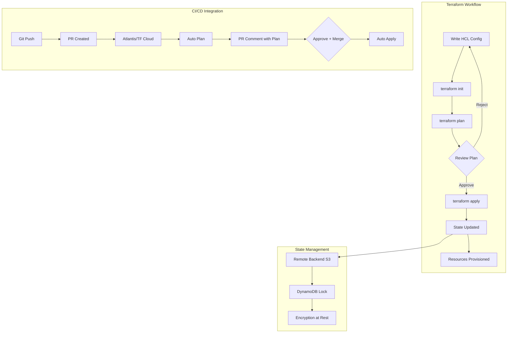
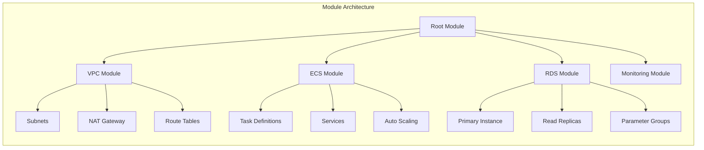
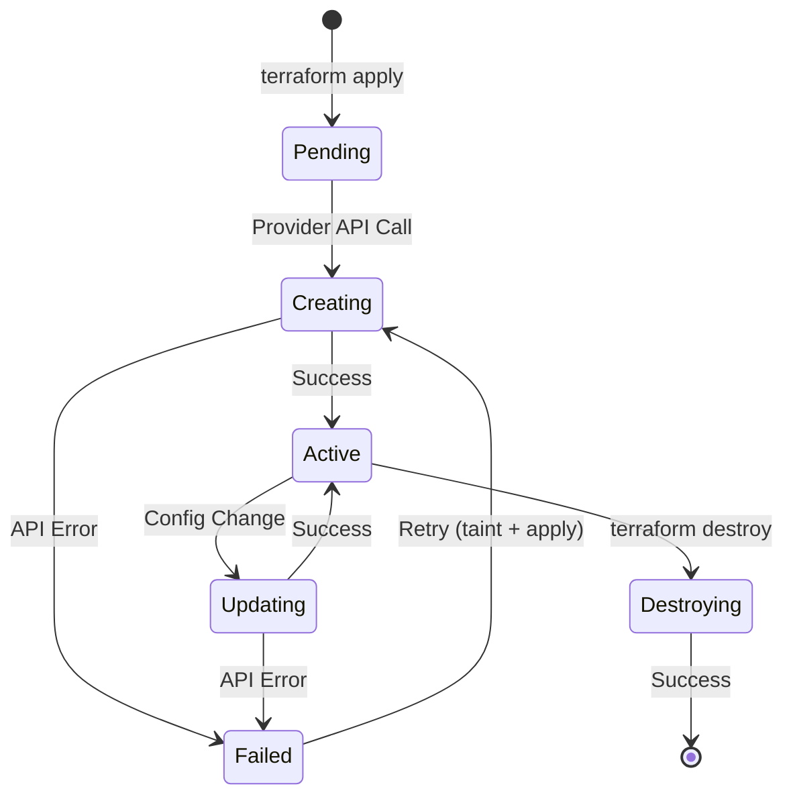

# Terraform

## Quick Reference

- Terraform uses **HashiCorp Configuration Language (HCL)** — a declarative DSL that describes desired infrastructure state rather than imperative steps
- Core workflow: `terraform init` → `terraform plan` → `terraform apply` — always review the plan before applying changes
- **State file** (`terraform.tfstate`) is the source of truth mapping real resources to configuration — never edit manually, always use remote backends
- Remote backends (S3 + DynamoDB, Terraform Cloud, GCS, Azure Blob) provide state locking to prevent concurrent modifications
- **Providers** are plugins that interact with cloud APIs (AWS, GCP, Azure, Kubernetes, Datadog) — pin versions with `required_providers` block
- **Modules** encapsulate reusable infrastructure patterns — source from registries, Git repos, or local paths with semantic versioning
- `terraform import` brings existing resources under Terraform management; `moved` blocks refactor state without destroying resources
- **Workspaces** provide isolated state files within the same configuration — useful for environment separation (dev/staging/prod)
- `terraform state` commands (`mv`, `rm`, `pull`, `push`) manipulate state when refactoring — always backup state before operations
- **Lifecycle rules** (`create_before_destroy`, `prevent_destroy`, `ignore_changes`) control resource behavior during updates

## When to Use

Terraform is the industry standard for managing infrastructure across multiple cloud providers and services. Use Terraform when your infrastructure spans AWS, GCP, Azure, or any combination — its provider ecosystem covers over 3,000 services. Choose Terraform over CloudFormation when you need multi-cloud support, when your team manages infrastructure beyond AWS (Kubernetes clusters, DNS providers, monitoring tools, database services), or when you want a consistent workflow regardless of the underlying platform. Terraform excels in organizations that practice GitOps, where infrastructure changes flow through pull requests with automated plan output as PR comments. For teams managing 50+ resources, Terraform modules provide the abstraction layer needed to maintain consistency across environments without duplicating configuration. Use Terraform with Terragrunt when managing multiple AWS accounts or environments that share common patterns but differ in variables. Avoid Terraform for ephemeral resources that change every deployment (use application-level tooling instead) or for resources that require immediate imperative actions (use scripts or AWS CLI for one-off operations). Terraform is not ideal for managing application configuration that changes frequently — tools like Ansible or application-level config management are better suited for that use case.

## Code Examples

### HCL Syntax Fundamentals

```hcl
# Variables with validation
variable "instance_type" {
  type        = string
  description = "EC2 instance type for the application servers"
  default     = "t3.medium"

  validation {
    condition     = can(regex("^t3\\.", var.instance_type))
    error_message = "Instance type must be from the t3 family for cost optimization."
  }
}

variable "environment" {
  type = string
  validation {
    condition     = contains(["dev", "staging", "prod"], var.environment)
    error_message = "Environment must be dev, staging, or prod."
  }
}

# Locals for computed values
locals {
  common_tags = {
    Environment = var.environment
    ManagedBy   = "terraform"
    Team        = var.team_name
    CostCenter  = var.cost_center
  }
  
  name_prefix = "${var.project}-${var.environment}"
  
  # Conditional logic
  is_production = var.environment == "prod"
  instance_count = local.is_production ? 3 : 1
}

# Data sources — query existing resources
data "aws_ami" "amazon_linux" {
  most_recent = true
  owners      = ["amazon"]

  filter {
    name   = "name"
    values = ["amzn2-ami-hvm-*-x86_64-gp2"]
  }

  filter {
    name   = "virtualization-type"
    values = ["hvm"]
  }
}

data "aws_vpc" "existing" {
  filter {
    name   = "tag:Name"
    values = ["${var.environment}-vpc"]
  }
}
```

### Remote Backend with State Locking

```hcl
# backend.tf
terraform {
  required_version = ">= 1.6.0"

  backend "s3" {
    bucket         = "company-terraform-state"
    key            = "services/payment-api/terraform.tfstate"
    region         = "us-east-1"
    encrypt        = true
    dynamodb_table = "terraform-state-locks"
    
    # Assume role for cross-account state access
    role_arn = "arn:aws:iam::123456789012:role/TerraformStateAccess"
  }

  required_providers {
    aws = {
      source  = "hashicorp/aws"
      version = "~> 5.30"
    }
    kubernetes = {
      source  = "hashicorp/kubernetes"
      version = "~> 2.24"
    }
  }
}

# DynamoDB table for state locking (bootstrap separately)
resource "aws_dynamodb_table" "terraform_locks" {
  name         = "terraform-state-locks"
  billing_mode = "PAY_PER_REQUEST"
  hash_key     = "LockID"

  attribute {
    name = "LockID"
    type = "S"
  }

  tags = {
    Purpose = "Terraform state locking"
  }
}
```

### Reusable Module Pattern

```hcl
# modules/ecs-service/variables.tf
variable "service_name" {
  type        = string
  description = "Name of the ECS service"
}

variable "container_image" {
  type        = string
  description = "Docker image URI including tag"
}

variable "container_port" {
  type    = number
  default = 8080
}

variable "cpu" {
  type    = number
  default = 256
}

variable "memory" {
  type    = number
  default = 512
}

variable "desired_count" {
  type    = number
  default = 2
}

variable "health_check_path" {
  type    = string
  default = "/health"
}

# modules/ecs-service/main.tf
resource "aws_ecs_task_definition" "service" {
  family                   = var.service_name
  network_mode             = "awsvpc"
  requires_compatibilities = ["FARGATE"]
  cpu                      = var.cpu
  memory                   = var.memory
  execution_role_arn       = aws_iam_role.execution.arn
  task_role_arn            = aws_iam_role.task.arn

  container_definitions = jsonencode([
    {
      name      = var.service_name
      image     = var.container_image
      essential = true
      portMappings = [{
        containerPort = var.container_port
        protocol      = "tcp"
      }]
      logConfiguration = {
        logDriver = "awslogs"
        options = {
          "awslogs-group"         = aws_cloudwatch_log_group.service.name
          "awslogs-region"        = data.aws_region.current.name
          "awslogs-stream-prefix" = var.service_name
        }
      }
      healthCheck = {
        command     = ["CMD-SHELL", "curl -f http://localhost:${var.container_port}${var.health_check_path} || exit 1"]
        interval    = 30
        timeout     = 5
        retries     = 3
        startPeriod = 60
      }
    }
  ])

  lifecycle {
    create_before_destroy = true
  }
}

resource "aws_ecs_service" "service" {
  name            = var.service_name
  cluster         = var.cluster_id
  task_definition = aws_ecs_task_definition.service.arn
  desired_count   = var.desired_count
  launch_type     = "FARGATE"

  network_configuration {
    subnets          = var.private_subnet_ids
    security_groups  = [aws_security_group.service.id]
    assign_public_ip = false
  }

  load_balancer {
    target_group_arn = aws_lb_target_group.service.arn
    container_name   = var.service_name
    container_port   = var.container_port
  }

  deployment_circuit_breaker {
    enable   = true
    rollback = true
  }

  depends_on = [aws_lb_listener_rule.service]
}

# Module invocation from root
module "payment_service" {
  source = "./modules/ecs-service"

  service_name    = "payment-api"
  container_image = "123456789012.dkr.ecr.us-east-1.amazonaws.com/payment-api:v2.3.1"
  container_port  = 8080
  cpu             = 512
  memory          = 1024
  desired_count   = local.is_production ? 3 : 1

  cluster_id         = aws_ecs_cluster.main.id
  private_subnet_ids = module.vpc.private_subnet_ids
  vpc_id             = module.vpc.vpc_id
  alb_listener_arn   = aws_lb_listener.https.arn

  health_check_path = "/actuator/health"
}
```

### Lifecycle Rules and Moved Blocks

```hcl
# Lifecycle rules control resource behavior
resource "aws_db_instance" "primary" {
  identifier     = "${local.name_prefix}-postgres"
  engine         = "postgres"
  engine_version = "15.4"
  instance_class = "db.r6g.large"

  lifecycle {
    # Never accidentally destroy the production database
    prevent_destroy = true
    
    # Ignore changes made by auto-scaling or manual intervention
    ignore_changes = [
      instance_class,
      engine_version,
    ]
    
    # Create replacement before destroying old (zero-downtime)
    create_before_destroy = true
  }
}

# Moved blocks for refactoring without destroying resources
# When renaming a resource or moving into a module
moved {
  from = aws_s3_bucket.logs
  to   = module.logging.aws_s3_bucket.main
}

moved {
  from = aws_iam_role.lambda_exec
  to   = aws_iam_role.function_execution
}
```

### Importing Existing Resources

```hcl
# Import block (Terraform 1.5+) — declarative import
import {
  to = aws_s3_bucket.existing_bucket
  id = "my-existing-bucket-name"
}

resource "aws_s3_bucket" "existing_bucket" {
  bucket = "my-existing-bucket-name"

  tags = {
    ManagedBy = "terraform"
    Imported  = "true"
  }
}

# Generate configuration for imported resources
# terraform plan -generate-config-out=generated.tf
```

### Terragrunt for DRY Multi-Environment Configs

```hcl
# terragrunt.hcl (root)
remote_state {
  backend = "s3"
  generate = {
    path      = "backend.tf"
    if_exists = "overwrite"
  }
  config = {
    bucket         = "company-terraform-state"
    key            = "${path_relative_to_include()}/terraform.tfstate"
    region         = "us-east-1"
    encrypt        = true
    dynamodb_table = "terraform-state-locks"
  }
}

generate "provider" {
  path      = "provider.tf"
  if_exists = "overwrite"
  contents  = <<EOF
provider "aws" {
  region = var.aws_region
  default_tags {
    tags = {
      ManagedBy   = "terraform"
      Environment = var.environment
    }
  }
}
EOF
}

# environments/prod/us-east-1/ecs/terragrunt.hcl
terraform {
  source = "../../../../modules//ecs-cluster"
}

include "root" {
  path = find_in_parent_folders()
}

dependency "vpc" {
  config_path = "../vpc"
}

inputs = {
  environment        = "prod"
  aws_region         = "us-east-1"
  cluster_name       = "prod-main"
  vpc_id             = dependency.vpc.outputs.vpc_id
  private_subnet_ids = dependency.vpc.outputs.private_subnet_ids
  instance_types     = ["m6i.large", "m6i.xlarge"]
  min_capacity       = 3
  max_capacity       = 20
}
```

## Architecture / Diagrams







## Common Pitfalls

**1. Storing state locally or in version control.** Local state files create conflicts when multiple team members run Terraform simultaneously. State contains sensitive data (database passwords, API keys) that should never be committed to Git. Always use a remote backend with encryption and locking from day one — retrofitting is painful.

**2. Not pinning provider versions.** Without version constraints, `terraform init` pulls the latest provider version, which may introduce breaking changes. A `terraform plan` that worked yesterday can fail today because a provider updated its API. Pin with `version = "~> 5.30"` (pessimistic constraint) to allow patch updates while preventing major version jumps.

**3. Monolithic state files.** Putting all infrastructure in a single state file means every `terraform plan` queries every resource, making operations slow and risky. A change to a security group triggers a plan that touches the database, VPC, and DNS. Split state by service boundary or lifecycle — networking, data stores, and application services should be separate state files.

**4. Using provisioners for configuration management.** Provisioners (`remote-exec`, `local-exec`) run imperative commands that Terraform cannot track or roll back. They execute only on creation (not updates), create hidden dependencies, and make plans unpredictable. Use cloud-init user data, Ansible, or Packer for machine configuration instead.

**5. Ignoring plan output before apply.** Rubber-stamping `terraform apply` without reading the plan leads to accidental resource destruction. A renamed resource appears as destroy + create, potentially causing downtime. Always review the plan diff, especially lines showing `# forces replacement` or `- (destroy)`.

**6. Hardcoding values instead of using variables and data sources.** Hardcoded AMI IDs, account numbers, and region names make configurations brittle and non-portable. Use `data` sources to query current values and variables for environment-specific configuration.

**7. Circular dependencies between modules.** Module A outputs a value that Module B needs, and Module B outputs a value that Module A needs. Terraform cannot resolve this. Restructure by extracting shared resources into a third module or using `terraform_remote_state` data sources to read from separate state files.

**8. Not using `terraform fmt` and `terraform validate` in CI.** Inconsistent formatting creates noisy diffs in pull requests. Missing validation catches syntax errors only at plan time, wasting CI minutes. Run both as pre-commit hooks and CI gates.

## Real-World Use Cases

**Multi-account AWS organization.** A fintech company manages 15 AWS accounts (dev, staging, prod per team, shared services, security, logging) using Terraform with Terragrunt. Each account has its own state file in a centralized S3 bucket. Shared modules define VPC topology, IAM baselines, and security guardrails. Account vending uses Terraform to provision new accounts with Control Tower and apply baseline configurations automatically. Changes flow through a central infrastructure repository with Atlantis providing plan output on PRs.

**Kubernetes platform provisioning.** A SaaS company uses Terraform to provision EKS clusters across three regions. The Terraform configuration manages the cluster control plane, node groups with mixed instance types, VPC CNI configuration, and core add-ons (CoreDNS, kube-proxy, aws-load-balancer-controller). A separate Terraform workspace manages Kubernetes resources (namespaces, RBAC, network policies) using the Kubernetes provider, with the cluster endpoint and token sourced from the EKS module outputs.

**Database infrastructure with disaster recovery.** An e-commerce platform manages RDS PostgreSQL instances with Terraform, including multi-AZ deployment, automated backups, read replicas in secondary regions, and parameter group tuning. The `prevent_destroy` lifecycle rule protects production databases. Blue-green database migrations use `create_before_destroy` with DNS-based cutover managed through Route53 weighted records.

**Cost-optimized development environments.** A development team uses Terraform workspaces combined with scheduled Lambda functions to spin up development environments at 8 AM and tear them down at 7 PM. Terraform manages the full stack (ECS services, RDS instances, ElastiCache clusters) with environment-specific sizing — dev uses `db.t3.small` while prod uses `db.r6g.2xlarge`. Monthly savings exceed $15,000 across 8 development environments.

## Interview Questions

**Q: How does Terraform state work, and what problems does remote state solve?**

A: Terraform state is a JSON file that maps resource addresses in configuration (like `aws_instance.web`) to real infrastructure IDs (like `i-0abc123`). It tracks metadata, dependencies, and attribute values. Without state, Terraform cannot determine what exists or what needs changing. Remote state solves three problems: team collaboration (multiple engineers can run Terraform without conflicting), state locking (DynamoDB or similar prevents concurrent modifications that corrupt state), and security (state contains sensitive outputs and should be encrypted at rest, not stored in Git). Remote backends also enable `terraform_remote_state` data sources for cross-stack references.

**Q: Explain the difference between `terraform import` and `moved` blocks. When would you use each?**

A: `terraform import` brings existing infrastructure under Terraform management — it adds a resource to state that was created outside Terraform (manually or by another tool). You write the resource configuration, then import maps the real resource ID to that config. `moved` blocks handle refactoring within Terraform — renaming resources, moving resources into modules, or splitting modules. The key difference: import adds new resources to state, while moved relocates existing state entries without touching real infrastructure. Use import when adopting legacy infrastructure; use moved when reorganizing your Terraform codebase.

**Q: What is the blast radius problem in Terraform, and how do you mitigate it?**

A: Blast radius refers to the scope of potential damage from a single Terraform operation. A monolithic state file means one misconfigured resource or provider bug can affect all infrastructure during plan/apply. Mitigation strategies: split state by service boundary (networking, data, compute), use separate state files per environment, implement Terraform workspaces for isolation, apply least-privilege IAM roles per state file (the role applying network changes cannot modify databases), and use `prevent_destroy` lifecycle rules on critical resources. Atlantis or Terraform Cloud add approval workflows that prevent unreviewed changes from reaching production.

**Q: How do you handle secrets in Terraform without exposing them in state?**

A: Terraform state stores all attribute values in plaintext, including sensitive outputs. Strategies: encrypt state at rest (S3 server-side encryption, Terraform Cloud encryption), restrict state access via IAM policies, mark outputs as `sensitive = true` to prevent display in CLI output, use external secret managers (AWS Secrets Manager, HashiCorp Vault) with data sources to read secrets at plan time rather than storing them in variables, and use the `ephemeral` resource type (Terraform 1.7+) for values that should never persist in state. Never pass secrets as environment variables in CI logs.

**Q: Describe how you would migrate a Terraform monolith into multiple state files.**

A: First, identify logical boundaries (networking, data stores, application services). Create new backend configurations for each boundary. Use `terraform state mv` to move resources from the monolith state to new state files, or use `terraform state rm` combined with `terraform import` in the new configuration. For complex migrations, use `terraform state pull` to export state as JSON, manipulate it programmatically, then `terraform state push` to the new backends. Always backup state before operations. After migration, use `terraform_remote_state` data sources or Terraform Cloud run triggers to maintain cross-state references. Validate with `terraform plan` in each new state — it should show no changes.

## Production Tips

**Implement drift detection on a schedule.** Run `terraform plan` in CI on a cron schedule (every 4-6 hours) and alert when drift is detected. Drift indicates manual changes that bypass your IaC workflow — these create configuration debt and can cause unexpected behavior on the next apply. Tools like Driftctl or Terraform Cloud's drift detection feature automate this. Treat drift alerts like failing tests — investigate and reconcile immediately.

**Use Infracost for cost estimation in pull requests.** Integrate Infracost into your CI pipeline to show the monthly cost impact of infrastructure changes directly in PR comments. Engineers see that adding a `db.r6g.2xlarge` RDS instance adds $1,200/month before the change is approved. This shifts cost awareness left and prevents budget surprises. Configure cost policies to require additional approval for changes exceeding thresholds.

**Implement progressive apply with targeted plans.** For large infrastructure changes, use `-target` flags to apply changes incrementally rather than all at once. Apply networking changes first, verify connectivity, then apply compute changes. This reduces blast radius and makes rollback easier. However, never leave targeted applies as the permanent workflow — they can create state inconsistencies if overused.

**Version your modules with semantic versioning and changelogs.** Treat Terraform modules like libraries — tag releases, maintain changelogs, and use version constraints in consumers. Breaking changes (variable renames, resource restructuring) require major version bumps. This prevents a module update from unexpectedly destroying resources across all consuming configurations. Use a private module registry (Terraform Cloud, Artifactory, or S3-backed) for internal modules.

**Separate plan and apply in CI/CD pipelines.** Never auto-apply on merge without human review of the plan output. The recommended flow: PR triggers plan → plan output posted as PR comment → reviewer approves both code and plan → merge triggers apply. Use Atlantis or Terraform Cloud for this workflow. Store plan files as artifacts and apply the exact plan that was reviewed, not a fresh plan at apply time (which may differ due to concurrent changes).

## Related Topics

- [Infrastructure as Code](./infrastructure-as-code.md) — Comparison of Terraform, CloudFormation, and Pulumi approaches
- [CI/CD Pipelines](./ci-cd-pipelines.md) — Pipeline integration patterns for Terraform plan/apply workflows
- [Docker](../docker/index.md) — Container infrastructure that Terraform provisions and manages
- [Kubernetes](../kubernetes/index.md) — Cluster provisioning with Terraform's Kubernetes and Helm providers
- [AWS](../aws/index.md) — AWS services commonly managed through Terraform configurations
