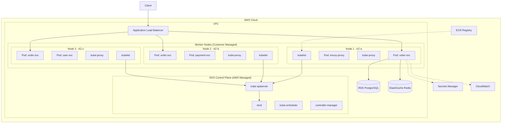

# Kubernetes & EKS

## Quick Reference

- Kubernetes (K8s) is a container orchestration platform that automates deployment, scaling, and management of containerized applications
- Core objects: Pods (smallest deployable unit), Deployments (declarative updates), Services (stable networking), Ingress (HTTP routing)
- Configuration: ConfigMaps (non-sensitive config), Secrets (sensitive data), Namespaces (resource isolation)
- Control plane components: kube-apiserver, etcd, kube-scheduler, kube-controller-manager, cloud-controller-manager
- Node components: kubelet, kube-proxy, container runtime (containerd, CRI-O)
- Amazon EKS is a managed Kubernetes service that runs the control plane across multiple AWS Availability Zones
- Helm is the package manager for Kubernetes, using charts to define, install, and upgrade applications
- kubectl is the primary CLI tool for interacting with Kubernetes clusters

## When to Use

Kubernetes is the right choice when you need to orchestrate containerized workloads at scale across multiple nodes with automated self-healing, rolling deployments, and service discovery. Use Kubernetes when your application consists of multiple microservices that need independent scaling, when you require zero-downtime deployments, or when you need consistent environments across development, staging, and production. Choose EKS specifically when your infrastructure is AWS-native and you want to avoid managing the Kubernetes control plane yourself, need deep integration with AWS services like IAM, ALB, EBS, and CloudWatch, or require compliance certifications that AWS provides out of the box. Kubernetes is overkill for simple single-container applications or small teams without dedicated platform engineering resources. Consider simpler alternatives like ECS Fargate for straightforward container workloads that do not need the full flexibility of Kubernetes.

## Pods

Pods are the smallest deployable units in Kubernetes, representing one or more containers that share network namespace, storage volumes, and lifecycle. Every container in a pod shares the same IP address and port space, communicating via localhost. Pods are ephemeral by design and should never be created directly in production. Instead, use higher-level controllers like Deployments or StatefulSets that manage pod lifecycle, handle restarts, and maintain desired replica counts.

A pod specification defines the containers, their resource requests and limits, volume mounts, environment variables, and health checks. Resource requests guarantee minimum CPU and memory allocation for scheduling decisions, while limits cap the maximum resources a container can consume. Liveness probes detect deadlocked containers and trigger restarts, while readiness probes control whether traffic is routed to the pod. Startup probes handle slow-starting containers without conflicting with liveness checks.

Multi-container pods use sidecar patterns for cross-cutting concerns like logging agents, service mesh proxies (Envoy in Istio), or configuration reloaders. Init containers run sequentially before app containers start, useful for database migrations, configuration fetching, or dependency checks.

```yaml
apiVersion: v1
kind: Pod
metadata:
  name: order-service
  labels:
    app: order-service
    version: v2
spec:
  initContainers:
    - name: db-migration
      image: order-service:v2
      command: ["./migrate", "--target", "latest"]
  containers:
    - name: app
      image: order-service:v2
      ports:
        - containerPort: 8080
      resources:
        requests:
          cpu: "250m"
          memory: "512Mi"
        limits:
          cpu: "1000m"
          memory: "1Gi"
      livenessProbe:
        httpGet:
          path: /actuator/health/liveness
          port: 8080
        initialDelaySeconds: 30
        periodSeconds: 10
      readinessProbe:
        httpGet:
          path: /actuator/health/readiness
          port: 8080
        initialDelaySeconds: 5
        periodSeconds: 5
      env:
        - name: SPRING_PROFILES_ACTIVE
          value: "production"
        - name: DB_PASSWORD
          valueFrom:
            secretKeyRef:
              name: db-credentials
              key: password
    - name: envoy-sidecar
      image: envoyproxy/envoy:v1.28
      ports:
        - containerPort: 9901
```

## Deployments

Deployments provide declarative updates for Pods and ReplicaSets. You describe a desired state in a Deployment spec, and the Deployment controller changes the actual state to match at a controlled rate. Deployments manage the full lifecycle of application releases including rolling updates, rollbacks, scaling, and pause/resume operations.

The rolling update strategy replaces pods incrementally, ensuring that a minimum number of pods remain available during the update. The `maxUnavailable` field controls how many pods can be taken down simultaneously, while `maxSurge` controls how many extra pods can be created above the desired count. This ensures zero-downtime deployments when combined with proper readiness probes. The recreate strategy terminates all existing pods before creating new ones, useful for applications that cannot run multiple versions simultaneously.

Deployment history is maintained through ReplicaSets. Each update creates a new ReplicaSet while scaling down the previous one. You can roll back to any previous revision using `kubectl rollout undo`. The `revisionHistoryLimit` field controls how many old ReplicaSets are retained for rollback purposes.

```yaml
apiVersion: apps/v1
kind: Deployment
metadata:
  name: order-service
  namespace: production
spec:
  replicas: 3
  revisionHistoryLimit: 5
  selector:
    matchLabels:
      app: order-service
  strategy:
    type: RollingUpdate
    rollingUpdate:
      maxUnavailable: 1
      maxSurge: 1
  template:
    metadata:
      labels:
        app: order-service
        version: v2
      annotations:
        prometheus.io/scrape: "true"
        prometheus.io/port: "8080"
    spec:
      containers:
        - name: app
          image: 123456789.dkr.ecr.us-east-1.amazonaws.com/order-service:v2.1.0
          ports:
            - containerPort: 8080
          resources:
            requests:
              cpu: "500m"
              memory: "1Gi"
            limits:
              cpu: "2000m"
              memory: "2Gi"
          readinessProbe:
            httpGet:
              path: /actuator/health/readiness
              port: 8080
            initialDelaySeconds: 10
            periodSeconds: 5
          livenessProbe:
            httpGet:
              path: /actuator/health/liveness
              port: 8080
            initialDelaySeconds: 30
            periodSeconds: 10
      topologySpreadConstraints:
        - maxSkew: 1
          topologyKey: topology.kubernetes.io/zone
          whenUnsatisfiable: DoNotSchedule
          labelSelector:
            matchLabels:
              app: order-service
```

## Services

Services provide stable network endpoints for accessing a set of pods. Since pods are ephemeral and their IP addresses change on restart, Services abstract away pod identity and provide a consistent DNS name and virtual IP (ClusterIP) that routes traffic to healthy pods matching the label selector. Kubernetes supports four service types that address different networking requirements.

ClusterIP is the default type, exposing the service on an internal cluster IP reachable only from within the cluster. NodePort exposes the service on a static port on every node, allowing external access via any node IP. LoadBalancer provisions an external load balancer (cloud-provider specific) that routes traffic to the service. ExternalName maps the service to a DNS CNAME record, useful for referencing external services.

Service discovery works through DNS. Every service gets a DNS entry in the format `<service-name>.<namespace>.svc.cluster.local`. Pods can reach services by name within the same namespace or by fully qualified domain name across namespaces. Kube-proxy maintains iptables or IPVS rules on each node to route traffic from the service ClusterIP to backend pod IPs.

```yaml
apiVersion: v1
kind: Service
metadata:
  name: order-service
  namespace: production
spec:
  type: ClusterIP
  selector:
    app: order-service
  ports:
    - name: http
      port: 80
      targetPort: 8080
      protocol: TCP
    - name: grpc
      port: 9090
      targetPort: 9090
      protocol: TCP
---
apiVersion: v1
kind: Service
metadata:
  name: order-service-external
  namespace: production
  annotations:
    service.beta.kubernetes.io/aws-load-balancer-type: "nlb"
    service.beta.kubernetes.io/aws-load-balancer-scheme: "internet-facing"
spec:
  type: LoadBalancer
  selector:
    app: order-service
  ports:
    - port: 443
      targetPort: 8080
      protocol: TCP
```

## Ingress

Ingress manages external HTTP and HTTPS access to services within the cluster. Unlike LoadBalancer services that provision one load balancer per service, Ingress consolidates routing rules into a single entry point, reducing cost and complexity. An Ingress resource defines rules that map hostnames and URL paths to backend services, while an Ingress Controller (like AWS ALB Ingress Controller, NGINX, or Traefik) implements those rules.

Ingress supports host-based routing (directing traffic based on the Host header), path-based routing (directing traffic based on URL path prefixes), TLS termination (handling HTTPS certificates), and default backends for unmatched requests. In AWS EKS environments, the AWS Load Balancer Controller creates Application Load Balancers (ALBs) from Ingress resources, providing native integration with ACM certificates, WAF, and target group health checks.

Path types control how URL matching works. `Prefix` matches URL path prefixes, `Exact` requires an exact path match, and `ImplementationSpecific` delegates matching behavior to the Ingress Controller. Annotations customize controller-specific behavior like SSL redirect, connection timeouts, and rate limiting.

```yaml
apiVersion: networking.k8s.io/v1
kind: Ingress
metadata:
  name: api-ingress
  namespace: production
  annotations:
    kubernetes.io/ingress.class: alb
    alb.ingress.kubernetes.io/scheme: internet-facing
    alb.ingress.kubernetes.io/target-type: ip
    alb.ingress.kubernetes.io/certificate-arn: arn:aws:acm:us-east-1:123456789:certificate/abc-123
    alb.ingress.kubernetes.io/listen-ports: '[{"HTTPS":443}]'
    alb.ingress.kubernetes.io/ssl-redirect: "443"
    alb.ingress.kubernetes.io/healthcheck-path: /actuator/health
    alb.ingress.kubernetes.io/group.name: production-api
spec:
  rules:
    - host: api.example.com
      http:
        paths:
          - path: /orders
            pathType: Prefix
            backend:
              service:
                name: order-service
                port:
                  number: 80
          - path: /users
            pathType: Prefix
            backend:
              service:
                name: user-service
                port:
                  number: 80
          - path: /payments
            pathType: Prefix
            backend:
              service:
                name: payment-service
                port:
                  number: 80
  tls:
    - hosts:
        - api.example.com
      secretName: api-tls-cert
```

## ConfigMaps

ConfigMaps decouple configuration from container images, allowing you to change application behavior without rebuilding images. They store non-sensitive configuration data as key-value pairs that can be consumed by pods as environment variables, command-line arguments, or configuration files mounted as volumes. ConfigMaps are namespace-scoped and can hold up to 1 MiB of data.

When mounted as volumes, ConfigMaps create files in the container filesystem where each key becomes a filename and the value becomes the file content. This approach works well for configuration files like application.yml, nginx.conf, or logging configurations. Volume-mounted ConfigMaps support automatic updates: when the ConfigMap is modified, the mounted files are eventually updated (with a delay of up to the kubelet sync period, typically 60 seconds). Environment variables sourced from ConfigMaps do not update automatically and require a pod restart.

Immutable ConfigMaps (setting `immutable: true`) protect against accidental changes and improve cluster performance by allowing the kubelet to skip watching for updates. Use immutable ConfigMaps for configurations that should never change during a deployment lifecycle.

```yaml
apiVersion: v1
kind: ConfigMap
metadata:
  name: order-service-config
  namespace: production
data:
  application.yml: |
    server:
      port: 8080
      shutdown: graceful
    spring:
      datasource:
        url: jdbc:postgresql://db-cluster.internal:5432/orders
        hikari:
          maximum-pool-size: 20
          minimum-idle: 5
          connection-timeout: 30000
    management:
      endpoints:
        web:
          exposure:
            include: health,metrics,prometheus
      health:
        readiness-state:
          enabled: true
        liveness-state:
          enabled: true
    kafka:
      bootstrap-servers: kafka-cluster.internal:9092
      consumer:
        group-id: order-processing
        auto-offset-reset: earliest
  log4j2.xml: |
    <?xml version="1.0" encoding="UTF-8"?>
    <Configuration status="WARN">
      <Appenders>
        <Console name="Console" target="SYSTEM_OUT">
          <JsonLayout compact="true" eventEol="true"/>
        </Console>
      </Appenders>
      <Loggers>
        <Root level="info">
          <AppenderRef ref="Console"/>
        </Root>
      </Loggers>
    </Configuration>
---
apiVersion: apps/v1
kind: Deployment
metadata:
  name: order-service
spec:
  template:
    spec:
      containers:
        - name: app
          volumeMounts:
            - name: config-volume
              mountPath: /app/config
              readOnly: true
          env:
            - name: SPRING_CONFIG_LOCATION
              value: "file:/app/config/application.yml"
      volumes:
        - name: config-volume
          configMap:
            name: order-service-config
```

## Secrets

Secrets store sensitive data such as passwords, OAuth tokens, TLS certificates, and SSH keys. While structurally similar to ConfigMaps, Secrets are base64-encoded at rest and can be encrypted using envelope encryption with AWS KMS in EKS. Kubernetes restricts Secret access through RBAC policies and limits their exposure in the API server audit logs.

Secrets come in several built-in types: `Opaque` (arbitrary key-value data), `kubernetes.io/tls` (TLS certificate and key pairs), `kubernetes.io/dockerconfigjson` (container registry credentials), and `kubernetes.io/service-account-token` (service account tokens). Like ConfigMaps, Secrets can be consumed as environment variables or mounted as files. Volume-mounted Secrets are stored in tmpfs (RAM-backed filesystem) on the node, never written to disk.

In production EKS environments, use AWS Secrets Manager or AWS Systems Manager Parameter Store with the Secrets Store CSI Driver to inject secrets directly into pods without storing them in etcd. This approach provides automatic rotation, centralized audit logging, and eliminates the need to manage base64-encoded values in YAML manifests.

```yaml
apiVersion: v1
kind: Secret
metadata:
  name: db-credentials
  namespace: production
type: Opaque
data:
  username: b3JkZXItc2VydmljZQ==
  password: c3VwZXItc2VjcmV0LXBhc3N3b3Jk
  connection-string: amRiYzpwb3N0Z3Jlc3FsOi8vZGItY2x1c3Rlci5pbnRlcm5hbDo1NDMyL29yZGVycw==
---
# Using Secrets Store CSI Driver with AWS Secrets Manager
apiVersion: secrets-store.csi.x-k8s.io/v1
kind: SecretProviderClass
metadata:
  name: aws-secrets
  namespace: production
spec:
  provider: aws
  parameters:
    objects: |
      - objectName: "production/order-service/db-credentials"
        objectType: "secretsmanager"
        jmesPath:
          - path: username
            objectAlias: db-username
          - path: password
            objectAlias: db-password
  secretObjects:
    - secretName: db-credentials-synced
      type: Opaque
      data:
        - objectName: db-username
          key: username
        - objectName: db-password
          key: password
```

## Helm Charts

Helm is the package manager for Kubernetes that simplifies deploying complex applications through reusable, versioned chart packages. A Helm chart is a collection of templates, default values, and metadata that generates Kubernetes manifests. Charts support parameterization through values files, enabling the same chart to deploy across development, staging, and production environments with different configurations.

A chart consists of a `Chart.yaml` (metadata), `values.yaml` (default configuration), and a `templates/` directory containing Go-templated Kubernetes manifests. Helm uses a three-way merge for upgrades, comparing the previous manifest, the current live state, and the new desired state to compute the minimal set of changes. Chart dependencies allow composing complex applications from smaller, reusable charts (e.g., a microservice chart depending on a PostgreSQL chart).

Helm repositories host packaged charts for distribution. Organizations typically maintain private chart repositories (using ChartMuseum, Harbor, or S3-backed repos) alongside public charts from Artifact Hub. Helm 3 removed the server-side Tiller component, storing release state as Secrets in the target namespace, improving security and multi-tenancy.

```yaml
# Chart.yaml
apiVersion: v2
name: order-service
description: Order processing microservice
version: 1.2.0
appVersion: "2.1.0"
dependencies:
  - name: postgresql
    version: "12.x"
    repository: "https://charts.bitnami.com/bitnami"
    condition: postgresql.enabled

# values.yaml
replicaCount: 3
image:
  repository: 123456789.dkr.ecr.us-east-1.amazonaws.com/order-service
  tag: "2.1.0"
  pullPolicy: IfNotPresent

resources:
  requests:
    cpu: 500m
    memory: 1Gi
  limits:
    cpu: 2000m
    memory: 2Gi

autoscaling:
  enabled: true
  minReplicas: 3
  maxReplicas: 10
  targetCPUUtilizationPercentage: 70

ingress:
  enabled: true
  className: alb
  hosts:
    - host: api.example.com
      paths:
        - path: /orders
          pathType: Prefix

postgresql:
  enabled: false  # Use external RDS in production
```

```bash
# Common Helm commands
helm repo add bitnami https://charts.bitnami.com/bitnami
helm repo update

# Install a release
helm install order-service ./charts/order-service \
  --namespace production \
  --values values-production.yaml

# Upgrade with new values
helm upgrade order-service ./charts/order-service \
  --namespace production \
  --values values-production.yaml \
  --set image.tag=2.2.0

# Rollback to previous revision
helm rollback order-service 1 --namespace production

# View release history
helm history order-service --namespace production
```

## EKS-Specific Configuration

Amazon EKS provides a managed Kubernetes control plane that runs across multiple Availability Zones, handling etcd persistence, API server scaling, and automatic version upgrades. EKS integrates deeply with AWS services for networking (VPC CNI), load balancing (ALB/NLB), storage (EBS CSI, EFS CSI), identity (IAM Roles for Service Accounts), and observability (CloudWatch Container Insights).

The VPC CNI plugin assigns real VPC IP addresses to pods, enabling direct communication with other AWS services without NAT. Each pod gets an IP from the node's subnet, which means subnet sizing directly impacts the maximum number of pods per node. For large clusters, use prefix delegation mode to assign /28 prefixes instead of individual IPs, increasing pod density from approximately 30 to 110 pods per m5.large instance.

IAM Roles for Service Accounts (IRSA) provides fine-grained AWS permissions to individual pods without sharing node-level credentials. IRSA uses OIDC federation to map Kubernetes service accounts to IAM roles, following the principle of least privilege. Each microservice gets its own IAM role with only the permissions it needs.

Managed node groups automate EC2 instance provisioning, AMI updates, and graceful draining during upgrades. For cost optimization, use a mix of On-Demand instances for baseline capacity and Spot instances for burst workloads with Karpenter or Cluster Autoscaler handling dynamic scaling. Fargate profiles eliminate node management entirely by running pods on serverless compute, ideal for batch jobs or low-traffic services.

```yaml
# EKS cluster configuration with eksctl
apiVersion: eksctl.io/v1alpha5
kind: ClusterConfig
metadata:
  name: production-cluster
  region: us-east-1
  version: "1.28"

vpc:
  cidr: "10.0.0.0/16"
  nat:
    gateway: HighlyAvailable

managedNodeGroups:
  - name: system
    instanceType: m5.large
    desiredCapacity: 3
    minSize: 3
    maxSize: 5
    labels:
      role: system
    iam:
      withAddonPolicies:
        albIngress: true
        cloudWatch: true
        ebs: true

  - name: application
    instanceTypes:
      - m5.xlarge
      - m5a.xlarge
    desiredCapacity: 5
    minSize: 3
    maxSize: 20
    spot: true
    labels:
      role: application
    taints:
      - key: spot
        value: "true"
        effect: PreferNoSchedule

iam:
  withOIDC: true
  serviceAccounts:
    - metadata:
        name: order-service
        namespace: production
      attachPolicyARNs:
        - "arn:aws:iam::123456789:policy/OrderServicePolicy"
    - metadata:
        name: aws-load-balancer-controller
        namespace: kube-system
      wellKnownPolicies:
        awsLoadBalancerController: true

addons:
  - name: vpc-cni
    version: latest
    configurationValues: '{"env":{"ENABLE_PREFIX_DELEGATION":"true"}}'
  - name: coredns
    version: latest
  - name: kube-proxy
    version: latest
  - name: aws-ebs-csi-driver
    version: latest
    serviceAccountRoleARN: "arn:aws:iam::123456789:role/EBSCSIDriverRole"

fargateProfiles:
  - name: batch-jobs
    selectors:
      - namespace: batch
        labels:
          compute: fargate
```

```yaml
# IAM Roles for Service Accounts (IRSA) - Pod-level AWS permissions
apiVersion: v1
kind: ServiceAccount
metadata:
  name: order-service
  namespace: production
  annotations:
    eks.amazonaws.com/role-arn: arn:aws:iam::123456789:role/OrderServiceRole
---
# Karpenter provisioner for dynamic node scaling
apiVersion: karpenter.sh/v1beta1
kind: NodePool
metadata:
  name: default
spec:
  template:
    spec:
      requirements:
        - key: kubernetes.io/arch
          operator: In
          values: ["amd64"]
        - key: karpenter.sh/capacity-type
          operator: In
          values: ["on-demand", "spot"]
        - key: karpenter.k8s.aws/instance-family
          operator: In
          values: ["m5", "m5a", "c5", "c5a", "r5", "r5a"]
      nodeClassRef:
        name: default
  limits:
    cpu: "1000"
    memory: 1000Gi
  disruption:
    consolidationPolicy: WhenUnderutilized
    expireAfter: 720h
```

## Architecture and Data Flow



## Common Pitfalls

- **Not setting resource requests/limits**: Pods without resource constraints can starve other workloads or get OOMKilled unpredictably. Always set both requests (for scheduling) and limits (for protection).
- **Using latest tag in production**: The `latest` tag is mutable and makes rollbacks impossible. Always use immutable, versioned image tags tied to your CI/CD pipeline.
- **Ignoring pod disruption budgets**: Without PDBs, cluster upgrades or node drains can take down all replicas simultaneously. Define PDBs to guarantee minimum availability during voluntary disruptions.
- **Storing secrets in plain ConfigMaps**: ConfigMaps are not encrypted and appear in plain text in etcd. Use Secrets with envelope encryption or external secret managers for sensitive data.
- **Skipping readiness probes**: Without readiness probes, Kubernetes routes traffic to pods that are not ready to serve requests, causing errors during deployments and restarts.
- **Over-provisioning with fixed replica counts**: Static replica counts waste resources during low traffic and under-serve during peaks. Use Horizontal Pod Autoscaler (HPA) with appropriate metrics.
- **Not using namespaces for isolation**: Running everything in the default namespace makes RBAC, resource quotas, and network policies impossible to manage effectively.

## Real-World Use Cases

Kubernetes and EKS power production microservice architectures at enterprise scale. A typical e-commerce platform runs order processing, inventory management, payment gateway, and notification services as independent deployments, each scaling based on traffic patterns. During flash sales, HPA scales order services from 5 to 50 replicas within minutes while Karpenter provisions additional Spot nodes to handle the burst.

Financial services use EKS for real-time transaction processing with strict compliance requirements. IRSA ensures each service accesses only its designated DynamoDB tables and S3 buckets. Network policies enforce east-west traffic restrictions between namespaces, and Pod Security Standards prevent privilege escalation.

Platform teams use Helm charts with GitOps (ArgoCD or Flux) to manage hundreds of microservices across multiple clusters. A single chart template handles deployment, service, ingress, HPA, and PDB resources, with environment-specific values files controlling configuration per cluster.

## Common Interview Questions

**Q: How does a Kubernetes Deployment perform a rolling update?**
A: The Deployment controller creates a new ReplicaSet with the updated pod template, gradually scales it up while scaling down the old ReplicaSet, respecting maxUnavailable and maxSurge constraints to maintain availability throughout the transition.

**Q: What is the difference between a Service and an Ingress?**
A: A Service provides L4 (TCP/UDP) load balancing to pods within the cluster using a stable ClusterIP, while an Ingress provides L7 (HTTP/HTTPS) routing with host-based and path-based rules, TLS termination, and consolidates multiple services behind a single external endpoint.

**Q: How does IAM Roles for Service Accounts (IRSA) work in EKS?**
A: IRSA uses an OIDC identity provider associated with the EKS cluster. When a pod with an annotated service account starts, the mutating webhook injects AWS credentials as projected token volumes. The AWS SDK exchanges this token for temporary IAM credentials scoped to the role specified in the service account annotation.

**Q: How would you handle secrets rotation in a Kubernetes cluster?**
A: Use the Secrets Store CSI Driver with AWS Secrets Manager for automatic rotation. The CSI driver periodically syncs secrets from the external store, and applications either watch for file changes on mounted volumes or use a sidecar that triggers graceful restarts when secrets change.

**Q: What happens when a node fails in a Kubernetes cluster?**
A: The kubelet stops sending heartbeats, and after the node-monitor-grace-period (default 40s), the node controller marks the node as NotReady. After the pod-eviction-timeout (default 5m), pods are evicted and rescheduled to healthy nodes by the scheduler, respecting topology constraints and resource availability.

## Production Tips

- **Enable Pod Disruption Budgets (PDBs)** for all production workloads to prevent cluster operations from causing outages. Set `minAvailable` to at least N-1 for N replicas or use `maxUnavailable: 1` to ensure gradual draining during node upgrades.
- **Use topology spread constraints** to distribute pods across availability zones. This prevents a single AZ failure from taking down all replicas of a service and improves latency by placing pods closer to users.
- **Implement resource quotas per namespace** to prevent any single team or service from consuming all cluster resources. Combine with LimitRanges to set default requests/limits for pods that do not specify them.
- **Monitor etcd performance** in self-managed clusters. Etcd latency above 100ms indicates storage or network issues that will degrade the entire control plane. In EKS, AWS handles this, but monitor API server latency via CloudWatch.
- **Use Karpenter over Cluster Autoscaler** for faster, more flexible node provisioning. Karpenter makes scheduling decisions in seconds rather than minutes and supports diverse instance type selection for cost optimization.
- **Implement network policies** to restrict pod-to-pod communication. Default-deny policies with explicit allow rules follow zero-trust principles and limit blast radius during security incidents.

## Related Topics

- [Docker & Containerization](../infrastructure/docker-containerization.md) — container fundamentals that Kubernetes orchestrates
- [AWS Services](../infrastructure/aws-services.md) — cloud services that integrate with EKS clusters
- [CI/CD Pipelines](../infrastructure/ci-cd-pipelines.md) — automated deployment workflows targeting Kubernetes
- [Observability](../infrastructure/observability.md) — monitoring and logging for containerized workloads
