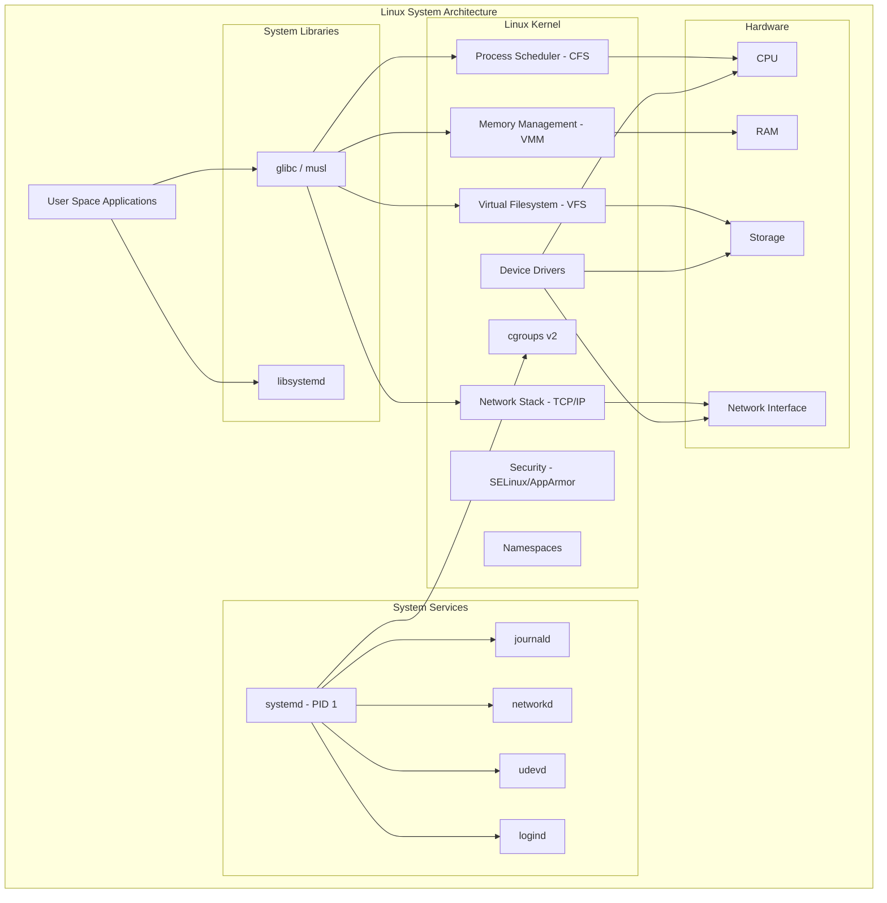
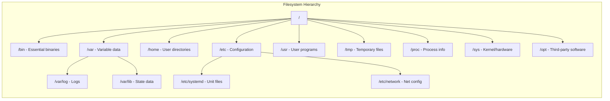

# Linux Administration

## Quick Reference

- Linux filesystem follows the Filesystem Hierarchy Standard (FHS): `/` root, `/etc` configuration, `/var` variable data, `/home` user directories, `/usr` user programs, `/tmp` temporary files
- Process states: Running (R), Sleeping (S), Stopped (T), Zombie (Z), Dead (X)
- systemd manages services with unit files in `/etc/systemd/system/` and `/lib/systemd/system/`
- File permissions use octal notation (755) or symbolic (rwxr-xr-x) with owner, group, and others
- Key networking tools: `ip`, `ss`, `netstat`, `dig`, `nslookup`, `traceroute`, `curl`, `tcpdump`
- Process signals: SIGTERM (15) for graceful shutdown, SIGKILL (9) for forced termination, SIGHUP (1) for reload
- Shell scripts start with a shebang (`#!/bin/bash`) and should use `set -euo pipefail` for safety
- Package managers: `apt` (Debian/Ubuntu), `yum`/`dnf` (RHEL/CentOS), `pacman` (Arch)
- Cron syntax: `minute hour day-of-month month day-of-week command`

## When to Use

Linux administration skills are essential for any backend or infrastructure engineer working with production systems. You need these skills when provisioning and configuring servers, debugging application issues in production, managing deployments on bare metal or cloud instances, and troubleshooting network connectivity problems. Linux knowledge is critical for understanding how containers work under the hood since Docker and Kubernetes rely on Linux kernel features like namespaces and cgroups. Use these skills when writing automation scripts for deployment pipelines, configuring systemd services for application lifecycle management, setting up proper file permissions for security compliance, and diagnosing performance bottlenecks through process and resource monitoring. These fundamentals apply whether you are managing a single EC2 instance or orchestrating hundreds of nodes in a Kubernetes cluster. Every production incident investigation starts with Linux command-line tools for log analysis, process inspection, and network diagnostics.

## File System Hierarchy

The Linux filesystem is organized as a single inverted tree rooted at `/`, following the Filesystem Hierarchy Standard (FHS). Understanding this hierarchy is fundamental to locating configuration files, logs, binaries, and application data on any Linux distribution. The root directory contains all other directories and mount points, creating a unified namespace regardless of how many physical disks or partitions exist underneath.

The `/etc` directory holds system-wide configuration files in plain text format. Application configurations like `/etc/nginx/nginx.conf`, `/etc/ssh/sshd_config`, and `/etc/fstab` live here. Changes to files in `/etc` typically require root privileges and often need a service restart to take effect. The `/var` directory stores variable data that changes during system operation: logs in `/var/log`, mail spools in `/var/mail`, and application runtime data in `/var/lib`. Log rotation configured in `/etc/logrotate.d/` prevents `/var/log` from consuming all disk space.

The `/usr` hierarchy contains user-space programs and libraries. `/usr/bin` holds most user commands, `/usr/lib` contains shared libraries, and `/usr/share` stores architecture-independent data like documentation and locale files. The `/opt` directory is reserved for third-party software packages that do not follow the standard filesystem layout. The `/proc` and `/sys` virtual filesystems expose kernel and hardware information as files, enabling tools like `top`, `free`, and `lscpu` to read system state without special system calls. The `/tmp` directory provides temporary storage cleared on reboot, while `/var/tmp` persists across reboots for longer-lived temporary files.

Mount points allow attaching additional filesystems anywhere in the tree. The `/etc/fstab` file defines persistent mounts applied at boot, while `mount` and `umount` commands handle runtime mounting. Modern systems use `systemd.mount` units for mount management, providing dependency ordering and automatic mounting on access via `systemd.automount` units.

## Process Management

Every running program on a Linux system is a process with a unique Process ID (PID). The kernel's process scheduler allocates CPU time using the Completely Fair Scheduler (CFS), which assigns virtual runtime to each process and always runs the process with the smallest virtual runtime. Process priority is influenced by the nice value (ranging from -20 highest priority to 19 lowest) and the real-time scheduling classes (SCHED_FIFO, SCHED_RR) for time-critical applications.

Processes exist in a parent-child hierarchy rooted at PID 1 (systemd on modern systems). When a parent process terminates, its children are reparented to PID 1. A zombie process occurs when a child exits but its parent has not yet called `wait()` to collect the exit status. Zombies consume no resources beyond a process table entry, but large numbers indicate a buggy parent process. Orphaned processes are adopted by init and reaped automatically.

The `ps` command displays process information with various output formats. `ps aux` shows all processes with user, CPU, memory, and command details. `ps -ef` provides a full-format listing with parent PID relationships. The `top` and `htop` utilities offer real-time interactive views of process activity, CPU usage, memory consumption, and load averages. The `pgrep` and `pkill` commands find and signal processes by name pattern, avoiding fragile `ps | grep` pipelines.

Signal handling is the primary mechanism for inter-process communication and process control. SIGTERM (15) requests graceful termination, allowing the process to clean up resources and save state. SIGKILL (9) forces immediate termination without cleanup and cannot be caught or ignored. SIGHUP (1) traditionally signals configuration reload for daemons. SIGSTOP and SIGCONT pause and resume process execution. Applications should implement signal handlers for SIGTERM to ensure graceful shutdown in containerized environments where orchestrators send SIGTERM before SIGKILL after a grace period.

## Systemd

Systemd is the init system and service manager for most modern Linux distributions, replacing SysVinit and Upstart. It manages the complete system lifecycle from boot to shutdown, handling service dependencies, socket activation, timer-based scheduling, and resource control through cgroups. Systemd uses unit files as its configuration format, with different unit types for different purposes: service units (`.service`) for daemons, timer units (`.timer`) for scheduled tasks, mount units (`.mount`) for filesystems, and target units (`.target`) for grouping.

Service unit files define how to start, stop, and monitor a daemon. The `[Unit]` section declares dependencies and ordering with `After=`, `Requires=`, and `Wants=` directives. The `[Service]` section specifies the execution model: `Type=simple` for foreground processes, `Type=forking` for traditional daemons that fork, `Type=notify` for services that signal readiness via `sd_notify()`, and `Type=oneshot` for one-time initialization tasks. The `[Install]` section defines how the unit integrates into the boot sequence through `WantedBy=` and `RequiredBy=` targets.

The `systemctl` command is the primary interface for managing systemd units. Common operations include `systemctl start|stop|restart|reload <unit>` for lifecycle control, `systemctl enable|disable <unit>` for boot persistence, `systemctl status <unit>` for current state and recent logs, and `systemctl daemon-reload` after modifying unit files. The `journalctl` command queries the systemd journal for structured logs, supporting filters by unit (`-u`), time range (`--since`, `--until`), priority (`-p`), and output format (`-o json`).

Systemd provides resource control through cgroup integration. Unit files can specify `MemoryMax=`, `CPUQuota=`, `IOWeight=`, and `TasksMax=` to limit resource consumption. These controls prevent runaway processes from affecting other services on the same host. Socket activation (`Type=socket`) allows systemd to listen on ports and start services on-demand, reducing boot time and memory usage for infrequently accessed services. Timer units replace cron for scheduled tasks, offering calendar-based and monotonic scheduling with persistent timers that catch up on missed runs.

## Networking Commands

Linux networking is managed through a layered stack of tools and configuration files. The `ip` command (from iproute2) is the modern replacement for `ifconfig`, `route`, and `arp`. It manages network interfaces (`ip link`), IP addresses (`ip addr`), routing tables (`ip route`), and neighbor caches (`ip neigh`). Understanding these tools is essential for diagnosing connectivity issues, configuring network interfaces, and troubleshooting routing problems in production environments.

The `ss` command (socket statistics) replaces `netstat` for displaying socket information. `ss -tlnp` shows all TCP listening sockets with process names, essential for verifying which services are bound to which ports. `ss -s` provides a summary of socket statistics including TCP connection states. For DNS troubleshooting, `dig` provides detailed DNS query information including response times, authoritative servers, and record TTLs. `nslookup` offers simpler DNS lookups, while `host` provides concise output for quick checks.

Network diagnostics rely on `ping` for basic connectivity testing (ICMP echo), `traceroute` (or `mtr` for continuous monitoring) for path analysis showing each hop between source and destination, and `tcpdump` for packet capture and analysis. The `curl` command tests HTTP endpoints with full control over headers, methods, and authentication. For persistent network configuration, modern distributions use either `netplan` (Ubuntu), `NetworkManager` (desktop/RHEL), or `systemd-networkd` (server) to manage interface configuration, DHCP, and static addressing.

Firewall management on modern Linux uses `nftables` (replacing `iptables`) or the `firewalld` frontend. Rules are organized into tables, chains, and rules that filter packets based on source, destination, port, protocol, and connection state. The `ufw` (Uncomplicated Firewall) provides a simplified interface for common firewall operations on Ubuntu systems. Understanding firewall rules is critical for security hardening and debugging connectivity issues where applications appear unreachable despite being correctly configured.

## Permissions

Linux file permissions implement a discretionary access control (DAC) model with three permission types (read, write, execute) applied to three categories (owner, group, others). Each file and directory has an owner user, an owner group, and a permission mask that determines who can access it and how. The `ls -la` command displays permissions in symbolic notation (e.g., `-rwxr-xr-x`), where the first character indicates file type (`-` regular, `d` directory, `l` symlink) and the remaining nine characters represent owner, group, and other permissions.

The `chmod` command modifies permissions using either octal notation (`chmod 755 file`) or symbolic notation (`chmod u+x,g-w file`). For directories, read permission allows listing contents, write permission allows creating and deleting files within, and execute permission allows traversing (entering) the directory. The `chown` command changes file ownership (`chown user:group file`), and `chgrp` changes only the group. The `umask` value (typically 022) defines default permissions for newly created files by masking bits from the maximum (666 for files, 777 for directories).

Special permissions extend the basic model. The setuid bit (4000) on an executable runs it with the file owner's privileges regardless of who executes it, used by programs like `passwd` that need root access. The setgid bit (2000) on a directory causes new files to inherit the directory's group rather than the creator's primary group, useful for shared project directories. The sticky bit (1000) on a directory prevents users from deleting files they do not own, applied to `/tmp` to prevent users from removing each other's temporary files.

Access Control Lists (ACLs) provide fine-grained permissions beyond the traditional owner/group/others model. The `setfacl` and `getfacl` commands manage ACLs, allowing specific users or groups to have different permissions on the same file. ACLs are essential in multi-team environments where the simple three-category model is insufficient. Linux capabilities (`cap_net_bind_service`, `cap_sys_admin`, etc.) further decompose root privileges into discrete units, allowing processes to hold only the specific privileges they need rather than full root access.

## Shell Scripting

Shell scripting automates repetitive system administration tasks, deployment procedures, and operational workflows. Bash is the most common shell for scripting on Linux systems, providing variables, control structures, functions, and process management. Every production script should begin with `#!/bin/bash` (or `#!/usr/bin/env bash` for portability) and include `set -euo pipefail` to enable strict error handling: `-e` exits on any command failure, `-u` treats unset variables as errors, `-o pipefail` propagates failures through pipelines.

Variables in bash are untyped strings by default. Local variables use `local` keyword inside functions to avoid polluting the global namespace. Command substitution (`$(command)` or backticks) captures command output into variables. Arithmetic operations use `$(( ))` syntax or the `let` builtin. Arrays support indexed (`${arr[0]}`) and associative (`declare -A map`) access patterns. String manipulation includes substring extraction (`${var:offset:length}`), pattern replacement (`${var/pattern/replacement}`), and default values (`${var:-default}`).

Control structures include `if/elif/else/fi` for conditionals, `for/while/until` loops, and `case` statements for pattern matching. The `test` command (or `[[ ]]` in bash) evaluates conditions including file tests (`-f`, `-d`, `-e`, `-r`, `-w`, `-x`), string comparisons (`==`, `!=`, `<`, `>`), and numeric comparisons (`-eq`, `-ne`, `-lt`, `-gt`, `-le`, `-ge`). Functions are defined with `function_name() { }` syntax and receive arguments as positional parameters (`$1`, `$2`, `$@`). Exit codes (`$?`) communicate success (0) or failure (non-zero) between commands and scripts.

Production shell scripts should include proper error handling with `trap` for cleanup on exit, input validation for all arguments, logging with timestamps, and idempotent operations that can be safely re-run. Here-documents (`<<EOF`) embed multi-line text, and process substitution (`<(command)`) treats command output as a file. The `xargs` command builds and executes commands from standard input, while `find` with `-exec` processes files matching complex criteria. For complex automation beyond simple scripting, consider tools like Ansible, Terraform, or Python scripts that offer better error handling, testing, and maintainability.

## Code Examples

### Systemd Service Unit for a Java Application

```bash
# /etc/systemd/system/myapp.service
[Unit]
Description=My Java Application
Documentation=https://wiki.internal/myapp
After=network-online.target postgresql.service
Wants=network-online.target
Requires=postgresql.service

[Service]
Type=notify
User=appuser
Group=appgroup
WorkingDirectory=/opt/myapp

# Environment and JVM configuration
Environment=JAVA_HOME=/usr/lib/jvm/java-21-openjdk
Environment=SPRING_PROFILES_ACTIVE=production
Environment=JAVA_OPTS=-XX:MaxRAMPercentage=75.0 -XX:+UseG1GC -XX:+ExitOnOutOfMemoryError

# Execution
ExecStart=/usr/lib/jvm/java-21-openjdk/bin/java $JAVA_OPTS -jar /opt/myapp/app.jar
ExecStop=/bin/kill -SIGTERM $MAINPID

# Resource limits
MemoryMax=2G
CPUQuota=200%
TasksMax=512

# Restart policy
Restart=on-failure
RestartSec=10
StartLimitIntervalSec=300
StartLimitBurst=5

# Security hardening
NoNewPrivileges=true
ProtectSystem=strict
ProtectHome=true
ReadWritePaths=/var/log/myapp /var/lib/myapp
PrivateTmp=true
ProtectKernelTunables=true
ProtectKernelModules=true

# Logging
StandardOutput=journal
StandardError=journal
SyslogIdentifier=myapp

[Install]
WantedBy=multi-user.target
```

### Production Shell Script for Log Analysis and Alerting

```bash
#!/usr/bin/env bash
set -euo pipefail

# Configuration
readonly LOG_DIR="/var/log/myapp"
readonly ALERT_THRESHOLD=50
readonly SLACK_WEBHOOK="${SLACK_WEBHOOK_URL:-}"
readonly LOOKBACK_MINUTES=5

# Logging function with timestamps
log() {
    echo "[$(date '+%Y-%m-%d %H:%M:%S')] $*" >&2
}

# Cleanup on exit
cleanup() {
    local exit_code=$?
    rm -f "${TEMP_FILE:-}"
    log "Script exited with code $exit_code"
    exit "$exit_code"
}
trap cleanup EXIT

# Validate dependencies
for cmd in jq curl awk; do
    if ! command -v "$cmd" &>/dev/null; then
        log "ERROR: Required command '$cmd' not found"
        exit 1
    fi
done

# Count errors in recent logs
count_recent_errors() {
    local since
    since=$(date -d "$LOOKBACK_MINUTES minutes ago" '+%Y-%m-%dT%H:%M:%S' 2>/dev/null || \
            date -v-"${LOOKBACK_MINUTES}M" '+%Y-%m-%dT%H:%M:%S')
    
    local count
    count=$(journalctl -u myapp --since="$since" --no-pager -o json | \
            jq -r 'select(.PRIORITY <= "3") | .MESSAGE' | \
            wc -l)
    
    echo "$count"
}

# Send alert to Slack
send_alert() {
    local error_count="$1"
    local sample_errors="$2"
    
    if [[ -z "$SLACK_WEBHOOK" ]]; then
        log "WARN: SLACK_WEBHOOK_URL not set, skipping alert"
        return 0
    fi
    
    local payload
    payload=$(jq -n \
        --arg count "$error_count" \
        --arg errors "$sample_errors" \
        --arg host "$(hostname)" \
        '{
            text: "🚨 High error rate detected",
            blocks: [
                {type: "header", text: {type: "plain_text", text: "Error Rate Alert"}},
                {type: "section", text: {type: "mrkdwn", text: ("*Host:* " + $host + "\n*Errors in last 5min:* " + $count + "\n*Sample:*\n```" + $errors + "```")}}
            ]
        }')
    
    curl -sf -X POST -H 'Content-Type: application/json' \
        -d "$payload" "$SLACK_WEBHOOK" || log "WARN: Failed to send Slack alert"
}

# Main execution
main() {
    log "Checking error rate for myapp service"
    
    local error_count
    error_count=$(count_recent_errors)
    
    log "Found $error_count errors in last $LOOKBACK_MINUTES minutes"
    
    if (( error_count >= ALERT_THRESHOLD )); then
        log "ALERT: Error count ($error_count) exceeds threshold ($ALERT_THRESHOLD)"
        
        TEMP_FILE=$(mktemp)
        journalctl -u myapp --since="$LOOKBACK_MINUTES minutes ago" --no-pager -p err | \
            tail -5 > "$TEMP_FILE"
        
        send_alert "$error_count" "$(cat "$TEMP_FILE")"
    fi
}

main "$@"
```

## Architecture and Diagrams





## Common Pitfalls

1. **Running services as root unnecessarily**: Many administrators run application services as root out of convenience, creating a massive security risk. If the application is compromised, the attacker gains full system access. Always create dedicated service accounts with minimal privileges, use systemd's `User=` and `Group=` directives, and apply security hardening options like `NoNewPrivileges=true` and `ProtectSystem=strict`.

2. **Ignoring exit codes in scripts**: Bash scripts without `set -e` continue executing after command failures, potentially causing cascading damage. A failed `cd` followed by `rm -rf *` could delete files in the wrong directory. Always use `set -euo pipefail` and explicitly handle expected failures with `|| true` or conditional checks.

3. **Modifying files in `/usr` or `/lib` directly**: These directories are managed by the package manager. Manual changes are overwritten on updates and make the system state unpredictable. Use `/etc` for configuration overrides, `/usr/local` for locally installed software, and `/opt` for third-party packages.

4. **Not rotating logs**: Applications writing to log files without rotation will eventually fill the disk, causing service outages. Configure logrotate for all application logs with appropriate size limits, retention periods, and compression. Use `journalctl --vacuum-size=500M` to limit journal size.

5. **Using `chmod 777` as a fix**: Granting full permissions to everyone is never the correct solution. It indicates a misunderstanding of the actual permission requirement. Diagnose which user or group needs access, set appropriate ownership with `chown`, and grant minimal necessary permissions. Use ACLs for complex multi-user scenarios.

6. **Killing processes with SIGKILL first**: Sending SIGKILL (kill -9) prevents graceful shutdown, potentially corrupting data, leaving lock files, and orphaning child processes. Always send SIGTERM first and wait for the process to exit cleanly. Only escalate to SIGKILL after a reasonable timeout (typically 10-30 seconds).

## Real-World Use Cases

- **Production deployment automation**: Shell scripts orchestrate zero-downtime deployments by draining connections from the load balancer, stopping the service via systemctl, deploying new artifacts, running health checks, and re-registering with the load balancer. Systemd ensures the service restarts automatically if it crashes post-deployment.

- **Incident response and debugging**: When a production service becomes unresponsive, engineers use `journalctl -u service --since "10 minutes ago"` for recent logs, `ss -tlnp` to verify port bindings, `top` or `htop` to identify resource consumption, `strace -p PID` to trace system calls, and `tcpdump` to capture network traffic. These tools provide immediate visibility without requiring application-level instrumentation.

- **Security hardening for compliance**: Enterprises configure file permissions to meet CIS benchmarks, implement SELinux or AppArmor mandatory access controls, restrict SSH access with key-based authentication only, configure firewall rules to allow only necessary traffic, and audit system changes with `auditd`. Systemd security directives provide defense-in-depth for each service.

- **Automated monitoring and alerting**: Cron jobs or systemd timers run scripts that check disk usage (`df`), memory pressure (`/proc/meminfo`), process health (`systemctl is-active`), and log error rates (`journalctl`). When thresholds are exceeded, scripts send alerts via webhook integrations to Slack, PagerDuty, or email, enabling rapid response before users are impacted.

## Interview Questions

**Q: Explain the difference between hard links and soft links (symlinks).**
A: A hard link is an additional directory entry pointing to the same inode (data blocks) as the original file. Both names are equal references to the same data, and the file persists until all hard links are removed. Hard links cannot cross filesystem boundaries or link to directories. A soft link (symlink) is a separate file containing the path to the target. It can cross filesystems and link to directories, but becomes a dangling link if the target is deleted. Use `ln` for hard links and `ln -s` for symlinks.

**Q: What happens when you run a command in Linux? Describe the process creation lifecycle.**
A: The shell calls `fork()` to create a child process (exact copy of the shell), then the child calls `execve()` to replace its memory image with the new program. The kernel loads the executable, sets up the virtual address space, and begins execution at the entry point. The parent shell calls `wait()` to block until the child exits. The child's exit status is returned to the parent. For background processes (`&`), the shell skips the `wait()` call and continues immediately.

**Q: How does systemd handle service dependencies and startup ordering?**
A: Systemd uses `After=`/`Before=` for ordering (which unit starts first) and `Requires=`/`Wants=` for dependencies (which units must be running). `Requires=` creates a hard dependency where the dependent unit fails if the required unit fails. `Wants=` is a soft dependency that does not propagate failures. `After=` only controls startup order without creating a dependency. Systemd parallelizes startup of units that have no ordering constraints, significantly reducing boot time compared to sequential init systems.

**Q: Explain Linux file permissions and how setuid works.**
A: Each file has read (4), write (2), and execute (1) permissions for owner, group, and others. The setuid bit (4000) causes an executable to run with the file owner's effective UID rather than the caller's. This allows unprivileged users to perform privileged operations through controlled programs (e.g., `passwd` runs as root to modify `/etc/shadow`). Setuid is a security-sensitive feature because a vulnerability in a setuid-root program grants full system access. Modern systems prefer Linux capabilities for fine-grained privilege delegation.

**Q: How would you diagnose a Linux server running out of memory?**
A: Check `/proc/meminfo` for total, free, available, and cached memory. Use `free -h` for a quick summary. Run `top` sorted by memory (`M` key) or `ps aux --sort=-%mem` to identify the largest consumers. Check `/var/log/kern.log` or `dmesg` for OOM killer messages that show which process was killed and why. Examine `/proc/[pid]/status` for individual process memory details (VmRSS for resident memory). Long-term, configure cgroup memory limits via systemd to prevent individual services from consuming all available memory.

## Production Tips

- **Systemd security hardening**: Apply `ProtectSystem=strict`, `ProtectHome=true`, `NoNewPrivileges=true`, `PrivateTmp=true`, and `ReadWritePaths=` only for directories the service actually needs. Use `systemd-analyze security <unit>` to audit the security posture of each service and identify additional hardening opportunities. These directives use Linux namespaces to create restricted views of the filesystem.

- **Journal management**: Configure journal size limits in `/etc/systemd/journald.conf` with `SystemMaxUse=500M` and `MaxRetentionSec=30day` to prevent unbounded growth. Use `journalctl --disk-usage` to monitor current consumption. Forward critical logs to a centralized system (Splunk, ELK, CloudWatch) for long-term retention and cross-host correlation.

- **Process resource limits**: Set `LimitNOFILE=` in systemd units for applications that need many open file descriptors (databases, web servers). Configure `LimitCORE=infinity` during debugging to capture core dumps, but disable in production. Use `MemoryMax=` and `CPUQuota=` to prevent resource exhaustion. Monitor with `systemctl show <unit> --property=MemoryCurrent`.

- **SSH hardening**: Disable password authentication (`PasswordAuthentication no`), disable root login (`PermitRootLogin no`), use key-based authentication only, restrict allowed users with `AllowUsers` or `AllowGroups`, change the default port, and configure `fail2ban` to block brute-force attempts. Use SSH certificates for large-scale environments instead of managing individual authorized_keys files.

- **Disk monitoring and alerts**: Monitor disk usage with automated checks that alert at 80% capacity, giving time to respond before services fail. Use `lsof +D /path` to find processes holding deleted files (common cause of phantom disk usage). Configure `logrotate` with `compress`, `delaycompress`, and appropriate `maxsize` settings for all application logs.

## Related Topics

- [Docker & Containerization](./docker/index.md) - Containers rely on Linux kernel features (namespaces, cgroups) that Linux administration covers
- [CI/CD Pipelines](./ci-cd-pipelines.md) - Pipeline agents run on Linux and use shell scripts for build and deployment automation
- [Observability](./observability/index.md) - Linux system metrics and logs feed into observability platforms for monitoring and alerting
