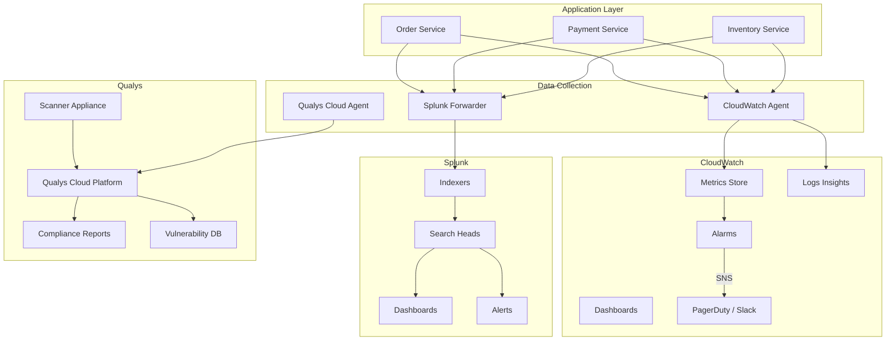
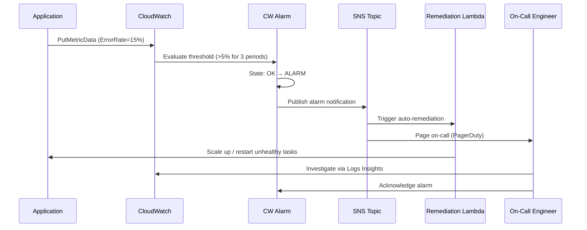

# Observability

## Quick Reference

- Observability is the ability to understand a system's internal state from its external outputs: metrics, logs, and traces
- Three pillars: Metrics (numeric measurements over time), Logs (discrete event records), Traces (request flow across services)
- CloudWatch provides AWS-native metrics collection, dashboards, alarms, and automated remediation actions
- Splunk ingests, indexes, and searches machine data at scale with SPL (Search Processing Language)
- Qualys provides continuous vulnerability scanning, asset inventory, and compliance reporting
- MELT framework: Metrics, Events, Logs, Traces — the four telemetry data types for full observability
- Alert fatigue is the primary operational risk; use tiered severity and actionable alarm thresholds

## When to Use

Observability tooling is essential for any production distributed system where you need to detect, diagnose, and resolve issues before they impact users. Use CloudWatch when operating AWS infrastructure and you need native integration with EC2, ECS, EKS, Lambda, RDS, and other AWS services for metrics collection and alarm-driven automation. CloudWatch is the right choice for auto-scaling triggers, billing alerts, and operational dashboards that correlate infrastructure metrics with application health. Use Splunk when you need centralized log aggregation across heterogeneous systems, complex log correlation across microservices, real-time alerting on log patterns, and long-term log retention for compliance or forensic analysis. Splunk excels at ad-hoc investigation during incidents where you need to search terabytes of log data with sub-second response times. Use Qualys when you need continuous vulnerability assessment across your infrastructure, compliance reporting against frameworks like PCI-DSS or SOC 2, and automated scanning of container images and web applications. Qualys is particularly valuable in regulated environments where you must demonstrate patch compliance and vulnerability remediation within defined SLAs.

## CloudWatch Metrics and Alarms

CloudWatch is the foundational monitoring service for AWS workloads, collecting metrics from over 70 AWS services automatically. Custom metrics extend this to application-level telemetry. CloudWatch alarms evaluate metric conditions and trigger actions including SNS notifications, Auto Scaling policies, and Systems Manager runbooks.

### Metric Types and Namespaces

AWS services publish metrics to namespaces like `AWS/EC2`, `AWS/ECS`, `AWS/RDS`, and `AWS/Lambda`. Each metric is identified by a namespace, metric name, and dimensions (key-value pairs that segment data). Standard resolution metrics are published at 1-minute intervals; high-resolution custom metrics can be published at 1-second intervals for latency-sensitive workloads.

### Alarm Configuration

Alarms evaluate a metric against a threshold over a specified number of evaluation periods. A well-configured alarm uses composite conditions to reduce false positives. For example, triggering only when CPU exceeds 80% for 3 consecutive 5-minute periods prevents transient spikes from generating noise. Alarms transition through three states: OK, ALARM, and INSUFFICIENT_DATA.

### CloudWatch Logs Insights

CloudWatch Logs Insights provides an interactive query language for analyzing log groups. It supports filtering, aggregation, pattern detection, and visualization directly within the AWS console, making it useful for quick investigations without requiring a separate log analysis platform.

### Embedded Metric Format

The Embedded Metric Format (EMF) allows applications to emit structured log entries that CloudWatch automatically extracts as custom metrics. This eliminates the need for separate PutMetricData API calls and enables high-cardinality metric dimensions without additional cost per unique dimension value.

## Splunk Log Analysis

Splunk is an enterprise platform for searching, monitoring, and analyzing machine-generated data. It ingests data from any source — application logs, infrastructure metrics, network traffic, security events — and makes it searchable through the Search Processing Language (SPL). Splunk's architecture consists of forwarders (collect and forward data), indexers (parse, index, and store data), and search heads (coordinate searches and serve the UI).

### Search Processing Language (SPL)

SPL is Splunk's query language for searching, filtering, transforming, and visualizing data. Searches start with an index and time range, then pipe through commands for filtering (`where`, `search`), transformation (`stats`, `timechart`, `eval`), and presentation (`table`, `chart`). SPL supports subsearches, lookups, macros, and transaction correlation for complex investigations.

### Index Management and Data Retention

Splunk organizes data into indexes with configurable retention policies. Hot buckets receive new data, warm buckets are searchable but no longer written to, cold buckets are moved to cheaper storage, and frozen buckets are archived or deleted. Proper index design balances search performance against storage costs, with typical retention ranging from 30 days for verbose debug logs to 7 years for compliance-relevant audit trails.

### Alerting and Dashboards

Splunk alerts trigger when scheduled searches match defined conditions. Real-time alerts evaluate continuously but consume more resources; scheduled alerts run at intervals and are preferred for most use cases. Dashboards combine multiple visualizations (timecharts, single-value panels, maps, tables) into operational views that teams monitor during incidents and daily operations.

### Log Correlation Across Microservices

In distributed systems, a single user request traverses multiple services. Splunk correlates logs across services using a shared correlation ID (trace ID) propagated through HTTP headers. By searching for a specific trace ID, operators can reconstruct the full request path, identify which service introduced latency, and pinpoint error origins across dozens of microservices.

## Qualys Vulnerability Scanning

Qualys is a cloud-based platform for vulnerability management, compliance monitoring, and web application security. It provides continuous scanning of network assets, cloud workloads, containers, and web applications to identify known vulnerabilities (CVEs), misconfigurations, and compliance gaps. Qualys assigns QID (Qualys ID) numbers to each detection and maps findings to CVSS scores for prioritization.

### Scan Types and Scheduling

Qualys supports multiple scan types: network vulnerability scans (authenticated and unauthenticated), web application scans (DAST), container image scans, cloud agent-based continuous assessment, and compliance scans against CIS benchmarks. Authenticated scans use credentials to inspect installed packages and configurations, providing significantly more accurate results than unauthenticated network scans. Scan schedules balance thoroughness against system impact, with most organizations running weekly full scans and daily delta scans.

### Vulnerability Prioritization and Remediation

Not all vulnerabilities require immediate action. Qualys integrates CVSS base scores with threat intelligence (active exploitation in the wild, availability of public exploits) to produce a Real-Time Threat Indicator (RTI) score. Teams use RTI combined with asset criticality to prioritize remediation efforts. A critical CVSS 9.8 vulnerability on an internet-facing production server demands immediate patching, while the same vulnerability on an isolated development machine can follow standard patch cycles.

### Compliance Reporting

Qualys Policy Compliance evaluates systems against regulatory frameworks (PCI-DSS, HIPAA, SOC 2) and industry benchmarks (CIS). Reports map individual controls to scan findings, showing pass/fail status for each requirement. This automated evidence collection reduces audit preparation time from weeks to hours and provides continuous compliance posture visibility rather than point-in-time assessments.

## Code Examples

### CloudWatch Custom Metrics and Alarms (AWS CDK)

```typescript
import * as cdk from 'aws-cdk-lib';
import * as cloudwatch from 'aws-cdk-lib/aws-cloudwatch';
import * as sns from 'aws-cdk-lib/aws-sns';
import * as actions from 'aws-cdk-lib/aws-cloudwatch-actions';

// Publish custom application metric
const orderProcessingLatency = new cloudwatch.Metric({
  namespace: 'MyApp/OrderService',
  metricName: 'ProcessingLatencyMs',
  dimensionsMap: { Environment: 'production', Service: 'order-service' },
  statistic: 'p99',
  period: cdk.Duration.minutes(5),
});

// Create alarm with composite evaluation
const latencyAlarm = new cloudwatch.Alarm(this, 'HighLatencyAlarm', {
  metric: orderProcessingLatency,
  threshold: 2000, // 2 seconds p99
  evaluationPeriods: 3,
  datapointsToAlarm: 2, // 2 of 3 periods must breach
  comparisonOperator: cloudwatch.ComparisonOperator.GREATER_THAN_THRESHOLD,
  treatMissingData: cloudwatch.TreatMissingData.NOT_BREACHING,
  alarmDescription: 'Order processing p99 latency exceeds 2s for 2 of 3 periods',
});

// Alarm action: notify on-call team
const oncallTopic = new sns.Topic(this, 'OncallTopic');
latencyAlarm.addAlarmAction(new actions.SnsAction(oncallTopic));

// CloudWatch Embedded Metric Format (application code)
const emfLog = {
  _aws: {
    Timestamp: Date.now(),
    CloudWatchMetrics: [{
      Namespace: 'MyApp/OrderService',
      Dimensions: [['Environment', 'Service']],
      Metrics: [{ Name: 'ProcessingLatencyMs', Unit: 'Milliseconds' }],
    }],
  },
  Environment: 'production',
  Service: 'order-service',
  ProcessingLatencyMs: 145,
  OrderId: 'ord-12345',
};
console.log(JSON.stringify(emfLog)); // CloudWatch agent extracts metric
```

### Splunk SPL Queries for Incident Investigation

```spl
// Find all errors for a specific trace across services
index=microservices traceid="abc-123-def-456" level=ERROR
| table _time, service, message, exception
| sort _time

// Aggregate error rates by service over last hour
index=microservices level=ERROR earliest=-1h
| stats count as errors by service
| sort -errors
| head 10

// Detect anomalous response times using standard deviation
index=microservices sourcetype=access_log
| timechart span=5m avg(response_time_ms) as avg_rt, stdev(response_time_ms) as stdev_rt
| eval upper_bound = avg_rt + (3 * stdev_rt)
| where avg_rt > upper_bound

// Correlate deployment events with error spikes
index=microservices level=ERROR earliest=-24h
| timechart span=15m count as error_count
| appendcols [search index=deployments earliest=-24h | timechart span=15m count as deploys]
| where deploys > 0 OR error_count > 100

// Transaction analysis: trace full request lifecycle
index=microservices traceid=*
| transaction traceid maxspan=30s
| where duration > 5
| stats avg(duration) as avg_duration, count by service
| sort -avg_duration
```

### Qualys API Integration for Vulnerability Reporting

```python
import requests
from datetime import datetime, timedelta

class QualysClient:
    def __init__(self, base_url: str, username: str, password: str):
        self.base_url = base_url
        self.session = requests.Session()
        self.session.auth = (username, password)
        self.session.headers.update({'X-Requested-With': 'Python'})

    def get_critical_vulnerabilities(self, days_back: int = 7) -> list:
        """Fetch critical/high vulnerabilities detected in the last N days."""
        since_date = (datetime.now() - timedelta(days=days_back)).strftime('%Y-%m-%d')
        
        params = {
            'action': 'list',
            'detection_updated_since': since_date,
            'severities': '4,5',  # 4=High, 5=Critical
            'status': 'New,Active,Re-Opened',
        }
        
        response = self.session.get(
            f'{self.base_url}/api/2.0/fo/asset/host/vm/detection/',
            params=params
        )
        response.raise_for_status()
        return self._parse_detections(response.text)

    def generate_patch_report(self, asset_group: str) -> dict:
        """Generate remediation report for an asset group."""
        params = {
            'action': 'list',
            'asset_group_titles': asset_group,
            'include_remediation': 1,
        }
        
        response = self.session.get(
            f'{self.base_url}/api/2.0/fo/report/',
            params=params
        )
        response.raise_for_status()
        return {
            'total_vulns': response.json().get('total', 0),
            'critical': response.json().get('severity_5', 0),
            'high': response.json().get('severity_4', 0),
            'remediation_steps': response.json().get('patches', []),
        }
```

## Architecture and Diagrams





## Common Pitfalls

1. **Alert fatigue from noisy alarms**: Setting thresholds too aggressively or using single-period evaluation creates constant false alarms that teams learn to ignore. Use composite alarms, require multiple breaching datapoints, and implement tiered severity levels so that only genuinely actionable conditions page on-call engineers.

2. **Missing correlation IDs in logs**: Without a consistent trace ID propagated across all services, correlating logs during an incident becomes a manual timestamp-matching exercise. Ensure every service propagates and logs a correlation ID from the entry point through all downstream calls, including async message processing.

3. **Unbounded log volume and cost**: Verbose debug logging in production generates massive data volumes that inflate Splunk licensing costs and CloudWatch Logs charges. Implement structured logging with configurable log levels, sample verbose logs at a percentage in production, and set retention policies that match actual investigation needs.

4. **Scanning without remediation workflows**: Running Qualys scans without a defined process for triaging, assigning, and tracking remediation creates a growing backlog of unaddressed vulnerabilities. Integrate scan results with ticketing systems (Jira, ServiceNow) and define SLAs by severity: critical within 48 hours, high within 7 days, medium within 30 days.

5. **Dashboard sprawl without ownership**: Creating dozens of dashboards without clear ownership leads to stale, unmaintained views that mislead operators. Assign each dashboard an owner, review quarterly for relevance, and consolidate overlapping views into authoritative operational dashboards per service team.

## Real-World Use Cases

- **Auto-scaling based on custom metrics**: An e-commerce platform publishes order queue depth as a CloudWatch custom metric. When the metric exceeds 1000 pending orders for 2 consecutive minutes, a CloudWatch alarm triggers an Auto Scaling policy that adds ECS tasks to the order processing service, reducing queue depth without manual intervention.

- **Incident root cause analysis with Splunk**: During a payment processing outage, the on-call engineer searches Splunk for the affected trace IDs, discovers a spike in timeout errors from a downstream banking API, correlates the timing with a DNS resolution failure logged by the infrastructure team, and identifies a misconfigured DNS TTL as the root cause within 15 minutes.

- **Compliance-driven vulnerability management**: A fintech company uses Qualys to continuously scan all production assets against PCI-DSS requirements. Weekly reports automatically generate Jira tickets for new critical findings, and the security team tracks mean-time-to-remediate (MTTR) as a key metric reported to the board quarterly.

- **Proactive capacity planning**: CloudWatch metrics for CPU utilization, memory usage, and network throughput are aggregated into weekly trend reports. The platform team identifies services approaching capacity limits 2-3 weeks before saturation, enabling proactive scaling decisions rather than reactive incident response.

## Interview Questions

**Q: What are the three pillars of observability and how do they differ?**
A: Metrics are numeric measurements aggregated over time (CPU usage, request rate, error count), optimized for alerting and trend analysis. Logs are discrete, timestamped event records with arbitrary detail, optimized for debugging specific incidents. Traces follow a single request across service boundaries, showing latency breakdown and dependency relationships. Together they provide complementary views: metrics tell you something is wrong, logs tell you what went wrong, and traces tell you where it went wrong.

**Q: How would you design a CloudWatch alarm to minimize false positives?**
A: Use composite alarms that combine multiple conditions (e.g., high error rate AND low request count indicates a real problem, not just a single failed request). Require multiple consecutive breaching datapoints (e.g., 3 of 5 evaluation periods). Set `TreatMissingData` to `NOT_BREACHING` to avoid alarms during maintenance windows. Use anomaly detection bands instead of static thresholds for metrics with variable baselines like traffic volume.

**Q: Explain how you would investigate a latency spike using Splunk.**
A: Start by identifying the time window of the spike from metrics dashboards. Search Splunk for requests exceeding the latency threshold during that window, filtering by the affected service. Group results by downstream dependency to identify which calls are slow. Use transaction commands to trace individual slow requests end-to-end. Check for correlated events like deployments, configuration changes, or infrastructure issues in the same time window. Compare slow request patterns against normal baseline to identify the distinguishing factor.

**Q: How does Qualys prioritize vulnerabilities for remediation?**
A: Qualys combines the CVSS base score (severity of the vulnerability itself) with contextual factors: whether active exploits exist in the wild (Real-Time Threat Indicators), the asset's exposure (internet-facing vs. internal), the asset's business criticality, and compensating controls in place. This produces a prioritized list where a CVSS 7.0 vulnerability with active exploitation on a public-facing server ranks higher than a CVSS 9.0 vulnerability on an isolated development machine with no known exploits.

## Production Tips

- **Implement structured logging from day one**: Use JSON-formatted logs with consistent fields (timestamp, service, level, traceId, message, error) across all services. Structured logs enable efficient Splunk field extraction without custom regex, reduce indexing costs, and make cross-service correlation trivial compared to unstructured text logs.

- **Set up CloudWatch anomaly detection for baseline metrics**: Rather than guessing static thresholds for metrics like request count or latency, use CloudWatch anomaly detection which builds a model of expected behavior accounting for daily and weekly patterns. Alarms trigger only when metrics deviate significantly from the learned baseline, dramatically reducing false positives for metrics with natural variability.

- **Establish vulnerability SLAs before your first scan**: Define remediation timelines by severity before running Qualys scans (e.g., Critical: 48h, High: 7d, Medium: 30d, Low: 90d). Without pre-agreed SLAs, the initial scan results overwhelm teams and nothing gets prioritized. Start with critical and high findings only, achieve consistent remediation, then expand scope.

- **Use CloudWatch Contributor Insights for high-cardinality debugging**: When you need to identify which specific customer, API key, or endpoint is causing elevated error rates, Contributor Insights analyzes log groups to surface the top contributors to a pattern without requiring pre-defined dimensions or custom metrics for every possible value.

## Related Topics

- [AWS Services](./aws-services.md) - CloudWatch integrates deeply with all AWS services for native metric collection
- [CI/CD Pipelines](./ci-cd-pipelines.md) - Pipeline observability ensures deployment health and enables automated rollbacks
- [Kubernetes & EKS](./kubernetes-eks.md) - Container orchestration requires specialized observability for pod health, resource utilization, and cluster metrics
