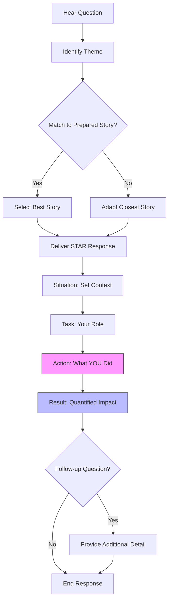

# Behavioral Interview Prep

## Quick Reference

- **STAR Method**: Situation → Task → Action → Result — structure every behavioral answer with this framework
- **Key Themes**: Leadership, conflict resolution, failure/learning, teamwork, ambiguity, customer focus
- **Preparation Rule**: Have 5-7 detailed stories that can be adapted to cover multiple behavioral questions
- **Time Target**: Keep answers between 2-3 minutes; concise but detailed enough to demonstrate impact
- **Quantify Impact**: Always include metrics — reduced latency by 40%, saved 20 hours per sprint, improved uptime from 99.5% to 99.99%
- **Company Research**: Map your stories to the target company's leadership principles or core values before the interview
- **Follow-Up Readiness**: Prepare 2-3 thoughtful questions about team culture, technical challenges, and growth opportunities

## When to Use

This reference is essential when preparing for behavioral and leadership interviews at technology companies. Most senior engineering roles include at least one behavioral round assessing collaboration, leadership, conflict resolution, and decision-making skills. Use this material to structure your personal stories, practice delivery, and ensure you cover the key competencies interviewers evaluate.

Behavioral interviews carry significant weight in hiring decisions, particularly at senior and staff levels where technical skills are assumed and the differentiator becomes how effectively you lead, communicate, and navigate complex organizational dynamics. Companies like Amazon dedicate entire interview loops to behavioral questions mapped to their leadership principles, while Google evaluates "Googleyness" through behavioral scenarios.

The STAR method provides a repeatable framework that prevents rambling and ensures you deliver complete, impactful answers. Without structure, candidates often provide too much context, skip the action they personally took, or forget to articulate the measurable result. Practicing with STAR transforms vague recollections into compelling narratives that demonstrate your value.

## Code Examples

### Story Preparation Template

```markdown
## Story: [Title - e.g., "Migrated Legacy Monolith to Microservices"]

### Situation (30 seconds)
- Company/team context
- Scale: users, requests/sec, team size
- Problem or challenge that existed

### Task (15 seconds)
- Your specific responsibility
- What was expected of you
- Constraints or timeline pressure

### Action (60-90 seconds)
- Steps YOU took (use "I" not "we")
- Technical decisions and trade-offs
- How you influenced or led others
- Obstacles you overcame

### Result (30 seconds)
- Quantified outcome (metrics!)
- Business impact
- What you learned
- What you would do differently

### Adaptability Tags
- [leadership] [technical-decision] [conflict] [ambiguity] [failure]
```

### Story Matrix for Interview Coverage

```markdown
| Story | Leadership | Conflict | Failure | Ambiguity | Customer | Technical |
|-------|-----------|----------|---------|-----------|----------|-----------|
| Microservice Migration | ✓ | | | ✓ | | ✓ |
| Production Incident | ✓ | | ✓ | | ✓ | ✓ |
| Cross-Team API Design | | ✓ | | ✓ | ✓ | ✓ |
| Mentoring Junior Dev | ✓ | | | | | |
| Deadline Negotiation | | ✓ | | ✓ | ✓ | |
| Performance Optimization | | | ✓ | | ✓ | ✓ |
| Process Improvement | ✓ | ✓ | | | | |
```

## Architecture and Interview Flow



## Common Pitfalls

- **Using "we" instead of "I"**: Interviewers want to understand your individual contribution. While acknowledging teamwork is fine, the focus must be on what you specifically did, decided, or influenced. Replace "we decided" with "I proposed and the team agreed" or "I led the effort to."

- **Providing too much context**: Spending 2 minutes on the situation leaves no time for the action and result, which are the most important parts. Keep the situation to 30 seconds maximum — just enough for the interviewer to understand the stakes.

- **Lacking quantified results**: Saying "it went well" or "the project was successful" is not compelling. Every story needs numbers: percentage improvements, time saved, revenue impact, error rate reduction, or team velocity gains. If you cannot measure the direct outcome, measure the proxy.

- **Not preparing enough stories**: Having only 2-3 stories means you will force-fit them to questions they do not match. Prepare 5-7 diverse stories covering different themes so you always have a natural fit for any question category.

- **Choosing only success stories**: Interviewers specifically ask about failures, conflicts, and mistakes. Candidates who cannot discuss genuine failures appear either dishonest or lacking self-awareness. Choose real failures where you learned something meaningful and changed your behavior.

- **Rambling without structure**: Without the STAR framework, answers meander through tangents and lose the interviewer's attention. Practice delivering each story in exactly 2-3 minutes with clear transitions between Situation, Task, Action, and Result.

- **Failing to connect to the role**: Generic stories without relevance to the position you are interviewing for miss the opportunity to demonstrate fit. Tailor the emphasis of each story to highlight skills directly relevant to the job description and team needs.

## Real-World Use Cases

Behavioral interview skills extend far beyond the interview room into daily engineering leadership. The ability to articulate technical decisions clearly, frame problems with appropriate context, and quantify impact are essential skills for writing design documents, presenting to stakeholders, and advocating for technical investments.

Senior engineers regularly use STAR-like frameworks when writing post-mortems after production incidents. The situation describes the system state and trigger, the task outlines the expected behavior, the action details the response steps taken, and the result quantifies the resolution time and preventive measures implemented.

Performance review self-assessments benefit directly from behavioral interview preparation. Engineers who maintain a running log of STAR-formatted accomplishments can quickly produce compelling promotion packets that demonstrate leadership, technical depth, and measurable business impact.

Cross-functional communication with product managers, designers, and executives requires the same skills tested in behavioral interviews: concise context-setting, clear articulation of trade-offs, and quantified outcomes. Engineers who practice behavioral storytelling become more effective advocates for technical priorities and resource allocation.

## Common Interview Questions

**Q: Tell me about a time you disagreed with a technical decision.**
A: Use STAR to describe the context, explain your reasoning and the alternative you proposed, how you communicated your perspective respectfully, and the outcome whether or not your approach was adopted. Emphasize that you committed to the final decision even if it was not yours.

**Q: Describe a project where you had to deal with ambiguity.**
A: Focus on how you broke down the ambiguous problem into smaller knowable pieces, what steps you took to gather information from stakeholders and data, how you made decisions with incomplete data while managing risk, and what the measurable result was.

**Q: Tell me about a time you failed.**
A: Choose a genuine failure with real consequences, own it without deflecting blame to others or circumstances, explain the specific lesson you learned, and describe concrete changes you made to prevent similar issues. The best answers show growth and self-awareness.

**Q: Describe a situation where you had to influence without authority.**
A: Highlight how you built consensus through data, prototypes, or pilot programs rather than positional power. Explain how you identified stakeholders, understood their concerns, and found solutions that addressed multiple perspectives while achieving the technical goal.

**Q: Tell me about a time you mentored someone.**
A: Describe the person's starting point, the specific approach you took to develop their skills (pairing, code reviews, stretch assignments), how you balanced their growth with project delivery, and the measurable improvement in their capabilities or output.

**Q: How do you handle competing priorities from multiple stakeholders?**
A: Explain your framework for prioritization (impact vs effort, business urgency, technical dependencies), how you communicated trade-offs transparently, and how you negotiated timelines or scope to deliver maximum value within constraints.

## Production Tips

- **Quantify your impact**: Always include metrics in your stories — reduced latency by 40%, saved 20 engineering hours per sprint, improved deployment frequency from weekly to daily, reduced on-call pages by 60%. Numbers make stories memorable and credible.
- **Tailor stories to the company's values**: Research the company's leadership principles or core values and map your stories to demonstrate alignment with their specific culture. Amazon values "Bias for Action" and "Dive Deep" while Google values "Respect the User" and collaborative problem-solving.
- **Maintain a brag document**: Keep a running log of accomplishments, decisions, and outcomes throughout your career. Update it weekly with small wins and quarterly with major achievements. This makes interview prep a matter of selection rather than recall.
- **Practice out loud**: Reading stories silently is not sufficient preparation. Practice delivering them verbally, ideally with a timer, to build muscle memory for the 2-3 minute target and identify sections that feel awkward or unclear when spoken.
- **Prepare for the "why" follow-ups**: Interviewers often probe deeper with "why did you choose that approach?" or "what would you do differently?" Having thought through alternatives and trade-offs in advance prevents stumbling on follow-up questions.

## Related Topics

- [Interview Prep - Cracking the Coding Interview](./cracking-the-coding-interview.md)
- [Interview Prep - Grokking Algorithms](./grokking-algorithms.md)
- [Backend - Incident Response](../backend/incident-response.md)
- [System Design - System Design](../system-design/system-design.md)

Behavioral preparation complements technical interview skills by ensuring you can communicate your expertise effectively. Incident response knowledge provides excellent source material for behavioral stories about leadership under pressure. System design discussions often include behavioral elements around trade-off communication and stakeholder management.
