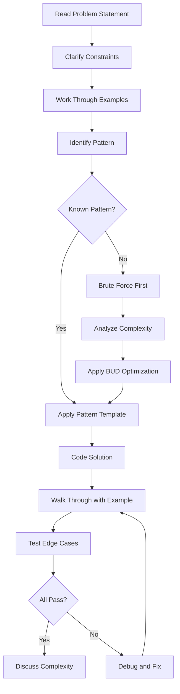

# Cracking the Coding Interview

## Quick Reference

- **Big O Analysis**: Always discuss time and space complexity for every solution
- **BUD Optimization**: Look for Bottlenecks, Unnecessary work, and Duplicated work
- **Problem-Solving Flow**: Listen → Example → Brute Force → Optimize → Walk Through → Implement → Test
- **Data Structure Selection**: Arrays for indexed access, hash maps for O(1) lookup, trees for hierarchical data, graphs for relationships
- **Testing Strategy**: Normal cases → Edge cases → Null/empty inputs → Large inputs → Error conditions
- **Pattern Recognition**: Most interview problems map to one of ~15 core patterns including sliding window, two pointers, fast/slow pointers, merge intervals, cyclic sort, in-place linked list reversal, BFS, DFS, two heaps, subsets, modified binary search, top-K elements, K-way merge, topological sort, and dynamic programming
- **Communication Framework**: State assumptions explicitly, ask clarifying questions, verbalize trade-offs, and confirm understanding before coding

## When to Use

This reference is essential when preparing for technical coding interviews at top technology companies. The strategies and patterns here apply to whiteboard interviews, online assessments, and take-home coding challenges. Use this material when you need to practice structured problem-solving approaches, when you want to review common algorithm patterns, or when preparing for system design discussions that require algorithmic foundations.

The book's methodology is particularly valuable for candidates transitioning from day-to-day engineering work to interview mode. Production engineers often solve problems incrementally with access to documentation and debugging tools, but interviews require solving novel problems under time pressure with clear communication. The frameworks here bridge that gap by providing repeatable processes for decomposing unfamiliar problems into manageable steps.

## Code Examples

### BFS Template for Graph/Tree Problems

```java
public List<Integer> bfs(TreeNode root) {
    List<Integer> result = new ArrayList<>();
    if (root == null) return result;

    Queue<TreeNode> queue = new LinkedList<>();
    queue.offer(root);

    while (!queue.isEmpty()) {
        int levelSize = queue.size();
        for (int i = 0; i < levelSize; i++) {
            TreeNode node = queue.poll();
            result.add(node.val);
            if (node.left != null) queue.offer(node.left);
            if (node.right != null) queue.offer(node.right);
        }
    }
    return result;
}
```

### Two Pointer Pattern

```java
public int[] twoSum(int[] sorted, int target) {
    int left = 0, right = sorted.length - 1;
    while (left < right) {
        int sum = sorted[left] + sorted[right];
        if (sum == target) return new int[]{left, right};
        else if (sum < target) left++;
        else right--;
    }
    return new int[]{-1, -1};
}
```

### Sliding Window Pattern

```java
public int maxSumSubarray(int[] nums, int k) {
    int windowSum = 0, maxSum = Integer.MIN_VALUE;
    for (int i = 0; i < nums.length; i++) {
        windowSum += nums[i];
        if (i >= k - 1) {
            maxSum = Math.max(maxSum, windowSum);
            windowSum -= nums[i - (k - 1)];
        }
    }
    return maxSum;
}
```

## Architecture and Problem-Solving Framework



## Common Pitfalls

- **Jumping to code too quickly**: Always discuss your approach before writing code; interviewers want to see your thought process and communication skills before implementation. Spend at least 5-10 minutes understanding the problem and planning your approach.
- **Ignoring edge cases**: Null inputs, empty arrays, single-element collections, negative numbers, integer overflow, and duplicate values are common traps that interviewers specifically test for. Write out your test cases before coding.
- **Not optimizing from brute force**: Starting with brute force is fine, but you must demonstrate the ability to identify inefficiencies and improve; use BUD (Bottlenecks, Unnecessary work, Duplicated work) analysis systematically.
- **Poor time management**: Spending too long on one approach without pivoting; if stuck for more than 5 minutes, ask for a hint or try a different data structure. A 45-minute interview typically allows 5 minutes for clarification, 10 for design, 20 for coding, and 10 for testing.
- **Forgetting space complexity**: Many candidates optimize time complexity but ignore space; always mention both and discuss trade-offs between time and space. Interviewers specifically look for this awareness.
- **Not communicating while coding**: Silence during implementation makes it impossible for the interviewer to help you or assess your thinking. Narrate your decisions as you write code, explaining why you chose specific variable names, loop structures, or conditional checks.
- **Overcomplicating the solution**: The best interview solutions are elegant and simple. If your solution requires more than 30-40 lines of code for a typical problem, step back and consider whether a simpler approach exists using a different data structure or algorithm pattern.

## Real-World Use Cases

The problem-solving patterns from coding interviews directly apply to production engineering. Two-pointer and sliding window techniques appear in stream processing systems where you analyze windows of events in real-time data pipelines. For example, monitoring systems use sliding windows to calculate rolling averages of request latency, detect anomalies in traffic patterns, and trigger alerts when error rates exceed thresholds within a time window.

Graph traversal algorithms power recommendation engines, social network features, and dependency resolution in build systems. In microservice architectures, BFS is used to trace request paths through service meshes for distributed tracing, while DFS helps identify circular dependencies in module graphs during build validation.

Dynamic programming concepts underlie caching strategies, resource allocation, and optimization problems in distributed systems. The knapsack problem variant appears in container bin-packing for Kubernetes scheduling, where the scheduler must optimally allocate CPU and memory resources across nodes. Sequence alignment algorithms from DP are used in log analysis tools to identify similar error patterns across different services.

Hash map patterns are fundamental to building efficient caches, indexes, and lookup tables in microservice architectures. Consistent hashing, a direct application of hash map concepts, distributes load across cache nodes in systems like Redis clusters and CDN edge servers.

## Common Interview Questions

**Q: How do you approach a problem you have never seen before?**
A: Start by clarifying constraints, work through small examples to identify patterns, develop a brute force solution first, then optimize using BUD analysis while communicating your thought process throughout.

**Q: When should you use BFS vs DFS?**
A: Use BFS when finding shortest paths in unweighted graphs or level-order traversal; use DFS when exploring all paths, detecting cycles, or when memory is constrained since DFS uses O(h) space vs O(w) for BFS.

**Q: How do you handle a problem that seems to require exponential time?**
A: Look for overlapping subproblems (dynamic programming), greedy choices that lead to optimal solutions, or problem constraints that allow pruning the search space; discuss the trade-off between exact and approximate solutions.

**Q: What is the difference between top-down and bottom-up dynamic programming?**
A: Top-down (memoization) starts from the original problem and caches subproblem results recursively; bottom-up (tabulation) builds solutions from smallest subproblems iteratively, avoiding recursion overhead and stack overflow risks.

**Q: How do you decide which data structure to use for a given problem?**
A: Consider the operations you need most frequently — arrays for indexed access and iteration, hash maps for O(1) lookup and frequency counting, heaps for repeated min/max extraction, trees for ordered operations, and graphs for relationship modeling. The constraints often hint at the expected complexity.

## Production Tips

- **Algorithm selection matters at scale**: A solution that works for n=100 may fail at n=10^6; always consider the production data volume when choosing algorithms and data structures. Profile with realistic data sizes before committing to an approach.
- **Space-time trade-offs are real decisions**: In production, memory costs money; sometimes an O(n log n) solution with O(1) space is preferable to O(n) time with O(n) space depending on your infrastructure constraints and whether you are CPU-bound or memory-bound.
- **Concurrency changes complexity**: Single-threaded optimal solutions may need redesign for concurrent access; consider thread safety, lock contention, and concurrent data structures when moving from interview solutions to production code. A lock-free queue has different performance characteristics than a synchronized ArrayList.
- **Input validation is non-negotiable**: Interview solutions often assume valid input, but production code must handle malformed data, null values, and adversarial inputs gracefully. Always add bounds checking and input sanitization before applying algorithmic logic.
- **Measure before optimizing**: The theoretical best algorithm is not always the practical best. Cache effects, branch prediction, and memory allocation patterns can make a theoretically slower algorithm faster in practice. Use profiling tools to identify actual bottlenecks.

## Related Topics

- [Data Structures & Algorithms - Array](../data-structures-and-algorithms/array.md)
- [Data Structures & Algorithms - Graph](../data-structures-and-algorithms/graph.md)
- [Data Structures & Algorithms - Tree](../data-structures-and-algorithms/tree.md)
- [Data Structures & Algorithms - Big O Notation](../data-structures-and-algorithms/big-o-notation.md)
- [Interview Prep - Grokking Algorithms](./grokking-algorithms.md)
- [Interview Prep - Behavioral Prep](./behavioral-prep.md)
- [System Design - Design Patterns](../system-design/design-patterns.md)

These related topics provide the foundational knowledge that coding interview problems build upon. Understanding data structures deeply allows you to recognize which structure fits a given problem, while Big O analysis ensures you can evaluate and communicate the efficiency of your solutions. Behavioral preparation complements technical skills by helping you communicate effectively during the interview process.
