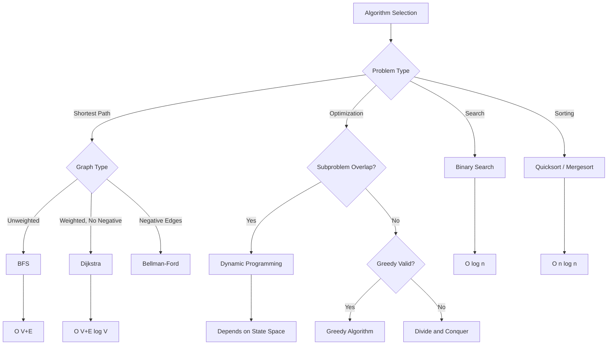

# Grokking Algorithms

## Quick Reference

- **Binary Search**: O(log n) — only works on sorted arrays; eliminates half the search space each step
- **Breadth-First Search**: O(V + E) — finds shortest path in unweighted graphs; uses a queue
- **Dijkstra's Algorithm**: O((V + E) log V) — finds shortest path in weighted graphs with non-negative edges; uses a priority queue
- **Dynamic Programming**: Break problems into overlapping subproblems; store results to avoid recomputation; requires optimal substructure
- **Greedy Algorithms**: Make locally optimal choices at each step; works when local optimum leads to global optimum; prove correctness via exchange argument
- **Divide and Conquer**: Split problem into smaller independent subproblems, solve recursively, combine results; examples include merge sort and quicksort

## When to Use

This reference covers fundamental algorithm concepts presented in an intuitive, visual manner. Use this material when you need to build strong algorithmic intuition before tackling more complex problems, when reviewing core algorithms for interviews, or when you need clear mental models for how algorithms work step by step. The concepts here form the foundation for more advanced topics in system design and distributed computing.

The visual and intuitive approach makes this particularly valuable for engineers who learn best through concrete examples rather than abstract mathematical proofs. Each algorithm is presented with step-by-step walkthroughs that build understanding from first principles, making it easier to adapt these patterns to novel problems encountered in interviews or production systems.

## Code Examples

### Binary Search Implementation

```java
public int binarySearch(int[] arr, int target) {
    int low = 0, high = arr.length - 1;

    while (low <= high) {
        int mid = low + (high - low) / 2;  // Avoid integer overflow
        if (arr[mid] == target) return mid;
        else if (arr[mid] < target) low = mid + 1;
        else high = mid - 1;
    }
    return -1;  // Not found
}
```

### Dijkstra's Algorithm

```java
public int[] dijkstra(Map<Integer, List<int[]>> graph, int source, int n) {
    int[] dist = new int[n];
    Arrays.fill(dist, Integer.MAX_VALUE);
    dist[source] = 0;

    // Priority queue: [distance, node]
    PriorityQueue<int[]> pq = new PriorityQueue<>((a, b) -> a[0] - b[0]);
    pq.offer(new int[]{0, source});

    while (!pq.isEmpty()) {
        int[] curr = pq.poll();
        int d = curr[0], u = curr[1];

        if (d > dist[u]) continue;  // Skip outdated entries

        for (int[] edge : graph.getOrDefault(u, List.of())) {
            int v = edge[0], weight = edge[1];
            if (dist[u] + weight < dist[v]) {
                dist[v] = dist[u] + weight;
                pq.offer(new int[]{dist[v], v});
            }
        }
    }
    return dist;
}
```

### Dynamic Programming — Longest Common Subsequence

```java
public int longestCommonSubsequence(String text1, String text2) {
    int m = text1.length(), n = text2.length();
    int[][] dp = new int[m + 1][n + 1];

    for (int i = 1; i <= m; i++) {
        for (int j = 1; j <= n; j++) {
            if (text1.charAt(i - 1) == text2.charAt(j - 1)) {
                dp[i][j] = dp[i - 1][j - 1] + 1;
            } else {
                dp[i][j] = Math.max(dp[i - 1][j], dp[i][j - 1]);
            }
        }
    }
    return dp[m][n];
}
```

## Architecture and Algorithm Relationships



## Common Pitfalls

- **Applying Dijkstra with negative edges**: Dijkstra's algorithm does not work correctly with negative edge weights because it assumes once a node is finalized, its shortest distance will not change; use Bellman-Ford instead for graphs with negative weights
- **Confusing greedy with dynamic programming**: Greedy algorithms make irrevocable local choices and work only when the greedy choice property holds; if subproblems overlap and local choices do not guarantee global optimum, you need dynamic programming
- **Off-by-one errors in binary search**: The boundary conditions (low <= high vs low < high) and mid calculation (mid + 1 vs mid) are common sources of infinite loops or missed elements; always trace through with a 1-element and 2-element array
- **Forgetting base cases in recursion**: Every recursive solution needs explicit base cases; missing them leads to stack overflow; for DP, ensure your table initialization covers all base cases before filling dependent cells
- **Using DFS when BFS is needed for shortest path**: DFS finds a path but not necessarily the shortest one in unweighted graphs; always use BFS when shortest path in terms of number of edges is required

## Real-World Use Cases

Binary search powers database index lookups, finding insertion points in sorted event streams, and version bisecting in git. When a production system needs to find a specific record among millions of sorted entries, binary search provides logarithmic lookup time that scales gracefully. Git bisect uses binary search to identify the exact commit that introduced a bug across thousands of commits.

BFS and Dijkstra's algorithm underlie routing in network protocols, GPS navigation systems, and content delivery network path optimization. Internet routing protocols like OSPF use Dijkstra's algorithm to compute shortest paths through network topologies, while CDNs use graph algorithms to determine the optimal edge server for each user request.

Dynamic programming drives resource allocation in cloud computing, sequence alignment in bioinformatics, and optimal pricing strategies in e-commerce. Kubernetes scheduler uses DP-like approaches for bin-packing containers onto nodes, and recommendation engines use DP to optimize the sequence of items shown to users.

Greedy algorithms are used in Huffman encoding for data compression, task scheduling in operating systems, and minimum spanning tree construction for network infrastructure planning. The Linux kernel's Completely Fair Scheduler uses a greedy approach with a red-black tree to allocate CPU time slices fairly across processes.

## Common Interview Questions

**Q: When would you choose BFS over Dijkstra's algorithm?**
A: Use BFS when all edges have equal weight (or unweighted) since it naturally finds shortest paths in O(V+E) without the overhead of a priority queue; Dijkstra is needed only when edges have varying non-negative weights.

**Q: How do you identify if a problem can be solved with dynamic programming?**
A: Look for two properties: optimal substructure (optimal solution contains optimal solutions to subproblems) and overlapping subproblems (same subproblems are solved multiple times); if both exist, DP applies.

**Q: What is the difference between Divide and Conquer and Dynamic Programming?**
A: Both break problems into subproblems, but Divide and Conquer solves independent subproblems (like merge sort halves), while DP handles overlapping subproblems by storing results to avoid redundant computation.

**Q: Can you explain the greedy choice property?**
A: A problem has the greedy choice property when making the locally optimal choice at each step leads to a globally optimal solution; this must be proven (often by exchange argument) and does not hold for all optimization problems.

**Q: What happens if you apply Dijkstra's algorithm to a graph with negative edge weights?**
A: Dijkstra may produce incorrect results because it assumes once a node is finalized its distance is optimal. A negative edge could provide a shorter path through an already-finalized node. Use Bellman-Ford for graphs with negative edges, which relaxes all edges V-1 times to handle this case.

## Production Tips

- **Algorithm choice impacts system latency**: In production systems processing millions of requests, the difference between O(n) and O(n log n) translates to real latency; profile your hot paths and choose algorithms based on actual data distributions, not just worst-case analysis
- **Cache-friendly algorithms outperform theoretical optimums**: An algorithm with worse Big O but better cache locality (sequential memory access) often outperforms theoretically faster algorithms on modern hardware; consider memory access patterns when choosing between implementations like array-based vs pointer-based data structures
- **Approximate algorithms are often sufficient**: In production, you rarely need exact solutions; approximate algorithms (like HyperLogLog for cardinality, bloom filters for membership) provide massive performance gains with acceptable error bounds for use cases like analytics and deduplication
- **Understand your data distribution**: Average-case performance often matters more than worst-case in production. Quicksort's O(n^2) worst case rarely occurs with randomized pivots on real data, making it faster in practice than merge sort's guaranteed O(n log n) due to better cache behavior and lower constant factors

## Related Topics

- [Data Structures & Algorithms - Graph](../data-structures-and-algorithms/graph.md)
- [Data Structures & Algorithms - Big O Notation](../data-structures-and-algorithms/big-o-notation.md)
- [Data Structures & Algorithms - Tree](../data-structures-and-algorithms/tree.md)
- [Data Structures & Algorithms - Heap](../data-structures-and-algorithms/heap.md)
- [Interview Prep - Cracking the Coding Interview](./cracking-the-coding-interview.md)
- [System Design - System Design](../system-design/system-design.md)

Understanding these related topics deepens your ability to apply the algorithms covered here. Graph and tree data structures are the foundation for BFS, DFS, and Dijkstra's algorithm. Heaps (priority queues) are essential for efficient implementations of Dijkstra and for solving top-K problems. Big O notation provides the framework for analyzing and comparing algorithm efficiency. System design knowledge shows how these algorithms scale in distributed production environments.
