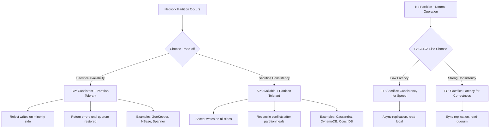
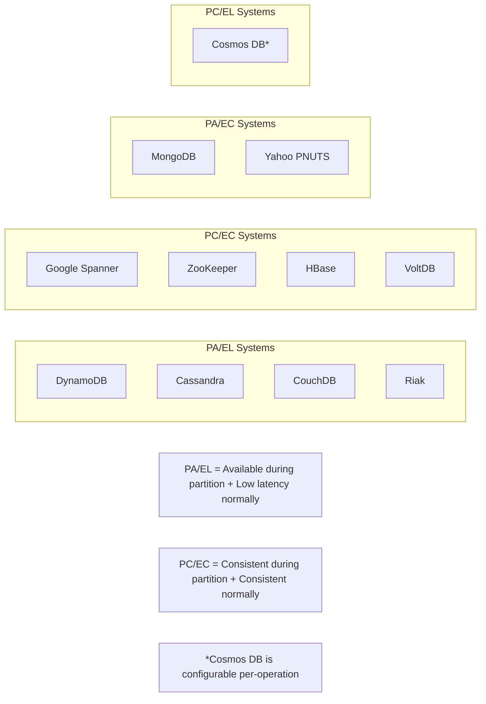
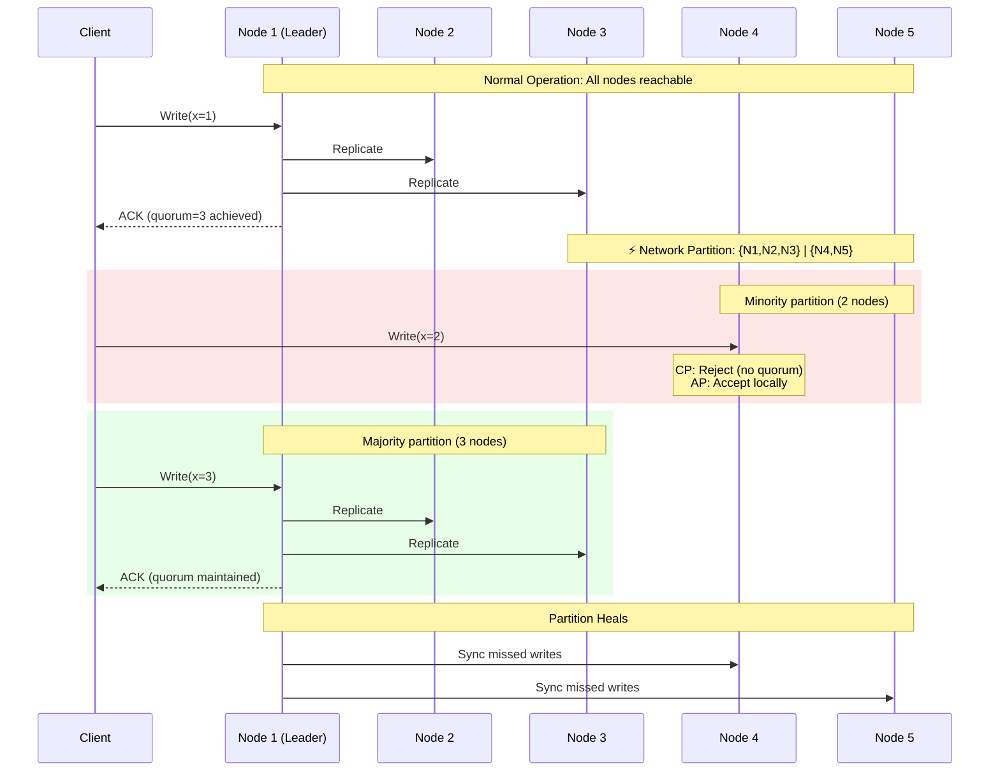

# CAP Theorem In Depth

## Quick Reference

- **CAP theorem** (Brewer's theorem): In the presence of a network partition, a distributed system must choose between consistency (C) and availability (A) — you cannot guarantee both simultaneously
- The formal proof by Gilbert and Lynch (2002) models a distributed system as asynchronous processes communicating via unreliable channels, showing that no algorithm can simultaneously satisfy atomic consistency, availability, and partition tolerance
- **PACELC** extends CAP: if there is a Partition, choose between Availability and Consistency; Else (normal operation), choose between Latency and Consistency
- Real systems are not binary CP or AP — they exist on a spectrum and often make different trade-offs for different operations or data types within the same system
- Partition tolerance is not optional in production distributed systems; the real choice is between CP (sacrifice availability during partitions) and AP (sacrifice consistency during partitions)
- CAP consistency refers specifically to linearizability (atomic consistency), not the "C" in ACID which refers to application-level invariants
- Network partitions in production are more nuanced than total disconnection — asymmetric partitions, partial partitions, and gray failures are common

## When to Use

CAP theorem analysis applies when you are designing any system that stores data across multiple nodes connected by a network. You need deep CAP understanding when choosing between database technologies (e.g., DynamoDB vs. CockroachDB), when designing replication strategies for stateful services, when configuring consistency levels in systems like Cassandra or Cosmos DB, when reasoning about failure modes during system design interviews, and when making architectural decisions about how your system behaves during network issues. PACELC is particularly relevant when you need to reason about latency trade-offs during normal (non-partitioned) operation — which is the majority of the time in well-run production systems.

## Code Examples

### Configuring Consistency Levels in Cassandra (Demonstrating CAP Trade-offs)

```java
import com.datastax.oss.driver.api.core.CqlSession;
import com.datastax.oss.driver.api.core.ConsistencyLevel;
import com.datastax.oss.driver.api.core.cql.SimpleStatement;
import com.datastax.oss.driver.api.core.cql.ResultSet;

public class CassandraConsistencyDemo {

    private final CqlSession session;

    public CassandraConsistencyDemo(CqlSession session) {
        this.session = session;
    }

    /**
     * Strong consistency (CP behavior): QUORUM read + QUORUM write
     * guarantees linearizable reads when RF=3.
     * Trade-off: Higher latency, reduced availability during partitions.
     */
    public ResultSet readStrongConsistency(String userId) {
        SimpleStatement stmt = SimpleStatement.builder(
                "SELECT * FROM users WHERE user_id = ?")
            .addPositionalValue(userId)
            .setConsistencyLevel(ConsistencyLevel.QUORUM)  // Majority must respond
            .build();
        return session.execute(stmt);
    }

    /**
     * Eventual consistency (AP behavior): ONE read + ONE write
     * maximizes availability and minimizes latency.
     * Trade-off: May read stale data; relies on anti-entropy repair.
     */
    public ResultSet readEventualConsistency(String userId) {
        SimpleStatement stmt = SimpleStatement.builder(
                "SELECT * FROM users WHERE user_id = ?")
            .addPositionalValue(userId)
            .setConsistencyLevel(ConsistencyLevel.ONE)  // Any single replica
            .build();
        return session.execute(stmt);
    }

    /**
     * Write with LOCAL_QUORUM for multi-datacenter deployments.
     * Provides strong consistency within a datacenter while allowing
     * async replication across datacenters (PA/EL in PACELC terms).
     */
    public void writeLocalStrong(String userId, String name, String email) {
        SimpleStatement stmt = SimpleStatement.builder(
                "INSERT INTO users (user_id, name, email, updated_at) VALUES (?, ?, ?, toTimestamp(now()))")
            .addPositionalValues(userId, name, email)
            .setConsistencyLevel(ConsistencyLevel.LOCAL_QUORUM)
            .build();
        session.execute(stmt);
    }

    /**
     * Demonstrates the CAP trade-off: if we require ALL replicas,
     * a single node failure makes the operation unavailable (extreme CP).
     */
    public ResultSet readAllReplicas(String userId) {
        SimpleStatement stmt = SimpleStatement.builder(
                "SELECT * FROM users WHERE user_id = ?")
            .addPositionalValue(userId)
            .setConsistencyLevel(ConsistencyLevel.ALL)  // Every replica must respond
            .build();
        return session.execute(stmt);
    }
}
```

### Implementing a Simple Partition Detector and Mode Switcher

```typescript
import { EventEmitter } from 'events';

interface PartitionDetectorConfig {
  heartbeatIntervalMs: number;
  heartbeatTimeoutMs: number;
  minReachableNodes: number;  // Minimum nodes to consider "not partitioned"
  totalNodes: number;
}

type SystemMode = 'consistent' | 'available';

/**
 * Detects network partitions by monitoring heartbeats from peer nodes.
 * When a partition is detected, the system switches from CP mode to AP mode
 * (or vice versa) based on configuration.
 */
class PartitionAwareService extends EventEmitter {
  private reachableNodes: Set<string> = new Set();
  private currentMode: SystemMode = 'consistent';
  private config: PartitionDetectorConfig;
  private lastHeartbeat: Map<string, number> = new Map();

  constructor(config: PartitionDetectorConfig) {
    super();
    this.config = config;
  }

  /**
   * Called when a heartbeat is received from a peer node.
   */
  onHeartbeatReceived(nodeId: string): void {
    this.lastHeartbeat.set(nodeId, Date.now());
    this.reachableNodes.add(nodeId);
    this.evaluatePartitionState();
  }

  /**
   * Periodic check: mark nodes as unreachable if heartbeat timed out.
   */
  checkHeartbeats(): void {
    const now = Date.now();
    for (const [nodeId, lastSeen] of this.lastHeartbeat.entries()) {
      if (now - lastSeen > this.config.heartbeatTimeoutMs) {
        this.reachableNodes.delete(nodeId);
      }
    }
    this.evaluatePartitionState();
  }

  /**
   * Evaluate whether we are in a partition and switch modes accordingly.
   * This implements the "P" decision in CAP/PACELC.
   */
  private evaluatePartitionState(): void {
    const reachableCount = this.reachableNodes.size;
    const previousMode = this.currentMode;

    if (reachableCount < this.config.minReachableNodes) {
      // Partition detected: not enough nodes reachable for quorum
      // Switch to AP mode: accept writes locally, reconcile later
      this.currentMode = 'available';
    } else {
      // Sufficient nodes reachable: operate in CP mode with quorum
      this.currentMode = 'consistent';
    }

    if (previousMode !== this.currentMode) {
      this.emit('modeChange', {
        from: previousMode,
        to: this.currentMode,
        reachableNodes: reachableCount,
        totalNodes: this.config.totalNodes,
      });
    }
  }

  getMode(): SystemMode {
    return this.currentMode;
  }

  /**
   * Application-level decision: how to handle a write based on current mode.
   */
  async handleWrite(key: string, value: unknown): Promise<WriteResult> {
    if (this.currentMode === 'consistent') {
      // CP mode: require quorum acknowledgment before confirming write
      return this.writeWithQuorum(key, value);
    } else {
      // AP mode: accept write locally, queue for reconciliation
      return this.writeLocalWithReconciliation(key, value);
    }
  }

  private async writeWithQuorum(key: string, value: unknown): Promise<WriteResult> {
    // Implementation: replicate to majority before ACK
    return { status: 'committed', mode: 'consistent', replicas: this.config.minReachableNodes };
  }

  private async writeLocalWithReconciliation(key: string, value: unknown): Promise<WriteResult> {
    // Implementation: write locally, add to reconciliation queue
    return { status: 'accepted', mode: 'available', pendingReconciliation: true };
  }
}

interface WriteResult {
  status: 'committed' | 'accepted';
  mode: SystemMode;
  replicas?: number;
  pendingReconciliation?: boolean;
}
```

## Architecture / Diagrams

### CAP Theorem Decision Space



### PACELC Classification of Real Systems



### Partition Scenarios in a 5-Node Cluster



## Common Pitfalls

- **Treating CAP as a permanent, system-wide binary choice** — In practice, you can make different consistency/availability trade-offs per operation, per table, or per request. Cassandra's per-query consistency levels and Cosmos DB's configurable consistency are examples of this flexibility.

- **Confusing CAP consistency with ACID consistency** — CAP's "C" means linearizability (every read returns the most recent write). ACID's "C" means application invariants are maintained. A system can be AP in CAP terms while still providing ACID transactions within a single partition.

- **Ignoring the "Else" in PACELC** — Most systems spend the vast majority of their time not partitioned. The latency vs. consistency trade-off during normal operation (the EL/EC choice) often matters more for user experience than the PA/PC choice that only activates during rare partition events.

- **Assuming partitions are total and symmetric** — Real network partitions are often partial (some nodes can reach some but not all peers), asymmetric (A can reach B but B cannot reach A), or transient (lasting milliseconds to seconds). Systems must handle these gray failures gracefully.

- **Believing "CA" systems exist in distributed deployments** — A single-node PostgreSQL is effectively CA because there is no network partition possible. The moment you add replication across a network, partition tolerance becomes mandatory and you must choose between C and A during partitions.

- **Not considering the client's perspective** — A system might be internally consistent, but if the client's connection to the system is partitioned, the client experiences unavailability regardless of the system's internal state. End-to-end reasoning is essential.

## Real-World Use Cases

**Amazon DynamoDB (PA/EL):** DynamoDB defaults to eventually consistent reads for low latency and high availability. During partitions, it continues accepting writes on all reachable nodes and uses vector clocks (now last-writer-wins timestamps) for conflict resolution. For operations requiring strong consistency, clients can opt into strongly consistent reads at the cost of higher latency and reduced availability.

**Google Spanner (PC/EC):** Spanner uses TrueTime (GPS + atomic clocks) to implement externally consistent transactions across globally distributed data. It sacrifices availability during partitions (operations block until quorum is restored) and accepts higher latency during normal operation to maintain strong consistency. This makes it suitable for financial systems where correctness is paramount.

**Apache Cassandra (PA/EL, configurable):** Cassandra allows per-query consistency level selection. A social media feed might use `ONE` consistency for reads (fast, eventually consistent) while a payment ledger uses `QUORUM` (slower, strongly consistent). During partitions, nodes in the minority partition continue serving reads and accepting writes at lower consistency levels.

**MongoDB (PA/EC):** MongoDB's replica sets elect a primary for writes (CP during partitions — minority partitions cannot write). However, secondary reads can be eventually consistent. In normal operation, reads from the primary are strongly consistent (EC), while reads from secondaries trade consistency for lower latency.

## Interview Questions

**Q: Can you have a "CA" distributed system? Why or why not?**

A: No, not in a system distributed across a network. Partition tolerance is not a choice — network partitions will occur in any real distributed deployment. The CAP theorem proves that during a partition, you must sacrifice either consistency or availability. A single-node database is technically CA because no partition is possible, but the moment you replicate data across a network, you must handle the partition case. The practical choice is always between CP and AP behavior during partitions.

**Q: How does PACELC improve upon the original CAP theorem for system design decisions?**

A: PACELC adds the crucial "Else" clause: when there is no partition (the common case), what trade-off does the system make between latency and consistency? This matters because systems spend 99.9%+ of their time not partitioned. A system like DynamoDB is PA/EL — it chooses availability during partitions AND low latency during normal operation (both at the cost of consistency). Spanner is PC/EC — it chooses consistency in both cases, accepting higher latency. PACELC helps you reason about the day-to-day performance characteristics, not just rare failure scenarios.

**Q: Explain how Cassandra allows you to tune the CAP trade-off per query.**

A: Cassandra separates the consistency decision from the system architecture. With a replication factor of 3, you can write with `QUORUM` (2 of 3 must acknowledge) and read with `QUORUM` (2 of 3 must respond) to get strong consistency (R + W > N). Alternatively, write with `ONE` and read with `ONE` for maximum availability and minimum latency at the cost of potentially stale reads. You can even mix: write `QUORUM` for critical data and read `ONE` for non-critical queries. This per-query flexibility means the same cluster can serve both CP and AP workloads.

**Q: What is the practical difference between linearizability and sequential consistency in the context of CAP?**

A: Linearizability (CAP's "C") requires that once a write completes, all subsequent reads from any client return that write's value — operations appear to take effect at a single instant between their invocation and response. Sequential consistency is weaker: it requires that all operations appear in some sequential order consistent with each process's program order, but this order need not respect real-time. A sequentially consistent system might let Client B read a stale value even after Client A's write completed, as long as Client B's reads are internally ordered. CAP's impossibility result specifically applies to linearizability; weaker consistency models can sometimes provide both availability and a useful form of consistency during partitions.

## Production Tips

- **Monitor replication lag as your primary consistency health metric.** In AP systems, replication lag directly indicates how stale reads might be. Set alerts at thresholds meaningful to your business (e.g., 100ms for user-facing data, 5s for analytics). In Cassandra, monitor `ReadRepairMetrics` and `HintedHandoffMetrics` to understand how quickly inconsistencies are being resolved.

- **Design your system to be "consistency-agnostic" at the application layer.** Build your services so they can operate correctly under eventual consistency (using idempotency, CRDTs, or application-level conflict resolution) but can be configured for strong consistency when needed. This gives you operational flexibility to tune the CAP trade-off without code changes.

- **Test partition behavior explicitly in pre-production.** Use tools like Toxiproxy, tc (traffic control), or Chaos Monkey to simulate network partitions between nodes. Verify that your system behaves as expected: CP systems should reject operations on the minority side, AP systems should accept operations and reconcile correctly when the partition heals. Document the expected behavior for your operations team.

## Related Topics

- [Consistency Models](./consistency-models.md) — Detailed exploration of linearizability, sequential consistency, causal consistency, and eventual consistency
- [Quorum Systems](./quorum-systems.md) — How quorum reads and writes implement the consistency guarantees discussed in CAP
- [Vector Clocks](./vector-clocks.md) — Conflict detection mechanisms used by AP systems to reconcile divergent state after partitions
- [Consistent Hashing](./consistent-hashing.md) — Data distribution strategy that determines which nodes own which data, directly affecting partition behavior
