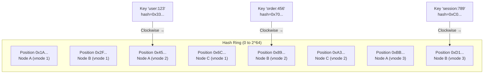
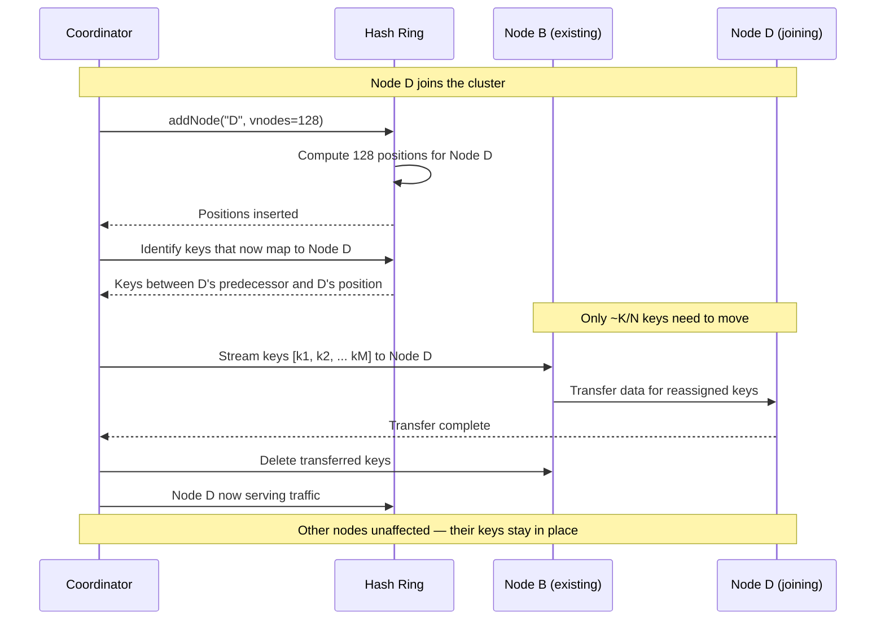
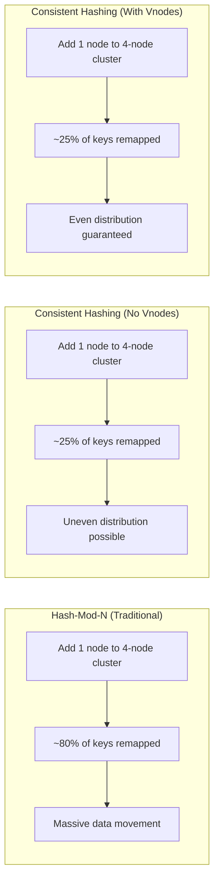

# Consistent Hashing

## Quick Reference

- **Consistent hashing** maps both keys and nodes onto a circular hash space (ring), assigning each key to the first node encountered clockwise from the key's position on the ring
- When a node joins or leaves, only K/N keys need to be remapped (where K is total keys and N is total nodes), compared to traditional hash-mod-N which remaps nearly all keys
- **Virtual nodes (vnodes)** solve the load imbalance problem by assigning multiple positions on the ring to each physical node — typically 100-256 vnodes per physical node
- **Bounded-load consistent hashing** (Google, 2017) caps the maximum load on any node to (1 + ε) × average load, preventing hot spots while maintaining minimal remapping
- Used in production by DynamoDB, Cassandra, Riak, Memcached (ketama), Nginx upstream hashing, and most CDN edge routing systems
- The hash function must be deterministic and uniformly distributed — commonly MurmurHash3, xxHash, or MD5 (for distribution quality, not security)
- Consistent hashing is a prerequisite for understanding how distributed databases partition data and how adding/removing nodes triggers rebalancing

## When to Use

Consistent hashing applies whenever you need to distribute data or load across a dynamic set of nodes where nodes can be added or removed without massive redistribution. Common scenarios include: distributed caches (Memcached, Redis Cluster) where you want cache hits to survive node additions, distributed databases (Cassandra, DynamoDB) for partition assignment, load balancers that need session affinity with graceful failover, CDN edge selection for content routing, and distributed task schedulers that assign work to workers. You should also understand consistent hashing for system design interviews involving any horizontally scaled stateful service, as it is the foundational mechanism for data placement in nearly all modern distributed storage systems.

## Code Examples

### Consistent Hash Ring with Virtual Nodes

```java
import java.util.*;
import java.security.MessageDigest;
import java.security.NoSuchAlgorithmException;
import java.nio.charset.StandardCharsets;

/**
 * Production-grade consistent hash ring with virtual nodes.
 * Each physical node gets multiple positions on the ring for better distribution.
 */
public class ConsistentHashRing<T> {
    private final TreeMap<Long, T> ring = new TreeMap<>();
    private final Map<T, Integer> nodeVnodeCount = new HashMap<>();
    private final int defaultVnodes;
    private final MessageDigest md5;

    public ConsistentHashRing(int defaultVnodes) {
        this.defaultVnodes = defaultVnodes;
        try {
            this.md5 = MessageDigest.getInstance("MD5");
        } catch (NoSuchAlgorithmException e) {
            throw new RuntimeException("MD5 not available", e);
        }
    }

    /**
     * Add a node with the default number of virtual nodes.
     * Each vnode gets a position on the ring based on hash("node#i").
     */
    public void addNode(T node) {
        addNode(node, defaultVnodes);
    }

    /**
     * Add a node with a custom vnode count.
     * Higher vnode count = better distribution but more memory.
     * Weighted nodes can use proportional vnode counts.
     */
    public void addNode(T node, int vnodeCount) {
        for (int i = 0; i < vnodeCount; i++) {
            long hash = hash(node.toString() + "#" + i);
            ring.put(hash, node);
        }
        nodeVnodeCount.put(node, vnodeCount);
    }

    /**
     * Remove a node and all its virtual nodes from the ring.
     * Keys previously assigned to this node will be reassigned to the
     * next clockwise node — only those keys are affected.
     */
    public void removeNode(T node) {
        Integer vnodeCount = nodeVnodeCount.remove(node);
        if (vnodeCount == null) return;
        for (int i = 0; i < vnodeCount; i++) {
            long hash = hash(node.toString() + "#" + i);
            ring.remove(hash);
        }
    }

    /**
     * Find the node responsible for a given key.
     * Walks clockwise from the key's hash position to find the first node.
     */
    public T getNode(String key) {
        if (ring.isEmpty()) {
            throw new IllegalStateException("Hash ring is empty");
        }
        long hash = hash(key);
        // Find the first entry at or after this hash (clockwise)
        Map.Entry<Long, T> entry = ring.ceilingEntry(hash);
        if (entry == null) {
            // Wrap around to the first entry (ring is circular)
            entry = ring.firstEntry();
        }
        return entry.getValue();
    }

    /**
     * Get N distinct nodes for replication (preference list).
     * Walks clockwise, skipping vnodes belonging to already-selected physical nodes.
     */
    public List<T> getNodes(String key, int count) {
        if (ring.isEmpty()) {
            throw new IllegalStateException("Hash ring is empty");
        }
        int distinctNodes = nodeVnodeCount.size();
        int resultCount = Math.min(count, distinctNodes);

        List<T> result = new ArrayList<>(resultCount);
        Set<T> seen = new HashSet<>();
        long hash = hash(key);

        // Walk clockwise from key position
        SortedMap<Long, T> tailMap = ring.tailMap(hash);
        for (T node : tailMap.values()) {
            if (seen.add(node)) {
                result.add(node);
                if (result.size() == resultCount) return result;
            }
        }
        // Wrap around
        for (T node : ring.values()) {
            if (seen.add(node)) {
                result.add(node);
                if (result.size() == resultCount) return result;
            }
        }
        return result;
    }

    private long hash(String key) {
        md5.reset();
        byte[] digest = md5.digest(key.getBytes(StandardCharsets.UTF_8));
        // Use first 8 bytes as a long for ring position
        return ((long) (digest[0] & 0xFF) << 56)
             | ((long) (digest[1] & 0xFF) << 48)
             | ((long) (digest[2] & 0xFF) << 40)
             | ((long) (digest[3] & 0xFF) << 32)
             | ((long) (digest[4] & 0xFF) << 24)
             | ((long) (digest[5] & 0xFF) << 16)
             | ((long) (digest[6] & 0xFF) << 8)
             | ((long) (digest[7] & 0xFF));
    }

    public int size() {
        return nodeVnodeCount.size();
    }

    public int ringSize() {
        return ring.size();
    }
}
```

### Bounded-Load Consistent Hashing

```typescript
import { createHash } from 'crypto';

interface BoundedLoadConfig {
  epsilon: number;       // Load factor tolerance (e.g., 0.25 means max 125% of average)
  vnodeCount: number;    // Virtual nodes per physical node
}

interface NodeLoad {
  nodeId: string;
  currentLoad: number;
  capacity: number;      // Computed as (1 + epsilon) * averageLoad
}

/**
 * Bounded-load consistent hashing (Mirrokni et al., 2017).
 * Guarantees no node receives more than (1 + ε) × average load.
 * When the primary node is overloaded, the key is assigned to the
 * next node on the ring that has capacity.
 */
class BoundedLoadHashRing {
  private ring: Map<bigint, string> = new Map();
  private sortedPositions: bigint[] = [];
  private nodeLoads: Map<string, number> = new Map();
  private config: BoundedLoadConfig;
  private totalKeys: number = 0;

  constructor(config: BoundedLoadConfig) {
    this.config = config;
  }

  addNode(nodeId: string): void {
    for (let i = 0; i < this.config.vnodeCount; i++) {
      const position = this.hash(`${nodeId}#${i}`);
      this.ring.set(position, nodeId);
    }
    this.nodeLoads.set(nodeId, 0);
    this.rebuildSortedPositions();
  }

  removeNode(nodeId: string): void {
    for (let i = 0; i < this.config.vnodeCount; i++) {
      const position = this.hash(`${nodeId}#${i}`);
      this.ring.delete(position);
    }
    this.nodeLoads.delete(nodeId);
    this.rebuildSortedPositions();
  }

  /**
   * Assign a key to a node, respecting the bounded load constraint.
   * If the primary node (clockwise successor) is at capacity,
   * walk further clockwise until a node with capacity is found.
   */
  assignKey(key: string): string {
    const keyHash = this.hash(key);
    const nodeCount = this.nodeLoads.size;
    if (nodeCount === 0) throw new Error('No nodes in ring');

    const averageLoad = (this.totalKeys + 1) / nodeCount;
    const maxLoad = Math.ceil((1 + this.config.epsilon) * averageLoad);

    // Find starting position on ring
    let idx = this.findCeilingIndex(keyHash);

    // Walk clockwise until we find a node with capacity
    const visited = new Set<string>();
    for (let attempts = 0; attempts < this.sortedPositions.length; attempts++) {
      const position = this.sortedPositions[idx % this.sortedPositions.length];
      const nodeId = this.ring.get(position)!;

      if (!visited.has(nodeId)) {
        visited.add(nodeId);
        const currentLoad = this.nodeLoads.get(nodeId) || 0;
        if (currentLoad < maxLoad) {
          this.nodeLoads.set(nodeId, currentLoad + 1);
          this.totalKeys++;
          return nodeId;
        }
      }
      idx++;
    }

    // Fallback: all nodes at capacity (shouldn't happen with correct epsilon)
    throw new Error('All nodes at capacity — increase epsilon or add nodes');
  }

  releaseKey(key: string, nodeId: string): void {
    const currentLoad = this.nodeLoads.get(nodeId) || 0;
    if (currentLoad > 0) {
      this.nodeLoads.set(nodeId, currentLoad - 1);
      this.totalKeys--;
    }
  }

  getLoadDistribution(): NodeLoad[] {
    const nodeCount = this.nodeLoads.size;
    const averageLoad = nodeCount > 0 ? this.totalKeys / nodeCount : 0;
    const capacity = Math.ceil((1 + this.config.epsilon) * averageLoad);

    return Array.from(this.nodeLoads.entries()).map(([nodeId, load]) => ({
      nodeId,
      currentLoad: load,
      capacity,
    }));
  }

  private hash(input: string): bigint {
    const hex = createHash('md5').update(input).digest('hex');
    return BigInt('0x' + hex.substring(0, 16));
  }

  private rebuildSortedPositions(): void {
    this.sortedPositions = Array.from(this.ring.keys()).sort((a, b) =>
      a < b ? -1 : a > b ? 1 : 0
    );
  }

  private findCeilingIndex(hash: bigint): number {
    let lo = 0, hi = this.sortedPositions.length - 1;
    while (lo <= hi) {
      const mid = (lo + hi) >>> 1;
      if (this.sortedPositions[mid] < hash) lo = mid + 1;
      else hi = mid - 1;
    }
    return lo % this.sortedPositions.length;
  }
}
```

## Architecture / Diagrams

### Consistent Hash Ring with Virtual Nodes



### Node Addition and Key Redistribution



### Rebalancing Strategy Comparison



## Common Pitfalls

- **Using too few virtual nodes** — With only 1 vnode per physical node, the load distribution can be extremely uneven (some nodes get 3-4x the average load). Production systems typically use 100-256 vnodes per node. Cassandra defaults to 256 vnodes (configurable via `num_tokens`).

- **Not accounting for heterogeneous hardware** — If nodes have different capacities (CPU, memory, disk), they should have proportionally different vnode counts. A node with 2x the capacity should get 2x the vnodes. Failing to do this results in smaller nodes becoming bottlenecks.

- **Ignoring rebalancing costs during node addition** — While consistent hashing minimizes the number of keys that move, the actual data transfer can still be significant. A 10TB cluster adding a 5th node needs to transfer ~2TB. Plan for rebalancing bandwidth, throttle transfers to avoid impacting live traffic, and consider incremental rebalancing.

- **Hash function collisions in the ring** — If two vnodes hash to the same position, one overwrites the other in the TreeMap. Use a hash function with good distribution (MurmurHash3, xxHash) and include a unique suffix (node ID + vnode index) to minimize collision probability.

- **Not implementing a preference list for replication** — Simply hashing to one node provides no fault tolerance. Production systems walk clockwise past the primary node to find N-1 additional distinct physical nodes for replication. Skipping vnodes of the same physical node is critical — otherwise replicas might land on the same machine.

## Real-World Use Cases

**Amazon DynamoDB:** DynamoDB uses consistent hashing to partition data across storage nodes. Each partition key is hashed to determine its placement. When the system detects a hot partition, it can split the hash range and redistribute data. DynamoDB's adaptive capacity feature automatically redistributes throughput from underutilized partitions to hot ones, building on the consistent hashing foundation.

**Apache Cassandra:** Cassandra assigns each node a set of tokens (vnodes) on the hash ring. The partitioner (default: Murmur3Partitioner) hashes partition keys to determine which node owns the data. When a node joins, it takes ownership of token ranges from existing nodes, triggering streaming of the relevant data. The `nodetool status` command shows each node's token ownership percentage.

**Akamai CDN:** Akamai uses consistent hashing to route content requests to edge servers. When a user requests a URL, the URL is hashed to determine which edge server should cache that content. If an edge server fails, only its content needs to be re-fetched from origin — other edge servers' caches remain valid. This minimizes origin load during edge failures.

**Discord:** Discord uses consistent hashing to assign guilds (servers) to backend processes. When a process crashes or a new one is added, only the guilds assigned to the affected hash range need to be reassigned. This enables Discord to scale their real-time messaging infrastructure to millions of concurrent guilds with minimal disruption during scaling events.

## Interview Questions

**Q: Why do we need virtual nodes in consistent hashing? What problem do they solve?**

A: Without virtual nodes, each physical node occupies a single point on the hash ring. With N nodes, the expected arc length per node is 1/N of the ring, but the actual distribution has high variance — some nodes may own 2-3x their fair share. Virtual nodes solve this by giving each physical node many positions (typically 100-256) on the ring. By the law of large numbers, the total arc length owned by each physical node converges to its fair share. Additionally, when a node leaves, its load is distributed across many other nodes (one per vnode) rather than dumping everything onto a single successor.

**Q: How does consistent hashing handle rebalancing when a node is added to a cluster?**

A: When a new node joins, it is assigned positions on the ring (its vnodes). For each vnode position, the keys between that position and the previous position on the ring that were previously owned by the clockwise successor now belong to the new node. Only those keys need to be transferred — approximately K/N keys total (where K is total keys, N is new node count). The coordinator identifies affected key ranges, streams data from existing owners to the new node, and once transfer completes, updates routing to direct new requests to the new node. Other nodes' data remains untouched.

**Q: Explain bounded-load consistent hashing and when you would use it over standard consistent hashing.**

A: Standard consistent hashing can still produce hot spots when certain keys receive disproportionate traffic (e.g., a viral post). Bounded-load consistent hashing (Mirrokni et al., 2017) adds a constraint: no node can exceed (1 + ε) × average load. When a key hashes to an overloaded node, the algorithm walks clockwise to find the next node with available capacity. This provides a worst-case load guarantee while maintaining the minimal-remapping property. You would use it in load balancers (like Google's Maglev) where traffic patterns are skewed, or in caches where certain keys are much hotter than others. The trade-off is slightly more complex routing logic and the need to track per-node load.

**Q: How does consistent hashing interact with replication in systems like DynamoDB or Cassandra?**

A: After determining the primary node for a key via consistent hashing, the system walks clockwise on the ring to find N-1 additional distinct physical nodes to hold replicas (the "preference list"). The key distinction is skipping virtual nodes that belong to the same physical node — you want replicas on different machines for fault tolerance. In DynamoDB, the first N healthy nodes in the preference list store the data. If a node is temporarily unavailable, a "sloppy quorum" allows a downstream node to temporarily accept writes (hinted handoff), maintaining availability while the primary recovers.

## Production Tips

- **Monitor per-node load variance as a key operational metric.** Even with virtual nodes, load imbalance can develop over time as data grows unevenly. Track the ratio of max-loaded node to average-loaded node. If this exceeds 1.3x, consider increasing vnode count, rebalancing token assignments, or implementing bounded-load hashing. Cassandra's `nodetool ring` and `nodetool status` show ownership percentages.

- **Throttle rebalancing to protect live traffic.** When nodes join or leave, data streaming competes with production reads and writes for network bandwidth and disk I/O. Configure streaming throughput limits (Cassandra: `stream_throughput_outbound_megabits_per_sec`) and schedule node additions during low-traffic periods. Monitor p99 latency during rebalancing — if it spikes, reduce streaming rate.

- **Use consistent hashing at the load balancer layer for session affinity.** Nginx's `hash` directive with `consistent` parameter routes requests to the same upstream based on a key (e.g., client IP or session ID). When an upstream is removed, only that server's sessions are redistributed. This is far superior to round-robin for stateful backends and avoids the thundering herd problem of rehashing all sessions.

## Related Topics

- [Database Sharding](./database-sharding.md) — Consistent hashing is one of several partitioning strategies for distributing data across shards
- [Load Balancing](./load-balancing.md) — Consistent hashing is used in load balancers for session-affine routing with graceful failover
- [CAP Theorem In Depth](./cap-theorem-depth.md) — Understanding how data placement via consistent hashing interacts with consistency and availability guarantees
- [Quorum Systems](./quorum-systems.md) — How replicas placed via consistent hashing coordinate reads and writes through quorum protocols
