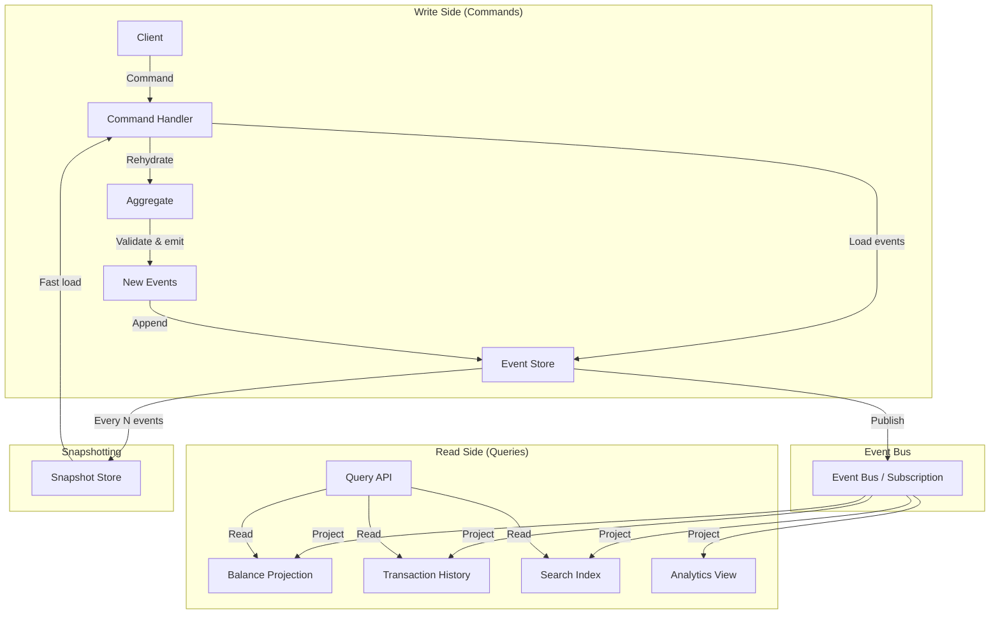
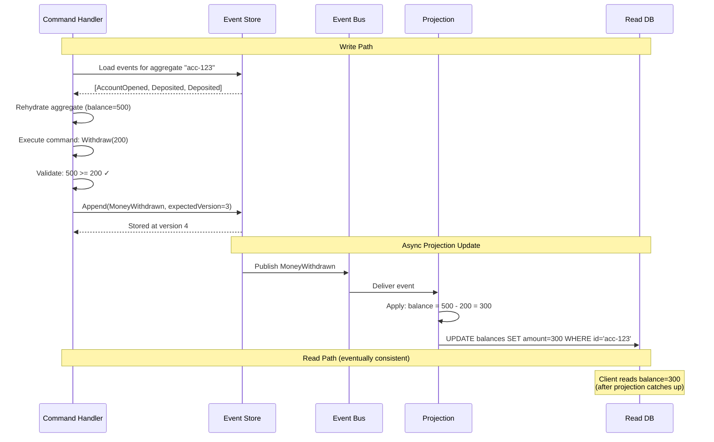
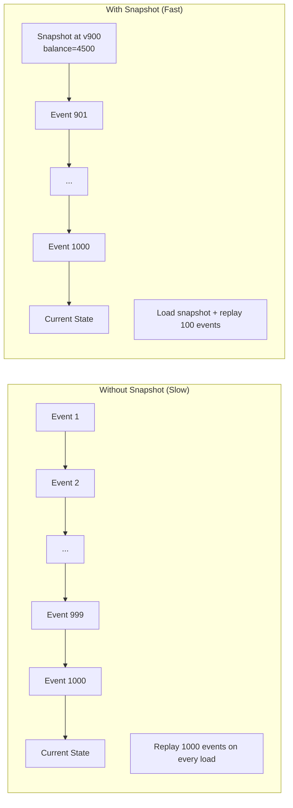

# Event Sourcing and CQRS

## Quick Reference

- **Event Sourcing** stores state as an append-only sequence of immutable domain events rather than mutable current state — the current state is derived by replaying events from the beginning
- **CQRS** (Command Query Responsibility Segregation) separates the write model (commands that produce events) from the read model (projections optimized for queries)
- The **event store** is the system of record — an append-only log where each event has a stream ID, sequence number, event type, payload, and metadata (timestamp, causation ID, correlation ID)
- **Projections** (read models) are derived views built by processing events — they can be rebuilt from scratch at any time by replaying the event stream, enabling schema evolution without data migration
- Event sourcing provides a complete audit trail, enables temporal queries ("what was the state at time T?"), and supports multiple read models optimized for different query patterns
- **Eventual consistency** between the write model and read models is inherent — projections are updated asynchronously after events are committed, introducing a propagation delay
- Snapshotting periodically captures the current state to avoid replaying the entire event history on every load — typically snapshot every N events (e.g., every 100 or 1000)

## When to Use

Event sourcing and CQRS apply when you need a complete audit trail of all state changes (financial systems, healthcare, compliance), when you need to support multiple read models with different shapes from the same data (dashboards, search indexes, reports), when you need temporal queries or the ability to reconstruct past states, when your read and write workloads have vastly different scaling requirements, or when domain complexity benefits from explicit modeling of state transitions as events. Common domains include: banking and payments (transaction history is the source of truth), e-commerce (order lifecycle events), IoT (sensor event streams), and collaborative editing (operation logs). Avoid event sourcing for simple CRUD applications where the overhead of event modeling, projection management, and eventual consistency is not justified by the benefits.

## Code Examples

### Event Store Implementation with Optimistic Concurrency

```java
import java.util.*;
import java.util.concurrent.ConcurrentHashMap;
import java.util.concurrent.locks.ReadWriteLock;
import java.util.concurrent.locks.ReentrantReadWriteLock;

/**
 * In-memory event store with optimistic concurrency control.
 * Production systems would use EventStoreDB, Kafka, or a database with
 * append-only semantics.
 */
public class EventStore {
    private final Map<String, List<StoredEvent>> streams = new ConcurrentHashMap<>();
    private final Map<String, ReadWriteLock> streamLocks = new ConcurrentHashMap<>();
    private final List<EventSubscriber> subscribers = new ArrayList<>();

    /**
     * Append events to a stream with optimistic concurrency.
     * @param streamId The aggregate/entity identifier
     * @param expectedVersion The version the caller expects (for conflict detection)
     * @param events The new events to append
     * @throws ConcurrencyException if another writer modified the stream
     */
    public void append(String streamId, long expectedVersion, List<DomainEvent> events) {
        ReadWriteLock lock = streamLocks.computeIfAbsent(streamId,
            k -> new ReentrantReadWriteLock());
        lock.writeLock().lock();

        try {
            List<StoredEvent> stream = streams.computeIfAbsent(streamId, k -> new ArrayList<>());
            long currentVersion = stream.size();

            // Optimistic concurrency check
            if (currentVersion != expectedVersion) {
                throw new ConcurrencyException(
                    String.format("Stream '%s' expected version %d but was %d",
                        streamId, expectedVersion, currentVersion)
                );
            }

            // Append events with sequential version numbers
            for (DomainEvent event : events) {
                long version = currentVersion++;
                StoredEvent stored = new StoredEvent(
                    streamId,
                    version,
                    event.getClass().getSimpleName(),
                    event,
                    System.currentTimeMillis(),
                    UUID.randomUUID().toString()  // Event ID
                );
                stream.add(stored);
            }

            // Notify subscribers (projections, process managers)
            for (StoredEvent stored : stream.subList((int) expectedVersion, stream.size())) {
                for (EventSubscriber subscriber : subscribers) {
                    subscriber.onEvent(stored);
                }
            }
        } finally {
            lock.writeLock().unlock();
        }
    }

    /**
     * Read all events for a stream (for aggregate rehydration).
     */
    public List<StoredEvent> readStream(String streamId) {
        return streams.getOrDefault(streamId, Collections.emptyList());
    }

    /**
     * Read events from a specific version (for partial replay after snapshot).
     */
    public List<StoredEvent> readStreamFrom(String streamId, long fromVersion) {
        List<StoredEvent> stream = streams.getOrDefault(streamId, Collections.emptyList());
        if (fromVersion >= stream.size()) return Collections.emptyList();
        return stream.subList((int) fromVersion, stream.size());
    }

    public void subscribe(EventSubscriber subscriber) {
        subscribers.add(subscriber);
    }
}

/**
 * Example aggregate: BankAccount rebuilt from events.
 */
public class BankAccount {
    private String accountId;
    private long balance;  // in cents
    private long version;
    private boolean closed;
    private final List<DomainEvent> uncommittedEvents = new ArrayList<>();

    // Private constructor — use static factory methods
    private BankAccount() {}

    /**
     * Rehydrate aggregate from event history.
     */
    public static BankAccount fromHistory(List<StoredEvent> history) {
        BankAccount account = new BankAccount();
        for (StoredEvent stored : history) {
            account.apply(stored.getEvent());
            account.version = stored.getVersion() + 1;
        }
        return account;
    }

    /**
     * Command: deposit money. Validates business rules, then emits event.
     */
    public void deposit(long amount, String transactionId) {
        if (closed) throw new IllegalStateException("Account is closed");
        if (amount <= 0) throw new IllegalArgumentException("Amount must be positive");

        emit(new MoneyDeposited(accountId, amount, transactionId, System.currentTimeMillis()));
    }

    /**
     * Command: withdraw money. Validates business rules, then emits event.
     */
    public void withdraw(long amount, String transactionId) {
        if (closed) throw new IllegalStateException("Account is closed");
        if (amount <= 0) throw new IllegalArgumentException("Amount must be positive");
        if (balance < amount) throw new InsufficientFundsException(accountId, balance, amount);

        emit(new MoneyWithdrawn(accountId, amount, transactionId, System.currentTimeMillis()));
    }

    // Apply event to update internal state (no side effects, no validation)
    private void apply(DomainEvent event) {
        if (event instanceof AccountOpened e) {
            this.accountId = e.getAccountId();
            this.balance = e.getInitialDeposit();
        } else if (event instanceof MoneyDeposited e) {
            this.balance += e.getAmount();
        } else if (event instanceof MoneyWithdrawn e) {
            this.balance -= e.getAmount();
        } else if (event instanceof AccountClosed e) {
            this.closed = true;
        }
    }

    private void emit(DomainEvent event) {
        apply(event);  // Update local state
        uncommittedEvents.add(event);  // Track for persistence
    }

    public List<DomainEvent> getUncommittedEvents() {
        return Collections.unmodifiableList(uncommittedEvents);
    }

    public void markCommitted() {
        uncommittedEvents.clear();
    }

    public long getVersion() { return version; }
    public long getBalance() { return balance; }
}
```

### CQRS Projection with Rebuild Capability

```typescript
import { EventEmitter } from 'events';

// Domain events
interface AccountOpened {
  type: 'AccountOpened';
  accountId: string;
  customerId: string;
  initialDeposit: number;
  timestamp: number;
}

interface MoneyDeposited {
  type: 'MoneyDeposited';
  accountId: string;
  amount: number;
  transactionId: string;
  timestamp: number;
}

interface MoneyWithdrawn {
  type: 'MoneyWithdrawn';
  accountId: string;
  amount: number;
  transactionId: string;
  timestamp: number;
}

type BankEvent = AccountOpened | MoneyDeposited | MoneyWithdrawn;

interface StoredEvent {
  streamId: string;
  version: number;
  event: BankEvent;
  timestamp: number;
  globalPosition: number;  // Position across all streams
}

/**
 * Read model: Account balance projection.
 * Optimized for fast balance lookups — denormalized from events.
 */
class AccountBalanceProjection {
  private balances: Map<string, number> = new Map();
  private lastProcessedPosition: number = -1;

  /**
   * Process a single event to update the projection.
   * This method must be idempotent — processing the same event twice
   * should produce the same result.
   */
  apply(stored: StoredEvent): void {
    // Skip already-processed events (idempotency)
    if (stored.globalPosition <= this.lastProcessedPosition) return;

    const event = stored.event;
    switch (event.type) {
      case 'AccountOpened':
        this.balances.set(event.accountId, event.initialDeposit);
        break;
      case 'MoneyDeposited':
        const currentDeposit = this.balances.get(event.accountId) || 0;
        this.balances.set(event.accountId, currentDeposit + event.amount);
        break;
      case 'MoneyWithdrawn':
        const currentWithdraw = this.balances.get(event.accountId) || 0;
        this.balances.set(event.accountId, currentWithdraw - event.amount);
        break;
    }

    this.lastProcessedPosition = stored.globalPosition;
  }

  getBalance(accountId: string): number | undefined {
    return this.balances.get(accountId);
  }

  getLastProcessedPosition(): number {
    return this.lastProcessedPosition;
  }
}

/**
 * Read model: Transaction history projection.
 * Optimized for listing recent transactions per account.
 */
class TransactionHistoryProjection {
  private transactions: Map<string, TransactionRecord[]> = new Map();
  private lastProcessedPosition: number = -1;

  apply(stored: StoredEvent): void {
    if (stored.globalPosition <= this.lastProcessedPosition) return;

    const event = stored.event;
    if (event.type === 'MoneyDeposited' || event.type === 'MoneyWithdrawn') {
      const records = this.transactions.get(event.accountId) || [];
      records.push({
        transactionId: event.transactionId,
        type: event.type === 'MoneyDeposited' ? 'credit' : 'debit',
        amount: event.amount,
        timestamp: event.timestamp,
      });
      this.transactions.set(event.accountId, records);
    }

    this.lastProcessedPosition = stored.globalPosition;
  }

  getHistory(accountId: string, limit: number = 50): TransactionRecord[] {
    const records = this.transactions.get(accountId) || [];
    return records.slice(-limit);
  }
}

interface TransactionRecord {
  transactionId: string;
  type: 'credit' | 'debit';
  amount: number;
  timestamp: number;
}

/**
 * Projection manager: handles subscription, catch-up, and rebuild.
 */
class ProjectionManager {
  private projections: Map<string, Projection> = new Map();

  constructor(private eventStore: EventStoreReader) {}

  register(name: string, projection: Projection): void {
    this.projections.set(name, projection);
  }

  /**
   * Rebuild a projection from scratch by replaying all events.
   * Used when: projection logic changes, projection is corrupted,
   * or a new projection is added.
   */
  async rebuild(projectionName: string): Promise<void> {
    const projection = this.projections.get(projectionName);
    if (!projection) throw new Error(`Unknown projection: ${projectionName}`);

    // Reset projection state
    projection.reset();

    // Replay all events from the beginning
    let position = 0;
    const batchSize = 1000;

    while (true) {
      const events = await this.eventStore.readAll(position, batchSize);
      if (events.length === 0) break;

      for (const event of events) {
        projection.apply(event);
      }

      position += events.length;
      console.log(`Rebuilt ${projectionName}: processed ${position} events`);
    }

    console.log(`Rebuild complete for ${projectionName}`);
  }

  /**
   * Catch up a projection from its last processed position.
   * Used on startup or after a temporary disconnection.
   */
  async catchUp(projectionName: string): Promise<void> {
    const projection = this.projections.get(projectionName);
    if (!projection) throw new Error(`Unknown projection: ${projectionName}`);

    const fromPosition = projection.getLastProcessedPosition() + 1;
    const events = await this.eventStore.readAll(fromPosition, 10000);

    for (const event of events) {
      projection.apply(event);
    }
  }
}

interface Projection {
  apply(event: StoredEvent): void;
  reset(): void;
  getLastProcessedPosition(): number;
}

interface EventStoreReader {
  readAll(fromPosition: number, limit: number): Promise<StoredEvent[]>;
}
```

## Architecture / Diagrams

### Event Sourcing + CQRS Architecture



### Event Stream and Projection Lifecycle



### Snapshotting Strategy



## Common Pitfalls

- **Treating events as mutable or deleting them** — Events are immutable facts that happened. If you need to "undo" something, append a compensating event (e.g., `RefundIssued` to undo a `PaymentProcessed`). Deleting or modifying events breaks the audit trail and can corrupt projections that have already processed the original event.

- **Making projections the source of truth** — Projections are derived, disposable views. They can be rebuilt at any time from the event store. If you find yourself needing to "fix" a projection by directly modifying it, you have a design problem. Fix the projection logic and rebuild instead.

- **Not handling eventual consistency in the UI** — After a command succeeds, the read model may not yet reflect the change. Users might see stale data. Solutions: (1) Return the new state directly from the command handler (bypassing the read model). (2) Use optimistic UI updates. (3) Poll until the projection catches up. (4) Use subscriptions/websockets to push updates.

- **Creating too-fine-grained events** — Events like `FieldUpdated(field="name", value="John")` lose domain meaning. Prefer domain-meaningful events: `CustomerRenamed(newName="John")`. Fine-grained events make projections complex and lose the "why" behind state changes.

- **Not versioning events** — As your domain evolves, event schemas change. Without versioning, old events become unparseable. Use event upcasting (transforming old event formats to new ones during read) or include a schema version in each event. Never break backward compatibility of stored events.

- **Unbounded event streams without snapshotting** — An aggregate with 100,000 events takes significant time to rehydrate. Implement snapshotting for aggregates that accumulate many events. Snapshot every N events (e.g., 100) and load from the latest snapshot + subsequent events.

## Real-World Use Cases

**Event Store (EventStoreDB):** A purpose-built database for event sourcing that stores events in streams with built-in projections, subscriptions, and optimistic concurrency. Used by financial institutions for transaction ledgers where the complete history of every account change must be preserved for regulatory compliance. Supports catch-up subscriptions for building read models and persistent subscriptions for real-time processing.

**Axon Framework (Java):** A CQRS/ES framework used in banking and insurance systems. Provides aggregate lifecycle management, event handling, saga orchestration, and projection management. ING Bank uses Axon for their payment processing platform, where event sourcing provides the audit trail required by financial regulators and CQRS enables separate scaling of transaction processing and reporting.

**Apache Kafka as Event Store:** Many organizations use Kafka's log-compacted topics as an event store. Events are produced to topic partitions (keyed by aggregate ID), and consumers build projections by reading from the beginning. LinkedIn uses this pattern for their activity feed, where user actions (posts, likes, comments) are events that feed multiple read models (news feed, notifications, analytics).

**LMAX Exchange:** The LMAX foreign exchange trading platform uses event sourcing to achieve deterministic replay of all trading operations. The entire exchange state can be rebuilt by replaying the event journal, enabling disaster recovery and testing of new trading algorithms against historical data. Their Disruptor pattern processes millions of events per second with microsecond latency.

## Interview Questions

**Q: What is the relationship between Event Sourcing and CQRS? Can you use one without the other?**

A: Event Sourcing and CQRS are complementary but independent patterns. Event Sourcing stores state as events — you can use it without CQRS by querying the event store directly (though this is often impractical for complex queries). CQRS separates read and write models — you can use it without Event Sourcing by having the write model update both its own store and the read model (e.g., write to PostgreSQL, project to Elasticsearch). They work well together because Event Sourcing naturally produces an event stream that feeds CQRS projections, and CQRS solves the query problem that Event Sourcing creates (you can't easily query "all accounts with balance > $1000" from an event store).

**Q: How do you handle schema evolution of events in an event-sourced system?**

A: Events are immutable and stored forever, so schema evolution must be backward-compatible. Strategies: (1) Upcasting — transform old event formats to the current format during deserialization (e.g., v1 `CustomerCreated{name}` → v2 `CustomerCreated{firstName, lastName}` by splitting the name field). (2) Weak schema — use a flexible format (JSON) and handle missing fields with defaults. (3) Event versioning — store a version number with each event and dispatch to version-specific handlers. (4) Copy-and-transform — for major schema changes, create a new stream by transforming all events (expensive, use rarely). Never modify stored events in place — this breaks the immutability guarantee and can corrupt projections.

**Q: What are the trade-offs of eventual consistency between write and read models in CQRS?**

A: Trade-offs: (1) Staleness — reads may not reflect the latest write; the delay depends on projection processing speed (typically milliseconds to seconds). (2) UI complexity — after a user action, they might not see their change immediately, requiring optimistic updates or polling. (3) Ordering — events may arrive out of order at projections if using partitioned messaging; projections must handle this. (4) Debugging — when a read model shows unexpected data, you must trace through the event stream to understand why. Benefits: (1) Independent scaling — read and write sides scale independently. (2) Availability — the write side can accept commands even if projections are temporarily down. (3) Performance — projections are pre-computed, making reads extremely fast. (4) Flexibility — add new read models without touching the write side.

**Q: When would you NOT use event sourcing?**

A: Avoid event sourcing when: (1) Simple CRUD with no audit requirements — the overhead of event modeling, projection management, and eventual consistency is not justified. (2) Highly mutable data with no history value — if you genuinely never need to know past states (e.g., a cache). (3) Complex queries are the primary use case and you don't need separate read models — a traditional database with indexes is simpler. (4) The team lacks experience — event sourcing has a steep learning curve and many subtle pitfalls. (5) GDPR "right to erasure" requirements — deleting events is antithetical to event sourcing (though crypto-shredding can work around this). (6) High-frequency updates to the same aggregate — replaying thousands of events per request is expensive without careful snapshotting.

## Production Tips

- **Implement a dead letter queue for failed projection events.** When a projection fails to process an event (bug in projection logic, schema mismatch), the event should be routed to a DLQ rather than blocking all subsequent events. Monitor DLQ depth and alert immediately — a growing DLQ means your read model is falling behind and becoming increasingly stale.

- **Use correlation IDs and causation IDs for distributed tracing.** Every event should carry a `correlationId` (the original request that started the chain) and a `causationId` (the specific event or command that directly caused this event). This enables end-to-end tracing of a user action through multiple aggregates and projections, which is essential for debugging in production.

- **Plan for projection rebuilds from day one.** Projection rebuilds are not exceptional — they are routine operations (new projection added, bug fixed, schema changed). Design your infrastructure to support rebuilding projections without downtime: run the new projection in parallel, switch traffic once it catches up, then decommission the old one. Track rebuild progress and estimated time to completion.

## Related Topics

- [Saga Pattern](./saga-pattern.md) — Sagas coordinate multi-aggregate transactions in event-sourced systems, using events as the communication mechanism
- [Consistency Models](./consistency-models.md) — CQRS projections exhibit eventual consistency, which has specific guarantees and limitations
- [Distributed Systems](./distributed-systems.md) — Event sourcing and CQRS are architectural patterns for building scalable distributed systems
- [Vector Clocks](./vector-clocks.md) — Conflict detection in event-sourced systems with multiple writers uses version vectors or similar mechanisms
