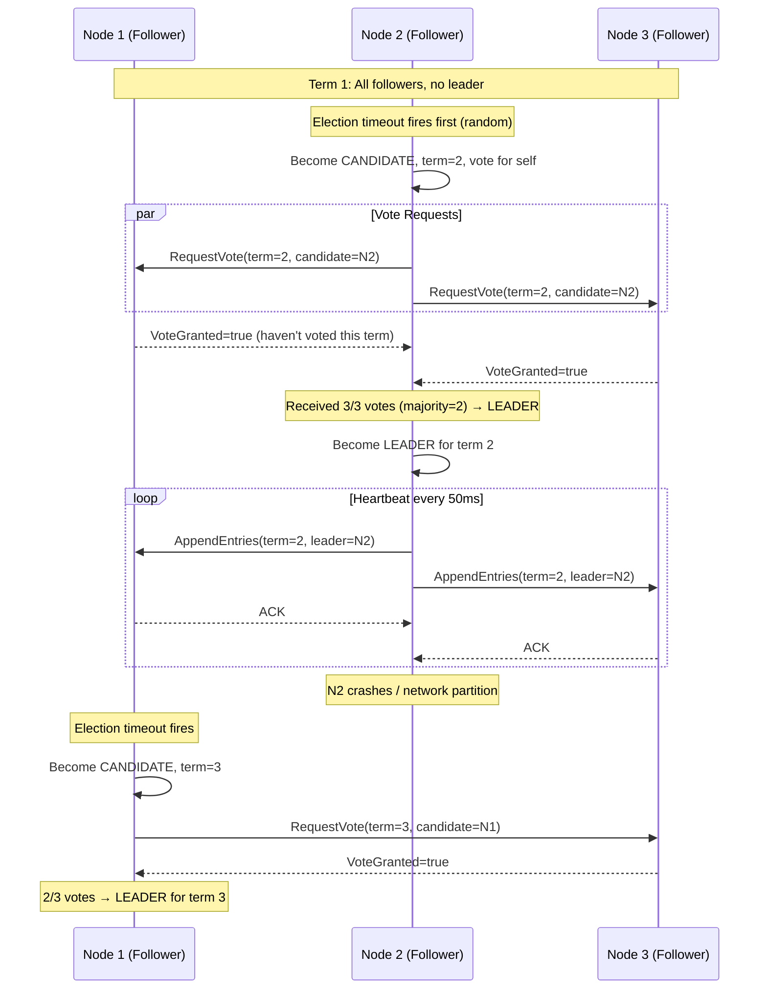
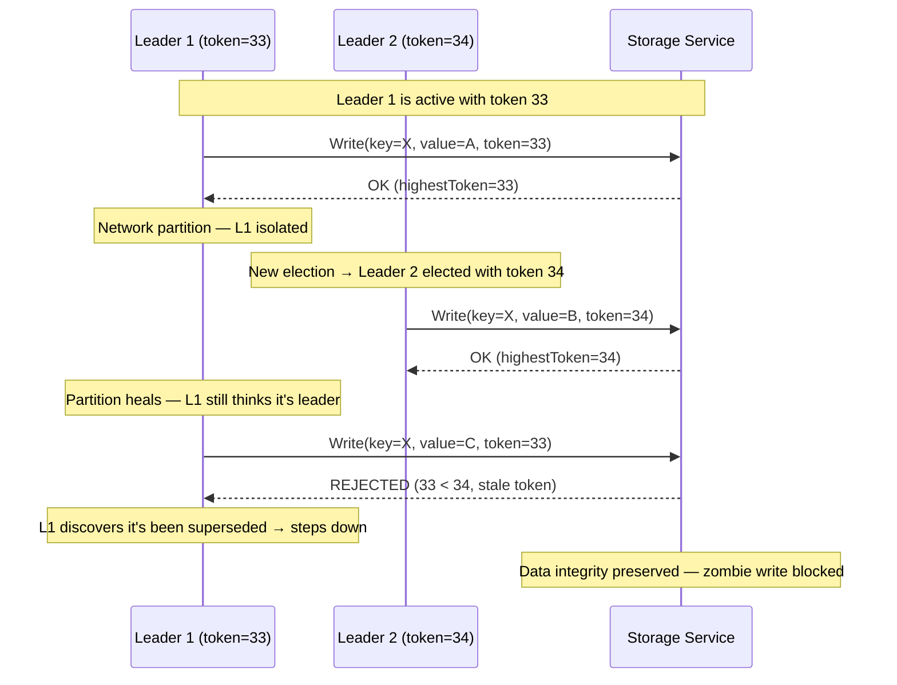
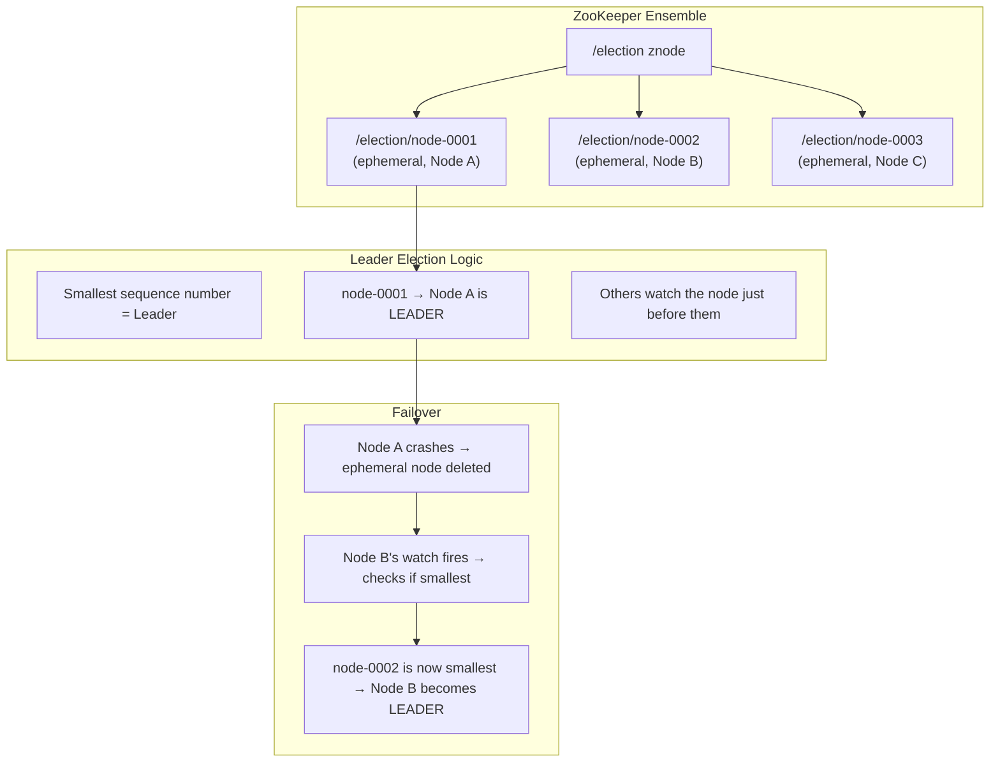

# Leader Election

## Quick Reference

- **Leader election** is the process by which distributed nodes agree on a single node to act as the coordinator (leader) for a specific responsibility — ensuring exactly one node performs a given role at any time
- The **Bully algorithm** elects the node with the highest ID by having lower-ID nodes defer to higher-ID nodes — simple but vulnerable to network partitions causing split-brain
- **Raft leader election** uses randomized election timeouts and majority voting — a candidate must receive votes from a majority of nodes to become leader, preventing split-brain by construction
- **ZooKeeper ephemeral nodes** provide leader election via the "smallest sequential znode" pattern — the node that creates the lowest-numbered ephemeral sequential node becomes leader
- **Fencing tokens** are monotonically increasing numbers issued with each leadership grant — they prevent stale leaders from making writes after being superseded (solving the "zombie leader" problem)
- Leader election is necessary for: single-writer databases, task schedulers, partition assignment coordinators, lock managers, and any system requiring exactly-once processing guarantees
- The FLP impossibility theorem means no deterministic leader election algorithm can guarantee termination in an asynchronous system with failures — practical systems use timeouts and randomization

## When to Use

Leader election applies whenever you need a single coordinator in a distributed system: database primary/replica architectures (PostgreSQL streaming replication, MongoDB replica sets), distributed lock managers (Redlock, ZooKeeper), task schedulers that must assign work without duplication (Kubernetes scheduler, Airflow), message queue partition assignment (Kafka consumer group coordinator), cache invalidation coordinators, and any system where exactly-one semantics are required. You also need leader election knowledge for system design interviews involving high availability, failover mechanisms, and consensus protocols. Understanding fencing tokens is critical for preventing data corruption in systems where network delays can cause a deposed leader to continue operating after a new leader is elected.

## Code Examples

### Raft-Style Leader Election

```java
import java.util.*;
import java.util.concurrent.*;
import java.util.concurrent.atomic.AtomicInteger;
import java.util.concurrent.atomic.AtomicReference;

/**
 * Simplified Raft leader election implementation.
 * Demonstrates: election timeout, vote requests, majority voting,
 * and term-based leader validity.
 */
public class RaftNode {
    enum State { FOLLOWER, CANDIDATE, LEADER }

    private final String nodeId;
    private final List<String> peerIds;
    private final RaftRPC rpc;

    private volatile State state = State.FOLLOWER;
    private volatile int currentTerm = 0;
    private volatile String votedFor = null;
    private volatile String currentLeader = null;
    private volatile long lastHeartbeat = System.currentTimeMillis();

    private final ScheduledExecutorService scheduler = Executors.newScheduledThreadPool(2);
    private final Random random = new Random();
    private ScheduledFuture<?> electionTimer;

    // Election timeout: 150-300ms (randomized to prevent split votes)
    private static final int MIN_ELECTION_TIMEOUT_MS = 150;
    private static final int MAX_ELECTION_TIMEOUT_MS = 300;
    private static final int HEARTBEAT_INTERVAL_MS = 50;

    public RaftNode(String nodeId, List<String> peerIds, RaftRPC rpc) {
        this.nodeId = nodeId;
        this.peerIds = peerIds;
        this.rpc = rpc;
    }

    public void start() {
        resetElectionTimer();
    }

    /**
     * Reset the election timer with a random timeout.
     * If the timer fires without receiving a heartbeat, start an election.
     */
    private void resetElectionTimer() {
        if (electionTimer != null) electionTimer.cancel(false);

        int timeout = MIN_ELECTION_TIMEOUT_MS +
            random.nextInt(MAX_ELECTION_TIMEOUT_MS - MIN_ELECTION_TIMEOUT_MS);

        electionTimer = scheduler.schedule(this::startElection, timeout, TimeUnit.MILLISECONDS);
    }

    /**
     * Start a new election: increment term, vote for self, request votes from peers.
     * Become leader if majority of votes received.
     */
    private synchronized void startElection() {
        if (state == State.LEADER) return;

        state = State.CANDIDATE;
        currentTerm++;
        votedFor = nodeId;
        currentLeader = null;

        int votesNeeded = (peerIds.size() + 1) / 2 + 1;  // Majority of total nodes
        AtomicInteger votesReceived = new AtomicInteger(1);  // Vote for self

        System.out.printf("[%s] Starting election for term %d (need %d votes)%n",
            nodeId, currentTerm, votesNeeded);

        // Request votes from all peers in parallel
        for (String peerId : peerIds) {
            scheduler.submit(() -> {
                VoteResponse response = rpc.requestVote(peerId, new VoteRequest(
                    currentTerm, nodeId
                ));

                if (response != null && response.isVoteGranted()) {
                    int votes = votesReceived.incrementAndGet();
                    if (votes >= votesNeeded && state == State.CANDIDATE) {
                        becomeLeader();
                    }
                } else if (response != null && response.getTerm() > currentTerm) {
                    // Discovered higher term — step down
                    stepDown(response.getTerm());
                }
            });
        }

        // If election doesn't complete, reset timer for next attempt
        resetElectionTimer();
    }

    /**
     * Become leader: start sending heartbeats to maintain authority.
     */
    private synchronized void becomeLeader() {
        if (state != State.CANDIDATE) return;

        state = State.LEADER;
        currentLeader = nodeId;
        System.out.printf("[%s] Became LEADER for term %d%n", nodeId, currentTerm);

        // Cancel election timer — leaders don't need it
        if (electionTimer != null) electionTimer.cancel(false);

        // Start heartbeat loop
        scheduler.scheduleAtFixedRate(this::sendHeartbeats,
            0, HEARTBEAT_INTERVAL_MS, TimeUnit.MILLISECONDS);
    }

    /**
     * Send heartbeats to all peers to maintain leadership.
     * If a peer responds with a higher term, step down.
     */
    private void sendHeartbeats() {
        if (state != State.LEADER) return;

        for (String peerId : peerIds) {
            HeartbeatResponse response = rpc.sendHeartbeat(peerId, new Heartbeat(
                currentTerm, nodeId
            ));
            if (response != null && response.getTerm() > currentTerm) {
                stepDown(response.getTerm());
                return;
            }
        }
    }

    /**
     * Handle incoming vote request from a candidate.
     */
    public synchronized VoteResponse handleVoteRequest(VoteRequest request) {
        if (request.getTerm() > currentTerm) {
            stepDown(request.getTerm());
        }

        boolean grantVote = false;
        if (request.getTerm() >= currentTerm &&
            (votedFor == null || votedFor.equals(request.getCandidateId()))) {
            votedFor = request.getCandidateId();
            grantVote = true;
            resetElectionTimer();  // Reset timer when granting vote
        }

        return new VoteResponse(currentTerm, grantVote);
    }

    /**
     * Handle incoming heartbeat from a leader.
     */
    public synchronized void handleHeartbeat(Heartbeat heartbeat) {
        if (heartbeat.getTerm() >= currentTerm) {
            stepDown(heartbeat.getTerm());
            currentLeader = heartbeat.getLeaderId();
            lastHeartbeat = System.currentTimeMillis();
            resetElectionTimer();
        }
    }

    /**
     * Step down to follower state when a higher term is discovered.
     */
    private void stepDown(int newTerm) {
        state = State.FOLLOWER;
        currentTerm = newTerm;
        votedFor = null;
        resetElectionTimer();
    }

    public State getState() { return state; }
    public String getCurrentLeader() { return currentLeader; }
    public int getCurrentTerm() { return currentTerm; }
}
```

### Fencing Token-Based Leader Protection

```typescript
/**
 * Fencing tokens prevent "zombie leaders" from corrupting data.
 * A zombie leader is a node that was previously the leader, got partitioned,
 * and still believes it is the leader after a new leader was elected.
 *
 * Every leadership grant includes a monotonically increasing fencing token.
 * Storage systems reject writes with tokens lower than the highest seen.
 */

interface LeaderLease {
  leaderId: string;
  fencingToken: number;      // Monotonically increasing
  grantedAt: number;         // Timestamp of grant
  expiresAt: number;         // Lease expiration
  term: number;              // Election term
}

interface FencedWrite {
  key: string;
  value: unknown;
  fencingToken: number;      // Must be >= storage's last seen token
}

/**
 * Leader election service that issues fencing tokens with each leadership grant.
 */
class LeaderElectionService {
  private currentToken: number = 0;
  private currentLease: LeaderLease | null = null;
  private readonly leaseDurationMs: number;

  constructor(leaseDurationMs: number = 30000) {
    this.leaseDurationMs = leaseDurationMs;
  }

  /**
   * Grant leadership to a node. Issues a new fencing token.
   * The token is strictly greater than all previously issued tokens.
   */
  grantLeadership(nodeId: string, term: number): LeaderLease {
    this.currentToken++;  // Monotonically increasing
    const now = Date.now();

    this.currentLease = {
      leaderId: nodeId,
      fencingToken: this.currentToken,
      grantedAt: now,
      expiresAt: now + this.leaseDurationMs,
      term,
    };

    return { ...this.currentLease };
  }

  /**
   * Renew an existing lease (leader heartbeat).
   * Does NOT issue a new fencing token — same token remains valid.
   */
  renewLease(nodeId: string, currentFencingToken: number): LeaderLease | null {
    if (!this.currentLease) return null;
    if (this.currentLease.leaderId !== nodeId) return null;
    if (this.currentLease.fencingToken !== currentFencingToken) return null;

    const now = Date.now();
    this.currentLease.expiresAt = now + this.leaseDurationMs;
    return { ...this.currentLease };
  }

  getCurrentLease(): LeaderLease | null {
    return this.currentLease;
  }
}

/**
 * Storage service that validates fencing tokens on every write.
 * Rejects writes from stale leaders (zombie protection).
 */
class FencedStorage {
  private data: Map<string, unknown> = new Map();
  private highestSeenToken: number = 0;

  /**
   * Accept a write only if the fencing token is >= the highest seen.
   * This prevents a zombie leader (with an old token) from overwriting
   * data written by the new leader (with a higher token).
   */
  write(request: FencedWrite): { success: boolean; reason?: string } {
    if (request.fencingToken < this.highestSeenToken) {
      return {
        success: false,
        reason: `Stale fencing token: ${request.fencingToken} < ${this.highestSeenToken}. ` +
                `Write rejected — caller is likely a zombie leader.`,
      };
    }

    // Update highest seen token
    this.highestSeenToken = Math.max(this.highestSeenToken, request.fencingToken);

    // Perform the write
    this.data.set(request.key, request.value);
    return { success: true };
  }

  read(key: string): unknown | undefined {
    return this.data.get(key);
  }

  getHighestSeenToken(): number {
    return this.highestSeenToken;
  }
}

/**
 * Example: Leader performing work with fencing token protection.
 */
class LeaderWorker {
  private lease: LeaderLease | null = null;

  constructor(
    private nodeId: string,
    private storage: FencedStorage,
    private electionService: LeaderElectionService
  ) {}

  /**
   * Attempt to become leader and perform exclusive work.
   * All writes include the fencing token for zombie protection.
   */
  async performExclusiveWork(): Promise<void> {
    // Acquire leadership
    this.lease = this.electionService.grantLeadership(this.nodeId, 1);
    console.log(`[${this.nodeId}] Acquired leadership with token ${this.lease.fencingToken}`);

    // Perform work with fencing token
    const result = this.storage.write({
      key: 'task-assignment',
      value: { assignedTo: this.nodeId, timestamp: Date.now() },
      fencingToken: this.lease.fencingToken,
    });

    if (!result.success) {
      console.log(`[${this.nodeId}] Write rejected: ${result.reason}`);
      console.log(`[${this.nodeId}] I am a zombie leader — stepping down`);
      this.lease = null;
      return;
    }

    console.log(`[${this.nodeId}] Work completed successfully`);
  }

  /**
   * Check if this node's lease is still valid.
   */
  isLeader(): boolean {
    if (!this.lease) return false;
    return Date.now() < this.lease.expiresAt;
  }
}
```

## Architecture / Diagrams

### Raft Leader Election Timeline



### Fencing Token Preventing Zombie Leader



### ZooKeeper Ephemeral Node Leader Election



## Common Pitfalls

- **Split-brain without fencing tokens** — If a leader is partitioned but its lease hasn't expired (or there is no lease), both the old leader and the newly elected leader may operate simultaneously, causing data corruption. Always use fencing tokens or lease-based expiration to ensure that a deposed leader's writes are rejected by downstream storage systems.

- **Using the Bully algorithm in production** — The Bully algorithm is simple (highest ID wins) but has serious problems: it doesn't handle network partitions correctly (both sides may elect a leader), it generates O(n²) messages, and it has no mechanism to prevent split-brain. Use Raft, Paxos, or ZooKeeper-based election for production systems.

- **Not handling the "thundering herd" on leader failure** — When a leader dies, all followers may simultaneously start elections, causing vote splitting and delayed convergence. Raft solves this with randomized election timeouts (150-300ms range). ZooKeeper solves it with the "watch predecessor" pattern (only the next-in-line node reacts to leader failure).

- **Assuming leader election is instantaneous** — Election takes time (typically 1-10 seconds depending on the protocol and timeout configuration). During this window, the system has no leader and cannot process writes. Design your system to handle this unavailability window gracefully (queue requests, return "service unavailable", or use read-only mode).

- **Not implementing leader health checks** — A leader that is alive but overloaded (GC pauses, disk I/O saturation) may fail to send heartbeats, triggering unnecessary elections. Implement graduated health checks: distinguish between "node is dead" (no response) and "node is slow" (delayed response). Consider adaptive timeouts that account for cluster load.

- **Relying solely on lease expiration for leader demotion** — Lease expiration depends on synchronized clocks. If the leader's clock is slow, it may continue operating past its lease expiration (from other nodes' perspective). Combine lease-based expiration with fencing tokens: even if a zombie leader doesn't know its lease expired, its writes will be rejected by storage systems that have seen a higher fencing token.

## Real-World Use Cases

**Apache Kafka (Controller Election):** Kafka uses ZooKeeper (or KRaft in newer versions) for controller election. The controller is responsible for partition leader assignment, broker registration, and topic management. When the controller fails, ZooKeeper's ephemeral node deletion triggers a new election. KRaft (Kafka's built-in Raft implementation) eliminates the ZooKeeper dependency by using Raft consensus among a set of controller nodes.

**Kubernetes (Leader Election for Controllers):** Kubernetes controllers (scheduler, controller-manager) use leader election via the Lease API. Only one instance of each controller is active at a time; others are standby. The leader periodically renews its lease. If it fails to renew (crash, network issue), another instance acquires the lease and becomes the new leader. This enables high availability without duplicate processing.

**etcd (Raft-Based Leader Election):** etcd uses Raft consensus for all operations, with a single leader handling all writes. The leader replicates log entries to followers before committing. If the leader fails, Raft's election mechanism (randomized timeouts + majority voting) elects a new leader within the election timeout (typically 1-2 seconds). etcd exposes leader election as a primitive that other systems (like Kubernetes) build upon.

**Redis Sentinel:** Redis Sentinel monitors Redis master nodes and performs automatic failover. When a master is detected as down (by a quorum of Sentinels), the Sentinels elect a new master from the available replicas. The election uses a Raft-like voting protocol among Sentinels. The new master is promoted, and other replicas are reconfigured to replicate from it. Fencing is achieved via configuration epochs (monotonically increasing).

**Google Chubby / Spanner:** Google's Chubby lock service provides leader election as a core primitive. Spanner uses Chubby to elect Paxos leaders for each tablet (partition). The leader holds a lease that it must periodically renew. Spanner's TrueTime API provides bounded clock uncertainty, enabling safe lease-based leader demotion without the risk of clock skew causing split-brain.

## Interview Questions

**Q: How does Raft prevent split-brain during leader election?**

A: Raft prevents split-brain through three mechanisms: (1) Term numbers — each election increments the term. A node only votes once per term, so at most one candidate can receive a majority in any given term. (2) Majority voting — a candidate must receive votes from a strict majority (N/2 + 1) of nodes. Since there is only one majority in any set, at most one leader can be elected per term. (3) Leader completeness — a candidate's log must be at least as up-to-date as the voter's log to receive a vote, ensuring the elected leader has all committed entries. Even during network partitions, only the partition containing a majority can elect a leader. The minority partition's candidates cannot gather enough votes and remain leaderless.

**Q: What is a fencing token and why is it necessary?**

A: A fencing token is a monotonically increasing number issued with each leadership grant. It solves the "zombie leader" problem: a leader that was partitioned, had its lease expire, and a new leader was elected — but the old leader doesn't know it's been superseded (its local clock might be slow, or it hasn't received the new leader's messages). Without fencing, the zombie leader can make writes that conflict with the new leader's writes. With fencing tokens, every write includes the token. Storage systems track the highest token seen and reject writes with lower tokens. When the zombie leader's write arrives with token 33 but the storage has already seen token 34 from the new leader, the write is rejected. This guarantees that only the current leader's writes are accepted, even in the presence of network delays and clock skew.

**Q: Compare ZooKeeper-based leader election with Raft-based leader election. When would you choose each?**

A: ZooKeeper-based: Uses ephemeral sequential znodes. The node with the smallest sequence number is leader. Others watch their predecessor (not the leader) to avoid thundering herd. Pros: simple to implement, battle-tested, handles many edge cases. Cons: requires a separate ZooKeeper cluster (operational overhead), adds network hop latency, ZooKeeper itself can become a bottleneck. Raft-based: Built into the application. Nodes vote directly using the Raft protocol. Pros: no external dependency, lower latency (no ZooKeeper round-trip), the application controls election parameters. Cons: more complex to implement correctly, must handle all edge cases (log replication, safety proofs). Choose ZooKeeper when: you already run ZooKeeper, you need leader election for multiple independent services, or you want proven correctness without implementing consensus yourself. Choose Raft when: you want to eliminate external dependencies, you need tight integration with your application's state machine, or you're building a database/storage system where consensus is core functionality.

**Q: How do you handle the unavailability window during leader election?**

A: During leader election (typically 1-10 seconds), the system cannot process writes. Strategies: (1) Queue incoming requests and process them once a new leader is elected — adds latency but no data loss. (2) Return "service unavailable" (HTTP 503) with a Retry-After header — clients retry with backoff. (3) Use read-only mode — serve reads from followers (potentially stale) while writes are blocked. (4) Multi-Paxos/Multi-Raft with pre-elected leaders — maintain a "hot standby" that can take over immediately. (5) Reduce election timeout — shorter timeouts mean faster elections but risk unnecessary elections during transient network issues. (6) Leader leases with pre-voting — Raft's PreVote extension prevents disruptive elections from partitioned nodes. The right approach depends on your availability SLA and consistency requirements.

## Production Tips

- **Set election timeouts based on your network's p99 latency, not average latency.** If your inter-node p99 latency is 50ms, an election timeout of 150ms might trigger false elections during network congestion. Use 10-20x your p99 latency as the minimum election timeout. Monitor false election rate — if it exceeds 1 per hour, increase the timeout.

- **Implement graceful leader handoff for planned maintenance.** Instead of killing the leader and waiting for election timeout, have the leader explicitly transfer leadership to a specific follower before shutting down. Raft supports this via `TransferLeadership` — the leader stops accepting new requests, ensures the target is caught up, and then sends a `TimeoutNow` message to trigger immediate election. This reduces unavailability from seconds to milliseconds during planned maintenance.

- **Monitor leader stability metrics: elections per hour, leader tenure, and time-to-elect.** Frequent elections indicate network instability, aggressive timeouts, or resource contention (GC pauses triggering heartbeat timeouts). Track average leader tenure (should be hours/days, not minutes) and time-to-elect (should be within 2x your election timeout). Alert on anomalies — a cluster that re-elects every few minutes has a systemic problem.

## Related Topics

- [Distributed Systems](./distributed-systems.md) — Leader election is a fundamental coordination primitive in distributed systems
- [Quorum Systems](./quorum-systems.md) — Leader election protocols use quorum voting (majority agreement) to guarantee a single leader
- [CAP Theorem In Depth](./cap-theorem-depth.md) — Leader-based systems are typically CP: they sacrifice availability during elections to maintain consistency
- [Saga Pattern](./saga-pattern.md) — Saga orchestrators use leader election to ensure exactly one coordinator is active
