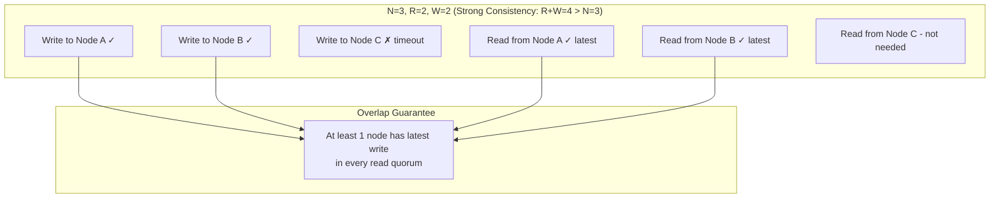
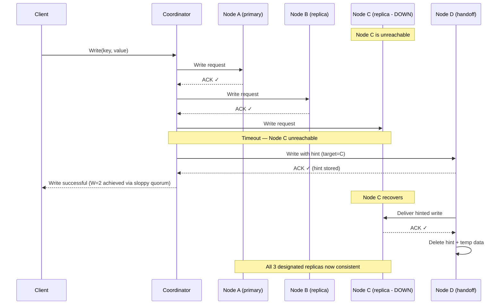
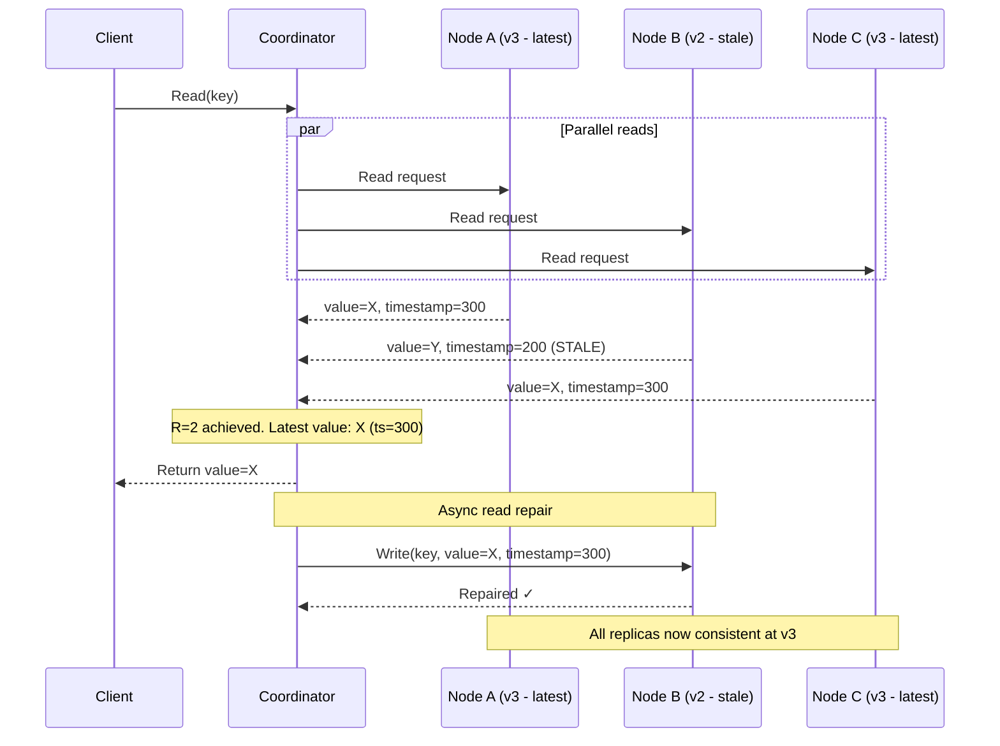

# Quorum Systems

## Quick Reference

- A **quorum** is the minimum number of nodes that must participate in a distributed operation for it to be considered successful — typically a majority (⌊N/2⌋ + 1) of N replicas
- The fundamental quorum constraint for strong consistency: **R + W > N** (read quorum + write quorum > total replicas), ensuring every read overlaps with at least one node that has the latest write
- **Sloppy quorums** relax the strict quorum requirement by allowing any W nodes (not necessarily the designated replicas) to acknowledge a write, improving availability at the cost of consistency guarantees
- **Hinted handoff** is the mechanism that enables sloppy quorums: when a designated replica is unreachable, a neighboring node temporarily stores the write and forwards it when the target recovers
- **Read repair** detects and fixes inconsistencies during read operations by comparing responses from multiple replicas and updating stale ones with the latest value
- Common quorum configurations: N=3/R=2/W=2 (balanced), N=3/R=1/W=3 (fast reads), N=3/R=3/W=1 (fast writes), N=5/R=3/W=3 (higher fault tolerance)
- Anti-entropy mechanisms (Merkle trees, active repair) complement quorums by fixing inconsistencies that read repair cannot catch (unread data)

## When to Use

Quorum systems apply whenever you are building or operating a replicated data store that needs to balance consistency, availability, and latency. You need quorum knowledge when configuring Cassandra, DynamoDB, Riak, or CockroachDB consistency levels, when designing replication protocols for custom distributed systems, when reasoning about failure tolerance (how many nodes can fail before the system becomes unavailable or inconsistent), when optimizing read/write latency by tuning quorum sizes, and when preparing for system design interviews that involve distributed databases or consensus. Understanding sloppy quorums and hinted handoff is essential for explaining how systems like DynamoDB maintain availability during partial failures while eventually converging to consistency.

## Code Examples

### Quorum-Based Read/Write Coordinator

```java
import java.util.*;
import java.util.concurrent.*;
import java.util.stream.Collectors;

/**
 * Coordinator that implements quorum reads and writes with configurable
 * consistency levels. Handles timeouts, read repair, and response merging.
 */
public class QuorumCoordinator {
    private final List<ReplicaNode> replicas;
    private final int readQuorum;   // R
    private final int writeQuorum;  // W
    private final int replicaCount; // N
    private final ExecutorService executor;
    private final long timeoutMs;

    public QuorumCoordinator(List<ReplicaNode> replicas, int readQuorum,
                             int writeQuorum, long timeoutMs) {
        this.replicas = replicas;
        this.replicaCount = replicas.size();
        this.readQuorum = readQuorum;
        this.writeQuorum = writeQuorum;
        this.timeoutMs = timeoutMs;
        this.executor = Executors.newFixedThreadPool(replicas.size());

        // Validate quorum overlap for strong consistency
        if (readQuorum + writeQuorum <= replicaCount) {
            System.err.println("WARNING: R + W <= N — strong consistency NOT guaranteed");
        }
    }

    /**
     * Quorum write: send write to all replicas, wait for W acknowledgments.
     * Returns success if at least W replicas confirm the write.
     */
    public WriteResult write(String key, byte[] value, long timestamp) {
        List<Future<WriteAck>> futures = new ArrayList<>();

        // Send write to ALL replicas (not just W)
        for (ReplicaNode replica : replicas) {
            futures.add(executor.submit(() -> replica.write(key, value, timestamp)));
        }

        // Wait for W acknowledgments within timeout
        int acks = 0;
        List<String> failedNodes = new ArrayList<>();

        for (int i = 0; i < futures.size(); i++) {
            try {
                WriteAck ack = futures.get(i).get(timeoutMs, TimeUnit.MILLISECONDS);
                if (ack.isSuccess()) {
                    acks++;
                } else {
                    failedNodes.add(replicas.get(i).getNodeId());
                }
            } catch (TimeoutException | InterruptedException | ExecutionException e) {
                failedNodes.add(replicas.get(i).getNodeId());
            }
        }

        if (acks >= writeQuorum) {
            return new WriteResult(true, acks, failedNodes);
        } else {
            return new WriteResult(false, acks, failedNodes);
        }
    }

    /**
     * Quorum read with read repair: query all replicas, wait for R responses,
     * return the value with the highest timestamp, and repair stale replicas.
     */
    public ReadResult read(String key) {
        List<Future<ReadResponse>> futures = new ArrayList<>();

        // Query ALL replicas
        for (ReplicaNode replica : replicas) {
            futures.add(executor.submit(() -> replica.read(key)));
        }

        // Collect R responses
        List<ReadResponse> responses = new ArrayList<>();
        for (int i = 0; i < futures.size(); i++) {
            try {
                ReadResponse response = futures.get(i).get(timeoutMs, TimeUnit.MILLISECONDS);
                responses.add(response);
            } catch (TimeoutException | InterruptedException | ExecutionException e) {
                // Node didn't respond in time — skip
            }

            // Once we have R responses, we can return (but continue collecting for repair)
            if (responses.size() == readQuorum) {
                break;
            }
        }

        if (responses.size() < readQuorum) {
            return new ReadResult(null, false, "Insufficient replicas responded");
        }

        // Find the most recent value (highest timestamp wins)
        ReadResponse latest = responses.stream()
            .filter(r -> r.getValue() != null)
            .max(Comparator.comparingLong(ReadResponse::getTimestamp))
            .orElse(responses.get(0));

        // Trigger async read repair for stale replicas
        triggerReadRepair(key, latest, responses);

        return new ReadResult(latest.getValue(), true, null);
    }

    /**
     * Read repair: asynchronously update replicas that returned stale data.
     * This is a background operation — it does not block the read response.
     */
    private void triggerReadRepair(String key, ReadResponse latest,
                                   List<ReadResponse> responses) {
        executor.submit(() -> {
            for (ReadResponse response : responses) {
                if (response.getTimestamp() < latest.getTimestamp()) {
                    try {
                        response.getSourceNode().write(
                            key, latest.getValue(), latest.getTimestamp()
                        );
                    } catch (Exception e) {
                        // Read repair is best-effort; log and continue
                        System.err.println("Read repair failed for node "
                            + response.getSourceNode().getNodeId() + ": " + e.getMessage());
                    }
                }
            }
        });
    }
}
```

### Sloppy Quorum with Hinted Handoff

```typescript
interface HintedWrite {
  key: string;
  value: Buffer;
  timestamp: number;
  targetNodeId: string;  // The node this write is intended for
  createdAt: number;     // When the hint was created
  ttlMs: number;         // How long to keep the hint before discarding
}

/**
 * Implements sloppy quorum with hinted handoff.
 * When a designated replica is unreachable, a "next-in-line" node
 * accepts the write and stores a hint for later delivery.
 */
class SloppyQuorumCoordinator {
  private preferenceList: Map<string, string[]>;  // key range → ordered node list
  private hintedStore: Map<string, HintedWrite[]> = new Map();  // nodeId → pending hints
  private readonly N: number;  // Replication factor
  private readonly W: number;  // Write quorum
  private readonly hintTtlMs: number = 3 * 60 * 60 * 1000;  // 3 hours default

  constructor(
    private nodes: Map<string, ReplicaNode>,
    private ring: ConsistentHashRing,
    config: { N: number; W: number }
  ) {
    this.N = config.N;
    this.W = config.W;
    this.preferenceList = new Map();
  }

  /**
   * Write with sloppy quorum: if designated replicas are down,
   * accept writes on any reachable node (with hints for delivery later).
   */
  async write(key: string, value: Buffer, timestamp: number): Promise<WriteResult> {
    const designatedNodes = this.ring.getNodes(key, this.N);
    let acks = 0;
    const hints: HintedWrite[] = [];

    for (const nodeId of designatedNodes) {
      const node = this.nodes.get(nodeId);
      if (node && node.isReachable()) {
        try {
          await node.write(key, value, timestamp);
          acks++;
        } catch (err) {
          // Node became unreachable during write — try handoff
          const handoffNode = this.findHandoffNode(designatedNodes);
          if (handoffNode) {
            await this.writeWithHint(handoffNode, key, value, timestamp, nodeId);
            acks++;
          }
        }
      } else {
        // Node unreachable — use hinted handoff
        const handoffNode = this.findHandoffNode(designatedNodes);
        if (handoffNode) {
          await this.writeWithHint(handoffNode, key, value, timestamp, nodeId);
          acks++;  // Sloppy quorum counts handoff nodes
        }
      }

      if (acks >= this.W) break;
    }

    return { success: acks >= this.W, acks, hints: hints.length };
  }

  /**
   * Write data to a handoff node with a hint indicating the intended target.
   * The handoff node stores the data and periodically attempts delivery.
   */
  private async writeWithHint(
    handoffNode: ReplicaNode,
    key: string,
    value: Buffer,
    timestamp: number,
    targetNodeId: string
  ): Promise<void> {
    // Store the actual data on the handoff node
    await handoffNode.write(key, value, timestamp);

    // Store the hint for later delivery
    const hint: HintedWrite = {
      key,
      value,
      timestamp,
      targetNodeId,
      createdAt: Date.now(),
      ttlMs: this.hintTtlMs,
    };

    const nodeHints = this.hintedStore.get(handoffNode.nodeId) || [];
    nodeHints.push(hint);
    this.hintedStore.set(handoffNode.nodeId, nodeHints);
  }

  /**
   * Periodically called to deliver hints to recovered nodes.
   * Once delivered, the hint and temporary data are deleted from the handoff node.
   */
  async deliverHints(handoffNodeId: string): Promise<number> {
    const hints = this.hintedStore.get(handoffNodeId) || [];
    let delivered = 0;

    const remaining: HintedWrite[] = [];
    for (const hint of hints) {
      // Check if hint has expired
      if (Date.now() - hint.createdAt > hint.ttlMs) {
        continue;  // Discard expired hints
      }

      const targetNode = this.nodes.get(hint.targetNodeId);
      if (targetNode && targetNode.isReachable()) {
        try {
          await targetNode.write(hint.key, hint.value, hint.timestamp);
          delivered++;
          // Delete temporary data from handoff node
          const handoffNode = this.nodes.get(handoffNodeId);
          if (handoffNode) await handoffNode.deleteHintedData(hint.key, hint.timestamp);
        } catch {
          remaining.push(hint);  // Retry later
        }
      } else {
        remaining.push(hint);  // Target still down
      }
    }

    this.hintedStore.set(handoffNodeId, remaining);
    return delivered;
  }

  private findHandoffNode(excludeNodes: string[]): ReplicaNode | null {
    const excludeSet = new Set(excludeNodes);
    for (const [nodeId, node] of this.nodes) {
      if (!excludeSet.has(nodeId) && node.isReachable()) {
        return node;
      }
    }
    return null;
  }
}
```

## Architecture / Diagrams

### Quorum Read/Write Overlap



### Sloppy Quorum with Hinted Handoff Flow



### Read Repair Process



## Common Pitfalls

- **Assuming sloppy quorums provide strong consistency** — A sloppy quorum of W=2 might be satisfied by two non-designated nodes (via hinted handoff). A subsequent strict quorum read of R=2 from the designated replicas might miss the write entirely because the data is on handoff nodes. Sloppy quorums trade consistency for availability — they guarantee durability, not immediate visibility.

- **Not accounting for clock skew in timestamp-based conflict resolution** — When using last-writer-wins (LWW) with quorum reads, clock skew between nodes can cause a "later" write (by wall clock) to be overwritten by an "earlier" write with a higher timestamp from a skewed clock. Use logical clocks (Lamport timestamps, vector clocks) or hybrid logical clocks (HLC) for correct ordering.

- **Ignoring the "tail latency" problem with quorum reads** — A quorum read with R=2 out of N=3 must wait for the 2nd-fastest response. If one node is slow (GC pause, disk I/O), latency is determined by the 2nd-slowest node. Speculative execution (sending reads to all N nodes and taking the first R responses) helps but increases load.

- **Forgetting that read repair only fixes data that is actually read** — Read repair is triggered by read operations. Data that is written but never read will remain inconsistent across replicas until an active anti-entropy process (Merkle tree comparison, full repair) detects and fixes the divergence. Schedule regular anti-entropy repairs for data that is infrequently accessed.

- **Misconfiguring quorum sizes for multi-datacenter deployments** — Using `QUORUM` (global majority) in a multi-DC setup means writes must cross datacenter boundaries, adding 50-200ms latency. Use `LOCAL_QUORUM` for writes that only need local DC consistency, and `EACH_QUORUM` when you need acknowledgment from every DC.

## Real-World Use Cases

**Amazon DynamoDB:** DynamoDB uses sloppy quorums as its default write behavior. When a designated replica is unreachable, a downstream node in the preference list accepts the write with a hinted handoff. This is why DynamoDB can offer 99.99% write availability — writes almost never fail due to individual node outages. The trade-off is that strongly consistent reads must go to the leader node, while eventually consistent reads (the default) can be served by any replica.

**Apache Cassandra:** Cassandra exposes quorum configuration directly to the application via per-query consistency levels. A common production pattern is `LOCAL_QUORUM` for both reads and writes in multi-DC deployments, providing strong consistency within a datacenter while allowing async replication across DCs. Cassandra's read repair runs probabilistically (configurable via `read_repair_chance`) and its `nodetool repair` command performs full anti-entropy repair using Merkle trees.

**CockroachDB:** CockroachDB uses Raft consensus (which is a strict quorum protocol) for every write. Each range (partition) has a Raft group with a leader that replicates writes to a majority before acknowledging. This provides linearizable consistency but means writes are unavailable if a majority of replicas for a range are down. CockroachDB's "leaseholder" optimization allows reads to be served by a single node that holds the lease, avoiding quorum reads for most read operations.

**Riak:** Riak pioneered the sloppy quorum + hinted handoff approach in its Dynamo-inspired architecture. It exposes N/R/W parameters per bucket, allowing different data types to have different consistency guarantees. Riak's active anti-entropy (AAE) system continuously compares Merkle trees between replicas to detect and repair inconsistencies that read repair misses.

## Interview Questions

**Q: Explain the relationship between R, W, and N in quorum systems. When is strong consistency guaranteed?**

A: N is the replication factor (total copies of data), W is the write quorum (nodes that must acknowledge a write), and R is the read quorum (nodes that must respond to a read). Strong consistency (linearizability) is guaranteed when R + W > N, because every read quorum must overlap with every write quorum by at least one node — that node has the latest write. Common configurations: N=3/R=2/W=2 (balanced, tolerates 1 failure for both reads and writes), N=3/R=1/W=3 (fast reads, writes need all nodes), N=3/R=3/W=1 (fast writes, reads need all nodes). The trade-off is always between latency (smaller quorums are faster) and consistency/fault tolerance.

**Q: What is the difference between a strict quorum and a sloppy quorum? When would you choose each?**

A: A strict quorum requires that the W nodes acknowledging a write are among the N designated replicas for that key. A sloppy quorum allows any W reachable nodes to acknowledge, even if they are not designated replicas (using hinted handoff to eventually deliver to the correct nodes). Strict quorums guarantee that a subsequent quorum read will see the write (R + W > N holds). Sloppy quorums do not — the data might be on handoff nodes that a reader does not query. Choose strict quorums when you need strong consistency (banking, inventory). Choose sloppy quorums when availability is paramount and you can tolerate brief inconsistency windows (shopping carts, social media feeds).

**Q: How does read repair work, and what are its limitations?**

A: During a quorum read, the coordinator sends read requests to multiple replicas. When responses arrive, it compares timestamps (or version vectors) and identifies the latest value. If any responding replica has a stale value, the coordinator asynchronously sends the latest value to that replica — this is read repair. Limitations: (1) It only repairs data that is actually read — unread stale data remains inconsistent. (2) It is asynchronous — a subsequent read might still hit the stale replica before repair completes. (3) It adds write load to the cluster proportional to read traffic on inconsistent data. (4) It cannot detect all types of inconsistency (e.g., a replica that has extra data that should have been deleted). Active anti-entropy (Merkle tree comparison) is needed to complement read repair.

**Q: How do quorum systems handle network partitions differently from consensus protocols like Raft?**

A: In a quorum system (like Dynamo-style databases), both sides of a partition can potentially accept writes if they can each form a quorum independently — this is the sloppy quorum approach that prioritizes availability. Conflicts are resolved after the partition heals (using vector clocks, LWW, or application-level merge). In a consensus protocol like Raft, only the side with a majority (strict quorum) can elect a leader and accept writes. The minority side becomes read-only or unavailable. This guarantees no conflicting writes but sacrifices availability on the minority side. The choice depends on whether your system prioritizes availability (quorum/Dynamo) or consistency (consensus/Raft).

## Production Tips

- **Set up anti-entropy repair on a schedule, not just relying on read repair.** In Cassandra, run `nodetool repair` at least once within your `gc_grace_seconds` window (default 10 days) to prevent zombie data resurrection from tombstone expiration. For large clusters, use incremental repair (`-inc`) or subrange repair to limit the blast radius and resource consumption of each repair operation.

- **Monitor hinted handoff queue depth as an early warning signal.** A growing hint queue means nodes are staying down longer than expected or recovering slowly. Set alerts when hint queue size exceeds a threshold (e.g., 10,000 hints per node). If hints expire before delivery (default TTL is typically 1-3 hours), data loss occurs for the affected writes. Consider increasing hint TTL for critical data or implementing a separate reconciliation mechanism.

- **Use speculative retry to reduce tail latency on quorum reads.** If the first R-1 responses arrive quickly but the Rth is slow, send a speculative read to an additional replica. Return whichever R responses arrive first. Cassandra supports this via `speculative_retry` (e.g., `99percentile` sends a speculative request if the primary hasn't responded within the p99 latency). This significantly reduces p99 read latency at the cost of slightly increased read load.

## Related Topics

- [CAP Theorem In Depth](./cap-theorem-depth.md) — Quorum configurations directly implement the consistency vs. availability trade-off described by CAP
- [Consistent Hashing](./consistent-hashing.md) — Determines which nodes form the preference list for a given key's quorum
- [Vector Clocks](./vector-clocks.md) — Used alongside quorum reads to detect and resolve conflicts when replicas diverge
- [Leader Election](./leader-election.md) — Consensus-based leader election uses strict quorums (majority agreement) to guarantee a single leader
