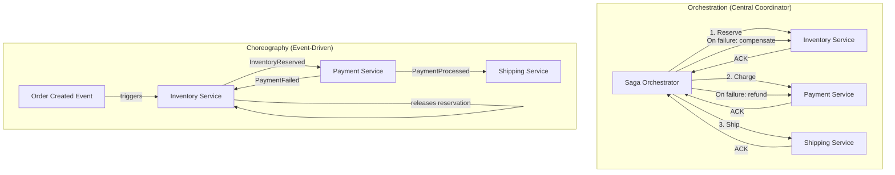
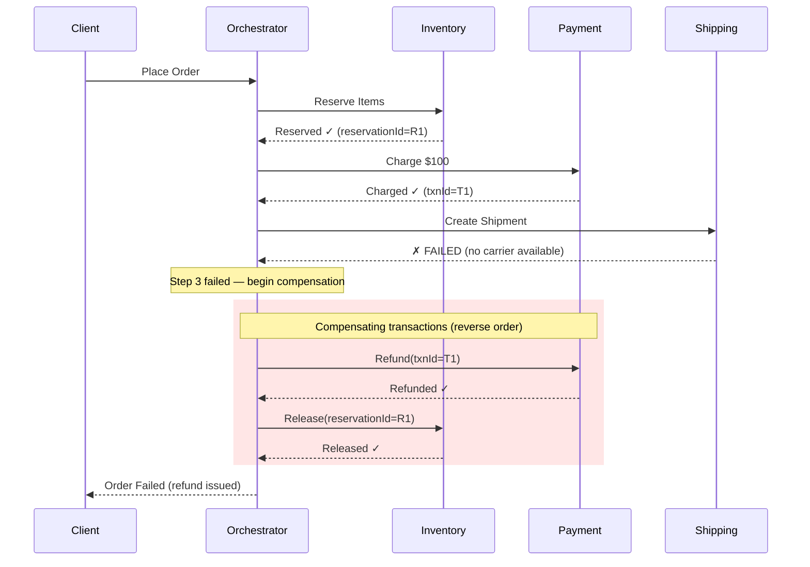
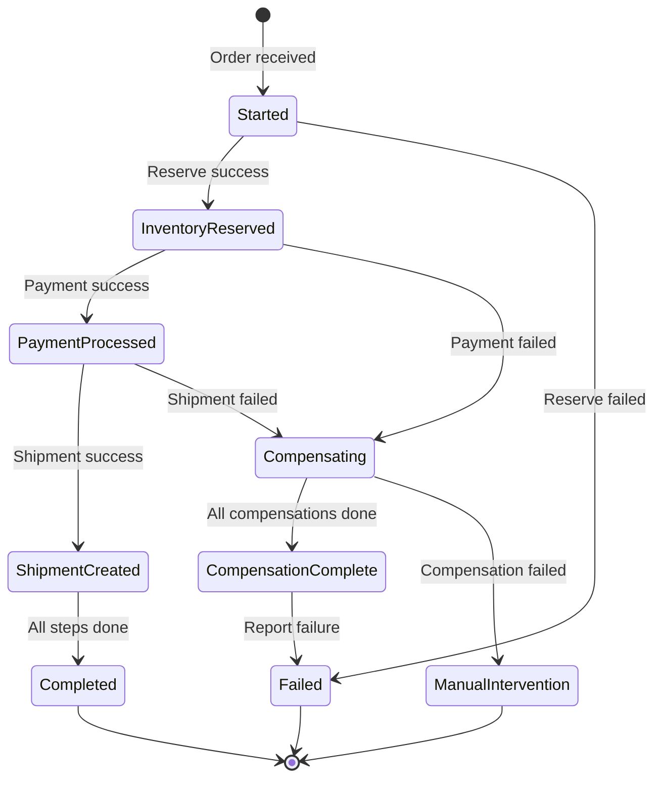

# Saga Pattern

## Quick Reference

- A **saga** is a sequence of local transactions where each step has a corresponding **compensating transaction** that undoes its effect if a subsequent step fails — providing eventual consistency across services without distributed locks
- Two coordination approaches: **Choreography** (services react to events, no central controller) and **Orchestration** (a central coordinator directs the saga steps)
- Sagas provide ACD guarantees (Atomicity via compensation, Consistency via eventual convergence, Durability via local commits) but NOT Isolation — intermediate states are visible to other transactions
- Compensating transactions must be **idempotent** and **commutative** — they may be retried multiple times and may execute in different orders during failure recovery
- The saga pattern replaces two-phase commit (2PC) in microservice architectures because 2PC requires all participants to be available simultaneously and holds locks across services
- Saga failures are categorized as: **recoverable** (retry the failed step), **pivot** (the point of no return — after this, only forward recovery), and **non-recoverable** (must compensate all prior steps)
- Semantic locks, commutative updates, and pessimistic views are countermeasures for the lack of isolation in sagas

## When to Use

The saga pattern applies when you have a business transaction that spans multiple services or bounded contexts, each with its own database, and you need to maintain data consistency without distributed transactions. Common scenarios include: e-commerce order fulfillment (reserve inventory → charge payment → ship order), travel booking (book flight → book hotel → book car), financial transfers between accounts in different services, user registration workflows that span identity, billing, and notification services, and any multi-step process where each step is owned by a different team or service. You should NOT use sagas for operations that require strict isolation (use a single database transaction instead) or when the compensating logic is too complex or impossible to implement (e.g., sending a physical letter cannot be "compensated").

## Code Examples

### Orchestration-Based Saga (Order Fulfillment)

```java
import java.util.*;
import java.util.concurrent.CompletableFuture;

/**
 * Saga orchestrator for order fulfillment.
 * Coordinates: Inventory → Payment → Shipping
 * Each step has a corresponding compensation action.
 */
public class OrderSagaOrchestrator {
    private final InventoryService inventoryService;
    private final PaymentService paymentService;
    private final ShippingService shippingService;
    private final SagaLog sagaLog;

    public OrderSagaOrchestrator(InventoryService inventoryService,
                                  PaymentService paymentService,
                                  ShippingService shippingService,
                                  SagaLog sagaLog) {
        this.inventoryService = inventoryService;
        this.paymentService = paymentService;
        this.shippingService = shippingService;
        this.sagaLog = sagaLog;
    }

    /**
     * Execute the order saga. Each step is a local transaction.
     * If any step fails, compensate all previously completed steps in reverse order.
     */
    public SagaResult executeOrderSaga(Order order) {
        String sagaId = UUID.randomUUID().toString();
        sagaLog.start(sagaId, "order-fulfillment", order.getOrderId());

        List<CompensationAction> completedSteps = new ArrayList<>();

        try {
            // Step 1: Reserve inventory
            sagaLog.stepStarted(sagaId, "reserve-inventory");
            ReservationResult reservation = inventoryService.reserveItems(
                order.getOrderId(), order.getItems()
            );
            sagaLog.stepCompleted(sagaId, "reserve-inventory", reservation.getReservationId());
            completedSteps.add(() -> inventoryService.releaseReservation(reservation.getReservationId()));

            // Step 2: Process payment (PIVOT POINT — after this, prefer forward recovery)
            sagaLog.stepStarted(sagaId, "process-payment");
            PaymentResult payment = paymentService.charge(
                order.getOrderId(), order.getCustomerId(), order.getTotalAmount()
            );
            sagaLog.stepCompleted(sagaId, "process-payment", payment.getTransactionId());
            completedSteps.add(() -> paymentService.refund(payment.getTransactionId()));

            // Step 3: Create shipment
            sagaLog.stepStarted(sagaId, "create-shipment");
            ShipmentResult shipment = shippingService.createShipment(
                order.getOrderId(), order.getShippingAddress(), reservation.getWarehouseId()
            );
            sagaLog.stepCompleted(sagaId, "create-shipment", shipment.getShipmentId());
            // No compensation needed for shipment if saga completes successfully

            // All steps succeeded
            sagaLog.completed(sagaId);
            return SagaResult.success(sagaId, shipment.getTrackingNumber());

        } catch (RetryableException e) {
            // Recoverable failure: retry the failed step (with backoff)
            sagaLog.stepFailed(sagaId, e.getStepName(), e.getMessage(), true);
            return retryFailedStep(sagaId, order, e, completedSteps);

        } catch (SagaStepException e) {
            // Non-recoverable failure: compensate all completed steps
            sagaLog.stepFailed(sagaId, e.getStepName(), e.getMessage(), false);
            compensate(sagaId, completedSteps);
            return SagaResult.failed(sagaId, e.getMessage());
        }
    }

    /**
     * Execute compensating transactions in reverse order.
     * Each compensation is idempotent and retried on failure.
     */
    private void compensate(String sagaId, List<CompensationAction> completedSteps) {
        sagaLog.compensationStarted(sagaId);

        // Compensate in reverse order
        Collections.reverse(completedSteps);
        for (int i = 0; i < completedSteps.size(); i++) {
            CompensationAction action = completedSteps.get(i);
            int maxRetries = 3;
            for (int attempt = 1; attempt <= maxRetries; attempt++) {
                try {
                    action.execute();
                    sagaLog.compensationStepCompleted(sagaId, i);
                    break;
                } catch (Exception e) {
                    if (attempt == maxRetries) {
                        // Compensation failed after retries — alert for manual intervention
                        sagaLog.compensationStepFailed(sagaId, i, e.getMessage());
                        alertOperations(sagaId, i, e);
                    } else {
                        sleep(exponentialBackoff(attempt));
                    }
                }
            }
        }

        sagaLog.compensationCompleted(sagaId);
    }

    private SagaResult retryFailedStep(String sagaId, Order order,
                                        RetryableException e,
                                        List<CompensationAction> completedSteps) {
        // Retry logic with exponential backoff (simplified)
        for (int attempt = 1; attempt <= 3; attempt++) {
            try {
                sleep(exponentialBackoff(attempt));
                // Re-execute from the failed step (implementation depends on step)
                return executeOrderSaga(order);  // Simplified: restart entire saga
            } catch (Exception retryEx) {
                if (attempt == 3) {
                    compensate(sagaId, completedSteps);
                    return SagaResult.failed(sagaId, "Exhausted retries: " + e.getMessage());
                }
            }
        }
        return SagaResult.failed(sagaId, "Retry exhausted");
    }

    private long exponentialBackoff(int attempt) {
        return (long) Math.pow(2, attempt) * 1000;  // 2s, 4s, 8s
    }

    private void sleep(long ms) {
        try { Thread.sleep(ms); } catch (InterruptedException ignored) {}
    }

    private void alertOperations(String sagaId, int stepIndex, Exception e) {
        // Send alert to operations team for manual resolution
    }
}

@FunctionalInterface
interface CompensationAction {
    void execute() throws Exception;
}
```

### Choreography-Based Saga with Event-Driven Communication

```typescript
import { EventEmitter } from 'events';

// Domain events that drive the choreography
interface OrderCreatedEvent {
  type: 'OrderCreated';
  orderId: string;
  customerId: string;
  items: Array<{ productId: string; quantity: number; price: number }>;
  totalAmount: number;
}

interface InventoryReservedEvent {
  type: 'InventoryReserved';
  orderId: string;
  reservationId: string;
  warehouseId: string;
}

interface InventoryReservationFailedEvent {
  type: 'InventoryReservationFailed';
  orderId: string;
  reason: string;
}

interface PaymentProcessedEvent {
  type: 'PaymentProcessed';
  orderId: string;
  transactionId: string;
}

interface PaymentFailedEvent {
  type: 'PaymentFailed';
  orderId: string;
  reason: string;
}

type SagaEvent =
  | OrderCreatedEvent
  | InventoryReservedEvent
  | InventoryReservationFailedEvent
  | PaymentProcessedEvent
  | PaymentFailedEvent;

/**
 * Inventory service participating in a choreography-based saga.
 * Reacts to OrderCreated events and emits reservation results.
 * Listens for PaymentFailed to trigger compensation.
 */
class InventoryServiceHandler {
  constructor(
    private eventBus: EventEmitter,
    private inventoryRepo: InventoryRepository
  ) {
    // React to order creation
    this.eventBus.on('OrderCreated', this.handleOrderCreated.bind(this));
    // React to payment failure — compensate by releasing reservation
    this.eventBus.on('PaymentFailed', this.handlePaymentFailed.bind(this));
  }

  private async handleOrderCreated(event: OrderCreatedEvent): Promise<void> {
    try {
      const reservation = await this.inventoryRepo.reserve(
        event.orderId,
        event.items
      );

      this.eventBus.emit('InventoryReserved', {
        type: 'InventoryReserved',
        orderId: event.orderId,
        reservationId: reservation.id,
        warehouseId: reservation.warehouseId,
      } as InventoryReservedEvent);
    } catch (error) {
      this.eventBus.emit('InventoryReservationFailed', {
        type: 'InventoryReservationFailed',
        orderId: event.orderId,
        reason: (error as Error).message,
      } as InventoryReservationFailedEvent);
    }
  }

  /**
   * Compensating action: release inventory when payment fails.
   * Must be idempotent — may be called multiple times for the same order.
   */
  private async handlePaymentFailed(event: PaymentFailedEvent): Promise<void> {
    await this.inventoryRepo.releaseByOrderId(event.orderId);
    // Idempotent: if already released, this is a no-op
  }
}

/**
 * Payment service participating in the choreography.
 * Reacts to InventoryReserved events.
 */
class PaymentServiceHandler {
  constructor(
    private eventBus: EventEmitter,
    private paymentGateway: PaymentGateway
  ) {
    this.eventBus.on('InventoryReserved', this.handleInventoryReserved.bind(this));
  }

  private async handleInventoryReserved(event: InventoryReservedEvent): Promise<void> {
    try {
      const result = await this.paymentGateway.charge(event.orderId);

      this.eventBus.emit('PaymentProcessed', {
        type: 'PaymentProcessed',
        orderId: event.orderId,
        transactionId: result.transactionId,
      } as PaymentProcessedEvent);
    } catch (error) {
      this.eventBus.emit('PaymentFailed', {
        type: 'PaymentFailed',
        orderId: event.orderId,
        reason: (error as Error).message,
      } as PaymentFailedEvent);
    }
  }
}

/**
 * Saga state tracker for monitoring and debugging choreography-based sagas.
 * Listens to all events and maintains a view of each saga's progress.
 */
class SagaStateTracker {
  private sagaStates: Map<string, SagaState> = new Map();

  constructor(private eventBus: EventEmitter) {
    const events = [
      'OrderCreated', 'InventoryReserved', 'InventoryReservationFailed',
      'PaymentProcessed', 'PaymentFailed'
    ];
    events.forEach(event => {
      this.eventBus.on(event, (e: SagaEvent) => this.trackEvent(e));
    });
  }

  private trackEvent(event: SagaEvent): void {
    const orderId = event.orderId;
    const state = this.sagaStates.get(orderId) || { steps: [], status: 'in-progress' };
    state.steps.push({ event: event.type, timestamp: Date.now() });

    if (event.type === 'PaymentProcessed') state.status = 'completed';
    if (event.type === 'InventoryReservationFailed') state.status = 'failed';
    if (event.type === 'PaymentFailed') state.status = 'compensating';

    this.sagaStates.set(orderId, state);
  }

  getState(orderId: string): SagaState | undefined {
    return this.sagaStates.get(orderId);
  }
}

interface SagaState {
  steps: Array<{ event: string; timestamp: number }>;
  status: 'in-progress' | 'completed' | 'failed' | 'compensating';
}
```

## Architecture / Diagrams

### Orchestration vs Choreography Comparison



### Saga Execution with Compensation Flow



### Saga State Machine



## Common Pitfalls

- **Not making compensating transactions idempotent** — Compensations may be retried due to network failures or coordinator crashes. If a refund compensation is not idempotent, a customer could receive multiple refunds. Always use idempotency keys and check-before-act patterns in compensating transactions.

- **Ignoring the lack of isolation** — Sagas do not provide the "I" in ACID. Other transactions can see intermediate states (e.g., inventory reserved but payment not yet processed). This can lead to dirty reads and anomalies. Countermeasures include semantic locks (marking records as "pending"), commutative updates (operations that produce the same result regardless of order), and pessimistic views (reading the "worst case" state).

- **Designing compensations that are impossible to implement** — Some actions cannot be undone: emails sent, physical goods shipped, notifications pushed. Design your saga so that irreversible steps come last (after the pivot point). If an irreversible step must come early, use a "pending" state that is only finalized after all subsequent steps succeed.

- **Not persisting saga state** — If the orchestrator crashes mid-saga, it must be able to resume from where it left off. Without a durable saga log, in-flight sagas are lost, leaving the system in an inconsistent state. Use an event store or saga log table that records each step's completion and compensation status.

- **Choreography sagas becoming unmanageable at scale** — With 5+ services in a choreography, the event flow becomes difficult to reason about, debug, and monitor. There is no single place to see the saga's current state. Consider switching to orchestration when the number of steps exceeds 4-5, or use a saga state tracker that aggregates events into a coherent view.

- **Not handling the "pivot transaction" correctly** — The pivot transaction is the point of no return: before it, you can compensate backward; after it, you must complete forward. If the pivot step fails, you compensate. If a step after the pivot fails, you must retry forward (not compensate). Misidentifying the pivot leads to incorrect compensation or stuck sagas.

## Real-World Use Cases

**Uber Trip Lifecycle:** Uber uses sagas to coordinate trip-related operations across multiple services: rider matching, driver assignment, payment authorization, trip tracking, and fare calculation. If payment authorization fails after a driver is assigned, the compensation releases the driver back to the available pool. Uber's orchestration platform (Cadence, now Temporal) manages saga state durability and retry logic.

**Netflix Content Licensing:** When Netflix licenses content for a new region, the workflow spans multiple services: rights management, encoding pipeline, CDN distribution, and catalog update. Each step is a saga participant. If encoding fails, the rights reservation is released. Netflix uses their Conductor orchestration engine to manage these multi-step workflows with compensation.

**Stripe Payment Processing:** Stripe's internal payment flow is a saga across authorization, capture, settlement, and payout services. If settlement fails after capture, the compensation reverses the capture (void or refund). Stripe's idempotency key system ensures that retried compensations do not create duplicate refunds.

**Booking.com Reservation System:** A hotel booking saga coordinates: room availability check → price lock → payment → confirmation email. If payment fails, the price lock is released and the room is made available again. The confirmation email (irreversible) is the last step, only sent after all other steps succeed.

## Interview Questions

**Q: What are the trade-offs between choreography and orchestration for sagas?**

A: Choreography (event-driven): Pros — loose coupling between services, no single point of failure, each service is autonomous. Cons — difficult to understand the overall flow, hard to debug (no central view), cyclic dependencies can emerge, adding a new step requires modifying existing services' event handlers. Orchestration (central coordinator): Pros — clear flow visibility, easier to add/modify steps, centralized error handling and compensation logic, better for complex sagas. Cons — the orchestrator is a single point of failure (must be highly available), introduces coupling to the orchestrator, can become a bottleneck. Rule of thumb: use choreography for simple sagas (2-3 steps) and orchestration for complex ones (4+ steps or complex compensation logic).

**Q: How do you handle the lack of isolation in sagas? What anomalies can occur?**

A: Without isolation, other transactions can observe intermediate saga states, leading to: (1) Dirty reads — reading data that a saga will later compensate (e.g., seeing a reserved inventory count that will be released). (2) Lost updates — two sagas modifying the same data concurrently without coordination. (3) Non-repeatable reads — reading different values at different saga steps. Countermeasures: Semantic locks — add a "status" field (PENDING, CONFIRMED, CANCELLED) so readers know the data is in-flight. Commutative updates — design operations so order doesn't matter (e.g., increment/decrement counters instead of set absolute values). Pessimistic views — read the "worst case" (e.g., treat PENDING reservations as confirmed when checking availability). Reread values — re-validate assumptions before the pivot transaction.

**Q: What happens if a compensating transaction fails? How do you handle it?**

A: Compensating transactions must be designed to eventually succeed through retries (they should be idempotent and retryable). If a compensation fails after exhausting retries: (1) Log the failure in the saga log for audit. (2) Alert the operations team for manual intervention. (3) The saga enters a "compensation-failed" terminal state. (4) A dead letter queue or manual resolution process handles the inconsistency. To minimize this risk: design compensations to be simple (release a lock, issue a refund), make them idempotent (safe to retry), and test compensation paths as thoroughly as the happy path. Some systems use a "compensation retry daemon" that periodically retries failed compensations with exponential backoff.

**Q: When would you choose a saga over a two-phase commit (2PC)?**

A: Choose sagas over 2PC when: (1) Services are independently deployed and owned by different teams — 2PC requires all participants to be available simultaneously and hold locks. (2) Long-running transactions — 2PC locks resources for the entire transaction duration, which is unacceptable for operations taking seconds or minutes. (3) High availability is required — 2PC blocks if the coordinator or any participant is unavailable. (4) Services use different databases — 2PC requires XA-compatible transaction managers, which many modern databases don't support. Choose 2PC when: (1) All participants are within the same trust boundary and deployment. (2) Transactions are short-lived (milliseconds). (3) Strong isolation is required and the complexity of saga countermeasures is not justified.

## Production Tips

- **Implement a saga log with at-least-once delivery guarantees.** The saga log (or event store) is the source of truth for saga state. Use a durable store (PostgreSQL, Kafka) and ensure that saga step completions are recorded atomically with the local transaction (outbox pattern). On orchestrator restart, replay the log to determine which sagas need resumption or compensation.

- **Set timeouts on every saga step and define escalation policies.** A saga step that hangs indefinitely blocks the entire saga. Define per-step timeouts (e.g., payment: 30s, shipping: 60s) and escalation behavior: first retry, then compensate, then alert. Use a workflow engine (Temporal, AWS Step Functions) that provides built-in timeout and retry semantics rather than implementing them from scratch.

- **Test compensation paths with the same rigor as happy paths.** In production, compensations execute during failures — exactly when things are already going wrong. Chaos test your sagas by injecting failures at each step and verifying that compensation restores the system to a consistent state. Track compensation success rate as a key metric — it should be 99.9%+.

## Related Topics

- [Event Sourcing and CQRS](./event-sourcing-cqrs.md) — Event sourcing provides a natural saga log and enables rebuilding saga state from events
- [Distributed Systems](./distributed-systems.md) — Sagas are a fundamental pattern for maintaining consistency in distributed architectures
- [Consistency Models](./consistency-models.md) — Sagas provide eventual consistency, which is a specific consistency model with defined guarantees
- [Leader Election](./leader-election.md) — Saga orchestrators often use leader election to ensure exactly one coordinator is active
