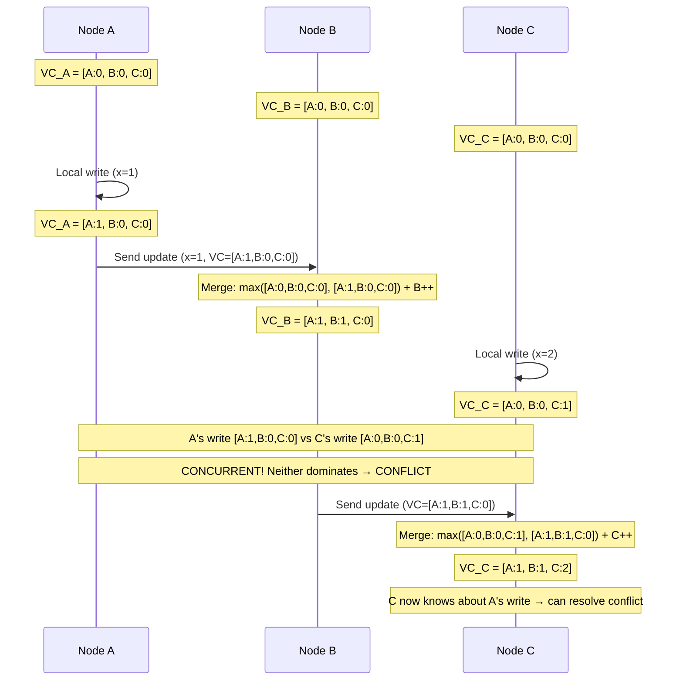
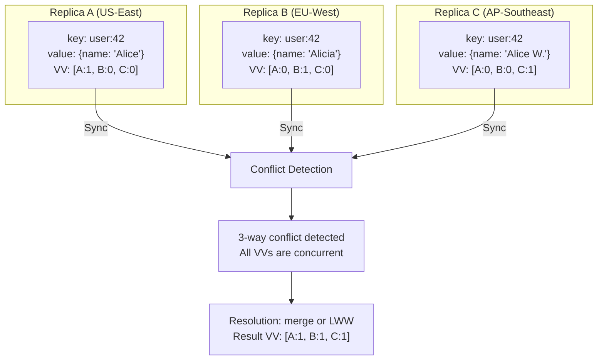

# Vector Clocks

## Quick Reference

- A **vector clock** is a logical clock that tracks causality in distributed systems — each process maintains a vector of counters (one per process), incremented on local events and merged on message receipt
- Vector clocks establish a **partial order** on events: if V(a) < V(b) (all components of a are ≤ b, with at least one strictly less), then event a **happened before** event b
- When two vector clocks are **concurrent** (neither dominates the other), the events are causally independent — a conflict exists that requires resolution
- **Version vectors** are the data-structure application of vector clocks to detect conflicts in replicated data stores — each replica maintains a version vector for each data item
- **Last-Writer-Wins (LWW)** resolves conflicts by picking the write with the highest timestamp — simple but can silently discard valid concurrent updates
- **Merge functions** (CRDTs, application-specific logic) resolve conflicts by combining concurrent updates rather than discarding one — preserves all information but requires domain-specific design
- Lamport timestamps provide a total order but cannot detect concurrency — vector clocks are strictly more powerful because they can distinguish "happened-before" from "concurrent"

## When to Use

Vector clocks and version vectors apply when you need to detect conflicting concurrent updates in a distributed system without a single coordinator. You need them when building multi-master replication systems (like DynamoDB, Riak, or CouchDB) where multiple nodes can accept writes for the same key simultaneously, when implementing optimistic concurrency control in distributed databases, when designing conflict resolution strategies for offline-first applications (mobile apps that sync), when building collaborative editing systems that need to detect and merge concurrent edits, and when reasoning about causality in distributed event processing (ensuring events are processed in causal order). Understanding vector clocks is essential for system design interviews involving eventually consistent systems, as they are the mechanism that enables AP systems to detect and resolve divergent state after network partitions heal.

## Code Examples

### Vector Clock Implementation with Conflict Detection

```java
import java.util.*;
import java.util.stream.Collectors;

/**
 * Vector clock implementation for tracking causality in a distributed system.
 * Each node maintains its own vector clock and updates it on local events
 * and message exchanges.
 */
public class VectorClock {
    private final Map<String, Long> clock;  // nodeId → counter

    public VectorClock() {
        this.clock = new HashMap<>();
    }

    public VectorClock(Map<String, Long> clock) {
        this.clock = new HashMap<>(clock);
    }

    /**
     * Increment this node's counter (called on local write/event).
     */
    public VectorClock increment(String nodeId) {
        Map<String, Long> newClock = new HashMap<>(this.clock);
        newClock.merge(nodeId, 1L, Long::sum);
        return new VectorClock(newClock);
    }

    /**
     * Merge with another vector clock (called on receiving a message/update).
     * Takes the component-wise maximum of both clocks, then increments own counter.
     */
    public VectorClock merge(VectorClock other, String localNodeId) {
        Map<String, Long> merged = new HashMap<>(this.clock);
        for (Map.Entry<String, Long> entry : other.clock.entrySet()) {
            merged.merge(entry.getKey(), entry.getValue(), Math::max);
        }
        // Increment local counter after merge
        merged.merge(localNodeId, 1L, Long::sum);
        return new VectorClock(merged);
    }

    /**
     * Compare two vector clocks to determine causal relationship.
     * Returns: BEFORE, AFTER, CONCURRENT, or EQUAL
     */
    public CausalRelation compareTo(VectorClock other) {
        boolean thisLessOrEqual = true;
        boolean otherLessOrEqual = true;

        Set<String> allNodes = new HashSet<>();
        allNodes.addAll(this.clock.keySet());
        allNodes.addAll(other.clock.keySet());

        for (String node : allNodes) {
            long thisValue = this.clock.getOrDefault(node, 0L);
            long otherValue = other.clock.getOrDefault(node, 0L);

            if (thisValue > otherValue) otherLessOrEqual = false;
            if (otherValue > thisValue) thisLessOrEqual = false;
        }

        if (thisLessOrEqual && otherLessOrEqual) return CausalRelation.EQUAL;
        if (thisLessOrEqual) return CausalRelation.BEFORE;  // this happened before other
        if (otherLessOrEqual) return CausalRelation.AFTER;   // this happened after other
        return CausalRelation.CONCURRENT;  // Conflict!
    }

    /**
     * Check if this clock dominates (is strictly after) another.
     */
    public boolean dominates(VectorClock other) {
        return compareTo(other) == CausalRelation.AFTER;
    }

    /**
     * Check if two clocks are concurrent (conflict exists).
     */
    public boolean isConcurrentWith(VectorClock other) {
        return compareTo(other) == CausalRelation.CONCURRENT;
    }

    public Map<String, Long> toMap() {
        return Collections.unmodifiableMap(clock);
    }

    @Override
    public String toString() {
        return clock.entrySet().stream()
            .sorted(Map.Entry.comparingByKey())
            .map(e -> e.getKey() + ":" + e.getValue())
            .collect(Collectors.joining(", ", "[", "]"));
    }
}

public enum CausalRelation {
    BEFORE,      // This happened before the other
    AFTER,       // This happened after the other
    CONCURRENT,  // Neither happened before the other (conflict)
    EQUAL        // Same logical time
}

/**
 * Versioned value store using vector clocks for conflict detection.
 * Maintains multiple concurrent versions (siblings) until resolved.
 */
public class VersionedStore<T> {
    private final Map<String, List<VersionedValue<T>>> store = new HashMap<>();

    /**
     * Write a value with a context vector clock.
     * The context is the vector clock of the value being updated (read-before-write).
     */
    public VectorClock put(String key, T value, VectorClock context, String nodeId) {
        VectorClock newClock = context.increment(nodeId);
        VersionedValue<T> newVersion = new VersionedValue<>(value, newClock);

        List<VersionedValue<T>> existing = store.getOrDefault(key, new ArrayList<>());
        List<VersionedValue<T>> surviving = new ArrayList<>();

        for (VersionedValue<T> v : existing) {
            CausalRelation relation = newClock.compareTo(v.getClock());
            if (relation == CausalRelation.BEFORE || relation == CausalRelation.EQUAL) {
                // New write is outdated or same — keep existing, discard new
                surviving.add(v);
            } else if (relation == CausalRelation.CONCURRENT) {
                // Conflict — keep both as siblings
                surviving.add(v);
            }
            // If AFTER — new write supersedes existing, don't keep existing
        }

        surviving.add(newVersion);
        store.put(key, surviving);
        return newClock;
    }

    /**
     * Read a value. Returns all concurrent versions (siblings) if conflicts exist.
     * The client must resolve conflicts and write back a merged value.
     */
    public ReadResult<T> get(String key) {
        List<VersionedValue<T>> versions = store.getOrDefault(key, Collections.emptyList());
        if (versions.isEmpty()) {
            return new ReadResult<>(Collections.emptyList(), new VectorClock(), false);
        }
        if (versions.size() == 1) {
            return new ReadResult<>(
                List.of(versions.get(0).getValue()),
                versions.get(0).getClock(),
                false
            );
        }
        // Multiple siblings — conflict exists
        // Return merged context clock for the client to use in resolution write
        VectorClock mergedContext = versions.stream()
            .map(VersionedValue::getClock)
            .reduce(new VectorClock(), (a, b) -> componentWiseMax(a, b));

        List<T> values = versions.stream()
            .map(VersionedValue::getValue)
            .collect(Collectors.toList());

        return new ReadResult<>(values, mergedContext, true);
    }

    private VectorClock componentWiseMax(VectorClock a, VectorClock b) {
        Map<String, Long> merged = new HashMap<>(a.toMap());
        for (Map.Entry<String, Long> entry : b.toMap().entrySet()) {
            merged.merge(entry.getKey(), entry.getValue(), Math::max);
        }
        return new VectorClock(merged);
    }
}
```

### Conflict Resolution Strategies

```typescript
/**
 * Demonstrates different conflict resolution strategies for concurrent updates
 * detected via vector clocks.
 */

interface VersionedValue<T> {
  value: T;
  clock: Record<string, number>;  // Vector clock as nodeId → counter
  timestamp: number;               // Wall clock (for LWW fallback)
  nodeId: string;                  // Which node wrote this version
}

interface ConflictSet<T> {
  key: string;
  siblings: VersionedValue<T>[];   // All concurrent versions
}

// --- Strategy 1: Last-Writer-Wins (LWW) ---

/**
 * LWW: Pick the value with the highest wall-clock timestamp.
 * Simple but can silently discard valid updates.
 * Used by: Cassandra, DynamoDB (default behavior).
 */
function resolveWithLWW<T>(conflict: ConflictSet<T>): T {
  const winner = conflict.siblings.reduce((latest, current) =>
    current.timestamp > latest.timestamp ? current : latest
  );
  return winner.value;
}

// --- Strategy 2: Application-Specific Merge ---

interface ShoppingCart {
  items: Map<string, number>;  // productId → quantity
}

/**
 * Merge shopping carts by taking the union of items with max quantities.
 * This is a CRDT-like merge that preserves all additions.
 * Used by: Amazon (original Dynamo paper shopping cart example).
 */
function mergeShoppingCarts(conflict: ConflictSet<ShoppingCart>): ShoppingCart {
  const merged: Map<string, number> = new Map();

  for (const sibling of conflict.siblings) {
    for (const [productId, quantity] of sibling.value.items) {
      const current = merged.get(productId) || 0;
      merged.set(productId, Math.max(current, quantity));
    }
  }

  return { items: merged };
}

// --- Strategy 3: Multi-Value Register (Return All to Client) ---

/**
 * Don't resolve automatically — return all siblings to the client.
 * The client displays options or applies domain-specific logic.
 * Used by: Riak (returns siblings to application).
 */
function returnSiblings<T>(conflict: ConflictSet<T>): {
  values: T[];
  requiresResolution: true;
  mergedContext: Record<string, number>;
} {
  // Compute merged context for the resolution write
  const mergedContext: Record<string, number> = {};
  for (const sibling of conflict.siblings) {
    for (const [nodeId, counter] of Object.entries(sibling.clock)) {
      mergedContext[nodeId] = Math.max(mergedContext[nodeId] || 0, counter);
    }
  }

  return {
    values: conflict.siblings.map(s => s.value),
    requiresResolution: true,
    mergedContext,
  };
}

// --- Strategy 4: Dotted Version Vectors (Accurate Sibling Detection) ---

interface DottedVersionVector {
  versionVector: Record<string, number>;  // Base version vector
  dot: { nodeId: string; counter: number };  // The specific event that created this version
}

/**
 * Dotted version vectors improve on plain vector clocks by precisely
 * tracking which node created each sibling, preventing false conflicts
 * (sibling explosion) that occur with plain vector clocks during
 * concurrent reads and writes.
 */
class DottedVersionVectorStore<T> {
  private data: Map<string, Array<{ value: T; dvv: DottedVersionVector }>> = new Map();

  put(key: string, value: T, context: DottedVersionVector, nodeId: string): void {
    const newCounter = (context.versionVector[nodeId] || 0) + 1;
    const newDvv: DottedVersionVector = {
      versionVector: { ...context.versionVector, [nodeId]: newCounter },
      dot: { nodeId, counter: newCounter },
    };

    const existing = this.data.get(key) || [];
    // Remove versions that are dominated by the new version vector
    const surviving = existing.filter(entry => {
      const dominated = Object.entries(entry.dvv.versionVector).every(
        ([nid, cnt]) => (newDvv.versionVector[nid] || 0) >= cnt
      );
      return !dominated;
    });

    surviving.push({ value, dvv: newDvv });
    this.data.set(key, surviving);
  }
}
```

## Architecture / Diagrams

### Vector Clock Progression Example



### Conflict Detection and Resolution Flow

```mermaid
graph TD
    W1[Write from Node A<br/>VC=[A:3, B:2, C:1]] 
    W2[Write from Node C<br/>VC=[A:2, B:2, C:2]]
    
    W1 --> Compare{Compare Vector Clocks}
    W2 --> Compare
    
    Compare -->|"A:3>A:2 but C:1<C:2"| Concurrent[CONCURRENT<br/>Neither dominates]
    
    Concurrent --> Strategy{Resolution Strategy}
    
    Strategy -->|LWW| LWW[Pick highest timestamp<br/>Simple, lossy]
    Strategy -->|Merge| Merge[Application merge<br/>Preserves both]
    Strategy -->|Siblings| Siblings[Return both to client<br/>Client decides]
    
    LWW --> Result1[Single value stored<br/>One update lost]
    Merge --> Result2[Merged value stored<br/>Both preserved]
    Siblings --> Result3[Client resolves<br/>Writes back with merged VC]
```

### Version Vector in Multi-Master Replication



## Common Pitfalls

- **Vector clock size growing unboundedly** — In systems with many nodes (or where nodes join and leave frequently), vector clocks grow with one entry per node ever seen. Solutions: prune entries for nodes that have been decommissioned, use bounded vector clocks with timestamp-based eviction (Dynamo's approach), or use dotted version vectors which are more space-efficient.

- **Confusing Lamport timestamps with vector clocks** — Lamport timestamps provide a total order (if L(a) < L(b), then a might have happened before b or they might be concurrent). Vector clocks provide a partial order that can definitively identify concurrent events. If your system needs to detect conflicts, Lamport timestamps are insufficient — you need vector clocks.

- **Using wall-clock timestamps for LWW without understanding the risks** — Clock skew between nodes means LWW can discard the "actually later" write in favor of an "actually earlier" write from a node with a fast clock. NTP synchronization helps but cannot eliminate this risk entirely. For critical data, prefer vector clocks with explicit conflict resolution over LWW.

- **Sibling explosion in Riak-style systems** — If clients read a value with siblings but write back without including the full context (merged vector clock), new siblings accumulate without resolving old ones. Eventually, a key can have hundreds of siblings, degrading performance. Always read-before-write with the full context, and implement sibling resolution in your application.

- **Not handling the "new node" case** — When a new node joins the system, it has no entry in existing vector clocks. Writes from the new node create entries that appear concurrent with all existing versions. Ensure your conflict resolution handles this gracefully (e.g., by treating the new node's first write as concurrent and merging appropriately).

## Real-World Use Cases

**Amazon DynamoDB (Original Dynamo Paper):** The original Dynamo system used vector clocks to track causality for each key. When concurrent writes occurred during network partitions, Dynamo stored all conflicting versions as siblings and returned them to the client on read. The client (e.g., the shopping cart service) would merge siblings and write back the resolved value. Modern DynamoDB has moved to LWW for simplicity, but the original design demonstrated vector clocks at massive scale.

**Riak KV:** Riak uses dotted version vectors (an improvement over plain vector clocks) to detect concurrent writes. When siblings are detected, Riak can either resolve them automatically (using CRDTs for supported data types) or return all siblings to the application for custom resolution. Riak's `allow_mult=true` setting enables sibling tracking, which is essential for applications that cannot tolerate silent data loss from LWW.

**CouchDB / PouchDB:** CouchDB uses a revision tree (conceptually similar to vector clocks) to track document versions across replicas. When the same document is modified on different replicas, CouchDB detects the conflict and stores both revisions. Applications can query conflicting revisions and implement custom merge logic. PouchDB (the client-side equivalent) uses the same mechanism for offline-first mobile applications that sync when connectivity returns.

**Git Version Control:** Git's merge mechanism is conceptually similar to vector clocks. Each commit has parent pointers that establish causality. When two branches modify the same file (concurrent changes with no causal relationship), Git detects a merge conflict and requires manual resolution. The commit graph is essentially a DAG that encodes the partial order of changes, analogous to vector clock comparisons.

## Interview Questions

**Q: What is the difference between a Lamport timestamp and a vector clock? When would you use each?**

A: A Lamport timestamp is a single integer counter that provides a total order: if event a happened before event b, then L(a) < L(b). However, the converse is not true — L(a) < L(b) does NOT mean a happened before b (they could be concurrent). A vector clock is a vector of counters (one per node) that provides a partial order with the ability to detect concurrency: if VC(a) < VC(b), then a definitely happened before b; if neither dominates, the events are concurrent. Use Lamport timestamps when you need a total ordering for tie-breaking (e.g., log ordering) but don't need to detect conflicts. Use vector clocks when you need to detect concurrent updates and resolve conflicts (e.g., multi-master replication, optimistic concurrency control).

**Q: How does Last-Writer-Wins (LWW) compare to vector clock-based conflict resolution? What are the trade-offs?**

A: LWW uses wall-clock timestamps to pick a "winner" among concurrent writes — the write with the highest timestamp survives, others are silently discarded. Pros: simple to implement, no siblings to manage, deterministic resolution. Cons: data loss (valid concurrent updates are discarded), clock skew can cause "wrong" winner selection, no way for the application to merge concurrent updates. Vector clock-based resolution detects conflicts and either returns siblings to the application or applies a merge function. Pros: no silent data loss, application can implement domain-specific merge logic (e.g., union of shopping cart items). Cons: more complex, requires application-level conflict handling, siblings can accumulate if not resolved. Choose LWW for data where "last update wins" is semantically correct (e.g., user profile updates). Choose vector clocks for data where concurrent updates carry independent information that should be preserved (e.g., collaborative editing, shopping carts).

**Q: Explain the "sibling explosion" problem and how to prevent it.**

A: Sibling explosion occurs when concurrent versions (siblings) accumulate faster than they are resolved. This happens when: (1) Clients read a value with siblings but write back without the full context vector clock — the new write appears concurrent with existing siblings rather than superseding them. (2) High write concurrency on a single key without reads to trigger resolution. (3) Network partitions cause many concurrent writes that are never merged. Prevention: (1) Always perform read-before-write and include the full context (merged vector clock of all siblings) in the write. (2) Set a maximum sibling count (Riak's `max_siblings` setting) — when exceeded, force LWW resolution. (3) Use CRDTs for data types that support automatic merge (counters, sets, registers). (4) Implement background sibling resolution that periodically reads keys with many siblings and writes back merged values.

**Q: How do dotted version vectors improve upon plain vector clocks?**

A: Plain vector clocks in Dynamo-style systems have a problem: when a coordinator handles a write, it increments its own entry in the vector clock. If the same coordinator handles writes from different clients, the vector clock conflates the coordinator's identity with the client's intent, leading to false concurrency detection and unnecessary siblings. Dotted version vectors solve this by separating the "base" version vector (what the node has seen) from the "dot" (the specific event that created this version). This allows precise identification of which write created which sibling, enabling accurate pruning of dominated versions. The result is fewer false siblings and more efficient storage. Riak switched from plain vector clocks to dotted version vectors to solve the sibling explosion problem in high-throughput scenarios.

## Production Tips

- **Implement vector clock pruning with a size limit and timestamp-based eviction.** In systems with many nodes, vector clocks can grow large. Set a maximum size (e.g., 10 entries) and when exceeded, evict the entry with the oldest timestamp. This introduces a small risk of false concurrency detection (treating a causally ordered pair as concurrent) but bounds memory usage. DynamoDB's original implementation used this approach with a threshold of 10 entries.

- **Monitor sibling count per key as a health metric.** In systems that use vector clocks with sibling tracking (Riak, custom implementations), a growing average sibling count indicates that conflict resolution is not keeping up with concurrent writes. Alert when any key exceeds a sibling threshold (e.g., 5 siblings). Investigate whether clients are correctly performing read-modify-write with full context, and whether your merge logic is functioning correctly.

- **Use hybrid logical clocks (HLC) when you need both causality tracking and bounded clock size.** HLCs combine a physical timestamp with a logical counter, providing the causality guarantees of Lamport timestamps with the bounded size of a single value (no per-node vector). They cannot detect concurrency as precisely as full vector clocks, but they are sufficient for many use cases (CockroachDB uses HLCs) and avoid the unbounded growth problem.

## Related Topics

- [CAP Theorem In Depth](./cap-theorem-depth.md) — Vector clocks are the mechanism AP systems use to detect and resolve conflicts that arise from choosing availability over consistency
- [Quorum Systems](./quorum-systems.md) — Quorum reads surface conflicting versions that vector clocks help identify and resolve
- [Consistency Models](./consistency-models.md) — Vector clocks enable causal consistency by tracking the causal relationships between events
- [Event Sourcing and CQRS](./event-sourcing-cqrs.md) — Event ordering in distributed event stores uses logical clocks to maintain causal consistency
