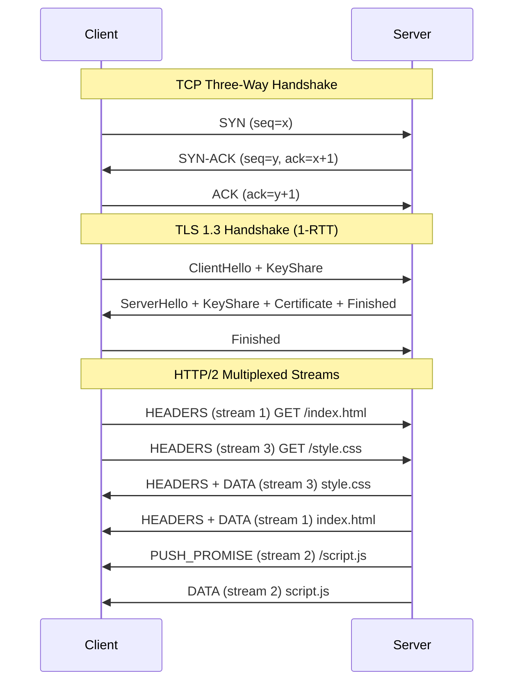
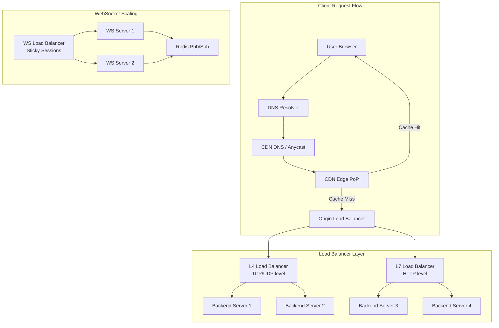

# Networking

## Quick Reference

- The TCP/IP model has four layers: Link, Internet, Transport, Application — each providing abstractions for the layer above
- TCP provides reliable, ordered byte streams using sequence numbers, acknowledgments, and retransmission; UDP provides unreliable datagrams with minimal overhead
- The three-way handshake (SYN → SYN-ACK → ACK) establishes TCP connections; four-way teardown (FIN → ACK → FIN → ACK) closes them gracefully
- HTTP/1.1 uses persistent connections and pipelining; HTTP/2 multiplexes streams over a single TCP connection; HTTP/3 uses QUIC over UDP
- DNS resolution follows a recursive/iterative hierarchy: stub resolver → recursive resolver → root → TLD → authoritative nameserver
- TLS 1.3 reduces handshake to one round trip (1-RTT) and supports zero round trip resumption (0-RTT) for repeat connections
- Load balancing algorithms: Round Robin, Weighted Round Robin, Least Connections, IP Hash, Consistent Hashing
- CDNs cache content at edge locations geographically close to users, reducing latency and origin server load
- WebSockets provide full-duplex communication over a single TCP connection, initiated via HTTP Upgrade handshake
- MTU (Maximum Transmission Unit) is typically 1500 bytes on Ethernet; exceeding it causes fragmentation or packet drops with DF bit set

## When to Use

Networking knowledge is fundamental for any engineer building distributed systems, microservices, or web applications. You need deep networking understanding when debugging production latency issues — determining whether delays come from DNS resolution, TCP connection establishment, TLS negotiation, or application processing. System design interviews heavily test networking concepts because every distributed architecture relies on network communication patterns, failure modes, and performance characteristics.

Understanding TCP behavior is critical when tuning connection pools, configuring timeouts, or diagnosing issues like connection resets, half-open connections, and head-of-line blocking. HTTP protocol knowledge matters when designing APIs, implementing caching strategies, choosing between REST and gRPC, or optimizing web application performance. DNS knowledge is essential for service discovery, failover strategies, and understanding propagation delays during infrastructure changes. Load balancing concepts apply directly when designing highly available services, implementing blue-green deployments, or choosing between L4 and L7 load balancers. CDN knowledge is necessary for optimizing content delivery, implementing cache invalidation strategies, and reducing infrastructure costs. WebSocket understanding is required for building real-time features like chat, live dashboards, collaborative editing, and streaming data feeds.

## TCP/IP Stack

The TCP/IP protocol stack is the foundational architecture of internet communication, organizing network functionality into four distinct layers that each provide specific abstractions to the layer above. This layered approach enables independent evolution of protocols at each level and allows applications to communicate without understanding the physical network infrastructure beneath them.

The Link Layer (Network Interface) handles physical transmission of frames between directly connected nodes. It encompasses Ethernet, Wi-Fi, and other physical/data-link technologies. Ethernet frames include source and destination MAC addresses, an EtherType field identifying the upper-layer protocol, the payload (up to 1500 bytes for standard Ethernet), and a Frame Check Sequence (FCS) for error detection. ARP (Address Resolution Protocol) maps IP addresses to MAC addresses within a local network segment, maintaining a cache to avoid repeated broadcasts.

The Internet Layer handles logical addressing and routing of packets across network boundaries. IP (Internet Protocol) provides best-effort, connectionless delivery of datagrams. IPv4 uses 32-bit addresses with CIDR notation for subnetting, while IPv6 uses 128-bit addresses eliminating NAT requirements. IP fragmentation splits packets exceeding the path MTU, but modern networks prefer Path MTU Discovery (PMTUD) to avoid fragmentation overhead. ICMP provides diagnostic functions (ping, traceroute) and error reporting (destination unreachable, time exceeded).

The Transport Layer provides end-to-end communication between processes. TCP (Transmission Control Protocol) delivers reliable, ordered byte streams using sequence numbers, cumulative acknowledgments, and retransmission timers. TCP flow control uses a sliding window mechanism where the receiver advertises available buffer space. TCP congestion control (Slow Start, Congestion Avoidance, Fast Retransmit, Fast Recovery) prevents network collapse by dynamically adjusting the sending rate based on detected packet loss. UDP (User Datagram Protocol) provides minimal overhead for applications that handle reliability themselves or tolerate loss, such as DNS queries, video streaming, and gaming.

The Application Layer encompasses protocols that applications use directly. HTTP, SMTP, FTP, DNS, and SSH all operate at this layer, using TCP or UDP transport as appropriate. Modern application protocols increasingly use TLS for encryption, adding a security sublayer between transport and application that provides confidentiality, integrity, and authentication.

```python
import socket

# TCP server demonstrating the socket API layers
def tcp_server(host='0.0.0.0', port=8080):
    # Create socket (Internet Layer: AF_INET for IPv4)
    server_socket = socket.socket(socket.AF_INET, socket.SOCK_STREAM)
    server_socket.setsockopt(socket.SOL_SOCKET, socket.SO_REUSEADDR, 1)
    
    # Bind to address (Transport Layer: port assignment)
    server_socket.bind((host, port))
    server_socket.listen(128)  # Backlog queue size
    
    print(f"Listening on {host}:{port}")
    
    while True:
        # Accept completes the TCP three-way handshake
        client_socket, address = server_socket.accept()
        print(f"Connection from {address}")
        
        # Application Layer: read and respond
        data = client_socket.recv(4096)
        if data:
            response = b"HTTP/1.1 200 OK\r\nContent-Length: 5\r\n\r\nHello"
            client_socket.sendall(response)
        
        client_socket.close()
```

## HTTP/HTTPS

HTTP (Hypertext Transfer Protocol) is the application-layer protocol powering the web, defining how clients request resources and servers respond. Understanding HTTP evolution from 1.0 through 3.0 is essential for optimizing web application performance and making informed architectural decisions about API design, caching, and connection management.

HTTP/1.0 created a new TCP connection for every request-response pair, incurring the overhead of three-way handshakes and slow start for each resource. HTTP/1.1 introduced persistent connections (keep-alive) allowing multiple requests over a single TCP connection, chunked transfer encoding for streaming responses, and the Host header enabling virtual hosting. However, HTTP/1.1 suffers from head-of-line blocking: responses must be delivered in request order, so a slow response blocks all subsequent responses on that connection. Browsers work around this by opening 6-8 parallel connections per origin.

HTTP/2 fundamentally redesigned the wire format using binary framing and multiplexing. Multiple logical streams share a single TCP connection, with frames interleaved and reassembled by stream ID. This eliminates application-layer head-of-line blocking and enables server push (proactively sending resources before the client requests them), header compression (HPACK), and stream prioritization. However, TCP-level head-of-line blocking persists: a single lost packet blocks all streams until retransmission completes, because TCP guarantees ordered delivery.

HTTP/3 replaces TCP with QUIC (Quick UDP Internet Connections), a transport protocol built on UDP that provides independent stream multiplexing, eliminating head-of-line blocking entirely. QUIC integrates TLS 1.3 into the transport layer, reducing connection establishment to a single round trip (or zero for resumed connections). QUIC also handles connection migration gracefully — when a mobile device switches from Wi-Fi to cellular, the connection survives because QUIC identifies connections by ID rather than IP/port tuple.

HTTPS adds TLS encryption between HTTP and TCP, providing confidentiality (encryption), integrity (MAC), and authentication (certificates). The TLS handshake negotiates cipher suites, exchanges keys, and verifies server identity via certificate chains rooted in trusted Certificate Authorities. TLS 1.3 simplified the handshake to one round trip by removing legacy cipher suites and using ephemeral Diffie-Hellman key exchange exclusively, providing forward secrecy by default.



## DNS Resolution

The Domain Name System (DNS) is the distributed hierarchical database that translates human-readable domain names into IP addresses. DNS is one of the most critical infrastructure components of the internet — virtually every network connection begins with a DNS lookup, making DNS performance and reliability directly impact application latency and availability.

DNS resolution follows a hierarchical delegation model. When a client application needs to resolve a domain name, it sends a query to its configured recursive resolver (typically provided by the ISP or a public resolver like 8.8.8.8 or 1.1.1.1). The recursive resolver checks its cache first. On a cache miss, it performs iterative queries starting at the root nameservers, which delegate to TLD (Top-Level Domain) nameservers (.com, .org, .io), which delegate to the authoritative nameservers for the specific domain. Each response includes a TTL (Time To Live) value controlling how long the answer can be cached.

DNS record types serve different purposes. A records map names to IPv4 addresses; AAAA records map to IPv6. CNAME records create aliases pointing to canonical names (but cannot coexist with other record types at the same name). MX records specify mail servers with priority values. NS records delegate authority to nameservers. TXT records store arbitrary text, commonly used for SPF, DKIM, and domain verification. SRV records provide service discovery with host, port, priority, and weight fields — the foundation for service mesh DNS-based discovery.

DNS caching occurs at multiple levels: the browser cache (typically 60 seconds), the operating system resolver cache, the recursive resolver cache, and intermediate caching proxies. TTL values control cache duration — lower TTLs enable faster failover but increase query load on authoritative servers. During DNS-based failover or migration, engineers must account for cached records that may persist beyond TTL expiration due to implementation differences across resolvers. Pre-lowering TTLs before planned changes (reducing from hours to minutes days in advance) is a standard operational practice.

DNS security concerns include cache poisoning (injecting false records into resolver caches), DNS amplification attacks (using open resolvers for DDoS), and privacy leakage (queries visible to network observers). DNSSEC adds cryptographic signatures to DNS responses, enabling verification of record authenticity. DNS over HTTPS (DoH) and DNS over TLS (DoT) encrypt queries between clients and recursive resolvers, preventing eavesdropping and manipulation by network intermediaries.

## Load Balancing Algorithms

Load balancing distributes incoming network traffic across multiple backend servers to improve availability, throughput, and response times. Effective load balancing prevents any single server from becoming a bottleneck while enabling horizontal scaling, rolling deployments, and graceful degradation during failures. The choice of algorithm significantly impacts request distribution fairness, session affinity, and cache efficiency.

Round Robin is the simplest algorithm, distributing requests sequentially across servers in a circular pattern. It works well when servers have identical capacity and requests have uniform processing cost. Weighted Round Robin extends this by assigning weights proportional to server capacity — a server with weight 3 receives three times as many requests as one with weight 1. This handles heterogeneous server fleets but still assumes uniform request cost.

Least Connections routes each new request to the server with the fewest active connections, naturally adapting to varying request processing times. Servers handling slow requests accumulate connections and receive fewer new ones, while servers completing requests quickly get more traffic. Weighted Least Connections combines connection counting with capacity weights for heterogeneous environments. This algorithm excels for long-lived connections (WebSockets, database connections) where connection count correlates with load.

IP Hash computes a hash of the client IP address to deterministically route all requests from the same client to the same server. This provides session affinity without cookies or application-layer state, useful for applications with server-local session storage. However, IP Hash distributes poorly when traffic comes through proxies or NAT (many clients sharing one IP) and causes imbalanced distribution when servers are added or removed (all hash mappings shift).

Consistent Hashing solves the redistribution problem by mapping both servers and requests onto a hash ring. When a server is added or removed, only requests that mapped to the affected segment are redistributed — approximately 1/N of total requests rather than all of them. Virtual nodes (multiple hash positions per physical server) improve distribution uniformity. Consistent hashing is the foundation for distributed caches (Memcached, Redis Cluster), CDN routing, and database sharding.

```java
// Consistent hashing implementation for load balancing
import java.util.SortedMap;
import java.util.TreeMap;
import java.security.MessageDigest;
import java.nio.charset.StandardCharsets;

public class ConsistentHashLoadBalancer {
    private final SortedMap<Long, String> ring = new TreeMap<>();
    private final int virtualNodes;
    
    public ConsistentHashLoadBalancer(int virtualNodes) {
        this.virtualNodes = virtualNodes;
    }
    
    public void addServer(String server) {
        for (int i = 0; i < virtualNodes; i++) {
            long hash = hash(server + "#" + i);
            ring.put(hash, server);
        }
    }
    
    public void removeServer(String server) {
        for (int i = 0; i < virtualNodes; i++) {
            long hash = hash(server + "#" + i);
            ring.remove(hash);
        }
    }
    
    public String getServer(String key) {
        if (ring.isEmpty()) return null;
        long hash = hash(key);
        // Find the first server clockwise from the hash position
        SortedMap<Long, String> tailMap = ring.tailMap(hash);
        Long targetHash = tailMap.isEmpty() ? ring.firstKey() : tailMap.firstKey();
        return ring.get(targetHash);
    }
    
    private long hash(String key) {
        try {
            MessageDigest md = MessageDigest.getInstance("MD5");
            byte[] digest = md.digest(key.getBytes(StandardCharsets.UTF_8));
            return ((long)(digest[0] & 0xFF) << 24) |
                   ((long)(digest[1] & 0xFF) << 16) |
                   ((long)(digest[2] & 0xFF) << 8) |
                   (digest[3] & 0xFF);
        } catch (Exception e) {
            throw new RuntimeException(e);
        }
    }
}
```

## CDNs

Content Delivery Networks (CDNs) are geographically distributed networks of proxy servers and data centers that cache and serve content from locations physically close to end users. CDNs reduce latency by minimizing the physical distance data must travel, decrease origin server load by absorbing the majority of read traffic, and improve availability by providing redundant serving capacity across multiple points of presence (PoPs).

CDN architecture consists of edge servers (PoPs) distributed globally, an origin server holding the authoritative content, and a control plane managing cache configuration, purging, and routing. When a user requests content, DNS-based or anycast routing directs them to the nearest edge server. If the edge has the content cached (cache hit), it serves directly with minimal latency. On a cache miss, the edge fetches from the origin (or a mid-tier cache), stores the response, and serves the user. Cache hit ratios above 90% are typical for static assets, meaning the origin handles less than 10% of total traffic.

Cache invalidation is the hardest problem in CDN operations. TTL-based expiration is simple but creates staleness windows. Purge APIs allow immediate invalidation of specific URLs or patterns, but purging propagates across hundreds of PoPs with variable delay. Versioned URLs (appending content hashes to filenames like `style.a3f2b1.css`) sidestep invalidation entirely — new content gets a new URL, and old cached versions naturally expire. Surrogate keys (cache tags) enable grouping related objects for batch invalidation without knowing individual URLs.

CDN edge computing extends beyond caching to execute application logic at edge locations. Cloudflare Workers, AWS Lambda@Edge, and Fastly Compute@Edge run serverless functions at PoPs, enabling request routing, A/B testing, authentication, header manipulation, and personalization without round-tripping to the origin. This reduces latency for dynamic content that varies by geography, device, or user attributes while keeping compute close to users.

CDN security features include DDoS mitigation (absorbing volumetric attacks across distributed infrastructure), Web Application Firewall (WAF) rules at the edge, bot detection, and TLS termination. Terminating TLS at the edge reduces latency (shorter handshake round trips) and offloads cryptographic processing from origin servers. CDNs also provide origin shielding — collapsing multiple edge cache misses into a single origin request to prevent thundering herd problems during cache expiration.

## WebSockets

WebSockets provide full-duplex, bidirectional communication channels over a single TCP connection, enabling real-time data exchange between clients and servers without the overhead of repeated HTTP request-response cycles. Unlike HTTP's request-response model where the client must initiate every exchange, WebSockets allow either party to send messages at any time after the connection is established, making them ideal for applications requiring low-latency, high-frequency updates.

The WebSocket protocol begins with an HTTP Upgrade handshake. The client sends a standard HTTP request with `Connection: Upgrade` and `Upgrade: websocket` headers, along with a `Sec-WebSocket-Key` for verification. The server responds with HTTP 101 Switching Protocols, confirming the upgrade. After this handshake, the TCP connection transitions from HTTP framing to WebSocket framing — lightweight frames with a 2-14 byte header containing opcode (text, binary, ping, pong, close), payload length, and optional masking key. Client-to-server frames must be masked to prevent cache poisoning attacks on intermediary proxies.

WebSocket connection lifecycle management requires careful handling of heartbeats, reconnection, and graceful shutdown. Ping/pong frames serve as application-level keepalives, detecting dead connections that TCP keepalive (typically 2+ hours) would miss. Clients should implement exponential backoff reconnection with jitter to avoid thundering herd reconnection storms after server restarts. The close handshake involves sending a close frame with a status code, waiting for the peer's close frame, then terminating the TCP connection. Status codes (1000 normal, 1001 going away, 1006 abnormal) communicate closure reasons.

Scaling WebSocket servers presents unique challenges compared to stateless HTTP. Each WebSocket connection maintains server-side state (memory for the connection object, any subscriptions or session data), limiting connections per server to tens or hundreds of thousands depending on memory. Horizontal scaling requires sticky sessions (routing reconnections to the same server) or a pub/sub backbone (Redis Pub/Sub, Kafka, NATS) to broadcast messages across server instances. Connection draining during deployments must gracefully close existing connections while directing new ones to updated servers.

WebSocket alternatives and complements include Server-Sent Events (SSE) for unidirectional server-to-client streaming over HTTP (simpler, works through HTTP proxies, supports automatic reconnection), long polling for environments where WebSockets are blocked, and gRPC streaming for service-to-service bidirectional communication with strong typing and code generation. The choice depends on communication pattern (unidirectional vs bidirectional), infrastructure constraints (proxy support, firewall rules), and protocol requirements (binary vs text, backpressure, ordering guarantees).

## Architecture and Diagrams



## Common Pitfalls

- **Ignoring TCP slow start**: New connections start with a small congestion window (typically 10 segments). Short-lived connections never reach full throughput. Use connection pooling and HTTP/2 multiplexing to amortize connection setup cost across many requests.
- **DNS TTL assumptions**: Clients and intermediate resolvers may cache DNS records beyond the stated TTL. Never assume DNS changes propagate instantly — always pre-lower TTLs before planned migrations and allow propagation time.
- **Head-of-line blocking unawareness**: HTTP/1.1 over TCP suffers from HOL blocking at both application and transport layers. HTTP/2 solves application-layer HOL but TCP-level blocking persists. Only HTTP/3 (QUIC) eliminates both.
- **WebSocket connection leaks**: Failing to implement proper heartbeat/ping-pong detection leaves dead connections consuming server resources. Always implement application-level keepalives with shorter intervals than TCP keepalive.
- **CDN cache poisoning**: Caching responses that vary by headers not included in the cache key (like cookies or authorization) can serve one user's personalized content to another. Always configure Vary headers correctly and audit cache key composition.
- **Load balancer health check gaps**: Health checks that only verify TCP connectivity miss application-level failures. Implement deep health checks that verify database connectivity, downstream dependencies, and application readiness.
- **TLS certificate expiration**: Automated certificate renewal (Let's Encrypt, ACM) prevents outages, but monitoring certificate expiration across all endpoints (including internal services) remains essential.
- **Nagle's algorithm interaction with delayed ACK**: Nagle's algorithm buffers small writes until an ACK arrives, while delayed ACK waits up to 40ms before acknowledging. Together they can add 40ms latency to small messages. Disable Nagle (TCP_NODELAY) for latency-sensitive protocols.

## Real-World Use Cases

**Microservice Communication**: Service meshes (Istio, Linkerd) implement L7 load balancing, circuit breaking, retry policies, and mutual TLS between services. Understanding TCP connection pooling, HTTP/2 multiplexing, and gRPC streaming is essential for optimizing inter-service latency. Service discovery via DNS (Kubernetes CoreDNS) or service registries (Consul) determines how services locate each other.

**Global Content Delivery**: E-commerce platforms serve product images, JavaScript bundles, and API responses through CDNs with edge computing. Cache invalidation strategies (versioned URLs for static assets, short TTLs with stale-while-revalidate for API responses) balance freshness against origin load. Multi-CDN strategies provide redundancy and performance optimization by routing to the fastest CDN per region.

**Real-Time Collaboration**: Applications like Google Docs, Figma, and Slack use WebSockets for real-time updates with operational transformation or CRDTs for conflict resolution. The networking challenge involves maintaining persistent connections across mobile networks, handling reconnection gracefully, and scaling to millions of concurrent connections using pub/sub architectures.

**DNS-Based Traffic Management**: Global server load balancing (GSLB) uses DNS to route users to the nearest healthy data center. Weighted DNS records enable gradual traffic shifting during deployments. Failover configurations automatically redirect traffic when health checks detect regional outages. GeoDNS returns different IP addresses based on the querying resolver's location.

## Interview Questions

**Q: Explain what happens when you type a URL in the browser and press Enter.**
A: The browser checks its DNS cache, then queries the OS resolver, which may query a recursive resolver that traverses the DNS hierarchy (root → TLD → authoritative) to resolve the IP. A TCP three-way handshake establishes the connection, followed by a TLS handshake for HTTPS. The browser sends an HTTP request, the server processes it and returns a response. The browser parses HTML, discovers additional resources (CSS, JS, images), and makes parallel requests for them, rendering the page progressively.

**Q: How does TCP guarantee reliable delivery?**
A: TCP uses sequence numbers to order segments, acknowledgments to confirm receipt, checksums for integrity, and retransmission timers to resend lost segments. The sliding window protocol provides flow control (receiver advertises buffer space) and congestion control algorithms (slow start, congestion avoidance) prevent network overload. Duplicate ACKs trigger fast retransmit without waiting for timeout expiration.

**Q: What is the difference between L4 and L7 load balancing?**
A: L4 load balancers operate at the transport layer, routing based on IP addresses and TCP/UDP ports without inspecting packet contents. They are faster (no payload parsing) and protocol-agnostic. L7 load balancers operate at the application layer, making routing decisions based on HTTP headers, URLs, cookies, or request body content. They enable content-based routing, SSL termination, request modification, and more sophisticated health checks, but add processing overhead.

**Q: How would you design a system to handle WebSocket connections at scale?**
A: Use sticky sessions at the load balancer to route reconnections to the same server. Implement a pub/sub backbone (Redis Pub/Sub or Kafka) so messages published on one server reach subscribers connected to other servers. Set connection limits per server based on memory capacity. Implement graceful connection draining for deployments. Use ping/pong heartbeats to detect and clean up dead connections. Consider connection-aware autoscaling based on active connection count rather than CPU.

**Q: Why might you choose HTTP/3 over HTTP/2?**
A: HTTP/3 eliminates TCP head-of-line blocking (a single lost packet in HTTP/2 blocks all multiplexed streams), provides faster connection establishment (QUIC integrates TLS, achieving 1-RTT or 0-RTT), handles network migration gracefully (connection survives IP changes), and improves performance on lossy networks (independent stream loss recovery). Choose HTTP/3 for mobile-heavy traffic, high-latency networks, or applications sensitive to tail latency.

## Production Tips

- **Connection pooling is critical**: Reuse TCP connections aggressively. Creating new connections incurs DNS lookup, TCP handshake, and TLS negotiation overhead (often 100-300ms total). Configure connection pool sizes based on expected concurrency and backend capacity, with idle timeout shorter than server-side timeout to avoid reset connections.
- **Monitor DNS resolution time separately**: DNS latency is often invisible in application metrics but can add 50-200ms to cold requests. Monitor p50/p99 DNS resolution times, cache DNS results at the application level where appropriate, and consider DNS prefetching for known downstream dependencies.
- **Set explicit timeouts at every layer**: Configure connect timeout (how long to wait for TCP handshake), read timeout (how long to wait for response data), and total request timeout independently. Without explicit timeouts, a single slow downstream can exhaust your connection pool and cascade failures.
- **Use health checks with circuit breakers**: Combine load balancer health checks (removing unhealthy servers from rotation) with client-side circuit breakers (failing fast when a downstream is degraded). This prevents cascading failures and reduces recovery time.
- **Implement retry budgets, not unlimited retries**: Retries amplify load on struggling services. Limit retries to a percentage of total requests (e.g., 20% retry budget) and use exponential backoff with jitter. Never retry non-idempotent requests without explicit idempotency keys.
- **Monitor TCP connection states**: Track TIME_WAIT accumulation (indicates high connection churn — fix with connection pooling), CLOSE_WAIT accumulation (indicates application not closing connections — likely a bug), and SYN_RECV floods (potential SYN flood attack).
- **CDN cache hit ratio is your primary CDN metric**: Below 80% cache hit ratio, investigate cache key configuration, Vary header usage, and content cacheability. Every cache miss adds origin round-trip latency and load. Use cache warming for predictable traffic patterns.

## Related Topics

- [System Design](./system-design.md) — distributed systems fundamentals, CAP theorem, and scaling strategies that build on networking concepts
- [Operating Systems](./operating-systems.md) — kernel networking stack, socket implementation, and I/O multiplexing (epoll, kqueue) that underpin application networking
- [Docker & Containerization](../infrastructure/docker-containerization.md) — container networking, bridge networks, overlay networks, and service discovery
- [Kubernetes & EKS](../infrastructure/kubernetes-eks.md) — service networking, ingress controllers, network policies, and DNS-based service discovery
- [Apache Kafka](../backend/apache-kafka.md) — distributed messaging that relies on TCP connections, partitioning (consistent hashing), and replication protocols
