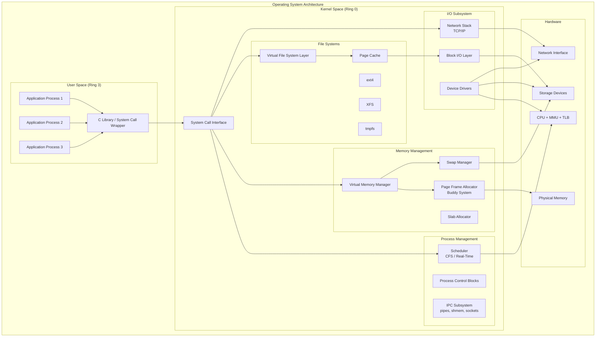
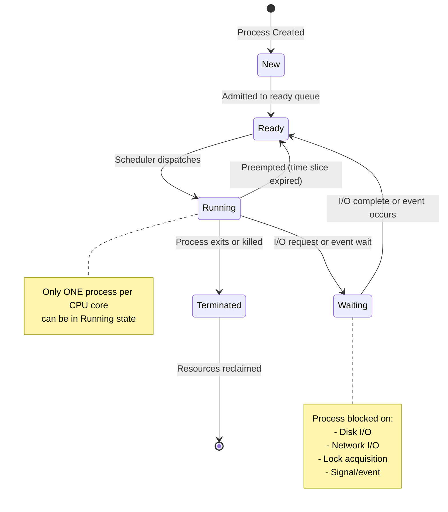
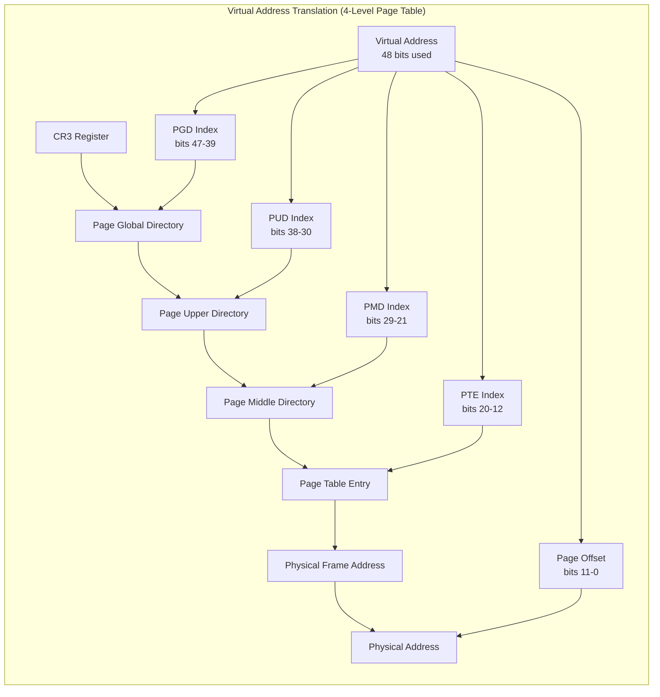

# Operating Systems

## Quick Reference

- An operating system manages hardware resources and provides abstractions (processes, files, memory) for user programs
- Process states: New → Ready → Running → Waiting → Terminated; the scheduler decides which ready process runs next
- Virtual memory maps process address spaces to physical frames using page tables, enabling isolation and overcommitment
- File systems organize persistent data into hierarchical namespaces with metadata (inodes) and data blocks
- Concurrency primitives (mutexes, semaphores, condition variables) coordinate access to shared resources
- IPC mechanisms: pipes, message queues, shared memory, sockets, signals — each with different performance and complexity tradeoffs
- Context switch cost includes saving/restoring registers, TLB flush, and cache pollution — typically 1-10 microseconds
- The kernel runs in privileged mode (ring 0) while user processes run in restricted mode (ring 3) on x86 architectures
- Deadlock requires four conditions simultaneously: mutual exclusion, hold-and-wait, no preemption, circular wait

## When to Use

Understanding operating systems is essential for any engineer working on performance-sensitive applications, distributed systems, or infrastructure software. OS knowledge directly applies when diagnosing production issues like memory leaks, CPU contention, I/O bottlenecks, and deadlocks. System design interviews frequently test OS fundamentals because they underpin every layer of the software stack. You need OS knowledge when tuning JVM garbage collection (which interacts with virtual memory), configuring container resource limits (which use cgroups and namespaces), designing concurrent data structures, choosing IPC mechanisms for microservice communication, or understanding why your database performs differently under various workloads. Engineers working with Kubernetes, Docker, or cloud infrastructure benefit from understanding how the kernel schedules containers, manages memory pressure, and handles network I/O. OS concepts also inform architectural decisions: choosing between threads and processes, selecting synchronization strategies, designing file storage layouts, and understanding the performance implications of system calls versus library calls.

## Process Scheduling

Process scheduling determines which process gets CPU time and for how long. The scheduler is one of the most performance-critical components of the kernel because it directly affects application latency, throughput, and fairness. Modern operating systems use preemptive multitasking, meaning the kernel can interrupt a running process to give CPU time to another process based on priority, time slice expiration, or I/O events.

The Completely Fair Scheduler (CFS) in Linux uses a red-black tree to track virtual runtime for each process. Processes that have consumed less CPU time relative to their weight are scheduled first, ensuring proportional fairness. CFS replaced the O(1) scheduler and provides better interactive responsiveness by avoiding fixed time slices in favor of dynamic scheduling periods. The scheduling period is divided proportionally among all runnable tasks based on their nice values (priority weights ranging from -20 to +19).

Real-time scheduling policies (SCHED_FIFO and SCHED_RR) provide deterministic scheduling for latency-sensitive workloads. SCHED_FIFO runs a process until it voluntarily yields or a higher-priority real-time task becomes runnable. SCHED_RR adds time-slicing among equal-priority real-time tasks. These policies are used in audio processing, industrial control systems, and high-frequency trading where microsecond-level latency predictability matters.

Context switching involves saving the current process state (registers, program counter, stack pointer) to its Process Control Block (PCB), updating scheduling data structures, loading the next process state, and flushing or tagging TLB entries. The direct cost is typically 1-5 microseconds, but the indirect cost from cache and TLB pollution can be significantly higher, especially for memory-intensive workloads. Reducing unnecessary context switches through proper thread pool sizing and I/O multiplexing is a key performance optimization.

## Memory Management

Memory management handles allocation, deallocation, and protection of physical memory among competing processes. The kernel maintains data structures tracking which physical frames are free, which are allocated to processes, and which are used for kernel buffers and caches. Efficient memory management prevents fragmentation, enables sharing, and enforces isolation between processes.

Physical memory is divided into fixed-size frames (typically 4KB on x86), and the kernel uses buddy allocation to manage free frames. The buddy system splits and coalesces power-of-two-sized blocks to satisfy allocation requests while minimizing external fragmentation. For smaller allocations within the kernel, slab allocation provides object caches that pre-allocate and reuse fixed-size structures (like task_struct, inode, dentry), eliminating per-object allocation overhead and internal fragmentation.

User-space memory allocation (malloc/free) is handled by the C library allocator (glibc's ptmalloc2, jemalloc, tcmalloc) which requests large chunks from the kernel via brk() or mmap() and subdivides them for application use. These allocators use thread-local caches, size-class bins, and arena-based strategies to reduce lock contention and fragmentation in multithreaded applications. Understanding allocator behavior is critical for diagnosing memory fragmentation in long-running services.

The kernel also manages the page cache, which buffers disk I/O in unused physical memory. File reads are served from the page cache when possible, and writes are buffered before being flushed to disk. The page cache dynamically grows and shrinks based on memory pressure, using LRU-like eviction policies. On Linux, the `free` command shows cached memory separately because it is reclaimable under pressure, not truly consumed.

## Virtual Memory

Virtual memory provides each process with the illusion of a large, contiguous, private address space regardless of physical memory size or layout. The Memory Management Unit (MMU) translates virtual addresses to physical addresses using page tables, enabling memory isolation between processes, demand paging, copy-on-write optimization, and memory-mapped files.

Page tables are hierarchical structures (4 levels on x86-64: PGD, PUD, PMD, PTE) that map virtual page numbers to physical frame numbers. Each page table entry contains the physical frame address plus permission bits (read, write, execute, user/kernel, present). A page fault occurs when a process accesses a virtual address whose page table entry is marked not-present, triggering the kernel to load the page from disk (demand paging), allocate a new zero page, or signal a segmentation fault for invalid accesses.

The Translation Lookaside Buffer (TLB) caches recent virtual-to-physical translations to avoid the multi-level page table walk on every memory access. TLB misses are expensive (10-100 cycles for a page table walk versus 1 cycle for a TLB hit), making TLB efficiency critical for performance. Huge pages (2MB or 1GB on x86-64) reduce TLB pressure by covering more address space per entry, which is why databases and JVMs often configure huge page support for large heap allocations.

Copy-on-write (COW) is a key optimization where forked processes initially share the same physical pages. Pages are only duplicated when one process attempts to write, at which point the kernel allocates a new frame, copies the content, and updates the page table. This makes fork() nearly instantaneous regardless of process memory size and is the foundation for efficient process creation in Unix systems.

Swap space extends physical memory to disk, allowing the system to handle memory overcommitment. When physical memory is exhausted, the kernel's page replacement algorithm (approximated LRU using accessed/dirty bits) selects victim pages to write to swap. Excessive swapping (thrashing) devastates performance because disk I/O is orders of magnitude slower than memory access. Production systems typically configure swappiness low or disable swap entirely, relying on OOM killing to handle memory exhaustion.

## File Systems

File systems organize persistent data on storage devices into a hierarchical namespace of files and directories, providing abstractions for creating, reading, writing, and deleting data. The file system translates logical operations (open, read, write) into physical block I/O operations on the underlying storage device, managing space allocation, metadata, caching, and crash consistency.

The inode is the fundamental metadata structure in Unix file systems. Each inode stores file attributes (size, permissions, timestamps, owner) and pointers to data blocks. Directory entries map human-readable names to inode numbers, enabling the hierarchical namespace. Hard links create multiple directory entries pointing to the same inode, while symbolic links store a path string that is resolved at access time. This separation of names from metadata enables atomic rename operations and efficient file sharing.

Journaling file systems (ext4, XFS, NTFS) maintain a write-ahead log of metadata changes to ensure crash consistency. Before modifying file system structures, the intended changes are written to the journal. If a crash occurs mid-operation, the journal is replayed during recovery to complete or roll back partial updates. Full data journaling (journaling both metadata and file data) provides stronger consistency guarantees but reduces write performance due to double-writing. Most production systems use metadata-only journaling as a compromise.

Copy-on-write file systems (ZFS, Btrfs) never overwrite existing data blocks. Instead, modifications are written to new locations and the metadata tree is updated atomically to point to the new data. This approach provides built-in snapshots (old data is preserved until explicitly freed), checksumming for data integrity verification, and simplified crash recovery. ZFS combines the file system and volume manager, providing features like RAID-Z, deduplication, compression, and send/receive for replication.

The Virtual File System (VFS) layer in Linux provides a uniform interface for all file system implementations. Applications use the same system calls (open, read, write, stat) regardless of whether the underlying storage is ext4, NFS, procfs, or tmpfs. VFS defines abstract operations (inode_operations, file_operations, super_operations) that each file system driver implements, enabling transparent access to diverse storage backends.

## Concurrency Primitives

Concurrency primitives are synchronization mechanisms that coordinate access to shared resources among multiple threads or processes executing simultaneously. Without proper synchronization, concurrent access to shared mutable state leads to race conditions, data corruption, and non-deterministic behavior that is extremely difficult to reproduce and debug.

Mutexes (mutual exclusion locks) provide exclusive access to a critical section. Only one thread can hold the mutex at a time; other threads attempting to acquire it are blocked until the holder releases it. Mutexes should protect the minimum necessary code to reduce contention. Recursive mutexes allow the same thread to acquire the lock multiple times without deadlocking, but they often indicate design problems and should be avoided. Read-write locks (rwlock) allow multiple concurrent readers but exclusive writers, optimizing for read-heavy workloads.

Semaphores generalize mutexes by maintaining a counter that allows up to N concurrent accesses. A counting semaphore initialized to N permits N threads to enter the critical section simultaneously, useful for resource pools (database connections, thread pools). Binary semaphores (initialized to 1) behave like mutexes but lack ownership semantics, meaning any thread can signal (release) them regardless of which thread waited (acquired). This makes semaphores suitable for signaling between threads but prone to misuse.

Condition variables enable threads to wait for a specific condition to become true without busy-waiting. A thread acquires a mutex, checks the condition, and if false, atomically releases the mutex and sleeps on the condition variable. When another thread changes the shared state, it signals the condition variable to wake one (signal) or all (broadcast) waiting threads. The awakened thread re-acquires the mutex and re-checks the condition (spurious wakeups require loop-based checking). This pattern is the foundation for producer-consumer queues, barriers, and other coordination structures.

Lock-free and wait-free data structures use atomic operations (compare-and-swap, fetch-and-add) instead of locks to achieve thread safety. Lock-free algorithms guarantee system-wide progress (at least one thread makes progress), while wait-free algorithms guarantee per-thread progress (every thread completes in bounded steps). These approaches eliminate deadlock risk and reduce latency variance but are significantly more complex to implement correctly. Common lock-free structures include queues (Michael-Scott queue), stacks (Treiber stack), and hash maps.

## Inter-Process Communication

Inter-process communication (IPC) enables separate processes to exchange data and coordinate actions. Unlike threads that share an address space, processes have isolated memory, so explicit mechanisms are needed for communication. The choice of IPC mechanism depends on data volume, latency requirements, whether processes are on the same host, and the communication pattern (unidirectional, bidirectional, one-to-many).

Pipes provide a unidirectional byte stream between related processes (parent-child). Anonymous pipes are created with the pipe() system call and are the mechanism behind shell pipelines (`cmd1 | cmd2`). Named pipes (FIFOs) exist in the filesystem namespace and allow communication between unrelated processes. Pipes are simple and efficient for streaming data but limited to unidirectional flow and same-host communication. They buffer data in kernel memory (typically 64KB on Linux) and block writers when the buffer is full.

Shared memory is the fastest IPC mechanism because data is exchanged through memory-mapped regions accessible to multiple processes without kernel involvement for each transfer. Processes use mmap() with MAP_SHARED or POSIX shared memory (shm_open) to establish shared regions. However, shared memory requires explicit synchronization (semaphores, futexes) to prevent race conditions, making it more complex to use correctly. It is ideal for high-throughput, low-latency scenarios like database buffer pools and multimedia processing.

Message queues (POSIX mq_send/mq_receive or System V msgget/msgsnd/msgrcv) provide structured message passing with priority ordering and size limits. Messages are copied between user space and kernel space, adding overhead compared to shared memory but providing built-in synchronization and message boundaries. Message queues decouple sender and receiver timing, enabling asynchronous communication patterns.

Unix domain sockets provide bidirectional, connection-oriented or datagram-based communication between processes on the same host. They use the socket API (socket, bind, listen, accept, connect) with the AF_UNIX address family, making them familiar to network programmers. Unix sockets are faster than TCP loopback because they bypass the network stack (no checksumming, no routing, no TCP state machine). They also support passing file descriptors between processes (SCM_RIGHTS), enabling sophisticated privilege separation patterns.

Signals are asynchronous notifications sent to a process to indicate events (SIGTERM for termination, SIGCHLD for child exit, SIGUSR1/SIGUSR2 for application-defined events). Signal handlers execute asynchronously in the context of the receiving process, interrupting normal execution. Because handlers run asynchronously, only async-signal-safe functions should be called within them. Signals carry minimal data (just the signal number and optional siginfo) and are primarily used for control flow rather than data transfer.

## Code Examples

### Thread-Safe Producer-Consumer Queue with Condition Variables

```java
import java.util.LinkedList;
import java.util.Queue;
import java.util.concurrent.locks.Condition;
import java.util.concurrent.locks.ReentrantLock;

public class BoundedBlockingQueue<T> {
    private final Queue<T> queue;
    private final int capacity;
    private final ReentrantLock lock;
    private final Condition notFull;
    private final Condition notEmpty;

    public BoundedBlockingQueue(int capacity) {
        this.capacity = capacity;
        this.queue = new LinkedList<>();
        this.lock = new ReentrantLock();
        this.notFull = lock.newCondition();
        this.notEmpty = lock.newCondition();
    }

    public void put(T item) throws InterruptedException {
        lock.lock();
        try {
            // Wait while queue is full (loop handles spurious wakeups)
            while (queue.size() == capacity) {
                notFull.await();
            }
            queue.offer(item);
            notEmpty.signal(); // Wake one waiting consumer
        } finally {
            lock.unlock();
        }
    }

    public T take() throws InterruptedException {
        lock.lock();
        try {
            // Wait while queue is empty
            while (queue.isEmpty()) {
                notEmpty.await();
            }
            T item = queue.poll();
            notFull.signal(); // Wake one waiting producer
            return item;
        } finally {
            lock.unlock();
        }
    }

    public int size() {
        lock.lock();
        try {
            return queue.size();
        } finally {
            lock.unlock();
        }
    }
}
```

### Process Scheduling Simulation with Priority Queue

```python
import heapq
from dataclasses import dataclass, field
from enum import Enum
from typing import Optional

class ProcessState(Enum):
    READY = "ready"
    RUNNING = "running"
    WAITING = "waiting"
    TERMINATED = "terminated"

@dataclass(order=True)
class Process:
    priority: int
    pid: int = field(compare=False)
    name: str = field(compare=False)
    burst_time: int = field(compare=False)
    remaining_time: int = field(compare=False)
    state: ProcessState = field(default=ProcessState.READY, compare=False)
    wait_time: int = field(default=0, compare=False)

class PriorityScheduler:
    """Preemptive priority scheduler with aging to prevent starvation."""

    def __init__(self, time_quantum: int = 10, aging_threshold: int = 50):
        self.ready_queue: list[Process] = []
        self.current: Optional[Process] = None
        self.time_quantum = time_quantum
        self.aging_threshold = aging_threshold
        self.clock = 0
        self.completed: list[Process] = []

    def add_process(self, process: Process):
        heapq.heappush(self.ready_queue, process)

    def tick(self):
        """Advance one time unit."""
        self.clock += 1

        # Age waiting processes to prevent starvation
        for proc in self.ready_queue:
            proc.wait_time += 1
            if proc.wait_time >= self.aging_threshold:
                proc.priority = max(0, proc.priority - 1)
                proc.wait_time = 0

        if self.current:
            self.current.remaining_time -= 1
            if self.current.remaining_time <= 0:
                self.current.state = ProcessState.TERMINATED
                self.completed.append(self.current)
                self.current = None

        # Check for preemption: higher priority process available
        if self.ready_queue:
            if self.current is None or self.ready_queue[0].priority < self.current.priority:
                if self.current and self.current.state != ProcessState.TERMINATED:
                    self.current.state = ProcessState.READY
                    heapq.heappush(self.ready_queue, self.current)
                self.current = heapq.heappop(self.ready_queue)
                self.current.state = ProcessState.RUNNING
                self.current.wait_time = 0

    def run_until_complete(self):
        while self.current or self.ready_queue:
            self.tick()
        return self.completed

# Usage
scheduler = PriorityScheduler(aging_threshold=30)
scheduler.add_process(Process(priority=3, pid=1, name="background-job", burst_time=100, remaining_time=100))
scheduler.add_process(Process(priority=1, pid=2, name="user-request", burst_time=20, remaining_time=20))
scheduler.add_process(Process(priority=2, pid=3, name="batch-process", burst_time=50, remaining_time=50))

completed = scheduler.run_until_complete()
for proc in completed:
    print(f"PID {proc.pid} ({proc.name}) completed at time {scheduler.clock}")
```

### Virtual Memory Page Table Lookup

```c
#include <stdio.h>
#include <stdlib.h>
#include <stdint.h>

#define PAGE_SIZE 4096
#define PAGE_OFFSET_BITS 12
#define PTE_PRESENT  (1UL << 0)
#define PTE_WRITABLE (1UL << 1)
#define PTE_USER     (1UL << 2)
#define PTE_ACCESSED (1UL << 5)
#define PTE_DIRTY    (1UL << 6)

typedef struct {
    uint64_t entries[512];  // 512 entries per page table level
} PageTable;

typedef struct {
    PageTable *pgd;  // Page Global Directory (top level)
    uint64_t total_pages_allocated;
    uint64_t page_faults;
} AddressSpace;

/* Extract page table indices from a virtual address (4-level paging) */
static inline uint64_t pgd_index(uint64_t vaddr) { return (vaddr >> 39) & 0x1FF; }
static inline uint64_t pud_index(uint64_t vaddr) { return (vaddr >> 30) & 0x1FF; }
static inline uint64_t pmd_index(uint64_t vaddr) { return (vaddr >> 21) & 0x1FF; }
static inline uint64_t pte_index(uint64_t vaddr) { return (vaddr >> 12) & 0x1FF; }
static inline uint64_t page_offset(uint64_t vaddr) { return vaddr & 0xFFF; }

/* Simulate a page table walk to translate virtual to physical address */
uint64_t translate_address(AddressSpace *as, uint64_t virtual_addr) {
    uint64_t pgd_entry = as->pgd->entries[pgd_index(virtual_addr)];
    if (!(pgd_entry & PTE_PRESENT)) {
        as->page_faults++;
        printf("Page fault at PGD level for address 0x%lx\n", virtual_addr);
        return 0;  // Would trigger page fault handler in real kernel
    }

    PageTable *pud = (PageTable *)(pgd_entry & ~0xFFF);
    uint64_t pud_entry = pud->entries[pud_index(virtual_addr)];
    if (!(pud_entry & PTE_PRESENT)) {
        as->page_faults++;
        printf("Page fault at PUD level for address 0x%lx\n", virtual_addr);
        return 0;
    }

    PageTable *pmd = (PageTable *)(pud_entry & ~0xFFF);
    uint64_t pmd_entry = pmd->entries[pmd_index(virtual_addr)];
    if (!(pmd_entry & PTE_PRESENT)) {
        as->page_faults++;
        printf("Page fault at PMD level for address 0x%lx\n", virtual_addr);
        return 0;
    }

    PageTable *pte = (PageTable *)(pmd_entry & ~0xFFF);
    uint64_t pte_entry = pte->entries[pte_index(virtual_addr)];
    if (!(pte_entry & PTE_PRESENT)) {
        as->page_faults++;
        printf("Page fault at PTE level for address 0x%lx\n", virtual_addr);
        return 0;
    }

    /* Mark page as accessed */
    pte->entries[pte_index(virtual_addr)] |= PTE_ACCESSED;

    uint64_t physical_frame = pte_entry & ~0xFFF;
    uint64_t physical_addr = physical_frame | page_offset(virtual_addr);
    return physical_addr;
}
```

## Architecture and Diagrams







## Common Pitfalls

1. **Deadlock from inconsistent lock ordering**: When multiple threads acquire multiple locks in different orders, circular wait can occur. Always establish a global lock ordering and acquire locks in that order. Use lock hierarchies or try-lock with backoff to break potential cycles. Tools like ThreadSanitizer and lockdep (Linux kernel) can detect ordering violations at runtime.

2. **Priority inversion without priority inheritance**: A high-priority thread blocked waiting for a lock held by a low-priority thread can be starved if medium-priority threads preempt the lock holder. Priority inheritance protocols temporarily boost the lock holder's priority to the highest waiter's priority. This famously caused issues on the Mars Pathfinder mission until the mutex was reconfigured with priority inheritance.

3. **Thrashing from memory overcommitment**: When the working set of all processes exceeds physical memory, the system spends more time swapping pages than executing useful work. Monitor page fault rates and resident set sizes. Configure memory limits per process (cgroups in containers), use memory-mapped I/O judiciously, and consider disabling swap in favor of OOM killing for latency-sensitive services.

4. **Ignoring cache effects in concurrent code**: False sharing occurs when threads modify different variables that happen to reside on the same cache line (typically 64 bytes), causing constant cache invalidation traffic between cores. Pad shared structures to cache line boundaries using `alignas(64)` or `@Contended` annotations. Profile with hardware performance counters (perf stat) to detect excessive cache coherency traffic.

5. **Signal handler reentrancy bugs**: Signal handlers interrupt normal execution at arbitrary points. Calling non-async-signal-safe functions (malloc, printf, mutex operations) from signal handlers causes undefined behavior including deadlocks and corruption. Use only async-signal-safe functions in handlers, or set a flag and handle the signal in the main loop.

6. **File descriptor leaks in forked processes**: After fork(), the child inherits all open file descriptors. If the child exec()s another program without closing unnecessary descriptors, those resources remain held. Use close-on-exec (O_CLOEXEC) flag when opening files, or explicitly close inherited descriptors before exec. Leaked descriptors can exhaust system limits and cause subtle resource contention.

## Real-World Use Cases

- **Container resource isolation**: Docker and Kubernetes use Linux namespaces (PID, network, mount, user) for process isolation and cgroups for resource limits (CPU shares, memory limits, I/O bandwidth). Understanding these OS primitives is essential for debugging container performance issues, configuring resource requests/limits, and understanding why containers behave differently from bare-metal processes.

- **Database buffer pool management**: Databases like PostgreSQL and MySQL manage their own buffer pools using shared memory (mmap or shmget), implementing custom page replacement algorithms optimized for database access patterns (clock sweep, LRU-2). They use direct I/O (O_DIRECT) to bypass the OS page cache and avoid double-buffering, and use fsync/fdatasync for durability guarantees.

- **JVM garbage collection and OS interaction**: The JVM's garbage collector interacts heavily with the OS virtual memory system. Large heaps benefit from huge pages (reducing TLB misses), GC pauses can trigger page faults if pages were swapped out, and the G1/ZGC collectors use memory mapping tricks for concurrent compaction. Understanding these interactions is critical for tuning JVM performance in production.

- **High-frequency trading systems**: HFT systems use real-time scheduling (SCHED_FIFO), CPU pinning (taskset/cpuset), huge pages, kernel bypass networking (DPDK, io_uring), and lock-free data structures to achieve sub-microsecond latencies. They disable features like NUMA balancing, transparent huge pages, and CPU frequency scaling that introduce latency jitter.

## Interview Questions

**Q: Explain the difference between a process and a thread. When would you choose one over the other?**
A: A process has its own address space, file descriptors, and signal handlers, providing strong isolation but expensive creation and communication. Threads share the process address space and resources, enabling fast communication through shared memory but requiring explicit synchronization. Choose processes for isolation (security boundaries, fault isolation) and threads for performance (shared state, low-overhead parallelism). Modern systems often combine both: multiple processes for fault isolation with multiple threads per process for concurrency.

**Q: What causes a deadlock and how do you prevent it?**
A: Deadlock requires four simultaneous conditions: mutual exclusion (resources are non-sharable), hold-and-wait (processes hold resources while waiting for others), no preemption (resources cannot be forcibly taken), and circular wait (a cycle exists in the wait graph). Prevention breaks one condition: lock ordering eliminates circular wait, try-lock with timeout breaks hold-and-wait, and lock-free algorithms eliminate mutual exclusion. Detection uses wait-for graphs with periodic cycle detection and victim selection for recovery.

**Q: How does virtual memory provide process isolation?**
A: Each process has its own page table mapping virtual addresses to physical frames. The MMU enforces these mappings in hardware, so a process cannot access physical memory not mapped in its page table. The kernel sets permission bits (user/supervisor, read/write/execute) on each page table entry, preventing user processes from accessing kernel memory. Context switches update the page table base register (CR3 on x86), completely changing the address space view.

**Q: Describe the page replacement problem and common algorithms.**
A: When physical memory is full and a new page must be loaded, the OS must choose a victim page to evict. Optimal (Belady's) evicts the page used furthest in the future but requires future knowledge. LRU evicts the least recently used page but is expensive to implement exactly. Clock (second-chance) approximates LRU using a circular buffer and reference bits, clearing the bit on first pass and evicting on second pass if still unset. Linux uses a two-list approach (active/inactive) with aging to approximate LRU efficiently.

**Q: What is the difference between user-level threads and kernel-level threads?**
A: User-level threads are managed entirely in user space by a threading library without kernel awareness. They have fast context switches (no system call) but cannot exploit multiple CPUs and block the entire process on blocking system calls. Kernel-level threads are managed by the OS scheduler, can run on multiple CPUs, and handle blocking calls independently, but have higher context switch overhead. Modern systems use kernel threads (pthreads on Linux map 1:1 to kernel threads), while languages like Go use M:N threading (many goroutines multiplexed onto fewer kernel threads).

## Production Tips

- **Monitor context switch rates**: High involuntary context switch rates (visible in `vmstat` cs column or `/proc/pid/status` nonvoluntary_ctxt_switches) indicate CPU contention. If your service has more runnable threads than available cores, threads compete for CPU time, increasing tail latency. Size thread pools to match available cores for CPU-bound work, and use I/O multiplexing (epoll, io_uring) instead of thread-per-connection for I/O-bound work.

- **Configure huge pages for large heaps**: Applications with large memory footprints (JVM heaps, database buffer pools, in-memory caches) benefit significantly from huge pages (2MB instead of 4KB). This reduces TLB misses by 512x per entry, which matters for random-access workloads. On Linux, configure transparent huge pages (THP) or explicit hugetlbfs. For JVMs, use `-XX:+UseTransparentHugePages` or `-XX:+UseLargePages` with pre-allocated huge pages.

- **Use cgroups v2 for resource isolation**: In containerized environments, configure memory limits to prevent OOM kills from affecting other containers. Set CPU limits to prevent noisy neighbors. Monitor cgroup memory.stat for page cache usage versus anonymous memory. Set memory.high (soft limit with throttling) below memory.max (hard limit with OOM kill) to provide backpressure before hard failures.

- **Tune file descriptor limits**: Production services handling many concurrent connections need raised file descriptor limits. The default 1024 is insufficient for servers handling thousands of connections. Set both soft and hard limits in `/etc/security/limits.conf` and the systemd service unit. Monitor open file descriptors per process via `/proc/pid/fd` count and alert before approaching limits.

- **Profile with perf and eBPF**: Use `perf stat` for hardware counter analysis (cache misses, branch mispredictions, TLB misses), `perf record` for CPU profiling with call graphs, and eBPF tools (bpftrace, BCC) for dynamic tracing of kernel and user-space functions without recompilation. These tools reveal whether bottlenecks are CPU-bound, memory-bound, or I/O-bound, guiding optimization efforts.

## Related Topics

- [System Design](./system-design.md) - Distributed systems fundamentals build on OS concepts like consistency, concurrency, and resource management
- [Networking](./networking.md) - The OS network stack (TCP/IP, sockets, epoll) is the foundation for all networked applications
- [Docker & Containerization](../infrastructure/docker-containerization.md) - Containers use OS primitives (namespaces, cgroups) for process isolation and resource control
