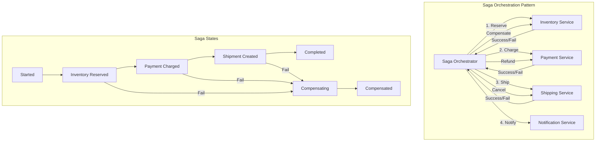
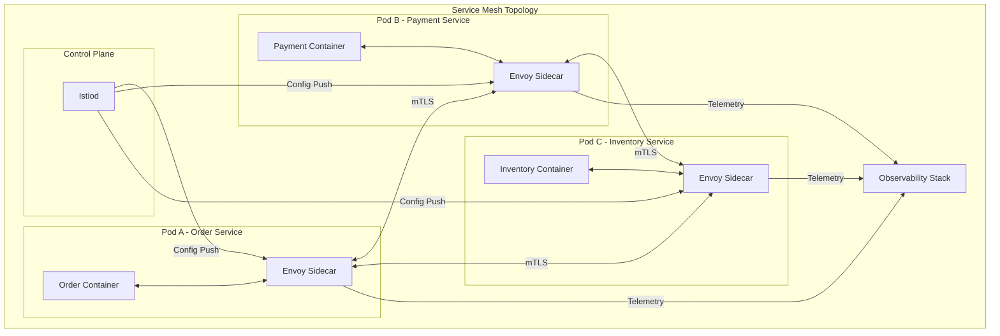
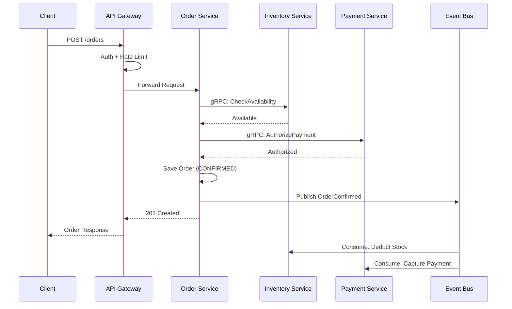

# Microservices Patterns

## Quick Reference

- **Service decomposition** follows two primary strategies: by business capability (aligned to organizational structure) or by subdomain (aligned to DDD bounded contexts)
- Communication patterns divide into synchronous (REST, gRPC) for queries requiring immediate responses and asynchronous (messaging, events) for commands that tolerate eventual consistency
- The **API Gateway** pattern provides a single entry point that handles routing, authentication, rate limiting, and protocol translation — never expose internal services directly
- **Circuit breaker** (Resilience4j, Hystrix) prevents cascade failures by failing fast when a downstream service is unhealthy — states: Closed → Open → Half-Open
- **Saga pattern** manages distributed transactions: orchestration (central coordinator) for complex workflows, choreography (event-driven) for simple flows
- **CQRS** separates read and write models — write to an event store, project into read-optimized views (Elasticsearch, Redis, materialized views)
- **Service mesh** (Istio, Linkerd) handles cross-cutting concerns (mTLS, retries, observability) at the infrastructure layer without application code changes
- **Database per service** ensures loose coupling — each service owns its data store, communicates state changes via events
- **Distributed tracing** (OpenTelemetry, Jaeger) propagates correlation IDs across service boundaries to reconstruct request flows
- **Strangler fig** migration incrementally replaces monolith functionality by routing traffic to new services while the old system remains operational

## When to Use

Microservices architecture is appropriate when your organization has grown beyond what a monolith can sustain — typically when multiple teams need to deploy independently, when different components have vastly different scaling requirements, or when technology diversity is needed (ML services in Python, real-time services in Go, CRUD services in Java). Adopt microservices when your deployment frequency is bottlenecked by monolith coupling, when a single component's failure brings down the entire system, or when you need to scale specific business capabilities independently (payment processing scales differently than user profiles). Do not adopt microservices for small teams (fewer than 20 engineers), greenfield projects without clear domain boundaries, or systems where strong consistency across all operations is required. The operational overhead of distributed systems — service discovery, distributed tracing, eventual consistency, network partitions — is only justified when the organizational and scaling benefits outweigh the complexity cost. Start with a well-structured monolith and extract services when pain points emerge, not preemptively.

## Code Examples

### API Gateway with Spring Cloud Gateway

```java
// Gateway configuration with route predicates and filters
@Configuration
public class GatewayConfig {

    @Bean
    public RouteLocator customRouteLocator(RouteLocatorBuilder builder) {
        return builder.routes()
            .route("order-service", r -> r
                .path("/api/v1/orders/**")
                .filters(f -> f
                    .stripPrefix(2)
                    .addRequestHeader("X-Service-Source", "gateway")
                    .circuitBreaker(config -> config
                        .setName("orderServiceCB")
                        .setFallbackUri("forward:/fallback/orders"))
                    .retry(config -> config
                        .setRetries(3)
                        .setBackoff(Duration.ofMillis(100), Duration.ofMillis(1000), 2, true))
                    .requestRateLimiter(config -> config
                        .setRateLimiter(redisRateLimiter())
                        .setKeyResolver(userKeyResolver())))
                .uri("lb://order-service"))
            .route("inventory-service", r -> r
                .path("/api/v1/inventory/**")
                .filters(f -> f
                    .stripPrefix(2)
                    .circuitBreaker(config -> config
                        .setName("inventoryServiceCB")
                        .setFallbackUri("forward:/fallback/inventory")))
                .uri("lb://inventory-service"))
            .build();
    }

    @Bean
    public RedisRateLimiter redisRateLimiter() {
        // 10 requests per second, burst of 20
        return new RedisRateLimiter(10, 20);
    }

    @Bean
    public KeyResolver userKeyResolver() {
        return exchange -> Mono.just(
            exchange.getRequest().getHeaders()
                .getFirst("X-User-Id") != null
                ? exchange.getRequest().getHeaders().getFirst("X-User-Id")
                : exchange.getRequest().getRemoteAddress().getAddress().getHostAddress()
        );
    }
}
```

### Circuit Breaker with Resilience4j

```java
// Circuit breaker configuration
@Configuration
public class ResilienceConfig {

    @Bean
    public CircuitBreakerConfig circuitBreakerConfig() {
        return CircuitBreakerConfig.custom()
            .failureRateThreshold(50)           // Open when 50% of calls fail
            .slowCallRateThreshold(80)          // Open when 80% of calls are slow
            .slowCallDurationThreshold(Duration.ofSeconds(3))
            .waitDurationInOpenState(Duration.ofSeconds(30))
            .permittedNumberOfCallsInHalfOpenState(5)
            .slidingWindowType(SlidingWindowType.COUNT_BASED)
            .slidingWindowSize(10)
            .minimumNumberOfCalls(5)
            .build();
    }

    @Bean
    public RetryConfig retryConfig() {
        return RetryConfig.custom()
            .maxAttempts(3)
            .waitDuration(Duration.ofMillis(500))
            .exponentialBackoff(2, Duration.ofSeconds(5))
            .retryOnException(e -> e instanceof ServiceUnavailableException)
            .ignoreExceptions(BusinessValidationException.class)
            .build();
    }
}

// Service with circuit breaker and retry
@Service
public class OrderService {

    private final CircuitBreaker circuitBreaker;
    private final Retry retry;
    private final InventoryClient inventoryClient;

    public OrderService(CircuitBreakerRegistry cbRegistry,
                        RetryRegistry retryRegistry,
                        InventoryClient inventoryClient) {
        this.circuitBreaker = cbRegistry.circuitBreaker("inventory");
        this.retry = retryRegistry.retry("inventory");
        this.inventoryClient = inventoryClient;
    }

    public OrderResponse createOrder(OrderRequest request) {
        // Compose resilience patterns: retry wraps circuit breaker
        Supplier<InventoryResponse> decoratedSupplier = Decorators
            .ofSupplier(() -> inventoryClient.checkAvailability(request.getItems()))
            .withCircuitBreaker(circuitBreaker)
            .withRetry(retry)
            .withFallback(List.of(
                CallNotPermittedException.class,
                ServiceUnavailableException.class
            ), e -> InventoryResponse.degraded(request.getItems()))
            .decorate();

        InventoryResponse inventory = decoratedSupplier.get();

        if (inventory.isDegraded()) {
            // Accept order provisionally, verify inventory async
            return OrderResponse.provisional(request, "Inventory check pending");
        }

        return processOrder(request, inventory);
    }
}
```

### Saga Pattern — Orchestration

```java
// Saga orchestrator for order processing
@Service
public class OrderSagaOrchestrator {

    private final OrderRepository orderRepository;
    private final PaymentService paymentService;
    private final InventoryService inventoryService;
    private final ShippingService shippingService;
    private final NotificationService notificationService;

    @Transactional
    public SagaResult executeOrderSaga(OrderRequest request) {
        SagaContext context = SagaContext.create(request);

        try {
            // Step 1: Reserve inventory
            InventoryReservation reservation = inventoryService.reserve(request.getItems());
            context.setReservationId(reservation.getId());

            // Step 2: Process payment
            PaymentResult payment = paymentService.charge(
                request.getCustomerId(),
                request.getTotalAmount(),
                request.getPaymentMethod()
            );
            context.setPaymentId(payment.getTransactionId());

            // Step 3: Create shipment
            ShipmentResult shipment = shippingService.createShipment(
                request.getShippingAddress(),
                reservation.getWarehouseId(),
                request.getItems()
            );
            context.setShipmentId(shipment.getTrackingId());

            // Step 4: Confirm order
            Order order = orderRepository.save(Order.confirmed(request, context));
            notificationService.sendOrderConfirmation(order);

            return SagaResult.success(order);

        } catch (PaymentFailedException e) {
            // Compensate: release inventory
            compensateInventory(context);
            return SagaResult.failed("Payment failed: " + e.getMessage());

        } catch (ShippingException e) {
            // Compensate: refund payment, release inventory
            compensatePayment(context);
            compensateInventory(context);
            return SagaResult.failed("Shipping failed: " + e.getMessage());

        } catch (Exception e) {
            // Full compensation
            compensateShipping(context);
            compensatePayment(context);
            compensateInventory(context);
            return SagaResult.failed("Unexpected error: " + e.getMessage());
        }
    }

    private void compensateInventory(SagaContext context) {
        if (context.getReservationId() != null) {
            try {
                inventoryService.releaseReservation(context.getReservationId());
            } catch (Exception e) {
                // Log and alert — manual intervention needed
                log.error("Failed to compensate inventory: {}", context.getReservationId(), e);
                alertService.raiseCompensationFailure("inventory", context);
            }
        }
    }

    private void compensatePayment(SagaContext context) {
        if (context.getPaymentId() != null) {
            try {
                paymentService.refund(context.getPaymentId());
            } catch (Exception e) {
                log.error("Failed to compensate payment: {}", context.getPaymentId(), e);
                alertService.raiseCompensationFailure("payment", context);
            }
        }
    }
}
```

### Event-Driven Choreography with Kafka

```java
// Order service publishes event
@Service
public class OrderEventPublisher {

    private final KafkaTemplate<String, OrderEvent> kafkaTemplate;

    public void publishOrderCreated(Order order) {
        OrderCreatedEvent event = OrderCreatedEvent.builder()
            .orderId(order.getId())
            .customerId(order.getCustomerId())
            .items(order.getItems())
            .totalAmount(order.getTotalAmount())
            .timestamp(Instant.now())
            .correlationId(MDC.get("correlationId"))
            .build();

        kafkaTemplate.send("order-events", order.getId(), event)
            .whenComplete((result, ex) -> {
                if (ex != null) {
                    log.error("Failed to publish OrderCreated: {}", order.getId(), ex);
                    // Store in outbox for retry
                    outboxRepository.save(OutboxEntry.from(event));
                }
            });
    }
}

// Inventory service reacts to event
@Component
public class InventoryEventHandler {

    @KafkaListener(topics = "order-events", groupId = "inventory-service")
    public void handleOrderCreated(OrderCreatedEvent event) {
        try {
            ReservationResult result = inventoryService.reserveItems(
                event.getOrderId(), event.getItems()
            );

            if (result.isSuccess()) {
                publishEvent("inventory-events",
                    new InventoryReservedEvent(event.getOrderId(), result.getReservationId()));
            } else {
                publishEvent("inventory-events",
                    new InventoryReservationFailedEvent(event.getOrderId(), result.getReason()));
            }
        } catch (Exception e) {
            // Dead letter queue for manual investigation
            publishToDLQ(event, e);
        }
    }
}
```

### gRPC Service Definition and Implementation

```protobuf
// inventory.proto
syntax = "proto3";
package inventory;

option java_multiple_files = true;
option java_package = "com.example.inventory.grpc";

service InventoryService {
  rpc CheckAvailability (AvailabilityRequest) returns (AvailabilityResponse);
  rpc ReserveItems (ReservationRequest) returns (ReservationResponse);
  rpc ReleaseReservation (ReleaseRequest) returns (ReleaseResponse);
  
  // Server streaming for real-time stock updates
  rpc WatchStockLevels (StockWatchRequest) returns (stream StockUpdate);
}

message AvailabilityRequest {
  repeated ItemQuantity items = 1;
  string warehouse_id = 2;
}

message ItemQuantity {
  string sku = 1;
  int32 quantity = 2;
}

message AvailabilityResponse {
  bool all_available = 1;
  repeated ItemAvailability items = 2;
}
```

```java
// gRPC server implementation
@GrpcService
public class InventoryGrpcService extends InventoryServiceGrpc.InventoryServiceImplBase {

    @Override
    public void checkAvailability(AvailabilityRequest request,
                                   StreamObserver<AvailabilityResponse> responseObserver) {
        try {
            List<ItemAvailability> availability = request.getItemsList().stream()
                .map(item -> checkStock(item.getSku(), item.getQuantity(), request.getWarehouseId()))
                .collect(Collectors.toList());

            boolean allAvailable = availability.stream()
                .allMatch(ItemAvailability::getAvailable);

            responseObserver.onNext(AvailabilityResponse.newBuilder()
                .setAllAvailable(allAvailable)
                .addAllItems(availability)
                .build());
            responseObserver.onCompleted();

        } catch (Exception e) {
            responseObserver.onError(Status.INTERNAL
                .withDescription("Inventory check failed: " + e.getMessage())
                .asRuntimeException());
        }
    }
}
```

## Architecture / Diagrams







## Common Pitfalls

**1. Distributed monolith — microservices with tight coupling.** Services that must be deployed together, share databases, or make synchronous calls in long chains are a distributed monolith with all the complexity of microservices and none of the benefits. If changing Service A always requires changing Service B, they should be one service. Test independence by asking: can this service be deployed, scaled, and operated independently?

**2. Synchronous call chains creating cascading failures.** Service A calls B, which calls C, which calls D. If D is slow, the entire chain backs up, exhausting thread pools and connection pools upstream. Use async messaging for operations that do not require immediate responses, implement circuit breakers on all synchronous calls, and set aggressive timeouts (100-500ms for internal service calls).

**3. Shared database between services.** Two services reading from and writing to the same database tables creates hidden coupling — schema changes in one service break the other, and lock contention causes performance issues. Each service must own its data. If services need each other's data, use events to replicate or APIs to query.

**4. Not implementing idempotency in event handlers.** Network failures and retries mean events can be delivered multiple times. Without idempotent handlers, duplicate processing causes double charges, duplicate shipments, or corrupted state. Use idempotency keys, deduplication tables, or conditional writes (optimistic locking) in every event consumer.

**5. Ignoring the fallacies of distributed computing.** Assuming the network is reliable, latency is zero, bandwidth is infinite, and topology does not change leads to brittle systems. Design for failure: implement retries with exponential backoff, use bulkheads to isolate failures, deploy health checks, and test with chaos engineering (killing services, injecting latency).

**6. Over-decomposing into too many services too early.** A team of 5 engineers managing 30 microservices spends more time on infrastructure than features. Start with a modular monolith, identify natural service boundaries through production usage patterns, and extract services only when the coupling cost exceeds the distribution cost. The right number of services correlates with team count, not feature count.

**7. Neglecting data consistency across service boundaries.** Assuming distributed transactions (2PC) work at scale or ignoring consistency requirements leads to data anomalies. Accept eventual consistency where possible, use sagas for operations requiring coordination, and clearly document consistency guarantees in service contracts.

## Real-World Use Cases

**E-commerce order processing pipeline.** An online retailer processes 50,000 orders per hour using choreography-based sagas. The Order Service publishes `OrderCreated` events to Kafka. The Inventory Service consumes these events, reserves stock, and publishes `InventoryReserved`. The Payment Service listens for inventory confirmation before capturing payment. Each service maintains its own database (PostgreSQL for orders, Redis for inventory counts, a payment ledger in DynamoDB). Compensation events handle failures — if payment fails after inventory reservation, an `InventoryReleaseRequested` event triggers stock restoration. Distributed tracing with OpenTelemetry correlates the entire flow with a single trace ID.

**Banking transaction processing with orchestrated sagas.** A digital bank uses orchestrated sagas for fund transfers between accounts. The Transfer Orchestrator coordinates: validate sender balance → place hold on sender account → credit receiver account → release hold and debit sender → send notifications. Each step has a compensating action. The orchestrator persists saga state in a durable store, enabling recovery after crashes. Idempotency keys prevent double-processing during retries. The system processes 10,000 transfers per minute with 99.99% consistency.

**Streaming platform with CQRS and event sourcing.** A video streaming service uses event sourcing for user activity (watch history, ratings, bookmarks). Every user action is an immutable event stored in Apache Kafka with infinite retention. Read-side projections materialize these events into optimized views: a recommendation engine reads from a graph database, the user profile service reads from DynamoDB, and analytics reads from a data warehouse. The write side validates commands and appends events; the read side eventually catches up (typically within 200ms). This separation allows the recommendation engine to rebuild its entire model from the event log when algorithms change.

**Gradual monolith migration using strangler fig.** A legacy insurance platform migrates from a 15-year-old monolith to microservices over 18 months. An API Gateway routes traffic based on feature flags — new claims processing goes to the Claims microservice while legacy policy management stays in the monolith. The team extracts one bounded context per quarter, starting with the highest-change-frequency modules. An anti-corruption layer translates between the monolith's data model and the new service contracts. The monolith shrinks incrementally until only low-value, stable functionality remains.

## Interview Questions

**Q: How do you choose between orchestration and choreography for sagas?**

A: Orchestration uses a central coordinator that explicitly controls the saga flow — it knows all steps, handles compensation, and maintains saga state. Choose orchestration when the workflow is complex (5+ steps), when you need visibility into saga progress, or when compensation logic is intricate. Choreography uses events — each service reacts to events and publishes its own, with no central coordinator. Choose choreography for simple flows (2-3 steps), when services are truly independent, or when you want maximum decoupling. The tradeoff: orchestration is easier to understand and debug but creates a single point of coordination; choreography is more resilient but harder to trace and reason about. In practice, most systems use orchestration for critical business flows (payments, orders) and choreography for non-critical flows (notifications, analytics).

**Q: Explain the circuit breaker pattern and its three states.**

A: A circuit breaker monitors calls to a downstream service and prevents cascade failures. In the **Closed** state, requests flow normally and failures are counted. When the failure rate exceeds a threshold (e.g., 50% of the last 10 calls), the breaker transitions to **Open** — all requests fail immediately without calling the downstream service, returning a fallback response. After a configured wait period (e.g., 30 seconds), the breaker enters **Half-Open** — a limited number of test requests are allowed through. If they succeed, the breaker returns to Closed; if they fail, it returns to Open. Key configuration parameters: failure rate threshold, slow call threshold, sliding window size, wait duration in open state, and permitted calls in half-open state. In production, combine circuit breakers with retries (retry first, then circuit breaker) and bulkheads (isolate thread pools per downstream service).

**Q: What is the database-per-service pattern, and how do you handle queries that span multiple services?**

A: Database-per-service means each microservice owns its data store exclusively — no other service reads from or writes to it directly. This ensures loose coupling, independent schema evolution, and technology freedom (one service uses PostgreSQL, another uses MongoDB). For cross-service queries, you have several options: API composition (a service or gateway queries multiple services and joins results in memory — simple but has latency and availability concerns), CQRS with materialized views (services publish events, a read service builds denormalized views optimized for specific queries), or event-driven data replication (services maintain local copies of data they need, updated via events). The choice depends on consistency requirements, query complexity, and acceptable latency. API composition works for simple joins; CQRS is necessary for complex aggregations across many services.

**Q: How does a service mesh differ from implementing resilience patterns in application code?**

A: A service mesh (Istio, Linkerd) moves cross-cutting concerns — mTLS encryption, retries, circuit breaking, load balancing, observability — from application code into infrastructure-level sidecar proxies (Envoy). Benefits: consistent behavior across all services regardless of language/framework, no library dependencies in application code, centralized policy management, and uniform observability. Tradeoffs: added latency per hop (1-3ms per sidecar), operational complexity of managing the mesh control plane, resource overhead (each sidecar consumes CPU/memory), and debugging difficulty when the mesh itself misbehaves. Use a service mesh when you have 20+ services in multiple languages and need consistent security/observability. For smaller deployments (under 10 services in one language), application-level libraries (Resilience4j, Spring Cloud) are simpler and sufficient.

**Q: Describe the strangler fig pattern for migrating from a monolith to microservices.**

A: The strangler fig pattern incrementally replaces monolith functionality by intercepting requests at the edge and routing them to new services. Implementation: place a routing layer (API Gateway or reverse proxy) in front of the monolith. For each feature being migrated, build the new microservice, route a percentage of traffic to it (canary), validate correctness, then route 100% to the new service. The monolith shrinks over time as features are extracted. Key practices: use an anti-corruption layer to translate between old and new data models, maintain feature parity before cutting over, keep the monolith deployable throughout migration (never break it), and extract high-change-frequency modules first for maximum ROI. The migration is complete when the monolith contains only stable, low-value code that is not worth extracting.

## Production Tips

**Implement distributed tracing from day one.** Propagate correlation IDs (W3C Trace Context or B3 headers) across all service boundaries — HTTP headers, Kafka message headers, gRPC metadata. Without tracing, debugging a failed request that touched 8 services requires correlating logs from 8 different systems manually. Use OpenTelemetry for instrumentation and Jaeger or Tempo for visualization. Set sampling rates appropriately — 100% in staging, 1-10% in production for high-traffic services, 100% for error traces.

**Design every inter-service operation to be idempotent.** Network retries, message redelivery, and at-least-once semantics mean every operation can execute multiple times. Use idempotency keys in HTTP headers, deduplication tables in databases, and conditional writes (compare-and-swap) for state mutations. Test idempotency explicitly — send the same request twice and verify the system state is identical to sending it once.

**Implement health checks at multiple levels.** Liveness checks (is the process alive?) prevent zombie containers. Readiness checks (can the service handle traffic?) prevent routing to services that are starting up or have lost database connectivity. Startup probes give slow-starting services time to initialize without being killed. Include dependency health in readiness checks — if the database is unreachable, the service should report not-ready so the load balancer stops sending traffic.

**Use consumer-driven contract testing between services.** Integration tests that spin up all services are slow, flaky, and expensive. Instead, use Pact or Spring Cloud Contract — consumers define the API contract they expect, providers verify they satisfy all consumer contracts. This catches breaking changes before deployment without requiring a full integration environment. Run contract tests in CI on every PR.

## Related Topics

- [Event-Driven Architecture](./event-driven-architecture.md) — Event sourcing, CQRS, and messaging patterns that underpin microservices communication
- [Distributed Systems](./distributed-systems.md) — Fundamental concepts of distributed computing that microservices must handle
- [Load Balancing](./load-balancing.md) — Traffic distribution patterns used between and within microservices
- [API Design](./api-design.md) — REST and gRPC design principles for service-to-service communication
- [Design Patterns](./design-patterns.md) — GoF and architectural patterns applied in distributed service architectures
- [Apache Kafka](../../backend/messaging/apache-kafka.md) — Event streaming platform commonly used for async microservices communication
