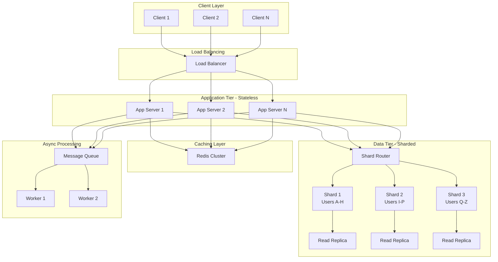
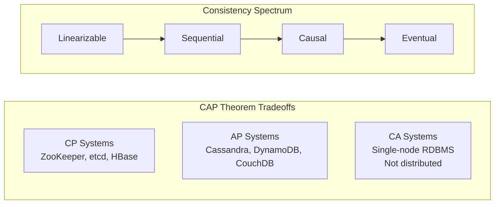

# System Design

## Quick Reference

- CAP theorem: a distributed system can guarantee at most two of Consistency, Availability, and Partition tolerance simultaneously
- Horizontal scaling adds more machines; vertical scaling adds more resources to existing machines
- Consistency models range from strong (linearizability) to weak (eventual consistency) with tradeoffs in latency and availability
- Database sharding partitions data across multiple nodes using a shard key; poor key selection causes hot spots
- Caching layers (L1 CPU → application cache → distributed cache → CDN) reduce latency by orders of magnitude
- Replication strategies: single-leader, multi-leader, leaderless (quorum-based)
- Consensus algorithms (Raft, Paxos) solve leader election and state machine replication in the presence of failures
- Back-of-the-envelope estimation: know latency numbers (L1 cache 0.5ns, RAM 100ns, SSD 150μs, network round-trip 500μs, disk seek 10ms)
- Design interviews evaluate tradeoff reasoning, not memorized architectures

## When to Use

System design knowledge is essential when architecting applications that must serve millions of users, handle terabytes of data, or maintain availability during partial failures. Apply distributed systems fundamentals when your application outgrows a single server, when you need fault tolerance beyond what a single machine provides, or when geographic distribution requires data to be closer to users. Understanding CAP theorem tradeoffs is critical when choosing between databases, designing replication strategies, or deciding how your system behaves during network partitions. Horizontal scaling patterns apply when traffic is unpredictable or growing beyond vertical limits. Database sharding becomes necessary when a single database instance cannot handle the write throughput or storage requirements. Caching strategies are relevant for any system where read-heavy workloads dominate and acceptable staleness windows exist. These concepts form the foundation of system design interviews at senior engineering levels, where candidates must articulate tradeoffs between consistency, availability, latency, throughput, and operational complexity.

## Distributed Systems Fundamentals

A distributed system is a collection of independent computers that appears to its users as a single coherent system. The fundamental challenge is that these machines communicate over an unreliable network where messages can be lost, delayed, duplicated, or delivered out of order. Unlike single-machine programs where failures are total (the machine either works or it does not), distributed systems experience partial failures where some components fail while others continue operating. This makes reasoning about correctness significantly harder because you cannot determine whether a remote node has crashed or is simply slow to respond.

The Eight Fallacies of Distributed Computing describe assumptions that developers incorrectly make: the network is reliable, latency is zero, bandwidth is infinite, the network is secure, topology does not change, there is one administrator, transport cost is zero, and the network is homogeneous. Violating these assumptions leads to systems that work in development but fail catastrophically in production. Real distributed systems must handle network partitions, clock skew between nodes, split-brain scenarios, and cascading failures where one component's failure triggers failures in dependent components.

Key building blocks include remote procedure calls (RPCs) for inter-service communication, message queues for asynchronous decoupling, distributed consensus for coordination, and gossip protocols for membership and failure detection. Service discovery mechanisms (DNS, Consul, etcd) allow services to find each other without hardcoded addresses. Circuit breakers prevent cascading failures by failing fast when downstream services are unhealthy. Idempotency ensures that retried operations produce the same result, which is essential when network failures make it impossible to know whether a request was processed.

## CAP Theorem

The CAP theorem, proven by Eric Brewer and formalized by Gilbert and Lynch, states that a distributed data store cannot simultaneously provide more than two of three guarantees: Consistency (every read receives the most recent write or an error), Availability (every request receives a non-error response without guarantee of the most recent write), and Partition tolerance (the system continues to operate despite network partitions between nodes). Since network partitions are inevitable in any distributed system, the practical choice is between CP (consistency over availability during partitions) and AP (availability over consistency during partitions).

CP systems like ZooKeeper, etcd, and HBase prioritize consistency by refusing to serve requests when they cannot guarantee the data is up-to-date. During a network partition, nodes that cannot communicate with the majority will reject reads and writes rather than risk serving stale data. This is appropriate for coordination services, distributed locks, and financial systems where incorrect data is worse than unavailability.

AP systems like Cassandra, DynamoDB, and CouchDB prioritize availability by serving requests even when nodes cannot communicate. During partitions, different nodes may serve different versions of the data, leading to temporary inconsistency that is resolved after the partition heals through conflict resolution mechanisms (last-write-wins, vector clocks, CRDTs). This is appropriate for shopping carts, social media feeds, and DNS where temporary staleness is acceptable but downtime is not.

It is important to understand that CAP is not a binary choice made once for an entire system. Different components within the same system can make different tradeoffs. A user profile service might choose AP (eventual consistency is fine for display names) while a payment service chooses CP (double-charging is unacceptable). The PACELC theorem extends CAP by noting that even when there is no partition, there is a tradeoff between latency and consistency.

## Consistency Models

Consistency models define the contract between a distributed data store and its clients regarding the order and visibility of operations. Strong consistency (linearizability) guarantees that all operations appear to execute atomically in some sequential order consistent with real-time ordering. This means a read always returns the value of the most recent completed write, regardless of which replica serves the request. Linearizability is expensive because it requires coordination between replicas on every operation, typically through consensus protocols.

Sequential consistency relaxes linearizability by requiring that operations appear in some sequential order consistent with the program order of each individual client, but not necessarily consistent with real-time ordering. Causal consistency preserves the ordering of causally related operations (if operation A could have influenced operation B, then all nodes see A before B) while allowing concurrent operations to be observed in different orders by different nodes. This is implemented using vector clocks or Lamport timestamps.

Eventual consistency is the weakest useful guarantee: if no new updates are made, all replicas will eventually converge to the same value. The convergence window depends on replication lag, network conditions, and conflict resolution strategy. Read-your-writes consistency ensures that a client always sees its own writes, even if other clients may see stale data. Monotonic reads guarantee that a client never sees time go backward (once you read a value, subsequent reads return that value or a newer one). Session consistency combines read-your-writes and monotonic reads within a single client session.

Choosing a consistency model involves understanding your application's tolerance for stale reads, the cost of coordination, and the failure modes that are acceptable. Stronger consistency requires more network round-trips and higher tail latency. Weaker consistency allows better performance and availability but pushes complexity to the application layer, which must handle conflicts, retries, and reconciliation.

## Horizontal Scaling

Horizontal scaling (scaling out) adds more machines to a system to handle increased load, as opposed to vertical scaling (scaling up) which adds more CPU, memory, or storage to a single machine. Horizontal scaling is preferred for distributed systems because it offers near-linear throughput increases, eliminates single points of failure, and avoids the hard ceiling of the largest available machine. However, it introduces complexity in data distribution, coordination, and consistency.

Stateless services are the easiest to scale horizontally because any instance can handle any request. Load balancers distribute traffic across instances using algorithms like round-robin, least connections, weighted distribution, or consistent hashing. Auto-scaling policies add or remove instances based on metrics like CPU utilization, request queue depth, or custom application metrics. The scaling decision involves choosing between scaling based on leading indicators (queue depth growing) versus lagging indicators (CPU already saturated).

Stateful services are harder to scale because each instance holds data that may be needed by requests routed to other instances. Strategies include sticky sessions (routing all requests from a client to the same instance), shared state stores (Redis, Memcached), and data partitioning (sharding). Database scaling typically combines read replicas for read-heavy workloads with sharding for write-heavy workloads. Connection pooling (PgBouncer, ProxySQL) prevents database connection exhaustion as application instances scale.

The scaling architecture must account for thundering herd problems (all instances simultaneously retrying after a failure), cold start latency (new instances need time to warm caches and JIT-compile), and graceful degradation (shedding load intentionally rather than failing completely). Capacity planning uses load testing to determine the relationship between instance count, traffic volume, and response latency, establishing scaling thresholds before production traffic arrives.

## Database Sharding

Database sharding horizontally partitions data across multiple database instances (shards), where each shard holds a subset of the total data. Sharding becomes necessary when a single database instance cannot handle the write throughput, storage volume, or query load required by the application. Each shard operates independently, allowing the system to scale write capacity linearly with the number of shards.

The shard key determines how data is distributed across shards. A good shard key distributes data evenly (avoiding hot spots), aligns with query patterns (most queries hit a single shard), and grows monotonically with the data (new data spreads across shards). Common strategies include hash-based sharding (consistent hashing of the key distributes data uniformly), range-based sharding (contiguous key ranges map to shards, enabling range queries), and directory-based sharding (a lookup table maps keys to shards, offering flexibility at the cost of an additional lookup).

Cross-shard queries are expensive because they require scatter-gather across multiple shards and merging results. Cross-shard transactions are even harder, requiring two-phase commit or saga patterns that sacrifice performance and simplicity. Schema changes must be coordinated across all shards. Resharding (adding or removing shards) requires data migration, which must happen online without downtime using techniques like dual-writes, shadow traffic, or virtual sharding where logical shards outnumber physical shards.

Common pitfalls include choosing a shard key that creates hot spots (e.g., sharding by date causes all current writes to hit one shard), underestimating the operational complexity of managing many database instances, and not planning for resharding from the start. Alternatives to application-level sharding include database-native partitioning (PostgreSQL declarative partitioning, MySQL partition tables), NewSQL databases (CockroachDB, TiDB) that handle sharding transparently, and read replicas for read-heavy workloads that do not actually need write scaling.

## Caching Strategies

Caching stores frequently accessed data in a faster storage layer to reduce latency and backend load. The cache hierarchy spans multiple levels: CPU caches (L1/L2/L3), application-level in-memory caches, distributed caches (Redis, Memcached), CDN edge caches, and browser caches. Each level trades capacity for speed, and effective caching strategies leverage multiple levels simultaneously.

Cache-aside (lazy loading) is the most common pattern: the application checks the cache first, and on a miss, reads from the database, stores the result in cache, and returns it. Write-through caching writes to both the cache and database simultaneously, ensuring the cache is always consistent but adding write latency. Write-behind (write-back) caching writes to the cache immediately and asynchronously flushes to the database, offering low write latency at the risk of data loss if the cache fails before flushing. Read-through caching places the cache in front of the database, making the cache responsible for loading data on misses.

Cache invalidation is famously one of the two hard problems in computer science. Time-based expiration (TTL) is simple but allows stale reads within the TTL window. Event-driven invalidation publishes cache-bust messages when data changes, offering fresher data at the cost of infrastructure complexity. Versioned keys append a version number to cache keys, allowing atomic cache updates without race conditions. The thundering herd problem occurs when a popular cache key expires and many concurrent requests simultaneously miss the cache and hit the database; solutions include request coalescing (only one request fetches while others wait), probabilistic early expiration, and lock-based single-flight patterns.

Cache sizing and eviction policies determine what stays in cache when capacity is reached. LRU (Least Recently Used) evicts the oldest-accessed item, LFU (Least Frequently Used) evicts the least-accessed item, and random eviction is surprisingly effective for uniform access patterns. Redis supports additional policies like volatile-lru (evict only keys with TTL set) and allkeys-lfu. Monitoring cache hit rates, eviction rates, and memory utilization is essential for tuning cache effectiveness. A hit rate below 80% suggests the cache is too small or the access pattern is not cache-friendly.

## Code Examples

### Consistent Hashing Implementation for Distributed Cache

```java
import java.util.SortedMap;
import java.util.TreeMap;
import java.security.MessageDigest;
import java.security.NoSuchAlgorithmException;

public class ConsistentHashRing<T> {
    private final SortedMap<Long, T> ring = new TreeMap<>();
    private final int virtualNodes;
    private final MessageDigest md;

    public ConsistentHashRing(int virtualNodes) {
        this.virtualNodes = virtualNodes;
        try {
            this.md = MessageDigest.getInstance("MD5");
        } catch (NoSuchAlgorithmException e) {
            throw new RuntimeException(e);
        }
    }

    public void addNode(T node) {
        for (int i = 0; i < virtualNodes; i++) {
            long hash = hash(node.toString() + "-" + i);
            ring.put(hash, node);
        }
    }

    public void removeNode(T node) {
        for (int i = 0; i < virtualNodes; i++) {
            long hash = hash(node.toString() + "-" + i);
            ring.remove(hash);
        }
    }

    public T getNode(String key) {
        if (ring.isEmpty()) return null;
        long hash = hash(key);
        SortedMap<Long, T> tailMap = ring.tailMap(hash);
        long nodeHash = tailMap.isEmpty() ? ring.firstKey() : tailMap.firstKey();
        return ring.get(nodeHash);
    }

    private long hash(String key) {
        md.reset();
        byte[] digest = md.digest(key.getBytes());
        return ((long)(digest[3] & 0xFF) << 24)
             | ((long)(digest[2] & 0xFF) << 16)
             | ((long)(digest[1] & 0xFF) << 8)
             | ((long)(digest[0] & 0xFF));
    }
}
```

### Cache-Aside Pattern with Redis in Spring Boot

```java
@Service
public class UserService {
    private final UserRepository userRepository;
    private final RedisTemplate<String, User> redisTemplate;
    private static final Duration CACHE_TTL = Duration.ofMinutes(15);
    private static final String CACHE_PREFIX = "user:";

    public UserService(UserRepository userRepository,
                       RedisTemplate<String, User> redisTemplate) {
        this.userRepository = userRepository;
        this.redisTemplate = redisTemplate;
    }

    public User getUserById(Long id) {
        String cacheKey = CACHE_PREFIX + id;

        // Check cache first
        User cached = redisTemplate.opsForValue().get(cacheKey);
        if (cached != null) {
            return cached;
        }

        // Cache miss: load from database
        User user = userRepository.findById(id)
            .orElseThrow(() -> new UserNotFoundException(id));

        // Store in cache with TTL
        redisTemplate.opsForValue().set(cacheKey, user, CACHE_TTL);
        return user;
    }

    public User updateUser(Long id, UserUpdateRequest request) {
        User user = userRepository.findById(id)
            .orElseThrow(() -> new UserNotFoundException(id));

        user.setName(request.getName());
        user.setEmail(request.getEmail());
        User saved = userRepository.save(user);

        // Invalidate cache on write
        String cacheKey = CACHE_PREFIX + id;
        redisTemplate.delete(cacheKey);

        return saved;
    }

    public void evictUserCache(Long id) {
        redisTemplate.delete(CACHE_PREFIX + id);
    }
}
```

### Database Sharding Router

```java
public class ShardRouter {
    private final int shardCount;
    private final Map<Integer, DataSource> shardDataSources;

    public ShardRouter(int shardCount, Map<Integer, DataSource> shardDataSources) {
        this.shardCount = shardCount;
        this.shardDataSources = shardDataSources;
    }

    public int getShardId(String shardKey) {
        int hash = Math.abs(shardKey.hashCode());
        return hash % shardCount;
    }

    public DataSource getDataSource(String shardKey) {
        int shardId = getShardId(shardKey);
        DataSource ds = shardDataSources.get(shardId);
        if (ds == null) {
            throw new ShardNotFoundException("No datasource for shard " + shardId);
        }
        return ds;
    }

    public <T> List<T> scatterGather(String query, Function<DataSource, List<T>> executor) {
        return shardDataSources.values().parallelStream()
            .flatMap(ds -> executor.apply(ds).stream())
            .collect(Collectors.toList());
    }
}
```

## Architecture and Diagrams





## Common Pitfalls

- Premature optimization: sharding or adding caching before measuring actual bottlenecks leads to unnecessary complexity and operational burden without measurable benefit
- Choosing the wrong shard key: sharding by a monotonically increasing ID (like timestamp) sends all writes to a single shard, creating a hot spot that defeats the purpose of sharding
- Ignoring cache stampede: when a popular cache key expires, hundreds of concurrent requests hit the database simultaneously, potentially causing cascading failures
- Treating distributed systems like single-machine programs: assuming network calls always succeed, ignoring partial failures, and not implementing idempotency leads to data corruption and inconsistency
- Over-caching: caching everything without considering invalidation complexity creates stale data bugs that are extremely difficult to reproduce and debug
- Not planning for resharding: starting with a fixed number of shards without virtual sharding or a migration strategy means painful downtime when capacity limits are reached
- Ignoring tail latency: P99 latency in distributed systems is dominated by the slowest component; a single slow shard or cache miss can make the entire request slow
- Conflating availability with durability: a system can be available (accepting writes) while losing data if writes are not replicated before acknowledgment

## Real-World Use Cases

**Social Media Feed (Twitter/X)**: Fan-out on write pushes new tweets to follower timelines stored in Redis. Celebrity accounts with millions of followers use fan-out on read instead to avoid write amplification. The hybrid approach demonstrates how different consistency and caching strategies apply to different user segments within the same system.

**E-Commerce Inventory (Amazon)**: Inventory counts use eventual consistency for display (showing approximate stock) but strong consistency for the actual purchase transaction (decrement-and-check is linearizable). This prevents overselling while keeping browse latency low. Caching product catalog data aggressively with short TTLs balances freshness against database load.

**Ride-Sharing Matching (Uber)**: Geospatial sharding partitions the world into cells, with each cell handled by a specific shard. Driver location updates are high-frequency writes that benefit from eventual consistency. Matching algorithms run against the local shard for the rider's cell plus adjacent cells, demonstrating range-based sharding with geographic locality.

**Payment Processing (Stripe)**: Exactly-once semantics through idempotency keys prevent double-charging. The system uses CP consistency for ledger entries, saga patterns for multi-step transactions, and event sourcing for audit trails. Sharding by merchant ID distributes write load while keeping per-merchant queries efficient.

## Interview Questions

**Q: How would you design a URL shortener that handles 100M URLs and 10B redirects per month?**
A: Use a hash-based approach (Base62 encoding of an auto-increment ID or hash) for URL generation, cache popular URLs in Redis with LRU eviction, shard the URL database by hash prefix for write scaling, and use read replicas plus CDN for redirect latency. The read-to-write ratio (100:1) means caching is highly effective.

**Q: Explain the tradeoffs between strong and eventual consistency with a real example.**
A: A banking system uses strong consistency for account balances (transferring money requires linearizable reads and writes to prevent double-spending). A social media like counter uses eventual consistency (showing 1,003 likes instead of 1,005 momentarily is acceptable, and the reduced coordination allows much higher throughput and lower latency).

**Q: When would you choose database sharding over read replicas?**
A: Read replicas solve read scaling but not write scaling. Choose sharding when write throughput exceeds what a single primary can handle, when the dataset exceeds single-node storage capacity, or when write latency is unacceptable due to replication lag. Choose read replicas first when the workload is read-heavy (90%+ reads) and a single primary can handle all writes.

**Q: How do you handle cache invalidation in a microservices architecture?**
A: Publish domain events (e.g., UserUpdated) to a message broker. Each service subscribes to events relevant to its cached data and invalidates or updates accordingly. This decouples services while ensuring caches stay reasonably fresh. Combine with TTL as a safety net for missed events.

**Q: What happens during a network partition in a Cassandra cluster?**
A: Cassandra is an AP system. During a partition, nodes on both sides continue accepting reads and writes. When the partition heals, Cassandra uses last-write-wins (timestamp-based) or application-defined conflict resolution to reconcile divergent data. Read repair and anti-entropy repair processes ensure eventual convergence.

## Production Tips

- Set cache TTLs based on data change frequency and acceptable staleness, not arbitrary round numbers. Monitor cache hit rates and adjust TTLs when hit rates drop below 80%.
- Implement circuit breakers on all cross-service calls with sensible timeout, failure threshold, and recovery settings. A 5-second timeout with 50% failure threshold opening the circuit prevents cascading failures.
- Use consistent hashing with virtual nodes (150-200 per physical node) for cache distribution to minimize key redistribution when nodes are added or removed.
- Monitor replication lag on read replicas and route time-sensitive reads to the primary. Alert when lag exceeds your consistency SLA (typically 1-5 seconds for most applications).
- Implement request coalescing (singleflight pattern) for cache misses on hot keys to prevent thundering herd. Only one goroutine/thread fetches while others wait for the result.
- Design shard keys to support your most common query patterns. If 80% of queries filter by tenant_id, shard by tenant_id even if it creates some size imbalance.
- Use exponential backoff with jitter for retries to prevent synchronized retry storms across instances. Full jitter (random between 0 and exponential cap) distributes retries most evenly.
- Capacity test at 2x expected peak load to identify breaking points before they occur in production. Know your system's degradation curve: does it degrade gracefully or fall off a cliff?

## Related Topics

- [Docker & Containerization](../infrastructure/docker-containerization.md) — container orchestration is the deployment substrate for distributed systems
- [Kubernetes & EKS](../infrastructure/kubernetes-eks.md) — orchestrates horizontal scaling, service discovery, and load balancing
- [Apache Kafka](../backend/apache-kafka.md) — distributed event streaming for async communication between services
- [Design Patterns](./design-patterns.md) — microservice patterns (saga, CQRS, event sourcing) build on distributed systems fundamentals
- [Networking](./networking.md) — TCP/IP, DNS, and load balancing are the transport layer for distributed systems
