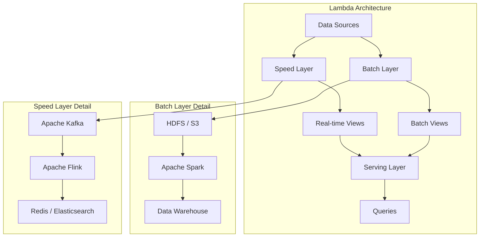
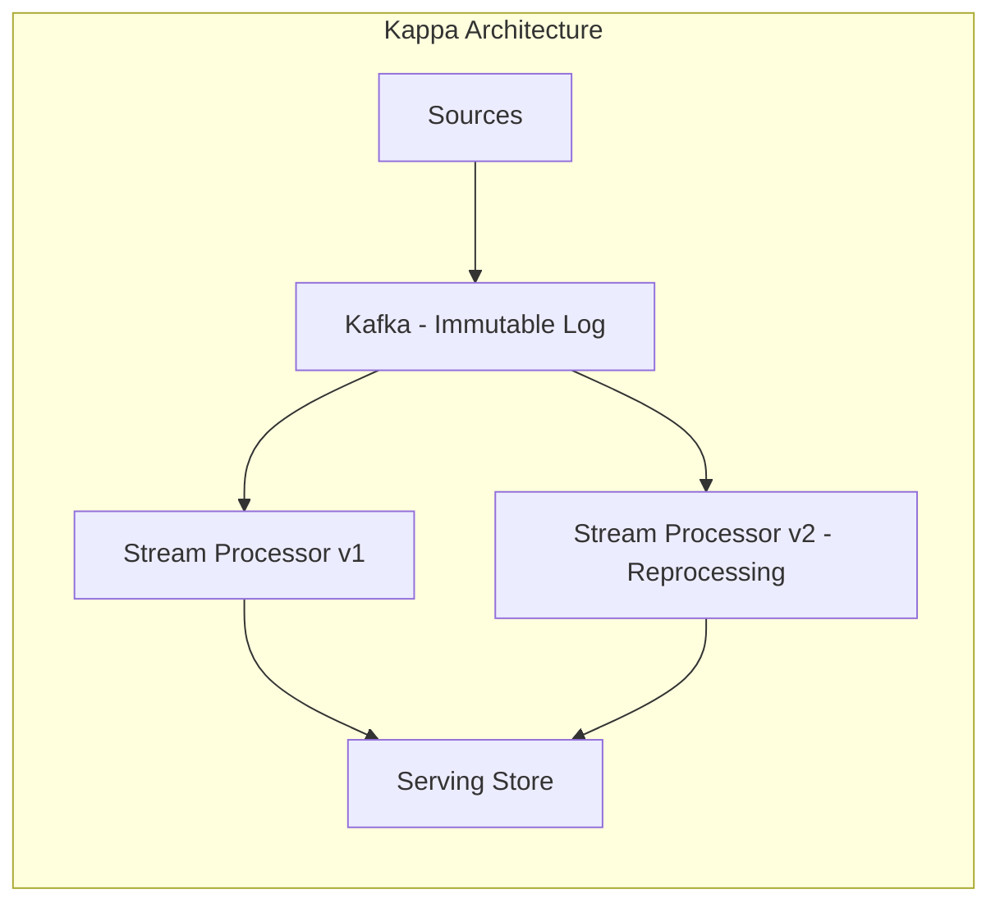
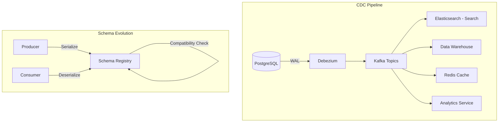
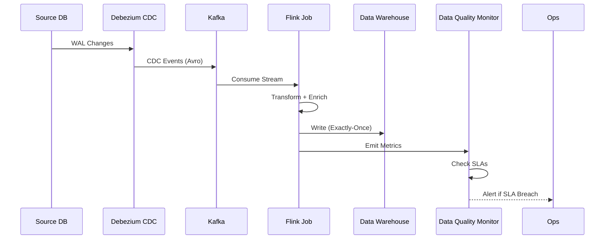

# Data Pipeline Design

## Quick Reference

- **Batch processing** handles bounded datasets on a schedule (hourly, daily) — optimized for throughput over latency, using frameworks like Apache Spark, Hadoop MapReduce, and AWS Glue
- **Stream processing** handles unbounded, continuous data flows in real-time — optimized for low latency, using Apache Kafka Streams, Apache Flink, and AWS Kinesis
- **Lambda architecture** combines batch (accuracy) and speed (low latency) layers with a serving layer that merges results — trades operational complexity for completeness guarantees
- **Kappa architecture** eliminates the batch layer entirely, processing everything as streams with replayable logs (Kafka) — simpler operations but requires careful offset management
- **ETL** (Extract, Transform, Load) transforms data before loading into the target; **ELT** (Extract, Load, Transform) loads raw data first and transforms in-place using the target's compute (modern data warehouses favor ELT)
- **Change Data Capture (CDC)** streams database changes (inserts, updates, deletes) as events — Debezium reads WAL/binlog without impacting source database performance
- **Schema evolution** manages backward/forward compatibility as data formats change — Avro with a Schema Registry enforces compatibility rules across producers and consumers
- **Backpressure** prevents fast producers from overwhelming slow consumers — mechanisms include pull-based consumption, rate limiting, buffering with overflow policies, and reactive streams
- **Exactly-once semantics** guarantees each record is processed precisely once despite failures — achieved through idempotent producers, transactional writes, and checkpoint-based recovery
- **Data quality** encompasses validation (schema conformance, null checks), freshness (SLA monitoring), completeness (row count reconciliation), and accuracy (statistical profiling)

## When to Use

Data pipeline design is essential whenever your system needs to move, transform, or aggregate data across boundaries — between operational databases and analytical stores, between microservices, between on-premises systems and cloud platforms, or between raw event streams and machine learning feature stores. Design batch pipelines when data freshness requirements are measured in hours or days (daily financial reconciliation, nightly data warehouse loads, weekly reporting aggregations), when the source data is naturally bounded (file drops, database snapshots, API pagination), or when the transformation logic requires global context (sorting, windowed aggregations over complete datasets). Design streaming pipelines when business value depends on sub-second or sub-minute latency (fraud detection, real-time recommendations, operational dashboards, alerting), when data arrives continuously without natural boundaries (clickstreams, IoT sensor readings, application logs), or when downstream consumers need incremental updates rather than full refreshes. Choose Lambda architecture when you need both real-time approximations and batch-corrected accurate results — common in advertising analytics where real-time bid optimization needs immediate signals but billing requires exact batch-reconciled numbers. Choose Kappa architecture when your streaming framework can handle both real-time and historical reprocessing (Kafka with compacted topics, Flink with savepoints) and when the operational simplicity of a single processing path outweighs the flexibility of separate batch and speed layers. Avoid over-engineering pipelines for simple use cases — a cron job running a SQL query is a valid pipeline for small-scale, low-frequency data movement.

## Code Examples

### Apache Kafka Streams — Real-Time Event Processing

```java
// Kafka Streams topology for real-time order analytics
@Configuration
public class OrderAnalyticsTopology {

    @Bean
    public KStream<String, OrderEvent> orderAnalyticsStream(StreamsBuilder builder) {
        // Source: order events topic
        KStream<String, OrderEvent> orders = builder.stream(
            "order-events",
            Consumed.with(Serdes.String(), orderEventSerde())
        );

        // Branch: separate completed orders from cancellations
        Map<String, KStream<String, OrderEvent>> branches = orders
            .split(Named.as("order-"))
            .branch((key, event) -> event.getStatus() == OrderStatus.COMPLETED,
                    Branched.as("completed"))
            .branch((key, event) -> event.getStatus() == OrderStatus.CANCELLED,
                    Branched.as("cancelled"))
            .defaultBranch(Branched.as("other"));

        KStream<String, OrderEvent> completedOrders = branches.get("order-completed");

        // Windowed aggregation: revenue per category per 5-minute window
        KTable<Windowed<String>, RevenueAggregate> revenueByCategory = completedOrders
            .groupBy((key, order) -> order.getCategory(),
                     Grouped.with(Serdes.String(), orderEventSerde()))
            .windowedBy(TimeWindows.ofSizeWithNoGrace(Duration.ofMinutes(5)))
            .aggregate(
                RevenueAggregate::new,
                (category, order, aggregate) -> aggregate.add(order.getAmount()),
                Materialized.<String, RevenueAggregate, WindowStore<Bytes, byte[]>>as(
                    "revenue-by-category-store")
                    .withKeySerde(Serdes.String())
                    .withValueSerde(revenueAggregateSerde())
            );

        // Sink: write aggregated results to output topic
        revenueByCategory.toStream()
            .map((windowedKey, aggregate) -> KeyValue.pair(
                windowedKey.key(),
                new CategoryRevenue(
                    windowedKey.key(),
                    aggregate.getTotalRevenue(),
                    aggregate.getOrderCount(),
                    windowedKey.window().startTime(),
                    windowedKey.window().endTime()
                )))
            .to("category-revenue", Produced.with(Serdes.String(), categoryRevenueSerde()));

        // Enrichment: join orders with customer data
        GlobalKTable<String, CustomerProfile> customers = builder.globalTable(
            "customer-profiles",
            Consumed.with(Serdes.String(), customerProfileSerde())
        );

        KStream<String, EnrichedOrder> enrichedOrders = completedOrders.join(
            customers,
            (key, order) -> order.getCustomerId(),
            (order, customer) -> EnrichedOrder.builder()
                .orderId(order.getOrderId())
                .customerTier(customer.getTier())
                .customerRegion(customer.getRegion())
                .amount(order.getAmount())
                .category(order.getCategory())
                .build()
        );

        enrichedOrders.to("enriched-orders",
            Produced.with(Serdes.String(), enrichedOrderSerde()));

        return orders;
    }
}
```

### Apache Flink — Stateful Stream Processing with Exactly-Once

```java
// Flink job for fraud detection with complex event processing
public class FraudDetectionJob {

    public static void main(String[] args) throws Exception {
        StreamExecutionEnvironment env = StreamExecutionEnvironment.getExecutionEnvironment();

        // Enable exactly-once checkpointing
        env.enableCheckpointing(60_000, CheckpointingMode.EXACTLY_ONCE);
        env.getCheckpointConfig().setMinPauseBetweenCheckpoints(30_000);
        env.getCheckpointConfig().setCheckpointTimeout(120_000);
        env.getCheckpointConfig().setMaxConcurrentCheckpoints(1);
        env.getCheckpointConfig().setExternalizedCheckpointCleanup(
            ExternalizedCheckpointCleanup.RETAIN_ON_CANCELLATION);

        // Source: Kafka transactions topic
        KafkaSource<Transaction> source = KafkaSource.<Transaction>builder()
            .setBootstrapServers("kafka:9092")
            .setTopics("transactions")
            .setGroupId("fraud-detection")
            .setStartingOffsets(OffsetsInitializer.committedOffsets(OffsetResetStrategy.EARLIEST))
            .setDeserializer(new TransactionDeserializer())
            .build();

        DataStream<Transaction> transactions = env.fromSource(
            source, WatermarkStrategy
                .<Transaction>forBoundedOutOfOrderness(Duration.ofSeconds(5))
                .withTimestampAssigner((txn, ts) -> txn.getTimestamp()),
            "Kafka Transactions"
        );

        // Pattern: detect rapid successive transactions from same account
        Pattern<Transaction, ?> fraudPattern = Pattern.<Transaction>begin("first")
            .where(new SimpleCondition<Transaction>() {
                @Override
                public boolean filter(Transaction txn) {
                    return txn.getAmount() > 1000;
                }
            })
            .next("second")
            .where(new SimpleCondition<Transaction>() {
                @Override
                public boolean filter(Transaction txn) {
                    return txn.getAmount() > 1000;
                }
            })
            .within(Duration.ofMinutes(5));

        DataStream<Transaction> keyedTransactions = transactions
            .keyBy(Transaction::getAccountId);

        PatternStream<Transaction> patternStream = CEP.pattern(
            keyedTransactions, fraudPattern);

        DataStream<FraudAlert> alerts = patternStream.process(
            new PatternProcessFunction<Transaction, FraudAlert>() {
                @Override
                public void processMatch(Map<String, List<Transaction>> match,
                                         Context ctx, Collector<FraudAlert> out) {
                    Transaction first = match.get("first").get(0);
                    Transaction second = match.get("second").get(0);
                    out.collect(new FraudAlert(
                        first.getAccountId(),
                        first.getAmount() + second.getAmount(),
                        "Rapid high-value transactions detected",
                        Instant.now()
                    ));
                }
            });

        // Sink: write alerts to Kafka and Elasticsearch
        alerts.sinkTo(KafkaSink.<FraudAlert>builder()
            .setBootstrapServers("kafka:9092")
            .setRecordSerializer(new FraudAlertSerializer("fraud-alerts"))
            .setDeliveryGuarantee(DeliveryGuarantee.EXACTLY_ONCE)
            .build());

        env.execute("Fraud Detection Pipeline");
    }
}
```

### Change Data Capture with Debezium

```yaml
# Debezium PostgreSQL connector configuration
apiVersion: kafka.strimzi.io/v1beta2
kind: KafkaConnector
metadata:
  name: orders-cdc-connector
  labels:
    strimzi.io/cluster: kafka-connect
spec:
  class: io.debezium.connector.postgresql.PostgresConnector
  tasksMax: 1
  config:
    database.hostname: orders-db.internal
    database.port: 5432
    database.user: debezium
    database.password: ${secrets:cdc-credentials:password}
    database.dbname: orders
    database.server.name: orders
    
    # Logical decoding slot
    plugin.name: pgoutput
    slot.name: debezium_orders
    publication.name: orders_publication
    
    # Table filtering
    table.include.list: public.orders,public.order_items,public.payments
    
    # Schema history
    schema.history.internal.kafka.bootstrap.servers: kafka:9092
    schema.history.internal.kafka.topic: schema-changes.orders
    
    # Transforms: route to topic per table
    transforms: route
    transforms.route.type: io.debezium.transforms.ByLogicalTableRouter
    transforms.route.topic.regex: (.*)
    transforms.route.topic.replacement: cdc.$1
    
    # Exactly-once delivery
    exactly.once.support: required
    
    # Snapshot mode for initial load
    snapshot.mode: initial
    
    # Heartbeat to prevent WAL retention issues
    heartbeat.interval.ms: 30000
```

```java
// Consuming CDC events for materialized view updates
@Component
public class OrderMaterializedViewUpdater {

    private final ElasticsearchClient esClient;
    private final ObjectMapper mapper;

    @KafkaListener(topics = "cdc.public.orders", groupId = "order-search-indexer")
    public void handleOrderChange(ConsumerRecord<String, String> record) {
        DebeziumEvent event = mapper.readValue(record.value(), DebeziumEvent.class);

        switch (event.getOperation()) {
            case "c": // Create
            case "u": // Update
                OrderDocument doc = mapToSearchDocument(event.getAfter());
                esClient.index(IndexRequest.of(r -> r
                    .index("orders")
                    .id(doc.getOrderId())
                    .document(doc)
                ));
                break;
            case "d": // Delete
                String orderId = event.getBefore().get("order_id").asText();
                esClient.delete(DeleteRequest.of(r -> r
                    .index("orders")
                    .id(orderId)
                ));
                break;
        }
    }

    @KafkaListener(topics = "cdc.public.order_items", groupId = "order-search-indexer")
    public void handleOrderItemChange(ConsumerRecord<String, String> record) {
        DebeziumEvent event = mapper.readValue(record.value(), DebeziumEvent.class);
        String orderId = event.getAfter().get("order_id").asText();

        // Update parent order document with new item data
        esClient.update(UpdateRequest.of(r -> r
            .index("orders")
            .id(orderId)
            .script(Script.of(s -> s
                .inline(InlineScript.of(i -> i
                    .source("ctx._source.items = params.items")
                    .params("items", JsonData.of(fetchOrderItems(orderId)))
                ))))
        ));
    }
}
```

### Schema Evolution with Avro and Schema Registry

```java
// Avro schema with backward-compatible evolution
// Version 1: Original schema
{
  "type": "record",
  "name": "OrderEvent",
  "namespace": "com.example.events",
  "fields": [
    {"name": "orderId", "type": "string"},
    {"name": "customerId", "type": "string"},
    {"name": "amount", "type": "double"},
    {"name": "currency", "type": "string"},
    {"name": "timestamp", "type": "long", "logicalType": "timestamp-millis"}
  ]
}

// Version 2: Backward-compatible addition (new field with default)
{
  "type": "record",
  "name": "OrderEvent",
  "namespace": "com.example.events",
  "fields": [
    {"name": "orderId", "type": "string"},
    {"name": "customerId", "type": "string"},
    {"name": "amount", "type": "double"},
    {"name": "currency", "type": "string"},
    {"name": "timestamp", "type": "long", "logicalType": "timestamp-millis"},
    {"name": "region", "type": "string", "default": "UNKNOWN"},
    {"name": "channel", "type": ["null", "string"], "default": null}
  ]
}
```

```java
// Schema Registry integration with Kafka producer
@Configuration
public class KafkaProducerConfig {

    @Bean
    public ProducerFactory<String, OrderEvent> producerFactory() {
        Map<String, Object> config = new HashMap<>();
        config.put(ProducerConfig.BOOTSTRAP_SERVERS_CONFIG, "kafka:9092");
        config.put(ProducerConfig.KEY_SERIALIZER_CLASS_CONFIG, StringSerializer.class);
        config.put(ProducerConfig.VALUE_SERIALIZER_CLASS_CONFIG, KafkaAvroSerializer.class);
        config.put("schema.registry.url", "http://schema-registry:8081");
        
        // Auto-register schemas (disable in production — use CI/CD registration)
        config.put("auto.register.schemas", false);
        config.put("use.latest.version", true);
        
        // Exactly-once producer settings
        config.put(ProducerConfig.ENABLE_IDEMPOTENCE_CONFIG, true);
        config.put(ProducerConfig.ACKS_CONFIG, "all");
        config.put(ProducerConfig.RETRIES_CONFIG, Integer.MAX_VALUE);
        config.put(ProducerConfig.MAX_IN_FLIGHT_REQUESTS_PER_CONNECTION, 5);
        
        return new DefaultKafkaProducerFactory<>(config);
    }
}

// Schema compatibility check in CI/CD pipeline
public class SchemaCompatibilityValidator {

    public boolean validateCompatibility(String subject, Schema newSchema) {
        SchemaRegistryClient client = new CachedSchemaRegistryClient(
            "http://schema-registry:8081", 100);

        try {
            // Check backward compatibility (new schema can read old data)
            List<String> incompatibilities = client.testCompatibility(
                subject, new AvroSchema(newSchema), true);

            if (!incompatibilities.isEmpty()) {
                log.error("Schema incompatible: {}", incompatibilities);
                return false;
            }
            return true;
        } catch (Exception e) {
            throw new SchemaValidationException("Compatibility check failed", e);
        }
    }
}
```

### Batch Pipeline with Apache Spark

```python
# PySpark ETL pipeline for data warehouse loading
from pyspark.sql import SparkSession
from pyspark.sql.functions import (
    col, when, lit, current_timestamp, sha2, concat_ws,
    year, month, dayofmonth, hour, window
)
from pyspark.sql.types import StructType, StructField, StringType, DoubleType, TimestampType
from delta import DeltaTable

def create_spark_session():
    return SparkSession.builder \
        .appName("OrderDataWarehouseETL") \
        .config("spark.sql.extensions", "io.delta.sql.DeltaSparkSessionExtension") \
        .config("spark.sql.catalog.spark_catalog", "org.apache.spark.sql.delta.catalog.DeltaCatalog") \
        .config("spark.sql.adaptive.enabled", "true") \
        .config("spark.sql.adaptive.coalescePartitions.enabled", "true") \
        .config("spark.sql.shuffle.partitions", "200") \
        .getOrCreate()

def extract_orders(spark, date_partition):
    """Extract orders from source database using JDBC with partition pruning."""
    return spark.read \
        .format("jdbc") \
        .option("url", "jdbc:postgresql://orders-db:5432/orders") \
        .option("dbtable", f"(SELECT * FROM orders WHERE created_at::date = '{date_partition}') AS t") \
        .option("user", "etl_reader") \
        .option("password", get_secret("orders-db-password")) \
        .option("fetchsize", "10000") \
        .option("numPartitions", "8") \
        .option("partitionColumn", "order_id") \
        .option("lowerBound", "1") \
        .option("upperBound", "10000000") \
        .load()

def transform_orders(orders_df):
    """Apply business transformations and data quality rules."""
    return orders_df \
        .withColumn("order_date", col("created_at").cast("date")) \
        .withColumn("year", year("created_at")) \
        .withColumn("month", month("created_at")) \
        .withColumn("day", dayofmonth("created_at")) \
        .withColumn("amount_usd", 
            when(col("currency") == "EUR", col("amount") * 1.08)
            .when(col("currency") == "GBP", col("amount") * 1.26)
            .otherwise(col("amount"))) \
        .withColumn("customer_segment",
            when(col("total_lifetime_value") > 10000, "enterprise")
            .when(col("total_lifetime_value") > 1000, "mid-market")
            .otherwise("smb")) \
        .withColumn("surrogate_key", sha2(concat_ws("||", 
            col("order_id"), col("created_at")), 256)) \
        .withColumn("etl_loaded_at", current_timestamp()) \
        .filter(col("amount") > 0) \
        .filter(col("status").isin("completed", "refunded", "partially_refunded")) \
        .dropDuplicates(["order_id"])

def load_to_delta(transformed_df, target_path):
    """Upsert into Delta Lake table with merge semantics."""
    if DeltaTable.isDeltaTable(spark, target_path):
        delta_table = DeltaTable.forPath(spark, target_path)
        
        delta_table.alias("target").merge(
            transformed_df.alias("source"),
            "target.order_id = source.order_id"
        ).whenMatchedUpdate(
            condition="source.updated_at > target.updated_at",
            set={
                "status": "source.status",
                "amount": "source.amount",
                "amount_usd": "source.amount_usd",
                "updated_at": "source.updated_at",
                "etl_loaded_at": "source.etl_loaded_at"
            }
        ).whenNotMatchedInsertAll() \
        .execute()
    else:
        transformed_df.write \
            .format("delta") \
            .partitionBy("year", "month") \
            .mode("overwrite") \
            .save(target_path)

def run_data_quality_checks(spark, target_path):
    """Post-load data quality validation."""
    df = spark.read.format("delta").load(target_path)
    
    checks = {
        "null_order_ids": df.filter(col("order_id").isNull()).count(),
        "negative_amounts": df.filter(col("amount") < 0).count(),
        "future_dates": df.filter(col("created_at") > current_timestamp()).count(),
        "duplicate_orders": df.count() - df.dropDuplicates(["order_id"]).count(),
    }
    
    failures = {k: v for k, v in checks.items() if v > 0}
    if failures:
        raise DataQualityException(f"Quality checks failed: {failures}")
    
    return checks

# Main execution
if __name__ == "__main__":
    spark = create_spark_session()
    date_partition = sys.argv[1]  # e.g., "2024-01-15"
    
    orders = extract_orders(spark, date_partition)
    transformed = transform_orders(orders)
    load_to_delta(transformed, "s3://data-lake/warehouse/orders")
    run_data_quality_checks(spark, "s3://data-lake/warehouse/orders")
```

### Backpressure Implementation

```java
// Reactive Streams backpressure with Project Reactor
@Service
public class EventProcessingPipeline {

    private final Sinks.Many<RawEvent> eventSink;
    private final EventProcessor processor;
    private final MetricsRegistry metrics;

    public EventProcessingPipeline(EventProcessor processor, MetricsRegistry metrics) {
        this.processor = processor;
        this.metrics = metrics;
        
        // Bounded buffer with overflow strategy
        this.eventSink = Sinks.many().multicast()
            .onBackpressureBuffer(10_000, false);

        // Processing pipeline with backpressure-aware operators
        eventSink.asFlux()
            .onBackpressureBuffer(
                5000,
                event -> metrics.increment("events.dropped"),
                BufferOverflowStrategy.DROP_OLDEST
            )
            .flatMap(event -> processWithRetry(event), 
                     64)  // Concurrency limit
            .buffer(Duration.ofSeconds(1), 100)  // Micro-batch for efficiency
            .flatMap(batch -> writeBatch(batch))
            .doOnError(e -> metrics.increment("pipeline.errors"))
            .retry(3)
            .subscribe();
    }

    public void ingest(RawEvent event) {
        Sinks.EmitResult result = eventSink.tryEmitNext(event);
        if (result.isFailure()) {
            metrics.increment("events.rejected");
            // Apply backpressure to upstream (return HTTP 429 or Kafka pause)
            throw new BackpressureException("Pipeline at capacity");
        }
    }

    private Mono<ProcessedEvent> processWithRetry(RawEvent event) {
        return Mono.fromCallable(() -> processor.process(event))
            .timeout(Duration.ofSeconds(5))
            .retryWhen(Retry.backoff(3, Duration.ofMillis(100))
                .maxBackoff(Duration.ofSeconds(2))
                .filter(e -> e instanceof TransientException));
    }
}
```

## Architecture / Diagrams









## Common Pitfalls

**1. Treating streaming as "faster batch" without rethinking semantics.** Streaming introduces challenges absent in batch: out-of-order events, late arrivals, partial windows, and non-deterministic processing order. Applying batch logic (sort everything, process sequentially) to streams creates bottlenecks and incorrect results. Design for event-time processing with watermarks, handle late data with allowed lateness policies, and accept that streaming results are approximations until windows close.

**2. Ignoring schema evolution and breaking consumers.** Changing a field name, removing a field, or altering a type in a message schema breaks all downstream consumers simultaneously. Without a schema registry enforcing compatibility rules (backward, forward, full), a single producer deployment can cascade failures across dozens of consumers. Register schemas in CI/CD, enforce compatibility checks before deployment, and use Avro or Protobuf (not JSON) for schema-enforced serialization.

**3. Building pipelines without idempotency, then losing data on retries.** Network failures, consumer crashes, and rebalances cause message redelivery. Without idempotent processing (deduplication keys, upsert semantics, conditional writes), retries produce duplicate records in the target — double-counted revenue, duplicate notifications, corrupted aggregations. Design every pipeline stage to be safely re-executable with the same input.

**4. Monolithic pipelines that cannot be independently scaled or debugged.** A single pipeline that extracts from 10 sources, applies 50 transformations, and loads into 5 targets is impossible to debug when one transformation fails. Decompose into stages with intermediate topics or storage — extract → raw zone → transform → curated zone → load. Each stage can be monitored, scaled, and restarted independently.

**5. Not monitoring data freshness and completeness.** A pipeline that runs without errors but produces stale or incomplete data is worse than one that fails loudly. Implement freshness SLAs (data must arrive within X minutes of generation), completeness checks (row counts match between source and target), and accuracy validation (statistical profiling detects anomalies). Alert on SLA breaches, not just pipeline failures.

**6. Underestimating backpressure in streaming systems.** A fast producer overwhelming a slow consumer causes unbounded memory growth, OOM kills, and data loss. Without explicit backpressure mechanisms (Kafka consumer lag monitoring, reactive streams demand signaling, bounded buffers with overflow policies), the system degrades silently until catastrophic failure. Design backpressure into every pipeline boundary.

**7. Using exactly-once semantics everywhere without understanding the cost.** Exactly-once processing requires transactional producers, idempotent consumers, and coordinated checkpointing — adding latency and reducing throughput by 20-40%. Many use cases tolerate at-least-once with idempotent sinks (upserts, deduplication). Reserve exactly-once for financial transactions and billing; use at-least-once with idempotency for everything else.

**8. Coupling pipeline logic to specific infrastructure.** Hardcoding Kafka topic names, S3 bucket paths, and database connection strings into transformation logic makes pipelines non-portable and untestable. Abstract infrastructure behind interfaces, use configuration injection, and design transformations as pure functions that can be unit-tested without spinning up Kafka or Spark clusters.

## Real-World Use Cases

**Real-time fraud detection at a payment processor.** A payment company processes 50,000 transactions per second through a Flink-based streaming pipeline. Raw transaction events flow from Kafka through a series of enrichment stages (customer profile lookup, merchant risk scoring, velocity checks) before reaching a machine learning model that scores fraud probability in under 50ms. High-risk transactions are routed to a manual review queue while low-risk transactions proceed automatically. The pipeline maintains exactly-once semantics for the fraud decision — a transaction is never scored twice, preventing duplicate blocks or duplicate approvals. Checkpointing to S3 every 60 seconds enables recovery within 2 minutes of any failure.

**Data lake architecture for a SaaS analytics platform.** A B2B SaaS company ingests data from 500+ customer databases using Debezium CDC connectors. Raw CDC events land in a Kafka cluster (Bronze layer), are transformed by Spark Structured Streaming into cleaned, deduplicated records (Silver layer), and finally aggregated into business metrics (Gold layer) stored in Delta Lake on S3. The platform serves both real-time dashboards (reading from the Silver layer via Presto) and batch reports (reading from the Gold layer). Schema evolution is managed through a Confluent Schema Registry with backward compatibility enforcement — customers can add columns to their source databases without breaking the pipeline.

**Event-driven data warehouse refresh replacing nightly batch.** An e-commerce company replaced a 6-hour nightly ETL batch job with a streaming CDC pipeline. Instead of extracting full table snapshots at midnight, Debezium streams row-level changes continuously into Kafka. A Flink job transforms and loads changes into Snowflake within 5 minutes of the source transaction. The data warehouse is always within 5 minutes of the operational database, enabling real-time inventory dashboards and same-day shipping analytics. The migration reduced warehouse compute costs by 70% (incremental loads vs. full table scans) and eliminated the 6-hour data staleness window.

**Machine learning feature store with dual-serving architecture.** A recommendation engine requires features computed from both real-time user behavior (last 5 minutes of clicks) and historical patterns (30-day purchase history). A Kafka Streams application computes real-time features (session duration, click velocity, cart value) and writes them to Redis for online serving. A daily Spark job computes historical features (purchase frequency, category affinity, lifetime value) and writes them to a feature store (Feast) backed by BigQuery. The ML model reads both feature sets at inference time — Redis for real-time signals and BigQuery for historical context — combining them for personalized recommendations with sub-100ms latency.

## Interview Questions

**Q: Compare Lambda and Kappa architectures. When would you choose each?**

A: Lambda architecture maintains two parallel processing paths: a batch layer that processes the complete dataset for accuracy (recomputing views from raw data) and a speed layer that processes recent data for low latency (approximate, incremental results). A serving layer merges both views for queries. Choose Lambda when you need guaranteed accuracy (batch corrects speed layer approximations), when reprocessing logic differs fundamentally from real-time logic, or when your streaming framework cannot handle historical reprocessing. Kappa architecture eliminates the batch layer — everything is a stream, and reprocessing means replaying the log from an earlier offset through an updated processor version. Choose Kappa when your streaming framework supports reprocessing (Kafka with retention, Flink with savepoints), when batch and stream logic are identical, and when operational simplicity matters more than the ability to run fundamentally different batch algorithms. The tradeoff: Lambda gives flexibility at the cost of maintaining two codebases; Kappa gives simplicity at the cost of requiring your streaming framework to handle both real-time and historical scale.

**Q: How does Change Data Capture work, and what are its advantages over traditional ETL?**

A: CDC captures row-level changes (inserts, updates, deletes) from a database's transaction log (PostgreSQL WAL, MySQL binlog, Oracle redo log) and streams them as events. Tools like Debezium read the log without querying the database, adding zero load to the source system. Advantages over traditional ETL: near-real-time data freshness (seconds vs. hours), no impact on source database performance (log reading vs. full table scans), captures all changes including intermediate states (batch ETL misses updates between snapshots), and naturally produces an event stream consumable by multiple downstream systems. Challenges: log retention limits (WAL segments are recycled), schema changes require connector reconfiguration, and initial snapshot for existing data can be resource-intensive. CDC is ideal for keeping read replicas, search indexes, caches, and data warehouses synchronized with operational databases.

**Q: Explain exactly-once semantics in stream processing. How is it achieved?**

A: Exactly-once means each input record affects the output exactly once, even in the presence of failures and retries. It is achieved through the combination of three mechanisms: idempotent producers (Kafka assigns sequence numbers to detect and discard duplicate sends), transactional writes (Kafka transactions atomically commit offsets and output records together — either both succeed or neither does), and checkpoint-based recovery (Flink periodically snapshots operator state and Kafka offsets; on failure, it restores the last checkpoint and replays from the saved offset, reprocessing records but producing the same output due to deterministic processing). The key insight: exactly-once is not about preventing reprocessing — it is about ensuring reprocessing produces no observable duplicates in the output. End-to-end exactly-once requires the sink to support idempotent writes (upserts, deduplication) or transactional commits. The cost is increased latency (checkpoint barriers, transactional overhead) and reduced throughput (typically 20-40% compared to at-least-once).

**Q: How do you handle schema evolution in a data pipeline without breaking consumers?**

A: Use a schema registry (Confluent Schema Registry, AWS Glue Schema Registry) that enforces compatibility rules. Backward compatibility means new schemas can read data written with old schemas — achieved by only adding fields with defaults and never removing or renaming fields. Forward compatibility means old schemas can read data written with new schemas. Full compatibility satisfies both. In practice: use Avro or Protobuf (not JSON) for schema-enforced serialization, register schemas in CI/CD pipelines with compatibility checks before deployment, version schemas explicitly, and design consumers to ignore unknown fields. For breaking changes that cannot maintain compatibility: create a new topic/table version, run both old and new pipelines in parallel during migration, switch consumers to the new version, then decommission the old pipeline. Never make breaking schema changes in-place on a production topic.

**Q: What is backpressure, and how do you implement it in a streaming pipeline?**

A: Backpressure is a mechanism for slow consumers to signal fast producers to reduce their sending rate, preventing unbounded buffer growth and eventual system failure. Implementation approaches: pull-based consumption (Kafka consumers control their own read rate by polling — if processing is slow, they simply poll less frequently, and lag increases visibly), reactive streams demand signaling (Project Reactor, RxJava — downstream operators request N items from upstream, upstream produces only what is requested), bounded buffers with overflow policies (drop oldest, drop newest, or block the producer when the buffer is full), and rate limiting at ingestion (return HTTP 429 or pause Kafka partitions when the pipeline cannot keep up). In Kafka specifically, consumer lag is the primary backpressure signal — monitoring lag and scaling consumers horizontally when lag exceeds thresholds provides elastic backpressure. The key principle: make backpressure visible through metrics and alerts rather than letting it manifest as OOM errors or data loss.

## Production Tips

**Implement data contracts between producers and consumers.** Define explicit contracts specifying schema, SLAs (freshness, completeness), and ownership for every data pipeline boundary. Use tools like Soda Core or Great Expectations to codify data quality expectations as executable tests that run after every pipeline execution. When a contract is violated (null rate exceeds 1%, row count drops by more than 10%, freshness exceeds 15 minutes), alert the producing team — not just the consuming team. Data contracts shift quality responsibility left to the source, preventing garbage-in-garbage-out cascades across the organization.

**Design pipelines for reprocessing from day one.** Every pipeline will eventually need to reprocess historical data — schema changes, bug fixes, new business logic, or backfills after outages. Design for this: use immutable, append-only raw storage (Kafka with long retention, S3 with versioning), make transformations deterministic and idempotent, store pipeline state externally (checkpoints, watermarks) so it can be reset, and partition output by time so reprocessing can target specific date ranges without rewriting everything. Test reprocessing regularly — a pipeline that has never been reprocessed will fail when you need it most.

**Monitor pipeline health with the four pillars: freshness, volume, completeness, and schema.** Freshness: how old is the newest record in the target? Alert when freshness exceeds the SLA (e.g., data is more than 10 minutes stale). Volume: how many records arrived in the last interval? Alert on significant deviations from historical patterns (50% drop or 200% spike). Completeness: do row counts in the target match expectations from the source? Alert on mismatches. Schema: did the source schema change unexpectedly? Alert on new columns, type changes, or removed fields. These four signals catch 90% of pipeline issues before downstream consumers notice.

**Use dead letter queues for poison messages instead of failing the entire pipeline.** A single malformed record should not halt processing of millions of valid records. Route unparseable, schema-violating, or transformation-failing records to a dead letter queue (DLQ) — a separate Kafka topic or S3 prefix — with full context (original message, error details, timestamp, pipeline stage). Monitor DLQ depth and alert when it exceeds thresholds. Periodically review and either fix the root cause (schema mismatch, upstream bug) or discard records that are genuinely invalid. This pattern maintains pipeline availability while preserving problematic data for investigation.

**Separate compute and storage for independent scaling.** Decouple processing frameworks (Flink, Spark) from storage (S3, Delta Lake, Kafka) so each can scale independently. A pipeline that processes 10x more data should not require 10x more storage if the output is aggregated. Use object storage (S3, GCS) for raw and processed data — it scales infinitely and costs $0.023/GB/month. Use Kafka for inter-stage buffering — it handles backpressure naturally through consumer lag. Run compute on ephemeral infrastructure (Kubernetes pods, EMR clusters) that scales to zero when idle. This architecture reduces costs by 60-80% compared to always-on dedicated infrastructure.

## Related Topics

- [Event-Driven Architecture](./event-driven-architecture.md) — Event sourcing, CQRS, and messaging patterns that form the foundation of streaming pipelines
- [Distributed Systems](./distributed-systems.md) — Consistency, fault tolerance, and coordination primitives underlying pipeline infrastructure
- [Microservices Patterns](./microservices-patterns.md) — Service decomposition and communication patterns that generate pipeline source data
- [Caching](./caching.md) — Cache invalidation strategies that CDC pipelines enable through real-time change propagation
- [Apache Kafka](../../backend/messaging/apache-kafka.md) — The dominant streaming platform used as the backbone of modern data pipelines
- [Database Sharding](./database-sharding.md) — Data partitioning strategies that affect how pipelines extract from distributed sources
