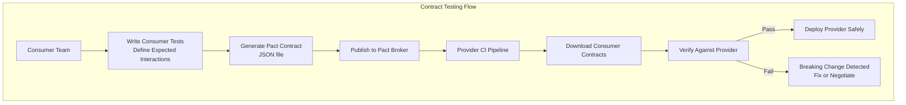
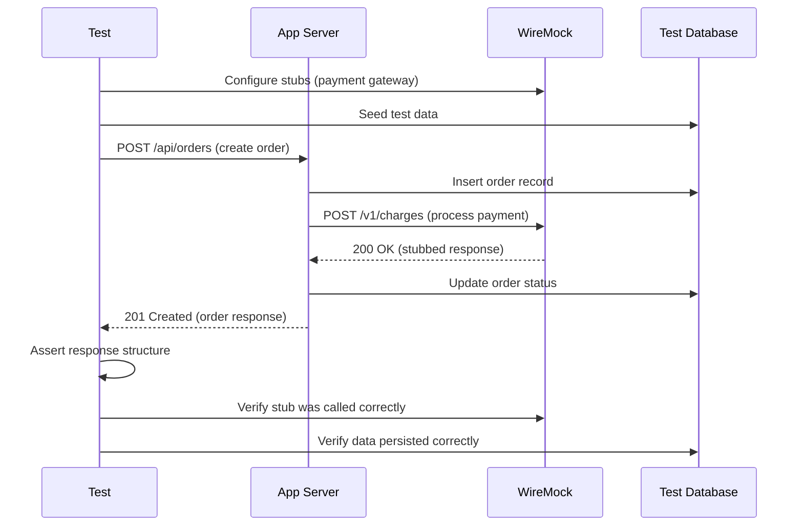
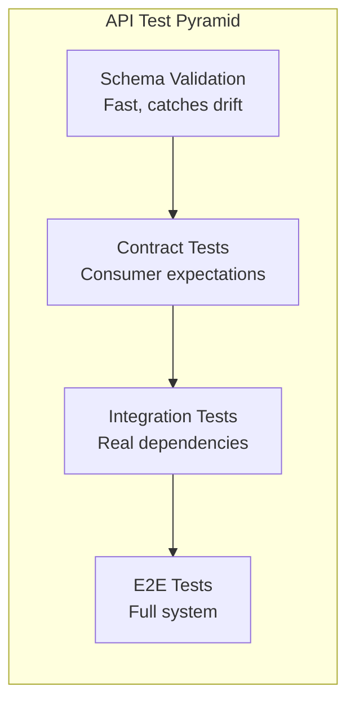

# API & Contract Testing

## Quick Reference

- API integration tests verify that HTTP endpoints return correct status codes, response bodies, headers, and handle error cases when called with real or near-real dependencies
- Contract testing (Pact) validates that consumer expectations match provider capabilities without requiring both services to run simultaneously
- Consumer-driven contracts shift API compatibility verification left — consumers define what they need, providers verify they satisfy all consumer contracts
- OpenAPI schema validation ensures responses conform to the documented API specification, catching drift between documentation and implementation
- Service virtualization (WireMock, MockServer) creates deterministic test doubles for external dependencies, enabling reliable tests without network calls
- Testcontainers spins up real databases, message brokers, and services in Docker containers for integration tests, providing production-like fidelity
- GraphQL testing requires schema validation, query depth limiting, and resolver-level testing beyond simple HTTP status checks
- gRPC testing uses generated client stubs and validates protobuf message serialization, streaming behavior, and deadline propagation

## When to Use

API and contract testing fills the critical gap between unit tests (fast but isolated) and end-to-end tests (realistic but slow and flaky). Apply these techniques when:

- Building microservice architectures where services communicate over HTTP/gRPC and breaking changes in one service silently break consumers without contract tests
- Developing APIs consumed by multiple clients (mobile apps, web frontends, third-party integrations) where each consumer has different expectations about response shape and behavior
- Integrating with external services (payment gateways, identity providers, shipping APIs) that you cannot control but need to test against reliably
- Validating that API documentation (OpenAPI/Swagger specs) stays synchronized with actual implementation, preventing integration failures in production
- Testing complex request/response flows involving authentication, pagination, filtering, rate limiting, and error handling that unit tests cannot adequately cover

## Code Examples

### REST API Testing with Supertest (Node.js/Express)

```typescript
import request from 'supertest';
import { app } from '../src/app';
import { setupTestDatabase, teardownTestDatabase, seedUsers } from './helpers/db';
import { generateAuthToken } from './helpers/auth';

describe('Products API Integration Tests', () => {
  let authToken: string;
  let testUserId: string;

  beforeAll(async () => {
    await setupTestDatabase();
    const user = await seedUsers({ role: 'admin' });
    testUserId = user.id;
    authToken = generateAuthToken(user);
  });

  afterAll(async () => {
    await teardownTestDatabase();
  });

  describe('GET /api/products', () => {
    it('returns paginated products with correct structure', async () => {
      const response = await request(app)
        .get('/api/products')
        .query({ page: 1, limit: 10, category: 'electronics' })
        .set('Authorization', `Bearer ${authToken}`)
        .expect(200)
        .expect('Content-Type', /json/);

      expect(response.body).toMatchObject({
        data: expect.arrayContaining([
          expect.objectContaining({
            id: expect.any(String),
            name: expect.any(String),
            price: expect.any(Number),
            category: 'electronics',
            createdAt: expect.any(String)
          })
        ]),
        pagination: {
          page: 1,
          limit: 10,
          total: expect.any(Number),
          totalPages: expect.any(Number)
        }
      });

      // Verify pagination math
      const { total, totalPages, limit } = response.body.pagination;
      expect(totalPages).toBe(Math.ceil(total / limit));
      expect(response.body.data.length).toBeLessThanOrEqual(limit);
    });

    it('returns 401 without authentication', async () => {
      const response = await request(app)
        .get('/api/products')
        .expect(401);

      expect(response.body).toMatchObject({
        error: 'Unauthorized',
        message: expect.any(String)
      });
    });

    it('returns 400 for invalid query parameters', async () => {
      const response = await request(app)
        .get('/api/products')
        .query({ page: -1, limit: 10000 })
        .set('Authorization', `Bearer ${authToken}`)
        .expect(400);

      expect(response.body.errors).toEqual(
        expect.arrayContaining([
          expect.objectContaining({ field: 'page', message: expect.any(String) }),
          expect.objectContaining({ field: 'limit', message: expect.any(String) })
        ])
      );
    });
  });

  describe('POST /api/products', () => {
    it('creates a product and returns 201 with location header', async () => {
      const newProduct = {
        name: 'Test Widget',
        price: 29.99,
        category: 'electronics',
        description: 'A test product for integration testing'
      };

      const response = await request(app)
        .post('/api/products')
        .set('Authorization', `Bearer ${authToken}`)
        .send(newProduct)
        .expect(201);

      expect(response.headers['location']).toMatch(/\/api\/products\/[\w-]+/);
      expect(response.body).toMatchObject({
        ...newProduct,
        id: expect.any(String),
        createdAt: expect.any(String),
        createdBy: testUserId
      });

      // Verify the product actually persisted
      const getResponse = await request(app)
        .get(`/api/products/${response.body.id}`)
        .set('Authorization', `Bearer ${authToken}`)
        .expect(200);

      expect(getResponse.body.name).toBe(newProduct.name);
    });
  });
});
```

### Contract Testing with Pact (Consumer Side)

```typescript
import { PactV3, MatchersV3 } from '@pact-foundation/pact';
import { ProductApiClient } from '../src/clients/product-api-client';

const { like, eachLike, string, integer, decimal, datetime, regex } = MatchersV3;

const provider = new PactV3({
  consumer: 'OrderService',
  provider: 'ProductService',
  logLevel: 'warn'
});

describe('Product Service Contract (Consumer)', () => {
  describe('GET /api/products/:id', () => {
    it('returns product details when product exists', async () => {
      // Define the expected interaction
      await provider
        .given('a product with ID prod-123 exists')
        .uponReceiving('a request for product prod-123')
        .withRequest({
          method: 'GET',
          path: '/api/products/prod-123',
          headers: {
            Accept: 'application/json',
            Authorization: regex(/Bearer [\w-]+\.[\w-]+\.[\w-]+/, 'Bearer eyJ.test.token')
          }
        })
        .willRespondWith({
          status: 200,
          headers: { 'Content-Type': 'application/json' },
          body: {
            id: string('prod-123'),
            name: string('Premium Widget'),
            price: decimal(49.99),
            stock: integer(150),
            category: string('electronics'),
            createdAt: datetime("yyyy-MM-dd'T'HH:mm:ss.SSS'Z'", '2024-01-15T10:30:00.000Z')
          }
        });

      // Execute the test against the mock provider
      await provider.executeTest(async (mockServer) => {
        const client = new ProductApiClient(mockServer.url, 'Bearer eyJ.test.token');
        const product = await client.getProduct('prod-123');

        expect(product.id).toBe('prod-123');
        expect(product.name).toBe('Premium Widget');
        expect(product.price).toBe(49.99);
        expect(typeof product.stock).toBe('number');
      });
    });

    it('returns 404 when product does not exist', async () => {
      await provider
        .given('no product with ID nonexistent exists')
        .uponReceiving('a request for a nonexistent product')
        .withRequest({
          method: 'GET',
          path: '/api/products/nonexistent',
          headers: { Accept: 'application/json', Authorization: regex(/Bearer .+/, 'Bearer token') }
        })
        .willRespondWith({
          status: 404,
          body: {
            error: string('Not Found'),
            message: string('Product not found')
          }
        });

      await provider.executeTest(async (mockServer) => {
        const client = new ProductApiClient(mockServer.url, 'Bearer token');
        await expect(client.getProduct('nonexistent')).rejects.toThrow('Product not found');
      });
    });
  });
});
```

### Provider Verification (Pact Provider Side)

```typescript
import { Verifier } from '@pact-foundation/pact';
import { app } from '../src/app';
import { seedProduct, clearDatabase } from './helpers/db';

describe('Product Service Contract Verification (Provider)', () => {
  let server: any;

  beforeAll(async () => {
    server = app.listen(4000);
  });

  afterAll(async () => {
    server.close();
  });

  it('validates all consumer contracts', async () => {
    const verifier = new Verifier({
      providerBaseUrl: 'http://localhost:4000',
      pactBrokerUrl: process.env.PACT_BROKER_URL,
      provider: 'ProductService',
      providerVersion: process.env.GIT_SHA,
      publishVerificationResult: process.env.CI === 'true',
      providerVersionBranch: process.env.GIT_BRANCH,

      // State handlers set up test data for each interaction
      stateHandlers: {
        'a product with ID prod-123 exists': async () => {
          await clearDatabase();
          await seedProduct({
            id: 'prod-123',
            name: 'Premium Widget',
            price: 49.99,
            stock: 150,
            category: 'electronics'
          });
        },
        'no product with ID nonexistent exists': async () => {
          await clearDatabase();
        }
      }
    });

    await verifier.verifyProvider();
  });
});
```

### OpenAPI Schema Validation

```typescript
import { OpenAPISchemaValidator } from 'express-openapi-validator';
import SwaggerParser from '@apidevtools/swagger-parser';
import request from 'supertest';
import { app } from '../src/app';

describe('OpenAPI Schema Compliance', () => {
  let apiSpec: any;

  beforeAll(async () => {
    apiSpec = await SwaggerParser.dereference('./openapi.yaml');
  });

  it('GET /api/products response matches OpenAPI schema', async () => {
    const response = await request(app)
      .get('/api/products')
      .set('Authorization', `Bearer ${validToken}`)
      .expect(200);

    const schema = apiSpec.paths['/api/products'].get.responses['200'].content['application/json'].schema;
    const ajv = new Ajv({ allErrors: true });
    const validate = ajv.compile(schema);
    const valid = validate(response.body);

    if (!valid) {
      console.error('Schema validation errors:', validate.errors);
    }
    expect(valid).toBe(true);
  });

  // Validate all endpoints automatically
  const endpoints = Object.entries(apiSpec.paths);
  endpoints.forEach(([path, methods]: [string, any]) => {
    Object.entries(methods).forEach(([method, spec]: [string, any]) => {
      if (['get', 'post', 'put', 'delete', 'patch'].includes(method)) {
        it(`${method.toUpperCase()} ${path} response conforms to schema`, async () => {
          // Dynamic test generation for all documented endpoints
          const response = await makeRequest(app, method, path, spec);
          validateResponseAgainstSchema(response, spec);
        });
      }
    });
  });
});
```

### WireMock Service Virtualization

```typescript
import { WireMockRestClient } from 'wiremock-rest-client';
import { GenericContainer, StartedTestContainer } from 'testcontainers';

describe('Payment Service Integration (with WireMock)', () => {
  let wireMock: WireMockRestClient;
  let container: StartedTestContainer;

  beforeAll(async () => {
    // Start WireMock in a container
    container = await new GenericContainer('wiremock/wiremock:3.3.1')
      .withExposedPorts(8080)
      .start();

    const wireMockUrl = `http://${container.getHost()}:${container.getMappedPort(8080)}`;
    wireMock = new WireMockRestClient(wireMockUrl);
  });

  afterAll(async () => {
    await container.stop();
  });

  beforeEach(async () => {
    await wireMock.global.resetAll();
  });

  it('processes payment successfully', async () => {
    // Stub the external payment gateway
    await wireMock.mappings.createMapping({
      request: {
        method: 'POST',
        urlPath: '/v1/charges',
        headers: { 'Authorization': { equalTo: 'Bearer sk_test_key' } },
        bodyPatterns: [{ matchesJsonPath: '$.amount' }, { matchesJsonPath: '$.currency' }]
      },
      response: {
        status: 200,
        jsonBody: {
          id: 'ch_test_123',
          status: 'succeeded',
          amount: 2999,
          currency: 'usd'
        },
        headers: { 'Content-Type': 'application/json' }
      }
    });

    // Test our service against the stub
    const result = await paymentService.processPayment({
      amount: 29.99,
      currency: 'usd',
      customerId: 'cust-456'
    });

    expect(result.status).toBe('succeeded');
    expect(result.chargeId).toBe('ch_test_123');

    // Verify the external call was made correctly
    const calls = await wireMock.requests.getCount({
      method: 'POST',
      url: '/v1/charges'
    });
    expect(calls.count).toBe(1);
  });

  it('handles payment gateway timeout gracefully', async () => {
    await wireMock.mappings.createMapping({
      request: { method: 'POST', urlPath: '/v1/charges' },
      response: {
        status: 200,
        fixedDelayMilliseconds: 10000,  // Simulate timeout
        jsonBody: { id: 'ch_delayed' }
      }
    });

    await expect(
      paymentService.processPayment({ amount: 29.99, currency: 'usd', customerId: 'cust-456' })
    ).rejects.toThrow('Payment gateway timeout');
  });
});
```

### GraphQL Integration Testing

```typescript
import request from 'supertest';
import { app } from '../src/app';
import { seedDatabase } from './helpers/db';

describe('GraphQL API Integration Tests', () => {
  beforeAll(async () => {
    await seedDatabase();
  });

  it('queries products with nested relationships', async () => {
    const query = `
      query GetProducts($category: String!, $first: Int!) {
        products(category: $category, first: $first) {
          edges {
            node {
              id
              name
              price
              reviews(first: 3) {
                averageRating
                edges {
                  node {
                    rating
                    comment
                    author { name }
                  }
                }
              }
            }
          }
          pageInfo {
            hasNextPage
            endCursor
          }
        }
      }
    `;

    const response = await request(app)
      .post('/graphql')
      .set('Authorization', `Bearer ${authToken}`)
      .send({ query, variables: { category: 'electronics', first: 5 } })
      .expect(200);

    expect(response.body.errors).toBeUndefined();
    expect(response.body.data.products.edges).toHaveLength(5);
    expect(response.body.data.products.edges[0].node).toMatchObject({
      id: expect.any(String),
      name: expect.any(String),
      price: expect.any(Number),
      reviews: expect.objectContaining({
        averageRating: expect.any(Number)
      })
    });
  });

  it('rejects queries exceeding depth limit', async () => {
    const deepQuery = `
      query {
        products(first: 1) {
          edges {
            node {
              reviews(first: 1) {
                edges {
                  node {
                    author {
                      orders(first: 1) {
                        edges {
                          node {
                            products(first: 1) {
                              edges { node { name } }
                            }
                          }
                        }
                      }
                    }
                  }
                }
              }
            }
          }
        }
      }
    `;

    const response = await request(app)
      .post('/graphql')
      .send({ query: deepQuery })
      .set('Authorization', `Bearer ${authToken}`)
      .expect(200);

    expect(response.body.errors[0].message).toContain('exceeds maximum depth');
  });
});
```

## Architecture / Diagrams







## Common Pitfalls

**Testing against shared environments instead of isolated instances.** When multiple test suites or CI pipelines share a test database or service instance, tests become flaky due to data conflicts and race conditions. Use Testcontainers to spin up isolated dependencies per test suite, or implement strict data isolation with unique prefixes and cleanup hooks. Shared environments should only be used for manual exploratory testing, never automated suites.

**Contract tests that are too strict about response structure.** Pact matchers should validate types and structure, not exact values. A contract that expects `"name": "Widget A"` breaks when the provider changes test data. Use `like()` for type matching, `eachLike()` for array structure, and `regex()` for format validation. The contract should answer "does the response have the fields I need with the right types?" not "does it return this exact data?"

**Not testing error paths and edge cases in API tests.** Teams often test only the happy path (200 OK) and miss critical error scenarios: 401 with expired tokens, 403 with insufficient permissions, 409 on duplicate creation, 422 on validation failures, 429 on rate limiting, and 503 on downstream failures. Each error response has a contract too — consumers need to know the error response structure to handle failures gracefully.

**Ignoring test execution time as the suite grows.** API integration tests that start containers, seed databases, and make HTTP calls are inherently slower than unit tests. Without optimization, a suite of 200 API tests can take 15+ minutes. Mitigate by: reusing containers across test files (global setup), parallelizing independent test suites, using transactions for data isolation (rollback instead of re-seed), and categorizing tests into fast (mocked dependencies) and slow (real dependencies) tiers.

**WireMock stubs that don't match production behavior.** Service virtualization is only valuable if stubs accurately represent the real service. Stubs that always return 200 OK miss timeout scenarios, rate limits, partial failures, and response format changes. Regularly record real traffic to update stubs, validate stubs against the provider's OpenAPI spec, and include failure scenarios (5xx, timeouts, malformed responses) in your stub library.

**Not versioning contracts alongside code changes.** When a consumer updates its contract expectations without coordinating with the provider, the provider's CI breaks unexpectedly. Use Pact Broker's "can I deploy" feature to check compatibility before deploying either side. Tag contracts with branch names and environments to track which version of the contract is deployed where.

## Real-World Use Cases

**Microservice Migration with Contract Safety Net.** A monolithic e-commerce application is being decomposed into microservices. Before extracting the order service, the team writes Pact contracts for every internal API call the order logic makes (to inventory, pricing, customer services). As each service is extracted, provider verification ensures the new service satisfies all existing consumers. This catches breaking changes during extraction — a field renamed from `customerId` to `customer_id` is detected immediately rather than in production.

**Third-Party Payment Integration Testing.** A fintech application integrates with Stripe, PayPal, and bank transfer APIs. WireMock stubs simulate each provider's behavior including: successful charges, declined cards (various reason codes), 3D Secure challenges, webhook deliveries, idempotency key handling, and rate limiting. The test suite covers 47 distinct scenarios without making real API calls, runs in 30 seconds, and catches regressions when the team updates the payment abstraction layer.

**API-First Development with Schema Validation.** A team practices API-first development: they write the OpenAPI specification before implementing endpoints. Integration tests validate that every endpoint's response matches the spec exactly. When a developer adds a field to the response without updating the spec, tests fail. When the spec adds a required field that the implementation doesn't return, tests fail. This bidirectional validation keeps documentation and implementation permanently synchronized.

## Interview Questions

**Q: What is consumer-driven contract testing and how does it differ from traditional integration testing?**

A: Consumer-driven contract testing inverts the traditional approach. Instead of the provider defining its API and consumers adapting, each consumer defines a contract specifying exactly what it needs from the provider (which endpoints, which fields, which response codes). The provider then verifies it satisfies all consumer contracts. This differs from integration testing in several ways: contracts test at the boundary without requiring both services to run simultaneously, they're faster (no network calls in consumer tests), they pinpoint exactly which consumer breaks when a provider changes, and they enable independent deployment. Traditional integration tests verify the system works together but don't tell you which specific consumer-provider relationship broke or whether a change is safe to deploy.

**Q: How would you design a testing strategy for a service that depends on 5 external APIs?**

A: Layer the strategy by fidelity and speed. Layer 1: Unit tests with mocked HTTP clients — test business logic in isolation, fast feedback. Layer 2: Contract tests (if you control the providers) or schema validation tests (if external) — verify your client code handles the expected response shapes. Layer 3: WireMock-based integration tests — test your service end-to-end with deterministic stubs for all 5 dependencies, covering happy paths, error scenarios, timeouts, and partial failures. Layer 4: Periodic smoke tests against real sandbox/staging environments — catch drift between stubs and reality. Record real responses periodically to update WireMock stubs. For external APIs you don't control, maintain a stub library versioned by the provider's API version and update it when they release changes.

**Q: Explain the trade-offs between using real databases vs mocks in API integration tests.**

A: Real databases (via Testcontainers) provide high fidelity — you test actual SQL queries, constraints, indexes, and transaction behavior. They catch issues like: queries that work in H2 but fail in PostgreSQL, missing indexes causing timeouts, constraint violations, and migration compatibility. The trade-off is speed (container startup adds 5-15 seconds) and complexity (managing schemas, seeds, cleanup). Mocked repositories are fast and isolated but miss database-specific behavior entirely. The pragmatic approach: use real databases for repository/data-access tests and critical path integration tests, use mocks for business logic tests that happen to touch the database. Never use in-memory databases (H2, SQLite) as substitutes for production databases — they have different SQL dialects, locking behavior, and constraint enforcement.

**Q: How do you handle authentication in API integration tests without coupling to the auth provider?**

A: Create a test authentication helper that generates valid tokens without calling the real auth provider. For JWT-based auth: use the same signing key (or a test key configured in test environment) to mint tokens with any claims you need. For OAuth: stub the token introspection endpoint with WireMock. For session-based: directly insert session records into the session store. The key principle is that API tests should test your API's behavior, not the auth provider's behavior. Auth provider integration is tested separately. Provide helper functions like `generateAdminToken()`, `generateUserToken(userId)`, `generateExpiredToken()` that test authors use without understanding token internals.

## Production Tips

**Run contract verification in provider CI pipelines with "can I deploy" checks.** Before deploying a provider, query the Pact Broker's "can I deploy" endpoint to verify the new version satisfies all consumer contracts currently deployed in production. This prevents deploying breaking changes. Similarly, before deploying a consumer, verify that the provider in production satisfies the consumer's new contract. Integrate this as a required CI gate — no deployment proceeds without passing compatibility checks.

**Implement test data management strategies that scale.** As API test suites grow beyond 100 tests, naive approaches (truncate and re-seed before each test) become prohibitively slow. Use transaction rollback for read-heavy tests (wrap each test in a transaction, rollback after), unique data prefixes for write tests (each test creates data with a unique prefix, cleanup is optional), and shared reference data that tests never modify (lookup tables, configuration). For Testcontainers, reuse containers across test files with global setup/teardown rather than starting fresh containers per file.

**Monitor contract test coverage and identify untested interactions.** Track which consumer-provider interactions have contracts and which don't. A service with 20 endpoints but contracts covering only 5 has significant risk in the uncovered 15. Use Pact Broker's network diagram to visualize service dependencies and identify gaps. Prioritize contracts for: endpoints that change frequently, endpoints with multiple consumers, and endpoints involved in critical business flows (payments, authentication, order processing).

## Related Topics

- [Database Integration Testing](./database-testing.md) — Testing data persistence layers with real databases and Testcontainers
- [REST API Design](../../backend/api-design/rest-api-design.md) — API design principles that make APIs more testable
- [GraphQL](../../backend/api-design/graphql.md) — GraphQL-specific testing considerations for queries, mutations, and subscriptions
- [Unit Testing](../unit-testing/unit-testing.md) — How unit tests complement integration tests in the testing pyramid
