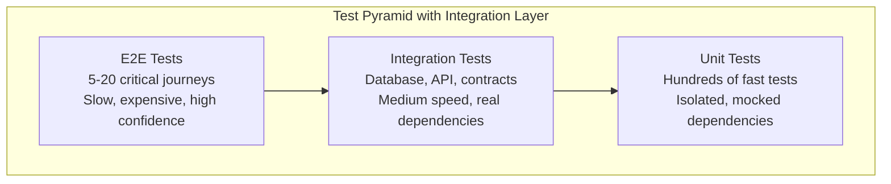
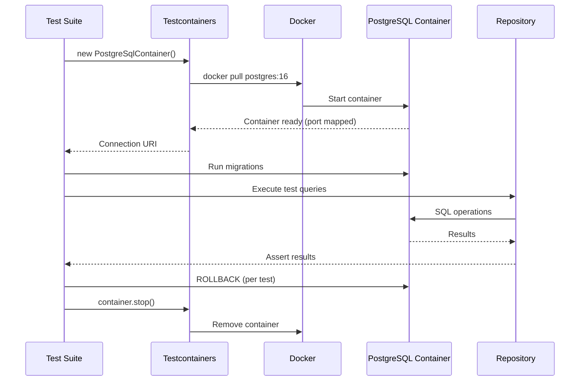
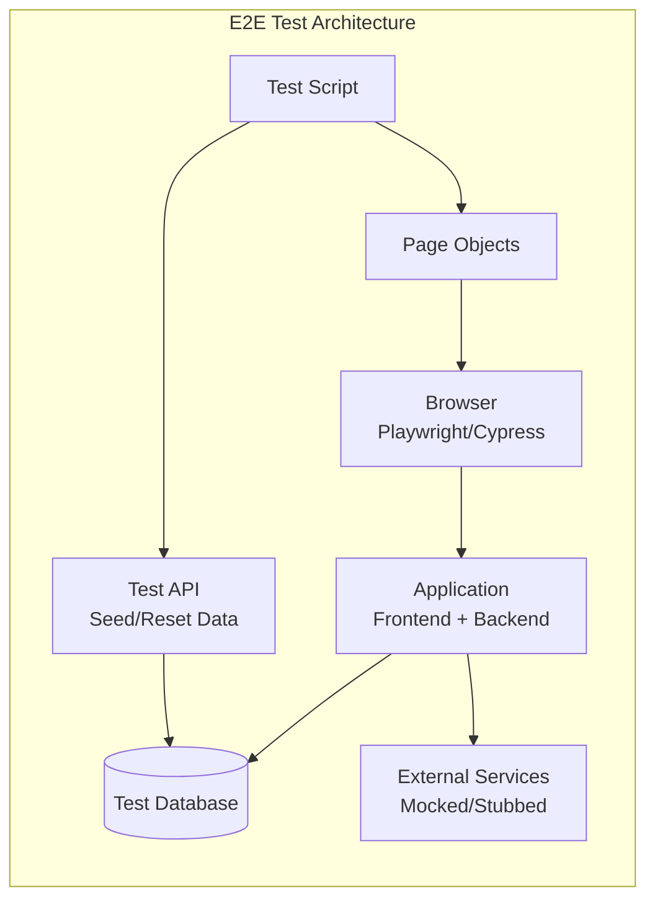
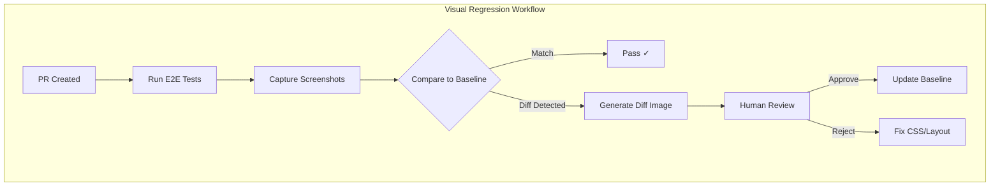

# Database Integration & End-to-End Testing

## Quick Reference

- **Testcontainers** spins up real databases (PostgreSQL, MongoDB, Redis, Elasticsearch) in Docker containers per test suite, providing production-equivalent behavior without shared infrastructure or mocking
- The **transaction rollback pattern** wraps each test in a database transaction and rolls back after assertions — provides fast isolation without re-seeding data between tests
- **Playwright** and **Cypress** are the two dominant E2E frameworks: Playwright supports multiple browsers natively (Chromium, Firefox, WebKit) with parallel execution; Cypress runs in-browser with excellent debugging but is Chromium-focused
- **Visual regression testing** (Percy, Chromatic, Playwright screenshots) captures pixel-level UI changes, catching CSS regressions that functional tests miss entirely
- **Test data builders** (Object Mother, Builder pattern) create valid domain objects with sensible defaults, allowing tests to specify only the fields relevant to the scenario under test
- **Database migration testing** verifies that schema changes apply cleanly to existing data and that rollbacks work correctly before deploying to production environments
- **Page Object Model** encapsulates page interactions behind a clean API, making E2E tests resilient to UI changes — when a selector changes, you update one page object, not 50 tests
- **Fixture management** strategies include: factory functions (flexible), SQL seed files (fast), snapshot restoration (consistent), and programmatic setup via API calls (realistic)
- E2E tests should cover critical user journeys (happy paths) and high-value business flows, not exhaustive feature coverage — aim for 5-20 E2E tests, not 500
- **Flaky test detection** requires retry mechanisms, deterministic waits (not `sleep`), and isolation from external dependencies (time, network, third-party services)

## When to Use

Database integration and E2E testing fill critical gaps that unit tests cannot cover. Apply these techniques when:

- Building data access layers where SQL queries involve joins, aggregations, window functions, or database-specific features (PostgreSQL JSONB, full-text search, CTEs) that cannot be validated without a real database engine
- Testing database migrations before deploying to production — ensuring that ALTER TABLE statements, data transformations, and index changes work correctly on tables with existing data and don't cause downtime
- Validating critical user journeys end-to-end — signup flows, checkout processes, payment integrations, and multi-step wizards where bugs at component boundaries cause revenue loss or user abandonment
- Catching visual regressions in UI-heavy applications where CSS changes in one component cascade unexpectedly to other pages, breaking layouts that functional tests don't verify
- Working with ORMs (Hibernate, Prisma, TypeORM) where generated SQL may differ from expectations, especially for complex relationships, lazy loading, N+1 query patterns, and transaction boundaries
- Verifying that application code correctly handles database constraints (unique violations, foreign key failures, check constraints, deadlocks) and translates them into appropriate user-facing errors

## Code Examples

### Testcontainers — PostgreSQL Integration Tests

```typescript
import { PostgreSqlContainer, StartedPostgreSqlContainer } from '@testcontainers/postgresql';
import { Pool } from 'pg';
import { migrate } from '../migrations';
import { UserRepository } from '../repositories/user-repository';

describe('UserRepository Integration Tests', () => {
  let container: StartedPostgreSqlContainer;
  let pool: Pool;
  let repository: UserRepository;

  beforeAll(async () => {
    // Start a real PostgreSQL container — takes 2-5 seconds
    container = await new PostgreSqlContainer('postgres:16-alpine')
      .withDatabase('testdb')
      .withUsername('test')
      .withPassword('test')
      .withExposedPorts(5432)
      .start();

    pool = new Pool({
      host: container.getHost(),
      port: container.getMappedPort(5432),
      database: container.getDatabase(),
      user: container.getUsername(),
      password: container.getPassword()
    });

    // Run migrations against the test database
    await migrate(pool);
    repository = new UserRepository(pool);
  }, 30000); // 30s timeout for container startup

  afterAll(async () => {
    await pool.end();
    await container.stop();
  });

  // Transaction rollback pattern — each test is isolated
  let client: PoolClient;
  beforeEach(async () => {
    client = await pool.connect();
    await client.query('BEGIN');
    repository = new UserRepository(client); // Use transaction client
  });

  afterEach(async () => {
    await client.query('ROLLBACK');
    client.release();
  });

  it('should create a user with all fields persisted correctly', async () => {
    const user = await repository.create({
      email: 'test@example.com',
      name: 'Test User',
      role: 'admin',
      preferences: { theme: 'dark', language: 'en' }
    });

    expect(user.id).toBeDefined();
    expect(user.email).toBe('test@example.com');
    expect(user.createdAt).toBeInstanceOf(Date);

    // Verify by reading back from database
    const found = await repository.findById(user.id);
    expect(found).toEqual(user);
    expect(found.preferences).toEqual({ theme: 'dark', language: 'en' });
  });

  it('should enforce unique email constraint', async () => {
    await repository.create({ email: 'duplicate@test.com', name: 'First', role: 'user' });

    await expect(
      repository.create({ email: 'duplicate@test.com', name: 'Second', role: 'user' })
    ).rejects.toThrow('User with this email already exists');
  });

  it('should handle concurrent updates with optimistic locking', async () => {
    const user = await repository.create({ email: 'lock@test.com', name: 'Lock Test', role: 'user' });

    // Simulate two concurrent reads
    const version1 = await repository.findById(user.id);
    const version2 = await repository.findById(user.id);

    // First update succeeds
    await repository.update(user.id, { name: 'Updated' }, version1.version);

    // Second update fails — version mismatch
    await expect(
      repository.update(user.id, { name: 'Conflict' }, version2.version)
    ).rejects.toThrow('Optimistic lock conflict');
  });

  it('should paginate results with correct total count', async () => {
    // Seed 25 users
    for (let i = 0; i < 25; i++) {
      await repository.create({ email: `user${i}@test.com`, name: `User ${i}`, role: 'user' });
    }

    const page1 = await repository.findAll({ page: 1, pageSize: 10 });
    expect(page1.data).toHaveLength(10);
    expect(page1.total).toBe(25);
    expect(page1.hasMore).toBe(true);

    const page3 = await repository.findAll({ page: 3, pageSize: 10 });
    expect(page3.data).toHaveLength(5);
    expect(page3.hasMore).toBe(false);
  });
});
```

### Testcontainers — Java/Spring Boot Example

```java
import org.junit.jupiter.api.Test;
import org.springframework.beans.factory.annotation.Autowired;
import org.springframework.boot.test.context.SpringBootTest;
import org.springframework.test.context.DynamicPropertyRegistry;
import org.springframework.test.context.DynamicPropertySource;
import org.testcontainers.containers.PostgreSQLContainer;
import org.testcontainers.junit.jupiter.Container;
import org.testcontainers.junit.jupiter.Testcontainers;

@SpringBootTest
@Testcontainers
class OrderRepositoryIntegrationTest {

    @Container
    static PostgreSQLContainer<?> postgres = new PostgreSQLContainer<>("postgres:16-alpine")
        .withDatabaseName("orders_test")
        .withUsername("test")
        .withPassword("test");

    @DynamicPropertySource
    static void configureProperties(DynamicPropertyRegistry registry) {
        registry.add("spring.datasource.url", postgres::getJdbcUrl);
        registry.add("spring.datasource.username", postgres::getUsername);
        registry.add("spring.datasource.password", postgres::getPassword);
    }

    @Autowired
    private OrderRepository orderRepository;

    @Autowired
    private TestEntityManager entityManager;

    @Test
    void shouldCalculateOrderTotalWithDiscounts() {
        // Arrange — using test data builder
        Order order = OrderBuilder.anOrder()
            .withItem("Widget", 10.00, 3)
            .withItem("Gadget", 25.00, 1)
            .withDiscount(DiscountType.PERCENTAGE, 10)
            .build();

        entityManager.persistAndFlush(order);
        entityManager.clear(); // Force reload from DB

        // Act
        OrderSummary summary = orderRepository.calculateSummary(order.getId());

        // Assert
        assertThat(summary.getSubtotal()).isEqualByComparingTo("55.00");
        assertThat(summary.getDiscount()).isEqualByComparingTo("5.50");
        assertThat(summary.getTotal()).isEqualByComparingTo("49.50");
    }

    @Test
    void shouldFindOrdersByDateRangeWithJoins() {
        // Tests complex SQL with joins, date filtering, and aggregation
        LocalDate today = LocalDate.now();
        createOrdersForDateRange(today.minusDays(30), today);

        List<OrderReport> report = orderRepository.getWeeklyReport(
            today.minusDays(7), today
        );

        assertThat(report).hasSize(7); // One entry per day
        assertThat(report).allSatisfy(entry -> {
            assertThat(entry.getOrderCount()).isGreaterThanOrEqualTo(0);
            assertThat(entry.getRevenue()).isNotNegative();
        });
    }
}
```

### Playwright — E2E Testing with Page Object Model

```typescript
import { test, expect, Page } from '@playwright/test';

// Page Object — encapsulates page interactions
class CheckoutPage {
  constructor(private page: Page) {}

  async fillShippingAddress(address: ShippingAddress) {
    await this.page.getByLabel('Full Name').fill(address.name);
    await this.page.getByLabel('Street Address').fill(address.street);
    await this.page.getByLabel('City').fill(address.city);
    await this.page.getByLabel('State').selectOption(address.state);
    await this.page.getByLabel('ZIP Code').fill(address.zip);
  }

  async selectShippingMethod(method: 'standard' | 'express' | 'overnight') {
    await this.page.getByRole('radio', { name: new RegExp(method, 'i') }).check();
  }

  async fillPaymentDetails(payment: PaymentDetails) {
    // Payment is in an iframe
    const frame = this.page.frameLocator('[data-testid="payment-frame"]');
    await frame.getByLabel('Card Number').fill(payment.cardNumber);
    await frame.getByLabel('Expiry').fill(payment.expiry);
    await frame.getByLabel('CVC').fill(payment.cvc);
  }

  async placeOrder() {
    await this.page.getByRole('button', { name: 'Place Order' }).click();
    await this.page.waitForURL(/\/order-confirmation\//);
  }

  async getOrderConfirmation(): Promise<{ orderId: string; total: string }> {
    const orderId = await this.page.getByTestId('order-id').textContent();
    const total = await this.page.getByTestId('order-total').textContent();
    return { orderId: orderId!, total: total! };
  }

  async getValidationErrors(): Promise<string[]> {
    const errors = this.page.locator('[role="alert"]');
    return errors.allTextContents();
  }
}

class ProductPage {
  constructor(private page: Page) {}

  async addToCart(productName: string, quantity = 1) {
    const product = this.page.locator(`[data-product-name="${productName}"]`);
    if (quantity > 1) {
      await product.getByLabel('Quantity').fill(String(quantity));
    }
    await product.getByRole('button', { name: 'Add to Cart' }).click();
    // Wait for cart badge to update
    await expect(this.page.getByTestId('cart-count')).not.toHaveText('0');
  }

  async goToCheckout() {
    await this.page.getByRole('link', { name: 'Checkout' }).click();
    await this.page.waitForURL('/checkout');
  }
}

// E2E Test — Critical User Journey
test.describe('Checkout Flow', () => {
  let productPage: ProductPage;
  let checkoutPage: CheckoutPage;

  test.beforeEach(async ({ page }) => {
    productPage = new ProductPage(page);
    checkoutPage = new CheckoutPage(page);
    // Seed test data via API
    await page.request.post('/api/test/seed-products');
    await page.goto('/products');
  });

  test('complete purchase with standard shipping', async ({ page }) => {
    // Add items to cart
    await productPage.addToCart('Wireless Headphones', 1);
    await productPage.addToCart('USB-C Cable', 2);
    await productPage.goToCheckout();

    // Fill checkout form
    await checkoutPage.fillShippingAddress({
      name: 'Jane Smith',
      street: '123 Main St',
      city: 'Portland',
      state: 'OR',
      zip: '97201'
    });
    await checkoutPage.selectShippingMethod('standard');
    await checkoutPage.fillPaymentDetails({
      cardNumber: '4242424242424242',
      expiry: '12/28',
      cvc: '123'
    });

    // Place order
    await checkoutPage.placeOrder();

    // Verify confirmation
    const confirmation = await checkoutPage.getOrderConfirmation();
    expect(confirmation.orderId).toMatch(/^ORD-[A-Z0-9]+$/);
    expect(confirmation.total).toContain('$');

    // Verify order appears in order history
    await page.goto('/account/orders');
    await expect(page.getByText(confirmation.orderId)).toBeVisible();
  });

  test('shows validation errors for incomplete form', async ({ page }) => {
    await productPage.addToCart('Wireless Headphones');
    await productPage.goToCheckout();

    // Try to place order without filling form
    await page.getByRole('button', { name: 'Place Order' }).click();

    const errors = await checkoutPage.getValidationErrors();
    expect(errors).toContain('Full name is required');
    expect(errors).toContain('Street address is required');
    expect(errors).toContain('Payment details are required');
  });
});

// Visual Regression Test
test.describe('Visual Regression', () => {
  test('product listing page matches snapshot', async ({ page }) => {
    await page.goto('/products');
    await page.waitForLoadState('networkidle');

    // Full page screenshot comparison
    await expect(page).toHaveScreenshot('product-listing.png', {
      maxDiffPixelRatio: 0.01, // Allow 1% pixel difference
      animations: 'disabled'
    });
  });

  test('checkout form states', async ({ page }) => {
    await page.goto('/checkout');

    // Empty state
    await expect(page.locator('.checkout-form')).toHaveScreenshot('checkout-empty.png');

    // Error state
    await page.getByRole('button', { name: 'Place Order' }).click();
    await expect(page.locator('.checkout-form')).toHaveScreenshot('checkout-errors.png');
  });
});
```

### Cypress — Component and E2E Testing

```typescript
// cypress/e2e/authentication.cy.ts
describe('Authentication Flow', () => {
  beforeEach(() => {
    cy.task('db:seed'); // Seed test database
    cy.visit('/login');
  });

  it('logs in with valid credentials and redirects to dashboard', () => {
    cy.getByTestId('email-input').type('user@example.com');
    cy.getByTestId('password-input').type('SecurePass123!');
    cy.getByTestId('login-button').click();

    // Should redirect to dashboard
    cy.url().should('include', '/dashboard');
    cy.getByTestId('welcome-message').should('contain', 'Welcome back');

    // Session should persist across page reload
    cy.reload();
    cy.url().should('include', '/dashboard');
    cy.getByTestId('welcome-message').should('be.visible');
  });

  it('shows error for invalid credentials without exposing details', () => {
    cy.getByTestId('email-input').type('user@example.com');
    cy.getByTestId('password-input').type('WrongPassword');
    cy.getByTestId('login-button').click();

    // Generic error message — don't reveal if email exists
    cy.getByTestId('error-message')
      .should('contain', 'Invalid email or password');

    // Should not redirect
    cy.url().should('include', '/login');
  });

  it('locks account after 5 failed attempts', () => {
    for (let i = 0; i < 5; i++) {
      cy.getByTestId('email-input').clear().type('user@example.com');
      cy.getByTestId('password-input').clear().type(`wrong${i}`);
      cy.getByTestId('login-button').click();
    }

    cy.getByTestId('error-message')
      .should('contain', 'Account locked. Please try again in 15 minutes.');

    // Even correct password should fail
    cy.getByTestId('email-input').clear().type('user@example.com');
    cy.getByTestId('password-input').clear().type('SecurePass123!');
    cy.getByTestId('login-button').click();
    cy.getByTestId('error-message').should('contain', 'Account locked');
  });
});

// Cypress API testing
describe('API Integration', () => {
  it('creates a resource and verifies database state', () => {
    cy.request({
      method: 'POST',
      url: '/api/products',
      headers: { Authorization: `Bearer ${Cypress.env('API_TOKEN')}` },
      body: {
        name: 'New Product',
        price: 29.99,
        category: 'electronics'
      }
    }).then((response) => {
      expect(response.status).to.eq(201);
      expect(response.body.id).to.be.a('string');
      expect(response.body.createdAt).to.be.a('string');

      // Verify via GET
      cy.request(`/api/products/${response.body.id}`).then((getResponse) => {
        expect(getResponse.body.name).to.eq('New Product');
        expect(getResponse.body.price).to.eq(29.99);
      });
    });
  });
});
```

### Database Migration Testing

```typescript
import { PostgreSqlContainer } from '@testcontainers/postgresql';
import { Pool } from 'pg';
import { readdir, readFile } from 'fs/promises';
import { join } from 'path';

describe('Database Migration Tests', () => {
  let container: StartedPostgreSqlContainer;
  let pool: Pool;

  beforeAll(async () => {
    container = await new PostgreSqlContainer('postgres:16-alpine').start();
    pool = new Pool({ connectionString: container.getConnectionUri() });
  }, 30000);

  afterAll(async () => {
    await pool.end();
    await container.stop();
  });

  it('all migrations apply cleanly in sequence', async () => {
    const migrationsDir = join(__dirname, '../../migrations');
    const files = (await readdir(migrationsDir))
      .filter(f => f.endsWith('.up.sql'))
      .sort();

    for (const file of files) {
      const sql = await readFile(join(migrationsDir, file), 'utf-8');
      await expect(pool.query(sql)).resolves.not.toThrow();
    }

    // Verify final schema has expected tables
    const tables = await pool.query(`
      SELECT table_name FROM information_schema.tables
      WHERE table_schema = 'public' ORDER BY table_name
    `);
    expect(tables.rows.map(r => r.table_name)).toContain('users');
    expect(tables.rows.map(r => r.table_name)).toContain('orders');
    expect(tables.rows.map(r => r.table_name)).toContain('products');
  });

  it('migrations are reversible — up then down returns to clean state', async () => {
    const migrationsDir = join(__dirname, '../../migrations');
    const upFiles = (await readdir(migrationsDir))
      .filter(f => f.endsWith('.up.sql')).sort();
    const downFiles = (await readdir(migrationsDir))
      .filter(f => f.endsWith('.down.sql')).sort().reverse();

    // Apply all up migrations
    for (const file of upFiles) {
      const sql = await readFile(join(migrationsDir, file), 'utf-8');
      await pool.query(sql);
    }

    // Apply all down migrations in reverse
    for (const file of downFiles) {
      const sql = await readFile(join(migrationsDir, file), 'utf-8');
      await expect(pool.query(sql)).resolves.not.toThrow();
    }

    // Verify no tables remain
    const tables = await pool.query(`
      SELECT table_name FROM information_schema.tables
      WHERE table_schema = 'public' AND table_type = 'BASE TABLE'
    `);
    expect(tables.rows).toHaveLength(0);
  });

  it('migration handles existing data correctly', async () => {
    // Apply migrations up to the one before the change
    await applyMigrationsUpTo(pool, '003_add_users_table');

    // Insert test data representing production state
    await pool.query(`
      INSERT INTO users (id, email, name) VALUES
      ('u1', 'alice@test.com', 'Alice'),
      ('u2', 'bob@test.com', 'Bob'),
      ('u3', NULL, 'Charlie')
    `);

    // Apply the migration that adds NOT NULL constraint with default
    await applyMigration(pool, '004_add_email_not_null');

    // Verify existing data was handled (NULL emails get default)
    const result = await pool.query('SELECT email FROM users WHERE id = $1', ['u3']);
    expect(result.rows[0].email).toBe('unknown@placeholder.com');

    // Verify constraint is enforced for new inserts
    await expect(
      pool.query("INSERT INTO users (id, name) VALUES ('u4', 'Dave')")
    ).rejects.toThrow(/null value in column "email"/);
  });
});
```


## Architecture / Diagrams









## Common Pitfalls

**Using shared test databases instead of isolated containers.** Shared databases cause test pollution — one test's data affects another, leading to order-dependent failures and flaky CI. Tests pass individually but fail when run together. Testcontainers solve this by giving each test suite its own database instance. The 2-5 second startup cost is worth the reliability. For faster iteration during development, use the transaction rollback pattern within a single container to isolate individual tests without container restart overhead.

**Writing E2E tests that depend on specific data existing in the database.** If your E2E test assumes "user@example.com" exists with specific orders, it breaks when someone modifies the seed data. Instead, have each test create its own data via API calls in `beforeEach`, or use a dedicated test seeding endpoint that creates a known state. This makes tests self-contained and runnable in any order. The tradeoff is slightly slower tests, but dramatically more reliable ones.

**Using `sleep()` or fixed timeouts instead of deterministic waits in E2E tests.** `cy.wait(3000)` or `await page.waitForTimeout(2000)` makes tests slow (always waits the full duration) and flaky (sometimes the operation takes longer). Use deterministic waits: `await page.waitForSelector('[data-testid="results"]')`, `cy.get('.loading').should('not.exist')`, or `await expect(page.locator('.item')).toHaveCount(5)`. These resolve as soon as the condition is met, making tests both faster and more reliable.

**Testing implementation details in E2E tests instead of user-visible behavior.** E2E tests that assert on CSS classes, internal state, or DOM structure break on every refactor. Test what users see and do: "the error message is visible," "the button is disabled," "the page shows 5 results." Use accessible selectors (roles, labels, text content) over implementation selectors (class names, IDs, data attributes). This makes tests resilient to UI refactoring while still catching real regressions.

**Not cleaning up test data between E2E test runs.** Tests that create users, orders, or other persistent data without cleanup accumulate garbage over time. This slows down the test database, causes unique constraint violations on re-runs, and makes debugging harder because you can't tell which data belongs to which test. Implement a cleanup strategy: truncate tables before each suite, use unique identifiers per run (timestamp prefix), or restore from a database snapshot between suites.

**Running too many E2E tests — treating them as the primary test layer.** E2E tests are 10-100x slower than unit tests and significantly more flaky due to browser rendering, network timing, and animation delays. Teams that write 500 E2E tests spend hours waiting for CI and constantly fight flakiness. Follow the test pyramid: 5-20 E2E tests for critical user journeys, 50-100 integration tests for API and database behavior, and hundreds of unit tests for business logic. If you're writing an E2E test for a utility function's edge case, it belongs in a unit test.

**Using in-memory databases (H2, SQLite) as substitutes for production databases.** H2 and SQLite have different SQL dialects, locking behavior, constraint enforcement, and query optimization than PostgreSQL or MySQL. Tests pass against H2 but fail in production because: JSON operators differ, window functions behave differently, transaction isolation levels aren't equivalent, and index usage patterns change. Use Testcontainers with the same database version as production. The slight speed penalty (real DB vs in-memory) is offset by catching real compatibility issues before deployment.

## Real-World Use Cases

**Financial Services — Transaction Processing with Audit Trail.** A payment processing system requires database integration tests that verify: (1) Double-spend prevention via database-level locks and constraints. (2) Audit trail completeness — every state transition (pending → processing → completed/failed) is recorded with timestamps and actor IDs. (3) Idempotency — processing the same payment request twice produces the same result without duplicate charges. (4) Concurrent access — two simultaneous withdrawals from the same account don't overdraw. Tests use Testcontainers with PostgreSQL, simulate concurrent transactions using multiple database connections, and verify that serializable isolation prevents race conditions. E2E tests cover the complete payment flow from initiation through confirmation email.

**Healthcare Platform — HIPAA-Compliant Data Access Testing.** A healthcare application tests that: (1) Role-based access controls are enforced at the database level — a nurse cannot query a patient outside their assigned ward. (2) Audit logs capture every data access with the requesting user, timestamp, and accessed records. (3) Data encryption at rest is verified by inspecting raw database storage. (4) Patient data deletion (right to be forgotten) cascades correctly through all related tables without orphaning records. Integration tests use Testcontainers with the exact PostgreSQL extensions (pgcrypto, row-level security policies) used in production. E2E tests verify that the UI correctly hides restricted data and that export functions redact sensitive fields.

**E-Commerce — Checkout Flow with Payment Integration.** A large e-commerce platform runs E2E tests against a staging environment with: (1) Stripe test mode for payment processing — verifying card validation, 3D Secure flows, and webhook handling. (2) Inventory management — adding items to cart, verifying stock availability at checkout, and handling out-of-stock scenarios gracefully. (3) Multi-currency pricing with tax calculation — verifying that displayed prices match charged amounts across different locales. (4) Visual regression testing on the checkout page across 5 viewport sizes (mobile, tablet, desktop, wide desktop, ultra-wide) to catch layout breaks. Playwright runs these tests in parallel across Chromium, Firefox, and WebKit, with Percy capturing screenshots for visual review on each PR.

## Interview Questions

**Q: How do you decide between Testcontainers and mocking the database in integration tests?**

A: Use Testcontainers (real database) when: testing SQL queries with joins, aggregations, or database-specific features; verifying constraint enforcement (unique, foreign key, check); testing migration scripts; validating ORM-generated SQL; or testing transaction isolation behavior. Use mocks when: testing business logic that happens to call a repository (mock the repository interface); testing error handling paths (easier to simulate specific failures); or when container startup time is unacceptable for the feedback loop (though this is rarely the case with modern Testcontainers). The key principle: mock at boundaries you own (your repository interface), but don't mock the database itself when testing data access code. A repository test with a mocked database proves nothing — it only verifies that your mock behaves as you expect, not that your SQL is correct.

**Q: How do you handle flaky E2E tests in CI/CD pipelines?**

A: Flaky tests erode team trust and slow delivery. Multi-layered approach: (1) **Prevention**: Use deterministic waits (waitForSelector, not sleep), isolate test data (each test creates its own), disable animations in test mode, and use stable selectors (data-testid, roles). (2) **Detection**: Track test pass rates over time — a test that fails 5% of runs is flaky even if it passes on retry. Quarantine flaky tests into a separate suite that doesn't block deployment. (3) **Retry strategy**: Allow 1-2 retries in CI but flag retried tests for investigation. A test that needs retries has a bug. (4) **Root cause analysis**: Common causes are timing issues (add explicit waits), shared state (isolate data), external dependencies (mock or stub), and resource contention (increase CI resources or reduce parallelism). (5) **Architecture**: Run E2E tests against a dedicated, stable environment — not a shared staging that other teams deploy to mid-test.

**Q: Explain the Page Object Model pattern. What are its benefits and when might you deviate from it?**

A: Page Object Model (POM) encapsulates page interactions behind a class with methods representing user actions and properties representing page state. Benefits: (1) Single point of change — when a selector changes, update one page object, not 50 tests. (2) Readable tests — `checkoutPage.fillShippingAddress(address)` is clearer than 5 lines of `page.fill()` calls. (3) Reusability — multiple tests share the same page interactions. (4) Abstraction — tests describe what the user does, not how the UI is structured. Deviations: For simple pages with 1-2 interactions, a page object adds unnecessary indirection. For component-level tests (testing a single widget), direct selectors are clearer. Some teams prefer "screenplay pattern" (action-focused) over page objects (page-focused) for complex workflows that span multiple pages. The key is consistency within a project — pick one pattern and apply it uniformly.

**Q: How would you implement visual regression testing in a CI/CD pipeline?**

A: Implementation steps: (1) **Capture**: Use Playwright's `toHaveScreenshot()` or a service like Percy/Chromatic to capture screenshots during E2E test runs. Capture at multiple viewport sizes and in both light/dark themes. (2) **Baseline management**: Store baseline screenshots in the repository (Playwright) or in the service's cloud (Percy). Update baselines explicitly when intentional visual changes are made. (3) **Comparison**: On each PR, compare new screenshots against baselines. Use perceptual diff algorithms that ignore anti-aliasing differences but catch layout shifts. Set a threshold (e.g., 0.1% pixel difference allowed) to avoid false positives from rendering engine variations. (4) **Review workflow**: When diffs are detected, generate side-by-side comparison images for human review. Integrate with PR checks — visual changes require explicit approval before merge. (5) **Stability**: Disable animations, use fixed timestamps/dates, mock dynamic content (avatars, ads), and ensure consistent font rendering across CI environments (install specific fonts in Docker).

**Q: What's the difference between Playwright and Cypress? When would you choose each?**

A: **Playwright**: Multi-browser (Chromium, Firefox, WebKit) with true parallel execution across browsers and test files. Runs outside the browser (Node.js process controlling browsers via CDP/WebSocket). Supports multiple tabs, browser contexts, and cross-origin navigation natively. Better for: teams needing cross-browser coverage, complex multi-tab scenarios, mobile browser testing (WebKit = Safari), and large test suites benefiting from parallelism. **Cypress**: Runs inside the browser alongside the application. Excellent debugging with time-travel snapshots, automatic waiting, and real-time reloading. Primarily Chromium-based (Firefox support is experimental). Better for: developer experience during test writing, component testing (renders components in isolation), teams that value the interactive test runner, and applications that only need Chromium testing. Key tradeoffs: Cypress has better DX for writing/debugging tests; Playwright has better CI performance and browser coverage. Cypress struggles with multi-tab and cross-origin; Playwright handles these natively. Both are production-ready choices — the decision often comes down to team preference and browser requirements.

## Production Tips

**Parallelize integration tests by using independent database containers per test file.** Instead of one shared container for all tests (which forces sequential execution or complex isolation), start a container per test file and run files in parallel. Modern CI systems (GitHub Actions, GitLab CI) support parallel jobs natively. With Testcontainers, container startup (2-5 seconds) is amortized across the test file's execution time (often 30-60 seconds). This can reduce total integration test time from 10 minutes to 2-3 minutes. Use `jest --maxWorkers=4` or `vitest --pool=forks` to control parallelism based on available CI resources.

**Implement a test data factory that generates realistic but deterministic data.** Use libraries like Faker.js with a fixed seed for reproducible random data, or build custom factories that create valid domain objects with sensible defaults. The factory should handle relationships (a valid Order requires a valid User and valid Products) without requiring tests to manually set up the entire object graph. Expose overrides for the specific fields each test cares about: `createOrder({ status: 'cancelled', items: 3 })` handles all other fields automatically. This reduces test setup from 20 lines to 1 line while maintaining data validity.

**Run E2E tests against a production-like environment, not the development server.** E2E tests against `localhost:3000` with hot-reload enabled miss issues caused by: production builds (minification, tree-shaking, code splitting), CDN caching, environment variables, CORS policies, and SSL/TLS. Build the application in production mode, serve it from a container matching your production infrastructure (nginx, CloudFront), and run E2E tests against that. This catches "works in dev, breaks in prod" issues before they reach users. Use Docker Compose to orchestrate the full stack (frontend, backend, database, cache) for E2E test environments.

**Monitor E2E test execution time and set performance budgets.** E2E tests that take 30+ minutes block deployment velocity. Track execution time per test and per suite over time. Set budgets: individual tests should complete in under 30 seconds, the full E2E suite in under 10 minutes. When tests exceed budgets, investigate: are they waiting unnecessarily (replace sleep with explicit waits), loading too much data (reduce seed data), or testing too many steps (split into focused tests). Consider running E2E tests in parallel across multiple CI machines using Playwright's sharding (`--shard=1/4`) to maintain fast feedback even as the suite grows.

## Related Topics

- [API & Contract Testing](./api-and-contract-testing.md) — REST, GraphQL, and gRPC testing with Pact consumer-driven contracts
- [Integration Testing Fundamentals](./integration-testing.md) — Core integration testing strategies and patterns
- [Unit Testing](../unit-testing/unit-testing.md) — Fast isolated tests that complement integration and E2E tests
- [Docker Fundamentals](../../infrastructure/docker/container-fundamentals.md) — Container basics underlying Testcontainers
- [CI/CD Pipelines](../../infrastructure/ci-cd/ci-cd-fundamentals.md) — Running integration and E2E tests in continuous integration
