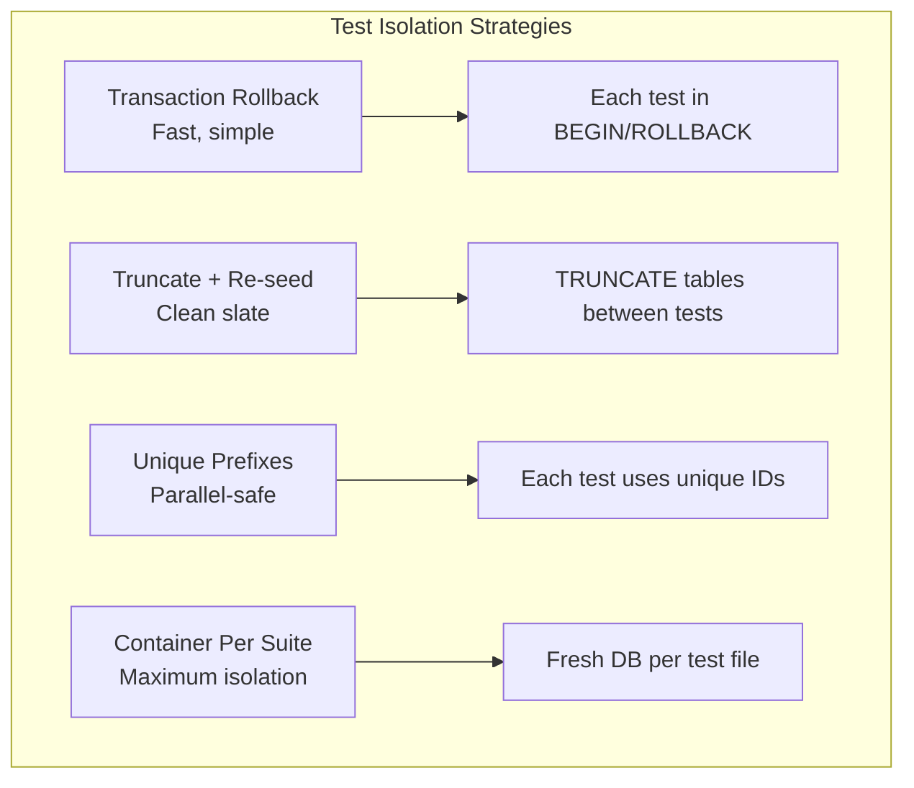
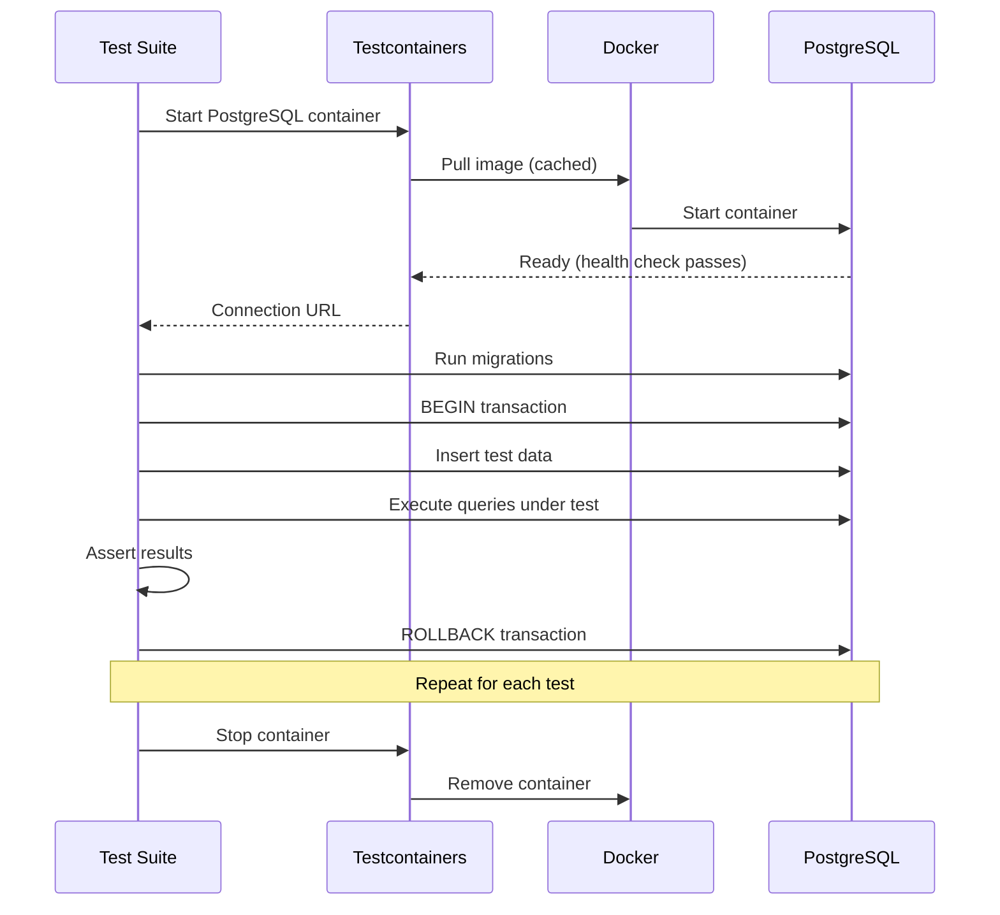
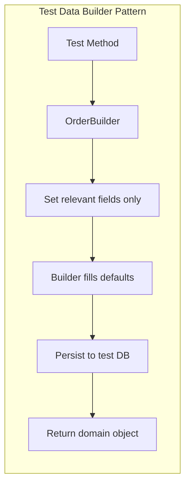

# Database Integration Testing

## Quick Reference

- Testcontainers provides disposable Docker containers for PostgreSQL, MongoDB, Redis, and other databases, giving tests production-equivalent behavior without shared infrastructure
- The transaction rollback pattern wraps each test in a database transaction and rolls back after assertions, providing fast isolation without re-seeding data
- Test data builders (Object Mother, Builder pattern) create valid domain objects with sensible defaults, allowing tests to specify only the fields relevant to the scenario
- Repository testing validates that queries return correct results, handle edge cases (empty results, large datasets), and respect database constraints
- Migration testing verifies that schema changes apply cleanly to existing data and that rollbacks work correctly before deploying to production
- In-memory databases (H2, SQLite) are faster but have different SQL dialects, locking behavior, and constraint enforcement than production databases — use real databases for fidelity
- Data integrity tests verify foreign key constraints, unique indexes, check constraints, and cascading deletes behave correctly under concurrent access

## When to Use

Database integration testing is essential whenever your application persists data and correctness depends on database behavior. Apply these techniques when:

- Building data access layers (repositories, DAOs) where SQL queries involve joins, aggregations, window functions, or database-specific features that cannot be validated without a real database engine
- Testing database migrations before deploying to production, ensuring that ALTER TABLE statements, data transformations, and index changes work correctly on existing data
- Validating that application code correctly handles database constraints (unique violations, foreign key failures, check constraints) and translates them into appropriate domain errors
- Working with ORMs (Hibernate, Prisma, TypeORM) where generated SQL may differ from expectations, especially for complex relationships, lazy loading, and N+1 query patterns
- Testing concurrent access patterns where race conditions, deadlocks, and isolation level behavior can only be reproduced with a real database engine

## Code Examples

### Testcontainers Setup for PostgreSQL (Java/JUnit 5)

```java
import org.junit.jupiter.api.*;
import org.testcontainers.containers.PostgreSQLContainer;
import org.testcontainers.junit.jupiter.Container;
import org.testcontainers.junit.jupiter.Testcontainers;
import org.springframework.boot.test.context.SpringBootTest;
import org.springframework.test.context.DynamicPropertyRegistry;
import org.springframework.test.context.DynamicPropertySource;

@Testcontainers
@SpringBootTest
@Transactional  // Each test runs in a transaction that rolls back
class OrderRepositoryIntegrationTest {

    @Container
    static PostgreSQLContainer<?> postgres = new PostgreSQLContainer<>("postgres:16-alpine")
        .withDatabaseName("testdb")
        .withUsername("test")
        .withPassword("test")
        .withInitScript("schema/init.sql");

    @DynamicPropertySource
    static void configureProperties(DynamicPropertyRegistry registry) {
        registry.add("spring.datasource.url", postgres::getJdbcUrl);
        registry.add("spring.datasource.username", postgres::getUsername);
        registry.add("spring.datasource.password", postgres::getPassword);
    }

    @Autowired
    private OrderRepository orderRepository;

    @Autowired
    private TestDataBuilder testData;

    @Test
    void findByCustomerId_returnsOrdersInDescendingDateOrder() {
        // Arrange — create test data using builder
        Customer customer = testData.aCustomer().withId("cust-1").build();
        Order order1 = testData.anOrder()
            .withCustomer(customer)
            .withCreatedAt(LocalDateTime.of(2024, 1, 15, 10, 0))
            .withStatus(OrderStatus.COMPLETED)
            .build();
        Order order2 = testData.anOrder()
            .withCustomer(customer)
            .withCreatedAt(LocalDateTime.of(2024, 3, 20, 14, 30))
            .withStatus(OrderStatus.PENDING)
            .build();

        // Act
        List<Order> orders = orderRepository.findByCustomerId("cust-1", PageRequest.of(0, 10));

        // Assert — most recent first
        assertThat(orders).hasSize(2);
        assertThat(orders.get(0).getCreatedAt()).isAfter(orders.get(1).getCreatedAt());
        assertThat(orders.get(0).getStatus()).isEqualTo(OrderStatus.PENDING);
    }

    @Test
    void save_enforcesUniqueConstraintOnOrderNumber() {
        Order order1 = testData.anOrder().withOrderNumber("ORD-001").build();

        Order duplicate = testData.anOrder().withOrderNumber("ORD-001").buildWithoutPersist();

        assertThatThrownBy(() -> orderRepository.save(duplicate))
            .isInstanceOf(DataIntegrityViolationException.class)
            .hasMessageContaining("unique constraint");
    }

    @Test
    void findByFilters_handlesComplexQueryWithPagination() {
        // Seed 50 orders across different statuses and date ranges
        testData.seedOrders(50, order -> order
            .withRandomStatus()
            .withCreatedAtBetween(LocalDate.of(2024, 1, 1), LocalDate.of(2024, 6, 30)));

        OrderFilter filter = OrderFilter.builder()
            .status(OrderStatus.COMPLETED)
            .dateFrom(LocalDate.of(2024, 3, 1))
            .dateTo(LocalDate.of(2024, 5, 31))
            .minAmount(BigDecimal.valueOf(100))
            .build();

        Page<Order> results = orderRepository.findByFilters(filter, PageRequest.of(0, 10));

        assertThat(results.getContent()).allSatisfy(order -> {
            assertThat(order.getStatus()).isEqualTo(OrderStatus.COMPLETED);
            assertThat(order.getCreatedAt()).isBetween(
                filter.getDateFrom().atStartOfDay(),
                filter.getDateTo().plusDays(1).atStartOfDay()
            );
            assertThat(order.getTotalAmount()).isGreaterThanOrEqualTo(BigDecimal.valueOf(100));
        });
    }
}
```

### Testcontainers with TypeScript (Node.js/Jest)

```typescript
import { GenericContainer, StartedTestContainer, Wait } from 'testcontainers';
import { Pool } from 'pg';
import { OrderRepository } from '../src/repositories/order-repository';
import { runMigrations } from '../src/db/migrations';

describe('OrderRepository Integration Tests', () => {
  let container: StartedTestContainer;
  let pool: Pool;
  let repository: OrderRepository;

  beforeAll(async () => {
    container = await new GenericContainer('postgres:16-alpine')
      .withEnvironment({
        POSTGRES_DB: 'testdb',
        POSTGRES_USER: 'test',
        POSTGRES_PASSWORD: 'test'
      })
      .withExposedPorts(5432)
      .withWaitStrategy(Wait.forLogMessage(/ready to accept connections/, 2))
      .start();

    pool = new Pool({
      host: container.getHost(),
      port: container.getMappedPort(5432),
      database: 'testdb',
      user: 'test',
      password: 'test'
    });

    await runMigrations(pool);
    repository = new OrderRepository(pool);
  }, 60000);  // Container startup can take time

  afterAll(async () => {
    await pool.end();
    await container.stop();
  });

  // Transaction rollback for test isolation
  let client: PoolClient;
  beforeEach(async () => {
    client = await pool.connect();
    await client.query('BEGIN');
  });

  afterEach(async () => {
    await client.query('ROLLBACK');
    client.release();
  });

  it('creates an order with line items in a single transaction', async () => {
    const order = await repository.create({
      customerId: 'cust-123',
      items: [
        { productId: 'prod-1', quantity: 2, unitPrice: 29.99 },
        { productId: 'prod-2', quantity: 1, unitPrice: 49.99 }
      ],
      shippingAddress: { street: '123 Main St', city: 'Portland', state: 'OR', zip: '97201' }
    });

    expect(order.id).toBeDefined();
    expect(order.orderNumber).toMatch(/^ORD-\d{8}$/);
    expect(order.totalAmount).toBe(109.97);  // (2 * 29.99) + 49.99

    // Verify line items persisted
    const retrieved = await repository.findById(order.id);
    expect(retrieved?.items).toHaveLength(2);
    expect(retrieved?.items[0].productId).toBe('prod-1');
  });

  it('handles concurrent order creation without duplicate order numbers', async () => {
    const promises = Array.from({ length: 10 }, (_, i) =>
      repository.create({
        customerId: `cust-${i}`,
        items: [{ productId: 'prod-1', quantity: 1, unitPrice: 10 }],
        shippingAddress: { street: '123 Main', city: 'Test', state: 'OR', zip: '97201' }
      })
    );

    const orders = await Promise.all(promises);
    const orderNumbers = orders.map(o => o.orderNumber);
    const uniqueNumbers = new Set(orderNumbers);

    expect(uniqueNumbers.size).toBe(10);  // All unique
  });
});
```

### Test Data Builder Pattern

```typescript
// test/builders/order-builder.ts
import { faker } from '@faker-js/faker';

interface OrderData {
  id?: string;
  customerId: string;
  orderNumber: string;
  status: OrderStatus;
  items: OrderItem[];
  totalAmount: number;
  createdAt: Date;
  shippingAddress: Address;
}

export class OrderBuilder {
  private data: OrderData;

  constructor(private pool: Pool) {
    // Sensible defaults — every field has a valid value
    this.data = {
      customerId: faker.string.uuid(),
      orderNumber: `ORD-${faker.string.numeric(8)}`,
      status: OrderStatus.PENDING,
      items: [this.defaultItem()],
      totalAmount: 29.99,
      createdAt: faker.date.recent({ days: 30 }),
      shippingAddress: this.defaultAddress()
    };
  }

  withCustomerId(id: string): this {
    this.data.customerId = id;
    return this;
  }

  withStatus(status: OrderStatus): this {
    this.data.status = status;
    return this;
  }

  withItems(items: OrderItem[]): this {
    this.data.items = items;
    this.data.totalAmount = items.reduce((sum, i) => sum + i.quantity * i.unitPrice, 0);
    return this;
  }

  withCreatedAt(date: Date): this {
    this.data.createdAt = date;
    return this;
  }

  withTotalAmountAbove(min: number): this {
    const price = min + faker.number.float({ min: 1, max: 100 });
    this.data.items = [{ productId: faker.string.uuid(), quantity: 1, unitPrice: price }];
    this.data.totalAmount = price;
    return this;
  }

  async build(): Promise<Order> {
    const result = await this.pool.query(
      `INSERT INTO orders (customer_id, order_number, status, total_amount, created_at, shipping_address)
       VALUES ($1, $2, $3, $4, $5, $6) RETURNING *`,
      [this.data.customerId, this.data.orderNumber, this.data.status,
       this.data.totalAmount, this.data.createdAt, JSON.stringify(this.data.shippingAddress)]
    );

    // Insert line items
    for (const item of this.data.items) {
      await this.pool.query(
        `INSERT INTO order_items (order_id, product_id, quantity, unit_price)
         VALUES ($1, $2, $3, $4)`,
        [result.rows[0].id, item.productId, item.quantity, item.unitPrice]
      );
    }

    return this.mapToOrder(result.rows[0]);
  }

  buildWithoutPersist(): OrderData {
    return { ...this.data };
  }

  private defaultItem(): OrderItem {
    return { productId: faker.string.uuid(), quantity: 1, unitPrice: 29.99 };
  }

  private defaultAddress(): Address {
    return {
      street: faker.location.streetAddress(),
      city: faker.location.city(),
      state: faker.location.state({ abbreviated: true }),
      zip: faker.location.zipCode()
    };
  }
}

// Usage in tests:
// const order = await new OrderBuilder(pool).withStatus(OrderStatus.SHIPPED).build();
```

### Migration Testing

```typescript
import { GenericContainer, StartedTestContainer } from 'testcontainers';
import { Pool } from 'pg';
import { Umzug, SequelizeStorage } from 'umzug';

describe('Database Migration Tests', () => {
  let container: StartedTestContainer;
  let pool: Pool;

  beforeAll(async () => {
    container = await new GenericContainer('postgres:16-alpine')
      .withEnvironment({ POSTGRES_DB: 'migration_test', POSTGRES_USER: 'test', POSTGRES_PASSWORD: 'test' })
      .withExposedPorts(5432)
      .start();

    pool = new Pool({
      host: container.getHost(),
      port: container.getMappedPort(5432),
      database: 'migration_test',
      user: 'test',
      password: 'test'
    });
  });

  afterAll(async () => {
    await pool.end();
    await container.stop();
  });

  it('all migrations apply cleanly to empty database', async () => {
    const umzug = createMigrator(pool);
    const pending = await umzug.pending();

    expect(pending.length).toBeGreaterThan(0);

    // Apply all migrations
    const executed = await umzug.up();
    expect(executed).toHaveLength(pending.length);

    // Verify final schema
    const tables = await pool.query(
      `SELECT table_name FROM information_schema.tables WHERE table_schema = 'public'`
    );
    expect(tables.rows.map(r => r.table_name)).toContain('orders');
    expect(tables.rows.map(r => r.table_name)).toContain('order_items');
    expect(tables.rows.map(r => r.table_name)).toContain('customers');
  });

  it('migrations are reversible (up then down)', async () => {
    const umzug = createMigrator(pool);

    // Apply all
    await umzug.up();

    // Rollback all
    await umzug.down({ to: 0 });

    // Verify clean state
    const tables = await pool.query(
      `SELECT table_name FROM information_schema.tables
       WHERE table_schema = 'public' AND table_name != 'migrations'`
    );
    expect(tables.rows).toHaveLength(0);
  });

  it('migration handles existing data correctly', async () => {
    const umzug = createMigrator(pool);

    // Apply migrations up to the one before our new migration
    await umzug.up({ to: '20240301_add_orders_table' });

    // Insert data in the old schema
    await pool.query(`
      INSERT INTO orders (id, customer_id, total, created_at)
      VALUES ('ord-1', 'cust-1', 99.99, NOW())
    `);

    // Apply the new migration that adds a column with default
    await umzug.up({ to: '20240315_add_order_status' });

    // Verify existing data has the default value
    const result = await pool.query(`SELECT status FROM orders WHERE id = 'ord-1'`);
    expect(result.rows[0].status).toBe('pending');  // Default value applied
  });
});
```

### MongoDB Integration Testing with Testcontainers

```typescript
import { MongoDBContainer, StartedMongoDBContainer } from '@testcontainers/mongodb';
import { MongoClient, Db, Collection } from 'mongodb';

describe('Product Catalog Repository (MongoDB)', () => {
  let container: StartedMongoDBContainer;
  let client: MongoClient;
  let db: Db;
  let collection: Collection;

  beforeAll(async () => {
    container = await new MongoDBContainer('mongo:7').start();
    client = new MongoClient(container.getConnectionString(), { directConnection: true });
    await client.connect();
    db = client.db('test_catalog');
    collection = db.collection('products');

    // Create indexes matching production
    await collection.createIndex({ category: 1, price: 1 });
    await collection.createIndex({ name: 'text', description: 'text' });
    await collection.createIndex({ sku: 1 }, { unique: true });
  }, 60000);

  afterAll(async () => {
    await client.close();
    await container.stop();
  });

  beforeEach(async () => {
    await collection.deleteMany({});
  });

  it('text search returns relevant products ranked by score', async () => {
    await collection.insertMany([
      { name: 'Wireless Bluetooth Headphones', category: 'audio', price: 79.99, sku: 'AUD-001' },
      { name: 'Wired Studio Headphones', category: 'audio', price: 149.99, sku: 'AUD-002' },
      { name: 'Bluetooth Speaker', category: 'audio', price: 49.99, sku: 'AUD-003' },
      { name: 'USB Keyboard', category: 'peripherals', price: 39.99, sku: 'PER-001' }
    ]);

    const results = await collection
      .find(
        { $text: { $search: 'bluetooth headphones' } },
        { score: { $meta: 'textScore' } }
      )
      .sort({ score: { $meta: 'textScore' } })
      .toArray();

    expect(results).toHaveLength(3);  // Matches bluetooth OR headphones
    expect(results[0].name).toContain('Bluetooth Headphones');  // Best match first
  });

  it('aggregation pipeline computes category statistics', async () => {
    await collection.insertMany([
      { name: 'Product A', category: 'electronics', price: 299.99, sku: 'E-1', soldCount: 150 },
      { name: 'Product B', category: 'electronics', price: 199.99, sku: 'E-2', soldCount: 300 },
      { name: 'Product C', category: 'clothing', price: 49.99, sku: 'C-1', soldCount: 500 }
    ]);

    const stats = await collection.aggregate([
      { $group: {
        _id: '$category',
        avgPrice: { $avg: '$price' },
        totalRevenue: { $sum: { $multiply: ['$price', '$soldCount'] } },
        productCount: { $sum: 1 }
      }},
      { $sort: { totalRevenue: -1 } }
    ]).toArray();

    expect(stats[0]._id).toBe('electronics');
    expect(stats[0].productCount).toBe(2);
    expect(stats[0].avgPrice).toBeCloseTo(249.99, 2);
  });
});
```

## Architecture / Diagrams







## Common Pitfalls

**Using H2 or SQLite as a substitute for PostgreSQL/MySQL in tests.** In-memory databases have different SQL dialects, different behavior for NULL handling, different locking semantics, and don't support database-specific features (PostgreSQL arrays, JSON operators, window functions, CTEs with recursive). Tests pass against H2 but fail in production. Always test against the same database engine you deploy to — Testcontainers makes this practical with minimal overhead (5-10 second startup for PostgreSQL).

**Not testing database constraints and relying solely on application-level validation.** Application validation can be bypassed (direct SQL access, race conditions, bugs in validation logic). Database constraints are the last line of defense. Test that unique constraints reject duplicates, foreign keys prevent orphaned records, check constraints reject invalid values, and NOT NULL columns reject nulls. These tests document the database's invariants and catch regressions when someone modifies the schema.

**Shared test database causing flaky tests in CI.** When multiple test suites or parallel CI jobs share a database, tests interfere with each other. One test inserts a record that another test's COUNT(*) assertion doesn't expect. Use per-suite containers (Testcontainers), transaction rollback isolation, or unique data prefixes. Never rely on test execution order — tests must be independent and idempotent.

**Slow test suites from excessive container restarts.** Starting a PostgreSQL container takes 3-8 seconds. If each test file starts its own container, a suite of 20 files wastes 60-160 seconds on startup alone. Use a shared container across the entire test run (global setup in Jest, `@Container` with `static` in JUnit). Isolate tests within the shared container using transactions or schema-per-test patterns.

**Not testing migration rollbacks.** Teams test that migrations apply forward but never test rollback. When a production deployment fails and you need to rollback, untested down migrations may fail, leaving the database in an inconsistent state. Test both directions: up applies cleanly, down reverses cleanly, and re-applying up after down produces the same schema. Include data migration tests that verify existing rows are transformed correctly.

**Ignoring connection pool behavior in tests.** Production applications use connection pools (HikariCP, pg-pool) with specific configurations (max connections, timeout, idle eviction). Tests that create a new connection per query miss pool exhaustion bugs, connection leak issues, and timeout behavior. Configure tests to use a pool with production-like settings (smaller max size to surface leaks faster).

## Real-World Use Cases

**E-Commerce Order Processing with Concurrent Access.** An order system must handle multiple users purchasing the last item in stock simultaneously. Database integration tests verify that the inventory decrement uses `SELECT FOR UPDATE` or optimistic locking (version column) to prevent overselling. Tests create 10 concurrent transactions all attempting to purchase the last unit — exactly one succeeds, nine receive "out of stock" errors. This behavior cannot be tested without a real database with proper transaction isolation.

**Multi-Tenant SaaS with Row-Level Security.** A SaaS application uses PostgreSQL Row-Level Security (RLS) policies to ensure tenants can only access their own data. Integration tests verify that: queries with tenant A's context never return tenant B's data, bulk operations respect tenant boundaries, and administrative queries (cross-tenant reports) work with elevated privileges. Tests create data for multiple tenants and verify isolation at the database level, not just the application level.

**Data Pipeline with Schema Evolution.** A data analytics platform ingests events with evolving schemas. Migration tests verify that: adding nullable columns doesn't break existing queries, renaming columns with views maintains backward compatibility, adding indexes doesn't lock tables for extended periods (using `CREATE INDEX CONCURRENTLY`), and data backfills complete correctly for millions of existing rows (tested with representative data volumes).

## Interview Questions

**Q: Why use Testcontainers instead of in-memory databases for integration testing?**

A: Testcontainers runs the actual production database engine in Docker, providing identical behavior for SQL dialect, constraints, indexes, locking, and database-specific features. In-memory databases (H2, SQLite) have subtle differences that cause tests to pass locally but fail in production: different NULL handling, missing support for JSONB operators, different transaction isolation behavior, and incompatible SQL syntax for advanced queries. The startup cost (5-10 seconds per container) is acceptable for integration test suites that run in CI. Testcontainers also supports reusable containers that persist across test runs during local development, eliminating the startup penalty for rapid iteration.

**Q: Explain the transaction rollback pattern for test isolation. What are its limitations?**

A: The transaction rollback pattern wraps each test in a database transaction (`BEGIN` before test, `ROLLBACK` after). Since the transaction never commits, test data never persists, providing perfect isolation without cleanup overhead. It's fast (no truncate/re-seed between tests) and simple. Limitations: (1) Tests cannot verify commit behavior or trigger post-commit hooks. (2) Tests that themselves use transactions (testing transaction boundaries) conflict with the outer test transaction. (3) Tests that spawn threads or async operations may use different connections outside the test transaction. (4) Some databases don't support nested transactions (savepoints work as a workaround). For tests that need to verify commit behavior, use truncate-and-reseed or unique data prefixes instead.

**Q: How would you test database migrations safely before deploying to production?**

A: Multi-layer approach: (1) Run migrations against an empty database in CI to verify they apply cleanly. (2) Run migrations against a database seeded with representative production-like data to catch data transformation issues. (3) Test rollback (down migration) to ensure you can revert if deployment fails. (4) For large tables, test migration duration — a migration that locks a 100M-row table for 30 minutes is unacceptable. Use `pg_stat_activity` monitoring in tests to detect long locks. (5) Test that the application works correctly with both the old and new schema during the migration window (backward compatibility). (6) In staging, run migrations against a recent production snapshot to catch edge cases in real data that synthetic test data misses.

**Q: What strategies exist for managing test data in large integration test suites?**

A: Four main strategies with different trade-offs. (1) Transaction rollback: fastest, zero cleanup, but limited to single-connection tests. (2) Truncate and re-seed: clean slate per test, slower but supports multi-connection scenarios. Optimize with `TRUNCATE CASCADE` (faster than DELETE). (3) Unique prefixes: each test creates data with a UUID prefix, no cleanup needed, supports parallel execution. Downside: assertions must filter by prefix. (4) Fixture snapshots: restore a database snapshot (pg_restore) before each suite, providing consistent starting state. Best for read-heavy test suites. Combine strategies: use transaction rollback for most tests, truncate for tests that verify transaction behavior, and fixtures for complex scenarios requiring extensive pre-existing data.

**Q: How do you test for N+1 query problems in ORM-based applications?**

A: Instrument the database connection to count queries executed during a test. Assert that loading a list of N entities with relationships executes a bounded number of queries (typically 2-3 for eager loading, not N+1). In Spring/Hibernate, use `DataSourceProxy` or Hibernate statistics. In TypeORM/Prisma, use query logging middleware. Write tests like: "loading 100 orders with their items should execute at most 3 queries." These tests catch regressions when someone adds a new relationship or changes a fetch strategy. Combine with slow query log analysis — if a test takes longer than expected, check the query count. Some teams add query count assertions to critical path tests as performance regression guards.

## Production Tips

**Use container reuse during local development to eliminate startup latency.** Testcontainers supports a `reuse` flag that keeps containers running between test runs. The first run starts the container (5-10 seconds), subsequent runs connect to the existing container instantly. This makes the development feedback loop as fast as in-memory databases while maintaining production fidelity. Configure `.testcontainers.properties` with `testcontainers.reuse.enable=true` and add `.withReuse(true)` to container definitions.

**Implement database test fixtures as code, versioned alongside migrations.** Maintain a set of fixture SQL files or builder configurations that create representative test data. Version these alongside your migration files — when a migration changes the schema, update fixtures to match. This ensures tests always have valid data for the current schema. For large datasets needed for performance testing, use `pg_dump` snapshots of anonymized production data, refreshed monthly.

**Monitor test suite execution time and set budgets per test file.** Database integration tests are inherently slower than unit tests. Set a budget (e.g., 30 seconds per test file, 5 minutes total for the database test suite). When a file exceeds its budget, investigate: are tests creating too much data? Are queries unoptimized? Should some tests move to the unit layer with mocked repositories? Track execution time in CI and alert on regressions — a test that suddenly takes 10x longer often indicates a missing index or N+1 query introduced by a recent change.

**Test with production-representative data volumes, not just happy-path small datasets.** A query that works fine with 10 rows may timeout with 1 million rows due to missing indexes or inefficient query plans. Include at least one test per critical query that seeds a representative volume (thousands to tens of thousands of rows) and asserts the query completes within an acceptable time. Use `EXPLAIN ANALYZE` in tests to verify query plans use expected indexes. This catches performance regressions before they reach production.

## Related Topics

- [API & Contract Testing](./api-and-contract-testing.md) — Testing the HTTP layer that sits above the database layer
- [Integration Testing Overview](./integration-testing.md) — Broader integration testing strategies and patterns
- [PostgreSQL](../../databases/postgresql/postgresql.md) — PostgreSQL-specific features relevant to testing (RLS, JSONB, CTEs)
- [Docker Fundamentals](../../infrastructure/docker/container-fundamentals.md) — Understanding containers that power Testcontainers
